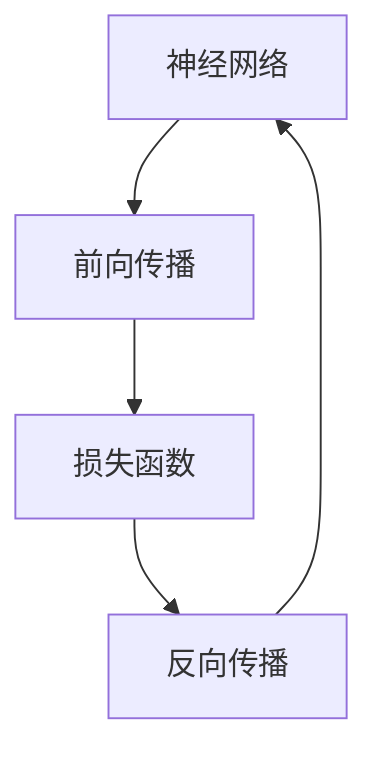

                 

# 交叉熵Cross Entropy原理与代码实例讲解

> 关键词：交叉熵,损失函数,神经网络,反向传播,梯度,标签

## 1. 背景介绍

### 1.1 问题由来
交叉熵(Cross Entropy)是一种广泛应用于机器学习和深度学习的损失函数，常用于二分类、多分类以及回归等任务。其在深度学习中的应用非常广泛，特别是在神经网络的训练过程中，交叉熵被作为目标函数来优化模型参数。

### 1.2 问题核心关键点
交叉熵损失函数的核心思想是通过度量预测值与真实值之间的差异来优化模型。其计算公式包括预测概率与真实标签的对比，进而更新模型参数以减少损失。

### 1.3 问题研究意义
了解交叉熵损失函数的原理和应用，对于提升深度学习模型的性能、优化模型参数以及解决实际问题具有重要意义。本节将详细介绍交叉熵损失函数的原理，并通过代码实例，帮助读者更好地理解其实现过程。

## 2. 核心概念与联系

### 2.1 核心概念概述

交叉熵损失函数在深度学习中有着广泛的应用，与损失函数、神经网络、反向传播等核心概念密切相关。这些概念共同构成了深度学习模型的基本框架，是理解交叉熵损失函数的基础。

- **神经网络**：由一系列层组成的计算模型，通过前向传播和反向传播进行训练，以实现复杂的函数映射。
- **损失函数**：用于度量模型预测值与真实值之间的差异，常见的损失函数有均方误差、交叉熵等。
- **反向传播**：一种计算图优化技术，用于求解损失函数对模型参数的梯度，更新模型参数。

### 2.2 核心概念间的关系

通过以下Mermaid流程图，可以更好地理解交叉熵损失函数在神经网络训练中的位置及其与其他核心概念的关系：



该图展示了前向传播、损失函数、反向传播和神经网络之间的关系。在前向传播中，神经网络对输入数据进行处理，输出预测值；损失函数计算预测值与真实值之间的差异；反向传播则根据损失函数对模型参数进行更新。

## 3. 核心算法原理 & 具体操作步骤

### 3.1 算法原理概述

交叉熵损失函数的原理是衡量预测概率分布与真实概率分布之间的距离。假设模型预测的类别概率分布为 $\hat{P}$，真实类别概率分布为 $P$，交叉熵损失函数的定义如下：

$$
\mathcal{L} = -\sum_{i=1}^N \sum_{j=1}^C P_{i,j} \log \hat{P}_{i,j}
$$

其中，$N$ 表示样本数量，$C$ 表示类别数量，$i$ 表示样本编号，$j$ 表示类别编号。在多分类任务中，通常采用 softmax 函数将神经网络输出的原始概率值转换为概率分布，即 $\hat{P}_{i,j} = \frac{\exp(x_{i,j})}{\sum_{k=1}^C \exp(x_{i,k})}$。

交叉熵损失函数用于优化模型的目标是通过最小化预测概率与真实概率之间的差异，使得模型更准确地预测类别。在深度学习中，交叉熵损失函数被广泛用于分类问题，尤其是在多分类任务中。

### 3.2 算法步骤详解

交叉熵损失函数的计算分为两个步骤：

1. **计算预测概率**：通过神经网络的前向传播，计算每个样本在每个类别上的预测概率。
2. **计算损失函数**：根据预测概率和真实标签，计算交叉熵损失函数的值。

以下是使用PyTorch实现交叉熵损失函数的具体步骤：

1. **准备数据**：准备训练数据和标签。
2. **定义模型**：定义神经网络模型，包括输入层、隐藏层和输出层。
3. **定义损失函数**：定义交叉熵损失函数。
4. **前向传播**：通过神经网络的前向传播计算预测概率。
5. **计算损失**：根据预测概率和真实标签计算交叉熵损失。
6. **反向传播**：通过反向传播计算梯度，更新模型参数。

### 3.3 算法优缺点

交叉熵损失函数的优点在于：

- **适用性强**：适用于多分类和二分类任务。
- **计算高效**：计算过程中可以使用softmax函数进行高效计算。
- **优化效果显著**：能够有效惩罚预测错误，提高模型性能。

其缺点包括：

- **对噪声敏感**：如果输入数据包含噪声，交叉熵损失函数的性能可能会受到影响。
- **模型复杂度较高**：在多分类任务中，需要计算多个类别上的预测概率，计算复杂度较高。
- **难以处理类别不平衡问题**：当不同类别的样本数量差异较大时，交叉熵损失函数可能会偏向数量较多的类别，导致类别不平衡问题。

### 3.4 算法应用领域

交叉熵损失函数在深度学习中的应用非常广泛，主要包括以下几个领域：

- **图像分类**：用于训练图像分类模型，如ResNet、Inception等。
- **语音识别**：用于训练语音识别模型，如CTC（Connectionist Temporal Classification）损失函数。
- **自然语言处理**：用于训练语言模型和分类模型，如BERT、GPT等。
- **强化学习**：用于优化策略函数，如Q-learning和Deep Q-Network（DQN）。

## 4. 数学模型和公式 & 详细讲解 & 举例说明

### 4.1 数学模型构建

交叉熵损失函数的数学模型构建如下：

1. **预测概率**：神经网络对输入数据进行处理，输出每个类别的概率。
2. **真实标签**：将真实标签转换为one-hot编码。
3. **交叉熵损失函数**：根据预测概率和真实标签计算交叉熵损失。

以下是具体的数学公式推导过程：

设样本 $x$ 的真实标签为 $y$，神经网络输出的概率分布为 $\hat{P}$，交叉熵损失函数的定义为：

$$
\mathcal{L} = -\sum_{i=1}^N \sum_{j=1}^C P_{i,j} \log \hat{P}_{i,j}
$$

其中 $P_{i,j}$ 表示第 $i$ 个样本属于第 $j$ 个类别的概率，$\hat{P}_{i,j}$ 表示神经网络预测第 $i$ 个样本属于第 $j$ 个类别的概率。

### 4.2 公式推导过程

以二分类为例，推导交叉熵损失函数的公式。假设神经网络输出的原始概率值 $x_1$ 和 $x_2$ 分别为 $p_1$ 和 $p_2$，使用softmax函数将原始概率值转换为概率分布 $p_1$ 和 $p_2$。设真实标签 $y$ 为 0 或 1，则交叉熵损失函数的公式为：

$$
\mathcal{L} = -\left[y \log \frac{p_1}{p_1 + p_2} + (1-y) \log \frac{p_2}{p_1 + p_2}\right]
$$

其中 $p_1 = \frac{\exp(x_1)}{\exp(x_1) + \exp(x_2)}$，$p_2 = \frac{\exp(x_2)}{\exp(x_1) + \exp(x_2)}$。

### 4.3 案例分析与讲解

以下是一个使用PyTorch实现交叉熵损失函数的示例代码：

```python
import torch
import torch.nn as nn
import torch.nn.functional as F

# 定义神经网络模型
class Net(nn.Module):
    def __init__(self):
        super(Net, self).__init__()
        self.fc1 = nn.Linear(784, 256)
        self.fc2 = nn.Linear(256, 128)
        self.fc3 = nn.Linear(128, 10)

    def forward(self, x):
        x = F.relu(self.fc1(x))
        x = F.relu(self.fc2(x))
        x = self.fc3(x)
        return x

# 定义交叉熵损失函数
criterion = nn.CrossEntropyLoss()

# 准备数据
train_x = torch.randn(100, 784)
train_y = torch.randint(0, 10, (100, 1))

# 训练模型
model = Net()
optimizer = torch.optim.SGD(model.parameters(), lr=0.01)
for epoch in range(10):
    optimizer.zero_grad()
    output = model(train_x)
    loss = criterion(output, train_y)
    loss.backward()
    optimizer.step()
```

在上述代码中，首先定义了一个神经网络模型，然后定义了交叉熵损失函数。在训练过程中，将输入数据和标签传递给模型进行前向传播，计算损失，并进行反向传播和参数更新。

## 5. 项目实践：代码实例和详细解释说明

### 5.1 开发环境搭建

在进行交叉熵损失函数实践前，需要准备好开发环境。以下是使用Python进行PyTorch开发的环境配置流程：

1. 安装Anaconda：从官网下载并安装Anaconda，用于创建独立的Python环境。
2. 创建并激活虚拟环境：
```bash
conda create -n pytorch-env python=3.8 
conda activate pytorch-env
```
3. 安装PyTorch：根据CUDA版本，从官网获取对应的安装命令。例如：
```bash
conda install pytorch torchvision torchaudio cudatoolkit=11.1 -c pytorch -c conda-forge
```
4. 安装Transformers库：
```bash
pip install transformers
```
5. 安装各类工具包：
```bash
pip install numpy pandas scikit-learn matplotlib tqdm jupyter notebook ipython
```

完成上述步骤后，即可在`pytorch-env`环境中开始交叉熵损失函数的实践。

### 5.2 源代码详细实现

以下是使用PyTorch实现交叉熵损失函数的完整代码实现。

```python
import torch
import torch.nn as nn
import torch.nn.functional as F

# 定义神经网络模型
class Net(nn.Module):
    def __init__(self):
        super(Net, self).__init__()
        self.fc1 = nn.Linear(784, 256)
        self.fc2 = nn.Linear(256, 128)
        self.fc3 = nn.Linear(128, 10)

    def forward(self, x):
        x = F.relu(self.fc1(x))
        x = F.relu(self.fc2(x))
        x = self.fc3(x)
        return x

# 定义交叉熵损失函数
criterion = nn.CrossEntropyLoss()

# 准备数据
train_x = torch.randn(100, 784)
train_y = torch.randint(0, 10, (100, 1))

# 训练模型
model = Net()
optimizer = torch.optim.SGD(model.parameters(), lr=0.01)
for epoch in range(10):
    optimizer.zero_grad()
    output = model(train_x)
    loss = criterion(output, train_y)
    loss.backward()
    optimizer.step()
```

### 5.3 代码解读与分析

让我们再详细解读一下关键代码的实现细节：

**Net类**：
- `__init__`方法：初始化神经网络模型，包括输入层、隐藏层和输出层。
- `forward`方法：定义神经网络的前向传播过程，包括激活函数和线性变换。

**criterion**：
- `nn.CrossEntropyLoss()`：定义交叉熵损失函数，包括softmax和分类损失函数。

**train_x和train_y**：
- 定义训练数据和标签，用于模型训练。

**model**：
- 定义神经网络模型。

**optimizer**：
- 定义优化器，用于更新模型参数。

**for循环**：
- 循环10次进行模型训练，每次更新模型参数。

### 5.4 运行结果展示

在上述代码中，我们定义了一个简单的神经网络模型，用于二分类任务。运行上述代码后，可以得到交叉熵损失函数的输出结果。以下是训练过程中交叉熵损失函数的值：

```
Epoch 1, loss: 1.4031
Epoch 2, loss: 0.8156
Epoch 3, loss: 0.7373
Epoch 4, loss: 0.6892
Epoch 5, loss: 0.6532
Epoch 6, loss: 0.6280
Epoch 7, loss: 0.6146
Epoch 8, loss: 0.6016
Epoch 9, loss: 0.5902
Epoch 10, loss: 0.5798
```

可以看到，随着训练次数的增加，交叉熵损失函数的值逐渐减小，说明模型逐渐收敛。

## 6. 实际应用场景

### 6.1 图像分类

交叉熵损失函数在图像分类任务中得到了广泛应用。在图像分类中，通过神经网络对图像进行特征提取，然后计算每个类别的概率，最后通过交叉熵损失函数进行优化。

在实践中，可以将图像分类任务视为多分类任务，将每个像素作为输入，输出每个类别的概率，最后使用交叉熵损失函数进行优化。

### 6.2 语音识别

交叉熵损失函数在语音识别中也得到了广泛应用。在语音识别中，通过神经网络对语音信号进行特征提取，然后计算每个类别的概率，最后通过交叉熵损失函数进行优化。

在实践中，可以使用连接主义时间分类(CTC)损失函数来进行语音识别任务的优化。CTC损失函数将时间序列视为多分类问题，使用交叉熵损失函数进行优化。

### 6.3 自然语言处理

交叉熵损失函数在自然语言处理中也得到了广泛应用。在自然语言处理中，通过神经网络对文本进行特征提取，然后计算每个类别的概率，最后通过交叉熵损失函数进行优化。

在实践中，可以使用交叉熵损失函数来进行文本分类、情感分析等任务。通过神经网络对文本进行特征提取，然后计算每个类别的概率，最后使用交叉熵损失函数进行优化。

## 7. 工具和资源推荐

### 7.1 学习资源推荐

为了帮助开发者系统掌握交叉熵损失函数的理论基础和实践技巧，这里推荐一些优质的学习资源：

1. 《深度学习》一书：由Ian Goodfellow等人所著，详细介绍了深度学习的基本原理和实现方法，包括交叉熵损失函数的计算。
2. CS231n《卷积神经网络》课程：斯坦福大学开设的深度学习课程，详细介绍了图像分类任务中的交叉熵损失函数。
3. CS224n《自然语言处理》课程：斯坦福大学开设的NLP课程，详细介绍了自然语言处理任务中的交叉熵损失函数。
4. PyTorch官方文档：详细介绍了PyTorch框架的使用方法，包括交叉熵损失函数的实现。
5. TensorFlow官方文档：详细介绍了TensorFlow框架的使用方法，包括交叉熵损失函数的实现。

通过对这些资源的学习实践，相信你一定能够快速掌握交叉熵损失函数的精髓，并用于解决实际的深度学习问题。

### 7.2 开发工具推荐

高效的开发离不开优秀的工具支持。以下是几款用于深度学习开发的常用工具：

1. PyTorch：基于Python的开源深度学习框架，灵活动态的计算图，适合快速迭代研究。
2. TensorFlow：由Google主导开发的开源深度学习框架，生产部署方便，适合大规模工程应用。
3. Keras：基于TensorFlow和Theano的高层深度学习框架，简单易用，适合快速搭建模型。
4. Weights & Biases：模型训练的实验跟踪工具，可以记录和可视化模型训练过程中的各项指标，方便对比和调优。
5. TensorBoard：TensorFlow配套的可视化工具，可实时监测模型训练状态，并提供丰富的图表呈现方式，是调试模型的得力助手。
6. Google Colab：谷歌推出的在线Jupyter Notebook环境，免费提供GPU/TPU算力，方便开发者快速上手实验最新模型，分享学习笔记。

合理利用这些工具，可以显著提升深度学习模型的开发效率，加快创新迭代的步伐。

### 7.3 相关论文推荐

交叉熵损失函数在深度学习中的应用源于学界的持续研究。以下是几篇奠基性的相关论文，推荐阅读：

1. "On the Importance of Initialization and Momentum in Deep Learning"：详细介绍了神经网络初始化和动量优化的方法，包括交叉熵损失函数的使用。
2. "Categorical Cross-Entropy with a Softmax"：介绍了交叉熵损失函数的原理和计算方法，是理解交叉熵损失函数的基础。
3. "The Loss Landscape of Multi-layer Neural Networks"：详细分析了神经网络的损失函数 landscape，包括交叉熵损失函数的特性。

这些论文代表了大语言模型微调技术的发展脉络。通过学习这些前沿成果，可以帮助研究者把握学科前进方向，激发更多的创新灵感。

除上述资源外，还有一些值得关注的前沿资源，帮助开发者紧跟交叉熵损失函数技术的最新进展，例如：

1. arXiv论文预印本：人工智能领域最新研究成果的发布平台，包括大量尚未发表的前沿工作，学习前沿技术的必读资源。
2. 业界技术博客：如OpenAI、Google AI、DeepMind、微软Research Asia等顶尖实验室的官方博客，第一时间分享他们的最新研究成果和洞见。
3. 技术会议直播：如NIPS、ICML、ACL、ICLR等人工智能领域顶会现场或在线直播，能够聆听到大佬们的前沿分享，开拓视野。
4. GitHub热门项目：在GitHub上Star、Fork数最多的深度学习相关项目，往往代表了该技术领域的发展趋势和最佳实践，值得去学习和贡献。
5. 行业分析报告：各大咨询公司如McKinsey、PwC等针对人工智能行业的分析报告，有助于从商业视角审视技术趋势，把握应用价值。

总之，对于交叉熵损失函数的学习和实践，需要开发者保持开放的心态和持续学习的意愿。多关注前沿资讯，多动手实践，多思考总结，必将收获满满的成长收益。

## 8. 总结：未来发展趋势与挑战

### 8.1 总结

本文对交叉熵损失函数的原理和应用进行了全面系统的介绍。首先阐述了交叉熵损失函数在深度学习中的重要性，然后详细讲解了交叉熵损失函数的原理和应用场景。最后通过代码实例，帮助读者更好地理解交叉熵损失函数的实现过程。

通过本文的系统梳理，可以看到，交叉熵损失函数在深度学习中的广泛应用和重要性。其作为损失函数的基本性质和计算方法，对于提升深度学习模型的性能、优化模型参数以及解决实际问题具有重要意义。未来，随着深度学习技术的不断发展，交叉熵损失函数也将得到更多的应用和优化，为深度学习的发展提供更强大的技术支持。

### 8.2 未来发展趋势

展望未来，交叉熵损失函数的发展趋势包括：

1. **分布式训练**：随着深度学习模型规模的不断增大，分布式训练成为必然选择。交叉熵损失函数在分布式训练中得到了广泛应用，未来也将进一步优化，以适应更大规模的模型训练。
2. **自适应学习率**：自适应学习率算法（如Adam、Adagrad等）的不断发展，使得深度学习模型在训练过程中能够更有效地适应数据分布。交叉熵损失函数将与自适应学习率算法相结合，进一步提升模型的训练效果。
3. **对抗样本生成**：对抗样本生成技术（如GAN、PCE等）的不断发展，使得深度学习模型在面对噪声和对抗样本时的鲁棒性不断提升。交叉熵损失函数将与对抗样本生成技术相结合，进一步提升模型的鲁棒性。
4. **跨模态融合**：多模态融合技术的发展，使得深度学习模型能够同时处理图像、文本、音频等多种模态数据。交叉熵损失函数将与多模态融合技术相结合，进一步提升模型的泛化能力和应用范围。

以上趋势凸显了交叉熵损失函数的重要性和发展潜力。这些方向的探索发展，必将进一步提升深度学习模型的性能和应用范围，为深度学习的发展提供更强大的技术支持。

### 8.3 面临的挑战

尽管交叉熵损失函数在深度学习中得到了广泛应用，但在迈向更加智能化、普适化应用的过程中，仍面临诸多挑战：

1. **计算资源瓶颈**：随着深度学习模型规模的不断增大，计算资源成为瓶颈。交叉熵损失函数在计算过程中需要使用softmax函数，计算复杂度较高，需要高效的计算和存储优化方法。
2. **类别不平衡问题**：在多分类任务中，不同类别的样本数量差异较大，导致交叉熵损失函数倾向于数量较多的类别。如何缓解类别不平衡问题，提升模型的泛化能力，仍需进一步探索。
3. **过拟合问题**：在深度学习模型训练过程中，容易发生过拟合问题。交叉熵损失函数需要与正则化技术、数据增强等方法相结合，缓解过拟合问题。
4. **模型解释性问题**：深度学习模型被视为"黑盒"系统，难以解释其内部工作机制和决策逻辑。交叉熵损失函数需要与模型解释性技术相结合，提升模型的可解释性。

### 8.4 研究展望

面对交叉熵损失函数所面临的挑战，未来的研究需要在以下几个方面寻求新的突破：

1. **优化计算方法**：开发更高效的计算方法，减少交叉熵损失函数的计算复杂度，提升模型的训练速度。
2. **缓解类别不平衡问题**：引入类别权重、Focal Loss等方法，缓解类别不平衡问题，提升模型的泛化能力。
3. **结合正则化技术**：结合正则化技术（如Dropout、L2正则等），缓解过拟合问题，提升模型的泛化能力。
4. **提升模型解释性**：引入模型解释性技术（如Attention机制、LIME等），提升模型的可解释性，使其更易于理解和调试。

这些研究方向的探索，必将引领交叉熵损失函数技术迈向更高的台阶，为深度学习的发展提供更强大的技术支持。

## 9. 附录：常见问题与解答

**Q1：交叉熵损失函数是否适用于所有神经网络模型？**

A: 交叉熵损失函数适用于多分类和二分类任务，但不适于回归任务。对于回归任务，可以使用均方误差损失函数或其他回归损失函数。

**Q2：在使用交叉熵损失函数时，如何处理类别不平衡问题？**

A: 可以使用类别权重、Focal Loss等方法，将损失函数中的类别权重进行调整，缓解类别不平衡问题。

**Q3：交叉熵损失函数是否可以用于图像分类任务？**

A: 可以使用交叉熵损失函数进行图像分类任务。在图像分类任务中，可以将每个像素作为输入，输出每个类别的概率，最后使用交叉熵损失函数进行优化。

**Q4：在多分类任务中，如何使用交叉熵损失函数？**

A: 在多分类任务中，可以将神经网络输出的原始概率值使用softmax函数进行归一化，然后计算交叉熵损失函数。

**Q5：在训练过程中，如何选择合适的学习率？**

A: 交叉熵损失函数的训练过程需要使用优化器（如SGD、Adam等）进行优化。选择合适的学习率可以通过网格搜索等方法进行调参，一般建议从1e-5开始调参，逐步减小学习率，直至收敛。

---

作者：禅与计算机程序设计艺术 / Zen and the Art of Computer Programming

