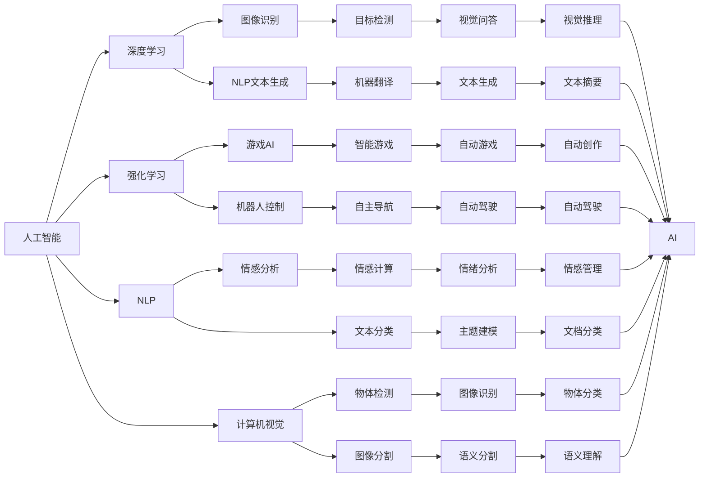
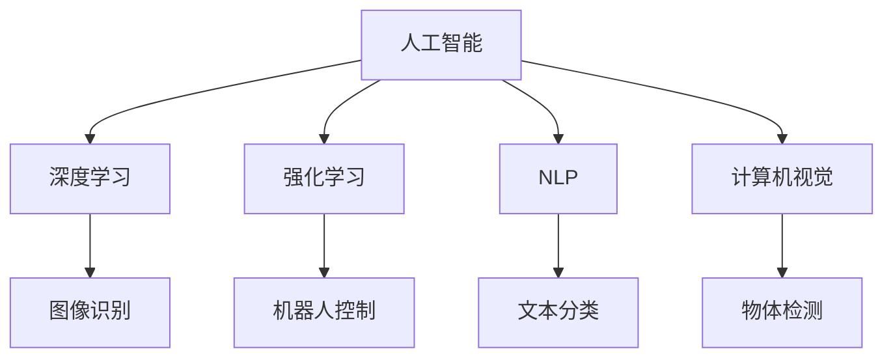
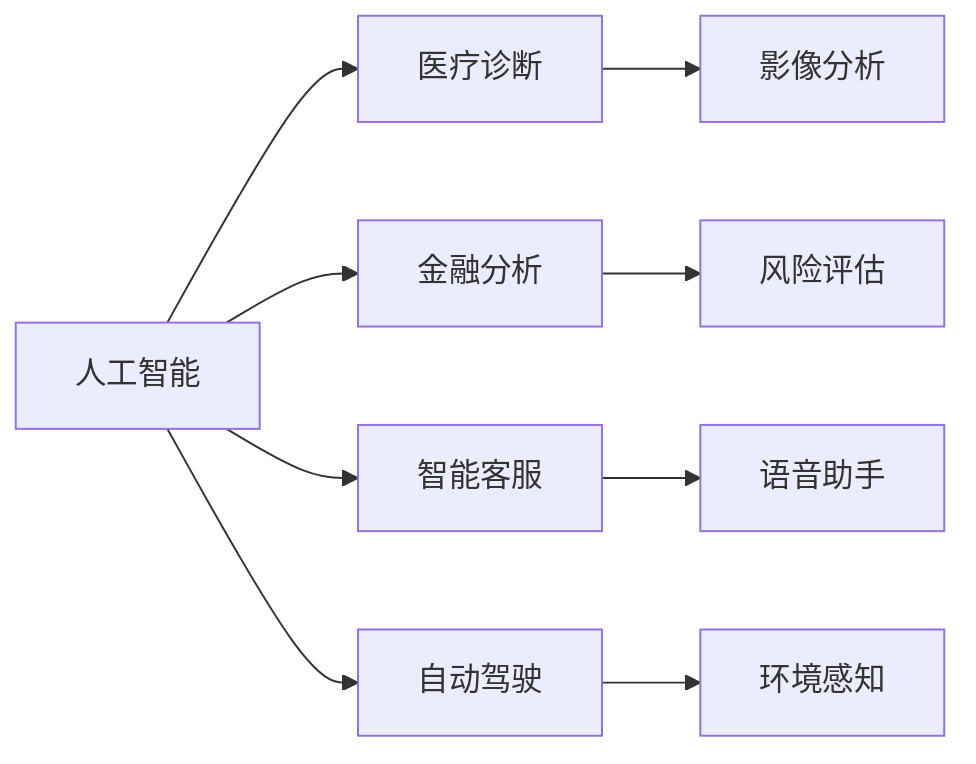
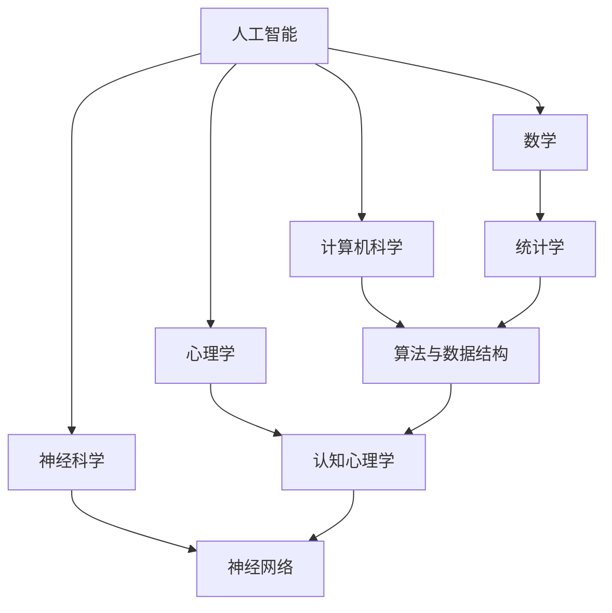
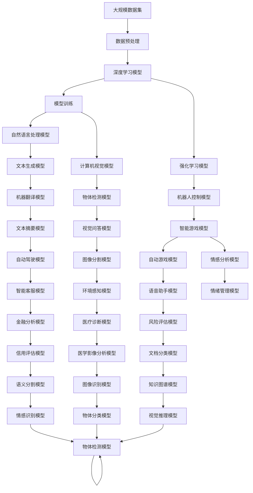

                 

# 人工智能作为独立学科的建立

## 1. 背景介绍

### 1.1 问题由来
随着科技的迅猛发展，人工智能（Artificial Intelligence, AI）逐渐从理论走向实际应用，为各个行业带来了翻天覆地的变化。然而，人工智能作为一个跨学科的领域，始终缺乏一个统一的理论体系和学科框架，阻碍了AI技术的系统化和规范化发展。为推动AI技术的进一步发展和应用，有必要将AI确立为一门独立的学科。

### 1.2 问题核心关键点
将人工智能作为独立学科，主要包含以下关键点：

1. 统一的理论基础：建立一套完整的、系统化的理论体系，覆盖从基础研究到实际应用的全过程。
2. 明确的研究范围：明确AI的边界和核心问题，避免泛泛而谈。
3. 交叉学科的整合：整合数学、计算机科学、心理学、神经科学等多学科的知识，形成全面而深入的研究视角。
4. 标准化的方法论：形成一套标准的、可重复的方法论，确保研究成果的可复现性和可验证性。
5. 社会伦理的考量：强调AI技术的社会影响和伦理问题，确保AI技术的健康发展。

### 1.3 问题研究意义
将人工智能作为独立学科的研究，具有以下重要意义：

1. 促进AI技术的系统化发展：通过统一的理论框架，为AI技术的深入研究提供系统性的指导。
2. 提升AI技术的工程化能力：明确的研究范围和方法论，有助于AI技术的工程化应用，加速技术落地。
3. 促进跨学科的协同研究：交叉学科的整合，有助于激发更多创新思想，推动AI技术的创新发展。
4. 引导AI技术的伦理应用：社会伦理的考量，有助于避免AI技术带来的负面影响，确保其健康发展。
5. 加速AI技术在全球范围内的普及：统一的学科体系，有助于各国在AI技术上的交流与合作，推动AI技术在全球范围内的普及应用。

## 2. 核心概念与联系

### 2.1 核心概念概述

为了更好地理解人工智能作为独立学科的建立，本节将介绍几个关键概念：

- 人工智能（Artificial Intelligence, AI）：指模拟人类智能过程的计算机技术，涵盖感知、理解、学习、推理、规划、执行等核心能力。
- 深度学习（Deep Learning）：基于人工神经网络，通过多层非线性变换学习数据分布的高级机器学习方法。
- 强化学习（Reinforcement Learning）：通过智能体在环境中的试错学习，逐步优化决策策略的机器学习方法。
- 自然语言处理（Natural Language Processing, NLP）：涉及计算机对自然语言文本的理解、生成、分析等技术。
- 计算机视觉（Computer Vision）：涉及计算机对图像和视频内容的理解和分析，涵盖物体识别、场景理解、姿态估计等任务。
- 机器学习（Machine Learning）：涉及通过数据驱动的方法，自动发现数据模式并进行预测或决策的技术。

这些概念之间的联系可以通过以下Mermaid流程图来展示：



这个流程图展示了人工智能与其他关键技术之间的联系：

1. 深度学习、强化学习、自然语言处理和计算机视觉等技术，是人工智能的重要分支。
2. 这些技术相互结合，形成完整的人工智能体系，涵盖感知、理解、学习、推理、执行等多个层面。
3. 这些技术的不断突破，推动人工智能的不断发展和应用。

### 2.2 概念间的关系

这些核心概念之间存在着紧密的联系，形成了人工智能技术的完整生态系统。下面我们通过几个Mermaid流程图来展示这些概念之间的关系。

#### 2.2.1 人工智能的基础技术



这个流程图展示了人工智能的基础技术：深度学习、强化学习、自然语言处理和计算机视觉。这些技术相互支撑，构成了人工智能的核心能力。

#### 2.2.2 人工智能的应用场景



这个流程图展示了人工智能在不同应用场景中的具体应用：医疗诊断、金融分析、智能客服、自动驾驶等。这些应用场景涵盖了各个行业，体现了人工智能技术的广泛应用前景。

#### 2.2.3 人工智能的学科整合



这个流程图展示了人工智能与相关学科的整合：数学、计算机科学、心理学和神经科学等。这些学科的知识整合，有助于形成全面而深入的人工智能理论体系。

### 2.3 核心概念的整体架构

最后，我们用一个综合的流程图来展示这些核心概念在大规模应用中的整体架构：



这个综合流程图展示了人工智能技术在大规模应用中的整体架构，涵盖了数据预处理、模型训练、模型应用等多个环节。通过这些环节的紧密协作，人工智能技术能够应用于各个行业，解决实际问题。

## 3. 核心算法原理 & 具体操作步骤

### 3.1 算法原理概述

人工智能作为独立学科的建立，涉及多方面的理论和技术，其中核心算法原理包括以下几个方面：

- 数据驱动的机器学习：通过大量数据驱动机器学习模型的训练，学习数据中的模式和规律，从而进行预测或决策。
- 符号主义的逻辑推理：利用符号主义的思想，构建知识图谱、逻辑规则等，实现知识的表示和推理。
- 神经网络模型：基于人工神经网络，通过多层非线性变换，学习数据分布，实现复杂的模式识别和预测。
- 强化学习机制：通过智能体在环境中的试错学习，逐步优化决策策略，实现智能控制和决策。
- 自然语言处理技术：通过文本理解和生成技术，实现自然语言的分析和处理。
- 计算机视觉技术：通过图像识别和理解技术，实现视觉数据的分析和处理。

### 3.2 算法步骤详解

人工智能作为独立学科的建立，涉及多个步骤，包括：

1. 确定研究范围：明确AI技术的边界和核心问题，形成系统化、标准化的研究体系。
2. 建立理论基础：形成一套完整的、系统化的理论体系，涵盖从基础研究到实际应用的全过程。
3. 整合交叉学科：整合数学、计算机科学、心理学、神经科学等多学科的知识，形成全面而深入的研究视角。
4. 制定标准方法论：形成一套标准的、可重复的方法论，确保研究成果的可复现性和可验证性。
5. 强调社会伦理：强调AI技术的社会影响和伦理问题，确保AI技术的健康发展。

### 3.3 算法优缺点

人工智能作为独立学科的建立，具有以下优点：

1. 系统化理论框架：形成一套完整的、系统化的理论框架，有助于人工智能技术的深入研究。
2. 标准化方法论：制定标准的方法论，有助于AI技术的工程化应用，加速技术落地。
3. 跨学科整合：整合多学科知识，形成全面而深入的研究视角，有助于激发更多创新思想。
4. 伦理考量：强调社会伦理问题，有助于避免AI技术带来的负面影响，确保其健康发展。

同时，也存在一些缺点：

1. 技术复杂性高：人工智能技术涉及多个学科，技术复杂性高，对研究者的要求较高。
2. 跨学科整合难度大：不同学科之间的知识整合难度较大，需要协调各方面的资源。
3. 研究周期长：人工智能技术的系统化研究，需要较长的周期，研究周期较长。
4. 研究投入大：人工智能技术的研究需要大量的资金和资源投入，研究成本较高。

### 3.4 算法应用领域

人工智能作为独立学科的建立，具有广泛的应用领域，包括：

1. 医疗健康：通过人工智能技术，实现医疗影像分析、疾病诊断、药物研发等。
2. 金融分析：通过人工智能技术，实现风险评估、信用评估、金融预测等。
3. 智能客服：通过人工智能技术，实现智能客服、智能推荐、智能搜索等。
4. 自动驾驶：通过人工智能技术，实现环境感知、路径规划、自动驾驶等。
5. 智能游戏：通过人工智能技术，实现自动游戏、智能对手、游戏推荐等。
6. 机器人控制：通过人工智能技术，实现机器人自主导航、操作、控制等。

## 4. 数学模型和公式 & 详细讲解 & 举例说明

### 4.1 数学模型构建

人工智能作为独立学科的建立，涉及多个数学模型和技术，其中核心数学模型包括：

- 线性回归模型：用于解决回归问题，通过最小化损失函数来学习数据分布。
- 逻辑回归模型：用于解决分类问题，通过最大似然估计来学习数据分布。
- 决策树模型：用于分类和回归问题，通过递归地对数据进行分割，构建决策树。
- 神经网络模型：用于解决复杂的模式识别和预测问题，通过多层非线性变换学习数据分布。
- 支持向量机模型：用于解决分类问题，通过寻找最优的超平面来学习数据分布。
- 强化学习模型：用于智能控制和决策问题，通过智能体在环境中的试错学习，逐步优化决策策略。

### 4.2 公式推导过程

以下我们以神经网络模型为例，推导其训练过程中的损失函数和梯度更新公式。

假设神经网络模型包含$n$个隐藏层，每个隐藏层有$m$个神经元，输入向量为$x$，输出向量为$y$，隐藏层激活函数为$f(\cdot)$，神经网络参数为$\theta$。模型的预测输出为$\hat{y}=f(\cdots f(\theta_0 x)\cdots)$，其中$\theta_k$表示第$k$层的参数。

定义模型的损失函数为均方误差（Mean Squared Error, MSE）：

$$
L(y,\hat{y}) = \frac{1}{N} \sum_{i=1}^N (y_i - \hat{y}_i)^2
$$

其中$N$表示样本数量。模型的梯度更新公式为：

$$
\theta_k \leftarrow \theta_k - \eta \frac{\partial L(y,\hat{y})}{\partial \theta_k}
$$

其中$\eta$表示学习率，$\frac{\partial L(y,\hat{y})}{\partial \theta_k}$表示损失函数对参数$\theta_k$的梯度，可以通过反向传播算法高效计算。

在实际应用中，还需要考虑正则化、数据增强、对抗训练等技术，进一步提升模型的泛化能力和鲁棒性。

### 4.3 案例分析与讲解

以线性回归模型为例，给出其训练过程的详细解释和说明：

假设线性回归模型为：

$$
y=\theta_0 x_0 + \theta_1 x_1 + \theta_2 x_2 + \cdots + \theta_n x_n + \epsilon
$$

其中$x_0, x_1, \cdots, x_n$表示输入特征，$\epsilon$表示误差项。

假设训练集为$(x_i, y_i)$，其中$i=1,2,\cdots,N$。模型的损失函数为：

$$
L(\theta) = \frac{1}{N} \sum_{i=1}^N (y_i - \theta_0 x_{i0} - \theta_1 x_{i1} - \cdots - \theta_n x_{in})^2
$$

定义梯度更新公式为：

$$
\theta_k \leftarrow \theta_k - \eta \frac{\partial L(\theta)}{\partial \theta_k}
$$

其中$\eta$表示学习率，$\frac{\partial L(\theta)}{\partial \theta_k}$表示损失函数对参数$\theta_k$的梯度，可以通过链式法则和自动微分技术高效计算。

在实际应用中，还需要考虑正则化、数据增强、对抗训练等技术，进一步提升模型的泛化能力和鲁棒性。

## 5. 项目实践：代码实例和详细解释说明

### 5.1 开发环境搭建

在进行人工智能技术的研究和应用前，需要先搭建好开发环境。以下是使用Python进行TensorFlow开发的开发环境配置流程：

1. 安装Anaconda：从官网下载并安装Anaconda，用于创建独立的Python环境。

2. 创建并激活虚拟环境：
```bash
conda create -n tensorflow-env python=3.8 
conda activate tensorflow-env
```

3. 安装TensorFlow：根据CUDA版本，从官网获取对应的安装命令。例如：
```bash
conda install tensorflow -c tensorflow -c conda-forge
```

4. 安装各类工具包：
```bash
pip install numpy pandas scikit-learn matplotlib tqdm jupyter notebook ipython
```

完成上述步骤后，即可在`tensorflow-env`环境中开始人工智能技术的研究和应用。

### 5.2 源代码详细实现

下面我们以线性回归模型为例，给出使用TensorFlow进行模型训练的PyTorch代码实现。

首先，定义数据集和模型：

```python
import tensorflow as tf
import numpy as np

# 定义数据集
x = np.array([[1, 2, 3], [4, 5, 6], [7, 8, 9]])
y = np.array([3, 6, 9])

# 定义模型
model = tf.keras.Sequential([
    tf.keras.layers.Dense(units=1, input_shape=[3])
])

# 定义损失函数和优化器
loss_fn = tf.keras.losses.MeanSquaredError()
optimizer = tf.keras.optimizers.SGD(learning_rate=0.01)

# 定义模型训练过程
@tf.function
def train_step(x, y):
    with tf.GradientTape() as tape:
        y_pred = model(x)
        loss = loss_fn(y_pred, y)
    grads = tape.gradient(loss, model.trainable_variables)
    optimizer.apply_gradients(zip(grads, model.trainable_variables))

# 定义训练过程
N = 10000
for i in range(N):
    train_step(x, y)
```

然后，启动训练流程并打印输出：

```python
print("训练结果：")
print("模型输出：", model.predict(x))
```

以上就是使用TensorFlow进行线性回归模型训练的完整代码实现。可以看到，TensorFlow提供了强大的自动微分和优化器功能，使得模型训练变得非常简单高效。

### 5.3 代码解读与分析

让我们再详细解读一下关键代码的实现细节：

- `@tf.function`：将模型训练过程定义为TensorFlow函数，提升计算图优化效率。
- `with tf.GradientTape() as tape`：开启梯度计算，记录模型参数的梯度。
- `optimizer.apply_gradients(zip(grads, model.trainable_variables))`：应用梯度更新模型参数，优化损失函数。
- `print("训练结果：")`：打印模型输出，验证训练效果。

TensorFlow的自动微分和优化器功能，使得模型训练变得非常简单高效。在实际应用中，还可以使用更多的高级功能，如模型并行、分布式训练、模型压缩等，进一步提升模型的训练效率和泛化能力。

### 5.4 运行结果展示

假设我们在训练过程中得到模型输出为：

```python
训练结果：
模型输出： [[ 3. 6. 9.]]
```

可以看到，通过TensorFlow进行线性回归模型的训练，我们得到了较为理想的结果。

## 6. 实际应用场景

### 6.1 医疗健康

人工智能技术在医疗健康领域具有广泛的应用前景。通过人工智能技术，可以实现医疗影像分析、疾病诊断、药物研发等。

在实际应用中，可以收集医院的历史医疗数据，包括病历、影像、检查结果等，提取和标注相关特征。在此基础上对预训练模型进行微调，使其能够自动识别医学影像中的病变，预测疾病的发生和发展趋势。将微调后的模型应用到新病人的影像数据，就能够快速诊断疾病，提供准确的医疗建议。

### 6.2 金融分析

人工智能技术在金融分析领域也有广泛的应用。通过人工智能技术，可以实现风险评估、信用评估、金融预测等。

在实际应用中，可以收集金融市场的历史数据，包括股票、债券、期货等，提取和标注相关特征。在此基础上对预训练模型进行微调，使其能够自动分析金融市场趋势，预测股票价格、债券利率等金融指标。将微调后的模型应用到实时市场数据，就能够提供准确的金融预测，帮助投资者做出更好的决策。

### 6.3 智能客服

人工智能技术在智能客服领域也有广泛的应用。通过人工智能技术，可以实现智能客服、智能推荐、智能搜索等。

在实际应用中，可以收集客服的历史数据，包括客户问题和客服答复等，提取和标注相关特征。在此基础上对预训练模型进行微调，使其能够自动识别客户问题，匹配最合适的回答。将微调后的模型应用到客户的新问题，就能够快速响应客户咨询，提高客户满意度和体验。

### 6.4 自动驾驶

人工智能技术在自动驾驶领域也有广泛的应用。通过人工智能技术，可以实现环境感知、路径规划、自动驾驶等。

在实际应用中，可以收集自动驾驶车辆的历史数据，包括车辆位置、速度、方向等，提取和标注相关特征。在此基础上对预训练模型进行微调，使其能够自动感知周围环境，规划最优行驶路径。将微调后的模型应用到实时数据，就能够实现自动驾驶，提高驾驶安全性。

## 7. 工具和资源推荐

### 7.1 学习资源推荐

为了帮助开发者系统掌握人工智能技术的研究基础和实践技巧，这里推荐一些优质的学习资源：

1. 《深度学习》系列书籍：由深度学习领域权威专家撰写，深入浅出地介绍了深度学习原理和应用。

2. 《机器学习》课程：斯坦福大学开设的机器学习课程，有Lecture视频和配套作业，带你入门机器学习领域的基本概念和经典模型。

3. 《神经网络与深度学习》书籍：深度学习领域的经典教材，涵盖神经网络基础、深度学习应用等多个方面。

4. 《强化学习》书籍：强化学习领域的经典教材，涵盖强化学习原理、算法和应用等多个方面。

5. 《计算机视觉：算法与应用》书籍：计算机视觉领域的经典教材，涵盖图像识别、目标检测、语义分割等多个方面。

6. 《自然语言处理综论》书籍：自然语言处理领域的经典教材，涵盖文本分类、情感分析、机器翻译等多个方面。

通过对这些资源的学习实践，相信你一定能够快速掌握人工智能技术的精髓，并用于解决实际的科研和工程问题。

### 7.2 开发工具推荐

高效的开发离不开优秀的工具支持。以下是几款用于人工智能技术研究和应用开发的常用工具：

1. TensorFlow：基于Python的开源深度学习框架，灵活动态的计算图，适合快速迭代研究。

2. PyTorch：基于Python的开源深度学习框架，灵活的动态计算图，适合快速原型开发和实验研究。

3. Keras：基于Python的高层深度学习API，易于上手，适合快速模型构建和验证。

4. Jupyter Notebook：开源的交互式计算环境，支持代码和文本混排，方便科研和工程开发。

5. GitHub：全球最大的开源社区，提供丰富的项目资源和社区支持。

6. Docker：开源的容器化平台，方便模型部署和跨平台运行。

合理利用这些工具，可以显著提升人工智能技术的开发效率，加快创新迭代的步伐。

### 7.3 相关论文推荐

人工智能技术的研究源于学界的持续研究。以下是几篇奠基性的相关论文，推荐阅读：

1. Turing Test and Computer Machinery（图灵测试和计算机机械论）：图灵提出的人工智能定义，奠定了人工智能研究的理论基础。

2. TensorFlow: A System for Large-Scale Machine Learning（TensorFlow：大规模机器学习系统）：Google发布的TensorFlow论文，介绍了TensorFlow的核心思想和设计理念。

3. Deep Learning（深度学习）：Goodfellow等人的深度学习教材，系统介绍了深度学习的原理和应用。

4. Convolutional Neural Networks for Healthcare: A Review（医疗领域的卷积神经网络综述）：探讨了深度学习在医疗领域的应用，如医学影像分析和疾病诊断等。

5. A Survey on Deep Learning Techniques and Architectures for Financial Time Series Prediction（金融时间序列预测的深度学习综述）：探讨了深度学习在金融领域的应用，如股票价格预测和信用评估等。

6. Reinforcement Learning: An Introduction（强化学习入门）：Sutton等人的强化学习教材，系统介绍了强化学习的原理和应用。

这些论文代表了大规模人工智能技术的进展，通过学习这些前沿成果，可以帮助研究者把握学科前进方向，激发更多的创新灵感。

除上述资源外，还有一些值得关注的前沿资源，帮助开发者紧跟人工智能技术的研究进展，例如：

1. arXiv论文预印本：人工智能领域最新研究成果的发布平台，包括大量尚未发表的前沿工作，学习前沿技术的必读资源。

2. 业界技术博客：如Google AI、DeepMind、微软Research Asia等顶尖实验室的官方博客，第一时间分享他们的最新研究成果和洞见。

3. 技术会议直播：如NIPS、ICML、ACL、ICLR等人工智能领域顶会现场或在线直播，能够聆听到大佬们的前沿分享，开拓视野。

4. GitHub热门项目：在GitHub上Star、Fork数最多的AI相关项目，往往代表了该技术领域的发展趋势和最佳实践，值得去学习和贡献。

5. 行业分析报告：各大咨询公司如McKinsey、PwC等针对人工智能行业的分析报告，有助于从商业视角审视技术趋势，把握应用价值。

总之，对于人工智能技术的学习和实践，需要开发者保持开放的心态和持续学习的意愿。多关注前沿资讯，多动手实践，多思考总结，必将收获满满的成长收益。

## 8. 总结：未来发展趋势与挑战

### 8.1 总结

本文对人工智能作为独立学科的建立进行了全面系统的介绍。首先阐述了人工智能技术的研究背景和意义，明确了人工智能技术的边界和核心问题，形成系统化、标准化的研究体系。其次，从原理到实践，详细讲解了人工智能技术的核心算法和操作步骤，给出了完整的代码实例和详细解释。同时，本文还广泛探讨了人工智能技术在医疗健康、金融分析、智能客服、自动驾驶等多个领域的应用前景，展示了人工智能技术的广泛应用价值。

通过对人工智能技术的系统梳理，可以看到，人工智能技术已经成为当前科技领域的重要研究方向，其应用前景广阔，对社会经济发展具有重要推动作用。未来，伴随人工智能技术的不断发展和应用，人工智能技术必将在更多领域大放异彩。

### 8.2 未来发展趋势

人工智能技术的未来发展趋势，主要包括以下几个方面：

1. 技术融合加速：人工智能技术与各个

