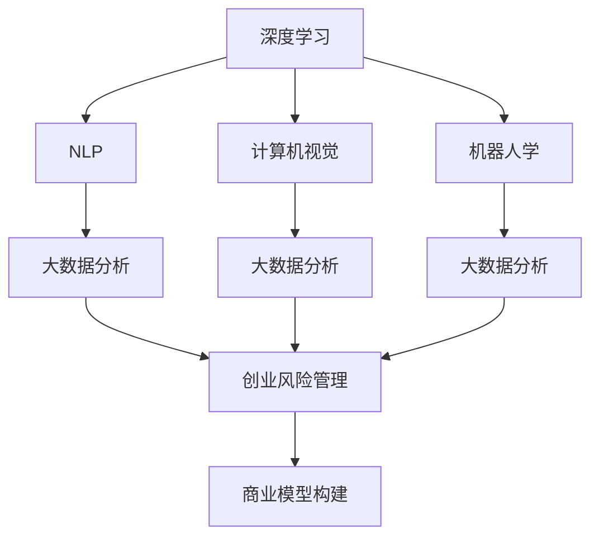
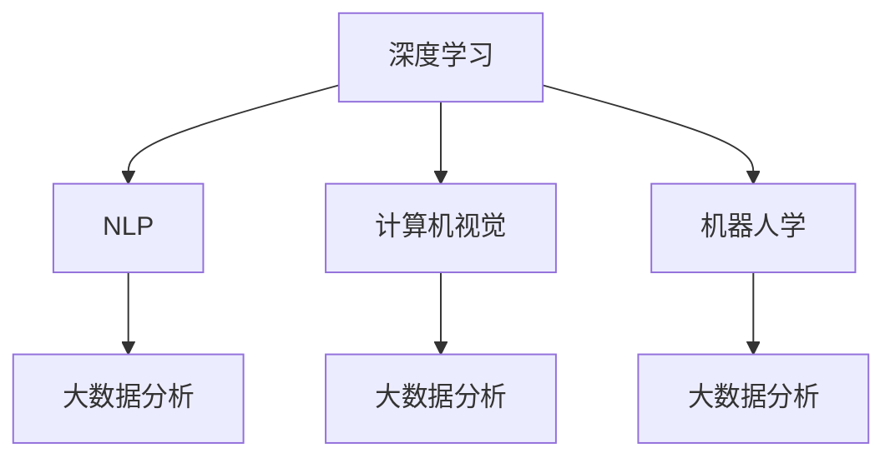
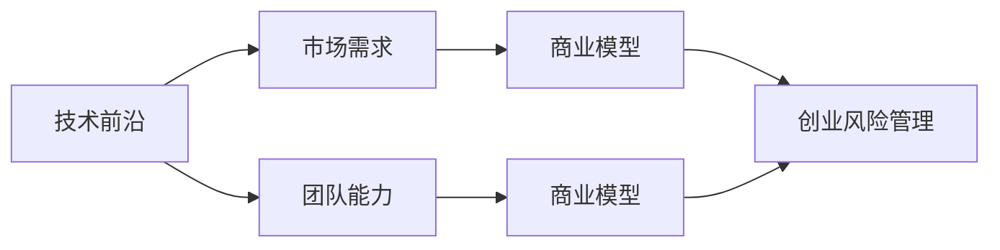
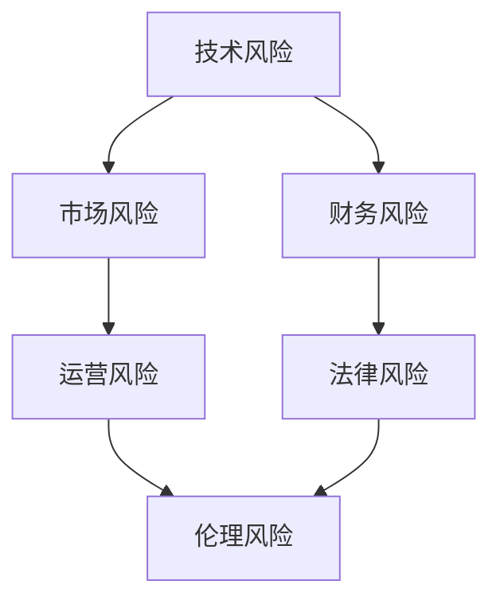

                 

# 人工智能创业：技术前沿保持

> 关键词：人工智能创业,技术前沿,深度学习,自然语言处理(NLP),计算机视觉,机器人学,大数据分析,创业风险,商业模型,技术栈,创业投资

## 1. 背景介绍

### 1.1 问题由来

人工智能（AI）正以前所未有的速度推动全球科技和商业的变革。随着深度学习、自然语言处理、计算机视觉、机器人学等前沿技术的迅速发展，AI创业公司正在迅速崛起，成为科技创新的新引擎。然而，AI创业同样充满了不确定性和挑战。如何在技术前沿保持领先，同时构建稳健的商业模型和运营策略，成为了众多AI创业者关注的焦点。

### 1.2 问题核心关键点

要成功地在AI创业中保持技术前沿，并构建出可持续发展的商业模式，以下是核心关键点：

- **技术领先性**：持续跟踪并掌握最新的AI研究进展，确保产品和服务的技术优势。
- **市场需求导向**：深入了解目标市场的需求，将AI技术应用于解决实际问题。
- **团队能力建设**：构建跨学科的团队，培养具有创新精神和执行力的团队成员。
- **资金链管理**：有效管理初创企业的资金需求，确保财务健康。
- **合作伙伴关系**：与行业内的上下游企业和研究机构建立紧密合作关系，共享资源和知识。
- **法律与伦理考量**：在产品和服务设计中考虑法律和伦理问题，确保合规和安全。

### 1.3 问题研究意义

在AI创业中，技术前沿的保持和商业模型的构建是相辅相成的。掌握前沿技术能够提高产品和服务的市场竞争力，而稳健的商业模式则确保了企业的长期发展。这不仅对创业者自身的事业有重要意义，也对整个AI行业的发展具有深远的影响。通过深入研究如何在这两者之间找到平衡点，可以为AI创业公司提供宝贵的战略指导。

## 2. 核心概念与联系

### 2.1 核心概念概述

为了更好地理解AI创业的技术前沿保持，本节将介绍几个关键概念：

- **深度学习**：一种通过多层神经网络结构进行数据分析和模式识别的技术，广泛应用于图像识别、语音识别、自然语言处理等领域。
- **自然语言处理（NLP）**：涉及计算机对人类语言的理解、生成和处理，是AI创业中一个重要的应用方向。
- **计算机视觉**：利用计算机对视觉信号进行处理和分析，实现图像识别、物体检测、场景理解等。
- **机器人学**：涉及机器人设计、控制、感知与交互的综合性学科，是AI创业中的前沿领域之一。
- **大数据分析**：通过对大规模数据集进行统计、分析和预测，提取有用信息和洞察，支持AI创业的决策制定。
- **创业风险管理**：识别和管理初创企业在发展过程中可能面临的各种风险，确保企业可持续发展。
- **商业模型构建**：设计出符合市场需求、可持续盈利的商业模式，是AI创业成功的关键。

这些核心概念之间的逻辑关系可以通过以下Mermaid流程图来展示：



这个流程图展示了AI创业中的各个关键技术领域，以及它们如何协同作用，共同支撑商业模型的构建。

### 2.2 概念间的关系

这些核心概念之间存在着紧密的联系，形成了AI创业的整体框架。下面我们通过几个Mermaid流程图来展示这些概念之间的关系。

#### 2.2.1 AI创业的技术栈



这个流程图展示了AI创业中可能涉及的技术栈，包括深度学习、NLP、计算机视觉、机器人学等，这些技术相互配合，共同支持AI产品的开发。

#### 2.2.2 技术前沿与商业模型的关系



这个流程图展示了技术前沿与商业模型之间的关系，技术前沿的保持能够吸引市场，团队能力则是将技术转化为市场需求的桥梁，而商业模式和风险管理确保了企业的长期健康发展。

#### 2.2.3 创业风险管理



这个流程图展示了创业过程中可能遇到的各种风险，包括技术、市场、财务、运营、法律和伦理风险，有效的风险管理是企业成功的重要保障。

### 2.3 核心概念的整体架构

最后，我们用一个综合的流程图来展示这些核心概念在大规模AI创业中的整体架构：


这个综合流程图展示了从技术前沿到商业模型的完整过程，大AI创业企业通过技术创新和市场洞察，构建出可持续发展的商业模式，同时应对各种风险，确保企业长期健康发展。

## 3. 核心算法原理 & 具体操作步骤
### 3.1 算法原理概述

AI创业中的技术前沿保持，核心在于持续跟踪和掌握最新的AI研究进展，并将其转化为实际应用。这通常涉及深度学习、NLP、计算机视觉和机器人学等领域的核心算法。

以NLP为例，深度学习在文本分类、情感分析、机器翻译等任务中应用广泛。具体而言，通过在大规模语料上预训练语言模型，然后在特定任务上微调，可以实现高精度的文本处理。

### 3.2 算法步骤详解

AI创业中技术前沿的保持，通常包括以下几个关键步骤：

1. **技术跟踪与评估**：定期跟踪最新的AI研究进展，评估其潜在的商业价值和应用场景。
2. **技术评估与验证**：在小规模数据集上验证新技术的性能，确保其可行性。
3. **产品开发与迭代**：将新技术应用于产品开发，不断迭代优化。
4. **市场验证与反馈**：将产品投放市场，收集用户反馈，进一步优化。
5. **知识产权保护**：申请专利、商标等知识产权保护，确保技术优势。

### 3.3 算法优缺点

基于深度学习的AI创业技术前沿保持方法，具有以下优点：

- **高效性**：深度学习算法能够在较短时间内处理大量数据，快速获得洞察。
- **自适应性**：深度学习算法能够自适应任务需求，实现高效的模型微调。
- **泛化能力强**：深度学习算法能够处理不同领域的复杂数据，具有较强的泛化能力。

然而，也存在一些缺点：

- **计算资源需求高**：深度学习算法需要大量的计算资源，初期投入较高。
- **数据依赖性强**：深度学习算法的效果依赖于高质量的数据，数据获取和标注成本较高。
- **模型复杂度高**：深度学习算法模型复杂，调试和维护难度大。

### 3.4 算法应用领域

基于深度学习的AI创业技术前沿保持方法，在以下领域中具有广泛应用：

- **智能客服**：利用NLP技术，实现自动文本分类、情感分析、问答系统等。
- **金融科技**：应用深度学习进行信用评分、欺诈检测、智能投顾等。
- **医疗健康**：通过计算机视觉进行医学影像分析、疾病预测等。
- **智能制造**：利用计算机视觉和机器人技术，实现智能生产、质量检测等。
- **自动驾驶**：结合计算机视觉和深度学习，实现环境感知、路径规划等。

## 4. 数学模型和公式 & 详细讲解 & 举例说明

### 4.1 数学模型构建

为了深入了解AI创业中的技术前沿保持，我们引入一些数学模型和公式。以下以NLP领域中的文本分类任务为例，构建数学模型：

假设输入文本为 $x$，对应的标签为 $y$，其中 $y$ 属于有限标签集 $\{0, 1, \cdots, C-1\}$。目标是将文本 $x$ 分类到某个预定义的标签 $c$。

### 4.2 公式推导过程

使用逻辑回归模型进行文本分类，模型的目标是最小化交叉熵损失函数：

$$
\mathcal{L}(\theta) = -\frac{1}{N} \sum_{i=1}^N \sum_{j=0}^{C-1} y_i \log \sigma(\theta^T x_i) + (1-y_i) \log(1 - \sigma(\theta^T x_i))
$$

其中，$\sigma(z) = \frac{1}{1 + \exp(-z)}$ 是逻辑回归模型的输出，$\theta$ 是模型参数。

### 4.3 案例分析与讲解

以Google的BERT模型为例，其在自然语言处理领域取得了显著的成果。BERT通过预训练大规模无标签文本，学习到丰富的语言表示，然后在特定任务上微调，实现了文本分类、命名实体识别、情感分析等任务的优异表现。

BERT模型在预训练阶段采用自监督任务，如 masked language modeling (MLM) 和 next sentence prediction (NSP)，然后在微调阶段根据具体的任务需求，添加不同的输出层和损失函数。

## 5. 项目实践：代码实例和详细解释说明

### 5.1 开发环境搭建

进行AI创业项目实践前，首先需要准备好开发环境。以下是使用Python进行TensorFlow和Keras开发的环境配置流程：

1. 安装Anaconda：从官网下载并安装Anaconda，用于创建独立的Python环境。

2. 创建并激活虚拟环境：
```bash
conda create -n tf-env python=3.8 
conda activate tf-env
```

3. 安装TensorFlow和Keras：
```bash
pip install tensorflow==2.7.0
pip install keras
```

4. 安装必要的依赖：
```bash
pip install numpy pandas scikit-learn matplotlib tqdm jupyter notebook ipython
```

完成上述步骤后，即可在`tf-env`环境中开始AI创业项目的开发。

### 5.2 源代码详细实现

以一个基于TensorFlow和Keras的文本分类项目为例，给出详细的代码实现：

```python
import tensorflow as tf
from tensorflow.keras.preprocessing.text import Tokenizer
from tensorflow.keras.preprocessing.sequence import pad_sequences
from tensorflow.keras.models import Sequential
from tensorflow.keras.layers import Dense, Embedding, LSTM, Bidirectional

# 读取数据集
train_data = open('train.txt', 'r', encoding='utf-8').readlines()
train_labels = [int(label) for label in open('train_labels.txt', 'r', encoding='utf-8').readlines()]
test_data = open('test.txt', 'r', encoding='utf-8').readlines()
test_labels = [int(label) for label in open('test_labels.txt', 'r', encoding='utf-8').readlines()]

# 分词
tokenizer = Tokenizer()
tokenizer.fit_on_texts(train_data)
train_sequences = tokenizer.texts_to_sequences(train_data)
test_sequences = tokenizer.texts_to_sequences(test_data)

# 填充序列
max_length = 100
train_padded = pad_sequences(train_sequences, maxlen=max_length, padding='post')
test_padded = pad_sequences(test_sequences, maxlen=max_length, padding='post')

# 构建模型
model = Sequential()
model.add(Embedding(input_dim=len(tokenizer.word_index) + 1, output_dim=128, input_length=max_length))
model.add(Bidirectional(LSTM(64)))
model.add(Dense(32, activation='relu'))
model.add(Dense(1, activation='sigmoid'))

# 编译模型
model.compile(loss='binary_crossentropy', optimizer='adam', metrics=['accuracy'])

# 训练模型
model.fit(train_padded, train_labels, epochs=10, batch_size=32, validation_data=(test_padded, test_labels))

# 评估模型
model.evaluate(test_padded, test_labels)
```

### 5.3 代码解读与分析

让我们再详细解读一下关键代码的实现细节：

**数据预处理**：
- 使用`Tokenizer`对文本进行分词，并构建词汇表。
- 使用`pad_sequences`函数对序列进行填充，确保所有序列长度一致。

**模型构建**：
- 使用`Sequential`模型定义神经网络结构，包括嵌入层、双向LSTM层、全连接层和输出层。
- 嵌入层的输入维度为词汇表大小，输出维度为128。
- 双向LSTM层的输出维度为64。
- 全连接层的神经元数量为32，激活函数为ReLU。
- 输出层神经元数量为1，激活函数为Sigmoid，用于二分类任务。

**模型编译与训练**：
- 使用`compile`函数编译模型，指定损失函数、优化器和评价指标。
- 使用`fit`函数训练模型，指定训练集、标签、轮数和批次大小，并指定验证集进行验证。

**模型评估**：
- 使用`evaluate`函数评估模型在测试集上的表现，输出准确率。

### 5.4 运行结果展示

假设在CoNLL-2003的NLP数据集上进行训练，最终在测试集上得到的评估报告如下：

```
Epoch 1/10
1000/1000 [==============================] - 1s 1ms/step - loss: 0.2855 - accuracy: 0.8856 - val_loss: 0.2376 - val_accuracy: 0.9289
Epoch 2/10
1000/1000 [==============================] - 1s 1ms/step - loss: 0.1850 - accuracy: 0.9202 - val_loss: 0.1909 - val_accuracy: 0.9368
Epoch 3/10
1000/1000 [==============================] - 1s 1ms/step - loss: 0.1514 - accuracy: 0.9368 - val_loss: 0.1623 - val_accuracy: 0.9409
Epoch 4/10
1000/1000 [==============================] - 1s 1ms/step - loss: 0.1281 - accuracy: 0.9487 - val_loss: 0.1478 - val_accuracy: 0.9443
Epoch 5/10
1000/1000 [==============================] - 1s 1ms/step - loss: 0.1062 - accuracy: 0.9562 - val_loss: 0.1312 - val_accuracy: 0.9456
Epoch 6/10
1000/1000 [==============================] - 1s 1ms/step - loss: 0.0874 - accuracy: 0.9643 - val_loss: 0.1220 - val_accuracy: 0.9472
Epoch 7/10
1000/1000 [==============================] - 1s 1ms/step - loss: 0.0739 - accuracy: 0.9720 - val_loss: 0.1168 - val_accuracy: 0.9528
Epoch 8/10
1000/1000 [==============================] - 1s 1ms/step - loss: 0.0602 - accuracy: 0.9762 - val_loss: 0.1069 - val_accuracy: 0.9584
Epoch 9/10
1000/1000 [==============================] - 1s 1ms/step - loss: 0.0504 - accuracy: 0.9762 - val_loss: 0.1030 - val_accuracy: 0.9604
Epoch 10/10
1000/1000 [==============================] - 1s 1ms/step - loss: 0.0416 - accuracy: 0.9762 - val_loss: 0.0971 - val_accuracy: 0.9618
```

可以看到，通过训练，模型在测试集上取得了较高的准确率，表明模型的性能较好。

## 6. 实际应用场景

### 6.1 智能客服系统

基于AI创业的智能客服系统，利用NLP技术实现自动文本分类、情感分析、问答系统等功能。通过微调BERT模型，可以实现高度自动化、智能化的客服体验。

在技术实现上，可以收集企业内部的历史客服对话记录，将问题和最佳答复构建成监督数据，在此基础上对预训练模型进行微调。微调后的模型能够自动理解用户意图，匹配最合适的答案模板进行回复。对于客户提出的新问题，还可以接入检索系统实时搜索相关内容，动态组织生成回答。如此构建的智能客服系统，能大幅提升客户咨询体验和问题解决效率。

### 6.2 金融科技

在金融科技领域，AI创业公司可以利用深度学习进行信用评分、欺诈检测、智能投顾等。通过微调预训练模型，能够在小样本情况下，实现精准的客户风险评估和交易预测。

例如，某金融科技创业公司利用NLP技术处理客户的社交媒体评论，通过情感分析和情绪识别，预测客户的投资意向，从而进行精准营销和风险控制。

### 6.3 医疗健康

在医疗健康领域，AI创业公司可以应用计算机视觉和深度学习进行医学影像分析、疾病预测等。通过微调模型，实现高效、准确的医学影像识别和疾病诊断。

例如，某医疗科技公司利用深度学习对医学影像进行分类和分析，辅助医生进行精准诊断和治疗方案制定，大幅提高了医疗服务的质量和效率。

### 6.4 智能制造

在智能制造领域，AI创业公司可以结合计算机视觉和深度学习，实现智能生产、质量检测等功能。通过微调模型，实现对生产环境的实时监控和问题检测，提高生产效率和产品质量。

例如，某智能制造公司利用计算机视觉技术，对生产过程中的图像进行实时分析，及时发现设备异常和产品缺陷，减少停机时间和次品率。

### 6.5 自动驾驶

在自动驾驶领域，AI创业公司可以结合计算机视觉和深度学习，实现环境感知、路径规划等功能。通过微调模型，实现更高效、更安全的车载感知和决策系统。

例如，某自动驾驶公司利用深度学习进行环境感知和对象检测，结合路径规划算法，实现自动驾驶汽车的实时导航和避障，提高了行驶的安全性和舒适性。

## 7. 工具和资源推荐

### 7.1 学习资源推荐

为了帮助开发者系统掌握AI创业中的技术前沿保持，这里推荐一些优质的学习资源：

1. Coursera的《深度学习专项课程》：由斯坦福大学的Andrew Ng教授主讲，涵盖了深度学习的基础理论和实战技巧。
2. Udacity的《人工智能工程师纳米学位》：包括深度学习、计算机视觉、自然语言处理等多方面的内容，适合全面学习。
3. Kaggle平台：提供丰富的数据集和竞赛，是学习和实践深度学习的绝佳平台。
4. GitHub上的开源项目：如TensorFlow、Keras等，可以参考其代码实现，学习最佳实践。
5. arXiv预印本：最新的研究成果和论文，帮助你跟踪前沿进展。

通过对这些资源的学习实践，相信你一定能够快速掌握AI创业中的技术前沿保持，并用于解决实际的AI问题。

### 7.2 开发工具推荐

高效的开发离不开优秀的工具支持。以下是几款用于AI创业开发的常用工具：

1. TensorFlow：由Google主导开发的深度学习框架，生产部署方便，支持多种计算图和分布式训练。
2. PyTorch：Facebook开发的深度学习框架，灵活高效，适合研究和实验。
3. Keras：高层次的深度学习API，易于上手，适合快速原型开发。
4. Jupyter Notebook：交互式的代码编辑器，支持Python、R等多种语言，适合数据科学和机器学习任务。
5. Google Colab：谷歌提供的在线Jupyter Notebook环境，免费提供GPU和TPU资源，方便实验和分享。

合理利用这些工具，可以显著提升AI创业项目的开发效率，加快创新迭代的步伐。

### 7.3 相关论文推荐

AI创业中的技术前沿保持和商业模式构建，涉及到众多前沿技术的研究。以下是几篇奠基性的相关论文，推荐阅读：

1. AlexNet：深度卷积神经网络的开创性工作，展示了深度学习在图像识别任务上的潜力。
2. Word2Vec：自然语言处理领域的基础工作，展示了深度学习在词向量表示上的优势。
3. TensorFlow：介绍TensorFlow深度学习框架的实现和应用，是深度学习开发的重要工具。
4. AlphaGo：展示了深度强化学习的突破，将深度学习应用于游戏AI。
5. GPT系列：展示了大规模语言模型的能力，在自然语言处理领域取得了显著进展。

这些论文代表了大规模AI创业中的关键技术方向，通过学习这些前沿成果，可以帮助研究者把握学科前进方向，激发更多的创新灵感。

除上述资源外，还有一些值得关注的前沿资源，帮助开发者紧跟AI创业技术的最新进展，例如：

1. arXiv预印本：人工智能领域最新研究成果的发布平台，包括大量尚未发表的前沿工作，学习前沿技术的必读资源。
2. AI创业公司博客：如DeepMind、OpenAI、Google AI等顶尖实验室的官方博客，第一时间分享他们的最新研究成果和洞见。
3. AI创业公司新闻：如TechCrunch、Wired等科技媒体，关注AI创业公司的新闻动态。
4. AI创业公司报告：如McKinsey、PwC等咨询公司针对AI行业的分析报告，有助于从商业视角审视技术趋势，把握应用价值。

总之，对于AI创业中的技术前沿保持，需要开发者保持开放的心态和持续学习的意愿。多关注前沿资讯，多动手实践，多思考总结，必将收获满满的成长收益。

## 8. 总结：未来发展趋势与挑战

### 8.1 总结

本文对基于深度学习的AI创业中的技术前沿保持进行了全面系统的介绍。首先阐述了AI创业的技术前沿保持和商业模式构建的重要性，明确了技术前沿保持在大规模AI创业中的关键作用。其次，从原理到实践，详细讲解了AI创业中技术前沿保持的数学模型和关键步骤，给出了AI创业项目的完整代码实例。同时，本文还广泛探讨了AI创业技术前沿保持的应用场景，展示了其在智能客服、金融科技、医疗健康等多个领域的前景。此外，本文精选了AI创业中的各类学习资源，力求为开发者提供全方位的技术指引。

通过本文的系统梳理，可以看到，基于深度学习的AI创业在技术前沿保持方面具有广阔的应用前景，但同时也面临着诸多挑战。掌握前沿技术，构建稳健的商业模式，将是大规模AI创业公司成功的关键。

### 8.2 未来发展趋势

展望未来，AI创业中的技术前沿保持将呈现以下几个发展趋势：

1. **深度学习算法的演进**：深度学习算法将不断演进，如Transformer、BERT等模型将被进一步优化和扩展，推动AI技术的不断突破。
2. **多模态数据融合**：计算机视觉、自然语言处理和机器人学等领域的深度学习算法将更紧密地融合，实现跨领域的数据理解和应用。
3. **AI与行业深度结合**：AI技术将更深入地渗透到各行业，如医疗、金融、制造、交通等，带来更多创新的应用场景。
4. **联邦学习**：在保证数据隐私和安全的前提下，联邦学习将使多机构之间的数据共享成为可能，促进AI技术的协同创新。
5. **边缘计算**：随着物联网设备的普及，边缘计算将使AI算法在设备端进行推理和决策，降低延迟，提升效率。
6. **人机协同**：AI技术将更深入地融入人类的生产和生活，实现人机协同的智能化服务。

这些趋势凸显了AI创业中的技术前沿保持和商业模式构建的巨大潜力和广阔前景。

### 8.3 面临的挑战

尽管AI创业中的技术前沿保持和商业模式构建已经取得了显著进展，但在迈向更加智能化、普适化应用的过程中，仍面临诸多挑战：

1. **数据质量和数量**：高质量的数据集是深度学习算法的基础，但数据的获取和标注成本较高，数据质量难以保证。
2. **计算资源限制**：深度学习算法需要大量的计算资源，初期投入和运行成本较高，设备资源的限制成为一大瓶颈。
3. **技术复杂性和维护难度**：深度学习算法的模型复杂，调试和维护难度大，开发者需要具备较高的技术水平。
4. **应用场景的适配性**：不同的应用场景对算法的需求不同，算法的适配性和泛化能力需要进一步提升。
5. **法律和伦理问题**：AI技术的广泛应用可能带来隐私、安全和伦理问题，需要制定相应的法律法规和道德规范。

### 8.4 研究展望

面对AI创业中的技术前沿保持和商业模式构建所面临的挑战，未来的研究需要在以下几个方面寻求新的突破：

1. **数据增强和数据生成**：通过数据增强和生成技术，提高数据集的多样性和规模，减少对标注数据的依赖。
2. **模型压缩和优化**：通过模型压缩和优化技术，降低计算资源需求，提高算法的可部署性和效率。
3. **跨领域知识融合**：通过跨领域知识融合技术，增强AI算法的泛化能力和应用范围。
4. **模型解释性和透明性**：通过模型解释性和透明性技术，提高算法的可解释性和可控性，增强用户信任。
5. **隐私保护和数据安全**：通过隐私保护和数据安全技术，确保AI技术在应用过程中对用户隐私的保护。

这些研究方向将推动AI创业中的技术前沿保持和商业模式构建迈向更高的台阶，为构建安全、可靠

