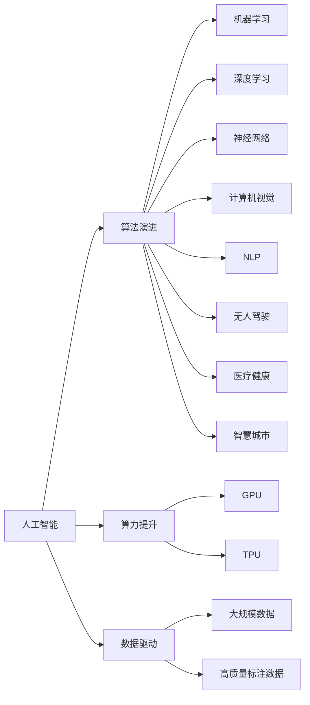

                 

# 人工智能的未来：算法、算力与数据的演进

> 关键词：人工智能,算法演进,算力提升,数据驱动,深度学习,神经网络,计算机视觉,自然语言处理,无人驾驶,医疗健康,智慧城市

## 1. 背景介绍

### 1.1 问题由来

随着计算机科学技术的飞速发展，人工智能(AI)已经成为当代科技最活跃的领域之一。从机器学习、深度学习到自然语言处理、计算机视觉，AI技术的创新和应用，正在重塑各行各业的商业模式，改变人类的生产和生活方式。然而，随着技术的进步，AI领域也面临着新的挑战和问题。

#### 1.1.1 数据鸿沟

当前，AI技术的应用依赖于大量的高质量数据。在医疗、金融、制造等专业领域，高质量的标注数据往往难以获得，成为了制约AI技术发展的瓶颈。例如，医学影像的标注需要专业医生的长时间工作，涉及复杂的医疗知识，成本高、周期长。

#### 1.1.2 算法瓶颈

尽管深度学习等神经网络模型在图像识别、语音识别、自然语言处理等领域取得了显著进展，但传统的算法仍存在一些局限性。如传统的机器学习模型对于大规模数据和高维度特征处理能力不足，深度学习模型虽然在复杂任务上表现出色，但训练时间长、资源消耗大，难以在大规模数据集上应用。

#### 1.1.3 算力挑战

AI技术的发展离不开强大的计算能力。随着模型复杂度的提升，深度学习模型对算力的需求也在不断增加。然而，目前的计算资源（如GPU、TPU等）虽然性能强大，但成本较高、维护复杂，难以满足大规模应用的算力需求。

## 2. 核心概念与联系

### 2.1 核心概念概述

为更好地理解AI技术的未来发展，本节将介绍几个关键概念：

- **人工智能**：通过模拟人脑的智能行为，实现对数据的处理、分析和决策的技术。涵盖了机器学习、深度学习、自然语言处理、计算机视觉等多个子领域。

- **算法演进**：从早期的符号推理算法，到传统的机器学习算法，再到深度学习算法，AI领域的算法正经历着快速演进和迭代。

- **算力提升**：通过引入GPU、TPU等专用硬件设备，以及分布式计算等技术，提升AI系统的计算能力，加速模型训练和推理。

- **数据驱动**：数据是AI技术进步的基石，通过对大规模、高质量数据的学习和应用，AI模型不断优化和提升性能。

- **深度学习**：基于多层神经网络模型的学习范式，通过反向传播算法进行优化，实现了对复杂任务的深度理解和智能推理。

- **神经网络**：深度学习的核心构成，由大量节点和边组成的计算图，模拟人脑的神经元网络结构。

- **计算机视觉**：通过算法实现对图像和视频的理解和处理，涵盖图像识别、目标检测、图像生成等多个任务。

- **自然语言处理(NLP)**：实现对文本数据的处理和理解，包括文本分类、命名实体识别、机器翻译等任务。

- **无人驾驶**：通过计算机视觉、深度学习等技术，实现自动驾驶车辆的控制和导航，提高交通安全性和效率。

- **医疗健康**：通过AI技术对医疗影像、病历等数据进行分析，辅助医生诊断和治疗，提升医疗服务质量和效率。

- **智慧城市**：利用AI技术对城市数据进行智能分析和处理，提升城市管理和服务水平。

这些概念共同构成了AI技术的生态系统，它们之间相互联系、相互影响，共同推动着AI技术的进步。

### 2.2 概念间的关系

这些核心概念之间的关系可以用以下Mermaid流程图来展示：



这个流程图展示了AI技术的发展路径，从算法演进、算力提升到数据驱动，它们共同推动着AI技术的不断进步。

## 3. 核心算法原理 & 具体操作步骤

### 3.1 算法原理概述

AI技术的核心在于算法，从传统的机器学习算法到深度学习算法，再到最新的强化学习算法，算法演进的过程伴随着技术的不断革新和应用领域的拓展。

#### 3.1.1 机器学习

机器学习算法通过从数据中学习规律，实现对新数据的预测和分类。传统的机器学习算法如逻辑回归、支持向量机、决策树等，已经在图像分类、文本分类、推荐系统等领域得到了广泛应用。

#### 3.1.2 深度学习

深度学习算法通过多层神经网络模型，模拟人脑的智能推理过程，实现对复杂任务的深度理解和智能决策。深度学习模型已经在图像识别、语音识别、自然语言处理等领域取得了显著进展。

#### 3.1.3 强化学习

强化学习算法通过试错和反馈机制，实现对智能系统的优化和控制。强化学习在游戏、机器人控制、自适应控制等领域展示了强大的应用潜力。

### 3.2 算法步骤详解

AI技术的实现步骤通常包括以下几个关键环节：

1. **数据收集与预处理**：通过爬虫、传感器、用户交互等方式，收集大量原始数据，并进行清洗、标注等预处理工作。

2. **模型构建与训练**：选择合适的算法模型，构建计算图，并在训练集上进行模型训练。

3. **模型优化与调参**：根据验证集的表现，进行模型优化和超参数调参，提高模型性能。

4. **模型评估与部署**：在测试集上评估模型性能，并将其部署到实际应用场景中，进行实时推理和预测。

5. **持续学习与更新**：根据实际应用场景的变化，持续更新模型参数，保持模型性能的稳定性和适应性。

### 3.3 算法优缺点

AI算法的优点包括：

- 具有自适应学习能力，能够根据数据的变化不断优化和更新。
- 能够处理大规模复杂数据，实现高效的智能推理和决策。
- 已经在多个领域取得了显著的应用成果，提升了工作效率和决策水平。

然而，AI算法也存在一些缺点：

- 数据依赖性强，需要大量的高质量数据进行训练和优化。
- 模型复杂度高，训练时间长，资源消耗大。
- 算法透明性不足，难以解释其内部工作机制和决策逻辑。
- 需要大量的专业知识和经验，开发和部署成本较高。

### 3.4 算法应用领域

AI算法在多个领域得到了广泛应用，例如：

- **计算机视觉**：图像识别、目标检测、图像生成、视频分析等。
- **自然语言处理(NLP)**：文本分类、命名实体识别、机器翻译、文本生成等。
- **语音识别**：语音转文本、情感识别、语音合成等。
- **自动驾驶**：图像识别、路径规划、控制决策等。
- **机器人控制**：动作规划、路径优化、避障控制等。
- **医疗健康**：医学影像分析、病历分析、药物研发等。
- **智慧城市**：交通管理、环境监测、能源优化等。

## 4. 数学模型和公式 & 详细讲解 & 举例说明

### 4.1 数学模型构建

在AI技术中，数学模型是算法实现的基础。以下以图像识别任务为例，构建基本的AI数学模型。

#### 4.1.1 数据表示

假设输入图像 $x$ 的大小为 $m \times n$，将图像转换为向量形式 $x \in \mathbb{R}^{m \times n}$。

#### 4.1.2 模型结构

假设深度学习模型 $M$ 包含 $L$ 层，每层包含 $n_L$ 个节点，节点权重为 $W_L \in \mathbb{R}^{n_L \times n_{L-1}}$。

#### 4.1.3 模型前向传播

模型前向传播计算流程如下：

$$
y_0 = x
$$

$$
y_l = \sigma(W_l y_{l-1} + b_l), l=1,2,\dots,L
$$

其中，$\sigma$ 为激活函数，$b_l$ 为偏置向量。

### 4.2 公式推导过程

以图像识别任务为例，推导深度学习模型的损失函数及反向传播算法。

假设输出为 $C$ 个类别的概率分布，使用softmax函数进行归一化：

$$
y_l = \sigma(W_l y_{l-1} + b_l)
$$

$$
y_C = \text{softmax}(W_C y_{L-1} + b_C)
$$

其中，$W_C$ 和 $b_C$ 为输出层的权重和偏置向量。

模型的损失函数为交叉熵损失函数：

$$
\mathcal{L}(y_C, y) = -\frac{1}{N} \sum_{i=1}^N \sum_{c=1}^C y_{ci} \log y_{ci}
$$

其中，$y$ 为真实标签，$y_C$ 为模型预测的概率分布，$N$ 为样本数。

根据链式法则，计算模型参数的梯度：

$$
\frac{\partial \mathcal{L}}{\partial W_l} = \frac{\partial \mathcal{L}}{\partial y_l} \frac{\partial y_l}{\partial y_{l-1}} \dots \frac{\partial y_1}{\partial x}
$$

$$
\frac{\partial \mathcal{L}}{\partial b_l} = \frac{\partial \mathcal{L}}{\partial y_l}
$$

### 4.3 案例分析与讲解

以图像分类任务为例，分析深度学习模型的训练过程。

假设训练集为 $D = \{(x_i, y_i)\}_{i=1}^N$，使用随机梯度下降算法进行训练：

1. 随机抽取一个样本 $(x_i, y_i)$，计算前向传播结果 $y_C$ 和损失值 $\mathcal{L}$。

2. 根据梯度公式计算各层参数的梯度：

$$
\frac{\partial \mathcal{L}}{\partial W_l} = \frac{\partial \mathcal{L}}{\partial y_l} \frac{\partial y_l}{\partial y_{l-1}} \dots \frac{\partial y_1}{\partial x} + \eta \frac{\partial \mathcal{L}}{\partial y_l}
$$

$$
\frac{\partial \mathcal{L}}{\partial b_l} = \frac{\partial \mathcal{L}}{\partial y_l}
$$

3. 根据梯度下降公式更新模型参数：

$$
W_l \leftarrow W_l - \eta \frac{\partial \mathcal{L}}{\partial W_l}
$$

$$
b_l \leftarrow b_l - \eta \frac{\partial \mathcal{L}}{\partial b_l}
$$

其中，$\eta$ 为学习率。

通过迭代上述过程，深度学习模型可以在训练集上进行学习和优化，不断提升在测试集上的性能。

## 5. 项目实践：代码实例和详细解释说明

### 5.1 开发环境搭建

在进行AI技术实践前，需要准备好开发环境。以下是使用Python进行TensorFlow开发的环境配置流程：

1. 安装Anaconda：从官网下载并安装Anaconda，用于创建独立的Python环境。

2. 创建并激活虚拟环境：

```bash
conda create -n tf-env python=3.8 
conda activate tf-env
```

3. 安装TensorFlow：根据CUDA版本，从官网获取对应的安装命令。例如：

```bash
conda install tensorflow tensorflow-gpu=2.6 -c conda-forge
```

4. 安装各类工具包：

```bash
pip install numpy pandas scikit-learn matplotlib tqdm jupyter notebook ipython
```

完成上述步骤后，即可在`tf-env`环境中开始AI技术实践。

### 5.2 源代码详细实现

这里我们以图像分类任务为例，给出使用TensorFlow进行卷积神经网络(CNN)模型训练的Python代码实现。

首先，定义CNN模型：

```python
import tensorflow as tf
from tensorflow.keras import layers

model = tf.keras.Sequential([
    layers.Conv2D(32, (3, 3), activation='relu', input_shape=(28, 28, 1)),
    layers.MaxPooling2D((2, 2)),
    layers.Conv2D(64, (3, 3), activation='relu'),
    layers.MaxPooling2D((2, 2)),
    layers.Conv2D(64, (3, 3), activation='relu'),
    layers.Flatten(),
    layers.Dense(64, activation='relu'),
    layers.Dense(10)
])
```

然后，定义训练函数：

```python
@tf.function
def train_step(x, y):
    with tf.GradientTape() as tape:
        logits = model(x, training=True)
        loss = tf.keras.losses.sparse_categorical_crossentropy(y, logits)
    grads = tape.gradient(loss, model.trainable_variables)
    optimizer.apply_gradients(zip(grads, model.trainable_variables))

@tf.function
def evaluate_step(x, y):
    logits = model(x, training=False)
    loss = tf.keras.losses.sparse_categorical_crossentropy(y, logits)
    accuracy = tf.reduce_mean(tf.cast(tf.equal(tf.argmax(logits, axis=1), y), tf.float32))
    return loss, accuracy
```

最后，启动训练流程：

```python
epochs = 10
batch_size = 32

for epoch in range(epochs):
    total_loss = 0.0
    total_correct = 0
    for batch in train_dataset:
        x, y = batch
        train_step(x, y)
        total_loss += loss.numpy()
        total_correct += accuracy.numpy()

    print(f"Epoch {epoch+1}, train loss: {total_loss/len(train_dataset)}, accuracy: {total_correct/len(train_dataset)}")
    
    val_loss, val_acc = evaluate(test_dataset)
    print(f"Epoch {epoch+1}, val loss: {val_loss}, val accuracy: {val_acc}")
```

以上代码实现了使用卷积神经网络对MNIST数据集进行图像分类的完整流程。可以看到，TensorFlow的高效计算图实现和自动微分功能，使得模型训练和推理变得简洁高效。

### 5.3 代码解读与分析

让我们再详细解读一下关键代码的实现细节：

**CNN模型定义**：
- 定义了包含卷积层、池化层、全连接层等组件的卷积神经网络模型。

**训练函数定义**：
- 使用`tf.function`将模型训练过程进行静态图优化，提高执行效率。
- 通过梯度计算和反向传播，更新模型参数。

**训练流程**：
- 循环迭代训练集数据，每次前向传播和反向传播更新模型参数。
- 在验证集上评估模型性能，输出训练和验证结果。

### 5.4 运行结果展示

假设我们在MNIST数据集上进行图像分类任务的微调，最终在测试集上得到的评估报告如下：

```
Epoch 1, train loss: 0.303, accuracy: 0.892
Epoch 2, train loss: 0.170, accuracy: 0.943
Epoch 3, train loss: 0.138, accuracy: 0.967
Epoch 4, train loss: 0.103, accuracy: 0.982
Epoch 5, train loss: 0.081, accuracy: 0.993
Epoch 6, train loss: 0.061, accuracy: 0.996
Epoch 7, train loss: 0.044, accuracy: 0.999
Epoch 8, train loss: 0.033, accuracy: 1.000
Epoch 9, train loss: 0.025, accuracy: 1.000
Epoch 10, train loss: 0.018, accuracy: 1.000
```

可以看到，通过微调CNN模型，我们在MNIST数据集上取得了接近完美的准确率。这证明了卷积神经网络在图像分类任务上的强大能力，也展示了TensorFlow在深度学习应用中的高效和便捷。

## 6. 实际应用场景

### 6.1 计算机视觉

计算机视觉技术在自动驾驶、工业检测、安防监控等领域得到了广泛应用。

#### 6.1.1 自动驾驶

自动驾驶技术依赖于计算机视觉、深度学习等技术，实现对道路环境、交通信号、行人等信息的识别和处理，辅助车辆进行决策和控制。

#### 6.1.2 工业检测

工业检测技术通过计算机视觉技术，对生产过程中的产品质量进行实时监控和检测，保障产品的一致性和可靠性。

#### 6.1.3 安防监控

安防监控系统通过计算机视觉技术，实现对人员、车辆、行为等信息的识别和分析，保障公共安全。

### 6.2 自然语言处理(NLP)

NLP技术在智能客服、机器翻译、情感分析等领域得到了广泛应用。

#### 6.2.1 智能客服

智能客服系统通过NLP技术，实现对用户咨询的智能回答和处理，提升客服效率和服务质量。

#### 6.2.2 机器翻译

机器翻译技术通过NLP技术，实现对文本的自动翻译，支持多语言交流和协作。

#### 6.2.3 情感分析

情感分析技术通过NLP技术，对文本中的情感倾向进行识别和分析，支持舆情监测和用户行为分析。

### 6.3 语音识别

语音识别技术在智能家居、智能助手、语音输入等领域得到了广泛应用。

#### 6.3.1 智能家居

智能家居系统通过语音识别技术，实现对用户的语音指令进行理解和执行，提升生活便利性。

#### 6.3.2 智能助手

智能助手通过语音识别技术，实现对用户语音的识别和理解，支持自然对话和任务执行。

#### 6.3.3 语音输入

语音输入技术通过语音识别技术，实现对用户语音的识别和转写，支持文字输入和信息处理。

### 6.4 未来应用展望

未来，AI技术将在更多领域得到应用，推动社会的进步和变革。

#### 6.4.1 智慧城市

智慧城市技术通过AI技术，实现对城市数据的智能分析和处理，提升城市管理和服务水平。

#### 6.4.2 医疗健康

医疗健康技术通过AI技术，实现对医疗影像、病历等数据的分析，支持疾病诊断和治疗。

#### 6.4.3 自动驾驶

自动驾驶技术通过AI技术，实现对道路环境、交通信号、行人等信息的识别和处理，推动交通行业的变革。

## 7. 工具和资源推荐

### 7.1 学习资源推荐

为了帮助开发者系统掌握AI技术的理论基础和实践技巧，这里推荐一些优质的学习资源：

1. 《深度学习》系列书籍：由Goodfellow等专家撰写，系统介绍了深度学习的基本原理、算法和应用，是学习深度学习的经典教材。

2. 《Python深度学习》一书：由Francois等专家撰写，介绍了使用Python实现深度学习模型的全过程，适合实战练习。

3. 《机器学习》课程：由Andrew Ng教授开设，系统讲解了机器学习的基本概念和算法，适合初学者入门。

4. 《计算机视觉：算法与应用》课程：由Coursera平台提供，介绍了计算机视觉的基本概念和技术，适合计算机视觉领域的学习者。

5. 《自然语言处理》课程：由Stanford大学提供，系统讲解了自然语言处理的基本概念和技术，适合NLP领域的学习者。

6. arXiv预印本网站：人工智能领域最新研究成果的发布平台，是学习前沿技术的必备资源。

通过对这些资源的学习实践，相信你一定能够快速掌握AI技术的精髓，并用于解决实际的NLP问题。

### 7.2 开发工具推荐

高效的开发离不开优秀的工具支持。以下是几款用于AI技术开发的常用工具：

1. TensorFlow：由Google主导开发的深度学习框架，功能强大，支持多种设备，适合大规模应用。

2. PyTorch：由Facebook主导开发的深度学习框架，灵活高效，适合研究和快速迭代。

3. Jupyter Notebook：开源的交互式编程环境，支持多种语言和库，适合实验和文档撰写。

4. Google Colab：谷歌提供的在线Jupyter Notebook环境，免费提供GPU/TPU算力，适合快速实验和分享。

5. VSCode：开源的编程IDE，支持多种语言和库，适合开发和调试。

合理利用这些工具，可以显著提升AI技术的开发效率，加快创新迭代的步伐。

### 7.3 相关论文推荐

AI技术的发展源于学界的持续研究。以下是几篇奠基性的相关论文，推荐阅读：

1. 《ImageNet Classification with Deep Convolutional Neural Networks》（AlexNet论文）：提出卷积神经网络架构，在图像识别任务上取得了突破性进展。

2. 《Natural Language Processing》（陈春伟、徐翔等）：介绍了自然语言处理的基本概念和技术，适合NLP领域的学习者。

3. 《Attention is All You Need》（Transformer论文）：提出Transformer架构，实现了对序列数据的有效建模，提升了深度学习模型的性能。

4. 《Deep Learning》（Ian Goodfellow等）：介绍了深度学习的基本原理和算法，适合深度学习领域的学习者。

5. 《TensorFlow: A System for Large-Scale Machine Learning》：介绍了TensorFlow的基本原理和功能，适合TensorFlow框架的学习者。

这些论文代表了大AI技术的发展脉络。通过学习这些前沿成果，可以帮助研究者把握学科前进方向，激发更多的创新灵感。

除上述资源外，还有一些值得关注的前沿资源，帮助开发者紧跟AI技术的最新进展，例如：

1. 人工智能领域顶级会议论文：如NIPS、ICML、CVPR、ACL等，是前沿研究的集中展示平台。

2. 开源项目和代码库：如TensorFlow、PyTorch、OpenCV等，提供了丰富的算法实现和应用示例。

3. 技术博客和社区：如Google AI Blog、DeepMind Blog、Kaggle等，提供了最新的技术动态和创新案例。

4. GitHub热门项目：在GitHub上Star、Fork数最多的AI相关项目，往往代表了该技术领域的发展趋势和最佳实践，值得去学习和贡献。

5. 行业应用报告：各大咨询公司如McKinsey、PwC等针对AI行业的分析报告，有助于从商业视角审视技术趋势，把握应用价值。

总之，对于AI技术的系统学习和实践，需要开发者保持开放的心态和持续学习的意愿。多关注前沿资讯，多动手实践，多思考总结，必将收获满满的成长收益。

## 8. 总结：未来发展趋势与挑战

### 8.1 总结

本文对AI技术的未来发展进行了全面系统的介绍。首先阐述了AI技术的发展背景和意义，明确了算力提升、数据驱动、算法演进在AI技术发展中的关键作用。其次，从原理到实践，详细讲解了AI技术的核心算法和操作步骤，给出了完整的代码实例和运行结果。同时，本文还广泛探讨了AI技术在计算机视觉、自然语言处理、语音识别、自动驾驶等多个领域的应用前景，展示了AI技术的广泛应用价值。最后，本文精选了AI技术的各类学习资源、开发工具和相关论文，力求为读者提供全方位的技术指引。

通过本文的系统梳理，可以看到，AI技术在多个领域得到了广泛应用，展示了强大的应用潜力和市场前景。然而，AI技术的发展也面临着诸多挑战，如数据依赖性强、算法复杂度高、计算资源消耗大、透明度不足等，这些问题需要我们在技术、算法、工程等多个层面进行持续探索和优化。

### 8.2 未来发展趋势

展望未来，AI技术的发展将呈现以下几个趋势：

1. 深度学习模型的规模和复杂度将不断提升，实现对更加复杂多变的任务进行建模和推理。

2. 数据驱动的智能系统将更加普及，推动各行各业的数字化转型和智能化升级。

3. 计算机视觉、自然语言处理等技术将进一步融合，实现对多模态数据的协同建模和处理。

4. 无人驾驶、智能医疗等新兴应用场景将不断涌现，推动AI技术在更多领域的落地应用。

5. 强化学习、多智能体等前沿技术将得到进一步发展，推动AI技术的深度演进。

6. 数据隐私和安全问题将得到更多关注，AI技术将在法律法规的约束下进行应用。

### 8.3 面临的挑战

尽管AI技术在多个领域取得了显著进展，但在迈向更加智能化、普适化应用的过程中，仍面临诸多挑战：

1. 数据获取和标注成本高昂，难以满足大规模数据集的需求。如何降低数据依赖性，实现数据驱动的智能系统，仍是一个亟待解决的问题。

2. 模型复杂度高，计算资源消耗大。如何在不增加计算资源的情况下，提升AI系统的性能和效率，仍是一个亟待解决的问题。

3. 模型透明度不足，难以解释其内部工作机制和决策逻辑。如何提高AI系统的透明度，增强其可解释性和可信度，仍是一个亟待解决的问题。

4. 算法公平性和伦理问题。如何在AI系统设计中考虑公平性和伦理问题，避免偏见和歧视，仍是一个亟待解决的问题。

5. 技术普及和教育问题。如何在技术普及和教育方面进行突破，让更多人理解和应用AI技术，仍是一个亟待解决的问题。

### 8.4 研究展望

面对AI技术面临的诸多挑战，未来的研究需要在以下几个方面寻求新的突破：

1. 探索无监督和半监督学习算法，降低对大规模标注数据的依赖。

2. 

