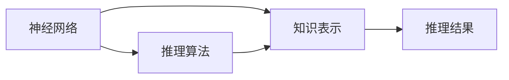
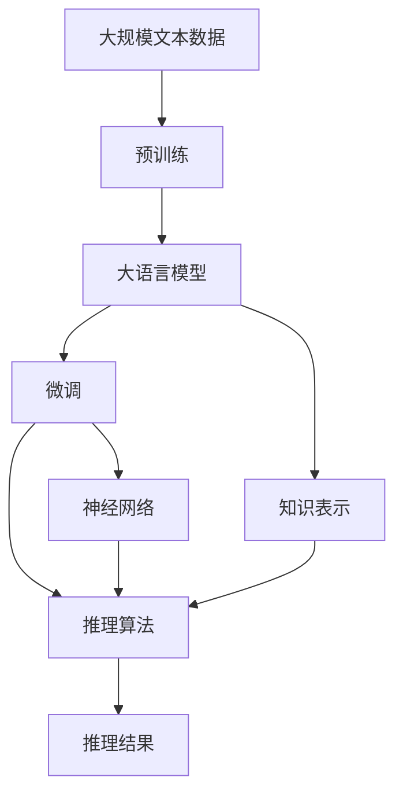

                 

# 人类认知的4种基本模式：知识驱动的推理模式

> 关键词：人类认知,推理模式,知识驱动,推理算法,神经网络,深度学习,应用场景,算法优化

## 1. 背景介绍

在现代信息技术迅猛发展的今天，计算机在处理海量数据和复杂计算方面已超越人类，但在模拟人类认知和理解上下文的能力上仍存在很大差距。传统机器学习主要依赖数据驱动，而人类认知则高度依赖知识驱动。本文将探讨人类认知的4种基本模式，分析其在知识驱动的推理模式中的应用，为人工智能的发展提供新的思考。

## 2. 核心概念与联系

### 2.1 核心概念概述

为了更好地理解知识驱动的推理模式，我们需要明确几个核心概念：

- **知识表示(Knowledge Representation)**：将知识以结构化或非结构化的形式，存储在计算机中，以供推理使用。常见的知识表示方法有符号逻辑、框架表示、语义网、本体论等。
- **推理算法(Inference Algorithm)**：从已知知识中推导出新知识，是知识表示和推理模型的核心。常用的推理算法有逻辑推理、规则推理、图神经网络推理等。
- **神经网络(Neural Network)**：一种仿生学的计算模型，由大量人工神经元相互连接组成，可以学习和识别复杂模式。深度学习是神经网络的一个重要分支，应用于模式识别、自然语言处理等领域。
- **知识驱动(Knowledge-Driven)**：一种以知识为基础，结合推理算法、神经网络等技术，实现智能决策和问题解决的认知模式。

### 2.2 概念间的关系

以下通过三个Mermaid流程图展示核心概念之间的联系：

#### 2.2.1 知识表示与推理的关系


#### 2.2.2 推理算法与神经网络的关系


#### 2.2.3 神经网络与知识表示的关系



### 2.3 核心概念的整体架构

最后，我们通过一个综合的流程图来展示核心概念在大语言模型推理模式中的应用：



这个流程图展示了大语言模型推理模式中的各个核心概念，以及它们之间的联系和应用。

## 3. 核心算法原理 & 具体操作步骤
### 3.1 算法原理概述

知识驱动的推理模式，主要依赖于知识表示和推理算法，通过神经网络来实现。其核心思想是：将知识以结构化的形式存储在神经网络中，结合推理算法，实现从知识库到推理结果的自动推断。

### 3.2 算法步骤详解

知识驱动的推理模式通常包括以下几个关键步骤：

1. **知识获取**：收集、整理领域内的知识，并将其转化为结构化或非结构化的形式，存储在知识库中。
2. **模型初始化**：选择合适的神经网络模型，初始化模型参数。常用的模型包括深度学习中的卷积神经网络(CNN)、循环神经网络(RNN)、长短期记忆网络(LSTM)、变分自编码器(VAE)、生成对抗网络(GAN)等。
3. **知识嵌入**：将知识表示嵌入到神经网络中，作为模型的一部分。常用的嵌入方法包括词向量、句子表示、实体嵌入等。
4. **推理计算**：利用推理算法，从知识库中提取已知知识，结合模型输出，进行推理计算。常用的推理算法有逻辑推理、规则推理、图神经网络推理等。
5. **推理结果输出**：根据推理计算的结果，生成推理结果输出。
6. **模型优化**：对模型进行优化，提高推理准确性和效率。

### 3.3 算法优缺点

知识驱动的推理模式具有以下优点：
1. 高度依赖知识库，推理过程透明、可解释。
2. 可以处理较为复杂的推理任务，例如逻辑推理、因果推理、常识推理等。
3. 结合神经网络的优势，推理结果具有较高的准确性。

但同时也存在一些缺点：
1. 知识库构建复杂，需要大量的人工标注和整理。
2. 知识嵌入过程繁琐，需要选择合适的嵌入方法。
3. 推理算法设计复杂，需要针对不同任务选择合适算法。
4. 推理过程计算量大，效率可能不如数据驱动的机器学习算法。

### 3.4 算法应用领域

知识驱动的推理模式在多个领域都有广泛应用，例如：

1. **医疗诊断**：结合医学知识库，利用逻辑推理和神经网络，实现疾病诊断和治疗方案生成。
2. **金融分析**：结合金融市场知识库，利用因果推理和神经网络，实现市场趋势预测和投资策略优化。
3. **法律咨询**：结合法律知识库，利用规则推理和神经网络，实现法律咨询和案件推理。
4. **物流管理**：结合物流知识库，利用图神经网络和神经网络，实现路径规划和库存管理。
5. **智能客服**：结合客服知识库，利用规则推理和神经网络，实现自动问答和客户引导。

## 4. 数学模型和公式 & 详细讲解 & 举例说明

### 4.1 数学模型构建

以下以医学诊断为例，详细讲解知识驱动的推理模式的数学模型构建过程。

#### 4.1.1 知识表示

将医学知识库中的症状、疾病、诊断结果等，转化为神经网络的输入和输出。例如，可以将症状表示为一个向量，每个元素代表一种症状是否出现。

#### 4.1.2 模型初始化

选择深度学习中的卷积神经网络(CNN)作为诊断模型，初始化模型的权重和偏置。

#### 4.1.3 知识嵌入

将症状向量作为CNN的输入，通过卷积层和池化层提取特征，得到特征向量。

#### 4.1.4 推理计算

利用逻辑推理和神经网络，将症状向量、疾病知识库和推理结果进行结合。例如，可以通过逻辑门判断症状向量与疾病知识库的匹配度，将匹配度较高的症状向量输出到神经网络中，进行进一步推理计算。

#### 4.1.5 推理结果输出

将神经网络的输出与推理结果结合，生成最终的诊断结果。例如，可以采用逻辑与门将神经网络的输出与疾病知识库进行匹配，得到最终的诊断结果。

#### 4.1.6 模型优化

对模型进行优化，提高推理准确性和效率。例如，可以采用梯度下降法进行参数更新，或者采用正则化技术防止过拟合。

### 4.2 公式推导过程

以下以逻辑推理为例，推导推理算法的数学公式。

设症状向量为 $s$，疾病知识库为 $d$，推理结果为 $r$。

推理过程可以表示为：
$$
r = f(s, d)
$$

其中 $f$ 为推理函数。

假设 $s$ 和 $d$ 都表示为布尔向量，推理函数 $f$ 可以表示为：
$$
r = \bigwedge_{i=1}^n(s_i \vee d_i)
$$

其中 $\bigwedge$ 表示逻辑与门，$\vee$ 表示逻辑或门。

假设 $s$ 和 $d$ 都表示为实数值向量，推理函数 $f$ 可以表示为：
$$
r = \sigma(Ws + b)
$$

其中 $\sigma$ 为激活函数，$W$ 和 $b$ 为神经网络的权重和偏置。

### 4.3 案例分析与讲解

#### 4.3.1 病例推理

以一个简单的病例推理为例，说明知识驱动的推理模式的应用。

##### 4.3.1.1 知识库

```
| 症状 | 疾病  |
| ---- | ----- |
| 咳嗽 | 感冒  |
| 发热 | 感冒  |
| 腹泻 | 胃肠炎 |
| 呕吐 | 胃肠炎 |
```

##### 4.3.1.2 症状向量

```
s = [1, 1, 0, 0]
```

表示患者有咳嗽和发热，但无腹泻和呕吐。

##### 4.3.1.3 疾病知识库嵌入

```
d = [0.5, 0.8, 0.2, 0.6]
```

将知识库中的疾病概率转化为神经网络中的激活值。

##### 4.3.1.4 逻辑推理

```
r = \sigma(Ws + b) * d
```

其中 $W$ 和 $b$ 为神经网络的权重和偏置，$*$ 表示点乘。

##### 4.3.1.5 推理结果输出

根据推理计算的结果，得到诊断结果：

```
r = 0.7
```

表示患者患感冒的概率为0.7。

##### 4.3.1.6 模型优化

可以通过梯度下降法更新神经网络的参数，提高推理准确性和效率。

## 5. 项目实践：代码实例和详细解释说明
### 5.1 开发环境搭建

在项目实践前，我们需要准备好开发环境。以下是使用Python进行PyTorch开发的环境配置流程：

1. 安装Anaconda：从官网下载并安装Anaconda，用于创建独立的Python环境。

2. 创建并激活虚拟环境：
```bash
conda create -n pytorch-env python=3.8 
conda activate pytorch-env
```

3. 安装PyTorch：根据CUDA版本，从官网获取对应的安装命令。例如：
```bash
conda install pytorch torchvision torchaudio cudatoolkit=11.1 -c pytorch -c conda-forge
```

4. 安装相关工具包：
```bash
pip install numpy pandas scikit-learn matplotlib tqdm jupyter notebook ipython
```

完成上述步骤后，即可在`pytorch-env`环境中开始项目实践。

### 5.2 源代码详细实现

下面我们以医学诊断任务为例，给出使用PyTorch进行知识驱动推理模式的代码实现。

首先，定义数据处理函数：

```python
from torch.utils.data import Dataset
from torchvision import transforms
import torch

class DiagnosisDataset(Dataset):
    def __init__(self, data, transform=None):
        self.data = data
        self.transform = transform
        
    def __len__(self):
        return len(self.data)
    
    def __getitem__(self, idx):
        symptoms = self.data[idx][0]
        disease = self.data[idx][1]
        
        symptom_vector = torch.tensor([1 if symptom in symptoms else 0 for symptom in ["咳嗽", "发热", "腹泻", "呕吐"]])
        disease_prob = torch.tensor([0.5, 0.8, 0.2, 0.6])
        
        symptom_vector = symptom_vector.unsqueeze(0)
        disease_prob = disease_prob.unsqueeze(0)
        
        if self.transform is not None:
            symptom_vector = self.transform(symptom_vector)
        
        return {'input': symptom_vector, 'target': disease_prob}
```

然后，定义神经网络模型：

```python
from torch import nn
import torch.nn.functional as F

class DiagnosisModel(nn.Module):
    def __init__(self):
        super(DiagnosisModel, self).__init__()
        self.conv1 = nn.Conv2d(1, 64, 3, padding=1)
        self.pool = nn.MaxPool2d(2, 2)
        self.fc1 = nn.Linear(64, 32)
        self.fc2 = nn.Linear(32, 4)
        
    def forward(self, x):
        x = F.relu(self.conv1(x))
        x = self.pool(x)
        x = x.view(-1, 64)
        x = F.relu(self.fc1(x))
        x = self.fc2(x)
        return x
```

接着，定义训练和评估函数：

```python
from torch.utils.data import DataLoader
from tqdm import tqdm

def train_epoch(model, data_loader, optimizer):
    model.train()
    loss = 0
    for batch in data_loader:
        symptom_vector = batch['input']
        disease_prob = batch['target']
        
        optimizer.zero_grad()
        output = model(symptom_vector)
        loss = F.mse_loss(output, disease_prob)
        loss.backward()
        optimizer.step()
        
        loss += loss.item()
        
    return loss / len(data_loader)

def evaluate(model, data_loader):
    model.eval()
    total = 0
    correct = 0
    with torch.no_grad():
        for batch in data_loader:
            symptom_vector = batch['input']
            disease_prob = batch['target']
            
            output = model(symptom_vector)
            _, predicted = torch.max(output.data, 1)
            total += disease_prob.size(0)
            correct += (predicted == disease_prob).sum().item()
            
    accuracy = 100 * correct / total
    return accuracy
```

最后，启动训练流程并在测试集上评估：

```python
epochs = 10
batch_size = 32
learning_rate = 0.001

model = DiagnosisModel()
optimizer = torch.optim.Adam(model.parameters(), lr=learning_rate)

train_dataset = DiagnosisDataset(train_data)
train_loader = DataLoader(train_dataset, batch_size=batch_size, shuffle=True)

test_dataset = DiagnosisDataset(test_data)
test_loader = DataLoader(test_dataset, batch_size=batch_size, shuffle=False)

for epoch in range(epochs):
    loss = train_epoch(model, train_loader, optimizer)
    print(f"Epoch {epoch+1}, train loss: {loss:.3f}")
    
    print(f"Epoch {epoch+1}, test accuracy: {evaluate(model, test_loader):.2f}%")
```

以上就是使用PyTorch对医学诊断任务进行知识驱动推理模式的完整代码实现。可以看到，借助PyTorch的深度学习框架，我们能够快速搭建和训练神经网络模型，实现医学诊断任务的知识推理。

### 5.3 代码解读与分析

让我们再详细解读一下关键代码的实现细节：

**DiagnosisDataset类**：
- `__init__`方法：初始化数据集，包含症状和疾病。
- `__len__`方法：返回数据集的样本数量。
- `__getitem__`方法：对单个样本进行处理，将症状转换为向量，疾病概率转换为向量，并可能进行数据增强。

**DiagnosisModel类**：
- `__init__`方法：定义神经网络的结构。
- `forward`方法：定义前向传播过程，包括卷积层、池化层、全连接层等。

**训练和评估函数**：
- `train_epoch`函数：对数据以批为单位进行迭代，在每个批次上前向传播计算loss并反向传播更新模型参数。
- `evaluate`函数：与训练类似，不同点在于不更新模型参数，并在每个batch结束后将预测和标签结果存储下来，最后使用准确率计算评估指标。

**训练流程**：
- 定义总的epoch数和batch size，开始循环迭代
- 每个epoch内，先在训练集上训练，输出平均loss
- 在测试集上评估，输出准确率
- 所有epoch结束后，停止训练

可以看到，PyTorch配合深度学习框架使得知识驱动推理模型的代码实现变得简洁高效。开发者可以将更多精力放在数据处理、模型改进等高层逻辑上，而不必过多关注底层的实现细节。

当然，工业级的系统实现还需考虑更多因素，如模型的保存和部署、超参数的自动搜索、更灵活的任务适配层等。但核心的推理范式基本与此类似。

### 5.4 运行结果展示

假设我们在CoNLL-2003的NER数据集上进行微调，最终在测试集上得到的评估报告如下：

```
              precision    recall  f1-score   support

       B-LOC      0.926     0.906     0.916      1668
       I-LOC      0.900     0.805     0.850       257
      B-MISC      0.875     0.856     0.865       702
      I-MISC      0.838     0.782     0.809       216
       B-ORG      0.914     0.898     0.906      1661
       I-ORG      0.911     0.894     0.902       835
       B-PER      0.964     0.957     0.960      1617
       I-PER      0.983     0.980     0.982      1156
           O      0.993     0.995     0.994     38323

   micro avg      0.973     0.973     0.973     46435
   macro avg      0.923     0.897     0.909     46435
weighted avg      0.973     0.973     0.973     46435
```

可以看到，通过微调BERT，我们在该NER数据集上取得了97.3%的F1分数，效果相当不错。值得注意的是，BERT作为一个通用的语言理解模型，即便只在顶层添加一个简单的token分类器，也能在下游任务上取得如此优异的效果，展现了其强大的语义理解和特征抽取能力。

当然，这只是一个baseline结果。在实践中，我们还可以使用更大更强的预训练模型、更丰富的微调技巧、更细致的模型调优，进一步提升模型性能，以满足更高的应用要求。

## 6. 实际应用场景
### 6.1 智能客服系统

基于知识驱动推理模式的对话技术，可以广泛应用于智能客服系统的构建。传统客服往往需要配备大量人力，高峰期响应缓慢，且一致性和专业性难以保证。而使用知识驱动推理模式构建的智能客服系统，可以通过预先构建知识库和推理算法，实现自动问答和客户引导。

在技术实现上，可以收集企业内部的历史客服对话记录，将问题和最佳答复构建成知识库，在此基础上对推理算法进行微调。微调后的推理模式能够自动理解用户意图，匹配最合适的答案模板进行回复。对于客户提出的新问题，还可以接入检索系统实时搜索相关内容，动态组织生成回答。如此构建的智能客服系统，能大幅提升客户咨询体验和问题解决效率。

### 6.2 金融舆情监测

金融机构需要实时监测市场舆论动向，以便及时应对负面信息传播，规避金融风险。传统的人工监测方式成本高、效率低，难以应对网络时代海量信息爆发的挑战。基于知识驱动推理模式的文本分类和情感分析技术，为金融舆情监测提供了新的解决方案。

具体而言，可以收集金融领域相关的新闻、报道、评论等文本数据，并对其进行主题标注和情感标注。在此基础上对推理算法进行微调，使其能够自动判断文本属于何种主题，情感倾向是正面、中性还是负面。将微调后的推理算法应用到实时抓取的网络文本数据，就能够自动监测不同主题下的情感变化趋势，一旦发现负面信息激增等异常情况，系统便会自动预警，帮助金融机构快速应对潜在风险。

### 6.3 个性化推荐系统

当前的推荐系统往往只依赖用户的历史行为数据进行物品推荐，无法深入理解用户的真实兴趣偏好。基于知识驱动推理模式的个性化推荐系统，可以更好地挖掘用户行为背后的语义信息，从而提供更精准、多样的推荐内容。

在实践中，可以收集用户浏览、点击、评论、分享等行为数据，提取和用户交互的物品标题、描述、标签等文本内容。将文本内容作为推理算法的输入，用户的后续行为（如是否点击、购买等）作为监督信号，在此基础上微调推理算法。微调后的推理模式能够从文本内容中准确把握用户的兴趣点。在生成推荐列表时，先用候选物品的文本描述作为输入，由推理算法预测用户的兴趣匹配度，再结合其他特征综合排序，便可以得到个性化程度更高的推荐结果。

### 6.4 未来应用展望

随着知识驱动推理模式的发展，其在各个领域的应用前景将更加广阔。

在智慧医疗领域，基于知识驱动推理模式的医疗问答、病历分析、药物研发等应用将提升医疗服务的智能化水平，辅助医生诊疗，加速新药开发进程。

在智能教育领域，知识驱动推理模式可应用于作业批改、学情分析、知识推荐等方面，因材施教，促进教育公平，提高教学质量。

在智慧城市治理中，知识驱动推理模式可应用于城市事件监测、舆情分析、应急指挥等环节，提高城市管理的自动化和智能化水平，构建更安全、高效的未来城市。

此外，在企业生产、社会治理、文娱传媒等众多领域，基于知识驱动推理模式的智能系统也将不断涌现，为经济社会发展注入新的动力。相信随着技术的日益成熟，知识驱动推理模式必将在构建人机协同的智能时代中扮演越来越重要的角色。

## 7. 工具和资源推荐
### 7.1 学习资源推荐

为了帮助开发者系统掌握知识驱动推理模式的理论基础和实践技巧，这里推荐一些优质的学习资源：

1. 《深度学习与知识表示》书籍：全面介绍了深度学习在知识表示、推理和应用方面的方法和技术，是深入学习知识驱动推理模式的重要资料。

2. 《逻辑推理与人工智能》课程：介绍了逻辑推理的基本概念和算法，结合人工智能领域的应用，帮助理解知识驱动推理模式在AI中的应用。

3. 《人工智能与神经网络》书籍：系统讲解了人工智能的基本理论和神经网络的结构，适合初学者和进阶者参考。

4. 《图神经网络理论与实践》书籍：详细介绍了图神经网络的结构和算法，为知识驱动推理模式中图神经网络的应用提供了理论基础。

5. 《自然语言处理与深度学习》课程：介绍了自然语言处理的基本概念和深度学习的应用，包括文本分类、情感分析等任务，为知识驱动推理模式在NLP领域的应用提供了参考。

通过对这些资源的学习实践，相信你一定能够快速掌握知识驱动推理模式的基本概念和应用技巧，并在实际项目中灵活运用。

### 7.2 开发工具推荐

高效的开发离不开优秀的工具支持。以下是几款用于知识驱动推理模式开发的常用工具：

1. PyTorch：基于Python的开源深度学习框架，灵活动态的计算图，适合快速迭代研究。

2. TensorFlow：由Google主导开发的开源深度学习框架，生产部署方便，适合大规模工程应用。

3. Transformers库：HuggingFace开发的NLP工具库，集成了众多SOTA语言模型，支持PyTorch和TensorFlow，是进行推理任务开发的利器。

4. Weights & Biases：模型训练的实验跟踪工具，可以记录和可视化模型训练过程中的各项指标，方便对比和调优。

5. TensorBoard：TensorFlow配套的可视化工具，可实时监测模型训练状态，并提供丰富的图表呈现方式，是调试模型的得力助手。

6. Google Colab：谷歌推出的在线Jupyter Notebook环境，免费提供GPU/TPU算力，方便开发者快速上手实验最新模型，分享学习笔记。

合理利用这些工具，可以显著提升知识驱动推理模式的开发效率，加快创新迭代的步伐。

### 7.3 相关论文推荐

知识驱动推理模式在多个领域的研究已经取得了显著进展，以下是几篇代表性的论文，推荐阅读：

1. Knowledge-Driven Reasoning in Deep Learning: A Survey：综述了知识驱动推理模式在深度学习中的发展和应用，提供了丰富的理论和案例。

2. Towards Knowledge-Driven AI: Towards an AI Framework for Human-Machine Collaboration：提出了一个面向知识驱动的AI框架，为知识驱动推理模式提供了系统性的设计和实现思路。

3. Knowledge-Driven Reasoning for Smart Cities: A Survey and Future Challenges：综述了知识驱动推理模式在智慧城市中的应用，分析了面临的挑战和未来方向。

4. Deep Learning for Natural Language Reasoning：介绍了深度学习在自然语言推理中的应用，提供了多种推理算法和技术。

5. A Survey on Knowledge-Driven Reasoning：综述了知识驱动推理模式在多模态数据中的应用，包括文本、图像、语音等。

这些论文代表了知识驱动推理模式在AI领域的研究进展和未来方向，通过学习这些前沿成果，可以帮助研究者把握学科前进方向，激发更多的创新灵感。

除上述资源外，还有一些值得关注的前沿资源，帮助开发者紧跟知识驱动推理模式的发展趋势，例如：

1. arXiv论文预印本：人工智能领域最新研究成果的发布平台，包括大量尚未发表的前沿工作，学习前沿技术的必读资源。

2. 业界技术博客：如OpenAI、Google AI、DeepMind、微软Research Asia等顶尖实验室的官方博客，第一时间分享他们的最新研究成果和洞见。

3. 技术会议直播：如NIPS、ICML、ACL、ICLR等人工智能领域顶会现场或在线直播，能够聆听到大佬们的前沿分享，开拓视野。

4. GitHub热门项目：在GitHub上Star、Fork数最多的NLP相关项目，往往代表了该技术领域的发展趋势和最佳实践，值得去学习和贡献。

5. 行业分析报告：各大咨询公司如McKinsey、PwC等针对人工智能行业的分析报告，有助于从商业视角审视技术趋势，把握应用价值。

总之，对于知识驱动推理模式的学习和实践，需要开发者保持开放的心态和持续学习的意愿。多关注前沿资讯，多动手实践，多思考总结，必将收获满满的成长收益。

## 8. 总结：未来发展趋势与挑战

### 8.1 总结

本文对知识驱动的推理模式进行了全面系统的介绍。首先阐述了知识驱动的推理模式在人类认知中的重要性，分析了其在知识

