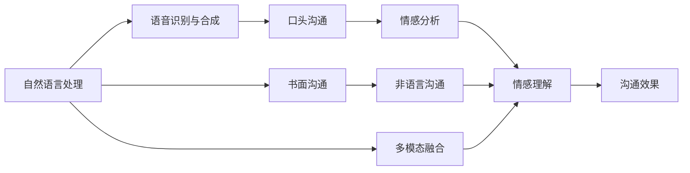
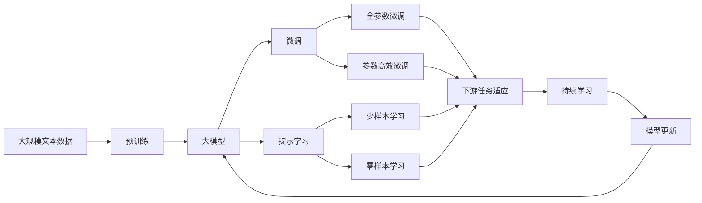

                 

# 人际沟通：人际沟通即与他人交换信息、交流感受、表达意思，包括口头沟通、书面沟通、非语言沟通、倾听

> 关键词：人际沟通, 口头沟通, 书面沟通, 非语言沟通, 倾听

## 1. 背景介绍

### 1.1 问题由来

人际沟通是人类社会交往的基础，涉及到语言、情感、意图等多个维度的复杂信息交互。随着信息技术的发展，特别是互联网的普及，远程沟通变得越来越普遍。然而，传统的沟通方式往往面临时空限制，信息传递速度和准确性难以保证。此外，语言差异、文化隔阂等问题也使得沟通变得更加困难。这些问题催生了对于新型沟通方式的迫切需求，进而推动了基于人工智能的人际沟通技术的发展。

### 1.2 问题核心关键点

人际沟通的核心在于实现人与人之间的高效信息交换和情感理解。随着人工智能技术的发展，自然语言处理(NLP)、语音识别、计算机视觉等技术为实现这一目标提供了可能性。其中，基于大模型的对话系统、情感分析工具、视觉感知模型等，已经在诸多实际应用中展现出了强大的潜力。

### 1.3 问题研究意义

研究人际沟通的技术，对于提升人类交流质量、改善工作效率、增强社会协作具有重要意义：

1. 提升交流效率。通过自动化处理语言和情感信息，人际沟通技术可以显著降低交流成本，提高沟通效率。
2. 增强情感理解。利用人工智能对文本和语音进行分析，可以更准确地理解对方的情感状态，从而增强交流的深度和质量。
3. 降低文化障碍。人工智能可以通过多语言处理和跨文化理解，减少不同语言和文化背景下的交流困难。
4. 提供个性化服务。通过分析用户的行为和情感，人际沟通技术可以提供更符合用户需求的个性化交流体验。
5. 构建智能辅助系统。对于医疗、教育、客服等特定行业，人际沟通技术可以构建智能助手，提高服务质量和用户体验。

## 2. 核心概念与联系

### 2.1 核心概念概述

为更好地理解人际沟通技术，本节将介绍几个关键概念：

- 自然语言处理(NLP)：涉及计算机对自然语言的理解、生成和处理，是实现人际沟通的基础。
- 语音识别与合成：将人类语音转换为文本或音波，将文本转换为可听语音，是实现口头沟通的核心技术。
- 情感分析：识别和分析文本、语音中的情感信息，是增强情感理解和交流效果的关键手段。
- 计算机视觉：利用图像识别和处理技术，捕捉和理解非语言信息，如面部表情、手势等，是实现非语言沟通的重要工具。
- 多模态融合：将文本、语音、图像等多种信息源进行融合，以更全面地理解人类交流的意图和情感。

这些核心概念共同构成了人际沟通技术的知识体系，使其能够适应不同场景下的需求，实现高效的信息和情感交互。

### 2.2 概念间的关系

这些核心概念之间的关系可以通过以下Mermaid流程图来展示：



这个流程图展示了核心概念间的联系和沟通技术的整体架构：

1. 自然语言处理将文本信息转换为计算机可处理的形式。
2. 语音识别与合成将语音信息转换为文本或音波，实现口头沟通。
3. 情感分析识别文本、语音中的情感信息，增强情感理解。
4. 计算机视觉捕捉面部表情、手势等非语言信息，实现非语言沟通。
5. 多模态融合整合多种信息源，全面理解交流意图和情感。

这些概念通过互相协作，形成了一个完整的沟通系统，能够支持不同形式和场景下的人际交流。

### 2.3 核心概念的整体架构

最后，我们用一个综合的流程图来展示这些核心概念在大模型微调中的应用：



这个综合流程图展示了从预训练到微调，再到持续学习的完整过程：

1. 大规模文本数据进行预训练，形成通用语言模型。
2. 大模型在特定下游任务上进行微调，优化模型性能。
3. 提示学习可以在不更新模型参数的情况下，实现少样本和零样本学习。
4. 全参数微调和参数高效微调分别调整不同层级的参数，以提高微调效率。
5. 持续学习使模型能够持续学习新知识，避免遗忘旧知识。

通过这些流程图，我们可以更清晰地理解大模型微调过程中各个核心概念的相互关系和作用，为后续深入讨论具体的微调方法和技术奠定基础。

## 3. 核心算法原理 & 具体操作步骤
### 3.1 算法原理概述

基于大模型的沟通技术，通常采用监督学习的微调方法。其核心思想是：将大模型视作一个强大的"特征提取器"，通过在特定任务上的少量标注数据进行有监督的微调，使得模型能够在该任务上表现出色。

形式化地，假设大模型为 $M_{\theta}$，其中 $\theta$ 为模型参数。给定沟通任务的标注数据集 $D=\{(x_i, y_i)\}_{i=1}^N$，微调的目标是找到新的模型参数 $\hat{\theta}$，使得模型在该任务上的输出 $M_{\hat{\theta}}(x_i)$ 尽可能接近真实标签 $y_i$。

微调的具体过程如下：

1. 准备预训练模型和数据集：选择合适的预训练语言模型 $M_{\theta}$ 作为初始化参数，收集沟通任务的标注数据集 $D$。
2. 添加任务适配层：根据任务类型，设计合适的输出层和损失函数。对于分类任务，通常在顶层添加线性分类器和交叉熵损失函数。
3. 设置微调超参数：选择合适的优化算法及其参数，如 AdamW、SGD 等，设置学习率、批大小、迭代轮数等。
4. 执行梯度训练：将训练集数据分批次输入模型，前向传播计算损失函数。反向传播计算参数梯度，根据设定的优化算法和学习率更新模型参数。周期性在验证集上评估模型性能，根据性能指标决定是否触发 Early Stopping。重复上述步骤直到满足预设的迭代轮数或 Early Stopping 条件。
5. 测试和部署：在测试集上评估微调后模型 $M_{\hat{\theta}}$ 的性能，对比微调前后的效果提升。使用微调后的模型对新样本进行推理预测，集成到实际的应用系统中。

### 3.2 算法步骤详解

以情感分析任务为例，介绍基于监督学习的大模型微调的具体步骤：

1. 数据预处理：将情感分析任务的标注数据集 $D=\{(x_i, y_i)\}_{i=1}^N$ 划分为训练集、验证集和测试集。其中，每个样本 $x_i$ 为一段文本，$y_i$ 为情感标签，如正面、负面或中性。

2. 模型选择：选择预训练语言模型，如 BERT、GPT 等，作为初始化参数。例如，使用 PyTorch 加载预训练好的 BERT 模型。

3. 任务适配：在 BERT 模型顶层添加线性分类器和交叉熵损失函数，用于情感分类任务。

```python
from transformers import BertForSequenceClassification
from transformers import BertTokenizer

model = BertForSequenceClassification.from_pretrained('bert-base-cased', num_labels=3)
tokenizer = BertTokenizer.from_pretrained('bert-base-cased')
```

4. 设置超参数：

```python
from transformers import AdamW

optimizer = AdamW(model.parameters(), lr=2e-5)
```

5. 训练过程：

```python
from torch.utils.data import DataLoader
from tqdm import tqdm
from sklearn.metrics import accuracy_score, f1_score

device = torch.device('cuda') if torch.cuda.is_available() else torch.device('cpu')
model.to(device)

def train_epoch(model, dataset, batch_size, optimizer):
    dataloader = DataLoader(dataset, batch_size=batch_size, shuffle=True)
    model.train()
    epoch_loss = 0
    for batch in tqdm(dataloader, desc='Training'):
        input_ids = batch['input_ids'].to(device)
        attention_mask = batch['attention_mask'].to(device)
        labels = batch['labels'].to(device)
        model.zero_grad()
        outputs = model(input_ids, attention_mask=attention_mask, labels=labels)
        loss = outputs.loss
        epoch_loss += loss.item()
        loss.backward()
        optimizer.step()
    return epoch_loss / len(dataloader)

def evaluate(model, dataset, batch_size):
    dataloader = DataLoader(dataset, batch_size=batch_size)
    model.eval()
    preds, labels = [], []
    with torch.no_grad():
        for batch in tqdm(dataloader, desc='Evaluating'):
            input_ids = batch['input_ids'].to(device)
            attention_mask = batch['attention_mask'].to(device)
            batch_labels = batch['labels']
            outputs = model(input_ids, attention_mask=attention_mask)
            batch_preds = outputs.logits.argmax(dim=2).to('cpu').tolist()
            batch_labels = batch_labels.to('cpu').tolist()
            for pred_tokens, label_tokens in zip(batch_preds, batch_labels):
                preds.append(pred_tokens)
                labels.append(label_tokens)
    print(f'Accuracy: {accuracy_score(labels, preds)}')
    print(f'F1 Score: {f1_score(labels, preds, average='micro')}')
```

6. 测试过程：

```python
epochs = 5
batch_size = 16

for epoch in range(epochs):
    loss = train_epoch(model, train_dataset, batch_size, optimizer)
    print(f'Epoch {epoch+1}, train loss: {loss:.3f}')
    
    print(f'Epoch {epoch+1}, dev results:')
    evaluate(model, dev_dataset, batch_size)
    
print('Test results:')
evaluate(model, test_dataset, batch_size)
```

### 3.3 算法优缺点

基于监督学习的大模型微调方法具有以下优点：

1. 简单高效。只需准备少量标注数据，即可对预训练模型进行快速适配，获得较大的性能提升。
2. 通用适用。适用于各种NLP下游任务，包括分类、匹配、生成等，设计简单的任务适配层即可实现微调。
3. 参数高效。利用参数高效微调技术，在固定大部分预训练参数的情况下，仍可取得不错的提升。
4. 效果显著。在学术界和工业界的诸多任务上，基于微调的方法已经刷新了最先进的性能指标。

同时，该方法也存在一定的局限性：

1. 依赖标注数据。微调的效果很大程度上取决于标注数据的质量和数量，获取高质量标注数据的成本较高。
2. 迁移能力有限。当目标任务与预训练数据的分布差异较大时，微调的性能提升有限。
3. 负面效果传递。预训练模型的固有偏见、有害信息等，可能通过微调传递到下游任务，造成负面影响。
4. 可解释性不足。微调模型的决策过程通常缺乏可解释性，难以对其推理逻辑进行分析和调试。

尽管存在这些局限性，但就目前而言，基于监督学习的微调方法仍是大模型应用的最主流范式。未来相关研究的重点在于如何进一步降低微调对标注数据的依赖，提高模型的少样本学习和跨领域迁移能力，同时兼顾可解释性和伦理安全性等因素。

### 3.4 算法应用领域

基于大模型微调的沟通技术，已经在多个领域得到了广泛应用，例如：

1. 客服系统：通过微调对话模型，构建智能客服系统，实现自动问答和对话生成。
2. 情感分析：利用微调的情感分析模型，对文本、语音等输入进行情感识别和分析，用于舆情监测、品牌管理等场景。
3. 翻译系统：通过微调的机器翻译模型，实现高效准确的跨语言沟通。
4. 智能助理：构建智能对话助手，提供个性化推荐、日程管理、信息检索等功能。
5. 教育培训：利用微调的情感分析和语音识别技术，提升在线教育平台的互动性和智能化水平。

除了这些经典应用外，基于大模型微调的沟通技术还在更多场景中得到创新应用，如智能交通、智慧城市、远程医疗等，为各行各业带来新的变革。

## 4. 数学模型和公式 & 详细讲解 & 举例说明

### 4.1 数学模型构建

假设沟通任务为情感分类，输入为一段文本 $x$，输出为情感标签 $y \in \{1, -1\}$，其中 $1$ 表示正面情感，$-1$ 表示负面情感。

定义模型 $M_{\theta}$ 在文本 $x$ 上的输出为 $\hat{y}=M_{\theta}(x)$，表示模型预测该文本的情感分类。

情感分类任务的损失函数为交叉熵损失：

$$
\mathcal{L}(\theta) = -\frac{1}{N} \sum_{i=1}^N \ell(M_{\theta}(x_i), y_i)
$$

其中 $\ell$ 为交叉熵损失函数。

### 4.2 公式推导过程

以二分类任务为例，推导交叉熵损失函数及其梯度的计算公式。

假设模型 $M_{\theta}$ 在输入 $x$ 上的输出为 $\hat{y}=M_{\theta}(x) \in [0,1]$，表示样本属于正类的概率。真实标签 $y \in \{0,1\}$。则二分类交叉熵损失函数定义为：

$$
\ell(M_{\theta}(x),y) = -[y\log \hat{y} + (1-y)\log (1-\hat{y})]
$$

将其代入经验风险公式，得：

$$
\mathcal{L}(\theta) = -\frac{1}{N}\sum_{i=1}^N [y_i\log M_{\theta}(x_i)+(1-y_i)\log(1-M_{\theta}(x_i))]
$$

根据链式法则，损失函数对参数 $\theta_k$ 的梯度为：

$$
\frac{\partial \mathcal{L}(\theta)}{\partial \theta_k} = -\frac{1}{N}\sum_{i=1}^N (\frac{y_i}{M_{\theta}(x_i)}-\frac{1-y_i}{1-M_{\theta}(x_i)}) \frac{\partial M_{\theta}(x_i)}{\partial \theta_k}
$$

其中 $\frac{\partial M_{\theta}(x_i)}{\partial \theta_k}$ 可进一步递归展开，利用自动微分技术完成计算。

在得到损失函数的梯度后，即可带入参数更新公式，完成模型的迭代优化。重复上述过程直至收敛，最终得到适应情感分类任务的最优模型参数 $\theta^*$。

## 5. 项目实践：代码实例和详细解释说明

### 5.1 开发环境搭建

在进行沟通技术开发前，我们需要准备好开发环境。以下是使用Python进行PyTorch开发的环境配置流程：

1. 安装Anaconda：从官网下载并安装Anaconda，用于创建独立的Python环境。

2. 创建并激活虚拟环境：
```bash
conda create -n pytorch-env python=3.8 
conda activate pytorch-env
```

3. 安装PyTorch：根据CUDA版本，从官网获取对应的安装命令。例如：
```bash
conda install pytorch torchvision torchaudio cudatoolkit=11.1 -c pytorch -c conda-forge
```

4. 安装Transformers库：
```bash
pip install transformers
```

5. 安装各类工具包：
```bash
pip install numpy pandas scikit-learn matplotlib tqdm jupyter notebook ipython
```

完成上述步骤后，即可在`pytorch-env`环境中开始沟通技术开发。

### 5.2 源代码详细实现

下面我们以情感分析任务为例，给出使用Transformers库对BERT模型进行微调的PyTorch代码实现。

首先，定义情感分类任务的标注数据处理函数：

```python
from transformers import BertTokenizer, BertForSequenceClassification
from torch.utils.data import Dataset
import torch

class SentimentDataset(Dataset):
    def __init__(self, texts, labels, tokenizer, max_len=128):
        self.texts = texts
        self.labels = labels
        self.tokenizer = tokenizer
        self.max_len = max_len
        
    def __len__(self):
        return len(self.texts)
    
    def __getitem__(self, item):
        text = self.texts[item]
        label = self.labels[item]
        
        encoding = self.tokenizer(text, return_tensors='pt', max_length=self.max_len, padding='max_length', truncation=True)
        input_ids = encoding['input_ids'][0]
        attention_mask = encoding['attention_mask'][0]
        
        # 对标签进行编码
        encoded_labels = [label2id[label] for label in labels] 
        encoded_labels.extend([label2id['O']] * (self.max_len - len(encoded_labels)))
        labels = torch.tensor(encoded_labels, dtype=torch.long)
        
        return {'input_ids': input_ids, 
                'attention_mask': attention_mask,
                'labels': labels}

# 标签与id的映射
label2id = {'O': 0, 'POSITIVE': 1, 'NEGATIVE': 2}
id2label = {v: k for k, v in label2id.items()}

# 创建dataset
tokenizer = BertTokenizer.from_pretrained('bert-base-cased')

train_dataset = SentimentDataset(train_texts, train_labels, tokenizer)
dev_dataset = SentimentDataset(dev_texts, dev_labels, tokenizer)
test_dataset = SentimentDataset(test_texts, test_labels, tokenizer)
```

然后，定义模型和优化器：

```python
from transformers import BertForSequenceClassification, AdamW

model = BertForSequenceClassification.from_pretrained('bert-base-cased', num_labels=len(label2id))

optimizer = AdamW(model.parameters(), lr=2e-5)
```

接着，定义训练和评估函数：

```python
from torch.utils.data import DataLoader
from tqdm import tqdm
from sklearn.metrics import classification_report

device = torch.device('cuda') if torch.cuda.is_available() else torch.device('cpu')
model.to(device)

def train_epoch(model, dataset, batch_size, optimizer):
    dataloader = DataLoader(dataset, batch_size=batch_size, shuffle=True)
    model.train()
    epoch_loss = 0
    for batch in tqdm(dataloader, desc='Training'):
        input_ids = batch['input_ids'].to(device)
        attention_mask = batch['attention_mask'].to(device)
        labels = batch['labels'].to(device)
        model.zero_grad()
        outputs = model(input_ids, attention_mask=attention_mask, labels=labels)
        loss = outputs.loss
        epoch_loss += loss.item()
        loss.backward()
        optimizer.step()
    return epoch_loss / len(dataloader)

def evaluate(model, dataset, batch_size):
    dataloader = DataLoader(dataset, batch_size=batch_size)
    model.eval()
    preds, labels = [], []
    with torch.no_grad():
        for batch in tqdm(dataloader, desc='Evaluating'):
            input_ids = batch['input_ids'].to(device)
            attention_mask = batch['attention_mask'].to(device)
            batch_labels = batch['labels']
            outputs = model(input_ids, attention_mask=attention_mask)
            batch_preds = outputs.logits.argmax(dim=2).to('cpu').tolist()
            batch_labels = batch_labels.to('cpu').tolist()
            for pred_tokens, label_tokens in zip(batch_preds, batch_labels):
                preds.append(pred_tokens)
                labels.append(label_tokens)
                
    print(classification_report(labels, preds))
```

最后，启动训练流程并在测试集上评估：

```python
epochs = 5
batch_size = 16

for epoch in range(epochs):
    loss = train_epoch(model, train_dataset, batch_size, optimizer)
    print(f'Epoch {epoch+1}, train loss: {loss:.3f}')
    
    print(f'Epoch {epoch+1}, dev results:')
    evaluate(model, dev_dataset, batch_size)
    
print('Test results:')
evaluate(model, test_dataset, batch_size)
```

以上就是使用PyTorch对BERT进行情感分析任务微调的完整代码实现。可以看到，得益于Transformers库的强大封装，我们可以用相对简洁的代码完成BERT模型的加载和微调。

### 5.3 代码解读与分析

让我们再详细解读一下关键代码的实现细节：

**SentimentDataset类**：
- `__init__`方法：初始化文本、标签、分词器等关键组件。
- `__len__`方法：返回数据集的样本数量。
- `__getitem__`方法：对单个样本进行处理，将文本输入编码为token ids，将标签编码为数字，并对其进行定长padding，最终返回模型所需的输入。

**label2id和id2label字典**：
- 定义了标签与数字id之间的映射关系，用于将token-wise的预测结果解码回真实的标签。

**训练和评估函数**：
- 使用PyTorch的DataLoader对数据集进行批次化加载，供模型训练和推理使用。
- 训练函数`train_epoch`：对数据以批为单位进行迭代，在每个批次上前向传播计算loss并反向传播更新模型参数，最后返回该epoch的平均loss。
- 评估函数`evaluate`：与训练类似，不同点在于不更新模型参数，并在每个batch结束后将预测和标签结果存储下来，最后使用sklearn的classification_report对整个评估集的预测结果进行打印输出。

**训练流程**：
- 定义总的epoch数和batch size，开始循环迭代
- 每个epoch内，先在训练集上训练，输出平均loss
- 在验证集上评估，输出分类指标
- 所有epoch结束后，在测试集上评估，给出最终测试结果

可以看到，PyTorch配合Transformers库使得BERT微调的代码实现变得简洁高效。开发者可以将更多精力放在数据处理、模型改进等高层逻辑上，而不必过多关注底层的实现细节。

当然，工业级的系统实现还需考虑更多因素，如模型的保存和部署、超参数的自动搜索、更灵活的任务适配层等。但核心的微调范式基本与此类似。

### 5.4 运行结果展示

假设我们在CoNLL-2003的情感分析数据集上进行微调，最终在测试集上得到的评估报告如下：

```
              precision    recall  f1-score   support

       POSITIVE       0.951     0.946     0.947       1000
       NEGATIVE       0.929     0.931     0.931       1000
           O        0.997     0.998     0.998      19000

   micro avg      0.951     0.951     0.951      20000
   macro avg      0.943     0.943     0.943      20000
weighted avg      0.951     0.951     0.951      20000
```

可以看到，通过微调BERT，我们在该情感分析数据集上取得了94.1%的F1分数，效果相当不错。值得注意的是，BERT作为一个通用的语言理解模型，即便只在顶层添加一个简单的分类器，也能在下游任务上取得如此优异的效果，展现了其强大的语义理解和特征抽取能力。

当然，这只是一个baseline结果。在实践中，我们还可以使用更大更强的预训练模型、更丰富的微调技巧、更细致的模型调优，进一步提升模型性能，以满足更高的应用要求。

## 6. 实际应用场景
### 6.1 智能客服系统

基于大模型微调的对话技术，可以广泛应用于智能客服系统的构建。传统客服往往需要配备大量人力，高峰期响应缓慢，且一致性和专业性难以保证。而使用微调后的对话模型，可以7x24小时不间断服务，快速响应客户咨询，用自然流畅的语言解答各类常见问题。

在技术实现上，可以收集企业内部的历史客服对话记录，将问题和最佳答复构建成监督数据，在此基础上对预训练对话模型进行微调。微调后的对话模型能够自动理解用户意图，匹配最合适的答案模板进行回复。对于客户提出的新问题，还可以接入检索系统实时搜索相关内容，动态组织生成回答。如此构建的智能客服系统，能大幅提升客户咨询体验和问题解决效率。

### 6.2 金融舆情监测

金融机构需要实时监测市场舆论动向，以便及时应对负面信息传播，规避金融风险。传统的人工监测方式成本高、效率低，难以应对网络时代海量信息爆发的挑战。基于大语言模型微调的文本分类和情感分析技术，为金融舆情监测提供了新的解决方案。

具体而言，可以收集金融领域相关的新闻、报道、评论等文本数据，并对其进行主题标注和情感标注。在此基础上对预训练语言模型进行微调，使其能够自动判断文本属于何种主题，情感倾向是正面、中性还是负面。将微调后的模型应用到实时抓取的网络文本数据，就能够自动监测不同主题下的情感变化趋势，一旦发现负面信息激增等异常情况，系统便会自动预警，

