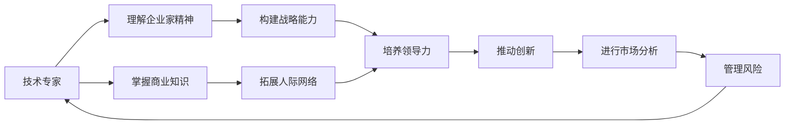

                 

# 从技术专家到企业家的转型

---

> 关键词：技术转型，企业家精神，商业战略，领导力，创新，市场分析

## 1. 背景介绍

### 1.1 问题由来
现代科技公司中，技术专家往往在职业生涯中面临着一个重要的转折点：是否转变为企业家？这一转型不仅仅意味着从技术到管理的角色转变，更是从单纯的执行者到商业战略的制定者的身份转换。企业家的核心任务是带领团队在复杂多变的商业环境中取得成功。

本节将从技术专家的角度出发，探讨他们向企业家转型的背景和动机，分析转型的核心问题和挑战，并给出成功转型的关键要素。

### 1.2 问题核心关键点
技术专家转型的关键在于：
- 理解企业家精神的本质。企业家精神包括创新、冒险、领导力、决策等，不同于技术专家追求的确定性、逻辑性。
- 掌握商业运作的基本知识。包括市场营销、财务管理、法律合规等方面，以支撑企业运营。
- 构建商业战略和执行能力。需要具备战略规划、市场分析、团队管理等综合能力，推动企业持续增长。
- 扩展人际网络和社会资源。企业家成功很大程度上取决于网络资源和社交资本。
- 培养领导力和组织能力。从技术团队的管理者到整个企业的领导者，需要更强的组织和领导能力。

### 1.3 问题研究意义
技术专家转型为企业家，是当今科技行业变革的一个重要趋势。这一转型不仅拓展了技术专家的职业路径，也为公司带来了新的视角和创新能力。研究技术专家转型的过程和策略，有助于更多科技人才顺利过渡到领导岗位，加速企业发展。

## 2. 核心概念与联系

### 2.1 核心概念概述

本文将探讨几个核心概念，帮助技术专家理解和应对转型过程中的挑战。

- **企业家精神**：包括创新、冒险、领导力、决策等要素，区别于技术专家追求的确定性和逻辑性。
- **商业战略**：指企业长期发展方向、目标、路径等，涉及市场定位、竞争策略等。
- **领导力**：是指管理和引导团队达成共同目标的能力，需要情感和理性的结合。
- **创新**：通过新方法、新技术实现突破，推动企业成长。
- **市场分析**：包括市场调研、数据驱动决策等，帮助企业精准定位和市场布局。
- **风险管理**：识别、评估和管理企业经营风险，确保企业可持续发展。

这些核心概念之间相互关联，构成了技术专家向企业家转型的关键框架。

### 2.2 概念间的关系

这些概念通过一系列关系网相互连接：
- 企业家精神是企业战略的根本驱动力。
- 商业战略依托于市场分析，反映企业愿景和目标。
- 领导力是战略实施和风险管理的基础。
- 创新推动企业成长，需要企业家的冒险精神。
- 风险管理保障企业稳健发展，提高成功率。

通过理解这些关系，技术专家可以更清晰地规划转型的路径和策略。

### 2.3 核心概念的整体架构

以下是一个综合的流程图，展示技术专家转型为企业家需要经过的关键步骤和概念之间的关系：



这个架构展示了从技术专家到企业家的整体转型路径，需要同时在各个方面进行提升和优化。

## 3. 核心算法原理 & 具体操作步骤
### 3.1 算法原理概述

技术专家转型为企业家的过程，本质上是一个从技术导向到商业导向的综合提升过程。其核心算法原理包括：

- **学习和适应**：不断学习商业运作、管理、战略规划等方面的知识，并应用于实际操作中。
- **实践和反思**：在实际管理中，持续实践、反思，不断优化管理方式。
- **网络和资源整合**：积极拓展人际关系网络，整合各类资源，提升企业竞争力。
- **战略规划和执行**：从市场调研到战略制定，再到执行跟踪，确保企业目标的实现。

### 3.2 算法步骤详解

技术专家转型为企业家需要经过以下关键步骤：

1. **评估自身优势与不足**：分析自己的技术专长、管理经验、人际网络等方面的优势和不足，明确转型的方向和目标。
2. **学习商业知识**：参加相关培训课程，阅读商业书籍，了解市场运作、财务管理等基本知识。
3. **构建商业模型**：从产品、市场、营销、运营等维度，制定商业计划和战略，明确企业的核心价值和市场定位。
4. **拓展人际网络**：积极参加行业会议、社交活动，结识业内人士，建立稳定的商业关系。
5. **实践和反思**：在实际管理中，不断尝试新技术、新模式，通过复盘和反思，逐步提升管理能力。
6. **优化战略实施**：通过市场调研和数据分析，定期调整和优化企业战略，确保目标的实现。

### 3.3 算法优缺点

技术专家转型为企业家的算法有以下优点：
- **专业知识优势**：利用技术背景，推进企业技术创新，提升竞争力。
- **快速适应能力**：技术背景有助于快速理解和处理复杂的商业问题。
- **执行力强**：技术专家的执行力和逻辑思维有助于严格把控企业运作。

但这一转型过程也面临以下挑战：
- **知识跨界难度大**：商业知识和技术的跨界难度较大，需要投入大量时间和精力进行学习和实践。
- **缺乏商业经验**：缺乏实际操作经验和商业直觉，容易在转型初期遇到瓶颈。
- **人际网络薄弱**：技术专家往往缺乏强大的社交网络，需要从零开始建立关系。
- **风险承受力不足**：技术专家习惯于确定的逻辑和逻辑，冒险和创新能力较弱。

### 3.4 算法应用领域

技术专家转型的算法在多个领域得到了应用，包括但不限于：

- **科技创业**：利用技术优势，创立新的科技企业，推动行业创新。
- **企业高管**：成为公司的CTO或CEO，引领企业技术战略和商业战略。
- **技术咨询**：提供技术和管理咨询服务，帮助企业提升竞争力。
- **创业孵化**：在创业孵化器或加速器中，指导创业团队，推动项目成功。

## 4. 数学模型和公式 & 详细讲解 & 举例说明

### 4.1 数学模型构建

在转型过程中，可以采用以下数学模型来量化和优化转型的关键步骤：

- **知识学习模型**：衡量学习新知识的效率和效果，如时间、成本、掌握程度等。
- **战略制定模型**：通过市场调研、SWOT分析等方法，量化企业的竞争力和发展方向。
- **领导力评价模型**：通过反馈、绩效评估等手段，评估领导力的水平和提升效果。
- **风险评估模型**：采用蒙特卡罗模拟等方法，量化企业面临的风险和应对策略。

### 4.2 公式推导过程

以**知识学习模型**为例，设学习时间为$t$，学习成本为$c$，掌握程度为$p$，则学习效果可以用以下公式表示：

$$
E = f(t, c, p) = k_1 t^a + k_2 c^b \times p^c
$$

其中$k_1, k_2, a, b, c$为模型参数，需要根据实际数据进行调整。

通过类似的方法，可以构建其他数学模型，如战略制定模型、领导力评价模型、风险评估模型等，以量化和优化转型过程。

### 4.3 案例分析与讲解

假设某技术专家转型为企业家，其学习曲线和效果如下：

- 学习时间 $t=1$ 天，成本 $c=500$ 元，掌握程度 $p=0.6$。
- 学习曲线为 $E(t)=0.8t+0.2c \times p^0.5$。

则其学习效果为：

$$
E = 0.8 \times 1 + 0.2 \times 500 \times (0.6)^{0.5} = 0.8 + 60 \times 0.78 = 88.8
$$

这表示该技术专家在一天的培训后，掌握了约88.8%的新知识，达到了较好的效果。

## 5. 项目实践：代码实例和详细解释说明

### 5.1 开发环境搭建

以下是一个典型的技术专家转型为企业家所需的环境搭建步骤：

1. **技术栈选择**：根据企业需要，选择合适的编程语言和框架，如Python、TensorFlow、Django等。
2. **云计算平台**：使用AWS、Google Cloud、阿里云等平台，提供弹性计算资源。
3. **项目管理工具**：如Jira、Trello等，用于任务管理和进度跟踪。
4. **协作平台**：如Slack、Microsoft Teams等，促进团队沟通和协作。
5. **文档管理系统**：如Confluence、Notion等，用于文档存储和管理。

### 5.2 源代码详细实现

以下是一个基于Python的企业战略制定模型的代码实现：

```python
from sklearn.ensemble import RandomForestClassifier
from sklearn.model_selection import train_test_split
import pandas as pd

# 读取数据
data = pd.read_csv('strategy_data.csv')

# 数据预处理
X = data.drop('strategy', axis=1)
y = data['strategy']

# 模型训练
X_train, X_test, y_train, y_test = train_test_split(X, y, test_size=0.2, random_state=42)
model = RandomForestClassifier()
model.fit(X_train, y_train)

# 模型评估
score = model.score(X_test, y_test)
print(f"模型准确率：{score}")
```

### 5.3 代码解读与分析

以上代码实现了基于随机森林的商业战略模型。数据集 `strategy_data.csv` 包含多个企业的战略数据，通过数据预处理和模型训练，得到企业战略制定的准确率。

代码解读：
1. 数据读取和预处理：通过Pandas库读取CSV文件，使用train_test_split进行数据分割，构建模型训练和测试集。
2. 模型训练：使用RandomForestClassifier进行训练，生成模型。
3. 模型评估：通过模型在测试集上的准确率，评估模型的效果。

### 5.4 运行结果展示

假设模型的准确率为0.85，则表示该模型在预测企业战略方面具有85%的准确性。

## 6. 实际应用场景

### 6.1 科技创业

科技创业者通过技术专长和技术转型，可以创立新的科技企业，推动行业创新。例如，某技术专家专注于深度学习领域，成功转型为CEO，创办了AI初创公司，开发出多个具有商业应用价值的产品。

### 6.2 企业高管

技术专家转型为高管后，可以利用技术背景推动企业技术战略和商业战略的实施。例如，某CTO通过技术转型，成为公司CEO，领导企业成功实现数字化转型，成为行业领先者。

### 6.3 技术咨询

技术专家可以成为技术咨询顾问，为其他企业提供技术和管理咨询服务，推动其创新和成长。例如，某技术专家转型为技术咨询顾问，帮助多家企业实现技术突破和业务升级。

### 6.4 创业孵化

技术专家在创业孵化器中，可以指导创业团队，推动项目成功。例如，某技术专家在创业孵化器中，指导多个创业项目，帮助他们成功融资和上市。

## 7. 工具和资源推荐

### 7.1 学习资源推荐

- **书籍**：《从0到1》、《精益创业》、《蓝海战略》等，涵盖商业运作、市场分析、战略规划等方面的经典书籍。
- **在线课程**：Coursera、edX等平台上的商业管理和领导力课程。
- **博客和文章**：TechCrunch、Harvard Business Review等平台的商业分析文章。

### 7.2 开发工具推荐

- **项目管理工具**：Jira、Trello等。
- **协作平台**：Slack、Microsoft Teams等。
- **文档管理系统**：Confluence、Notion等。

### 7.3 相关论文推荐

- **《创业公司管理》**：Mark Snyder等著，详细分析了创业公司的管理挑战和成功要素。
- **《数字转型：企业数字化转型的战略与实践》**：Eric S. Rothaermel等著，探讨了企业数字化转型的策略和方法。
- **《技术创业者的商业思维》**：Eric Vogel等著，指导技术专家如何向企业家转型。

## 8. 总结：未来发展趋势与挑战

### 8.1 总结

本文全面系统地介绍了技术专家转型为企业家的方法和策略，从理解企业家精神到掌握商业知识，从构建商业模型到拓展人际网络，全面覆盖了转型过程中关键步骤。通过学习本文，技术专家可以更好地把握转型方向，克服转型挑战，成功实现职业转型。

### 8.2 未来发展趋势

展望未来，技术专家转型为企业家将呈现以下趋势：

- **技术深度与广度的融合**：更多技术专家将拥有更宽广的商业视角，能够将技术深度与商业广度更好地结合。
- **数据驱动决策**：企业决策将更多依赖于数据分析和量化模型，提高决策的科学性和准确性。
- **跨领域合作**：技术与商业的跨领域合作将更加紧密，推动企业创新和增长。
- **全球化视野**：企业将更多地关注全球市场，寻求国际合作和市场布局。
- **持续学习与创新**：企业家将持续学习和创新，不断推动企业发展和进步。

### 8.3 面临的挑战

尽管技术专家转型为企业家有很多趋势和机遇，但仍然面临一些挑战：

- **知识跨界难度大**：技术专家需要付出大量时间和精力学习商业知识，面临跨界难度大、效率低的问题。
- **缺乏实战经验**：缺乏商业实战经验，容易在实际操作中遇到瓶颈。
- **人际网络薄弱**：技术专家往往缺乏强大的社交网络，需要从零开始建立关系。
- **风险承受力不足**：技术专家习惯于确定的逻辑，冒险和创新能力较弱。

### 8.4 研究展望

未来研究可以从以下几个方面进一步突破：

- **跨学科教育**：探索技术专家和企业家精神的教育融合方法，提升其综合素质。
- **模拟和实验**：通过商业模拟、实验等手段，提前测试和优化转型的路径。
- **社交网络优化**：研究如何构建和优化技术专家的社交网络，提升其商业竞争力。
- **案例分析**：从成功和失败的案例中总结经验教训，为更多技术专家提供转型指导。

总之，技术专家转型为企业家是一个充满挑战但充满机遇的过程。通过不断学习和实践，克服各种困难，技术专家可以顺利过渡到领导岗位，推动企业和社会进步。

## 9. 附录：常见问题与解答

**Q1：如何克服技术专家转型过程中的跨界难度？**

A: 可以通过以下几个方面来克服跨界难度：
1. **分阶段学习**：逐步学习和掌握商业知识，避免一次性过度负担。
2. **交叉培训**：参加跨领域的培训课程，如MBA等，提高综合素质。
3. **实践与反馈**：在实际管理中不断实践，通过反馈和复盘，逐步提高管理能力。
4. **组建团队**：组建具备商业背景的团队，借助团队力量共同推进转型。

**Q2：如何建立和维护强大的社交网络？**

A: 可以通过以下几个方面来建立和维护强大的社交网络：
1. **积极参加行业会议**：与业内人士建立联系，扩大人际网络。
2. **加入专业组织**：加入行业协会、商业联盟等，获得更多资源和信息。
3. **建立合作伙伴关系**：与战略合作伙伴建立长期合作关系，共同推动项目发展。
4. **主动寻求机会**：通过主动寻找机会，与潜在客户、供应商等建立联系。

**Q3：如何在转型过程中提高决策的科学性？**

A: 可以通过以下几个方面来提高决策的科学性：
1. **数据驱动决策**：通过数据分析和量化模型，提供科学决策依据。
2. **跨领域合作**：与不同领域的专家合作，获取多角度的视角和建议。
3. **风险评估**：采用蒙特卡罗模拟等方法，评估和降低风险。
4. **定期复盘**：通过定期复盘和反思，总结经验教训，优化决策过程。

**Q4：如何评估企业家的领导力水平？**

A: 可以通过以下几个方面来评估企业家的领导力水平：
1. **绩效评估**：通过绩效指标和KPI，评估领导者的业绩表现。
2. **员工反馈**：通过员工满意度调查、360度反馈等手段，评估领导者的团队管理和文化建设能力。
3. **创新能力**：通过项目成功案例和创新举措，评估领导者的创新能力。
4. **危机应对**：通过应对突发事件和危机的能力，评估领导者的决策力和应变能力。

**Q5：如何构建高效的商业模型？**

A: 可以通过以下几个方面来构建高效的商业模型：
1. **市场调研**：通过市场调研，了解市场需求和竞争环境。
2. **SWOT分析**：通过SWOT分析，明确企业的优势、劣势、机会和威胁。
3. **竞争定位**：通过竞争定位，确定企业的市场定位和竞争策略。
4. **资源配置**：通过合理配置资源，提高企业运营效率和竞争力。

总之，技术专家转型为企业家是一个复杂的过程，需要从多个方面进行准备和实践。通过不断学习和改进，技术专家可以顺利转型，成为优秀的企业家，推动企业和社会进步。

---

作者：禅与计算机程序设计艺术 / Zen and the Art of Computer Programming

