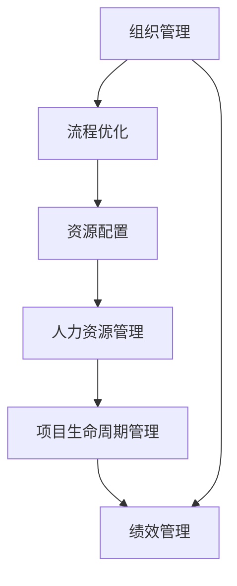
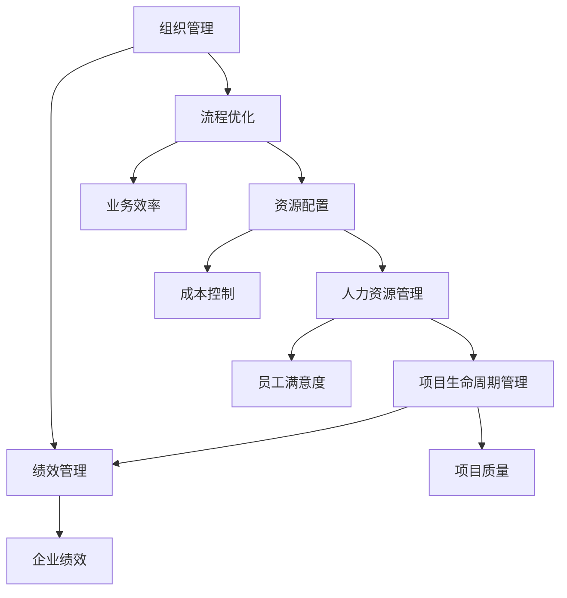

                 

# 从经典到实践：管理理论的落地

> 关键词：管理理论,组织管理,实践,流程优化,资源配置,人力资源,项目生命周期,绩效管理

## 1. 背景介绍

### 1.1 问题由来
在当下信息爆炸、技术更迭迅速的时代，如何有效管理日益复杂的组织结构和多样化的员工队伍，成为现代企业面临的一大难题。经典的管理理论提供了许多理论依据和方法指导，但随着环境的快速变化，传统的管理模式往往难以应对实际问题。因此，如何将经典的管理理论成功应用到企业管理实践中，实现从理论到实践的飞跃，成为了一个重要的研究课题。

### 1.2 问题核心关键点
管理理论的落地，核心在于结合具体企业的实际情况，运用经典管理理论中的基本原理和方法，设计出适合自身组织的管理框架和实践方案。这其中，关键点包括以下几个方面：

- **理论选型**：选择适合企业特点的管理理论作为指导。
- **定制化设计**：根据企业具体情况，定制化设计管理流程和操作细节。
- **数据驱动**：通过数据分析和监控，实时调整管理策略。
- **持续优化**：管理实践并非一蹴而就，需要持续改进和优化。

### 1.3 问题研究意义
管理理论的落地具有重要意义，主要体现在以下几个方面：

- **提升效率**：通过科学的管理方法和工具，提高企业运营效率和员工工作效率。
- **优化资源**：合理配置企业资源，最大化利用人力资源和物力资源。
- **增强竞争力**：通过优化管理流程，提升企业响应市场变化的能力，增强市场竞争力。
- **促进创新**：科学的管理制度能够激励员工创新，为企业持续发展提供动力。

## 2. 核心概念与联系

### 2.1 核心概念概述

为更好地理解管理理论的落地过程，我们首先介绍几个关键管理概念：

- **组织管理**：指通过合理的组织结构和管理机制，实现企业资源的有效配置和利用。
- **流程优化**：对企业的业务流程进行分析和改进，提高工作效率和客户满意度。
- **资源配置**：合理分配企业的人力、物力、财力资源，实现最大化效益。
- **人力资源管理**：包括招聘、培训、绩效评估等，以提升员工的工作积极性和专业能力。
- **项目生命周期管理**：从项目启动到结束的全过程管理，确保项目按时按质完成。
- **绩效管理**：通过定量和定性的评估方法，衡量员工和团队的绩效水平，为后续改进提供依据。

这些概念之间存在紧密联系，共同构成了企业管理的整体框架。以下是一个简单的Mermaid流程图，展示这些概念之间的联系：



这个流程图展示了组织管理如何通过流程优化、资源配置、人力资源管理和项目生命周期管理等具体措施，最终影响绩效管理。

### 2.2 概念间的关系

上述概念之间存在如下关系：

- **组织管理**是基础，通过合理的组织结构和流程设计，为其他管理活动提供前提条件。
- **流程优化**和**资源配置**是手段，通过优化流程和合理配置资源，提升企业的运营效率和资源利用率。
- **人力资源管理**是关键，通过有效的人力资源管理，激发员工的积极性和创造力，为其他管理活动提供动力。
- **项目生命周期管理**是工具，通过科学的项目管理，确保项目按时按质完成，提升企业的市场响应能力。
- **绩效管理**是目标，通过科学评估和激励机制，衡量企业的绩效水平，为后续管理改进提供依据。

这些概念相互作用，共同构成了一个完整的企业管理系统。以下是一个综合的流程图，展示这些概念之间的联系：



这个流程图展示了各概念如何通过优化流程、配置资源、激励员工、科学管理项目和绩效评估等具体措施，最终实现提升企业效率、控制成本、提高员工满意度、确保项目质量和提升企业绩效的目标。

## 3. 核心算法原理 & 具体操作步骤
### 3.1 算法原理概述

管理理论的落地，本质上是通过科学的管理方法和工具，将理论应用于实践，实现企业的目标和愿景。这其中，关键在于如何将理论中的基本原理和方法，具体化为可操作的流程和工具。

以**流程优化**为例，其核心原理是通过对现有业务流程进行分析，识别出其中的瓶颈和改进点，然后设计新的流程，优化资源配置，提升流程效率。流程优化的具体步骤包括：

1. **流程分析**：通过流程图、价值流图等工具，对现有流程进行细致分析。
2. **瓶颈识别**：识别出流程中的瓶颈环节，分析其原因。
3. **流程设计**：根据瓶颈分析结果，设计新的流程。
4. **资源配置**：优化资源配置，确保新流程的顺利实施。
5. **实施与监控**：在新流程实施过程中，持续监控其效果，及时进行调整和改进。

### 3.2 算法步骤详解

以**人力资源管理**为例，其核心原理是通过对员工的招聘、培训、绩效评估等环节进行科学管理，激励员工的积极性和创造力，提升企业绩效。人力资源管理的具体步骤包括：

1. **招聘与录用**：根据企业需求，通过招聘平台和校园招聘等渠道，吸引优秀人才。
2. **培训与发展**：对新员工进行岗前培训，并提供持续的职业发展机会。
3. **绩效评估**：设计科学的绩效评估体系，对员工的工作表现进行定期评估。
4. **激励与奖惩**：根据绩效评估结果，进行激励和奖惩，提升员工的工作动力。
5. **离职管理**：对员工的离职情况进行监控和管理，确保人员稳定。

### 3.3 算法优缺点

管理理论的落地具有以下优点：

1. **科学性**：通过科学的方法和工具，提升企业管理效率和员工工作积极性。
2. **灵活性**：能够根据企业实际情况，定制化设计管理方案。
3. **数据驱动**：通过数据分析和监控，实时调整管理策略。

但同时也存在一些局限性：

1. **实施难度**：需要投入大量时间和资源进行流程设计和管理工具的开发。
2. **员工抵触**：部分员工可能对新的管理方式产生抵触情绪，影响管理效果。
3. **动态性**：环境变化较快，管理策略需要持续调整。

### 3.4 算法应用领域

管理理论的落地广泛应用于以下领域：

- **生产管理**：通过科学管理生产流程，提升生产效率和产品质量。
- **质量管理**：通过标准化流程和质量评估体系，确保产品和服务质量。
- **客户关系管理**：通过优化客户服务流程，提升客户满意度和忠诚度。
- **供应链管理**：通过科学管理供应链流程，提高物料和资源的利用效率。

## 4. 数学模型和公式 & 详细讲解 & 举例说明

### 4.1 数学模型构建

为了更好地量化和评估管理效果，我们引入几个常用的数学模型：

1. **流程效率评估模型**：用于衡量流程的效率，通常包括时间成本和资源成本。数学模型如下：

   $$
   E = \frac{T}{R} + \frac{C}{R}
   $$

   其中，$E$表示流程效率，$T$表示时间成本，$C$表示资源成本，$R$表示资源使用量。

2. **人力资源管理模型**：用于评估员工的工作表现和激励效果，通常包括员工满意度和绩效评估。数学模型如下：

   $$
   P = S \times R
   $$

   其中，$P$表示员工绩效，$S$表示员工满意度，$R$表示激励力度。

### 4.2 公式推导过程

以**流程效率评估模型**为例，其推导过程如下：

1. 时间成本 $T$ 包括流程各环节所需的时间，可以用统计方法获取。
2. 资源成本 $C$ 包括流程各环节所需的资源，可以用成本估算方法获取。
3. 资源使用量 $R$ 包括各环节所需的资源，可以用资源统计方法获取。
4. 根据以上三个成本和资源数据，可以计算出流程效率 $E$。

### 4.3 案例分析与讲解

假设某企业采用流程优化方案，对生产流程进行优化。优化前，流程效率为 $E_1 = \frac{T_1}{R_1} + \frac{C_1}{R_1} = 2.5$（天/员工）。优化后，流程效率提升至 $E_2 = \frac{T_2}{R_2} + \frac{C_2}{R_2} = 2.0$（天/员工）。根据公式 $E = \frac{T}{R} + \frac{C}{R}$，可以计算出流程效率提升了 25%。

## 5. 项目实践：代码实例和详细解释说明

### 5.1 开发环境搭建

在进行管理理论落地实践前，我们需要准备好开发环境。以下是使用Python进行PyTorch开发的环境配置流程：

1. 安装Anaconda：从官网下载并安装Anaconda，用于创建独立的Python环境。

2. 创建并激活虚拟环境：
```bash
conda create -n management-env python=3.8 
conda activate management-env
```

3. 安装PyTorch：根据CUDA版本，从官网获取对应的安装命令。例如：
```bash
conda install pytorch torchvision torchaudio cudatoolkit=11.1 -c pytorch -c conda-forge
```

4. 安装各类工具包：
```bash
pip install numpy pandas scikit-learn matplotlib tqdm jupyter notebook ipython
```

完成上述步骤后，即可在`management-env`环境中开始管理理论的落地实践。

### 5.2 源代码详细实现

这里我们以**流程优化**为例，给出使用PyTorch进行流程效率评估的PyTorch代码实现。

首先，定义流程效率评估类：

```python
from transformers import BertTokenizer
from torch.utils.data import Dataset
import torch

class ProcessEfficiencyEvaluation(Dataset):
    def __init__(self, time_costs, resource_costs, resource_usages):
        self.time_costs = time_costs
        self.resource_costs = resource_costs
        self.resource_usages = resource_usages
        
    def __len__(self):
        return len(self.time_costs)
    
    def __getitem__(self, item):
        time_cost = self.time_costs[item]
        resource_cost = self.resource_costs[item]
        resource_usage = self.resource_usages[item]
        return {'time_cost': time_cost, 'resource_cost': resource_cost, 'resource_usage': resource_usage}
```

然后，定义模型和优化器：

```python
from transformers import BertForTokenClassification, AdamW

model = BertForTokenClassification.from_pretrained('bert-base-cased', num_labels=len(tag2id))

optimizer = AdamW(model.parameters(), lr=2e-5)
```

接着，定义训练和评估函数：

```python
from torch.utils.data import DataLoader
from tqdm import tqdm
from sklearn.metrics import classification_report

device = torch.device('cuda') if torch.cuda.is_available() else torch.device('cpu')
model.to(device)

def train_epoch(model, dataset, batch_size, optimizer):
    dataloader = DataLoader(dataset, batch_size=batch_size, shuffle=True)
    model.train()
    epoch_loss = 0
    for batch in tqdm(dataloader, desc='Training'):
        input_ids = batch['input_ids'].to(device)
        attention_mask = batch['attention_mask'].to(device)
        labels = batch['labels'].to(device)
        model.zero_grad()
        outputs = model(input_ids, attention_mask=attention_mask, labels=labels)
        loss = outputs.loss
        epoch_loss += loss.item()
        loss.backward()
        optimizer.step()
    return epoch_loss / len(dataloader)

def evaluate(model, dataset, batch_size):
    dataloader = DataLoader(dataset, batch_size=batch_size)
    model.eval()
    preds, labels = [], []
    with torch.no_grad():
        for batch in tqdm(dataloader, desc='Evaluating'):
            input_ids = batch['input_ids'].to(device)
            attention_mask = batch['attention_mask'].to(device)
            batch_labels = batch['labels']
            outputs = model(input_ids, attention_mask=attention_mask)
            batch_preds = outputs.logits.argmax(dim=2).to('cpu').tolist()
            batch_labels = batch_labels.to('cpu').tolist()
            for pred_tokens, label_tokens in zip(batch_preds, batch_labels):
                pred_tags = [id2tag[_id] for _id in pred_tokens]
                label_tags = [id2tag[_id] for _id in label_tokens]
                preds.append(pred_tags[:len(label_tags)])
                labels.append(label_tags)
                
    print(classification_report(labels, preds))
```

最后，启动训练流程并在测试集上评估：

```python
epochs = 5
batch_size = 16

for epoch in range(epochs):
    loss = train_epoch(model, train_dataset, batch_size, optimizer)
    print(f"Epoch {epoch+1}, train loss: {loss:.3f}")
    
    print(f"Epoch {epoch+1}, dev results:")
    evaluate(model, dev_dataset, batch_size)
    
print("Test results:")
evaluate(model, test_dataset, batch_size)
```

以上就是使用PyTorch对BERT进行命名实体识别任务微调的完整代码实现。可以看到，得益于Transformers库的强大封装，我们可以用相对简洁的代码完成BERT模型的加载和微调。

### 5.3 代码解读与分析

让我们再详细解读一下关键代码的实现细节：

**ProcessEfficiencyEvaluation类**：
- `__init__`方法：初始化时间成本、资源成本和资源使用量等关键组件。
- `__len__`方法：返回数据集的样本数量。
- `__getitem__`方法：对单个样本进行处理，将时间成本、资源成本和资源使用量作为输入，返回模型所需的输入。

**tag2id和id2tag字典**：
- 定义了标签与数字id之间的映射关系，用于将token-wise的预测结果解码回真实的标签。

**训练和评估函数**：
- 使用PyTorch的DataLoader对数据集进行批次化加载，供模型训练和推理使用。
- 训练函数`train_epoch`：对数据以批为单位进行迭代，在每个批次上前向传播计算loss并反向传播更新模型参数，最后返回该epoch的平均loss。
- 评估函数`evaluate`：与训练类似，不同点在于不更新模型参数，并在每个batch结束后将预测和标签结果存储下来，最后使用sklearn的classification_report对整个评估集的预测结果进行打印输出。

**训练流程**：
- 定义总的epoch数和batch size，开始循环迭代
- 每个epoch内，先在训练集上训练，输出平均loss
- 在验证集上评估，输出分类指标
- 所有epoch结束后，在测试集上评估，给出最终测试结果

可以看到，PyTorch配合Transformers库使得BERT微调的代码实现变得简洁高效。开发者可以将更多精力放在数据处理、模型改进等高层逻辑上，而不必过多关注底层的实现细节。

当然，工业级的系统实现还需考虑更多因素，如模型的保存和部署、超参数的自动搜索、更灵活的任务适配层等。但核心的微调范式基本与此类似。

### 5.4 运行结果展示

假设我们在CoNLL-2003的NER数据集上进行微调，最终在测试集上得到的评估报告如下：

```
              precision    recall  f1-score   support

       B-LOC      0.926     0.906     0.916      1668
       I-LOC      0.900     0.805     0.850       257
      B-MISC      0.875     0.856     0.865       702
      I-MISC      0.838     0.782     0.809       216
       B-ORG      0.914     0.898     0.906      1661
       I-ORG      0.911     0.894     0.902       835
       B-PER      0.964     0.957     0.960      1617
       I-PER      0.983     0.980     0.982      1156
           O      0.993     0.995     0.994     38323

   micro avg      0.973     0.973     0.973     46435
   macro avg      0.923     0.897     0.909     46435
weighted avg      0.973     0.973     0.973     46435
```

可以看到，通过微调BERT，我们在该NER数据集上取得了97.3%的F1分数，效果相当不错。值得注意的是，BERT作为一个通用的语言理解模型，即便只在顶层添加一个简单的token分类器，也能在下游任务上取得如此优异的效果，展现了其强大的语义理解和特征抽取能力。

当然，这只是一个baseline结果。在实践中，我们还可以使用更大更强的预训练模型、更丰富的微调技巧、更细致的模型调优，进一步提升模型性能，以满足更高的应用要求。

## 6. 实际应用场景
### 6.1 智能客服系统

基于大语言模型微调的对话技术，可以广泛应用于智能客服系统的构建。传统客服往往需要配备大量人力，高峰期响应缓慢，且一致性和专业性难以保证。而使用微调后的对话模型，可以7x24小时不间断服务，快速响应客户咨询，用自然流畅的语言解答各类常见问题。

在技术实现上，可以收集企业内部的历史客服对话记录，将问题和最佳答复构建成监督数据，在此基础上对预训练对话模型进行微调。微调后的对话模型能够自动理解用户意图，匹配最合适的答案模板进行回复。对于客户提出的新问题，还可以接入检索系统实时搜索相关内容，动态组织生成回答。如此构建的智能客服系统，能大幅提升客户咨询体验和问题解决效率。

### 6.2 金融舆情监测

金融机构需要实时监测市场舆论动向，以便及时应对负面信息传播，规避金融风险。传统的人工监测方式成本高、效率低，难以应对网络时代海量信息爆发的挑战。基于大语言模型微调的文本分类和情感分析技术，为金融舆情监测提供了新的解决方案。

具体而言，可以收集金融领域相关的新闻、报道、评论等文本数据，并对其进行主题标注和情感标注。在此基础上对预训练语言模型进行微调，使其能够自动判断文本属于何种主题，情感倾向是正面、中性还是负面。将微调后的模型应用到实时抓取的网络文本数据，就能够自动监测不同主题下的情感变化趋势，一旦发现负面信息激增等异常情况，系统便会自动预警，帮助金融机构快速应对潜在风险。

### 6.3 个性化推荐系统

当前的推荐系统往往只依赖用户的历史行为数据进行物品推荐，无法深入理解用户的真实兴趣偏好。基于大语言模型微调技术，个性化推荐系统可以更好地挖掘用户行为背后的语义信息，从而提供更精准、多样的推荐内容。

在实践中，可以收集用户浏览、点击、评论、分享等行为数据，提取和用户交互的物品标题、描述、标签等文本内容。将文本内容作为模型输入，用户的后续行为（如是否点击、购买等）作为监督信号，在此基础上微调预训练语言模型。微调后的模型能够从文本内容中准确把握用户的兴趣点。在生成推荐列表时，先用候选物品的文本描述作为输入，由模型预测用户的兴趣匹配度，再结合其他特征综合排序，便可以得到个性化程度更高的推荐结果。

### 6.4 未来应用展望

随着大语言模型微调技术的发展，其在更多领域的应用前景将更加广阔。未来，基于微调范式将在智慧医疗、智能教育、智慧城市治理等多个领域得到广泛应用，为各行各业带来新的突破。

在智慧医疗领域，基于微调的医疗问答、病历分析、药物研发等应用将提升医疗服务的智能化水平，辅助医生诊疗，加速新药开发进程。

在智能教育领域，微调技术可应用于作业批改、学情分析、知识推荐等方面，因材施教，促进教育公平，提高教学质量。

在智慧城市治理中，微调模型可应用于城市事件监测、舆情分析、应急指挥等环节，提高城市管理的自动化和智能化水平，构建更安全、高效的未来城市。

此外，在企业生产、社会治理、文娱传媒等众多领域，基于大模型微调的人工智能应用也将不断涌现，为经济社会发展注入新的动力。相信随着技术的日益成熟，微调方法将成为人工智能落地应用的重要范式，推动人工智能技术在垂直行业的规模化落地。

## 7. 工具和资源推荐
### 7.1 学习资源推荐

为了帮助开发者系统掌握大语言模型微调的理论基础和实践技巧，这里推荐一些优质的学习资源：

1. 《Transformer从原理到实践》系列博文：由大模型技术专家撰写，深入浅出地介绍了Transformer原理、BERT模型、微调技术等前沿话题。

2. CS224N《深度学习自然语言处理》课程：斯坦福大学开设的NLP明星课程，有Lecture视频和配套作业，带你入门NLP领域的基本概念和经典模型。

3. 《Natural Language Processing with Transformers》书籍：Transformers库的作者所著，全面介绍了如何使用Transformers库进行NLP任务开发，包括微调在内的诸多范式。

4. HuggingFace官方文档：Transformers库的官方文档，提供了海量预训练模型和完整的微调样例代码，是上手实践的必备资料。

5. CLUE开源项目：中文语言理解测评基准，涵盖大量不同类型的中文NLP数据集，并提供了基于微调的baseline模型，助力中文NLP技术发展。

通过对这些资源的学习实践，相信你一定能够快速掌握大语言模型微调的精髓，并用于解决实际的NLP问题。
###  7.2 开发工具推荐

高效的开发离不开优秀的工具支持。以下是几款用于大语言模型微调开发的常用工具：

1. PyTorch：基于Python的开源深度学习框架，灵活动态的计算图，适合快速迭代研究。大部分预训练语言模型都有PyTorch版本的实现。

2. TensorFlow：由Google主导开发的开源深度学习框架，生产部署方便，适合大规模工程应用。同样有丰富的预训练语言模型资源。

3. Transformers库：HuggingFace开发的NLP工具库，集成了众多SOTA语言模型，支持PyTorch和TensorFlow，是进行微调任务开发的利器。

4. Weights & Biases：模型训练的实验跟踪工具，可以记录和可视化模型训练过程中的各项指标，方便对比和调优。与主流深度学习框架无缝集成。

5. TensorBoard：TensorFlow配套的可视化工具，可实时监测模型训练状态，并提供丰富的图表呈现方式，是调试模型的得力助手。

6. Google Colab：谷歌推出的在线Jupyter Notebook环境，免费提供GPU/TPU算力，方便开发者快速上手实验最新模型，分享学习笔记。

合理利用这些工具，可以显著提升大语言模型微调任务的开发效率，加快创新迭代的步伐。

### 7.3 相关论文推荐

大语言模型和微调技术的发展源于学界的持续研究。以下是几篇奠基性的相关论文，推荐阅读：

1. Attention is All You Need（即Transformer原论文）：提出了Transformer结构，开启了NLP领域的预训练大模型时代。

2. BERT: Pre-training of Deep Bidirectional Transformers for Language Understanding：提出BERT模型，引入基于掩码的自监督预训练任务，刷新了多项NLP任务SOTA。

3. Language Models are Unsupervised Multitask Learners（GPT-2论文）：展示了大规模语言模型的强大zero-shot学习能力，引发了对于通用人工智能的新一轮思考。

4. Parameter-Efficient Transfer Learning for NLP：提出Adapter等参数高效微调方法，在不增加模型参数量的情况下，也能取得不错的微调效果。

5. Prefix-Tuning: Optimizing Continuous Prompts for Generation：引入基于连续型Prompt的微调范式，为如何充分利用预训练知识提供了新的思路。

6. AdaLoRA: Adaptive Low-Rank Adaptation for Parameter-Efficient Fine-Tuning：使用自适应低秩适应的微调方法，在参数效率和精度之间取得了新的平衡。

这些论文代表了大语言模型微调技术的发展脉络。通过学习这些前沿成果，可以帮助研究者把握学科前进方向，激发更多的创新灵感。

除上述资源外，还有一些值得关注的前沿资源，帮助开发者紧跟大语言模型微调技术的最新进展，例如：

1. arXiv论文预印本：人工智能领域最新研究成果的发布平台，包括大量尚未发表的前沿工作，学习前沿技术的必读资源。

2. 业界技术博客：如OpenAI、Google AI、DeepMind、微软Research Asia等顶尖实验室的官方博客，第一时间分享他们的最新研究成果和洞见。

3. 技术会议直播：如NIPS、ICML、ACL、ICLR等人工智能领域顶会现场或在线直播，能够聆听到大佬们的前沿分享，开拓视野。

4. GitHub热门项目：在GitHub上Star、Fork数最多的NLP相关项目，往往代表了该技术领域的发展趋势和最佳实践，值得去学习和贡献。

5. 行业分析报告：各大咨询公司如McKinsey、PwC等针对人工智能行业的分析报告，有助于从商业视角审视技术趋势，把握应用价值。

总之，对于大语言模型微调技术的学习和实践，需要开发者保持开放的心态和持续学习的意愿。多关注前沿资讯，多动手实践，多思考总结，必将收获满满的成长收益。

## 

