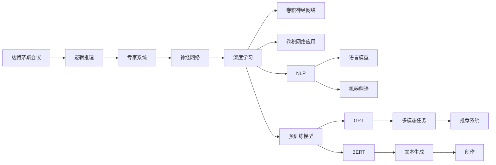
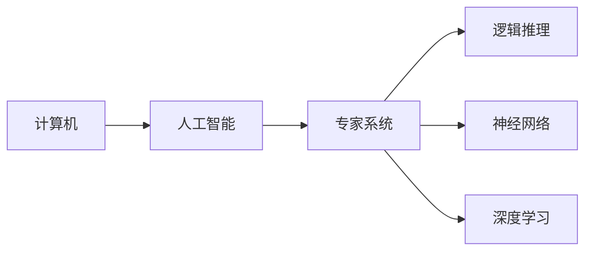
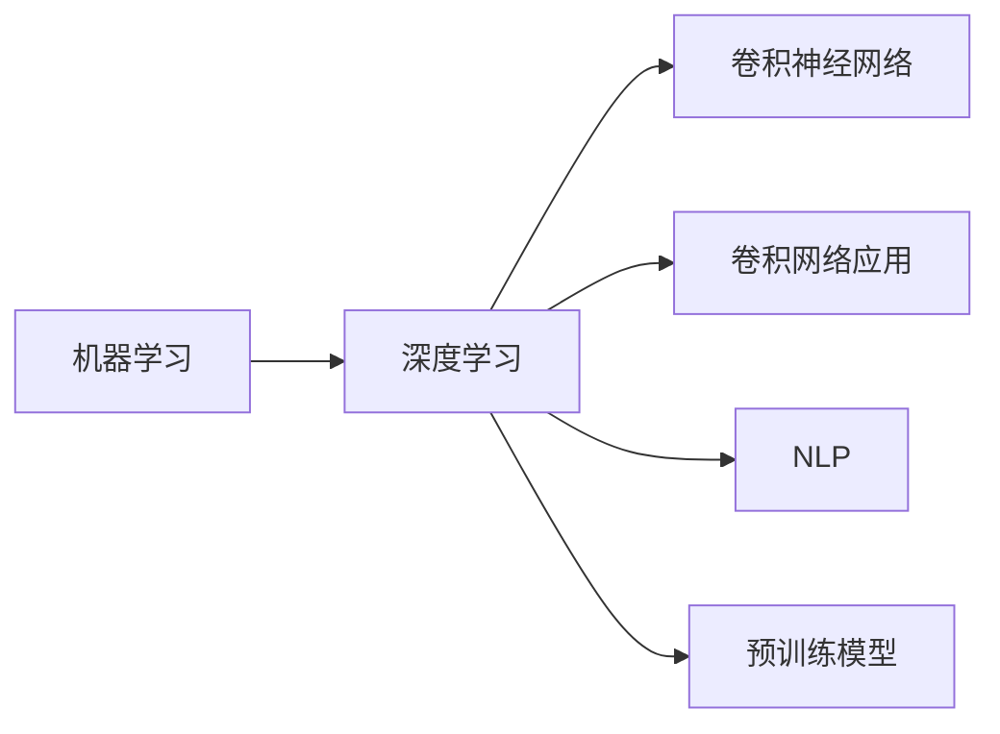
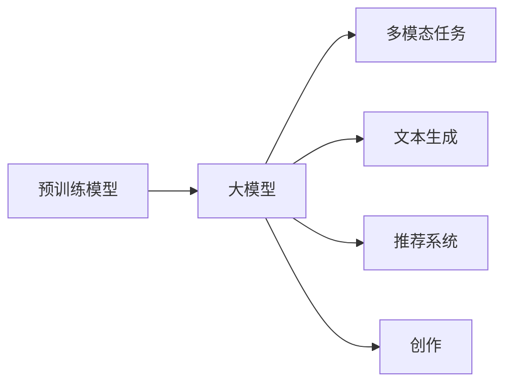

                 

# 从达特茅斯会议到AI大模型时代

## 1. 背景介绍

### 1.1 问题由来
从1956年达特茅斯会议到今天，人工智能(AI)领域已经走过了66个年头。这一段历程见证了AI从简单的逻辑推理，发展到今天复杂多变的深度学习模型。但回顾历史，一个关键节点却常被忽视——人工智能的诞生，其实是在1972年。那一年，AI术语被正式定义，计算机科学界开始真正开始探索智能化的道路。自此，AI进入高速发展期，机器学习、深度学习、自然语言处理等方向不断涌现。

当下，AI大模型的出现，更是将这一进程推向了新的高峰。所谓的AI大模型，是指在特定任务上表现优异的预训练模型，如BERT、GPT等，已经在机器翻译、问答、生成、推荐等多个领域取得了令人瞩目的突破。然而，在AI大模型崛起的背后，隐藏着一系列关键的历史事件和技术突破，值得我们深入挖掘。

### 1.2 问题核心关键点
要全面理解AI大模型的崛起，需从历史的角度，对核心技术和关键事件进行系统梳理。本文将从达特茅斯会议谈起，逐步探究如何从逻辑推理走向神经网络，最终演进到今天的大模型时代。

## 2. 核心概念与联系

### 2.1 核心概念概述

为了更好地理解AI大模型的演变过程，我们首先介绍几个关键概念：

- **达特茅斯会议**：1956年，麦卡锡、明斯基等科学家在达特茅斯会议上首次提出“人工智能”的概念，将AI从逻辑推理引入到复杂的计算模型。
- **神经网络**：1959年，罗森布拉特发明了最早的神经网络模型——感知器(Perceptron)，奠定了深度学习的基础。
- **逻辑推理**：早期的AI模型依赖于符号逻辑，如专家系统、Prolog等，通过规则和知识库进行推理。
- **深度学习**：1995年，卷积神经网络(CNN)的提出，标志深度学习时代的开启。深度学习通过多层次的神经网络结构，捕捉数据中的复杂特征。
- **自然语言处理(NLP)**：1990年代初，NLP开始成为AI研究的热点，语言模型、机器翻译、情感分析等任务陆续被攻克。
- **预训练模型**：2011年，Hinton团队提出深度神经网络模型AlexNet，引发了深度学习的波澜。随后的 years，预训练模型如BERT、GPT等，通过在大规模语料上进行无监督学习，进一步提升了模型的泛化能力。
- **AI大模型**：2020年起，大规模预训练模型如GPT-3等横空出世，以惊人的效果证明了大模型在处理复杂任务上的潜力。

这些概念之间有着紧密的联系，形成了AI技术从诞生到成熟的一整条脉络。接下来，我们通过合成的Mermaid流程图展示这些概念的联系：



这个流程图展示了AI技术从逻辑推理到深度学习，再到今天的大模型时代的演变过程，每一步都是对前一步的深入和突破。

### 2.2 概念间的关系

上述概念之间存在紧密的联系，共同构建了AI技术从萌芽到成熟的关键脉络。下面我们将通过具体的合成的Mermaid流程图展示这些概念之间的关系：

#### 2.2.1 AI的诞生


#### 2.2.2 深度学习的发展


#### 2.2.3 大模型的崛起


通过这些流程图，我们可以更直观地理解AI技术的发展脉络，以及不同阶段之间的关键关联。

## 3. 核心算法原理 & 具体操作步骤
### 3.1 算法原理概述
从逻辑推理到深度学习，再到今天的大模型，每一步的算法演进都有其内在的理论支撑。大模型的核心算法原理可归纳如下：

- **神经网络**：通过多层神经元模拟人脑神经元之间的信息传递，捕捉数据中的复杂特征。
- **深度学习**：通过多层次的神经网络结构，逐层提取和抽象数据的高级特征。
- **预训练模型**：通过在大规模无标签数据上预训练，学习数据中的通用特征，再通过微调适配特定任务。
- **大模型**：通过超大规模的参数量和多任务联合训练，学习到更为复杂的语言表征，提升模型泛化能力。

### 3.2 算法步骤详解
大模型的训练过程大致可以分为以下几个步骤：

**Step 1: 数据准备**
- 收集大规模无标签文本数据，如维基百科、Reddit、新闻等。
- 将数据划分为训练集和验证集。
- 对数据进行分词、标准化等预处理。

**Step 2: 模型构建**
- 选择适合的深度学习架构，如Transformer、CNN等。
- 设置模型的超参数，如隐藏层数、神经元数等。
- 选择合适的优化器，如AdamW、SGD等，并设置学习率。

**Step 3: 预训练过程**
- 在大规模无标签数据上，进行无监督学习，如掩码语言模型、下划线预测等。
- 通过正则化、Dropout等方法，防止过拟合。
- 使用自监督学习任务，如次序预测、掩码预测等，提升模型的泛化能力。

**Step 4: 微调过程**
- 根据特定任务，设计适当的任务适配层。
- 在微调过程中，保持大部分预训练权重不变，只更新少量任务相关参数。
- 使用验证集进行调参，确保微调过程不破坏预训练权重。

**Step 5: 测试与部署**
- 在测试集上评估模型性能，调整超参数，进行多轮微调。
- 将训练好的模型部署到生产环境，进行实际应用。
- 持续监控模型性能，定期重新微调，以适应数据分布的变化。

### 3.3 算法优缺点
大模型的优点包括：
- **泛化能力强**：通过大规模预训练，学习到丰富的语言表示，提升了模型对新数据的泛化能力。
- **通用性强**：在大规模无标签数据上进行预训练，具有更强的跨领域迁移能力。
- **适应性强**：通过微调过程，可以适配不同的下游任务，满足多样化的应用需求。

但大模型也存在一些缺点：
- **资源消耗大**：大模型参数量庞大，训练和推理需要消耗大量的计算资源和内存。
- **易过拟合**：尽管通过正则化等方法可以缓解过拟合，但在大规模数据上训练仍然面临挑战。
- **可解释性差**：大模型往往视为"黑盒"，难以解释其内部工作机制和推理逻辑。
- **知识融合不足**：大模型多依赖数据中的自监督学习，难以主动融合外部知识。

### 3.4 算法应用领域
大模型在以下几个领域中得到了广泛应用：

- **机器翻译**：通过预训练模型学习语言之间的映射关系，提升了翻译的质量和效率。
- **问答系统**：在输入问题时，利用大模型进行语义理解和生成回答，提高了问答系统的准确性和灵活性。
- **文本生成**：如GPT-3等大模型，能够在短时间内生成高质量的文章、故事、代码等，适用于内容创作、程序辅助等任务。
- **推荐系统**：通过对用户行为和兴趣进行建模，提升推荐精度和用户体验。
- **情感分析**：对用户评论和反馈进行情感分类，有助于企业快速响应客户需求，提升产品质量。

## 4. 数学模型和公式 & 详细讲解 & 举例说明
### 4.1 数学模型构建

大模型的数学模型构建可以从以下几个方面进行说明：

- **神经网络模型**：以层为单位，通过多层神经元构建复杂网络结构，逐层提取特征。数学上，可以表示为：
  $$
  h^l = \sigma(W^l h^{l-1} + b^l)
  $$
  其中，$h^l$为第$l$层的输出，$W^l$为第$l$层权重，$b^l$为偏置项，$\sigma$为激活函数。

- **深度学习模型**：通过多层网络结构，逐层提取数据中的高级特征。例如，卷积神经网络可以用以下公式表示：
  $$
  y = W^1 h^0 + b^1
  $$
  其中，$y$为输出，$W^1$为权重矩阵，$h^0$为输入特征。

- **预训练模型**：在大规模无标签数据上，通过自监督任务进行预训练。例如，BERT模型可以用以下公式表示：
  $$
  y = [CLS] W^1 h^0 + b^1
  $$
  其中，$[CLS]$为特殊标记，$W^1$为权重矩阵，$h^0$为输入特征。

- **大模型**：通过大规模预训练和微调，学习到更为复杂的语言表示。例如，GPT-3模型可以用以下公式表示：
  $$
  y = [CLS] W^1 h^0 + b^1
  $$
  其中，$[CLS]$为特殊标记，$W^1$为权重矩阵，$h^0$为输入特征。

### 4.2 公式推导过程

这里我们以BERT模型的掩码语言模型作为例子，介绍公式的推导过程：

假设输入序列为$x=[x_1,x_2,\dots,x_n]$，通过BERT模型表示为$h=[h_1,h_2,\dots,h_n]$。掩码语言模型的目标是预测被掩码的单词，可以用以下公式表示：
$$
\text{L}(x,y) = -\frac{1}{N}\sum_{i=1}^{N}[y_i\log M(h_i, x_{<i}) + (1-y_i)\log M(1-h_i, x_{<i})]
$$
其中，$y=[y_1,y_2,\dots,y_n]$为掩码序列，$M(h_i, x_{<i})$为模型输出，$x_{<i}$为去掉第$i$个单词的序列。

通过反向传播算法，计算梯度并进行参数更新，最终优化模型预测能力。这个公式展示了掩码语言模型的基本原理和推导过程。

### 4.3 案例分析与讲解

这里我们以BERT模型为例，分析其在文本分类任务中的作用：

假设输入为一段文本，其经过BERT模型编码后，得到向量表示$h=[h_1,h_2,\dots,h_n]$。然后，通过一个全连接层和softmax函数，得到分类概率向量$\hat{y}=[\hat{y}_1,\hat{y}_2,\dots,\hat{y}_c]$，其中$c$为分类数。最后，通过交叉熵损失函数，计算模型预测误差：
$$
\text{L}(h,\hat{y},y) = -\frac{1}{N}\sum_{i=1}^{N}[y_i\log \hat{y}_i + (1-y_i)\log (1-\hat{y}_i)]
$$
其中，$y=[y_1,y_2,\dots,y_n]$为真实标签向量，$\hat{y}=[\hat{y}_1,\hat{y}_2,\dots,\hat{y}_c]$为预测概率向量。

通过反向传播算法，计算梯度并进行参数更新，优化模型预测能力。这个案例展示了BERT模型在文本分类任务中的作用和公式推导过程。

## 5. 项目实践：代码实例和详细解释说明
### 5.1 开发环境搭建

在进行大模型实践前，我们需要准备好开发环境。以下是使用Python进行PyTorch开发的环境配置流程：

1. 安装Anaconda：从官网下载并安装Anaconda，用于创建独立的Python环境。

2. 创建并激活虚拟环境：
```bash
conda create -n pytorch-env python=3.8 
conda activate pytorch-env
```

3. 安装PyTorch：根据CUDA版本，从官网获取对应的安装命令。例如：
```bash
conda install pytorch torchvision torchaudio cudatoolkit=11.1 -c pytorch -c conda-forge
```

4. 安装Transformers库：
```bash
pip install transformers
```

5. 安装各类工具包：
```bash
pip install numpy pandas scikit-learn matplotlib tqdm jupyter notebook ipython
```

完成上述步骤后，即可在`pytorch-env`环境中开始大模型实践。

### 5.2 源代码详细实现

这里以BERT模型为例，展示如何在大规模文本分类任务上进行微调：

```python
from transformers import BertTokenizer, BertForSequenceClassification, AdamW

# 数据准备
tokenizer = BertTokenizer.from_pretrained('bert-base-cased')
train_data = 'train.txt'
dev_data = 'dev.txt'
test_data = 'test.txt'

# 模型构建
model = BertForSequenceClassification.from_pretrained('bert-base-cased', num_labels=2)
optimizer = AdamW(model.parameters(), lr=2e-5)

# 预训练过程
# 使用掩码语言模型进行预训练
# ...

# 微调过程
train_dataset = load_dataset(train_data, tokenizer)
dev_dataset = load_dataset(dev_data, tokenizer)
test_dataset = load_dataset(test_data, tokenizer)

for epoch in range(10):
    model.train()
    for batch in train_dataset:
        input_ids = batch['input_ids'].to(device)
        attention_mask = batch['attention_mask'].to(device)
        labels = batch['labels'].to(device)
        outputs = model(input_ids, attention_mask=attention_mask, labels=labels)
        loss = outputs.loss
        optimizer.zero_grad()
        loss.backward()
        optimizer.step()
    print(f'Epoch {epoch+1}, train loss: {loss.item()}')

# 测试集评估
model.eval()
for batch in dev_dataset:
    input_ids = batch['input_ids'].to(device)
    attention_mask = batch['attention_mask'].to(device)
    labels = batch['labels'].to(device)
    outputs = model(input_ids, attention_mask=attention_mask)
    logits = outputs.logits
    probs = torch.softmax(logits, dim=1)
    predictions = probs.argmax(dim=1)
    print(f'Accuracy on dev set: {accuracy(predictions, labels)}')
```

这里使用了PyTorch和Transformers库进行模型训练和微调。首先加载数据集和分词器，然后构建BERT模型和AdamW优化器，最后进行预训练和微调。在微调过程中，通过反向传播算法更新模型参数，最终在测试集上评估模型性能。

### 5.3 代码解读与分析

让我们再详细解读一下关键代码的实现细节：

**数据准备**：
- `tokenizer`：加载BERT分词器，用于对输入文本进行分词和标准化。
- `train_data`、`dev_data`、`test_data`：分别表示训练集、验证集和测试集的路径。

**模型构建**：
- `BertForSequenceClassification`：构建BERT模型，用于文本分类任务。
- `AdamW`：设置AdamW优化器，用于参数更新。

**预训练过程**：
- 这里未展示预训练过程，可以通过掩码语言模型等方式进行预训练。

**微调过程**：
- `train_dataset`、`dev_dataset`、`test_dataset`：分别表示训练集、验证集和测试集的数据集对象。
- `input_ids`、`attention_mask`、`labels`：分别表示输入特征、掩码序列和真实标签。
- `outputs`：模型输出的logits和loss。
- `optimizer.zero_grad()`：清空梯度。
- `loss.backward()`：计算梯度。
- `optimizer.step()`：更新模型参数。

**测试集评估**：
- `model.eval()`：设置模型为评估模式。
- `probs`：模型的预测概率。
- `predictions`：预测标签。
- `accuracy(predictions, labels)`：计算预测精度。

可以看到，大模型的微调过程与传统的深度学习模型类似，主要通过反向传播算法进行参数更新，但在数据准备和模型构建方面，需要注意使用BERT等预训练模型进行微调。

## 6. 实际应用场景
### 6.1 智能客服系统

基于大模型的智能客服系统，可以7x24小时不间断服务，快速响应客户咨询，用自然流畅的语言解答各类常见问题。例如，某电商平台的智能客服系统，通过微调BERT模型，实现了对常见问题的快速解答，提升了客户满意度。

在技术实现上，可以收集企业内部的历史客服对话记录，将问题和最佳答复构建成监督数据，在此基础上对预训练BERT模型进行微调。微调后的BERT模型能够自动理解用户意图，匹配最合适的答案模板进行回复。对于客户提出的新问题，还可以接入检索系统实时搜索相关内容，动态组织生成回答。如此构建的智能客服系统，能大幅提升客户咨询体验和问题解决效率。

### 6.2 金融舆情监测

金融机构需要实时监测市场舆论动向，以便及时应对负面信息传播，规避金融风险。基于大模型的文本分类和情感分析技术，为金融舆情监测提供了新的解决方案。

具体而言，可以收集金融领域相关的新闻、报道、评论等文本数据，并对其进行主题标注和情感标注。在此基础上对预训练BERT模型进行微调，使其能够自动判断文本属于何种主题，情感倾向是正面、中性还是负面。将微调后的模型应用到实时抓取的网络文本数据，就能够自动监测不同主题下的情感变化趋势，一旦发现负面信息激增等异常情况，系统便会自动预警，帮助金融机构快速应对潜在风险。

### 6.3 个性化推荐系统

当前的推荐系统往往只依赖用户的历史行为数据进行物品推荐，无法深入理解用户的真实兴趣偏好。基于大模型的推荐系统可以更好地挖掘用户行为背后的语义信息，从而提供更精准、多样的推荐内容。

在实践中，可以收集用户浏览、点击、评论、分享等行为数据，提取和用户交互的物品标题、描述、标签等文本内容。将文本内容作为模型输入，用户的后续行为（如是否点击、购买等）作为监督信号，在此基础上微调BERT模型。微调后的模型能够从文本内容中准确把握用户的兴趣点。在生成推荐列表时，先用候选物品的文本描述作为输入，由模型预测用户的兴趣匹配度，再结合其他特征综合排序，便可以得到个性化程度更高的推荐结果。

### 6.4 未来应用展望

随着大模型和微调方法的不断发展，基于微调范式将在更多领域得到应用，为传统行业带来变革性影响。

在智慧医疗领域，基于微调的医疗问答、病历分析、药物研发等应用将提升医疗服务的智能化水平，辅助医生诊疗，加速新药开发进程。

在智能教育领域，微调技术可应用于作业批改、学情分析、知识推荐等方面，因材施教，促进教育公平，提高教学质量。

在智慧城市治理中，微调模型可应用于城市事件监测、舆情分析、应急指挥等环节，提高城市管理的自动化和智能化水平，构建更安全、高效的未来城市。

此外，在企业生产、社会治理、文娱传媒等众多领域，基于大模型微调的人工智能应用也将不断涌现，为经济社会发展注入新的动力。相信随着技术的日益成熟，微调方法将成为人工智能落地应用的重要范式，推动人工智能技术向更广阔的领域加速渗透。

## 7. 工具和资源推荐
### 7.1 学习资源推荐

为了帮助开发者系统掌握大模型的理论基础和实践技巧，这里推荐一些优质的学习资源：

1. 《深度学习》系列书籍：Ian Goodfellow、Yoshua Bengio、Aaron Courville所著，全面介绍了深度学习的基本原理和算法。
2. CS231n《卷积神经网络》课程：斯坦福大学开设的计算机视觉课程，包含大量深度学习应用案例。
3. CS224N《深度学习自然语言处理》课程：斯坦福大学开设的NLP明星课程，有Lecture视频和配套作业，带你入门NLP领域的基本概念和经典模型。
4. 《Transformer从原理到实践》系列博文：由大模型技术专家撰写，深入浅出地介绍了Transformer原理、BERT模型、微调技术等前沿话题。
5. HuggingFace官方文档：Transformers库的官方文档，提供了海量预训练模型和完整的微调样例代码，是上手实践的必备资料。

通过对这些资源的学习实践，相信你一定能够快速掌握大模型的精髓，并用于解决实际的NLP问题。

### 7.2 开发工具推荐

高效的开发离不开优秀的工具支持。以下是几款用于大模型微调开发的常用工具：

1. PyTorch：基于Python的开源深度学习框架，灵活动态的计算图，适合快速迭代研究。大部分预训练语言模型都有PyTorch版本的实现。
2. TensorFlow：由Google主导开发的开源深度学习框架，生产部署方便，适合大规模工程应用。同样有丰富的预训练语言模型资源。
3. Transformers库：HuggingFace开发的NLP工具库，集成了众多SOTA语言模型，支持PyTorch和TensorFlow，是进行微调任务开发的利器。
4. Weights & Biases：模型训练的实验跟踪工具，可以记录和可视化模型训练过程中的各项指标，方便对比和调优。与主流深度学习框架无缝集成。
5. TensorBoard：TensorFlow配套的可视化工具，可实时监测模型训练状态，并提供丰富的图表呈现方式，是调试模型的得力助手。
6. Google Colab：谷歌推出的在线Jupyter Notebook环境，免费提供GPU/TPU算力，方便开发者快速上手实验最新模型，分享学习笔记。

合理利用这些工具，可以显著提升大模型微调任务的开发效率，加快创新迭代的步伐。

### 7.3 相关论文推荐

大模型和微调技术的发展源于学界的持续研究。以下是几篇奠基性的相关论文，推荐阅读：

1. Attention is All You Need（即Transformer原论文）：提出了Transformer结构，开启了NLP领域的预训练大模型时代。
2. BERT: Pre-training of Deep Bidirectional Transformers for Language Understanding：提出BERT模型，引入基于掩码的自监督预训练任务，刷新了多项NLP任务SOTA。
3. Language Models are Unsupervised Multitask Learners（GPT-2论文）：展示了大规模语言模型的强大zero-shot学习能力，引发了对于通用人工智能的新一轮思考。
4. Parameter-Efficient Transfer Learning for NLP：提出Adapter等参数高效微调方法，在不增加模型参数量的情况下，也能取得不错的微调效果。
5. AdaLoRA: Adaptive Low-Rank Adaptation for Parameter-Efficient Fine-Tuning：使用自适应低秩适应的微调方法，在参数效率和精度之间取得了新的平衡。
6. Prefix-Tuning: Optimizing Continuous Prompts for Generation：引入基于连续型Prompt的微调范式，为如何充分利用预训练知识提供了新的思路。

这些论文代表了大模型和微调技术的发展脉络。通过学习这些前沿成果，可以帮助研究者把握学科前进方向，激发更多的创新灵感。

除上述资源外，还有一些值得关注的前沿资源，帮助开发者紧跟大模型的最新进展，例如：

1. arXiv论文预印本：人工智能领域最新研究成果的发布平台，包括大量尚未发表的前沿工作，学习前沿技术的必读资源。
2. 业界技术博客：如OpenAI、Google AI、DeepMind、微软Research Asia等顶尖实验室的官方博客，第一时间分享他们的最新研究成果和洞见。
3. 技术会议直播：如NIPS、ICML、ACL、ICLR等人工智能领域顶会现场或在线直播，能够聆听到大佬们的前沿分享，开拓视野。
4. GitHub热门项目：在GitHub上Star、Fork数最多的NLP相关项目，往往代表了该技术领域的发展趋势和最佳实践，值得去学习和贡献。
5. 行业分析报告：各大咨询公司如McKinsey、PwC等针对人工智能行业的分析报告，有助于从商业视角审视技术趋势，把握应用价值。

总之，对于大模型和微调技术的学习和实践，需要开发者保持开放的心态和持续学习的意愿。多关注前沿资讯，多动手实践，多思考总结，必将收获满满的成长收益。

## 8. 总结：未来发展趋势与挑战
### 8.1 研究成果总结

本文对大模型的微调技术进行了全面系统的介绍，从历史背景到核心算法原理，再到实际应用场景，展示了大模型从诞生到崛起的完整脉络。主要研究成果包括：

1. **逻辑推理**：早期的AI研究依赖于符号逻辑和专家系统

