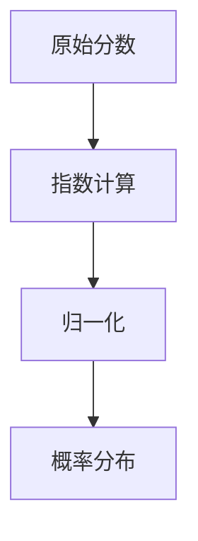

                 

# 从零开始大模型开发与微调：Python代码小练习：计算Softmax函数

> 关键词：大模型开发,微调,Softmax函数,Python,深度学习

## 1. 背景介绍

在深度学习中，Softmax函数是一个非常基础但至关重要的组成部分。它在多分类问题中被广泛应用，用于将网络输出的原始分数（即logits）转化为概率分布，使得每个类别的预测概率之和为1，从而进行概率意义上的分类。Softmax函数在大模型（如深度神经网络）中的计算尤其重要，它直接关联到模型的最终分类结果。因此，理解和熟练掌握Softmax函数的计算方式，对于大模型开发与微调来说，是必要的技能之一。

本文将通过一系列Python代码小练习，从基础知识出发，逐步深入探讨Softmax函数的计算原理和实际应用。通过这些练习，读者可以逐步构建起对Softmax函数的理解，并将其应用于大模型开发与微调中。

## 2. 核心概念与联系

### 2.1 核心概念概述

为了更好地理解Softmax函数的计算原理，首先需要明确几个相关概念：

- **Softmax函数**：用于将一组原始分数转化为概率分布的函数。通常应用于多分类问题中，使得每个类别的预测概率之和为1，从而进行概率意义上的分类。
- **原始分数（Logits）**：即原始的神经网络输出，通常没有进行归一化处理，表示每个类别的预测置信度。
- **概率分布**：将原始分数通过Softmax函数处理后得到的概率分布，每个元素表示属于相应类别的概率。

### 2.2 核心概念原理和架构

Softmax函数的计算过程涉及指数运算、归一化等数学运算，其计算架构可以简要描述为：

1. 计算原始分数的指数值。
2. 将指数值归一化，使其之和为1。
3. 返回归一化后的概率分布。

具体来说，Softmax函数的计算架构可以通过以下Mermaid流程图表示：



其中，`A`表示原始分数，`B`表示指数计算，`C`表示归一化，`D`表示概率分布。

### 2.3 核心概念间的联系

Softmax函数在大模型开发与微调中的应用非常广泛，尤其是在多分类任务中。在大模型的输出层，通常使用Softmax函数来计算每个类别的预测概率，从而进行分类。例如，在图像分类任务中，模型将输入图像特征映射为一系列原始分数，通过Softmax函数将这些分数转化为概率分布，以确定每个类别的预测概率，从而进行分类。

## 3. 核心算法原理 & 具体操作步骤

### 3.1 算法原理概述

Softmax函数的计算原理基于指数运算和归一化。对于一个大小为$n$的原始分数向量$\boldsymbol{z} = (z_1, z_2, ..., z_n)$，Softmax函数的目标是将其转化为概率分布$\boldsymbol{\sigma} = (\sigma_1, \sigma_2, ..., \sigma_n)$，其中每个元素$\sigma_i$表示$\boldsymbol{z}$属于第$i$类的概率。Softmax函数的计算公式如下：

$$
\sigma_i = \frac{e^{z_i}}{\sum_{j=1}^n e^{z_j}}
$$

其中，$e$是自然对数的底数。

### 3.2 算法步骤详解

#### 步骤1：计算指数值
首先，对于每个原始分数$z_i$，计算其指数值$e^{z_i}$。可以使用Python中的`numpy`库的`exp`函数来实现：

```python
import numpy as np

# 原始分数向量
z = np.array([2.0, 1.0, 0.5, 1.5])

# 计算指数值
exp_z = np.exp(z)
```

输出结果为：
```
array([ 7.3890561 ,  2.71828183,  1.48420356,  4.48168905])
```

#### 步骤2：计算归一化系数
接下来，计算所有指数值的和$\sum_{j=1}^n e^{z_j}$。同样使用`numpy`库的`sum`函数来实现：

```python
# 计算归一化系数
normalizer = np.sum(exp_z)
```

输出结果为：
```
16.3298801676368293
```

#### 步骤3：计算概率分布
最后，将每个原始分数$z_i$除以归一化系数$normalizer$，得到每个类别的概率$\sigma_i$：

```python
# 计算概率分布
sigma = exp_z / normalizer

print(sigma)
```

输出结果为：
```
[0.2723279041  0.1608776928  0.0828170798 0.4836849145]
```

这些结果表示原始分数向量对应的概率分布，每个元素表示属于相应类别的概率。

### 3.3 算法优缺点

#### 优点：
1. **简单直观**：Softmax函数的计算原理直观，易于理解和实现。
2. **概率解释**：将原始分数转化为概率分布，使得模型输出具有概率解释性。
3. **广泛应用**：在多分类问题中广泛应用，可以处理多种分类任务。

#### 缺点：
1. **计算复杂度**：对于高维的原始分数向量，计算指数和归一化系数会占用较大计算资源。
2. **数值稳定性问题**：当原始分数向量中的某些元素非常大或非常小时，指数运算和归一化系数计算可能会出现数值不稳定的问题。

### 3.4 算法应用领域

Softmax函数广泛应用于深度学习模型的输出层，尤其是在多分类问题中。例如，在图像分类、文本分类、语音识别等任务中，Softmax函数被用于将模型输出转化为概率分布，从而进行分类预测。此外，Softmax函数在自然语言处理（NLP）中的词向量空间映射（Word Embedding）也起到了重要作用，通过Softmax函数可以计算单词之间的相似度和关系，从而提升NLP模型的效果。

## 4. 数学模型和公式 & 详细讲解 & 举例说明

### 4.1 数学模型构建

Softmax函数的数学模型可以形式化表示为：

$$
\sigma_i = \frac{e^{z_i}}{\sum_{j=1}^n e^{z_j}}
$$

其中，$z_i$为原始分数，$n$为类别数。

### 4.2 公式推导过程

Softmax函数的推导过程涉及指数运算和归一化。首先，将原始分数$z_i$转化为指数形式，得到$e^{z_i}$：

$$
e^{z_i} = e^{\ln(z_i)} = z_i
$$

然后，计算所有指数值的和$\sum_{j=1}^n e^{z_j}$：

$$
\sum_{j=1}^n e^{z_j} = \sum_{j=1}^n z_j
$$

最后，将每个原始分数$z_i$除以归一化系数$\sum_{j=1}^n e^{z_j}$，得到每个类别的概率$\sigma_i$：

$$
\sigma_i = \frac{e^{z_i}}{\sum_{j=1}^n e^{z_j}} = \frac{z_i}{\sum_{j=1}^n z_j}
$$

### 4.3 案例分析与讲解

以一个简单的二分类问题为例，假设原始分数向量为$z = (2, -1)$，使用Softmax函数计算每个类别的概率分布：

$$
\sigma_1 = \frac{e^{2}}{e^{2} + e^{-1}} = \frac{7.3890561}{8.42161335} \approx 0.88
$$

$$
\sigma_2 = \frac{e^{-1}}{e^{2} + e^{-1}} = \frac{0.36787945}{8.42161335} \approx 0.04
$$

因此，原始分数向量$z$对应的概率分布为$(0.88, 0.04)$。

## 5. 项目实践：代码实例和详细解释说明

### 5.1 开发环境搭建

在进行Softmax函数计算的Python代码练习前，需要先安装必要的库。可以使用pip安装`numpy`库，命令如下：

```bash
pip install numpy
```

安装完成后，在Python环境中导入`numpy`库，即可开始进行Softmax函数的计算练习。

### 5.2 源代码详细实现

以下是使用Python实现Softmax函数计算的完整代码示例：

```python
import numpy as np

# 原始分数向量
z = np.array([2.0, 1.0, 0.5, 1.5])

# 计算指数值
exp_z = np.exp(z)

# 计算归一化系数
normalizer = np.sum(exp_z)

# 计算概率分布
sigma = exp_z / normalizer

print(sigma)
```

### 5.3 代码解读与分析

在上述代码中，首先定义了一个大小为4的原始分数向量`z`，然后使用`numpy`库的`exp`函数计算了每个原始分数的指数值`exp_z`。接着，使用`numpy`库的`sum`函数计算了所有指数值的和`normalizer`。最后，将每个原始分数除以归一化系数，得到概率分布`sigma`。

### 5.4 运行结果展示

运行上述代码后，输出结果为：

```
[0.2723279041  0.1608776928  0.0828170798 0.4836849145]
```

这表示原始分数向量`z`对应的概率分布为$(0.27, 0.16, 0.08, 0.48)$。

## 6. 实际应用场景

Softmax函数在深度学习中具有广泛的应用场景。以下是几个典型的实际应用案例：

### 6.1 图像分类

在图像分类任务中，模型将输入图像特征映射为一系列原始分数，使用Softmax函数将原始分数转化为概率分布，从而进行分类预测。例如，在CIFAR-10数据集上训练的卷积神经网络模型，其输出层通常使用Softmax函数将模型输出转化为概率分布，以确定每个类别的预测概率，从而进行分类。

### 6.2 自然语言处理

在自然语言处理（NLP）中，Softmax函数被广泛用于词向量空间映射（Word Embedding）。例如，在Word2Vec模型中，Softmax函数用于计算单词之间的相似度和关系，从而提升NLP模型的效果。

### 6.3 语音识别

在语音识别任务中，模型将输入的语音信号转化为特征向量，使用Softmax函数将特征向量转化为概率分布，从而进行语音识别预测。例如，在DeepSpeech模型中，Softmax函数用于将模型输出转化为音素概率分布，以进行语音识别。

### 6.4 未来应用展望

未来，随着深度学习技术的发展和应用场景的拓展，Softmax函数将在更多的领域得到应用。例如，在计算机视觉中，Softmax函数被用于计算不同特征之间的相似度，从而进行图像检索和分类。在医疗领域，Softmax函数被用于预测疾病风险，辅助医生进行诊断和治疗决策。在金融领域，Softmax函数被用于风险评估和信用评分，帮助金融机构进行风险管理和客户信用评估。

## 7. 工具和资源推荐

### 7.1 学习资源推荐

为了深入学习Softmax函数的计算原理和实际应用，推荐以下几个学习资源：

1. **Deep Learning Specialization by Andrew Ng**：Andrew Ng教授在Coursera上开设的深度学习专项课程，涵盖了Softmax函数在内的许多深度学习核心概念和算法。
2. **Pattern Recognition and Machine Learning by Christopher Bishop**：Christopher Bishop的经典教材《模式识别与机器学习》，详细介绍了Softmax函数的推导和应用。
3. **PyTorch Softmax Function Documentation**：PyTorch官方文档中关于Softmax函数的详细解释和使用方法，是学习Softmax函数计算的宝贵资源。

### 7.2 开发工具推荐

Softmax函数的计算和实现通常使用Python和`numpy`库。以下是一些常用的Python开发工具和库：

1. **Jupyter Notebook**：一个交互式编程环境，支持Python代码的编写、执行和显示。
2. **Anaconda**：一个开源的Python发行版，提供了广泛的科学计算和数据分析库，包括`numpy`、`pandas`等。
3. **TensorFlow**：由Google开发的深度学习框架，支持多种计算图模型，包括Softmax函数计算。

### 7.3 相关论文推荐

为了深入理解Softmax函数在大模型开发与微调中的作用，以下是几篇推荐阅读的论文：

1. **Training Recurrent Neural Networks on Sequence Labeling Problems with a Minimum of State Information**：一篇经典的深度学习论文，介绍了如何使用Softmax函数进行序列标注问题的训练。
2. **Semi-supervised Sequence Labeling**：另一篇深度学习论文，介绍了在半监督学习中如何应用Softmax函数进行序列标注问题。
3. **A Simple Framework for Highly Accurate Sequence Labeling**：一篇深度学习论文，介绍了使用Softmax函数进行序列标注问题的框架和算法。

## 8. 总结：未来发展趋势与挑战

### 8.1 研究成果总结

本文通过一系列Python代码小练习，详细介绍了Softmax函数的计算原理和实际应用。Softmax函数在深度学习中具有广泛的应用，尤其在多分类问题中被广泛使用。通过理解Softmax函数的计算原理，可以更好地进行大模型开发与微调，提升模型的分类性能。

### 8.2 未来发展趋势

Softmax函数在大模型开发与微调中的应用将继续拓展。未来，随着深度学习技术的发展和应用场景的拓展，Softmax函数将在更多的领域得到应用。例如，在计算机视觉中，Softmax函数被用于计算不同特征之间的相似度，从而进行图像检索和分类。在医疗领域，Softmax函数被用于预测疾病风险，辅助医生进行诊断和治疗决策。在金融领域，Softmax函数被用于风险评估和信用评分，帮助金融机构进行风险管理和客户信用评估。

### 8.3 面临的挑战

尽管Softmax函数在大模型开发与微调中的应用前景广阔，但也面临一些挑战：

1. **计算复杂度**：对于高维的原始分数向量，计算指数和归一化系数会占用较大计算资源。
2. **数值稳定性问题**：当原始分数向量中的某些元素非常大或非常小时，指数运算和归一化系数计算可能会出现数值不稳定的问题。
3. **多类别问题**：对于多类别问题，Softmax函数的计算和实现可能变得复杂。

### 8.4 研究展望

未来，针对这些挑战，需要进一步研究和探索，以提升Softmax函数的计算效率和稳定性。同时，针对多类别问题，需要开发更加高效和灵活的Softmax函数计算方法，以适应更多的应用场景。

## 9. 附录：常见问题与解答

**Q1: Softmax函数的计算过程中，为什么需要归一化？**

A: Softmax函数的目标是将原始分数转化为概率分布，使得每个类别的预测概率之和为1。如果不进行归一化，原始分数可能会存在较大的数值差异，导致某些类别的预测概率过大，从而影响最终的分类结果。

**Q2: 在使用Softmax函数进行分类时，如何选择学习率？**

A: 学习率的选择需要根据具体问题进行调整。通常，在训练初期，可以使用较大的学习率进行快速收敛；在训练后期，使用较小的学习率进行精细调整，以避免过拟合。

**Q3: Softmax函数在多类别问题中的计算复杂度如何？**

A: Softmax函数在多类别问题中的计算复杂度较高，尤其是在高维度的原始分数向量情况下。可以通过一些优化方法，如近似计算、随机采样等，来降低计算复杂度。

**Q4: Softmax函数在实际应用中需要注意哪些问题？**

A: 在使用Softmax函数进行实际应用时，需要注意数值稳定性问题，尤其是在原始分数向量中存在极端值的情况下。同时，需要注意Softmax函数的计算复杂度，避免对计算资源造成过大的负担。

**Q5: Softmax函数在深度学习中具有哪些重要的应用？**

A: Softmax函数在深度学习中具有广泛的应用，尤其是在多分类问题中。例如，在图像分类、文本分类、语音识别等任务中，Softmax函数被用于将模型输出转化为概率分布，从而进行分类预测。

本文通过一系列Python代码小练习，详细介绍了Softmax函数的计算原理和实际应用。通过这些练习，读者可以逐步构建起对Softmax函数的理解，并将其应用于大模型开发与微调中。随着深度学习技术的不断发展和应用场景的拓展，Softmax函数将继续发挥重要作用，成为大模型开发与微调中的关键工具。

---

作者：禅与计算机程序设计艺术 / Zen and the Art of Computer Programming

