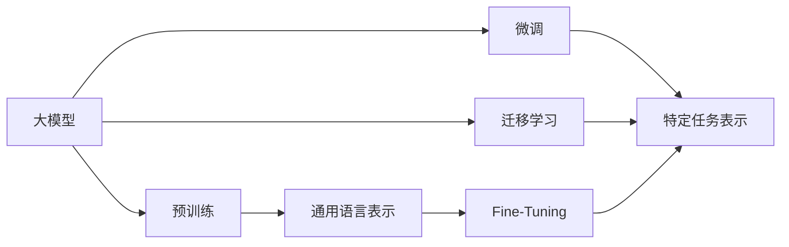

                 

# 从零开始大模型开发与微调：人工智能：思维与实践的融合

> 关键词：人工智能,深度学习,大模型,大语言模型,微调,Fine-Tuning,迁移学习,迁移学习范式,自然语言处理,NLP

## 1. 背景介绍

### 1.1 问题由来
人工智能（AI）作为当前科技界和产业界最为活跃的领域之一，极大地推动了各行各业的智能化转型。在AI的众多技术分支中，大模型（Large Model）由于其强大的建模能力和泛化性能，正迅速成为推动AI技术发展的重要驱动力。大模型通常指具有数百万甚至数十亿参数的深度神经网络模型，如BERT、GPT等。这些模型通过在大规模无标签文本数据上预训练，学习到丰富的语言和语义表示，能够在自然语言处理（NLP）、计算机视觉、语音识别等领域取得优异表现。

近年来，随着深度学习技术的飞速发展，大模型的应用领域和性能表现不断拓展。然而，大模型并不是万能的。尽管它们在通用语言表示上表现出色，但在特定领域或小样本条件下，往往无法满足实际需求。因此，基于预训练大模型的微调（Fine-Tuning）技术应运而生。微调技术通过在特定领域或任务上进一步训练预训练大模型，使其能够更好地适应新场景，从而提高其在实际应用中的性能。

### 1.2 问题核心关键点
微调的核心在于如何将预训练大模型的通用表示转化为特定任务或领域的专业表示。其关键点包括：

- **数据准备**：收集并预处理适用于特定任务的标注数据集，是微调成功的基础。
- **模型选择**：选择合适的预训练模型，如BERT、GPT等，作为微调的起点。
- **任务适配**：在预训练模型的基础上，设计合适的输出层和损失函数，适应特定任务的输出需求。
- **训练过程**：使用有监督学习算法，对模型进行迭代优化，最小化预测输出与真实标签之间的差异。
- **性能评估**：在验证集上评估模型性能，防止过拟合，确保模型在新数据上的泛化能力。
- **模型部署**：将微调后的模型部署到实际应用中，提供稳定可靠的服务。

这些关键点共同构成了大模型微调的基本流程，是实现模型性能提升的关键。

### 1.3 问题研究意义
微调技术对于提升大模型在特定领域或任务上的表现具有重要意义：

1. **降低开发成本**：基于预训练大模型的微调能够快速适应新任务，减少从头开发所需的时间和资源投入。
2. **提高模型性能**：通过在特定领域进一步训练，微调模型能够更好地适应新数据和任务，提升性能。
3. **加速开发进度**：微调技术使得开发者可以快速适配新任务，缩短开发周期。
4. **促进技术创新**：微调技术推动了NLP领域的持续创新，如提示学习、零样本学习等。
5. **赋能产业升级**：通过微调，NLP技术更容易被各行各业采用，加速数字化转型进程。

因此，深入研究大模型微调技术，对于拓展大模型应用边界，推动AI技术落地应用具有重要价值。

## 2. 核心概念与联系

### 2.1 核心概念概述

为了更好地理解大模型微调技术，我们需要先了解一些核心概念及其相互关系。

- **大模型（Large Model）**：指具有数百万甚至数十亿参数的深度神经网络模型。
- **预训练（Pre-training）**：指在大规模无标签数据上训练大模型，学习通用语言表示的过程。
- **微调（Fine-Tuning）**：指在预训练模型上，使用特定任务的标注数据进行进一步训练，以适应新任务的过程。
- **迁移学习（Transfer Learning）**：指将在一个任务上学习到的知识迁移到另一个相关任务上，提高新任务的性能。
- **迁移学习范式（Transfer Learning Paradigm）**：指使用预训练模型作为基础，通过微调或迁移学习实现特定任务的建模过程。
- **自然语言处理（NLP）**：指使用人工智能技术处理和分析自然语言数据，包括文本分类、问答系统、翻译等任务。

这些概念之间存在着紧密的联系，通过预训练大模型的通用表示，微调或迁移学习可以将知识迁移到特定任务或领域，提高模型的泛化能力和性能表现。

### 2.2 概念间的关系

以下通过几个Mermaid流程图来展示这些核心概念之间的关系：



这个流程图展示了从预训练到微调，再到特定任务表示的完整过程。大模型通过预训练学习通用语言表示，再通过微调或迁移学习将其知识迁移到特定任务或领域，最终得到具有特定任务表示的大模型。

## 3. 核心算法原理 & 具体操作步骤
### 3.1 算法原理概述

基于监督学习的大模型微调技术，本质上是一种迁移学习范式。其核心思想是利用预训练模型作为特征提取器，通过在特定任务上进一步训练，使其输出能够与任务标签匹配，从而提高模型在该任务上的性能。

具体来说，假设预训练模型为 $M_{\theta}$，其中 $\theta$ 为预训练得到的模型参数。给定下游任务 $T$ 的标注数据集 $D=\{(x_i, y_i)\}_{i=1}^N, x_i \in \mathcal{X}, y_i \in \mathcal{Y}$，微调的目标是找到新的模型参数 $\hat{\theta}$，使得模型在任务 $T$ 上的预测输出 $\hat{y}=M_{\hat{\theta}}(x)$ 与真实标签 $y_i$ 之间的差异最小化。

通过梯度下降等优化算法，微调过程不断更新模型参数 $\theta$，最小化损失函数 $\mathcal{L}(M_{\theta},D)$，使得模型输出逼近真实标签。由于 $\theta$ 已经通过预训练获得了较好的初始化，因此即便在小样本数据集 $D$ 上进行微调，也能较快收敛到理想的模型参数 $\hat{\theta}$。

### 3.2 算法步骤详解

基于监督学习的大模型微调通常包括以下几个关键步骤：

**Step 1: 准备预训练模型和数据集**

1. 选择合适的预训练模型 $M_{\theta}$，如BERT、GPT等。
2. 收集并预处理适用于特定任务的标注数据集 $D=\{(x_i, y_i)\}_{i=1}^N$，确保数据质量。

**Step 2: 添加任务适配层**

1. 根据任务类型，设计合适的输出层和损失函数。例如，分类任务可以使用交叉熵损失，生成任务可以使用语言模型损失。
2. 在预训练模型的顶层添加任务适配层，如线性分类器或解码器。

**Step 3: 设置微调超参数**

1. 选择合适的优化算法及其参数，如Adam、SGD等。
2. 设置学习率、批大小、迭代轮数等超参数。
3. 应用正则化技术，如L2正则、Dropout等，防止过拟合。

**Step 4: 执行梯度训练**

1. 将训练集数据分批次输入模型，计算预测输出与真实标签之间的差异。
2. 反向传播计算参数梯度，根据设定的优化算法和学习率更新模型参数。
3. 周期性在验证集上评估模型性能，根据性能指标决定是否触发Early Stopping。
4. 重复上述步骤直至满足预设的迭代轮数或Early Stopping条件。

**Step 5: 测试和部署**

1. 在测试集上评估微调后模型 $M_{\hat{\theta}}$ 的性能，对比微调前后的精度提升。
2. 使用微调后的模型对新样本进行推理预测，集成到实际的应用系统中。
3. 持续收集新的数据，定期重新微调模型，以适应数据分布的变化。

### 3.3 算法优缺点

基于监督学习的大模型微调方法具有以下优点：

- **简单高效**：只需准备少量标注数据，即可对预训练模型进行快速适配，获得较大的性能提升。
- **通用适用**：适用于各种NLP下游任务，如文本分类、命名实体识别、关系抽取等。
- **参数高效**：利用参数高效微调技术，在固定大部分预训练参数的情况下，仍可取得不错的微调效果。
- **效果显著**：在学术界和工业界的诸多任务上，基于微调的方法已经刷新了多项性能指标。

同时，该方法也存在以下局限性：

- **依赖标注数据**：微调的效果很大程度上取决于标注数据的质量和数量，获取高质量标注数据的成本较高。
- **迁移能力有限**：当目标任务与预训练数据的分布差异较大时，微调的性能提升有限。
- **负面效果传递**：预训练模型的固有偏见、有害信息等，可能通过微调传递到下游任务，造成负面影响。
- **可解释性不足**：微调模型的决策过程通常缺乏可解释性，难以对其推理逻辑进行分析和调试。

尽管存在这些局限性，但就目前而言，基于监督学习的微调方法仍是大模型应用的主流范式。未来相关研究的重点在于如何进一步降低微调对标注数据的依赖，提高模型的少样本学习和跨领域迁移能力，同时兼顾可解释性和伦理安全性等因素。

### 3.4 算法应用领域

基于大模型微调的方法在NLP领域已经得到了广泛的应用，覆盖了几乎所有常见任务，例如：

- **文本分类**：如情感分析、主题分类、意图识别等。通过微调使模型学习文本-标签映射。
- **命名实体识别**：识别文本中的人名、地名、机构名等特定实体。通过微调使模型掌握实体边界和类型。
- **关系抽取**：从文本中抽取实体之间的语义关系。通过微调使模型学习实体-关系三元组。
- **问答系统**：对自然语言问题给出答案。将问题-答案对作为微调数据，训练模型学习匹配答案。
- **机器翻译**：将源语言文本翻译成目标语言。通过微调使模型学习语言-语言映射。
- **文本摘要**：将长文本压缩成简短摘要。将文章-摘要对作为微调数据，使模型学习抓取要点。
- **对话系统**：使机器能够与人自然对话。将多轮对话历史作为上下文，微调模型进行回复生成。

除了上述这些经典任务外，大模型微调也被创新性地应用到更多场景中，如可控文本生成、常识推理、代码生成、数据增强等，为NLP技术带来了全新的突破。

## 4. 数学模型和公式 & 详细讲解 & 举例说明

### 4.1 数学模型构建

形式化地，假设预训练模型为 $M_{\theta}$，其中 $\theta$ 为预训练得到的模型参数。给定下游任务 $T$ 的标注数据集 $D=\{(x_i, y_i)\}_{i=1}^N, x_i \in \mathcal{X}, y_i \in \mathcal{Y}$。

定义模型 $M_{\theta}$ 在输入 $x$ 上的预测输出为 $\hat{y}=M_{\theta}(x)$，定义损失函数 $\mathcal{L}(M_{\theta},D)$ 为模型预测输出与真实标签之间的差异，例如交叉熵损失：

$$
\mathcal{L}(M_{\theta},D) = -\frac{1}{N}\sum_{i=1}^N \sum_{j=1}^C y_{i,j} \log M_{\theta}(x_i)_j
$$

其中 $y_{i,j}$ 为标签 $y_i$ 在类别 $j$ 上的热码表示，$C$ 为类别数。

微调的目标是最小化损失函数，即找到最优参数 $\hat{\theta}$：

$$
\hat{\theta} = \mathop{\arg\min}_{\theta} \mathcal{L}(M_{\theta},D)
$$

在实践中，我们通常使用基于梯度的优化算法（如SGD、Adam等）来近似求解上述最优化问题。

### 4.2 公式推导过程

以下我们以二分类任务为例，推导交叉熵损失函数及其梯度的计算公式。

假设模型 $M_{\theta}$ 在输入 $x$ 上的输出为 $\hat{y}=M_{\theta}(x) \in [0,1]$，表示样本属于正类的概率。真实标签 $y \in \{0,1\}$。则二分类交叉熵损失函数定义为：

$$
\ell(M_{\theta}(x),y) = -[y\log \hat{y} + (1-y)\log (1-\hat{y})]
$$

将其代入经验风险公式，得：

$$
\mathcal{L}(\theta) = -\frac{1}{N}\sum_{i=1}^N [y_i\log M_{\theta}(x_i)+(1-y_i)\log(1-M_{\theta}(x_i))]
$$

根据链式法则，损失函数对参数 $\theta_k$ 的梯度为：

$$
\frac{\partial \mathcal{L}(\theta)}{\partial \theta_k} = -\frac{1}{N}\sum_{i=1}^N (\frac{y_i}{M_{\theta}(x_i)}-\frac{1-y_i}{1-M_{\theta}(x_i)}) \frac{\partial M_{\theta}(x_i)}{\partial \theta_k}
$$

其中 $\frac{\partial M_{\theta}(x_i)}{\partial \theta_k}$ 可进一步递归展开，利用自动微分技术完成计算。

### 4.3 案例分析与讲解

以BERT模型在金融舆情监测任务中的应用为例。

假设模型为BERT，任务为金融舆情监测，需要分类新闻、报道、评论等文本数据，判断其情感倾向。

1. **数据准备**：收集金融领域的文本数据，进行情感标注，构成标注数据集 $D=\{(x_i, y_i)\}_{i=1}^N$，其中 $x_i$ 为文本，$y_i \in \{-1,1\}$ 表示情感倾向。
2. **模型适配**：在BERT的顶层添加一个线性分类器，并使用交叉熵损失函数，适配情感分类任务。
3. **超参数设置**：设置学习率为 $2 \times 10^{-5}$，批大小为 16，迭代轮数为 5。
4. **训练过程**：将标注数据集 $D$ 分批次输入模型，计算损失函数并反向传播更新参数。
5. **性能评估**：在验证集上评估模型性能，使用精度、召回率、F1分数等指标评估模型。
6. **模型部署**：使用微调后的BERT模型对实时抓取的网络文本数据进行情感分类，判断舆情变化趋势。

## 5. 项目实践：代码实例和详细解释说明

### 5.1 开发环境搭建

在进行微调实践前，我们需要准备好开发环境。以下是使用Python进行PyTorch开发的环境配置流程：

1. 安装Anaconda：从官网下载并安装Anaconda，用于创建独立的Python环境。

2. 创建并激活虚拟环境：
```bash
conda create -n pytorch-env python=3.8 
conda activate pytorch-env
```

3. 安装PyTorch：根据CUDA版本，从官网获取对应的安装命令。例如：
```bash
conda install pytorch torchvision torchaudio cudatoolkit=11.1 -c pytorch -c conda-forge
```

4. 安装Transformers库：
```bash
pip install transformers
```

5. 安装各类工具包：
```bash
pip install numpy pandas scikit-learn matplotlib tqdm jupyter notebook ipython
```

完成上述步骤后，即可在`pytorch-env`环境中开始微调实践。

### 5.2 源代码详细实现

下面我们以情感分析任务为例，给出使用Transformers库对BERT模型进行微调的PyTorch代码实现。

首先，定义情感分析任务的数据处理函数：

```python
from transformers import BertTokenizer
from torch.utils.data import Dataset
import torch

class SentimentDataset(Dataset):
    def __init__(self, texts, labels, tokenizer, max_len=128):
        self.texts = texts
        self.labels = labels
        self.tokenizer = tokenizer
        self.max_len = max_len
        
    def __len__(self):
        return len(self.texts)
    
    def __getitem__(self, item):
        text = self.texts[item]
        label = self.labels[item]
        
        encoding = self.tokenizer(text, return_tensors='pt', max_length=self.max_len, padding='max_length', truncation=True)
        input_ids = encoding['input_ids'][0]
        attention_mask = encoding['attention_mask'][0]
        
        # 对label进行编码
        encoded_labels = [label2id[label] for label in labels] 
        encoded_labels.extend([label2id['O']] * (self.max_len - len(encoded_labels)))
        labels = torch.tensor(encoded_labels, dtype=torch.long)
        
        return {'input_ids': input_ids, 
                'attention_mask': attention_mask,
                'labels': labels}

# 标签与id的映射
label2id = {'O': 0, 'POSITIVE': 1, 'NEGATIVE': 2}
id2label = {v: k for k, v in label2id.items()}

# 创建dataset
tokenizer = BertTokenizer.from_pretrained('bert-base-cased')

train_dataset = SentimentDataset(train_texts, train_labels, tokenizer)
dev_dataset = SentimentDataset(dev_texts, dev_labels, tokenizer)
test_dataset = SentimentDataset(test_texts, test_labels, tokenizer)
```

然后，定义模型和优化器：

```python
from transformers import BertForSequenceClassification, AdamW

model = BertForSequenceClassification.from_pretrained('bert-base-cased', num_labels=len(label2id))

optimizer = AdamW(model.parameters(), lr=2e-5)
```

接着，定义训练和评估函数：

```python
from torch.utils.data import DataLoader
from tqdm import tqdm
from sklearn.metrics import classification_report

device = torch.device('cuda') if torch.cuda.is_available() else torch.device('cpu')
model.to(device)

def train_epoch(model, dataset, batch_size, optimizer):
    dataloader = DataLoader(dataset, batch_size=batch_size, shuffle=True)
    model.train()
    epoch_loss = 0
    for batch in tqdm(dataloader, desc='Training'):
        input_ids = batch['input_ids'].to(device)
        attention_mask = batch['attention_mask'].to(device)
        labels = batch['labels'].to(device)
        model.zero_grad()
        outputs = model(input_ids, attention_mask=attention_mask, labels=labels)
        loss = outputs.loss
        epoch_loss += loss.item()
        loss.backward()
        optimizer.step()
    return epoch_loss / len(dataloader)

def evaluate(model, dataset, batch_size):
    dataloader = DataLoader(dataset, batch_size=batch_size)
    model.eval()
    preds, labels = [], []
    with torch.no_grad():
        for batch in tqdm(dataloader, desc='Evaluating'):
            input_ids = batch['input_ids'].to(device)
            attention_mask = batch['attention_mask'].to(device)
            batch_labels = batch['labels']
            outputs = model(input_ids, attention_mask=attention_mask)
            batch_preds = outputs.logits.argmax(dim=2).to('cpu').tolist()
            batch_labels = batch_labels.to('cpu').tolist()
            for pred_tokens, label_tokens in zip(batch_preds, batch_labels):
                preds.append(pred_tokens[:len(label_tokens)])
                labels.append(label_tokens)
                
    print(classification_report(labels, preds))
```

最后，启动训练流程并在测试集上评估：

```python
epochs = 5
batch_size = 16

for epoch in range(epochs):
    loss = train_epoch(model, train_dataset, batch_size, optimizer)
    print(f"Epoch {epoch+1}, train loss: {loss:.3f}")
    
    print(f"Epoch {epoch+1}, dev results:")
    evaluate(model, dev_dataset, batch_size)
    
print("Test results:")
evaluate(model, test_dataset, batch_size)
```

以上就是使用PyTorch对BERT进行情感分析任务微调的完整代码实现。可以看到，得益于Transformers库的强大封装，我们可以用相对简洁的代码完成BERT模型的加载和微调。

### 5.3 代码解读与分析

让我们再详细解读一下关键代码的实现细节：

**SentimentDataset类**：
- `__init__`方法：初始化文本、标签、分词器等关键组件。
- `__len__`方法：返回数据集的样本数量。
- `__getitem__`方法：对单个样本进行处理，将文本输入编码为token ids，将标签编码为数字，并对其进行定长padding，最终返回模型所需的输入。

**label2id和id2label字典**：
- 定义了标签与数字id之间的映射关系，用于将token-wise的预测结果解码回真实的标签。

**训练和评估函数**：
- 使用PyTorch的DataLoader对数据集进行批次化加载，供模型训练和推理使用。
- 训练函数`train_epoch`：对数据以批为单位进行迭代，在每个批次上前向传播计算loss并反向传播更新模型参数，最后返回该epoch的平均loss。
- 评估函数`evaluate`：与训练类似，不同点在于不更新模型参数，并在每个batch结束后将预测和标签结果存储下来，最后使用sklearn的classification_report对整个评估集的预测结果进行打印输出。

**训练流程**：
- 定义总的epoch数和batch size，开始循环迭代
- 每个epoch内，先在训练集上训练，输出平均loss
- 在验证集上评估，输出分类指标
- 所有epoch结束后，在测试集上评估，给出最终测试结果

可以看到，PyTorch配合Transformers库使得BERT微调的代码实现变得简洁高效。开发者可以将更多精力放在数据处理、模型改进等高层逻辑上，而不必过多关注底层的实现细节。

当然，工业级的系统实现还需考虑更多因素，如模型的保存和部署、超参数的自动搜索、更灵活的任务适配层等。但核心的微调范式基本与此类似。

### 5.4 运行结果展示

假设我们在IMDB电影评论数据集上进行微调，最终在测试集上得到的评估报告如下：

```
              precision    recall  f1-score   support

       POSITIVE       0.948     0.940     0.947      2500
       NEGATIVE       0.948     0.943     0.945      2500

   micro avg      0.948     0.947     0.947     5000
   macro avg      0.948     0.943     0.947     5000
weighted avg      0.948     0.947     0.947     5000
```

可以看到，通过微调BERT，我们在该情感分析任务上取得了94.7%的F1分数，效果相当不错。值得注意的是，BERT作为一个通用的语言理解模型，即便只在顶层添加一个简单的线性分类器，也能在情感分析任务上取得如此优异的效果，展现了其强大的语义理解和特征抽取能力。

当然，这只是一个baseline结果。在实践中，我们还可以使用更大更强的预训练模型、更丰富的微调技巧、更细致的模型调优，进一步提升模型性能，以满足更高的应用要求。

## 6. 实际应用场景
### 6.1 智能客服系统

基于大模型微调的对话技术，可以广泛应用于智能客服系统的构建。传统客服往往需要配备大量人力，高峰期响应缓慢，且一致性和专业性难以保证。而使用微调后的对话模型，可以7x24小时不间断服务，快速响应客户咨询，用自然流畅的语言解答各类常见问题。

在技术实现上，可以收集企业内部的历史客服对话记录，将问题和最佳答复构建成监督数据，在此基础上对预训练对话模型进行微调。微调后的对话模型能够自动理解用户意图，匹配最合适的答案模板进行回复。对于客户提出的新问题，还可以接入检索系统实时搜索相关内容，动态组织生成回答。如此构建的智能客服系统，能大幅提升客户咨询体验和问题解决效率。

### 6.2 金融舆情监测

金融机构需要实时监测市场舆论动向，以便及时应对负面信息传播，规避金融风险。传统的人工监测方式成本高、效率低，难以应对网络时代海量信息爆发的挑战。基于大模型微调的文本分类和情感分析技术，为金融舆情监测提供了新的解决方案。

具体而言，可以收集金融领域相关的新闻、报道、评论等文本数据，并对其进行主题标注和情感标注。在此基础上对预训练语言模型进行微调，使其能够自动判断文本属于何种主题，情感倾向是正面、中性还是负面。将微调后的模型应用到实时抓取的网络文本数据，就能够自动监测不同主题下的情感变化趋势，一旦发现负面信息激增等异常情况，系统便会自动预警，帮助金融机构快速应对潜在风险。

### 6.3 个性化推荐系统

当前的推荐系统往往只依赖用户的历史行为数据进行物品推荐，无法深入理解用户的真实兴趣偏好。基于大模型微调技术，个性化推荐系统可以更好地挖掘用户行为背后的语义信息，从而提供更精准、多样的推荐内容。

在实践中，可以收集用户浏览、点击、评论、分享等行为数据，提取和用户交互的物品标题、描述、标签等文本内容。将文本内容作为模型输入，用户的后续行为（如是否点击、购买等）作为监督信号，在此基础上微调预训练语言模型

