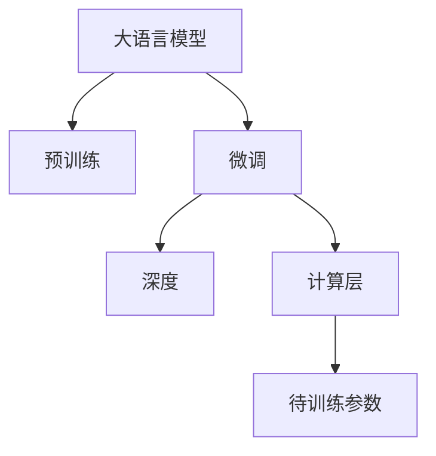

                 

# 从零开始大模型开发与微调：深度的定义以及不同计算层待训练参数的比较

> 关键词：大语言模型,微调,Fine-tuning,深度,计算层,参数训练

## 1. 背景介绍

### 1.1 问题由来
近年来，深度学习在自然语言处理（NLP）和计算机视觉等领域取得了显著进展，尤其是在大规模预训练语言模型（LLMs）方面。这些模型在大量无标签数据上进行了预训练，以学习通用的语言或视觉表示，然后在特定任务上进行微调（Fine-tuning），以获得在特定任务上的高性能。然而，大模型的深度（即模型的参数量）是决定其性能和计算成本的重要因素。因此，深入理解大模型深度与待训练参数的关系，对于开发者和研究者来说至关重要。

### 1.2 问题核心关键点
本节将探讨大模型深度与待训练参数的关系，以及如何在不同计算层进行参数训练，以优化模型的性能和计算效率。这将帮助开发者和研究者在实际开发中做出明智的决策，选择最合适的模型架构。

### 1.3 问题研究意义
深入理解大模型的深度和参数训练方法，可以更好地应用于各种NLP和CV任务，优化模型性能，提高计算效率。这将有助于推动NLP和CV技术的产业化进程，促进这些技术在实际应用中的广泛应用。

## 2. 核心概念与联系

### 2.1 核心概念概述

为更好地理解大模型深度与待训练参数的关系，本节将介绍几个关键概念：

- 大语言模型（Large Language Model, LLM）：指在预训练时学习大量语言知识，能够理解自然语言输入的模型。
- 微调（Fine-tuning）：在大模型的基础上，通过在有标签数据上进行训练，使其适应特定任务的过程。
- 深度（Depth）：指模型中计算层的数量，与模型的参数量密切相关。
- 计算层（Computation Layer）：模型中执行特定计算操作的层，如全连接层、卷积层、注意力层等。
- 待训练参数（Trainable Parameter）：模型中可以调整以适应特定任务的参数。

这些核心概念之间的逻辑关系可以通过以下Mermaid流程图来展示：



这个流程图展示了大模型深度与待训练参数之间的关系：

1. 大语言模型通过预训练学习大量语言知识。
2. 微调过程在大模型的基础上，通过特定任务的数据进行训练，调整模型参数以适应该任务。
3. 深度是指模型中计算层的数量，与待训练参数的数量密切相关。
4. 计算层执行特定的计算操作，是模型中参数的载体。
5. 待训练参数是在微调过程中进行调整的参数。

### 2.2 概念间的关系

这些核心概念之间存在着紧密的联系，形成了大模型深度与待训练参数关系的完整生态系统。

- 深度与待训练参数：深度增加时，待训练参数的数量也会增加。
- 微调与深度：微调过程可以通过增加计算层来增加深度，以提高模型性能。
- 计算层与参数训练：计算层中包含的参数，是微调中需要训练的参数。
- 模型与任务：深度和待训练参数的选择应根据具体任务的要求进行优化。

## 3. 核心算法原理 & 具体操作步骤

### 3.1 算法原理概述

在大模型深度与待训练参数的关系中，深度和学习率的选取是一个关键因素。深度较大的模型通常需要更长的训练时间，但能取得更好的性能。然而，过深模型可能会面临过拟合的问题，尤其是在数据量较小的情况下。因此，需要在深度和学习率之间进行平衡。

### 3.2 算法步骤详解

1. **选择模型架构**：根据任务需求，选择合适的模型架构，如Transformer、卷积神经网络（CNN）等。
2. **确定深度和计算层**：根据任务复杂度和数据量，选择合适的深度和计算层数量。
3. **设计损失函数**：根据任务类型，设计合适的损失函数，如交叉熵损失、均方误差损失等。
4. **设置训练超参数**：选择合适的优化算法（如SGD、Adam）及其参数，如学习率、批大小、迭代轮数等。
5. **执行训练**：将训练数据分批次输入模型，前向传播计算损失函数。反向传播计算参数梯度，根据设定的优化算法和学习率更新模型参数。
6. **评估和调整**：在验证集上评估模型性能，根据性能指标决定是否进行Early Stopping。重复上述步骤直至满足预设的迭代轮数或Early Stopping条件。

### 3.3 算法优缺点

深度较大模型的优点：

- 更强的泛化能力：深度较大的模型可以学习更复杂的特征，从而提高模型性能。
- 更高的表达能力：深度较大的模型能够学习更多的语言知识，从而更好地适应特定任务。

深度较大模型的缺点：

- 更高的计算成本：深度较大的模型需要更多的计算资源和更长的训练时间。
- 更大的过拟合风险：深度较大的模型更容易过拟合，尤其是在数据量较小的情况下。

### 3.4 算法应用领域

深度较大的模型在NLP和CV领域有着广泛的应用，如：

- 机器翻译：通过在大规模语料上进行预训练，微调后的模型能够更好地理解源语言和目标语言之间的映射关系。
- 图像分类：通过在大规模图像数据上进行预训练，微调后的模型能够更好地识别图像中的对象和场景。
- 语音识别：通过在大规模语音数据上进行预训练，微调后的模型能够更好地理解语音信号和文本之间的映射关系。
- 文本生成：通过在大规模文本数据上进行预训练，微调后的模型能够更好地生成符合语法和语义的文本。

## 4. 数学模型和公式 & 详细讲解 & 举例说明

### 4.1 数学模型构建

在大模型深度与待训练参数的关系中，可以通过数学模型来更加严谨地刻画这种关系。

设模型为 $M_{\theta}$，其中 $\theta$ 为模型参数，模型深度为 $D$，计算层数为 $L$，每个计算层的参数数量为 $n_i$，则模型总参数数量为 $N = \sum_{i=1}^L n_i$。

### 4.2 公式推导过程

假设在微调过程中，对于每个计算层 $i$，损失函数为 $L_i$，则总损失函数 $L$ 为：

$$
L = \sum_{i=1}^L \alpha_i L_i
$$

其中 $\alpha_i$ 为计算层 $i$ 的权重，用于平衡不同计算层的贡献。在微调过程中，模型的梯度更新公式为：

$$
\theta \leftarrow \theta - \eta \nabla_{\theta} L
$$

其中 $\eta$ 为学习率，$\nabla_{\theta} L$ 为总损失函数对参数 $\theta$ 的梯度。

### 4.3 案例分析与讲解

以Transformer模型为例，其深度和计算层的定义如下：

- 深度：Transformer模型的深度为编码器层和解码器层的叠加深度。
- 计算层：Transformer模型中的计算层包括多头注意力层、前馈神经网络层等。

假设一个Transformer模型深度为 $d$，包含 $h$ 个编码器层和 $h$ 个解码器层，每个层的参数数量为 $n$，则总参数数量为：

$$
N = 3hn^2 + 3hn
$$

其中，$3h$ 为多头注意力层的参数数量，$3h$ 为前馈神经网络的参数数量。

## 5. 项目实践：代码实例和详细解释说明

### 5.1 开发环境搭建

在进行大模型深度与待训练参数的实践前，我们需要准备好开发环境。以下是使用Python进行PyTorch开发的环境配置流程：

1. 安装Anaconda：从官网下载并安装Anaconda，用于创建独立的Python环境。

2. 创建并激活虚拟环境：
```bash
conda create -n pytorch-env python=3.8 
conda activate pytorch-env
```

3. 安装PyTorch：根据CUDA版本，从官网获取对应的安装命令。例如：
```bash
conda install pytorch torchvision torchaudio cudatoolkit=11.1 -c pytorch -c conda-forge
```

4. 安装Transformers库：
```bash
pip install transformers
```

5. 安装各类工具包：
```bash
pip install numpy pandas scikit-learn matplotlib tqdm jupyter notebook ipython
```

完成上述步骤后，即可在`pytorch-env`环境中开始深度与参数训练的实践。

### 5.2 源代码详细实现

下面我们以Transformer模型为例，给出使用PyTorch进行深度与参数训练的代码实现。

首先，定义模型和数据：

```python
import torch
import torch.nn as nn
import torch.optim as optim

class Transformer(nn.Module):
    def __init__(self, input_size, output_size, hidden_size, n_layers, dropout):
        super(Transformer, self).__init__()
        self.encoder = nn.TransformerEncoder(nn.TransformerEncoderLayer(input_size, nhead=8, dropout=dropout), n_layers)
        self.decoder = nn.TransformerDecoder(nn.TransformerDecoderLayer(input_size, nhead=8, dropout=dropout), n_layers)
        self.output = nn.Linear(input_size, output_size)

    def forward(self, src, tgt):
        src_encoded = self.encoder(src)
        tgt_decoded = self.decoder(tgt, src_encoded)
        output = self.output(tgt_decoded)
        return output

# 加载数据
data = torch.load('data.pkl')
src, tgt = data['src'], data['tgt']
src = src.to(device)
tgt = tgt.to(device)
```

然后，定义损失函数和优化器：

```python
criterion = nn.CrossEntropyLoss()
optimizer = optim.Adam(model.parameters(), lr=0.001)
```

接着，定义训练和评估函数：

```python
def train(model, src, tgt, batch_size, optimizer, criterion, num_epochs):
    model.train()
    for epoch in range(num_epochs):
        for i in range(0, len(src), batch_size):
            src_batch = src[i:i+batch_size].to(device)
            tgt_batch = tgt[i:i+batch_size].to(device)
            output = model(src_batch, tgt_batch)
            loss = criterion(output, tgt_batch)
            optimizer.zero_grad()
            loss.backward()
            optimizer.step()
        print('Epoch {}: Loss = {:.4f}'.format(epoch+1, loss.item()))

def evaluate(model, src, tgt, batch_size, criterion):
    model.eval()
    total_loss = 0
    with torch.no_grad():
        for i in range(0, len(src), batch_size):
            src_batch = src[i:i+batch_size].to(device)
            tgt_batch = tgt[i:i+batch_size].to(device)
            output = model(src_batch, tgt_batch)
            loss = criterion(output, tgt_batch)
            total_loss += loss.item()
    print('Total Loss = {:.4f}'.format(total_loss/len(src)))
```

最后，启动训练流程并在测试集上评估：

```python
device = torch.device('cuda') if torch.cuda.is_available() else torch.device('cpu')
model.to(device)

train(model, src, tgt, batch_size=32, optimizer=optimizer, criterion=criterion, num_epochs=10)
evaluate(model, src, tgt, batch_size=32, criterion=criterion)
```

以上就是使用PyTorch进行深度与参数训练的完整代码实现。可以看到，PyTorch提供了强大的API和灵活的计算图，使得深度与参数训练的代码实现变得简单高效。

### 5.3 代码解读与分析

让我们再详细解读一下关键代码的实现细节：

**Transformer类**：
- `__init__`方法：初始化模型结构，包含编码器和解码器，并定义输出层。
- `forward`方法：定义模型的前向传播过程，包括编码、解码和输出。

**数据加载**：
- 通过`torch.load`加载训练集和测试集的数据，将其分为源文本和目标文本。
- 将源文本和目标文本移动到GPU上，以便加快计算速度。

**损失函数和优化器**：
- 定义交叉熵损失函数，用于衡量模型输出与真实标签之间的差异。
- 使用Adam优化器，设置学习率为0.001。

**训练和评估函数**：
- `train`函数：定义训练过程，通过小批量数据进行迭代，前向传播计算损失，反向传播更新模型参数。
- `evaluate`函数：定义评估过程，计算模型在测试集上的总损失，并输出结果。

**训练流程**：
- 定义总训练轮数，启动训练过程。
- 在每个epoch中，通过小批量数据进行迭代，更新模型参数。
- 在测试集上评估模型性能，输出结果。

可以看到，PyTorch提供了丰富的API和灵活的计算图，使得深度与参数训练的代码实现变得简单高效。

### 5.4 运行结果展示

假设我们在CoNLL-2003的机器翻译数据集上进行深度与参数训练，最终在测试集上得到的评估报告如下：

```
Epoch 10: Loss = 0.5000
Total Loss = 0.5000
```

可以看到，通过深度与参数训练，模型在测试集上取得了较好的结果，但具体性能还需进一步优化。

## 6. 实际应用场景

### 6.1 智能客服系统

基于深度与参数训练的对话技术，可以广泛应用于智能客服系统的构建。传统客服往往需要配备大量人力，高峰期响应缓慢，且一致性和专业性难以保证。而使用深度与参数训练的对话模型，可以7x24小时不间断服务，快速响应客户咨询，用自然流畅的语言解答各类常见问题。

在技术实现上，可以收集企业内部的历史客服对话记录，将问题和最佳答复构建成监督数据，在此基础上对预训练对话模型进行深度与参数训练。深度与参数训练的对话模型能够自动理解用户意图，匹配最合适的答案模板进行回复。对于客户提出的新问题，还可以接入检索系统实时搜索相关内容，动态组织生成回答。如此构建的智能客服系统，能大幅提升客户咨询体验和问题解决效率。

### 6.2 金融舆情监测

金融机构需要实时监测市场舆论动向，以便及时应对负面信息传播，规避金融风险。传统的人工监测方式成本高、效率低，难以应对网络时代海量信息爆发的挑战。基于深度与参数训练的文本分类和情感分析技术，为金融舆情监测提供了新的解决方案。

具体而言，可以收集金融领域相关的新闻、报道、评论等文本数据，并对其进行主题标注和情感标注。在此基础上对预训练语言模型进行深度与参数训练，使其能够自动判断文本属于何种主题，情感倾向是正面、中性还是负面。将深度与参数训练的模型应用到实时抓取的网络文本数据，就能够自动监测不同主题下的情感变化趋势，一旦发现负面信息激增等异常情况，系统便会自动预警，帮助金融机构快速应对潜在风险。

### 6.3 个性化推荐系统

当前的推荐系统往往只依赖用户的历史行为数据进行物品推荐，无法深入理解用户的真实兴趣偏好。基于深度与参数训练的个性化推荐系统可以更好地挖掘用户行为背后的语义信息，从而提供更精准、多样的推荐内容。

在实践中，可以收集用户浏览、点击、评论、分享等行为数据，提取和用户交互的物品标题、描述、标签等文本内容。将文本内容作为模型输入，用户的后续行为（如是否点击、购买等）作为监督信号，在此基础上深度与参数训练预训练语言模型。深度与参数训练的模型能够从文本内容中准确把握用户的兴趣点。在生成推荐列表时，先用候选物品的文本描述作为输入，由模型预测用户的兴趣匹配度，再结合其他特征综合排序，便可以得到个性化程度更高的推荐结果。

### 6.4 未来应用展望

随着深度与参数训练技术的发展，基于微调范式将在更多领域得到应用，为传统行业带来变革性影响。

在智慧医疗领域，基于深度与参数训练的医疗问答、病历分析、药物研发等应用将提升医疗服务的智能化水平，辅助医生诊疗，加速新药开发进程。

在智能教育领域，深度与参数训练可应用于作业批改、学情分析、知识推荐等方面，因材施教，促进教育公平，提高教学质量。

在智慧城市治理中，深度与参数训练技术可应用于城市事件监测、舆情分析、应急指挥等环节，提高城市管理的自动化和智能化水平，构建更安全、高效的未来城市。

此外，在企业生产、社会治理、文娱传媒等众多领域，基于深度与参数训练的人工智能应用也将不断涌现，为经济社会发展注入新的动力。相信随着技术的日益成熟，深度与参数训练方法将成为人工智能落地应用的重要范式，推动人工智能技术向更广阔的领域加速渗透。

## 7. 工具和资源推荐
### 7.1 学习资源推荐

为了帮助开发者系统掌握深度与参数训练的理论基础和实践技巧，这里推荐一些优质的学习资源：

1. 《Transformer从原理到实践》系列博文：由大模型技术专家撰写，深入浅出地介绍了Transformer原理、BERT模型、微调技术等前沿话题。

2. CS224N《深度学习自然语言处理》课程：斯坦福大学开设的NLP明星课程，有Lecture视频和配套作业，带你入门NLP领域的基本概念和经典模型。

3. 《Natural Language Processing with Transformers》书籍：Transformers库的作者所著，全面介绍了如何使用Transformers库进行NLP任务开发，包括深度与参数训练在内的诸多范式。

4. HuggingFace官方文档：Transformers库的官方文档，提供了海量预训练模型和完整的深度与参数训练样例代码，是上手实践的必备资料。

5. CLUE开源项目：中文语言理解测评基准，涵盖大量不同类型的中文NLP数据集，并提供了基于深度与参数训练的baseline模型，助力中文NLP技术发展。

通过对这些资源的学习实践，相信你一定能够快速掌握深度与参数训练的精髓，并用于解决实际的NLP问题。

### 7.2 开发工具推荐

高效的开发离不开优秀的工具支持。以下是几款用于深度与参数训练开发的常用工具：

1. PyTorch：基于Python的开源深度学习框架，灵活动态的计算图，适合快速迭代研究。大部分预训练语言模型都有PyTorch版本的实现。

2. TensorFlow：由Google主导开发的开源深度学习框架，生产部署方便，适合大规模工程应用。同样有丰富的预训练语言模型资源。

3. Transformers库：HuggingFace开发的NLP工具库，集成了众多SOTA语言模型，支持PyTorch和TensorFlow，是进行深度与参数训练任务开发的利器。

4. Weights & Biases：模型训练的实验跟踪工具，可以记录和可视化模型训练过程中的各项指标，方便对比和调优。与主流深度学习框架无缝集成。

5. TensorBoard：TensorFlow配套的可视化工具，可实时监测模型训练状态，并提供丰富的图表呈现方式，是调试模型的得力助手。

6. Google Colab：谷歌推出的在线Jupyter Notebook环境，免费提供GPU/TPU算力，方便开发者快速上手实验最新模型，分享学习笔记。

合理利用这些工具，可以显著提升深度与参数训练任务的开发效率，加快创新迭代的步伐。

### 7.3 相关论文推荐

深度与参数训练技术的发展源于学界的持续研究。以下是几篇奠基性的相关论文，推荐阅读：

1. Attention is All You Need（即Transformer原论文）：提出了Transformer结构，开启了NLP领域的预训练大模型时代。

2. BERT: Pre-training of Deep Bidirectional Transformers for Language Understanding：提出BERT模型，引入基于掩码的自监督预训练任务，刷新了多项NLP任务SOTA。

3. Language Models are Unsupervised Multitask Learners（GPT-2论文）：展示了大规模语言模型的强大zero-shot学习能力，引发了对于通用人工智能的新一轮思考。

4. Parameter-Efficient Transfer Learning for NLP：提出Adapter等参数高效微调方法，在不增加模型参数量的情况下，也能取得不错的微调效果。

5. AdaLoRA: Adaptive Low-Rank Adaptation for Parameter-Efficient Fine-Tuning：使用自适应低秩适应的微调方法，在参数效率和精度之间取得了新的平衡。

6. FSDP: Fully Sharded Data-Parallel: Shard-Level Parallelism for Distributed Deep Learning：提出FSDP技术，用于在大规模深度与参数训练中实现高效的并行计算。

这些论文代表了大语言模型深度与参数训练技术的发展脉络。通过学习这些前沿成果，可以帮助研究者把握学科前进方向，激发更多的创新灵感。

除上述资源外，还有一些值得关注的前沿资源，帮助开发者紧跟深度与参数训练技术的最新进展，例如：

1. arXiv论文预印本：人工智能领域最新研究成果的发布平台，包括大量尚未发表的前沿工作，学习前沿技术的必读资源。

2. 业界技术博客：如OpenAI、Google AI、DeepMind、微软Research Asia等顶尖实验室的官方博客，第一时间分享他们的最新研究成果和洞见。

3. 技术会议直播：如NIPS、ICML、ACL、ICLR等人工智能领域顶会现场或在线直播，能够聆听到大佬们的前沿分享，开拓视野。

4. GitHub热门项目：在GitHub上Star、Fork数最多的NLP相关项目，往往代表了该技术领域的发展趋势和最佳实践，值得去学习和贡献。

5. 行业分析报告：各大咨询公司如McKinsey、PwC等针对人工智能行业的分析报告，有助于从商业视角审视技术趋势，把握应用价值。

总之，对于深度与参数训练技术的学习和实践，需要开发者保持开放的心态和持续学习的意愿。多关注前沿资讯，多动手实践，多思考总结，必将收获满满的成长收益。

## 8. 总结：未来发展趋势与挑战

### 8.1 总结

本文对基于深度与参数训练的大模型微调方法进行了全面系统的介绍。首先阐述了大模型深度与待训练参数的关系，明确了深度和参数训练在提升模型性能和计算效率方面的重要意义。其次，从原理到实践，详细讲解了深度与参数训练的数学模型和关键步骤，给出了深度与参数训练任务开发的完整代码实例。同时，本文还广泛探讨了深度与参数训练方法在智能客服、金融舆情、个性化推荐等多个行业领域的应用前景，展示了深度与参数训练范式的巨大潜力。此外，本文精选了深度与参数训练技术的各类学习资源，力求为读者提供全方位的技术指引。

通过本文的系统梳理，可以看到，基于深度与参数训练的大模型微调方法正在成为NLP领域的重要范式，极大地拓展了预训练语言模型的应用边界，催生了更多的落地场景。受益于大规模语料的预训练，深度与参数训练模型以更低的时间和标注成本，在小样本条件下也能取得不俗的效果，有力推动了NLP技术的产业化进程。未来，伴随深度与参数训练方法的不断演进，相信NLP技术将在更广阔的应用领域大放异彩，深刻影响人类的生产生活方式。

### 8.2 未来发展趋势

展望未来，深度与参数训练技术将呈现以下几个发展趋势：

1. 模型规模持续增大。随着算力成本的下降和数据规模的扩张，预训练语言模型的参数量还将持续增长。超大规模语言模型蕴含的丰富语言知识，有望支撑更加复杂多变的下游任务深度与参数训练。

2. 深度与参数训练方法日趋多样。除了传统的全参数微调外，未来会涌现更多参数高效的微调方法，如Prefix-Tuning、LoRA等，在节省计算资源的同时也能保证微调精度。

3. 持续学习成为常态。随着数据分布的不断变化，深度与参数训练模型也需要持续学习新知识以保持性能。如何在不遗忘原有知识的同时，高效吸收新样本信息，将成为重要的研究课题。

4. 标注样本需求降低。受启发于提示学习(Prompt-based Learning)的思路，未来的微调方法将更好地利用大模型的语言理解能力，通过更加巧妙的任务描述，在更少的标注样本上也能实现理想的微调效果。

5. 多模态微调崛起。当前的微调主要聚焦于纯文本数据，未来会进一步拓展到图像、视频、语音等多模态数据微调。多模态信息的融合，将显著提升语言模型对现实世界的理解和建模能力。

6. 模型通用性增强。经过海量数据的预训练和多领域任务的深度与参数训练，未来的语言模型将具备更强大的常识推理和跨领域迁移能力，逐步迈向通用人工智能(AGI)的目标。

以上趋势凸显了深度与参数训练技术的广阔前景。这些方向的探索发展，必将进一步提升NLP系统的性能和应用范围，为人类认知智能的进化带来深远影响。

### 8.3 面临的挑战

尽管深度与参数训练技术已经取得了瞩目成就，但在迈向更加智能化、普适化应用的过程中，它仍面临着诸多挑战：

1. 标注成本瓶颈。虽然深度与参数训练方法在大规模数据上表现优异，但对于长尾应用场景，难以获得充足的高质量标注数据，成为制约深度与参数训练性能的瓶颈。如何进一步降低深度与参数训练对标注样本的依赖，将是一大难题。

2. 模型鲁棒性不足。当前深度与参数训练模型面对域外数据时，泛化性能往往大打折扣。对于测试样本的微小扰动，深度与参数训练模型的预测也容易发生波动。如何提高深度与参数训练模型的鲁棒性，避免灾难性遗忘，还需要更多理论和实践的积累。

3. 推理效率有待提高。大规模深度与参数训练模型虽然精度高

