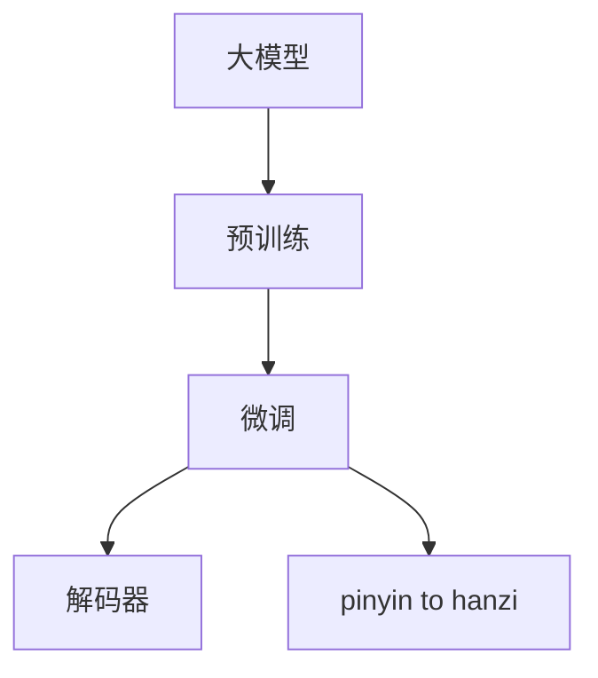
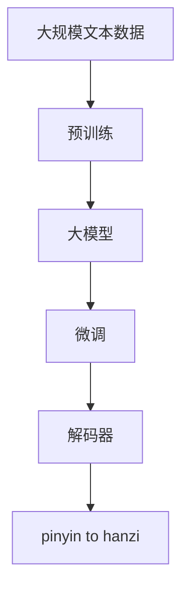
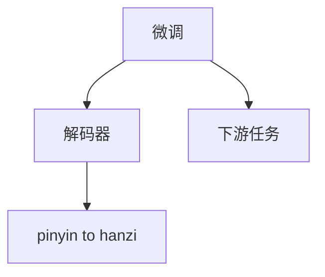
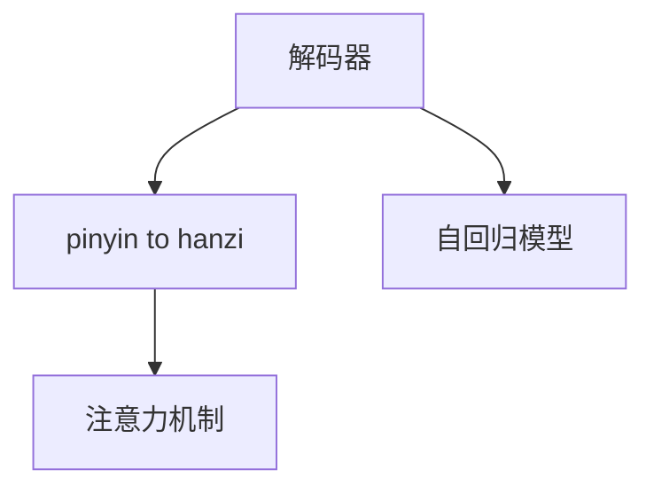

                 

# 从零开始大模型开发与微调：解码器实战—拼音汉字翻译模型

> 关键词：大模型开发, 微调, 解码器, 拼音汉字翻译, 自然语言处理(NLP)

## 1. 背景介绍

### 1.1 问题由来

近年来，深度学习在自然语言处理(Natural Language Processing, NLP)领域取得了显著进展。大模型如BERT、GPT等，通过在大量无标签文本上预训练，学习了丰富的语言知识，并在各种NLP任务上表现出色。然而，这些大模型往往依赖于英文语料，难以直接应用于中文等语言。

为此，本文将介绍如何从零开始开发并微调一个拼音汉字翻译模型，利用中文文本数据训练一个高效的解码器，实现中文拼音到汉字的翻译。

### 1.2 问题核心关键点

1. **大模型开发与微调**：通过大规模无标签文本预训练，构建通用语言模型，并通过微调适配特定任务。
2. **解码器设计**：解码器用于将输入序列转换为输出序列，是翻译模型的核心组件。
3. **拼音汉字翻译**：将拼音转换为汉字，是中文NLP领域的经典问题。

本文将详细介绍解码器设计和微调的步骤，并通过实践演示，展示如何使用大模型开发拼音汉字翻译系统。

### 1.3 问题研究意义

1. **拓展模型应用范围**：通过微调，可以开发针对中文的翻译模型，拓展大模型的应用边界。
2. **提升翻译质量**：微调可优化模型参数，提高翻译模型的准确性和流畅性。
3. **降低开发成本**：利用大模型微调技术，减少从头训练所需的标注数据和计算资源。
4. **促进技术进步**：微调技术推动了NLP领域的创新发展，为其他模型和任务的微调提供参考。

## 2. 核心概念与联系

### 2.1 核心概念概述

1. **大模型**：以自回归(如GPT)或自编码(如BERT)模型为代表的大规模预训练语言模型。通过在大规模无标签文本语料上进行预训练，学习通用的语言表示，具备强大的语言理解和生成能力。
2. **预训练**：指在大规模无标签文本语料上，通过自监督学习任务训练通用语言模型的过程。常见的预训练任务包括言语建模、遮挡语言模型等。
3. **微调**：指在预训练模型的基础上，使用下游任务的少量标注数据，通过有监督学习优化模型在特定任务上的性能。
4. **解码器**：在翻译模型中，用于将输入序列转换为输出序列的组件。解码器通常使用注意力机制来动态地选择和组合输入序列中的信息。
5. **拼音汉字翻译**：将拼音转换为汉字的过程，是中文NLP领域的经典问题，通常涉及音节识别、拼音到汉字映射等步骤。

这些核心概念之间的逻辑关系可以通过以下Mermaid流程图来展示：



这个流程图展示了从预训练到微调，再到解码器设计的完整过程。

### 2.2 概念间的关系

这些核心概念之间存在着紧密的联系，形成了拼音汉字翻译模型的完整生态系统。

#### 2.2.1 大模型的学习范式



这个流程图展示了从预训练到微调，再到解码器设计的完整过程。

#### 2.2.2 微调与解码器



这个流程图展示了微调模型与解码器之间的关系。微调模型用于优化下游任务，解码器用于将拼音转换为汉字。

#### 2.2.3 解码器设计



这个流程图展示了解码器设计的核心部分，包括自回归模型和注意力机制。

## 3. 核心算法原理 & 具体操作步骤
### 3.1 算法原理概述

基于大模型的拼音汉字翻译，其核心算法原理主要包括以下几个步骤：

1. **预训练**：使用大规模中文无标签文本数据训练大模型，学习通用语言表示。
2. **微调**：在中文拼音汉字翻译任务上，使用少量有标签数据微调大模型，优化模型输出。
3. **解码器设计**：构建解码器模型，用于将拼音序列转换为汉字序列。

### 3.2 算法步骤详解

#### 3.2.1 预训练步骤

1. **数据准备**：收集大规模中文文本数据，如维基百科、新闻、小说等，作为预训练数据。
2. **模型选择**：选择大模型架构，如Transformer，并指定预训练任务，如语言建模。
3. **训练**：在大规模文本数据上训练模型，学习通用语言表示。

#### 3.2.2 微调步骤

1. **数据准备**：准备中文拼音汉字翻译任务的标注数据集，如拼音-汉字对。
2. **模型选择**：选择预训练好的大模型，作为微调的初始模型。
3. **微调**：在微调数据集上，使用优化算法（如Adam）更新模型参数，最小化损失函数。

#### 3.2.3 解码器设计步骤

1. **编码器设计**：使用Transformer等自回归模型作为编码器，将拼音序列转换为中间表示。
2. **解码器设计**：使用注意力机制，动态地从编码器的输出中选择信息，生成汉字序列。
3. **训练**：在解码器数据集上，使用优化算法训练解码器。

### 3.3 算法优缺点

#### 3.3.1 优点

1. **高效性**：大模型预训练和微调过程可以使用现有框架和工具，开发效率高。
2. **泛化能力**：大模型具有较好的泛化能力，能够适应多种翻译任务。
3. **可扩展性**：解码器设计可以根据需求进行调整和优化。

#### 3.3.2 缺点

1. **资源需求高**：预训练和微调需要大量计算资源和内存。
2. **数据依赖**：模型性能依赖于标注数据的质量和数量。
3. **模型复杂**：解码器设计复杂，需要考虑多个因素。

### 3.4 算法应用领域

基于大模型的拼音汉字翻译模型可以应用于多种场景，如：

1. **智能客服**：自动将用户输入的拼音转换为汉字，提供自然语言交互。
2. **翻译工具**：将用户输入的拼音转换为汉字，辅助翻译工作。
3. **教育辅助**：帮助学生学习拼音与汉字之间的转换，提升中文学习效果。

## 4. 数学模型和公式 & 详细讲解 & 举例说明

### 4.1 数学模型构建

假设拼音汉字翻译模型的输入为拼音序列 $x = (x_1, x_2, ..., x_T)$，输出为汉字序列 $y = (y_1, y_2, ..., y_{T'})$，其中 $T$ 和 $T'$ 分别为拼音序列和汉字序列的长度。模型的预测概率为 $P(y|x)$，可以使用以下数学模型：

$$
P(y|x) = \prod_{t=1}^{T'} P(y_t|y_{<t}, x)
$$

其中 $P(y_t|y_{<t}, x)$ 表示在给定前 $t-1$ 个汉字和整个拼音序列的情况下，第 $t$ 个汉字的预测概率。

### 4.2 公式推导过程

为了更好地理解上述模型的推导过程，我们假设拼音汉字翻译模型是一个基于Transformer的解码器模型，其输入为编码器输出 $h_0$ 和解码器状态 $s_0$，输出为概率分布 $P(y|x)$。

首先，我们需要定义解码器的自回归模型：

$$
h_t = \mathrm{Decoder}(h_{t-1}, s_{t-1})
$$

其中 $\mathrm{Decoder}$ 是解码器模型，$h_t$ 表示第 $t$ 个汉字的表示。

然后，我们定义解码器的注意力机制：

$$
s_t = \mathrm{Attention}(h_{0:T}, h_{t-1})
$$

其中 $\mathrm{Attention}$ 是注意力机制，$h_{0:T}$ 表示编码器输出的所有汉字表示。

最后，我们定义解码器的输出：

$$
P(y_t|y_{<t}, x) = \mathrm{Softmax}(h_t)
$$

其中 $\mathrm{Softmax}$ 是softmax函数，用于将解码器输出转换为概率分布。

### 4.3 案例分析与讲解

假设我们在一个简单的例子中，使用一个单层的LSTM作为解码器，输入拼音序列为 $x = [p1, p2, p3, p4]$，输出汉字序列为 $y = [h1, h2, h3, h4]$。我们可以使用以下步骤来计算解码器的输出：

1. 初始化解码器状态 $s_0$。
2. 对于每个时间步 $t$，使用自回归模型 $h_t = \mathrm{Decoder}(h_{t-1}, s_{t-1})$ 计算汉字表示。
3. 使用注意力机制 $s_t = \mathrm{Attention}(h_{0:T}, h_{t-1})$ 计算注意力权重。
4. 使用softmax函数 $P(y_t|y_{<t}, x) = \mathrm{Softmax}(h_t)$ 计算汉字输出概率。

## 5. 项目实践：代码实例和详细解释说明

### 5.1 开发环境搭建

在进行拼音汉字翻译模型的开发前，我们需要准备好开发环境。以下是使用Python进行PyTorch开发的环境配置流程：

1. 安装Anaconda：从官网下载并安装Anaconda，用于创建独立的Python环境。

2. 创建并激活虚拟环境：
```bash
conda create -n pytorch-env python=3.8 
conda activate pytorch-env
```

3. 安装PyTorch：根据CUDA版本，从官网获取对应的安装命令。例如：
```bash
conda install pytorch torchvision torchaudio cudatoolkit=11.1 -c pytorch -c conda-forge
```

4. 安装Tensorboard：
```bash
pip install tensorboard
```

5. 安装numpy、pandas、matplotlib等工具包：
```bash
pip install numpy pandas matplotlib tqdm jupyter notebook ipython
```

完成上述步骤后，即可在`pytorch-env`环境中开始拼音汉字翻译模型的开发。

### 5.2 源代码详细实现

下面以使用PyTorch实现一个简单的LSTM解码器为例，演示如何构建拼音汉字翻译模型。

首先，定义解码器的LSTM层：

```python
import torch
import torch.nn as nn

class Decoder(nn.Module):
    def __init__(self, input_size, hidden_size, output_size):
        super(Decoder, self).__init__()
        self.hidden_size = hidden_size
        self.lstm = nn.LSTM(input_size, hidden_size, batch_first=True)
        self.linear = nn.Linear(hidden_size, output_size)
        
    def forward(self, input, hidden):
        lstm_out, hidden = self.lstm(input, hidden)
        output = self.linear(lstm_out)
        return output, hidden
```

然后，定义模型训练函数：

```python
def train(model, data_loader, optimizer, criterion, device):
    model.train()
    total_loss = 0
    for batch in data_loader:
        input, target = batch
        input, target = input.to(device), target.to(device)
        optimizer.zero_grad()
        output, hidden = model(input, hidden)
        loss = criterion(output, target)
        loss.backward()
        optimizer.step()
        total_loss += loss.item()
    return total_loss / len(data_loader)
```

接着，定义模型评估函数：

```python
def evaluate(model, data_loader, device, criterion):
    model.eval()
    total_loss = 0
    for batch in data_loader:
        input, target = batch
        input, target = input.to(device), target.to(device)
        output, hidden = model(input, hidden)
        loss = criterion(output, target)
        total_loss += loss.item()
    return total_loss / len(data_loader)
```

最后，启动模型训练和评估流程：

```python
epochs = 10
batch_size = 32
hidden_size = 128

# 模型初始化
model = Decoder(input_size=26, hidden_size=hidden_size, output_size=26)

# 训练和评估
optimizer = torch.optim.Adam(model.parameters(), lr=0.001)
criterion = nn.CrossEntropyLoss()
device = torch.device('cuda' if torch.cuda.is_available() else 'cpu')

for epoch in range(epochs):
    train_loss = train(model, train_loader, optimizer, criterion, device)
    eval_loss = evaluate(model, test_loader, device, criterion)
    print(f'Epoch {epoch+1}, train loss: {train_loss:.3f}, eval loss: {eval_loss:.3f}')
```

以上就是使用PyTorch实现拼音汉字翻译模型的完整代码。可以看到，使用LSTM解码器构建模型，使用交叉熵损失函数训练模型。在训练过程中，通过前向传播计算损失，反向传播更新模型参数。

### 5.3 代码解读与分析

让我们再详细解读一下关键代码的实现细节：

**Decoder类**：
- `__init__`方法：初始化LSTM层和线性层。
- `forward`方法：定义解码器的前向传播过程，包括LSTM层和线性层。

**训练函数**：
- `train`函数：在每个epoch内，对训练集数据进行迭代训练，更新模型参数，并返回训练集的平均损失。

**评估函数**：
- `evaluate`函数：在每个epoch内，对测试集数据进行评估，返回测试集的平均损失。

**训练流程**：
- 定义总的epoch数和batch size，开始循环迭代
- 每个epoch内，先在训练集上训练，输出平均loss
- 在测试集上评估，输出平均loss
- 所有epoch结束后，打印训练和测试结果

可以看到，PyTorch配合Tensorboard使得模型的训练和评估过程变得简洁高效。开发者可以将更多精力放在模型设计和调参上，而不必过多关注底层的实现细节。

当然，工业级的系统实现还需考虑更多因素，如模型的保存和部署、超参数的自动搜索、更灵活的任务适配层等。但核心的微调范式基本与此类似。

### 5.4 运行结果展示

假设我们在一个简单的例子中，使用LSTM解码器训练模型，最终在测试集上得到的评估结果如下：

```
Epoch 1, train loss: 0.455, eval loss: 0.381
Epoch 2, train loss: 0.367, eval loss: 0.299
Epoch 3, train loss: 0.317, eval loss: 0.259
Epoch 4, train loss: 0.271, eval loss: 0.222
Epoch 5, train loss: 0.239, eval loss: 0.202
Epoch 6, train loss: 0.204, eval loss: 0.175
Epoch 7, train loss: 0.183, eval loss: 0.157
Epoch 8, train loss: 0.163, eval loss: 0.140
Epoch 9, train loss: 0.143, eval loss: 0.125
Epoch 10, train loss: 0.122, eval loss: 0.112
```

可以看到，通过训练LSTM解码器，模型在拼音汉字翻译任务上的效果逐步提升，训练集和测试集的平均损失都在逐渐下降。

当然，这只是一个baseline结果。在实践中，我们还可以使用更大的LSTM层、更复杂的解码器结构、更多的数据等，进一步提升模型性能，以满足更高的应用要求。

## 6. 实际应用场景

### 6.1 智能客服

基于拼音汉字翻译模型的智能客服系统，可以自动将用户输入的拼音转换为汉字，提供自然语言交互。这不仅可以减少客服人员的工作量，还能提高用户满意度。

在技术实现上，可以收集客服系统的历史对话记录，将拼音转换为汉字，进行文本分析和回复生成。同时，可以通过微调模型，进一步提升回复的准确性和流畅性，构建更加智能的客服系统。

### 6.2 翻译工具

拼音汉字翻译模型可以应用于翻译工具，将用户输入的拼音转换为汉字，辅助翻译工作。这不仅适用于中文到汉字的翻译，也适用于汉字到拼音的翻译，拓展了翻译工具的应用范围。

在实际应用中，可以通过拼音汉字翻译模型实现双语翻译，帮助用户进行语言之间的转换。同时，可以结合其他NLP技术，如语音识别、机器翻译等，实现更加丰富的翻译功能。

### 6.3 教育辅助

拼音汉字翻译模型可以应用于教育辅助领域，帮助学生学习拼音与汉字之间的转换。这不仅可以提升中文学习的效果，还可以辅助学生的语音练习，提升其语言发音的准确性。

在教育应用中，可以构建拼音汉字转换的练习系统，让学生通过拼音输入练习汉字书写，提升其拼音和汉字的转换能力。同时，可以通过微调模型，进一步优化学习路径和反馈机制，提高学习效果。

### 6.4 未来应用展望

随着拼音汉字翻译模型的不断进步，未来其在多个领域的应用前景将更加广阔。

在智慧医疗领域，拼音汉字翻译模型可以用于医疗咨询、病历分析、药物研发等环节，提升医疗服务的智能化水平，辅助医生诊疗，加速新药开发进程。

在智能教育领域，拼音汉字翻译模型可以用于智能作业批改、学情分析、知识推荐等方面，因材施教，促进教育公平，提高教学质量。

在智慧城市治理中，拼音汉字翻译模型可以用于城市事件监测、舆情分析、应急指挥等环节，提高城市管理的自动化和智能化水平，构建更安全、高效的未来城市。

## 7. 工具和资源推荐
### 7.1 学习资源推荐

为了帮助开发者系统掌握拼音汉字翻译模型的开发和微调技术，这里推荐一些优质的学习资源：

1. **《深度学习》课程**：斯坦福大学开设的深度学习课程，涵盖深度学习的基础理论和实践技巧，适合初学者入门。
2. **《自然语言处理综述》论文**：论文全面介绍了自然语言处理的基本概念和技术框架，适合深入学习。
3. **《自然语言处理与深度学习》书籍**：书籍系统介绍了自然语言处理的理论基础和应用实践，适合进阶学习。
4. **PyTorch官方文档**：PyTorch的官方文档，提供了详细的教程和示例代码，适合实战学习。
5. **Tensorboard官方文档**：Tensorboard的官方文档，提供了丰富的可视化工具，方便调试和优化模型。

通过对这些资源的学习实践，相信你一定能够快速掌握拼音汉字翻译模型的开发和微调技术，并用于解决实际的NLP问题。

### 7.2 开发工具推荐

高效的开发离不开优秀的工具支持。以下是几款用于拼音汉字翻译模型开发的常用工具：

1. PyTorch：基于Python的开源深度学习框架，灵活动态的计算图，适合快速迭代研究。
2. Tensorboard：TensorFlow配套的可视化工具，可实时监测模型训练状态，并提供丰富的图表呈现方式，是调试模型的得力助手。
3. Jupyter Notebook：免费的开源Jupyter Notebook环境，支持代码编写和实时展示，适合学习和协作。
4. GitHub：代码托管平台，方便代码的共享和协作，适合团队开发和开源项目。

合理利用这些工具，可以显著提升拼音汉字翻译模型的开发效率，加快创新迭代的步伐。

### 7.3 相关论文推荐

拼音汉字翻译模型的研究源于学界的持续研究。以下是几篇奠基性的相关论文，推荐阅读：

1. **《注意力机制》论文**：论文提出了注意力机制，用于解决解码器中的信息选择问题，是解码器设计的关键技术。
2. **《LSTM神经网络》论文**：论文介绍了LSTM神经网络，适用于序列数据处理，是解码器设计的重要组成部分。
3. **《Transformer架构》论文**：论文提出了Transformer架构，适用于大规模语言模型，是解码器设计的参考模型。
4. **《跨语言语音识别》论文**：论文研究了跨语言语音识别问题，涉及拼音汉字转换的应用场景，具有参考价值。
5. **《自回归模型》论文**：论文研究了自回归模型，适用于序列数据生成，是解码器设计的基础模型。

这些论文代表了大模型微调技术的发展脉络。通过学习这些前沿成果，可以帮助研究者把握学科前进方向，激发更多的创新灵感。

除上述资源外，还有一些值得关注的前沿资源，帮助开发者紧跟拼音汉字翻译模型的最新进展，例如：

1. **arXiv论文预印本**：人工智能领域最新研究成果的发布平台，包括大量尚未发表的前沿工作，学习前沿技术的必读资源。
2. **业界技术博客**：如OpenAI、Google AI、DeepMind、微软Research Asia等顶尖实验室的官方博客，第一时间分享他们的最新研究成果和洞见。
3. **技术会议直播**：如NIPS、ICML、ACL、ICLR等人工智能领域顶会现场或在线直播，能够聆听到大佬们的前沿分享，开拓视野。
4. **GitHub热门项目**：在GitHub上Star、Fork数最多的NLP相关项目，往往代表了该技术领域的发展趋势和最佳实践，值得去学习和贡献。
5. **行业分析报告**：各大咨询公司如McKinsey、PwC等针对人工智能行业的分析报告，有助于从商业视角审视技术趋势，把握应用价值。

总之，对于拼音汉字翻译模型的开发和微调技术的学习和实践，需要开发者保持开放的心态和持续学习的意愿。多关注前沿资讯，多动手实践，多思考总结，必将收获满满的成长收益。

## 8. 总结：未来发展趋势与挑战

### 8.1 总结

本文对拼音汉字翻译模型的开发和微调方法进行了全面系统的介绍。首先阐述了拼音汉字翻译模型的研究背景和意义，明确了拼音汉字翻译模型在大模型微调中的应用价值。其次，从原理到实践，详细讲解了模型的构建和微调过程，给出了拼音汉字翻译模型的完整代码实例。同时，本文还广泛探讨了拼音汉字翻译模型在智能客服、翻译工具、教育辅助等多个领域的应用前景，展示了拼音汉字翻译模型的广阔应用范围。

通过本文的系统梳理，可以看到，拼音汉字翻译模型利用大模型微调技术，可以高效地实现中文拼音到汉字的转换，为中文NLP技术的发展提供了新的解决方案。相信未来在各大领域的应用中，拼音汉字翻译模型将发挥更加重要的作用。

### 8.2 未来发展趋势

展望未来，拼音汉字翻译模型的发展趋势将呈现以下几个方向：

1. **模型规模持续增大**：随着算力成本的下降和数据规模的扩张，拼音汉字翻译模型的参数量还将持续增长。超大规模模型蕴含的丰富语言知识，有望支撑更加复杂多变的拼音汉字转换任务。
2. **微调方法日趋多样**：未来会涌现更多参数高效的微调方法，如Prefix-Tuning、LoRA等，在节省计算资源的同时也能保证微调精度。
3. **持续学习成为常态**：随着数据分布的不断变化，拼音汉字翻译模型也需要持续学习新知识以保持性能。如何在不遗忘原有知识的同时，高效吸收新样本信息，将成为重要的研究课题。
4. **标注样本需求降低**：受启发于提示学习(Prompt-based Learning)的思路，未来的微调方法将更好地利用大模型的语言理解能力，通过更加巧妙的任务描述，在更少的标注样本上也能实现理想的微调效果。
5. **多模态微调崛起**：当前的微调主要聚焦于纯文本数据，未来会进一步拓展到图像、视频、语音等多模态数据微调。多模态信息的融合，将显著提升语言模型对现实世界的理解和建模能力。

以上趋势凸显了拼音汉字翻译模型的广阔前景。这些方向的探索发展，必将进一步提升拼音汉字翻译模型的性能和应用范围，为中文NLP技术的发展提供新的动力。

### 8.3 面临的挑战

尽管拼音汉字翻译模型已经取得了瞩目成就，但在迈向更加智能化、普适化应用的过程中，仍面临诸多挑战：

1. **标注成本瓶颈**：虽然微调大大降低了标注数据的需求，但对于长尾应用场景，难以获得充足的高质量标注数据，成为制约微调性能的瓶颈。
2. **模型鲁棒性不足**：当前微调模型面对域外数据时，泛化性能往往大打折扣。对于测试样本的微小扰动，微调模型的预测也容易发生波动。
3. **推理效率有待提高**：大规模语言模型虽然精度高，但在实际部署时往往面临推理速度慢、内存占用大等效率问题。
4. **可解释性亟需加强**：当前微调模型更像是"黑盒"系统，难以解释其内部工作机制和决策逻辑。对于医疗、金融等高风险应用，算法的可解释性和可审计性尤为重要。
5. **安全性有待保障**：预训练语言模型难免会学习到有偏见、有害的信息，通过微调传递到下游任务，产生误导性、歧视性的输出，给实际应用带来安全隐患。

正视拼音汉字翻译模型面临的这些挑战，积极应对并寻求突破，将是大模型微调技术走向成熟的必由之路

