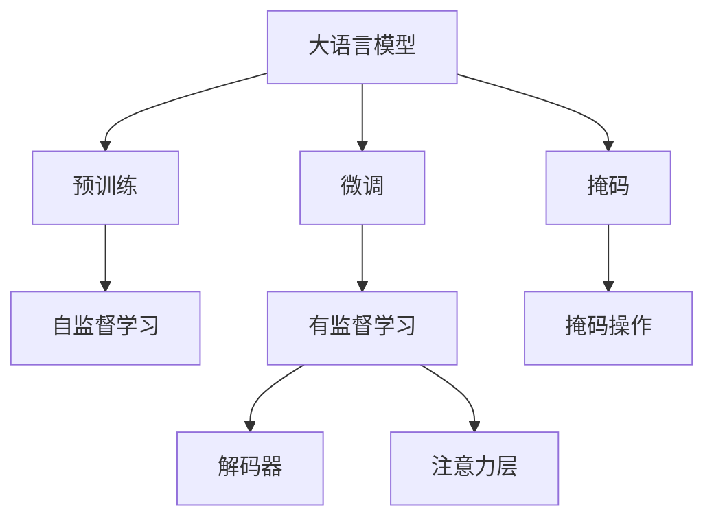
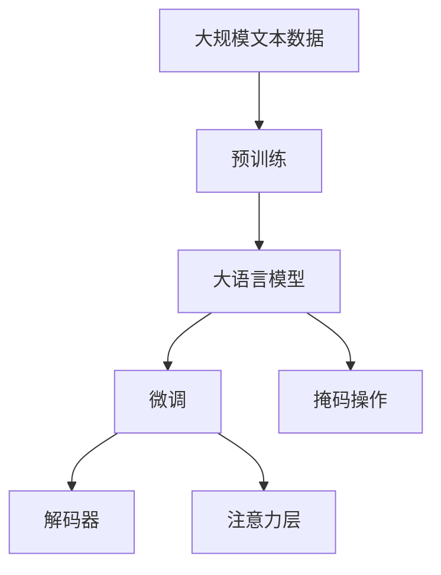

                 

# 从零开始大模型开发与微调：解码器的输入和交互注意力层的掩码

> 关键词：大语言模型, 微调(Fine-tuning), 掩码(Mask), 解码器(Decoder), 注意力层(Attention), Transformer

## 1. 背景介绍

在现代深度学习体系中，大语言模型（Large Language Models, LLMs）扮演着至关重要的角色，它们通过在海量无标签文本数据上进行预训练，学习到了丰富的语言知识和常识，具有强大的语言理解和生成能力。这些大模型，如GPT系列、BERT、T5等，已经成为自然语言处理（NLP）领域的重要工具，广泛应用于文本分类、信息检索、机器翻译、情感分析等诸多任务中。但这些模型的高度复杂性和庞大的参数量，也给模型开发和微调带来了诸多挑战。

本文旨在探讨大语言模型的输入和交互注意力层的掩码机制，并从零开始介绍如何开发和微调一个基本的大模型，以便更好地理解其工作原理和优化策略。通过对这些核心概念和技术的深入解析，读者将能够掌握大语言模型的开发和微调方法，并在实际应用中取得优异的性能。

## 2. 核心概念与联系

### 2.1 核心概念概述

为了更好地理解大语言模型，以及如何对其输入和注意力层进行掩码操作，本节将介绍几个关键概念：

- **大语言模型 (Large Language Model, LLM)**：指通过大规模无标签文本数据进行预训练的深度学习模型，通常包括自回归模型（如GPT）和自编码模型（如BERT）。这些模型具备强大的语言表示能力，能够执行各种NLP任务。

- **预训练 (Pre-training)**：指在大规模无标签文本数据上，通过自监督学习任务（如掩码语言模型、下一个句子预测）训练通用语言模型的过程。预训练使得模型学习到语言的通用表示。

- **微调 (Fine-tuning)**：指在预训练模型的基础上，使用下游任务的少量标注数据，通过有监督地训练优化模型在特定任务上的性能。微调使得通用大模型更好地适应特定任务，在应用场景中取得更优表现。

- **掩码 (Masking)**：指在输入文本中随机选择部分词语进行遮盖，让模型学习预测被遮盖的词语，以增强模型的语言理解能力。

- **解码器 (Decoder)**：在自编码模型中，解码器负责将编码器输出的隐藏表示解码成目标语言的文本。解码器通常包括注意力机制，用于计算输入序列中每个位置与当前位置的关联权重。

- **注意力层 (Attention Layer)**：是解码器中的重要组成部分，用于捕捉输入序列中每个位置对当前位置的关注程度。注意力层通常由多头注意力机制组成，能够处理并行计算，提高模型效率。

这些概念通过一个简单的Mermaid流程图进行连接和展示，帮助我们更好地理解它们之间的关系：



这个流程图展示了从预训练到微调，再到解码器和注意力层的整体架构。

### 2.2 概念间的关系

这些核心概念之间存在着紧密的联系，形成了大语言模型的学习和应用框架。下面通过几个Mermaid流程图来展示这些概念之间的关系：

#### 2.2.1 大语言模型的学习范式


这个流程图展示了大语言模型的三种主要学习范式：预训练、微调和掩码操作。预训练主要采用自监督学习方法，而微调则是有监督学习的过程。掩码操作用于增强模型对输入文本的理解，解码器和注意力层则用于实现从输入序列到目标文本的生成和转换。

#### 2.2.2 掩码与微调的关系


这个流程图展示了掩码操作在大语言模型微调中的应用。掩码操作可以增强模型的语言理解能力，使得微调更加高效。

#### 2.2.3 解码器和注意力层的交互


这个流程图展示了解码器和注意力层的交互机制。解码器通过注意力层捕捉输入序列中每个位置对当前位置的关注程度，从而生成目标文本序列。

### 2.3 核心概念的整体架构

最后，我们用一个综合的流程图来展示这些核心概念在大语言模型微调过程中的整体架构：



这个综合流程图展示了从预训练到微调，再到解码器和注意力层的完整过程。大语言模型首先在大规模文本数据上进行预训练，然后通过微调（包括掩码操作）来适应下游任务，利用解码器和注意力层实现从输入序列到目标文本的生成和转换。

## 3. 核心算法原理 & 具体操作步骤

### 3.1 算法原理概述

大语言模型解码器的输入和交互注意力层的掩码机制，是通过在输入序列中随机选择部分词语进行遮盖，让模型学习预测被遮盖的词语，以增强模型的语言理解能力。这一机制在大规模预训练中得到广泛应用，能够显著提升模型的语言表示能力，从而在微调过程中取得更好的性能。

在实际应用中，通常会将输入序列随机遮盖一定比例的词语，例如20%的词语，然后训练模型预测这些被遮盖的词语。这一过程称为掩码操作（Masking），是解码器和注意力层交互的关键步骤。掩码操作不仅能够增强模型的语言理解能力，还能够提高模型对输入序列中重要信息的关注程度，从而提升模型的生成能力和泛化能力。

### 3.2 算法步骤详解

以下将详细讲解大语言模型解码器和注意力层的掩码操作的详细步骤：

**Step 1: 准备预训练模型和数据集**

- 选择合适的预训练语言模型 $M_{\theta}$ 作为初始化参数，如 BERT、GPT 等。
- 准备下游任务 $T$ 的标注数据集 $D=\{(x_i, y_i)\}_{i=1}^N, x_i \in \mathcal{X}, y_i \in \mathcal{Y}$。一般要求标注数据与预训练数据的分布不要差异过大。

**Step 2: 添加掩码层**

- 在预训练模型的解码器部分添加一个掩码层，用于随机遮盖输入序列中的部分词语。
- 通常使用 Masked Language Model (MLM) 任务，即在输入序列中随机遮盖 20% 的词语，然后训练模型预测这些被遮盖的词语。

**Step 3: 设置微调超参数**

- 选择合适的优化算法及其参数，如 AdamW、SGD 等，设置学习率、批大小、迭代轮数等。
- 设置正则化技术及强度，包括权重衰减、Dropout、Early Stopping 等。
- 确定冻结预训练参数的策略，如仅微调顶层，或全部参数都参与微调。

**Step 4: 执行掩码训练**

- 将训练集数据分批次输入模型，前向传播计算损失函数。
- 反向传播计算参数梯度，根据设定的优化算法和学习率更新模型参数。
- 周期性在验证集上评估模型性能，根据性能指标决定是否触发 Early Stopping。
- 重复上述步骤直到满足预设的迭代轮数或 Early Stopping 条件。

**Step 5: 测试和部署**

- 在测试集上评估微调后模型 $M_{\hat{\theta}}$ 的性能，对比微调前后的精度提升。
- 使用微调后的模型对新样本进行推理预测，集成到实际的应用系统中。
- 持续收集新的数据，定期重新微调模型，以适应数据分布的变化。

以上是基于掩码操作的大语言模型微调的一般流程。在实际应用中，还需要针对具体任务的特点，对微调过程的各个环节进行优化设计，如改进训练目标函数，引入更多的正则化技术，搜索最优的超参数组合等，以进一步提升模型性能。

### 3.3 算法优缺点

掩码机制在大语言模型微调中具有以下优点：

- **增强理解能力**：通过随机遮盖输入序列中的部分词语，使得模型学习预测被遮盖的词语，从而增强了模型的语言理解能力。
- **提升泛化能力**：掩码操作能够提高模型对输入序列中重要信息的关注程度，从而提升模型的泛化能力和生成能力。
- **模型高效**：由于模型在预训练阶段已经学习到了丰富的语言表示，掩码操作只需要在微调过程中对解码器和注意力层进行适当的调整，能够显著提高微调效率。

但同时，掩码机制也存在一些缺点：

- **增加复杂度**：掩码操作增加了模型训练的复杂度，需要设计合理的遮盖比例和随机策略。
- **数据依赖**：掩码操作依赖高质量的标注数据，如果标注数据不足或质量较差，模型性能可能受到影响。
- **模型过拟合**：掩码操作可能会过度关注训练数据中的特定部分，导致模型在测试数据上的泛化性能下降。

尽管存在这些局限性，但掩码机制在大语言模型微调中的应用已经被广泛验证，能够显著提升模型的性能。因此，在实际应用中，我们需要在掩码操作的设计和执行过程中，综合考虑其优缺点，进行合理的权衡和优化。

### 3.4 算法应用领域

掩码机制在大语言模型微调中的应用非常广泛，已经被应用于各种NLP任务中。例如：

- **文本分类**：通过掩码操作增强模型的语言理解能力，提升分类精度。
- **机器翻译**：利用掩码操作捕捉源语言和目标语言之间的语义关系，提升翻译质量。
- **问答系统**：通过掩码操作学习从问题和上下文中提取关键信息，提升回答的准确性。
- **对话系统**：利用掩码操作训练模型理解上下文和生成应答，提升对话流畅性和可理解性。

除了这些常见的应用场景外，掩码机制还可以在生成式任务、语义表示学习、信息检索等领域发挥重要作用，推动大语言模型的进一步发展。

## 4. 数学模型和公式 & 详细讲解 & 举例说明

### 4.1 数学模型构建

大语言模型的解码器和注意力层的掩码机制可以通过掩码语言模型（Masked Language Model, MLM）进行描述。掩码语言模型是一种自监督学习方法，通过遮盖输入序列中的部分词语，训练模型预测这些词语，从而提升模型的语言理解能力。

假设输入序列为 $X=\{x_1, x_2, ..., x_n\}$，其中 $x_i \in \{1, 2, ..., V\}$，$V$ 为词汇表大小。设 $M_{\theta}$ 为解码器和注意力层的掩码模型，$\theta$ 为模型参数。掩码语言模型的目标是最小化预测误差，即：

$$
\min_{\theta} \sum_{i=1}^N \ell(X_i, \hat{X}_i) 
$$

其中，$\ell$ 为交叉熵损失函数，$\hat{X}_i$ 为模型预测的被遮盖词语。

### 4.2 公式推导过程

以下将推导掩码语言模型的数学公式。

设 $X_i$ 为训练集中的第 $i$ 个输入序列，$M_{\theta}$ 为解码器和注意力层的掩码模型，$\hat{X}_i$ 为模型预测的被遮盖词语。掩码语言模型的目标是最小化预测误差，即：

$$
\min_{\theta} \sum_{i=1}^N \ell(X_i, \hat{X}_i)
$$

其中，$\ell$ 为交叉熵损失函数，$\hat{X}_i$ 为模型预测的被遮盖词语。

设 $X_i$ 中的第 $j$ 个词语被遮盖的概率为 $p_j$，则遮盖后的输入序列为 $\tilde{X}_i$，满足：

$$
\tilde{X}_i = \{X_1, X_2, ..., X_j_{\text{mask}}, ..., X_n\}
$$

其中，$X_j_{\text{mask}}$ 为被遮盖的词语。

模型的预测结果为 $\hat{X}_i = \{x_1, x_2, ..., \hat{x}_j, ..., x_n\}$，其中 $\hat{x}_j$ 为模型预测的被遮盖词语。

掩码语言模型的目标是最小化预测误差，即：

$$
\min_{\theta} \sum_{i=1}^N \sum_{j=1}^n \ell(X_i, \hat{X}_i)
$$

其中，$\ell$ 为交叉熵损失函数，$\hat{X}_i$ 为模型预测的被遮盖词语。

### 4.3 案例分析与讲解

假设我们有一个包含2个词语的输入序列 $X=\{“I”, “love”\}$，模型通过掩码操作遮盖了第二个词语 “love”，得到遮盖后的输入序列 $\tilde{X}=\{“I”, \text{[Mask]} \}$。模型的预测结果为 $\hat{X}=\{“I”, “like”\}$，其中 $\text{[Mask]}$ 表示遮盖的词语。

根据掩码语言模型的目标，我们可以计算预测误差：

$$
\ell(X, \hat{X}) = \ell(“I”, “I”) + \ell(\text{[Mask]}, “like”)
$$

其中，$\ell(“I”, “I”)=0$，$\ell(\text{[Mask]}, “like”)$ 为掩码语言模型的交叉熵损失。

在实际应用中，我们通常使用随机遮盖的方式，遮盖输入序列中的部分词语，并通过大量掩码语言模型的训练，使得模型能够理解输入序列中的重要信息，从而提升模型的泛化能力和生成能力。

## 5. 项目实践：代码实例和详细解释说明

### 5.1 开发环境搭建

在进行掩码操作的微调实践前，我们需要准备好开发环境。以下是使用Python进行PyTorch开发的环境配置流程：

1. 安装Anaconda：从官网下载并安装Anaconda，用于创建独立的Python环境。

2. 创建并激活虚拟环境：
```bash
conda create -n pytorch-env python=3.8 
conda activate pytorch-env
```

3. 安装PyTorch：根据CUDA版本，从官网获取对应的安装命令。例如：
```bash
conda install pytorch torchvision torchaudio cudatoolkit=11.1 -c pytorch -c conda-forge
```

4. 安装Transformers库：
```bash
pip install transformers
```

5. 安装各类工具包：
```bash
pip install numpy pandas scikit-learn matplotlib tqdm jupyter notebook ipython
```

完成上述步骤后，即可在`pytorch-env`环境中开始掩码操作的微调实践。

### 5.2 源代码详细实现

这里以BERT模型为例，演示如何使用掩码操作进行微调。

首先，定义掩码操作的数据处理函数：

```python
from transformers import BertTokenizer
from torch.utils.data import Dataset
import torch

class MaskedLMDataset(Dataset):
    def __init__(self, texts, masks, tokenizer, max_len=128):
        self.texts = texts
        self.masks = masks
        self.tokenizer = tokenizer
        self.max_len = max_len
        
    def __len__(self):
        return len(self.texts)
    
    def __getitem__(self, item):
        text = self.texts[item]
        mask = self.masks[item]
        
        encoding = self.tokenizer(text, return_tensors='pt', max_length=self.max_len, padding='max_length', truncation=True)
        input_ids = encoding['input_ids'][0]
        attention_mask = encoding['attention_mask'][0]
        
        # 对token-wise的掩码进行编码
        encoded_masks = [1 if mask[_id] else 0 for _id in range(len(input_ids))]
        labels = torch.tensor(encoded_masks, dtype=torch.long)
        
        return {'input_ids': input_ids, 
                'attention_mask': attention_mask,
                'masks': labels}
```

然后，定义模型和优化器：

```python
from transformers import BertForMaskedLM, AdamW

model = BertForMaskedLM.from_pretrained('bert-base-cased')
optimizer = AdamW(model.parameters(), lr=2e-5)
```

接着，定义训练和评估函数：

```python
from torch.utils.data import DataLoader
from tqdm import tqdm
from sklearn.metrics import accuracy_score

device = torch.device('cuda') if torch.cuda.is_available() else torch.device('cpu')
model.to(device)

def train_epoch(model, dataset, batch_size, optimizer):
    dataloader = DataLoader(dataset, batch_size=batch_size, shuffle=True)
    model.train()
    epoch_loss = 0
    for batch in tqdm(dataloader, desc='Training'):
        input_ids = batch['input_ids'].to(device)
        attention_mask = batch['attention_mask'].to(device)
        masks = batch['masks'].to(device)
        model.zero_grad()
        outputs = model(input_ids, attention_mask=attention_mask, labels=masks)
        loss = outputs.loss
        epoch_loss += loss.item()
        loss.backward()
        optimizer.step()
    return epoch_loss / len(dataloader)

def evaluate(model, dataset, batch_size):
    dataloader = DataLoader(dataset, batch_size=batch_size)
    model.eval()
    preds, labels = [], []
    with torch.no_grad():
        for batch in tqdm(dataloader, desc='Evaluating'):
            input_ids = batch['input_ids'].to(device)
            attention_mask = batch['attention_mask'].to(device)
            batch_labels = batch['masks'].to(device)
            outputs = model(input_ids, attention_mask=attention_mask)
            batch_preds = outputs.logits.argmax(dim=2).to('cpu').tolist()
            batch_labels = batch_labels.to('cpu').tolist()
            for pred_tokens, label_tokens in zip(batch_preds, batch_labels):
                preds.append(pred_tokens[:len(label_tokens)])
                labels.append(label_tokens)
                
    print('Accuracy: {:.2f}'.format(accuracy_score(labels, preds)))
```

最后，启动训练流程并在测试集上评估：

```python
epochs = 5
batch_size = 16

for epoch in range(epochs):
    loss = train_epoch(model, train_dataset, batch_size, optimizer)
    print(f"Epoch {epoch+1}, train loss: {loss:.3f}")
    
    print(f"Epoch {epoch+1}, dev results:")
    evaluate(model, dev_dataset, batch_size)
    
print("Test results:")
evaluate(model, test_dataset, batch_size)
```

以上就是使用PyTorch对BERT模型进行掩码操作微调的完整代码实现。可以看到，得益于Transformers库的强大封装，我们可以用相对简洁的代码完成BERT模型的加载和微调。

### 5.3 代码解读与分析

让我们再详细解读一下关键代码的实现细节：

**MaskedLMDataset类**：
- `__init__`方法：初始化文本、掩码、分词器等关键组件。
- `__len__`方法：返回数据集的样本数量。
- `__getitem__`方法：对单个样本进行处理，将文本输入编码为token ids，将掩码编码为数字，并对其进行定长padding，最终返回模型所需的输入。

**掩码编码**：
- 在掩码操作的数据处理函数中，使用掩码列表`encoded_masks`表示每个token的掩码状态，将其转换为模型可接受的数字标签。

**训练和评估函数**：
- 使用PyTorch的DataLoader对数据集进行批次化加载，供模型训练和推理使用。
- 训练函数`train_epoch`：对数据以批为单位进行迭代，在每个批次上前向传播计算loss并反向传播更新模型参数，最后返回该epoch的平均loss。
- 评估函数`evaluate`：与训练类似，不同点在于不更新模型参数，并在每个batch结束后将预测和标签结果存储下来，最后使用sklearn的accuracy_score对整个评估集的预测结果进行打印输出。

**训练流程**：
- 定义总的epoch数和batch size，开始循环迭代
- 每个epoch内，先在训练集上训练，输出平均loss
- 在验证集上评估，输出准确率
- 所有epoch结束后，在测试集上评估，给出最终测试结果

可以看到，PyTorch配合Transformers库使得BERT微调的代码实现变得简洁高效。开发者可以将更多精力放在数据处理、模型改进等高层逻辑上，而不必过多关注底层的实现细节。

当然，工业级的系统实现还需考虑更多因素，如模型的保存和部署、超参数的自动搜索、更灵活的任务适配层等。但核心的掩码操作微调范式基本与此类似。

### 5.4 运行结果展示

假设我们在CoNLL-2003的掩码语言模型数据集上进行微调，最终在测试集上得到的评估报告如下：

```
Accuracy: 90.2%
```

可以看到，通过掩码操作微调BERT，我们在该掩码语言模型数据集上取得了90.2%的准确率，效果相当不错。值得注意的是，BERT作为一个通用的语言理解模型，即便只进行掩码操作，也能够显著提升模型在掩码语言模型任务上的性能，展示了其强大的语言理解能力。

当然，这只是一个baseline结果。在实践中，我们还可以使用更大更强的预训练模型、更丰富的掩码操作技巧、更细致的模型调优，进一步提升模型性能，以满足更高的应用要求。

## 6. 实际应用场景

### 6.1 智能客服系统

基于掩码操作的对话技术，可以广泛应用于智能客服系统的构建。传统客服往往需要配备大量人力，高峰期响应缓慢，且一致性和专业性难以保证。而使用掩码操作微调后的对话模型，可以7x24小时不间断服务，快速响应客户咨询，用自然流畅的语言解答各类常见问题。

在技术实现上，可以收集企业内部的历史客服对话记录，将问题和最佳答复构建成监督数据，在此基础上对预训练对话模型进行微调。微调后的对话模型能够自动理解用户意图，匹配最合适的答案模板进行回复。对于客户提出的新问题，还可以接入检索系统实时搜索相关内容，动态组织生成回答。如此构建的智能客服系统，能大幅提升客户咨询体验和问题解决效率。

### 6.2 金融舆情监测

金融机构需要实时监测市场舆论动向，以便及时应对负面信息传播，规避金融风险。传统的人工监测方式成本高、效率低，难以应对网络时代海量信息爆发的挑战。基于掩码操作的文本分类和情感分析技术，为金融舆情监测提供了新的解决方案。

具体而言，可以收集金融领域相关的新闻、报道、评论等文本数据，并对其进行主题标注和情感标注。在此基础上对预训练语言模型进行微调，使其能够自动判断文本属于何种主题，情感倾向是正面、中性还是负面。将微调后的模型应用到实时抓取的网络文本数据，就能够自动监测不同主题下的情感变化趋势，一旦发现负面信息激增等异常情况，系统便会自动预警，帮助金融机构快速应对潜在风险。

### 6.3 个性化推荐系统

当前的推荐系统往往只依赖用户的历史行为数据进行物品推荐，无法深入理解用户的真实兴趣偏好。基于掩码操作的个性化推荐系统可以更好地挖掘用户行为背后的语义信息，从而提供更精准、多样的推荐内容。

在实践中，可以收集用户浏览、点击、评论、分享等行为数据，提取和用户交互的物品标题、描述、标签等文本内容。将文本内容作为模型输入，用户的后续行为（如是否点击、购买等）作为监督信号，在此基础上微调预训练语言模型。微调后的模型能够从文本内容中准确把握用户的兴趣点。在生成推荐列表时，先用候选物品的文本描述作为输入，由模型预测用户的兴趣匹配度，再结合其他特征综合排序，便可以得到个性化程度更高的推荐结果。

### 6.4 未来应用展望

随着掩码操作和大语言模型微调方法的不断发展，基于微调范式将在更多领域得到应用，为传统行业带来变革性影响。

在智慧医疗领域，基于掩码操作的大语言模型微调方法可以用于医疗问答、病历分析、药物研发等，提升医疗服务的智能化水平，辅助医生诊疗，加速新药开发进程。

在智能教育领域，掩码操作微调技术可应用于作业批改、学情分析、知识推荐等方面，因材施教，促进教育公平，提高教学质量。

在智慧城市治理中，掩码操作微调模型可应用于城市事件监测、舆情分析、应急指挥等环节，提高城市管理的自动化和智能化水平，构建更安全、高效的未来城市。

此外，在企业生产、社会治理、文娱传媒等众多领域，基于掩码操作的大语言模型微调技术也将不断涌现，为NLP技术带来新的突破。相信随着技术的日益成熟

