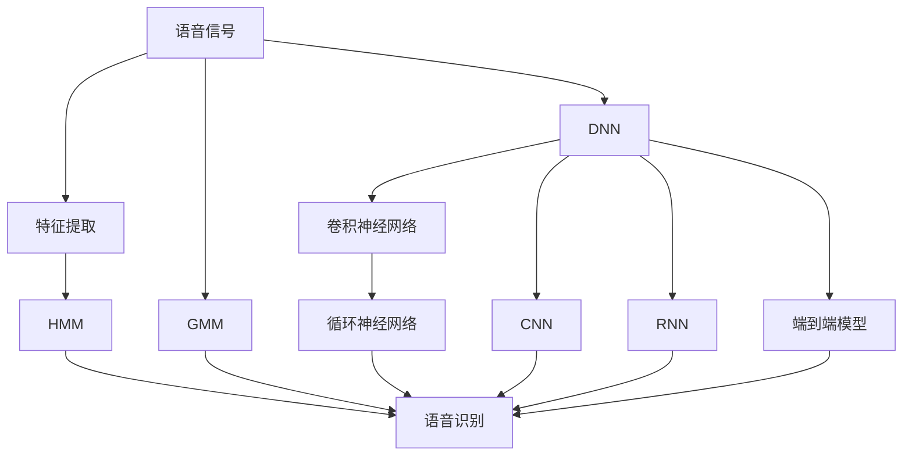
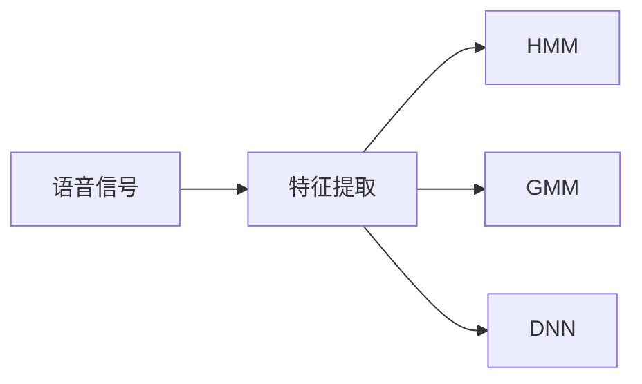
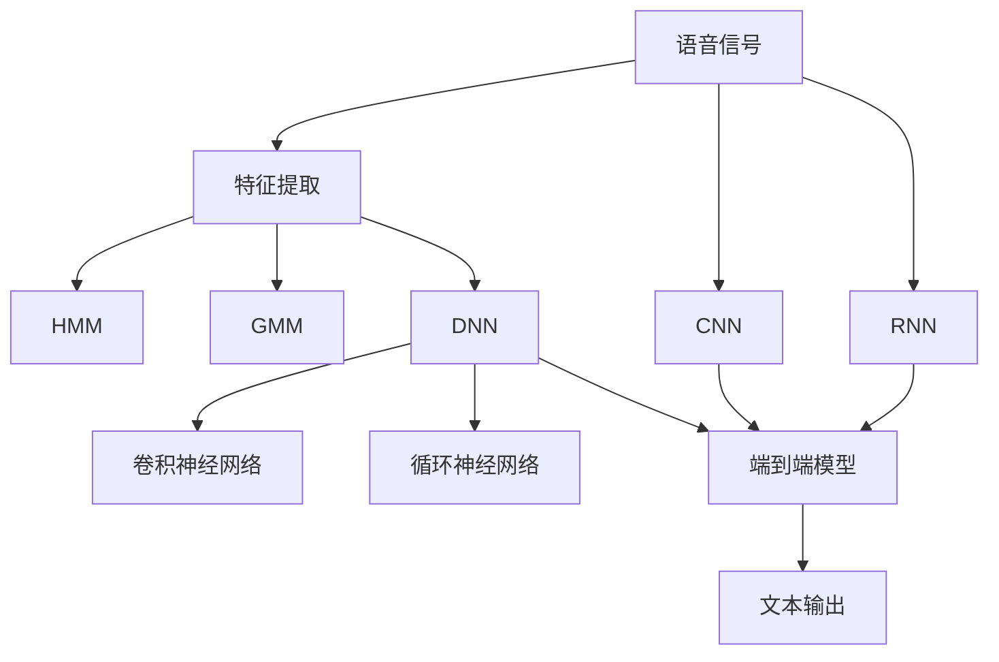

                 

# 从高斯混合模型到纯神经网络的语音识别进化

## 1. 背景介绍

语音识别（Automatic Speech Recognition, ASR）是人工智能领域的核心应用之一，旨在将人类语言转化为计算机可理解的形式。语音识别的历史悠久，从最初的基于模板匹配的方法，到后来的隐马尔可夫模型（Hidden Markov Model, HMM）、高斯混合模型（Gaussian Mixture Model, GMM），再到如今的深度神经网络（Deep Neural Network, DNN），展现了技术演进的飞速步伐。本文将深入探讨这一演进的脉络，并展望未来。

### 1.1 语音识别的历史背景

语音识别的历史可以追溯到20世纪50年代，最早的模型基于模板匹配技术，通过将语音信号与事先构建的模板进行匹配，以识别出对应的单词或音节。随着技术的进步，逐步引入了基于统计学的模型，如隐马尔可夫模型，以及深度学习模型，如卷积神经网络（Convolutional Neural Network, CNN）和循环神经网络（Recurrent Neural Network, RNN）。

1977年，Jonathan Epstein和Mark H. Gold研究提出了隐马尔可夫模型，用于自动语音识别（Automatic Speech Recognition, ASR），开启了模型基础框架的篇章。1997年，Geoffrey Hinton等人在Nature上发表了《Weighted Multiple Local Context Trees for Speech Recognition》，引入了深度学习模型，特别是卷积神经网络，显著提高了语音识别的准确性。2006年，Geoffrey Hinton等人提出了深度信念网络（Deep Belief Network, DBN），用于语音识别任务的特征提取和分类。2009年，Diederik P.Williams等人在NIPS上提出了深度卷积神经网络（Deep Convolutional Neural Network, DCNN），用于语音特征提取和分类，取得了当时的最佳性能。

### 1.2 语音识别技术的现状

当前，语音识别技术已经非常成熟，广泛应用于智能助手、语音搜索、语音翻译等多个领域。主流的语音识别技术基于深度神经网络，特别是卷积神经网络和循环神经网络的结合。其中，深度神经网络在语音特征提取和分类中，已经超越了传统的隐马尔可夫模型和高斯混合模型，成为语音识别的主要驱动力。

深度神经网络之所以能够胜出，主要有以下几个原因：

1. **自动特征提取**：深度神经网络可以自动从原始语音信号中提取特征，无需手动设计和选取特征。这使得神经网络在特征提取上更加灵活和高效。

2. **强大的非线性表达能力**：深度神经网络拥有多层次的非线性结构，能够捕捉输入数据的复杂非线性关系，从而在分类任务上获得更好的性能。

3. **端到端的处理能力**：深度神经网络能够实现端到端的自动语音识别，从原始语音信号到最终的文字输出，无需中间的人工处理环节，提升了整个系统的处理效率。

4. **对抗训练和增强**：深度神经网络可以通过对抗训练和数据增强技术，提高模型鲁棒性和泛化能力，进一步提升识别精度。

## 2. 核心概念与联系

### 2.1 核心概念概述

本节将介绍几个与语音识别密切相关的核心概念：

- **语音识别**：将语音信号转化为计算机可理解的文本或命令的过程。
- **隐马尔可夫模型（HMM）**：一种基于统计学的模型，用于描述观察序列和隐藏状态之间的关系。
- **高斯混合模型（GMM）**：一种基于概率统计的模型，用于描述多个高斯分布的混合，常用于语音信号的概率建模。
- **深度神经网络（DNN）**：一种基于神经元的非线性模型，用于复杂数据的特征提取和分类。
- **卷积神经网络（CNN）**：一种前馈神经网络，通过卷积和池化操作提取局部特征，适用于处理空间数据。
- **循环神经网络（RNN）**：一种能够处理序列数据的神经网络，具有记忆能力，适用于语音信号的时间序列分析。
- **端到端（End-to-End）模型**：一种可以直接从输入到输出的全模型，避免了中间的人工处理环节。

这些概念之间的逻辑关系可以通过以下Mermaid流程图来展示：



这个流程图展示了语音识别的核心概念及其之间的关系：

1. 语音信号通过特征提取模块转化为特征向量，用于后续建模。
2. 特征向量可以用于训练HMM和GMM等统计模型。
3. 特征向量也可以作为输入，直接送入DNN进行分类。
4. DNN通过卷积神经网络和循环神经网络的结合，可以实现更高效的特征提取和分类。
5. 端到端模型则直接从语音信号到文本输出，无需中间的人工处理环节。

### 2.2 概念间的关系

这些核心概念之间存在着紧密的联系，形成了语音识别系统的完整架构。下面是几个关键的概念关系图：

#### 2.2.1 特征提取与建模



这个图展示了特征提取与建模的基本流程。语音信号先经过特征提取，然后可以用于训练HMM和GMM等统计模型，或者直接作为输入，用于训练深度神经网络。

#### 2.2.2 深度神经网络的结构


这个图展示了深度神经网络的基本结构。卷积层和池化层用于提取局部特征，RNN层用于处理时间序列数据，输出层用于分类或回归任务。

#### 2.2.3 端到端模型的结构


这个图展示了端到端模型的基本结构。编码器用于将语音信号转化为特征表示，解码器用于将特征表示转化为文本输出。

### 2.3 核心概念的整体架构

最后，我们用一个综合的流程图来展示这些核心概念在大语言模型微调过程中的整体架构：



这个综合流程图展示了从语音信号到文本输出的完整流程。语音信号通过特征提取转化为特征向量，用于训练HMM和GMM等统计模型，或者直接作为输入，用于训练深度神经网络。DNN通过卷积神经网络和循环神经网络的结合，可以实现更高效的特征提取和分类。最终，端到端模型直接从语音信号到文本输出，无需中间的人工处理环节。

## 3. 核心算法原理 & 具体操作步骤

### 3.1 算法原理概述

语音识别系统的主要任务是将语音信号转化为文本或命令。传统的语音识别系统基于隐马尔可夫模型（HMM）和高斯混合模型（GMM），而现代语音识别系统则主要依赖于深度神经网络（DNN），特别是卷积神经网络（CNN）和循环神经网络（RNN）的结合。

#### 3.1.1 隐马尔可夫模型（HMM）

隐马尔可夫模型是一种基于统计学的模型，用于描述观察序列和隐藏状态之间的关系。在语音识别中，观察序列是语音信号的特征向量，隐藏状态是声学模型和语言模型的参数。

隐马尔可夫模型的核心思想是通过学习观察序列和隐藏状态之间的概率分布，从而实现从观察序列到隐藏状态的预测。具体来说，HMM包含以下几个关键步骤：

1. 初始化模型参数：包括初始概率和状态转移概率。
2. 训练模型：通过最大化似然函数，学习模型参数。
3. 解码：根据模型参数，预测最可能的隐藏状态序列。

#### 3.1.2 高斯混合模型（GMM）

高斯混合模型是一种基于概率统计的模型，用于描述多个高斯分布的混合。在语音识别中，GMM常用于建模语音信号的概率分布。

GMM的核心思想是通过学习多个高斯分布的参数，从而实现对语音信号的概率建模。具体来说，GMM包含以下几个关键步骤：

1. 初始化模型参数：包括均值、协方差和混合权重。
2. 训练模型：通过最大化似然函数，学习模型参数。
3. 解码：根据模型参数，预测最可能的高斯分布序列。

#### 3.1.3 深度神经网络（DNN）

深度神经网络是一种基于神经元的非线性模型，用于复杂数据的特征提取和分类。在语音识别中，DNN通常用于从原始语音信号中提取特征，并用于分类或回归任务。

DNN的核心思想是通过多层非线性变换，提取输入数据的高级特征。具体来说，DNN包含以下几个关键步骤：

1. 初始化模型参数：包括权重和偏置。
2. 前向传播：通过多层非线性变换，计算输出。
3. 反向传播：通过梯度下降，更新模型参数。
4. 训练：通过损失函数，优化模型参数。

### 3.2 算法步骤详解

#### 3.2.1 隐马尔可夫模型的训练步骤

1. **初始化模型参数**：包括初始概率和状态转移概率。初始概率通常设置为均匀分布，状态转移概率可以通过语音信号的统计特征来学习。

2. **训练模型**：通过最大化似然函数，学习模型参数。具体来说，对于每个语音信号的特征向量，计算其最可能的状态序列，然后对所有特征向量进行平均，计算整个语音信号的最可能的状态序列。

3. **解码**：根据模型参数，预测最可能的隐藏状态序列。具体来说，对于每个语音信号的特征向量，使用Viterbi算法计算其最可能的状态序列。

#### 3.2.2 高斯混合模型的训练步骤

1. **初始化模型参数**：包括均值、协方差和混合权重。均值和协方差可以通过语音信号的统计特征来学习，混合权重通常设置为均匀分布。

2. **训练模型**：通过最大化似然函数，学习模型参数。具体来说，对于每个语音信号的特征向量，计算其最可能的高斯分布序列，然后对所有特征向量进行平均，计算整个语音信号的最可能的高斯分布序列。

3. **解码**：根据模型参数，预测最可能的高斯分布序列。具体来说，对于每个语音信号的特征向量，使用EM算法计算其最可能的高斯分布序列。

#### 3.2.3 深度神经网络的训练步骤

1. **初始化模型参数**：包括权重和偏置。权重通常从均值为0，标准差为0.01的随机分布中采样，偏置通常初始化为0。

2. **前向传播**：通过多层非线性变换，计算输出。具体来说，对于每个输入数据，从输入层开始，逐层进行非线性变换，最终得到输出。

3. **反向传播**：通过梯度下降，更新模型参数。具体来说，对于每个输出，计算其相对于输入的梯度，然后通过链式法则计算每个权重和偏置的梯度，使用梯度下降方法更新参数。

4. **训练**：通过损失函数，优化模型参数。具体来说，对于每个训练样本，计算其预测输出与真实输出的损失，然后通过梯度下降方法最小化损失函数，更新模型参数。

### 3.3 算法优缺点

#### 3.3.1 隐马尔可夫模型的优缺点

**优点**：

1. 简单高效：HMM模型结构简单，易于训练和解码。
2. 适用于复杂模型：HMM模型可以描述复杂的状态转移关系，适用于高维数据。

**缺点**：

1. 需要大量标注数据：HMM模型需要大量标注数据进行训练，否则容易过拟合。
2. 难以处理长期依赖：HMM模型难以处理长期依赖，容易出现信息丢失。

#### 3.3.2 高斯混合模型的优缺点

**优点**：

1. 可以描述复杂分布：GMM模型可以描述复杂的概率分布，适用于高维数据。
2. 可以处理长期依赖：GMM模型可以处理长期依赖，避免了信息丢失。

**缺点**：

1. 需要大量标注数据：GMM模型需要大量标注数据进行训练，否则容易过拟合。
2. 计算复杂度高：GMM模型计算复杂度高，训练速度慢。

#### 3.3.3 深度神经网络的优缺点

**优点**：

1. 可以处理高维数据：DNN模型可以处理高维数据，适用于语音信号等复杂数据。
2. 可以处理长期依赖：DNN模型可以处理长期依赖，避免了信息丢失。
3. 可以自动学习特征：DNN模型可以自动学习特征，无需手动设计和选取特征。

**缺点**：

1. 需要大量标注数据：DNN模型需要大量标注数据进行训练，否则容易过拟合。
2. 计算复杂度高：DNN模型计算复杂度高，训练速度慢。

### 3.4 算法应用领域

语音识别技术已经在多个领域得到了广泛的应用，包括：

1. **语音助手**：如Amazon的Alexa、Google的Assistant等，通过语音识别实现智能对话。
2. **语音搜索**：如Google的语音搜索，通过语音识别实现实时搜索。
3. **语音翻译**：如Google Translate，通过语音识别和机器翻译实现跨语言交流。
4. **智能家居**：通过语音识别控制智能家电，实现语音控制。
5. **医疗诊断**：通过语音识别记录医疗信息，实现智能诊断。
6. **教育辅助**：通过语音识别进行语音评测，辅助教育培训。

除了上述这些经典应用外，语音识别技术还在不断发展，未来可能拓展到更多场景中，如智能交通、智能制造等，为各行各业带来变革性影响。

## 4. 数学模型和公式 & 详细讲解 & 举例说明

### 4.1 数学模型构建

在语音识别中，常见的数学模型包括隐马尔可夫模型（HMM）、高斯混合模型（GMM）和深度神经网络（DNN）。以下是这些模型的数学模型构建：

#### 4.1.1 隐马尔可夫模型的数学模型

隐马尔可夫模型由观察序列 $O=\{X_1, X_2, ..., X_T\}$ 和隐藏状态序列 $H=\{A_1, A_2, ..., A_T\}$ 构成，其中 $X_t$ 是时间 $t$ 的观察值，$A_t$ 是时间 $t$ 的隐藏状态。

模型的概率分布为：

$$
P(O, H) = \prod_{t=1}^{T} P(X_t|A_t)P(A_t|A_{t-1})
$$

其中 $P(X_t|A_t)$ 是观察序列 $X_t$ 在状态 $A_t$ 下的概率，$P(A_t|A_{t-1})$ 是状态 $A_t$ 在状态 $A_{t-1}$ 下的转移概率。

#### 4.1.2 高斯混合模型的数学模型

高斯混合模型由 $K$ 个高斯分布 $G_k$ 和混合权重 $\pi_k$ 构成，其中 $G_k$ 是第 $k$ 个高斯分布的概率密度函数，$\pi_k$ 是第 $k$ 个高斯分布的混合权重。

模型的概率分布为：

$$
P(X) = \sum_{k=1}^{K} \pi_k P(X|G_k)
$$

其中 $P(X|G_k)$ 是观察值 $X$ 在状态 $G_k$ 下的概率密度函数。

#### 4.1.3 深度神经网络的数学模型

深度神经网络由多个神经元层 $L_1, L_2, ..., L_L$ 和权重矩阵 $W_i$ 构成，其中 $W_i$ 是第 $i$ 层的权重矩阵。

模型的前向传播过程为：

$$
Z^{[l]} = g^{[l]}(W^{[l]} X^{[l-1]} + b^{[l]})
$$

其中 $g^{[l]}$ 是第 $l$ 层的激活函数，$X^{[l]}$ 是第 $l$ 层的输入，$Z^{[l]}$ 是第 $l$ 层的输出。

模型的损失函数通常为交叉熵损失函数，定义如下：

$$
L(y, \hat{y}) = -\frac{1}{N} \sum_{i=1}^{N} \sum_{j=1}^{C} y_{i,j} \log \hat{y}_{i,j}
$$

其中 $y$ 是真实标签，$\hat{y}$ 是预测标签，$C$ 是类别数，$N$ 是样本数。

### 4.2 公式推导过程

#### 4.2.1 隐马尔可夫模型的推导

隐马尔可夫模型的核心在于求解状态转移概率 $P(A_t|A_{t-1})$ 和观察值概率 $P(X_t|A_t)$。

1. **状态转移概率**：通过前向算法或后向算法，计算每个状态的概率。

2. **观察值概率**：通过前向算法或后向算法，计算每个观察值的概率。

3. **解码**：使用Viterbi算法或最大后验概率算法，计算最可能的状态序列。

#### 4.2.2 高斯混合模型的推导

高斯混合模型的核心在于求解每个高斯分布的参数 $\pi_k, \mu_k, \Sigma_k$。

1. **均值和协方差**：通过EM算法，求解每个高斯分布的均值和协方差。

2. **混合权重**：通过EM算法，求解每个高斯分布的混合权重。

3. **解码**：使用期望最大化算法，计算最可能的高斯分布序列。

#### 4.2.3 深度神经网络的推导

深度神经网络的核心在于求解权重矩阵 $W_i$ 和偏置向量 $b_i$。

1. **前向传播**：通过多层非线性变换，计算每个神经元的输出。

2. **反向传播**：通过梯度下降算法，更新权重矩阵和偏置向量。

3. **训练**：通过损失函数，优化权重矩阵和偏置向量。

### 4.3 案例分析与讲解

#### 4.3.1 隐马尔可夫模型的案例

假设我们有一个隐马尔可夫模型，用于识别二元数字的语音信号。模型的状态 $A$ 有三种可能：$0, 1, 2$，观察值 $X$ 有四种可能：$0, 1, 2, 3$。

通过训练，我们得到了状态转移概率 $P(A_t|A_{t-1})$ 和观察值概率 $P(X_t|A_t)$。假设 $P(0|0) = 0.5, P(1|0) = 0.2, P(2|0) = 0.3, P(0|1) = 0.1, P(1|1) = 0.4, P(2|1) = 0.5, P(0|2) = 0.2, P(1|2) = 0.6, P(2|2) = 0.2$，以及 $P(0|0) = 0.3, P(1|0) = 0.2, P(2|0) = 0.5, P(0|1) = 0.1, P(1|1) = 0.3, P(2|1) = 0.6, P(0|2) = 0.3, P(1|2) = 0.2, P(2|2) = 0.5$。

对于一个新的语音信号 $X = (0, 1, 1, 2, 1, 0, 0, 1, 2)$，我们使用Viterbi算法计算最可能的状态序列。具体步骤如下：

1. 初始化：$P(0|0) = 0.3, P(1|0) = 0.2, P(2|0) = 0.5, P(0|1) = 0.1, P(1|1) = 0.3, P(2|1) = 0.6, P(0|2) = 0.3, P(1|2) = 0.2, P(2|2) = 0.5$。

2. 前向算法：计算每个状态的概率。

3. 后向算法：计算每个观察值的概率。

4. Viterbi算法：计算最可能的状态序列。

#### 4.3.2 高斯混合模型的案例

假设我们有一个高斯混合模型，用于识别高斯分布的语音信号。模型包含三个高斯分布 $G_1, G_2, G_3$，每个高斯分布的均值和协方差分别为 $\mu_1 = (0.5, 0.5), \Sigma_1 = \begin{bmatrix} 0.1 & 0.2 \\ 0.2 & 0.4 \end{bmatrix}, \pi_1 = 0.4$，$\mu_2 = (1.5, 1.5), \Sigma_2 = \begin{bmatrix} 0.2 & 0.3 \\ 0.3 & 0.6 \end{bmatrix}, \pi_2 = 0.3$，$\mu_3 = (2.5, 2.5), \Sigma_3 = \begin{bmatrix} 0.3 & 0.4 \\ 0.4 & 0.8 \end{bmatrix}, \pi_3 = 0.3$。

对于一个新的语音信号 $X = (1.2, 1.3)$，我们使用EM算法计算最可能的高斯分布序列。具体步骤如下：

1. 初始化：$P(X|G_1) = \frac{1}{\sqrt{2\pi}} \exp\left(-\frac{(1.2-0.5)^2+(1.3-0.5)^2}{2(0.1^2+0.2^2)}\right) = 0.4$, $P(X|G_2) = \frac{1}{\sqrt{2\pi}} \exp\left(-\frac{(1.2-1.5)^2+(1.3-1.5)^2}{2(0.2^2+0.3^2)}\right) = 0.3$, $P(X|G_3) = \frac{1}{\sqrt{2\pi}} \exp\left(-\frac{(1.2-2.5)^2+(1.3-2.5)^2}{2(0.3^2+0.4^2)}\right) = 0.3$。

2. EM算法：计算每个高斯分布的参数。

3. 解码：使用期望最大化算法，计算最可能的高斯分布序列。

#### 4.3.3 深度神经网络的案例

假设我们有一个深度神经网络，用于识别手写数字的语音信号。网络包含两个卷积层和两个全连接层，卷积核大小为 $3 \times 3$，步幅为 $1$，激活函数为ReLU，全连接层的激活函数为Softmax。

对于一个新的语音信号 $X = (1.2, 1.3)$，我们使用前向传播和反向传播算法计算输出。具体步骤如下：

1. 卷积层：$Z^{[1]} = g^{[1]}(W^{[1]} X^{[0]} + b^{[1]})$。

2. 池化层：$Z^{[2]} = \max(Z^{[1]})$。

3. 全连接层：$Z^{[3]} = g^{[3]}(W^{[3]} Z^{[2]} + b^{[3]})$。

4. 输出层：$Z^{[4]} = g^{[4]}(W^{[4]} Z^{[3]} + b^{[4]})$。

5. 交叉熵损失函数：$L(y, \hat{y}) = -\frac{1}{N} \sum_{i=1}^{N} \sum_{j=1}^{C} y_{i,j} \log \hat{y}_{i,j}$。

## 5. 项目实践：代码实例和详细解释说明

### 5.1 开发环境搭建

在进行语音识别实践前，我们需要准备好开发环境。以下是使用Python进行PyTorch开发的环境配置流程：

1. 安装Anaconda：从官网下载并安装Anaconda，用于创建独立的Python环境。

2. 创建并激活虚拟环境：
```bash
conda create -n pytorch-env python=3.8 
conda activate pytorch-env
```

3. 安装PyTorch：根据CUDA版本，从官网获取对应的安装命令。例如：


