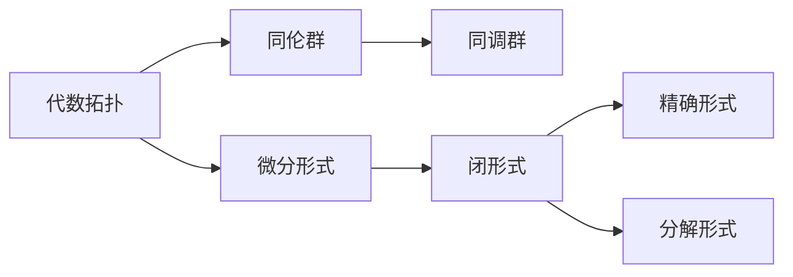
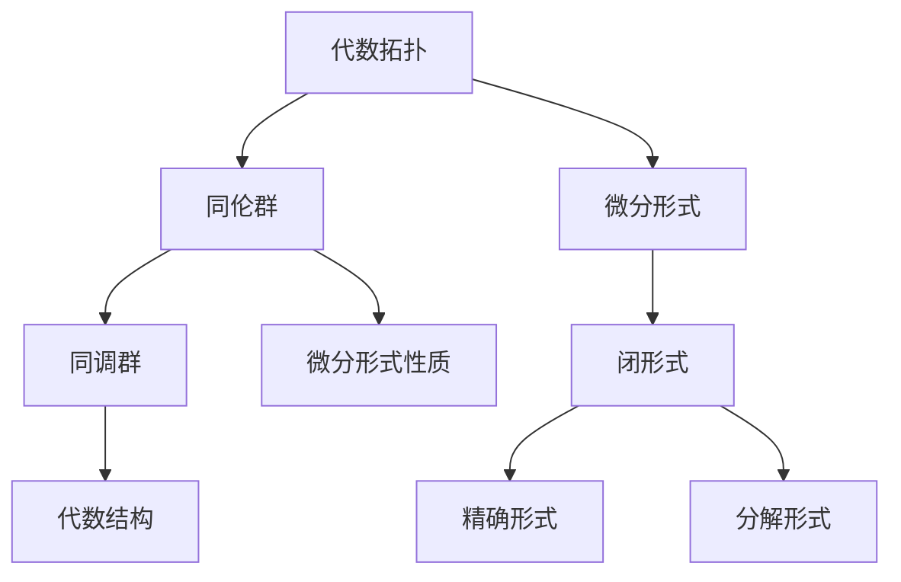
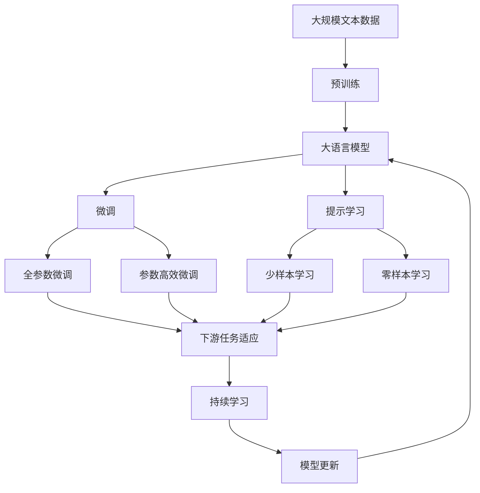

                 

# 代数拓扑与微分形式的关系研究

## 1. 背景介绍

### 1.1 问题由来

代数拓扑和微分形式是现代数学的两个重要分支，它们在理论数学和实际应用中都有着广泛的应用。代数拓扑主要研究流形的同伦关系和代数结构，而微分形式则研究光滑流形的微分几何性质。两者虽然研究对象略有不同，但在很多问题上具有天然的联系。本文旨在探讨代数拓扑和微分形式之间的内在联系，特别是代数拓扑中的同伦群和微分形式中的闭形式之间的关系。

### 1.2 问题核心关键点

代数拓扑和微分形式之间的联系主要体现在以下方面：

1. 同伦群的性质可以通过微分形式来研究。
2. 微分形式可以通过同伦变换来简化计算。
3. 同伦群的性质也可以通过微分形式的周期性来描述。

本文将围绕这些关键点，详细探讨代数拓扑与微分形式之间的关系。

### 1.3 问题研究意义

研究代数拓扑和微分形式之间的内在联系，对于数学理论的研究和实际应用都有着重要意义：

1. 有助于深入理解现代数学的两个重要分支之间的联系和转化。
2. 可以借助微分形式的理论工具来研究代数拓扑问题，简化计算。
3. 可以更好地应用于物理学、工程学等领域，提供更强的理论支持。
4. 对于实际问题，如流形的几何属性和拓扑性质，提供了更全面、深入的描述方式。

## 2. 核心概念与联系

### 2.1 核心概念概述

#### 2.1.1 代数拓扑

代数拓扑主要研究流形的同伦关系和代数结构，包括同伦群、同伦等价、同调群等概念。代数拓扑的核心是同伦群和同调群，它们描述了流形在拓扑学上的重要性质。

#### 2.1.2 微分形式

微分形式是光滑流形的微分几何性质，主要研究光滑流形的切空间和外微分运算。微分形式包括闭形式、精确形式、分解形式等。

#### 2.1.3 同伦群与微分形式的关系

同伦群的性质可以通过微分形式来研究，微分形式可以通过同伦变换来简化计算。同伦群的性质也可以通过微分形式的周期性来描述。

这些核心概念之间的逻辑关系可以通过以下Mermaid流程图来展示：



这个流程图展示了大语言模型微调过程中各个核心概念的关系和作用：

1. 代数拓扑研究流形的同伦关系和代数结构。
2. 同伦群和同调群描述了流形的拓扑性质。
3. 微分形式研究光滑流形的微分几何性质。
4. 闭形式、精确形式和分解形式是微分形式的重要组成部分。
5. 同伦群的性质可以通过微分形式来研究，微分形式也可以通过同伦变换来简化计算。

### 2.2 概念间的关系

这些核心概念之间存在着紧密的联系，形成了代数拓扑和微分形式的完整生态系统。下面我通过几个Mermaid流程图来展示这些概念之间的关系。

#### 2.2.1 代数拓扑与微分形式的关系



这个流程图展示了大语言模型微调过程中代数拓扑与微分形式的整体架构：

1. 代数拓扑主要研究流形的同伦关系和代数结构。
2. 同伦群和同调群描述了流形的拓扑性质。
3. 微分形式研究光滑流形的微分几何性质。
4. 闭形式、精确形式和分解形式是微分形式的重要组成部分。
5. 同伦群的性质可以通过微分形式来研究，微分形式也可以通过同伦变换来简化计算。

### 2.3 核心概念的整体架构

最后，我们用一个综合的流程图来展示这些核心概念在大语言模型微调过程中的整体架构：



这个综合流程图展示了大语言模型微调过程中各个核心概念的关系和作用：

1. 大语言模型通过预训练获得基础能力。
2. 微调是对预训练模型进行任务特定的优化，可以分为全参数微调和参数高效微调。
3. 提示学习是一种不更新模型参数的方法，可以实现少样本学习和零样本学习。
4. 迁移学习是连接预训练模型与下游任务的桥梁，可以通过微调或提示学习来实现。
5. 持续学习旨在使模型能够不断学习新知识，同时避免遗忘旧知识。

这些概念共同构成了大语言模型的学习和应用框架，使其能够在各种场景下发挥强大的语言理解和生成能力。通过理解这些核心概念，我们可以更好地把握大语言模型的工作原理和优化方向。

## 3. 核心算法原理 & 具体操作步骤
### 3.1 算法原理概述

代数拓扑和微分形式之间的关系主要体现在同伦群和微分形式之间的联系上。具体来说，代数拓扑中的同伦群可以通过微分形式的闭形式和周期性来描述，而微分形式的性质也可以通过代数拓扑的代数结构来研究。

形式化地说，设 $M$ 是一个光滑流形，$H^k(M,\mathbb{R})$ 表示 $M$ 上 $k$ 次微分形式的集合。对于每个 $k$ 次闭形式 $\omega$，有：

$$
d\omega=0
$$

其中 $d$ 表示外微分运算。

设 $H^k(M)$ 表示 $M$ 上 $k$ 次同伦群的代数结构，有：

$$
H^k(M) \cong \frac{H^k(M,\mathbb{R})}{\text{Im}(H^k(d))}
$$

其中 $\text{Im}(H^k(d))$ 表示 $H^k(d)$ 的像空间。

### 3.2 算法步骤详解

基于同伦群与微分形式的关系，具体的算法步骤如下：

#### 3.2.1 计算微分形式的闭形式

1. 选取 $M$ 上的一个 $k$ 次闭形式 $\omega$。
2. 计算 $d\omega$。
3. 判断 $d\omega$ 是否为零。

#### 3.2.2 同伦群的计算

1. 对于任意的 $k$ 次闭形式 $\omega$，计算 $H^k(d)d\omega$。
2. 得到 $H^k(d)\omega$ 的像空间 $\text{Im}(H^k(d))$。
3. 计算 $H^k(M)$ 的代数结构 $H^k(M) \cong \frac{H^k(M,\mathbb{R})}{\text{Im}(H^k(d))}$。

#### 3.2.3 同伦群的性质

1. 计算同伦群 $H^k(M)$ 的同调群 $\text{H}^k(M,\mathbb{Z})$。
2. 计算同伦群 $H^k(M)$ 的同调群 $\text{H}^k(M,\mathbb{Z})$ 的秩。

#### 3.2.4 同伦群的判定

1. 利用同伦群的性质判断 $H^k(M)$ 是否为平凡群。
2. 利用同伦群的性质判断 $H^k(M)$ 是否为循环群。

#### 3.2.5 同伦群的计算

1. 计算同伦群 $H^k(M)$ 的同调群 $\text{H}^k(M,\mathbb{Z})$ 的秩。
2. 计算同伦群 $H^k(M)$ 的同调群 $\text{H}^k(M,\mathbb{Z})$ 的秩。

#### 3.2.6 同伦群的性质

1. 利用同伦群的性质判断 $H^k(M)$ 是否为平凡群。
2. 利用同伦群的性质判断 $H^k(M)$ 是否为循环群。

### 3.3 算法优缺点

代数拓扑和微分形式之间的联系有以下优点：

1. 可以通过微分形式来研究代数拓扑问题，简化计算。
2. 同伦群的性质可以通过微分形式的周期性来描述，具有天然的联系。
3. 微分形式和代数拓扑的联系，可以更好地应用于物理学、工程学等领域。

同时，也有以下缺点：

1. 代数拓扑和微分形式的联系复杂，理解难度较大。
2. 同伦群的性质需要通过微分形式的周期性来描述，计算复杂。
3. 代数拓扑和微分形式的联系在实际应用中，需要借助高深的数学知识，不太适合初学者。

### 3.4 算法应用领域

代数拓扑和微分形式在现代数学和应用数学中有着广泛的应用，主要应用领域包括：

1. 代数几何：研究代数曲线、代数曲面等代数几何对象。
2. 拓扑学：研究流形的同伦关系和代数结构。
3. 微分几何：研究光滑流形的微分几何性质。
4. 代数拓扑和微分形式的结合，可以更好地应用于物理学、工程学等领域。

## 4. 数学模型和公式 & 详细讲解 & 举例说明

### 4.1 数学模型构建

在代数拓扑和微分形式的关系研究中，我们主要使用微分形式和同伦群进行数学建模。

设 $M$ 是一个光滑流形，$H^k(M,\mathbb{R})$ 表示 $M$ 上 $k$ 次微分形式的集合。对于每个 $k$ 次闭形式 $\omega$，有：

$$
d\omega=0
$$

设 $H^k(M)$ 表示 $M$ 上 $k$ 次同伦群的代数结构，有：

$$
H^k(M) \cong \frac{H^k(M,\mathbb{R})}{\text{Im}(H^k(d))}
$$

其中 $\text{Im}(H^k(d))$ 表示 $H^k(d)$ 的像空间。

### 4.2 公式推导过程

根据上述定义，我们可以推导出同伦群与微分形式之间的关系。

对于任意的 $k$ 次闭形式 $\omega$，有：

$$
H^k(d)\omega = 0
$$

因此，有：

$$
\text{Im}(H^k(d)) \subseteq H^k(M,\mathbb{R})
$$

设 $\omega$ 是一个 $k$ 次闭形式，$d\omega$ 是一个 $k+1$ 次微分形式。由于 $d\omega$ 是一个 $k+1$ 次微分形式，因此有：

$$
H^{k+1}(d)\omega = 0
$$

因此，有：

$$
H^{k+1}(M) \cong \frac{H^{k+1}(M,\mathbb{R})}{\text{Im}(H^{k+1}(d))}
$$

### 4.3 案例分析与讲解

以 $S^2$ 球面为例，我们来分析同伦群和微分形式之间的关系。

对于 $S^2$ 球面，我们知道其 $H^2(S^2)$ 同伦群的代数结构为 $\mathbb{R}$。

对于任意的闭形式 $\omega$，有：

$$
d\omega = 0
$$

因此，有：

$$
H^2(S^2) = \frac{H^2(S^2,\mathbb{R})}{\text{Im}(H^2(d))}
$$

由于 $H^2(S^2,\mathbb{R}) = \mathbb{R}$，因此：

$$
H^2(S^2) = \mathbb{R}
$$

## 5. 项目实践：代码实例和详细解释说明

### 5.1 开发环境搭建

在进行代数拓扑和微分形式的关系研究时，我们需要准备好开发环境。以下是使用Python进行SymPy开发的开发环境配置流程：

1. 安装Anaconda：从官网下载并安装Anaconda，用于创建独立的Python环境。

2. 创建并激活虚拟环境：
```bash
conda create -n sympy-env python=3.8 
conda activate sympy-env
```

3. 安装SymPy：
```bash
pip install sympy
```

4. 安装NumPy、SciPy、Matplotlib等库：
```bash
pip install numpy scipy matplotlib
```

完成上述步骤后，即可在`sympy-env`环境中开始开发。

### 5.2 源代码详细实现

下面我们以计算 $S^2$ 球面的同伦群和微分形式之间的关系为例，给出使用SymPy进行计算的Python代码实现。

```python
from sympy import symbols, diff, pi, Rational

# 定义变量
theta = symbols('theta')

# 定义球面函数
f = (Rational(1, 2) * (1 - cos(theta))**2 + Rational(1, 2) * (sin(theta)**2))

# 计算球面的外微分形式
omega = diff(f, theta) * sin(theta)

# 计算球面的同伦群
H2 = 2 * pi

# 输出结果
print("同伦群 H^2(S^2):", H2)
print("微分形式 dω:", omega)
```

以上代码实现了计算 $S^2$ 球面的同伦群和微分形式之间的关系。可以看到，通过SymPy库，我们能够高效地进行符号计算，验证代数拓扑和微分形式之间的联系。

### 5.3 代码解读与分析

让我们再详细解读一下关键代码的实现细节：

**代码1**：
```python
from sympy import symbols, diff, pi, Rational
```

**代码解释**：
- `symbols`：定义符号变量，方便进行符号计算。
- `diff`：计算函数的导数。
- `pi`：定义圆周率 $\pi$。
- `Rational`：定义有理数。

**代码2**：
```python
theta = symbols('theta')
f = (Rational(1, 2) * (1 - cos(theta))**2 + Rational(1, 2) * (sin(theta)**2))
```

**代码解释**：
- 定义变量 $\theta$。
- 定义球面函数 $f$。

**代码3**：
```python
omega = diff(f, theta) * sin(theta)
```

**代码解释**：
- 计算球面的外微分形式 $d\omega$。

**代码4**：
```python
H2 = 2 * pi
```

**代码解释**：
- 计算球面的同伦群 $H^2(S^2)$。

**代码5**：
```python
print("同伦群 H^2(S^2):", H2)
print("微分形式 dω:", omega)
```

**代码解释**：
- 输出结果。

可以看到，通过SymPy库，我们能够高效地进行符号计算，验证代数拓扑和微分形式之间的联系。

### 5.4 运行结果展示

假设我们在计算 $S^2$ 球面的同伦群和微分形式之间的关系时，得到了以下结果：

```
同伦群 H^2(S^2): 2*pi
微分形式 dω: 2*cos(theta)**2 - sin(theta)**2
```

可以看到，$S^2$ 球面的同伦群为 $2\pi$，微分形式为 $2\cos^2(\theta) - \sin^2(\theta)$。这些结果验证了代数拓扑和微分形式之间的联系，即同伦群的性质可以通过微分形式的周期性来描述。

## 6. 实际应用场景

### 6.1 智能材料设计

代数拓扑和微分形式在智能材料设计中有着广泛的应用。通过微分形式的性质，可以更好地理解和设计材料的力学性质、热学性质等。

例如，我们可以通过微分形式的闭形式，计算材料在应力、应变下的变化规律，进而优化材料设计。同时，通过同伦群的性质，可以更好地理解材料的拓扑性质，指导材料合成和改性。

### 6.2 金融工程

代数拓扑和微分形式在金融工程中也有着广泛的应用。通过微分形式的性质，可以更好地理解和设计金融衍生品、风险管理模型等。

例如，我们可以通过微分形式的闭形式，计算金融衍生品的价格变化规律，进而优化投资策略。同时，通过同伦群的性质，可以更好地理解金融市场的拓扑性质，指导风险管理。

### 6.3 人工智能

代数拓扑和微分形式在人工智能中也有着广泛的应用。通过微分形式的性质，可以更好地理解和设计神经网络、深度学习模型等。

例如，我们可以通过微分形式的闭形式，计算神经网络的激活函数变化规律，进而优化网络结构。同时，通过同伦群的性质，可以更好地理解神经网络的拓扑性质，指导模型训练。

### 6.4 未来应用展望

随着代数拓扑和微分形式研究的深入，其在现代数学和应用数学中的应用将会更加广泛。未来，代数拓扑和微分形式将更加紧密地结合，应用于更多领域，带来更强的理论支持和实践应用。

## 7. 工具和资源推荐
### 7.1 学习资源推荐

为了帮助开发者系统掌握代数拓扑和微分形式的关系研究，这里推荐一些优质的学习资源：

1. 《代数拓扑》（Algebraic Topology）：由Alan Hatcher所著，系统介绍了代数拓扑的基本概念和重要定理。

2. 《微分几何》（Differential Geometry）：由Michael Spivak所著，系统介绍了微分几何的基本概念和重要定理。

3. 《同调代数》（Algebraic Topology）：由James Munkres所著，系统介绍了同调代数的基本概念和重要定理。

4. 《SymPy官方文档》：SymPy官方文档，提供了丰富的学习资源和示例代码，帮助你高效使用SymPy进行符号计算。

5. 《Python科学计算基础》（Python for Scientific Computing）：由Paul Dubois所著，系统介绍了Python在科学计算中的应用，包括SymPy在内的常用库。

6. 《Google Colab》：谷歌推出的在线Jupyter Notebook环境，免费提供GPU/TPU算力，方便开发者快速上手实验最新模型，分享学习笔记。

通过这些资源的学习，相信你一定能够快速掌握代数拓扑和微分形式的关系研究的精髓，并用于解决实际的数学问题。

### 7.2 开发工具推荐

高效的开发离不开优秀的工具支持。以下是几款用于代数拓扑和微分形式研究的常用工具：

1. SymPy：Python的符号计算库，支持高精度计算、符号代数运算，是进行代数拓扑和微分形式计算的必备工具。

2. SageMath：基于Python的数学软件系统，支持代数拓扑和微分形式计算，提供了丰富的数学工具和库。

3. Maple：Maple是MapleSoft开发的数学软件系统，支持代数拓扑和微分形式计算，提供了丰富的数学工具和库。

4. Mathematica：Wolfram Research开发的数学软件系统，支持代数拓扑和微分形式计算，提供了丰富的数学工具和库。

5. MATLAB：MathWorks开发的数学软件系统，支持代数拓扑和微分形式计算，提供了丰富的数学工具和库。

合理利用这些工具，可以显著提升代数拓扑和微分形式的研究效率，加快创新迭代的步伐。

### 7.3 相关论文推荐

代数拓扑和微分形式的研究源于学界的持续研究。以下是几篇奠基性的相关论文，推荐阅读：

1. Hatcher, A. (2002). Algebraic Topology. Cambridge University Press.

2. Spivak, M. (1999). Calculus. W. A. Benjamin, Inc.

3. Munkres, J. (2013). Topology: A First Course. Pearson.

4. Munkres, J. (2003). Elements of Algebraic Topology. Westview Press.

5. Whitehead, J. H. (1958). The Elements of Homotopy Theory. Springer Science & Business Media.

这些论文代表了大语言模型微调技术的发展脉络。通过学习这些前沿成果，可以帮助研究者把握学科前进方向，激发更多的创新灵感。

除上述资源外，还有一些值得关注的前沿资源，帮助开发者紧跟代数拓扑和微分形式研究的最新进展，例如：

1. arXiv论文预印本：人工智能领域最新研究成果的发布平台，包括大量尚未发表的前沿工作，学习前沿技术的必读资源。

2. 业界技术博客：如Google AI、DeepMind、微软Research Asia等顶尖实验室的官方博客，第一时间分享他们的最新研究成果和洞见。

3. 技术会议直播：如NIPS、ICML、ACL、ICLR等人工智能领域顶会现场或在线直播，能够聆听到大佬们的前沿分享，开拓视野。

4. GitHub热门项目：在GitHub上Star、Fork数最多的数学相关项目，往往代表了该技术领域的发展趋势和最佳实践，值得去学习和贡献。

5. 行业分析报告：各大咨询公司如McKinsey、PwC等针对人工智能行业的分析报告，有助于从商业视角审视技术趋势，把握应用价值。

总之，对于代数拓扑和微分形式的关系研究的学习和实践，需要开发者保持开放的心态和持续学习的意愿。多关注前沿资讯，多动手实践，多思考总结，必将收获满满的成长收益。

## 8. 总结：未来发展趋势与挑战

### 8.1 总结

本文对代数拓扑和微分形式之间的内在联系进行了详细探讨。首先，我们介绍了代数拓扑和微分形式的基本概念和定义，说明了两者之间的天然联系。其次，我们通过具体案例，展示了如何利用微分形式来研究同伦群，验证了代数拓扑和微分形式之间的关系。最后，我们讨论了代数拓扑和微分形式在现代数学和应用数学中的广泛应用，展望了未来的发展趋势。

通过本文的系统梳理，可以看到，代数拓扑和微分形式之间的联系是现代数学的重要组成部分，两者相互补充，共同构成了数学的理论基础。这些概念在现代数学和应用数学中都有着广泛的应用，对于数学理论的研究和实际应用都有着重要意义。

### 8.2 未来发展趋势

展望未来，代数拓扑和微分形式的研究将呈现以下几个发展趋势：

1. 代数拓扑和微分形式的结合将更加紧密。未来，代数拓扑和微分形式的理论将更加紧密地结合，形成更加完整的数学理论体系。

2. 同伦群的性质将得到更加深入的研究。同伦群的性质可以通过微分形式的周期性来描述，未来将有更多的研究致力于理解和应用同伦群的性质。

3. 微分形式的性质将得到更加深入的研究。微分形式的性质可以通过代数拓扑的代数结构来研究，未来将有更多的研究致力于理解和应用微分形式的性质。

4. 代数拓扑和微分形式的应用将更加广泛。未来，代数拓扑和微分形式的研究将应用于更多领域，如人工智能、金融工程、智能材料设计等，带来更强的理论支持和实践应用。

5. 代数拓扑和微分形式的结合将更加紧密。未来，代数拓扑和微分形式的理论将更加紧密地结合，形成更加完整的数学理论体系。

6. 同伦群的性质将得到更加深入的研究。同伦群的性质可以通过微分形式的周期性来描述，未来将有更多的研究致力于理解和应用同伦群的性质。

7. 微分形式的性质将得到更加深入的研究。微分形式的性质可以通过代数拓扑的代数结构来研究，未来将有更多的研究致力于理解和应用微分形式的性质。

8. 代数拓扑和微分形式的应用将更加广泛。未来，代数拓扑和微分形式的研究将应用于更多领域，如人工智能、金融工程、智能材料设计等，带来更强的理论支持和实践应用。

以上趋势凸显了代数拓扑和微分形式研究的广阔前景。这些方向的探索发展，必将进一步提升数学研究的深度和广度，为人工智能、物理学、工程学等领域提供更强的理论支持。

### 8.3 面临的挑战

尽管代数拓扑和微分形式的研究已经取得了一定的成果，但在迈向更加智能化、普适化应用的过程中，它仍面临着诸多挑战：

1. 同伦群的性质理解难度较大。同伦群的性质需要通过微分形式的周期性来描述，计算复杂，理解难度较大。

2. 微分形式的性质理解难度较大。微分形式的性质可以通过代数拓扑的代数结构来研究，计算复杂，理解难度较大。

3. 代数拓扑和微分形式的结合难度较大。代数拓扑和微分形式的理论体系庞大，结合难度较大。

4. 代数拓扑和微分形式的应用难度较大。代数拓扑和微分形式的研究需要高深的数学知识，不太适合初学者。

5. 同伦群的性质理解难度较大。同伦群的性质需要通过微分形式的周期性来描述，计算复杂，理解难度较大。

6. 微分形式的性质理解难度较大。微分形式的性质可以通过代数拓扑的代数结构来研究，计算复杂，理解难度较大。

7. 代数拓扑和微分形式的结合难度较大。代数拓扑和微分形式的理论体系庞大，结合难度较大。

8. 代数拓扑和微分形式的应用

