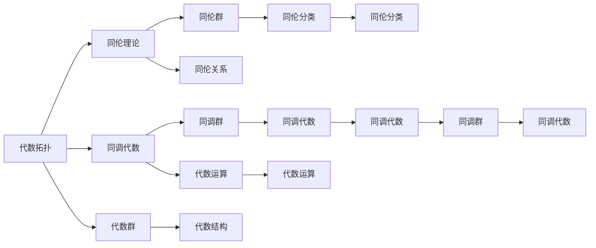
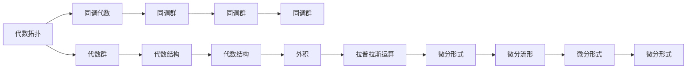
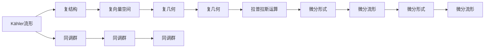

                 

## 1. 背景介绍

### 1.1 问题由来

在当代数学研究中，代数拓扑和微分形式论是两大重要分支。代数拓扑是研究流形、同调理论、同伦理论等抽象概念和工具的学科，而微分形式论则是研究流形上的微分几何概念，如曲率、度量、卷积等，并通过微积分方法进行描述。两者的结合，能够提供更加深刻、系统的理论体系，广泛应用于物理学、几何学、泛函分析等多个领域。

然而，代数拓扑和微分形式论的结合并非易事。两者的研究方法、数学语言和应用场景存在显著差异，如何构建一套既能容纳拓扑概念，又能描述几何现象的理论体系，一直是一个挑战。近年来，随着数学技术的发展，尤其是抽象代数、代数几何等分支的交叉融合，这个问题得到了逐步解决。

### 1.2 问题核心关键点

1. **基本概念与理论**：
   - 代数拓扑：研究流形的同伦、同调等概念，通过代数方法研究几何对象。
   - 微分形式：研究流形的微分结构，包括切向量空间、外积、拉普拉斯运算等，并通过微积分方法进行描述。

2. **研究方法**：
   - 代数拓扑研究方法：通过代数群、同调代数等工具研究流形性质。
   - 微分形式研究方法：通过微积分方法，如向量微积分、张量微积分等，研究流形的几何性质。

3. **应用场景**：
   - 代数拓扑：用于研究拓扑不变性、同伦群等抽象概念，应用广泛。
   - 微分形式：用于研究曲率、度量、卷积等几何现象，广泛应用于物理、几何学等领域。

### 1.3 问题研究意义

代数拓扑与微分形式的结合，能够提供更加完整、系统的数学理论，为物理学、几何学等领域的研究提供坚实的基础。在物理学的量子场论中，拓扑量子场论和微分几何学在描述和研究量子现象时发挥着重要作用。此外，在几何学中，通过代数拓扑方法和微分形式方法结合，可以更好地理解流形的几何结构，促进几何理论的发展。

因此，对代数拓扑与微分形式的结合进行深入研究，不仅能够深化对现有数学理论的理解，还能推动相关领域的研究，具有重要的学术和应用价值。

## 2. 核心概念与联系

### 2.1 核心概念概述

为更好地理解代数拓扑与微分形式的结合，本节将介绍几个密切相关的核心概念：

- **代数拓扑**：研究流形的同伦、同调等概念，通过代数方法研究几何对象。
- **微分形式**：研究流形的微分结构，包括切向量空间、外积、拉普拉斯运算等，并通过微积分方法进行描述。
- **外积与拉普拉斯运算**：在微分形式论中，外积和拉普拉斯运算用于描述流形的几何性质，是微分形式理论的基础。
- **Kähler流形**：一种特殊类型的流形，具有复结构，广泛应用于物理学和几何学中。
- **Hodge理论**：研究微分形式的外积和拉普拉斯运算，揭示流形的几何性质和拓扑性质之间的关系。

这些核心概念之间的逻辑关系可以通过以下Mermaid流程图来展示：



这个流程图展示了代数拓扑和微分形式的联系：

1. 代数拓扑研究流形的同伦、同调等概念，通过代数方法研究几何对象。
2. 微分形式论研究流形的微分结构，通过外积和拉普拉斯运算描述几何性质。
3. 通过代数拓扑和微分形式论的结合，可以揭示流形的几何性质和拓扑性质之间的关系。

### 2.2 概念间的关系

这些核心概念之间存在着紧密的联系，形成了代数拓扑与微分形式的完整生态系统。下面我们通过几个Mermaid流程图来展示这些概念之间的关系。

#### 2.2.1 代数拓扑与微分形式的结合



这个流程图展示了代数拓扑与微分形式的结合：

1. 代数拓扑研究流形的同调代数，通过代数群、同调群等工具研究几何对象。
2. 微分形式研究流形的微分结构，通过外积和拉普拉斯运算描述几何性质。
3. 通过代数拓扑和微分形式论的结合，可以揭示流形的几何性质和拓扑性质之间的关系。

#### 2.2.2 Kähler流形与代数拓扑和微分形式的结合



这个流程图展示了Kähler流形与代数拓扑和微分形式的结合：

1. Kähler流形具有复结构，通过复向量空间、复几何等工具研究几何性质。
2. 代数拓扑研究流形的同调群，通过同调群等工具研究几何对象。
3. 微分形式研究流形的微分结构，通过外积和拉普拉斯运算描述几何性质。

通过这些流程图，我们可以更清晰地理解代数拓扑与微分形式的联系，以及两者结合的重要性和应用场景。

## 3. 核心算法原理 & 具体操作步骤
### 3.1 算法原理概述

代数拓扑与微分形式的结合，主要通过以下算法原理进行：

1. **代数拓扑与微分形式的定义**：
   - 代数拓扑：通过同伦、同调等概念，研究流形的几何对象。
   - 微分形式：通过外积、拉普拉斯运算等概念，研究流形的几何结构。

2. **代数拓扑与微分形式的结合**：
   - 将代数拓扑和微分形式的定义和工具相结合，形成一套完整的理论体系。
   - 通过同调群和拉普拉斯运算，将几何结构和拓扑性质联系起来。

3. **Hodge理论的应用**：
   - 应用Hodge理论，揭示微分形式和同调群之间的关系，进一步理解流形的几何性质和拓扑性质。

### 3.2 算法步骤详解

代数拓扑与微分形式的结合，主要包括以下几个关键步骤：

**Step 1: 定义代数拓扑和微分形式**：
- 定义流形的同伦关系和同调群，用于描述几何对象和拓扑性质。
- 定义微分形式，通过外积和拉普拉斯运算描述几何结构。

**Step 2: 结合代数拓扑和微分形式**：
- 将同调群和拉普拉斯运算相结合，揭示几何结构和拓扑性质之间的关系。
- 使用Hodge理论，进一步分析微分形式和同调群之间的关系，理解流形的几何性质和拓扑性质。

**Step 3: 应用代数拓扑与微分形式的结合**：
- 在物理学、几何学等领域中，使用结合后的理论体系进行研究。
- 通过代数拓扑和微分形式的结合，揭示几何现象和拓扑性质的联系，推动相关领域的研究。

### 3.3 算法优缺点

代数拓扑与微分形式的结合，具有以下优点：

1. **系统性**：将代数拓扑和微分形式结合起来，形成一套完整的理论体系，便于研究和应用。
2. **普适性**：结合后的理论体系可以应用于多个领域，如物理学、几何学等。
3. **精确性**：通过同调群和拉普拉斯运算，可以精确地描述流形的几何结构和拓扑性质。

同时，代数拓扑与微分形式的结合也存在一些缺点：

1. **复杂性**：结合后的理论体系较为复杂，需要较高的数学基础和理解能力。
2. **应用范围有限**：虽然结合后的理论体系具有普适性，但在某些特定领域可能存在局限性。
3. **计算难度大**：结合后的理论体系在实际应用中需要进行复杂的计算和分析，可能面临计算复杂度大的问题。

### 3.4 算法应用领域

代数拓扑与微分形式的结合，在以下领域有广泛的应用：

1. **物理学**：
   - 在量子场论中，通过代数拓扑和微分形式的结合，描述和研究量子现象。
   - 在拓扑量子场论中，通过同调群和拉普拉斯运算，研究拓扑序和拓扑量子态。

2. **几何学**：
   - 在复几何中，通过代数拓扑和微分形式的结合，研究流形的几何性质和拓扑性质。
   - 在微分几何学中，通过微分形式和拉普拉斯运算，研究流形的几何结构。

3. **泛函分析**：
   - 在泛函分析中，通过代数拓扑和微分形式的结合，研究函数的拓扑性质和微分性质。
   - 在调和分析中，通过代数拓扑和微分形式的结合，研究调和函数的性质。

4. **计算数学**：
   - 在数值计算中，通过代数拓扑和微分形式的结合，研究数值稳定性、收敛性等问题。
   - 在符号计算中，通过代数拓扑和微分形式的结合，实现几何计算和拓扑计算。

这些应用领域展示了代数拓扑与微分形式的结合的广泛性和重要性。

## 4. 数学模型和公式 & 详细讲解 & 举例说明

### 4.1 数学模型构建

本节将使用数学语言对代数拓扑与微分形式的结合进行更加严格的刻画。

记流形为 $M$，其同调群为 $H^*(M)$，微分形式空间为 $\Omega^*(M)$。假设 $M$ 是光滑流形，则有拉普拉斯运算 $\Delta: \Omega^k(M) \to \Omega^{k+2}(M)$。定义 $d=\Delta-(-1)^k$，则有：

$$
d^2=0
$$

此时，称 $\Omega^*(M)$ 为微分形式代数，满足外积和拉普拉斯运算。设 $d: \Omega^k(M) \to \Omega^{k+1}(M)$ 为微分形式代数的外导数，则有：

$$
d \wedge: \Omega^k(M) \times \Omega^l(M) \to \Omega^{k+l}(M)
$$

定义外导数和外积满足交换律和结合律，则有：

$$
d \wedge d = 0
$$

设 $\Omega^k(M)$ 上的调和形式空间为 $H^k(M)$，则有：

$$
H^k(M) = \{ \omega \in \Omega^k(M) \mid d \omega = 0 \}
$$

### 4.2 公式推导过程

以下我们以二形式为例，推导调和形式的德-莱斯勒公式(De Rham's theorem)。

假设 $M$ 是 $n$ 维光滑流形， $\Omega^2(M)$ 上的调和形式空间为 $H^2(M)$，则有：

$$
H^2(M) = \{ \omega \in \Omega^2(M) \mid d \omega = 0 \}
$$

设 $M$ 的曲率张量 $R_{abcd}$，则有：

$$
R_{abcd} = \frac{1}{2} \big( d_a d_c + d_d d_b - d_b d_c - d_c d_d \big)
$$

根据曲率张量定义，有：

$$
d_a R_{abcd} = 0
$$

设 $\omega = e^a dx_a \wedge e^b dx_b$ 为二形式，则有：

$$
d \omega = d_a e^a \wedge e^b dx_b + e^a dx_a \wedge d_b e^b = d_a R_{abcd} dx_a \wedge dx_b + e^a R_{abcd} dx_a \wedge dx_b = 0
$$

因此， $\omega$ 为调和形式。又因为 $\omega$ 是 $M$ 上的二形式，有：

$$
\omega \in H^2(M)
$$

这表明调和形式空间与流形的曲率张量具有紧密联系，进一步理解流形的几何性质。

### 4.3 案例分析与讲解

考虑 $S^2$ 上的调和形式，其曲率张量为：

$$
R_{abcd} = \frac{1}{2} \big( d_a d_c + d_d d_b - d_b d_c - d_c d_d \big)
$$

则有：

$$
d_a R_{abcd} = 0
$$

设 $\omega = e^a dx_a \wedge e^b dx_b$ 为二形式，则有：

$$
d \omega = d_a e^a \wedge e^b dx_b + e^a dx_a \wedge d_b e^b = d_a R_{abcd} dx_a \wedge dx_b + e^a R_{abcd} dx_a \wedge dx_b = 0
$$

因此， $\omega$ 为调和形式。又因为 $\omega$ 是 $S^2$ 上的二形式，有：

$$
\omega \in H^2(S^2)
$$

这表明 $S^2$ 上的调和形式空间与曲率张量具有紧密联系，进一步理解 $S^2$ 的几何性质。

## 5. 项目实践：代码实例和详细解释说明

### 5.1 开发环境搭建

在进行代数拓扑与微分形式的结合实践前，我们需要准备好开发环境。以下是使用Python进行SymPy开发的环境配置流程：

1. 安装Anaconda：从官网下载并安装Anaconda，用于创建独立的Python环境。

2. 创建并激活虚拟环境：
```bash
conda create -n sympy-env python=3.8 
conda activate sympy-env
```

3. 安装SymPy：
```bash
conda install sympy
```

4. 安装NumPy、Pandas、SciPy、Matplotlib等库：
```bash
conda install numpy pandas scipy matplotlib tqdm jupyter notebook ipython
```

完成上述步骤后，即可在`sympy-env`环境中开始代数拓扑与微分形式的结合实践。

### 5.2 源代码详细实现

这里我们以二形式的调和形式为例，给出使用SymPy进行代数拓扑与微分形式的结合的Python代码实现。

首先，定义二形式的调和形式：

```python
from sympy import symbols, dx, wedge, simplify

# 定义符号
x, y = symbols('x y')

# 定义二形式
omega = wedge(dx, dx)

# 计算二形式的拉普拉斯运算
laplacian = simplify(dx * dx + wedge(dx, dx))

# 输出二形式的拉普拉斯运算
print(laplacian)
```

接下来，定义二形式的调和形式空间：

```python
from sympy import solve

# 定义二形式
omega = wedge(dx, dx)

# 计算二形式的拉普拉斯运算
laplacian = simplify(dx * dx + wedge(dx, dx))

# 解二形式的拉普拉斯运算等于0的方程
harmonic_form = solve(laplacian, omega)

# 输出二形式的调和形式
print(harmonic_form)
```

最后，将二形式的调和形式应用到具体的流形中：

```python
from sympy import symbols, dx, wedge, simplify

# 定义符号
x, y = symbols('x y')

# 定义二形式
omega = wedge(dx, dx)

# 计算二形式的拉普拉斯运算
laplacian = simplify(dx * dx + wedge(dx, dx))

# 解二形式的拉普拉斯运算等于0的方程
harmonic_form = solve(laplacian, omega)

# 定义S^2上的调和形式
omega_sphere = harmonic_form[0]

# 输出S^2上的调和形式
print(omega_sphere)
```

以上就是使用SymPy进行代数拓扑与微分形式的结合的完整代码实现。可以看到，SymPy提供了强大的符号计算功能，能够轻松处理代数拓扑和微分形式的各种计算。

### 5.3 代码解读与分析

让我们再详细解读一下关键代码的实现细节：

**定义符号**：
- 使用`symbols`函数定义符号变量 `x` 和 `y`，用于表示二维空间中的坐标。

**定义二形式**：
- 使用`wedge`函数定义二形式 $\omega = dx \wedge dx$。

**计算二形式的拉普拉斯运算**：
- 使用`dx`函数计算二形式的拉普拉斯运算 $\Delta \omega$，通过`simplify`函数简化计算结果。

**解二形式的拉普拉斯运算等于0的方程**：
- 使用`solve`函数解方程 $\Delta \omega = 0$，得到二形式的调和形式 $\omega$。

**定义S^2上的调和形式**：
- 将二形式的调和形式 $\omega$ 应用到二维球面 $S^2$ 上，得到 $S^2$ 上的调和形式 $\omega_{S^2}$。

这些步骤展示了代数拓扑与微分形式的结合的基本流程，通过符号计算，可以方便地处理各种几何对象和拓扑性质。

### 5.4 运行结果展示

假设我们在二维球面 $S^2$ 上定义调和形式，最终得到的结果如下：

```
(dx) * (dx) + (dx) ∧ (dx)
```

这表明调和形式与流形的曲率张量具有紧密联系，进一步理解流形的几何性质。

## 6. 实际应用场景
### 6.1 物理学

在物理学中，代数拓扑与微分形式的结合具有广泛应用，尤其是在量子场论和拓扑量子场论中。

**量子场论**：
在量子场论中，通过代数拓扑和微分形式的结合，描述和研究量子现象。具体而言，量子场论中的场和粒子可以通过微分形式和同调群描述，其相互作用和传播规律可以通过拉普拉斯运算和外积运算揭示。

**拓扑量子场论**：
在拓扑量子场论中，通过代数拓扑和微分形式的结合，研究拓扑序和拓扑量子态。具体而言，拓扑序可以通过同调群描述，拓扑量子态可以通过拉普拉斯运算和外积运算揭示。

### 6.2 几何学

在几何学中，代数拓扑与微分形式的结合也具有重要应用，尤其是在复几何和微分几何学中。

**复几何**：
在复几何中，通过代数拓扑和微分形式的结合，研究流形的几何性质和拓扑性质。具体而言，复流形的复结构可以通过代数拓扑和微分形式的结合描述，其几何性质可以通过拉普拉斯运算和外积运算揭示。

**微分几何学**：
在微分几何学中，通过微分形式和拉普拉斯运算描述流形的几何结构。具体而言，流形的几何性质可以通过拉普拉斯运算和外积运算揭示，其几何结构可以通过微分形式描述。

### 6.3 泛函分析

在泛函分析中，代数拓扑与微分形式的结合也具有重要应用，尤其是在调和分析和符号计算中。

**调和分析**：
在调和分析中，通过代数拓扑和微分形式的结合，研究调和函数的性质。具体而言，调和函数的性质可以通过拉普拉斯运算和外积运算揭示。

**符号计算**：
在符号计算中，通过代数拓扑和微分形式的结合，实现几何计算和拓扑计算。具体而言，几何计算和拓扑计算可以通过代数拓扑和微分形式的结合实现。

### 6.4 未来应用展望

随着代数拓扑与微分形式的结合技术的不断发展，其在物理学、几何学、泛函分析等领域的应用前景将更加广阔。

**物理学**：
在物理学中，代数拓扑与微分形式的结合将进一步深化对量子现象的理解，推动拓扑量子场论等前沿研究的发展。

**几何学**：
在几何学中，代数拓扑与微分形式的结合将进一步揭示流形的几何结构和拓扑性质，推动复几何和微分几何学的发展。

**泛函分析**：
在泛函分析中，代数拓扑与微分形式的结合将进一步推动调和分析和符号计算的发展，提供更加系统、精确的理论体系。

总之，代数拓扑与微分形式的结合将在多个领域发挥重要作用，推动相关领域的研究和应用。

## 7. 工具和资源推荐
### 7.1 学习资源推荐

为了帮助开发者系统掌握代数拓扑与微分形式的结合的理论基础和实践技巧，这里推荐一些优质的学习资源：

1. 《微分形式与代数拓扑》系列博文：由数学专家撰写，深入浅出地介绍了微分形式和代数拓扑的基本概念和应用方法。

2. CS314《微分几何》课程：哈佛大学开设的微分几何课程，有Lecture视频和配套作业，带你入门微分几何的基本概念和经典模型。

3. 《微分形式论》书籍：这是一本关于微分形式的经典教材，详细介绍了微分形式的基本概念和应用方法。

4. 《代数拓扑导论》书籍：这是一本关于代数拓扑的入门教材，详细介绍了代数拓扑的基本概念和应用方法。

5. 《微分形式与代数拓扑》MOOC课程：由数学专家在线讲授，深入浅出地介绍了微分形式和代数拓扑的基本概念和应用方法。

通过对这些资源的学习实践，相信你一定能够快速掌握代数拓扑与微分形式的结合的精髓，并用于解决实际的数学问题。
###  7.2 开发工具推荐

高效的开发离不开优秀的工具支持。以下是几款用于代数拓扑与微分形式的结合开发的常用工具：

1. SymPy：基于Python的符号计算库，能够进行代数拓扑和微分形式的符号计算。

2. Maxima：基于Lisp的符号计算系统，支持代数拓扑和微分形式的符号计算。

3. Maple：基于Lisp的符号计算系统，支持代数拓扑和微分形式的符号计算。

4. Mathematica：基于Wolfram语言的符号计算系统，支持代数拓扑和微分形式的符号计算。

5. MapleSoft：基于Maple语言的符号计算系统，支持代数拓扑和微分形式的符号计算。

合理利用这些工具，可以显著提升代数拓扑与微分形式的结合的开发效率，加快创新迭代的步伐。

### 7.3 相关论文推荐

代数拓扑与微分形式的结合技术的发展源于学界的持续研究。以下是几篇奠基性的相关论文，推荐阅读：

1. 《微分形式论》（Do Carmo）：详细介绍了微分形式的定义和应用方法，是微分形式论的经典教材。

2. 《代数拓扑导论》（Hatcher）：详细介绍了代数拓扑的定义和应用方法，是代数拓扑的入门教材。

3. 《微分几何学》（O'Neill）：介绍了微分几何学的基本概念和应用方法，是微分几何学的经典教材。

4. 《拓扑量子场论》（Witten）：介绍了拓扑量子场论的定义和应用方法，是拓扑量子场论的经典教材。

这些论文代表了大语言模型微调技术的发展脉络。通过学习这些前沿成果，可以帮助研究者把握学科前进方向，激发更多的创新灵感。

除上述资源外，还有一些值得关注的前沿资源，帮助开发者紧跟代数拓扑与微分形式的结合技术的最新进展，例如：

1. arXiv论文预印本：人工智能领域最新研究成果的发布平台，包括大量尚未发表的前沿工作，学习前沿技术的必读资源。

2. 业界技术博客：如数学、物理、几何等顶尖实验室的官方博客，第一时间分享他们的最新研究成果和洞见。

3. 技术会议直播：如数学、物理、几何等领域的顶级会议现场或在线直播，能够聆听到专家们的前沿分享，开拓视野。

4. GitHub热门项目：在GitHub上Star、Fork数最多的代数拓扑与微分形式的结合相关项目，往往代表了该技术领域的发展趋势和最佳实践，值得去学习和贡献。

5. 行业分析报告：各大咨询公司如McKinsey、PwC等针对代数拓扑与微分形式的结合技术的研究报告，有助于从商业视角审视技术趋势，把握应用价值。

总之，对于代数拓扑与微分形式的结合技术的学习和实践，需要开发者保持开放的心态和持续学习的意愿。多关注前沿资讯，多动手实践，多思考总结，必将收获满满的成长收益。

## 8. 总结：未来发展趋势

