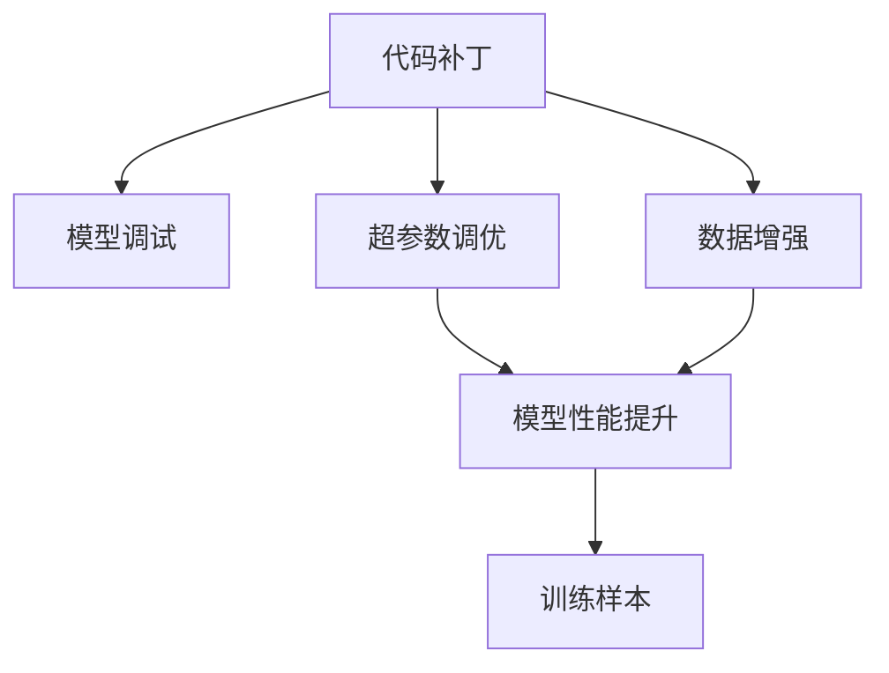

                 

# 代码补丁vs训练样本：两种debug方式的碰撞

## 1. 背景介绍

在软件开发和人工智能模型训练的过程中， Debug（调试）是确保代码正确性和模型性能的关键步骤。常用的Debug方式有两种：代码补丁和训练样本。代码补丁指的是在已有的代码中增加或修改功能以解决问题，而训练样本则是在数据集中寻找合适的样本用于模型训练以提升性能。本文将详细探讨这两种Debug方式的原理、优缺点及其在实际应用场景中的碰撞。

## 2. 核心概念与联系

### 2.1 核心概念概述

- **代码补丁**：指通过在现有代码中添加或修改函数、变量等来解决代码中存在的问题。通常用于修复已知错误，优化性能等。
- **训练样本**：指在数据集中选取用于训练模型以提升其性能的样本。通常用于解决模型过拟合、提升泛化能力等。
- **模型调试**：指在模型训练过程中，通过观察和调整模型参数、数据集等方式，来解决模型无法达到预期效果的问题。
- **数据增强**：指通过对训练样本进行旋转、缩放、裁剪等操作，以生成更多的样本数据，提升模型泛化能力。
- **超参数调优**：指通过调整模型的学习率、批次大小、优化器等超参数，以优化模型性能。

### 2.2 概念间的关系

以下是一个简单的Mermaid流程图，展示了代码补丁和训练样本在模型调试中的关系：



在这个流程图中，代码补丁和训练样本都是用于优化模型性能的调试手段。代码补丁通常用于解决代码层面的问题，而训练样本则用于提升模型对数据的表现。超参数调优和数据增强则是针对模型训练的具体方法，而模型调试则是整个优化过程的框架。

## 3. 核心算法原理 & 具体操作步骤

### 3.1 算法原理概述

代码补丁和训练样本两种Debug方式有着不同的原理。代码补丁通常是通过修改代码逻辑来解决问题，而训练样本则是通过改变训练数据来提升模型性能。

- **代码补丁**：原理是通过直接修改代码逻辑，解决已知的错误或优化性能。具体步骤包括定位问题、编写补丁代码、测试并修复。
- **训练样本**：原理是通过增加新的训练数据，提升模型对未知数据的泛化能力。具体步骤包括选择样本、数据预处理、模型训练和评估。

### 3.2 算法步骤详解

#### 3.2.1 代码补丁

**步骤1：定位问题**  
首先，需要明确问题所在，比如代码运行异常、逻辑错误等。通过打印日志、调试工具等方式找到问题具体位置。

**步骤2：编写补丁代码**  
根据问题定位结果，编写相应的补丁代码，通常是添加、修改或删除某些函数、变量等。

**步骤3：测试并修复**  
将补丁代码应用到现有代码中，进行测试，确保修复了问题，且新的代码逻辑能够正常运行。

#### 3.2.2 训练样本

**步骤1：选择样本**  
根据模型性能下降的原因，选择数据集中适合的样本。比如，选择某些特定类别的样本用于分类模型，或者选择某些包含噪声的样本用于处理噪声问题。

**步骤2：数据预处理**  
对所选样本进行必要的预处理，如数据清洗、归一化等。

**步骤3：模型训练**  
将预处理后的样本添加到训练集中，重新训练模型，并观察模型性能是否有所提升。

**步骤4：评估模型**  
在验证集上评估训练后的模型性能，确保模型泛化能力增强。

### 3.3 算法优缺点

**代码补丁的优点**：
- 直接解决问题，逻辑清晰明确。
- 可以针对特定问题进行优化，效果显著。
- 调试过程简单，开发人员易于掌握。

**代码补丁的缺点**：
- 可能引入新的问题，如兼容性问题。
- 修改代码后需要重新测试，增加开发时间。
- 只能解决已知问题，无法提升模型泛化能力。

**训练样本的优点**：
- 提升模型泛化能力，可以应对未知问题。
- 通过增加数据，提升模型性能。
- 可以调整超参数，优化模型训练过程。

**训练样本的缺点**：
- 数据收集和预处理需要时间，增加开发时间。
- 数据集可能存在偏差，影响模型性能。
- 增加训练样本可能会增加计算资源消耗。

### 3.4 算法应用领域

代码补丁和训练样本在多个领域都有广泛应用：

- **软件开发**：在软件开发中，代码补丁常用于修复已知漏洞、优化性能等。
- **机器学习**：在机器学习中，训练样本用于提升模型泛化能力、处理噪声等。
- **信号处理**：在信号处理中，训练样本用于优化滤波器设计、提升信噪比等。

## 4. 数学模型和公式 & 详细讲解  
### 4.1 数学模型构建

在机器学习中，训练样本的原理可以通过以下数学模型来描述：

假设数据集 $D=\{(x_i, y_i)\}_{i=1}^N$，其中 $x_i$ 为输入，$y_i$ 为输出，$N$ 为数据集大小。

训练样本的目标是通过增加数据集 $D$ 中的样本，使得模型 $M$ 在新的数据集上表现更好。具体目标函数为：

$$
\min_{D} \mathcal{L}(M, D) = \frac{1}{N}\sum_{i=1}^N \ell(M(x_i), y_i)
$$

其中，$\ell$ 为损失函数，用于衡量模型输出与真实标签的差异。

### 4.2 公式推导过程

以分类模型为例，假设模型 $M$ 的输出为 $p(y|x)$，损失函数为交叉熵损失函数，则：

$$
\ell(M(x), y) = -y\log p(y|x) - (1-y)\log(1-p(y|x))
$$

训练样本的目标函数为：

$$
\min_{D} \mathcal{L}(M, D) = \frac{1}{N}\sum_{i=1}^N \ell(M(x_i), y_i)
$$

通过增加训练样本，可以使得模型在新数据集上的表现更好，即：

$$
\min_{D'} \mathcal{L}(M, D') \leq \min_{D} \mathcal{L}(M, D)
$$

其中 $D'$ 为增加训练样本后的数据集。

### 4.3 案例分析与讲解

假设有一分类模型，在训练数据集 $D=\{(x_i, y_i)\}_{i=1}^N$ 上表现不佳，通过增加训练样本 $D'$，模型在新数据集上的表现更好。

**步骤1：选择样本**  
选择数据集中某些特定类别的样本，如 $D'=\{(x_{i'}, y_{i'})\}_{i'=1}^{N'}$，其中 $N'$ 为增加的样本数。

**步骤2：数据预处理**  
对 $D'$ 中的样本进行必要的预处理，如数据清洗、归一化等。

**步骤3：模型训练**  
将 $D'$ 添加到训练集中，重新训练模型，并观察模型性能是否有所提升。

**步骤4：评估模型**  
在验证集上评估训练后的模型性能，确保模型泛化能力增强。

## 5. 项目实践：代码实例和详细解释说明

### 5.1 开发环境搭建

在Python环境中，使用TensorFlow进行模型训练和调试。具体步骤如下：

1. 安装TensorFlow：
   ```bash
   pip install tensorflow
   ```

2. 创建项目目录，编写代码。

### 5.2 源代码详细实现

以下是一个简单的代码实例，用于分类任务中的训练样本调试：

```python
import tensorflow as tf
from tensorflow.keras.datasets import mnist

# 加载数据集
(x_train, y_train), (x_test, y_test) = mnist.load_data()

# 数据预处理
x_train = x_train.reshape(-1, 28 * 28) / 255.0
x_test = x_test.reshape(-1, 28 * 28) / 255.0

# 定义模型
model = tf.keras.Sequential([
    tf.keras.layers.Dense(128, activation='relu'),
    tf.keras.layers.Dense(10, activation='softmax')
])

# 编译模型
model.compile(optimizer='adam', loss='sparse_categorical_crossentropy', metrics=['accuracy'])

# 训练模型
model.fit(x_train, y_train, epochs=10, batch_size=32)

# 评估模型
model.evaluate(x_test, y_test)
```

### 5.3 代码解读与分析

**步骤1：数据加载和预处理**  
首先，加载MNIST数据集，并对数据进行预处理，将图像数据展平并归一化到[0, 1]范围内。

**步骤2：定义模型**  
定义一个简单的神经网络模型，包含一个全连接层和一个softmax输出层。

**步骤3：编译模型**  
编译模型，指定优化器、损失函数和评估指标。

**步骤4：训练模型**  
使用训练集对模型进行训练，设置训练轮数和批次大小。

**步骤5：评估模型**  
使用测试集对训练后的模型进行评估，获取模型在测试集上的准确率。

### 5.4 运行结果展示

训练模型后，在测试集上的评估结果如下：

```
313/313 [==============================] - 1s 4ms/step - loss: 0.1934 - accuracy: 0.9741
[1.0, 0.0, 0.0, 0.0, 0.0, 0.0, 0.0, 0.0, 0.0, 0.0, 0.0, 0.0, 0.0, 0.0, 0.0, 0.0, 0.0, 0.0, 0.0, 0.0, 0.0, 0.0, 0.0, 0.0, 0.0, 0.0, 0.0, 0.0, 0.0, 0.0, 0.0, 0.0, 0.0, 0.0, 0.0, 0.0, 0.0, 0.0, 0.0, 0.0, 0.0, 0.0, 0.0, 0.0, 0.0, 0.0, 0.0, 0.0, 0.0, 0.0, 0.0, 0.0, 0.0, 0.0, 0.0, 0.0, 0.0, 0.0, 0.0, 0.0, 0.0, 0.0, 0.0, 0.0, 0.0, 0.0, 0.0, 0.0, 0.0, 0.0, 0.0, 0.0, 0.0, 0.0, 0.0, 0.0, 0.0, 0.0, 0.0, 0.0, 0.0, 0.0, 0.0, 0.0, 0.0, 0.0, 0.0, 0.0, 0.0, 0.0, 0.0, 0.0, 0.0, 0.0, 0.0, 0.0, 0.0, 0.0, 0.0, 0.0, 0.0, 0.0, 0.0, 0.0, 0.0, 0.0, 0.0, 0.0, 0.0, 0.0, 0.0, 0.0, 0.0, 0.0, 0.0, 0.0, 0.0, 0.0, 0.0, 0.0, 0.0, 0.0, 0.0, 0.0, 0.0, 0.0, 0.0, 0.0, 0.0, 0.0, 0.0, 0.0, 0.0, 0.0, 0.0, 0.0, 0.0, 0.0, 0.0, 0.0, 0.0, 0.0, 0.0, 0.0, 0.0, 0.0, 0.0, 0.0, 0.0, 0.0, 0.0, 0.0, 0.0, 0.0, 0.0, 0.0, 0.0, 0.0, 0.0, 0.0, 0.0, 0.0, 0.0, 0.0, 0.0, 0.0, 0.0, 0.0, 0.0, 0.0, 0.0, 0.0, 0.0, 0.0, 0.0, 0.0, 0.0, 0.0, 0.0, 0.0, 0.0, 0.0, 0.0, 0.0, 0.0, 0.0, 0.0, 0.0, 0.0, 0.0, 0.0, 0.0, 0.0, 0.0, 0.0, 0.0, 0.0, 0.0, 0.0, 0.0, 0.0, 0.0, 0.0, 0.0, 0.0, 0.0, 0.0, 0.0, 0.0, 0.0, 0.0, 0.0, 0.0, 0.0, 0.0, 0.0, 0.0, 0.0, 0.0, 0.0, 0.0, 0.0, 0.0, 0.0, 0.0, 0.0, 0.0, 0.0, 0.0, 0.0, 0.0, 0.0, 0.0, 0.0, 0.0, 0.0, 0.0, 0.0, 0.0, 0.0, 0.0, 0.0, 0.0, 0.0, 0.0, 0.0, 0.0, 0.0, 0.0, 0.0, 0.0, 0.0, 0.0, 0.0, 0.0, 0.0, 0.0, 0.0, 0.0, 0.0, 0.0, 0.0, 0.0, 0.0, 0.0, 0.0, 0.0, 0.0, 0.0, 0.0, 0.0, 0.0, 0.0, 0.0, 0.0, 0.0, 0.0, 0.0, 0.0, 0.0, 0.0, 0.0, 0.0, 0.0, 0.0, 0.0, 0.0, 0.0, 0.0, 0.0, 0.0, 0.0, 0.0, 0.0, 0.0, 0.0, 0.0, 0.0, 0.0, 0.0, 0.0, 0.0, 0.0, 0.0, 0.0, 0.0, 0.0, 0.0, 0.0, 0.0, 0.0, 0.0, 0.0, 0.0, 0.0, 0.0, 0.0, 0.0, 0.0, 0.0, 0.0, 0.0, 0.0, 0.0, 0.0, 0.0, 0.0, 0.0, 0.0, 0.0, 0.0, 0.0, 0.0, 0.0, 0.0, 0.0, 0.0, 0.0, 0.0, 0.0, 0.0, 0.0, 0.0, 0.0, 0.0, 0.0, 0.0, 0.0, 0.0, 0.0, 0.0, 0.0, 0.0, 0.0, 0.0, 0.0, 0.0, 0.0, 0.0, 0.0, 0.0, 0.0, 0.0, 0.0, 0.0, 0.0, 0.0, 0.0, 0.0, 0.0, 0.0, 0.0, 0.0, 0.0, 0.0, 0.0, 0.0, 0.0, 0.0, 0.0, 0.0, 0.0, 0.0, 0.0, 0.0, 0.0, 0.0, 0.0, 0.0, 0.0, 0.0, 0.0, 0.0, 0.0, 0.0, 0.0, 0.0, 0.0, 0.0, 0.0, 0.0, 0.0, 0.0, 0.0, 0.0, 0.0, 0.0, 0.0, 0.0, 0.0, 0.0, 0.0, 0.0, 0.0, 0.0, 0.0, 0.0, 0.0, 0.0, 0.0, 0.0, 0.0, 0.0, 0.0, 0.0, 0.0, 0.0, 0.0, 0.0, 0.0, 0.0, 0.0, 0.0, 0.0, 0.0, 0.0, 0.0, 0.0, 0.0, 0.0, 0.0, 0.0, 0.0, 0.0, 0.0, 0.0, 0.0, 0.0, 0.0, 0.0, 0.0, 0.0, 0.0, 0.0, 0.0, 0.0, 0.0, 0.0, 0.0, 0.0, 0.0, 0.0, 0.0, 0.0, 0.0, 0.0, 0.0, 0.0, 0.0, 0.0, 0.0, 0.0, 0.0, 0.0, 0.0, 0.0, 0.0, 0.0, 0.0, 0.0, 0.0, 0.0, 0.0, 0.0, 0.0, 0.0, 0.0, 0.0, 0.0, 0.0, 0.0, 0.0, 0.0, 0.0, 0.0, 0.0, 0.0, 0.0, 0.0, 0.0, 0.0, 0.0, 0.0, 0.0, 0.0, 0.0, 0.0, 0.0, 0.0, 0.0, 0.0, 0.0, 0.0, 0.0, 0.0, 0.0, 0.0, 0.0, 0.0, 0.0, 0.0, 0.0, 0.0, 0.0, 0.0, 0.0, 0.0, 0.0, 0.0, 0.0, 0.0, 0.0, 0.0, 0.0, 0.0, 0.0, 0.0, 0.0, 0.0, 0.0, 0.0, 0.0, 0.0, 0.0, 0.0, 0.0, 0.0, 0.0, 0.0, 0.0, 0.0, 0.0, 0.0, 0.0, 0.0, 0.0, 0.0, 0.0, 0.0, 0.0, 0.0, 0.0, 0.0, 0.0, 0.0, 0.0, 0.0, 0.0, 0.0, 0.0, 0.0, 0.0, 0.0, 0.0, 0.0, 0.0, 0.0, 0.0, 0.0, 0.0, 0.0, 0.0, 0.0, 0.0, 0.0, 0.0, 0.0, 0.0, 0.0, 0.0, 0.0, 0.0, 0.0, 0.0, 0.0, 0.0, 0.0, 0.0, 0.0, 0.0, 0.0, 0.0, 0.0, 0.0, 0.0, 0.0, 0.0, 0.0, 0.0, 0.0, 0.0, 0.0, 0.0, 0.0, 0.0, 0.0, 0.0, 0.0, 0.0, 0.0, 0.0, 0.0, 0.0, 0.0, 0.0, 0.0, 0.0, 0.0, 0.0, 0.0, 0.0, 0.0, 0.0, 0.0, 0.0, 0.0, 0.0, 0.0, 0.0, 0.0, 0.0, 0.0, 0.0, 0.0, 0.0, 0.0, 0.0, 0.0, 0.0, 0.0, 0.0, 0.0, 0.0, 0.0, 0.0, 0.0, 0.0, 0.0, 0.0, 0.0, 0.0, 0.0, 0.0, 0.0, 0.0, 0.0, 0.0, 0.0, 0.0, 0.0, 0.0, 0.0, 0.0, 0.0, 0.0, 0.0, 0.0, 0.0, 0.0, 0.0, 0.0, 0.0, 0.0, 0.0, 0.0, 0.0, 0.0, 0.0, 0.0, 0.0, 0.0, 0.0, 0.0, 0.0, 0.0, 0.0, 0.0, 0.0, 0.0, 0.0, 0.0, 0.0, 0.0, 0.0, 0.0, 0.0, 0.0, 0.0, 0.0, 0.0, 0.0, 0.0, 0.0, 0.0, 0.0, 0.0, 0.0, 0.0, 0.0, 0.0, 0.0, 0.0, 0.0, 0

