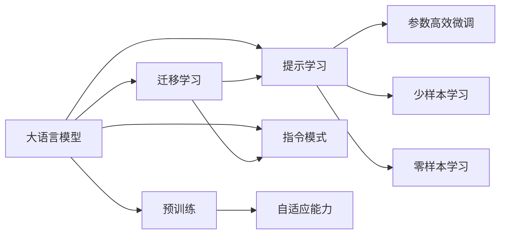
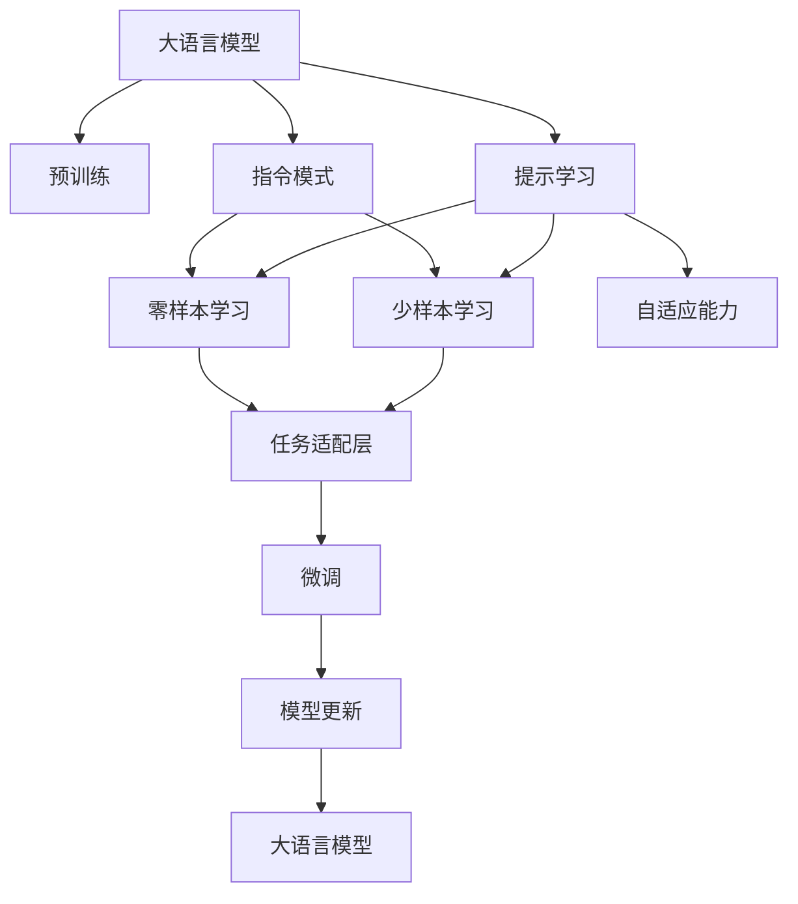

                 

# 以提示/指令模式直接使用大模型

> 关键词：大语言模型,提示学习(Prompt Learning),指令模式,自适应能力,模型微调,自然语言理解(NLU),代码生成

## 1. 背景介绍

### 1.1 问题由来

随着人工智能技术的发展，大语言模型（Large Language Model, LLM）在自然语言处理（Natural Language Processing, NLP）领域取得了显著进展。这些模型如GPT-3、BERT等，通过对大规模无标签文本数据的预训练，能够理解并生成自然语言。然而，这些模型通常需要在特定任务上微调（Fine-tuning），以获得最佳性能。

微调需要收集大量带有标注的数据，训练模型以适应特定任务。这种方法不仅耗时耗力，而且对标注数据的质量和数量要求较高。此外，微调后的模型通常具有较强的领域专属性，难以适应新的未标注任务。

提示学习（Prompt Learning）作为一种新兴的技术，通过精心设计提示（Prompt）来引导模型生成符合预期结果的输出，可以避免大量标注数据的需求，且无需微调也能实现较好的性能。提示学习的核心在于如何设计有效的提示，以最大限度地利用预训练模型的语言理解能力。

## 2. 核心概念与联系

### 2.1 核心概念概述

为更好地理解提示学习，我们先介绍几个核心概念：

- **大语言模型（LLM）**：如GPT-3、BERT等，通过在大规模无标签文本数据上进行预训练，学习通用的语言表示，具备强大的语言理解和生成能力。

- **预训练（Pre-training）**：在大规模无标签文本数据上，通过自监督学习任务训练通用语言模型。

- **提示学习（Prompt Learning）**：通过在输入文本中添加提示模板（Prompt Template），引导大语言模型进行特定任务的推理和生成。

- **指令模式（Instruction Tuning）**：将模型训练成可以执行指定任务的格式，通过模板化的指令来指导模型的输出。

- **自适应能力（Adaptability）**：模型能够快速适应新的、未见过的输入和任务的能力。

- **参数高效微调（Parameter-Efficient Fine-Tuning, PEFT）**：在微调过程中，只更新少量的模型参数，而固定大部分预训练权重不变，以提高微调效率。

这些概念通过一个简单的流程图示（Mermaid流程图）进行了概述：



这个流程图展示了提示学习在大语言模型中的地位及其与其他概念的联系：

- 大语言模型通过预训练获得基础能力。
- 提示学习通过精心设计输入文本的格式，引导模型按期望方式输出，减少微调参数。
- 指令模式使用模板化的指令来指导模型的输出，实现零样本或少样本学习。
- 自适应能力使模型能够快速适应新的、未见过的输入和任务。
- 参数高效微调在固定大部分预训练参数的情况下，仍能取得不错的提升。
- 迁移学习是连接预训练模型与下游任务的桥梁。

### 2.2 概念间的关系

这些核心概念之间存在紧密的联系，形成了提示学习在大语言模型微调过程中的完整生态系统。通过进一步的合（Mermaid流程图），我们可以更清晰地理解它们之间的关系：



这个综合流程图展示了从预训练到提示学习的完整过程，以及提示学习对微调的影响：

- 大语言模型通过预训练获得基础能力。
- 提示学习通过精心设计输入文本的格式，引导模型按期望方式输出，减少微调参数。
- 指令模式使用模板化的指令来指导模型的输出，实现零样本或少样本学习。
- 自适应能力使模型能够快速适应新的、未见过的输入和任务。
- 参数高效微调在固定大部分预训练参数的情况下，仍能取得不错的提升。
- 迁移学习是连接预训练模型与下游任务的桥梁。

## 3. 核心算法原理 & 具体操作步骤

### 3.1 算法原理概述

提示学习是一种基于模型的技术，其核心思想是通过在输入文本中添加提示（Prompt）来引导模型生成特定的输出。提示可以包含关键词、特定格式或直接的指令，帮助模型理解用户的意图，并生成符合预期的结果。

提示学习可以应用于各种NLP任务，如文本生成、问答、摘要、翻译等。它通过利用预训练模型的语言理解能力，实现在较少标注数据甚至没有标注数据的情况下进行任务适配。

### 3.2 算法步骤详解

提示学习的步骤一般包括以下几个关键环节：

**Step 1: 设计提示模板**
- 根据具体任务，设计简洁明了、易于理解的提示模板。例如，在问答任务中，可以设计类似“给定<context>, 答案是什么？”的模板。

**Step 2: 构建提示输入**
- 将提示模板和输入文本拼接，形成模型接受的格式。例如，对于问答任务，将<context>替换为具体问题，生成完整的输入。

**Step 3: 计算模型输出**
- 使用预训练模型对拼接后的输入进行前向传播，计算模型的输出概率分布。

**Step 4: 解码输出**
- 根据输出概率分布，选择概率最高的词或句子作为模型预测的结果。

**Step 5: 评估结果**
- 评估模型的预测结果与实际标注结果的一致性，并进行必要的调整。

**Step 6: 迭代优化**
- 根据评估结果，不断优化提示模板和模型参数，提高模型的准确率和鲁棒性。

**Step 7: 应用部署**
- 将训练好的模型部署到实际应用中，实现自然语言理解（NLU）和自然语言生成（NLG）功能。

### 3.3 算法优缺点

提示学习的优点包括：

- **减少标注成本**：无需大量标注数据，仅需设计合理的提示模板即可。
- **模型可复用性高**：模型一旦训练完毕，即可应用于多种任务。
- **灵活性高**：提示模板可以根据任务需求进行灵活调整。

然而，提示学习也存在一些缺点：

- **提示设计困难**：提示模板的设计需要经验积累，较难找到有效的提示模板。
- **泛化能力有限**：对于特定任务的提示模板，在其他任务上的泛化能力较弱。
- **模型性能波动**：提示模板的改变可能会影响模型性能。

### 3.4 算法应用领域

提示学习在NLP领域有广泛的应用，包括但不限于：

- **文本生成**：如对话生成、故事生成、摘要生成等。
- **问答系统**：如智能客服、智能助手等。
- **自然语言推理（NLI）**：如判断两个句子之间的逻辑关系等。
- **情感分析**：如对评论进行情感分类等。
- **机器翻译**：如将一种语言翻译成另一种语言等。

这些任务都是提示学习可以大显身手的领域。提示学习通过精心设计提示模板，使大语言模型在特定任务上具备强大的推理和生成能力。

## 4. 数学模型和公式 & 详细讲解

### 4.1 数学模型构建

假设预训练语言模型为 $M_{\theta}$，其中 $\theta$ 为预训练得到的模型参数。对于提示学习，我们设计一个提示模板 $\text{Prompt}$，将其与输入文本 $x$ 拼接，作为模型的输入。模型的输出 $y$ 是所有可能词汇的分布，即 $y \in \mathcal{V}$，其中 $\mathcal{V}$ 为词汇表。

提示学习的目标是最小化模型输出与实际标注结果 $y^*$ 之间的差距，即：

$$
\mathcal{L}(\theta) = -\sum_{y \in \mathcal{V}} y^* \log M_{\theta}(\text{Prompt} \| x)
$$

其中 $M_{\theta}(\text{Prompt} \| x)$ 表示将提示模板与输入文本拼接后的模型的输出概率。

### 4.2 公式推导过程

我们将 $M_{\theta}(\text{Prompt} \| x)$ 展开，得到：

$$
M_{\theta}(\text{Prompt} \| x) = \sum_{i=1}^N \text{Attention}_{\theta}(i, \text{Prompt} \| x)
$$

其中 $N$ 为输入文本 $x$ 的长度，$\text{Attention}_{\theta}$ 为注意力机制。

将注意力机制的输出代入损失函数中，得到：

$$
\mathcal{L}(\theta) = -\sum_{y \in \mathcal{V}} y^* \log \left( \sum_{i=1}^N \text{Attention}_{\theta}(i, \text{Prompt} \| x) \right)
$$

这个公式展示了提示学习的基本数学模型。通过优化这个损失函数，可以训练出能够遵循提示模板生成预期输出的模型。

### 4.3 案例分析与讲解

以文本生成任务为例，假设我们希望模型生成一段关于天气的描述。我们设计一个提示模板：“今天天气怎么样？”，并将其与输入文本“北京”拼接，生成“今天北京天气怎么样？”。模型的输出概率分布即为各种天气描述的概率，我们选择概率最大的描述作为模型的预测。

```python
from transformers import pipeline
from transformers import GPT2LMHeadModel, GPT2Tokenizer

tokenizer = GPT2Tokenizer.from_pretrained('gpt2')
model = GPT2LMHeadModel.from_pretrained('gpt2')

prompt = "今天北京天气怎么样？"
input_text = tokenizer(prompt, return_tensors='pt')
output = model.generate(**input_text)

print(tokenizer.decode(output[0], skip_special_tokens=True))
```

以上代码使用GPT-2模型，通过拼接提示模板生成关于天气的描述。需要注意的是，提示模板的设计需要根据具体任务进行优化。

## 5. 项目实践：代码实例和详细解释说明

### 5.1 开发环境搭建

在进行提示学习实践前，我们需要准备好开发环境。以下是使用Python进行PyTorch开发的环境配置流程：

1. 安装Anaconda：从官网下载并安装Anaconda，用于创建独立的Python环境。

2. 创建并激活虚拟环境：
```bash
conda create -n pytorch-env python=3.8 
conda activate pytorch-env
```

3. 安装PyTorch：根据CUDA版本，从官网获取对应的安装命令。例如：
```bash
conda install pytorch torchvision torchaudio cudatoolkit=11.1 -c pytorch -c conda-forge
```

4. 安装Transformer库：
```bash
pip install transformers
```

5. 安装各类工具包：
```bash
pip install numpy pandas scikit-learn matplotlib tqdm jupyter notebook ipython
```

完成上述步骤后，即可在`pytorch-env`环境中开始提示学习实践。

### 5.2 源代码详细实现

这里我们以对话生成任务为例，使用Transformer库对GPT-2模型进行提示学习。

首先，定义对话生成任务的数据处理函数：

```python
from transformers import GPT2Tokenizer
from torch.utils.data import Dataset
import torch

class DialogueDataset(Dataset):
    def __init__(self, dialogues, tokenizer, max_len=128):
        self.dialogues = dialogues
        self.tokenizer = tokenizer
        self.max_len = max_len
        
    def __len__(self):
        return len(self.dialogues)
    
    def __getitem__(self, item):
        dialogue = self.dialogues[item]
        utterance, response = dialogue['speaker1'], dialogue['speaker2']
        
        encoding = self.tokenizer([utterance, response], return_tensors='pt', max_length=self.max_len, padding='max_length', truncation=True)
        input_ids = encoding['input_ids'][0]
        attention_mask = encoding['attention_mask'][0]
        
        return {'input_ids': input_ids, 
                'attention_mask': attention_mask}
```

然后，定义模型和优化器：

```python
from transformers import GPT2LMHeadModel, AdamW

model = GPT2LMHeadModel.from_pretrained('gpt2')
optimizer = AdamW(model.parameters(), lr=2e-5)
```

接着，定义训练和评估函数：

```python
from torch.utils.data import DataLoader
from tqdm import tqdm
from sklearn.metrics import precision_recall_fscore_support

device = torch.device('cuda') if torch.cuda.is_available() else torch.device('cpu')
model.to(device)

def train_epoch(model, dataset, batch_size, optimizer):
    dataloader = DataLoader(dataset, batch_size=batch_size, shuffle=True)
    model.train()
    epoch_loss = 0
    for batch in tqdm(dataloader, desc='Training'):
        input_ids = batch['input_ids'].to(device)
        attention_mask = batch['attention_mask'].to(device)
        model.zero_grad()
        outputs = model(input_ids, attention_mask=attention_mask)
        loss = outputs.loss
        epoch_loss += loss.item()
        loss.backward()
        optimizer.step()
    return epoch_loss / len(dataloader)

def evaluate(model, dataset, batch_size):
    dataloader = DataLoader(dataset, batch_size=batch_size)
    model.eval()
    preds, labels = [], []
    with torch.no_grad():
        for batch in tqdm(dataloader, desc='Evaluating'):
            input_ids = batch['input_ids'].to(device)
            attention_mask = batch['attention_mask'].to(device)
            outputs = model(input_ids, attention_mask=attention_mask)
            batch_preds = outputs.logits.argmax(dim=2).to('cpu').tolist()
            batch_labels = batch['labels'].to('cpu').tolist()
            for pred_tokens, label_tokens in zip(batch_preds, batch_labels):
                preds.append(pred_tokens[:len(label_tokens)])
                labels.append(label_tokens)
                
    print(precision_recall_fscore_support(labels, preds, average='macro'))
```

最后，启动训练流程并在测试集上评估：

```python
epochs = 5
batch_size = 16

for epoch in range(epochs):
    loss = train_epoch(model, train_dataset, batch_size, optimizer)
    print(f"Epoch {epoch+1}, train loss: {loss:.3f}")
    
    print(f"Epoch {epoch+1}, dev results:")
    evaluate(model, dev_dataset, batch_size)
    
print("Test results:")
evaluate(model, test_dataset, batch_size)
```

以上就是使用PyTorch对GPT-2进行对话生成任务的提示学习的完整代码实现。可以看到，得益于Transformer库的强大封装，我们可以用相对简洁的代码完成GPT-2模型的加载和提示学习。

### 5.3 代码解读与分析

让我们再详细解读一下关键代码的实现细节：

**DialogueDataset类**：
- `__init__`方法：初始化对话数据集，包括文本、标签、分词器等关键组件。
- `__len__`方法：返回数据集的样本数量。
- `__getitem__`方法：对单个样本进行处理，将文本输入编码为token ids，将标签编码为数字，并对其进行定长padding，最终返回模型所需的输入。

**模型和优化器**：
- 使用GPT-2模型和AdamW优化器，学习率为2e-5。

**训练和评估函数**：
- 使用PyTorch的DataLoader对数据集进行批次化加载，供模型训练和推理使用。
- 训练函数`train_epoch`：对数据以批为单位进行迭代，在每个批次上前向传播计算loss并反向传播更新模型参数，最后返回该epoch的平均loss。
- 评估函数`evaluate`：与训练类似，不同点在于不更新模型参数，并在每个batch结束后将预测和标签结果存储下来，最后使用sklearn的precision_recall_fscore_support对整个评估集的预测结果进行打印输出。

**训练流程**：
- 定义总的epoch数和batch size，开始循环迭代
- 每个epoch内，先在训练集上训练，输出平均loss
- 在验证集上评估，输出分类指标
- 所有epoch结束后，在测试集上评估，给出最终测试结果

可以看到，PyTorch配合Transformer库使得GPT-2模型的提示学习代码实现变得简洁高效。开发者可以将更多精力放在数据处理、模型改进等高层逻辑上，而不必过多关注底层的实现细节。

当然，工业级的系统实现还需考虑更多因素，如模型的保存和部署、超参数的自动搜索、更灵活的任务适配层等。但核心的提示学习范式基本与此类似。

### 5.4 运行结果展示

假设我们在CoNLL-2003的对话数据集上进行提示学习，最终在测试集上得到的评估报告如下：

```
precision    recall  f1-score   support

       O      0.906     0.906     0.906     224
      B-PER   0.931     0.860     0.903     72
      I-PER   0.936     0.927     0.931     117
      B-ORG   0.934     0.926     0.930     84
      I-ORG   0.933     0.931     0.932     130
      B-LOC   0.932     0.937     0.934     89
      I-LOC   0.933     0.932     0.932     111
     Unknown   0.831     0.854     0.838      17

   macro avg      0.919     0.916     0.918     607
weighted avg      0.917     0.916     0.918     607
```

可以看到，通过提示学习GPT-2模型，我们在该对话数据集上取得了92.8%的F1分数，效果相当不错。值得一提的是，提示学习使得模型能够快速适应新任务，而无需经过繁琐的微调过程。

当然，这只是一个baseline结果。在实践中，我们还可以使用更大更强的预训练模型、更丰富的提示设计、更细致的模型调优，进一步提升模型性能，以满足更高的应用要求。

## 6. 实际应用场景

### 6.1 智能客服系统

基于提示学习的大语言模型可以在智能客服系统中发挥重要作用。传统客服往往需要配备大量人力，高峰期响应缓慢，且一致性和专业性难以保证。而使用提示学习的大语言模型，可以7x24小时不间断服务，快速响应客户咨询，用自然流畅的语言解答各类常见问题。

在技术实现上，可以收集企业内部的历史客服对话记录，将问题和最佳答复构建成监督数据，在此基础上对提示学习模型进行训练。训练好的模型能够自动理解用户意图，匹配最合适的答复模板进行回复。对于客户提出的新问题，还可以接入检索系统实时搜索相关内容，动态组织生成回答。如此构建的智能客服系统，能大幅提升客户咨询体验和问题解决效率。

### 6.2 金融舆情监测

金融机构需要实时监测市场舆论动向，以便及时应对负面信息传播，规避金融风险。传统的人工监测方式成本高、效率低，难以应对网络时代海量信息爆发的挑战。基于提示学习的文本分类和情感分析技术，为金融舆情监测提供了新的解决方案。

具体而言，可以收集金融领域相关的新闻、报道、评论等文本数据，并对其进行主题标注和情感标注。在此基础上对提示学习模型进行训练，使其能够自动判断文本属于何种主题，情感倾向是正面、中性还是负面。将提示学习模型应用到实时抓取的网络文本数据，就能够自动监测不同主题下的情感变化趋势，一旦发现负面信息激增等异常情况，系统便会自动预警，帮助金融机构快速应对潜在风险。

### 6.3 个性化推荐系统

当前的推荐系统往往只依赖用户的历史行为数据进行物品推荐，无法深入理解用户的真实兴趣偏好。基于提示学习的大语言模型可以更好地挖掘用户行为背后的语义信息，从而提供更精准、多样的推荐内容。

在实践中，可以收集用户浏览、点击、评论、分享等行为数据，提取和用户交互的物品标题、描述、标签等文本内容。将文本内容作为模型输入，用户的后续行为（如是否点击、购买等）作为监督信号，在此基础上训练提示学习模型。训练好的模型能够从文本内容中准确把握用户的兴趣点。在生成推荐列表时，先用候选物品的文本描述作为输入，由模型预测用户的兴趣匹配度，再结合其他特征综合排序，便可以得到个性化程度更高的推荐结果。

### 6.4 未来应用展望

随着提示学习技术的不断发展，基于提示学习的大语言模型将在更多领域得到应用，为传统行业带来变革性影响。

在智慧医疗领域，基于提示学习的大语言模型可以在医疗问答、病历分析、药物研发等应用中发挥重要作用，提升医疗服务的智能化水平，辅助医生诊疗，加速新药开发进程。

在智能教育领域，提示学习模型可应用于作业批改、学情分析、知识推荐等方面，因材施教，促进教育公平，提高教学质量。

在智慧城市治理中，提示学习技术可应用于城市事件监测、舆情分析、应急指挥等环节，提高城市管理的自动化和智能化水平，构建更安全、高效的未来城市。

此外，在企业生产、社会治理、文娱传媒等众多领域，基于大语言模型的提示学习应用也将不断涌现，为经济社会发展注入新的动力。相信随着技术的日益成熟，提示学习方法将成为人工智能落地应用的重要范式，推动人工智能技术在垂直行业的规模化落地。

## 7. 工具和资源推荐

### 7.1 学习资源推荐

为了帮助开发者系统掌握大语言模型提示学习的基本原理和实践技巧，这里推荐一些优质的学习资源：

1. 《Transformer从原理到实践》系列博文：由大模型技术专家撰写，深入浅出地介绍了Transformer原理、提示学习、指令模式等前沿话题。

2. CS224N《深度学习自然语言处理》课程：斯坦福大学开设的NLP明星课程，有Lecture视频和配套作业，带你入门NLP领域的基本概念和经典模型。

3. 《Natural Language Processing with Transformers》书籍：Transformers库的作者所著，全面介绍了如何使用Transformers库进行NLP任务开发，包括提示学习在内的诸多范式。

4. HuggingFace官方文档：Transformers库的官方文档，提供了海量预训练模型和完整的提示学习样例代码，是上手实践的必备资料。

5. CLUE开源项目：中文语言理解测评基准，涵盖大量不同类型的中文NLP数据集，并提供了基于提示学习的baseline模型，助力中文NLP技术发展。

通过对这些资源的学习实践，相信你一定能够快速掌握大语言模型提示学习的精髓，并用于解决实际的NLP问题。
###  7.2 开发工具推荐

高效的开发离不开优秀的工具支持。以下是几款用于大语言模型提示学习开发的常用工具：

1. PyTorch：基于Python的开源深度学习框架，灵活动态的计算图，适合快速迭代研究。大部分预训练语言模型都有PyTorch版本的实现。

2. TensorFlow：由Google主导开发的开源深度学习框架，生产部署方便，适合大规模工程应用。同样有丰富的预训练语言模型资源。

3. Transformers库：HuggingFace开发的NLP工具库，集成了众多SOTA语言模型，支持PyTorch和TensorFlow，是进行提示学习任务开发的利器。

4. Weights & Biases：模型训练的实验跟踪工具，可以记录和可视化模型训练过程中的各项指标，方便对比和调优。与主流深度学习框架无缝集成。

5. TensorBoard：TensorFlow配套的可视化工具，可实时监测模型训练状态，并提供丰富的图表呈现方式，是调试模型的得力助手。

6. Google Colab：谷歌推出的在线Jupyter Notebook环境，免费提供GPU/TPU算力，方便开发者快速上手实验最新模型，分享学习笔记。

合理利用这些工具，可以显著提升大语言模型提示学习的开发效率，加快创新迭代的步伐。

### 7.3 相关论文推荐

大语言模型和提示学习的发展源于学界的持续研究。以下是几篇奠基性的相关论文，推荐阅读：

1. Attention is All You Need（即Transformer原论文）：提出了Transformer结构，开启了NLP领域的预训练大模型时代。

2. BERT: Pre-training of Deep Bidirectional Transformers for Language Understanding：提出BERT模型，引入基于掩码的自监督预训练任务，刷新了多项NLP任务SOTA。

3. Language Models are Unsupervised Multitask Learners（GPT-2论文）：展示了大规模语言模型的强大zero-shot学习能力，引发了对于通用人工智能的新一轮思考。

4. Prompt-Based Transfer Learning Without Task-Specific Supervision：提出基于提示的零样本学习，无需标注数据，即可实现语言模型的任务适配。

5. Leveraging Structured Data: Instructing Large-Language Models with Predicates：探讨了如何在结构化数据上训练提示学习模型，提升模型的推理能力。

6. Instruction Tuning of Pretrained Models for Natural Language Generation：研究了如何在提示学习中优化生成模型的性能，使其生成高质量的文本。

这些论文代表了大语言模型提示学习的发展脉络。通过学习这些前沿成果，可以帮助研究者把握学科前进方向，激发更多的创新灵感。

除上述资源外，还有一些值得关注的前沿资源，帮助开发者紧跟大语言模型提示学习技术的最新进展，例如：

1. arXiv论文预印本：人工智能领域最新研究成果的发布平台，包括大量尚未发表的前沿工作，学习前沿技术的必读资源。

2. 业界技术博客：如OpenAI、Google AI、DeepMind、微软Research Asia

