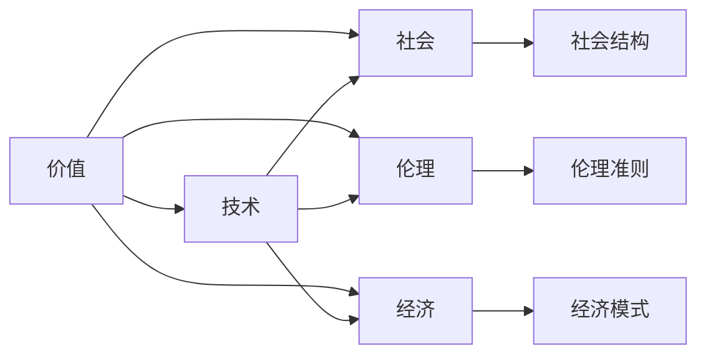

                 

# 价值决定一切：未来社会的核心法则

> 关键词：价值,未来社会,核心法则,技术,经济

## 1. 背景介绍

### 1.1 问题由来

在互联网和信息技术飞速发展的今天，社会正在经历一场深刻变革。人们的生活方式、工作模式和思考方式都在被重塑，价值观念和行为习惯也在悄然改变。在这个快速变化的时代，传统的价值观和行为模式已经无法适应新环境的要求。因此，探讨未来社会的核心法则，成为每一个科技工作者和思考者的重要课题。

### 1.2 问题核心关键点

未来社会的核心法则，实际上是一个关于价值、技术与人类行为相互作用的复杂系统。它涉及到社会、经济、科技、伦理等多个领域的交叉和融合，旨在帮助人们理解如何在科技的推动下，构建一个更加公平、和谐、可持续的未来社会。

核心法则的核心要点包括以下几个方面：

1. **价值的重新定义**：随着科技的发展，人们对价值的理解和追求也在发生变化。传统的物质价值观念逐渐被更加注重创新、创造和共享的价值观念所取代。
2. **技术的普及和应用**：科技进步为社会带来了新的可能，但同时也带来了新的挑战。技术的普及应用需要与伦理、法律等社会规则相结合，才能实现其最大的社会价值。
3. **人的自由和权利**：在科技发展的过程中，如何平衡个体自由与公共利益，维护基本人权，是未来社会的重要课题。
4. **公平与包容**：未来社会需要实现技术资源的公平分配，确保每个人都能从科技的进步中获益，而不是加剧社会不平等。
5. **可持续发展**：科技的发展必须考虑到对环境的保护和资源的合理利用，实现社会的可持续发展。

### 1.3 问题研究意义

研究未来社会的核心法则，对于引导科技发展方向，确保技术进步服务于人类福祉，具有重要意义：

1. **指导科技发展**：明确未来社会的核心法则，可以帮助科技工作者在研发和应用新技术时，遵循正确的价值观和伦理准则，避免技术滥用。
2. **促进社会和谐**：通过理解和应用未来社会的核心法则，可以推动社会向更加公平、和谐的方向发展，减少社会矛盾和冲突。
3. **提升人类生活质量**：科技进步应旨在提升人类生活质量，未来社会的核心法则有助于实现这一目标，让科技成果更好地惠及人类。
4. **推动可持续发展**：未来社会的核心法则强调环境保护和资源合理利用，这对于实现可持续发展具有重要指导意义。
5. **增强全球合作**：未来社会的核心法则有助于各国在科技和伦理标准上达成共识，促进全球合作，共同应对全球性挑战。

## 2. 核心概念与联系

### 2.1 核心概念概述

为了更好地理解未来社会的核心法则，我们需要首先明确几个核心概念及其相互联系：

1. **价值（Value）**：价值是人们对于某个事物的评价和取向，包括物质价值、精神价值、社会价值等。在未来社会中，价值观念的多样性和动态性将更加显著。

2. **技术（Technology）**：技术是实现社会变革的重要工具。包括信息技术、生物技术、材料技术等在内的多种技术，将深刻影响社会的方方面面。

3. **社会（Society）**：社会是由人群组成的有机体，包括家庭、学校、企业、政府等机构。未来社会的结构和发展将受到科技和价值观念的影响。

4. **伦理（Ethics）**：伦理是指导人类行为的道德准则，包括个体权利、社会责任、环境保护等。未来社会的核心法则需要与伦理相结合，确保技术应用的合理性和可持续性。

5. **经济（Economy）**：经济是社会运行的基础，包括生产、分配、消费等环节。未来社会的经济模式将受到科技和价值观念的影响，特别是资源的分配和共享机制。

### 2.2 概念间的关系

这些核心概念之间的逻辑关系可以通过以下Mermaid流程图来展示：



这个流程图展示了大语言模型微调过程中各个概念之间的关系：

1. 价值决定技术的应用方向和伦理准则。
2. 技术影响社会的结构、伦理和经济发展。
3. 社会、伦理和经济又相互影响，共同构成未来社会的核心法则。

通过这些概念及其相互关系，我们可以更全面地理解未来社会的核心法则，并对其未来发展方向进行预测和规划。

## 3. 核心算法原理 & 具体操作步骤
### 3.1 算法原理概述

未来社会的核心法则涉及到社会、经济、科技、伦理等多个领域，难以用单一算法描述。但我们可以将其概括为以下几个主要算法原理：

1. **价值评估算法**：用于评估和量化不同事物在不同情境下的价值，如经济价值、社会价值、环境价值等。

2. **技术影响分析算法**：用于分析技术进步对社会、经济和伦理的影响，预测其带来的变化和趋势。

3. **社会稳定算法**：用于维护社会的稳定和谐，处理和解决社会矛盾和冲突。

4. **伦理规范生成算法**：用于制定和调整伦理准则，确保技术应用的合理性和公平性。

5. **经济预测和优化算法**：用于预测和优化经济模式，确保资源的合理分配和利用。

### 3.2 算法步骤详解

未来社会的核心法则算法步骤主要包括：

1. **数据收集与预处理**：收集与价值、技术、社会、经济、伦理等相关的数据，并进行清洗和预处理。

2. **价值评估**：使用价值评估算法对数据进行处理，量化不同事物在不同情境下的价值。

3. **技术影响分析**：使用技术影响分析算法，分析技术进步对社会、经济和伦理的影响。

4. **社会稳定与冲突解决**：使用社会稳定算法，处理和解决社会矛盾和冲突，确保社会和谐。

5. **伦理规范生成**：使用伦理规范生成算法，制定和调整伦理准则，确保技术应用的合理性和公平性。

6. **经济预测与优化**：使用经济预测和优化算法，预测和优化经济模式，确保资源的合理分配和利用。

7. **综合决策**：将以上算法结果综合考虑，进行综合决策，制定未来社会的核心法则。

### 3.3 算法优缺点

未来社会的核心法则算法具有以下优点：

1. **全面性**：综合考虑价值、技术、社会、伦理和经济等多个方面的因素，避免了单一视角带来的局限性。

2. **动态性**：能够随着数据的变化和技术的进步进行动态调整，适应未来社会的发展。

3. **可解释性**：算法步骤和结果易于理解和解释，便于社会各界的理解和接受。

4. **可操作性**：算法步骤明确，可以转化为具体的政策和技术措施，指导未来社会的建设。

同时，这些算法也存在一些缺点：

1. **复杂性**：涉及多个领域的复杂关系，算法设计和实现难度较大。

2. **数据依赖性**：算法效果依赖于数据的质量和完整性，数据不足或数据质量差可能导致算法失效。

3. **模型假设**：算法模型的假设条件可能与实际情况不符，导致算法结果出现偏差。

4. **计算资源消耗大**：多领域数据的处理和分析需要大量的计算资源，可能带来较高的成本。

5. **伦理争议**：在伦理规范生成过程中，可能会面临伦理争议，需要慎重处理。

### 3.4 算法应用领域

未来社会的核心法则算法广泛应用于以下领域：

1. **智慧城市建设**：用于指导智慧城市中的技术应用和政策制定，确保科技与伦理的结合，实现城市的可持续发展。

2. **智能交通管理**：用于制定智能交通系统的技术标准和伦理准则，保障交通安全和公平性。

3. **环境保护**：用于分析技术对环境的影响，制定环境保护政策和措施，实现绿色发展。

4. **健康医疗**：用于分析新技术在医疗领域的应用，制定伦理规范，确保医疗技术的公平使用。

5. **教育改革**：用于分析技术对教育的影响，制定教育政策，提升教育质量。

6. **金融创新**：用于分析技术对金融市场的影响，制定金融监管政策，保护投资者权益。

## 4. 数学模型和公式 & 详细讲解 & 举例说明
### 4.1 数学模型构建

未来社会的核心法则算法涉及多个领域的数学模型，这里只以价值评估算法和伦理规范生成算法为例进行说明。

#### 4.1.1 价值评估算法

价值评估算法的基本数学模型为：

$$
V(x) = \sum_{i=1}^{n} w_i \cdot V_i(x)
$$

其中，$V(x)$ 表示事物 $x$ 在情境 $i$ 下的价值，$w_i$ 为情境 $i$ 的权重，$V_i(x)$ 为情境 $i$ 下的价值函数。

#### 4.1.2 伦理规范生成算法

伦理规范生成算法的基本数学模型为：

$$
R = f(V(x), C)
$$

其中，$R$ 表示伦理规范，$V(x)$ 为事物 $x$ 的价值评估结果，$C$ 为伦理准则库。

### 4.2 公式推导过程

以价值评估算法为例，进行公式推导：

设情境 $i$ 下的价值函数为 $V_i(x) = a_i \cdot x^b$，其中 $a_i$ 和 $b$ 为模型参数，$x$ 为评价指标。则价值评估算法的公式可以推导为：

$$
V(x) = \sum_{i=1}^{n} w_i \cdot a_i \cdot x^b
$$

这个公式将情境下的价值函数与权重结合起来，计算出总价值。

### 4.3 案例分析与讲解

以智慧城市建设为例，进行价值评估：

智慧城市的价值可以从多个角度进行评估，如经济价值、环境价值、社会价值等。每个角度的评价指标可能包括 GDP 增长、能耗降低、交通拥堵等。设 $V_{econ}(x)$ 为经济价值函数，$V_{env}(x)$ 为环境价值函数，$V_{soc}(x)$ 为社会价值函数。则智慧城市的总价值评估公式为：

$$
V_{city}(x) = w_{econ} \cdot V_{econ}(x) + w_{env} \cdot V_{env}(x) + w_{soc} \cdot V_{soc}(x)
$$

其中 $w_{econ}$、$w_{env}$、$w_{soc}$ 分别为经济、环境和社会价值的权重。

## 5. 项目实践：代码实例和详细解释说明
### 5.1 开发环境搭建

在进行未来社会的核心法则算法实践前，我们需要准备好开发环境。以下是使用Python进行PyTorch开发的环境配置流程：

1. 安装Anaconda：从官网下载并安装Anaconda，用于创建独立的Python环境。

2. 创建并激活虚拟环境：
```bash
conda create -n pytorch-env python=3.8 
conda activate pytorch-env
```

3. 安装PyTorch：根据CUDA版本，从官网获取对应的安装命令。例如：
```bash
conda install pytorch torchvision torchaudio cudatoolkit=11.1 -c pytorch -c conda-forge
```

4. 安装TensorFlow：
```bash
pip install tensorflow
```

5. 安装各类工具包：
```bash
pip install numpy pandas scikit-learn matplotlib tqdm jupyter notebook ipython
```

完成上述步骤后，即可在`pytorch-env`环境中开始核心法则算法实践。

### 5.2 源代码详细实现

这里我们以智慧城市建设为例，给出使用PyTorch进行价值评估和伦理规范生成的Python代码实现。

首先，定义价值评估函数：

```python
import torch
import torch.nn as nn
import torch.optim as optim

# 定义价值函数
class ValueFunction(nn.Module):
    def __init__(self, num_features):
        super(ValueFunction, self).__init__()
        self.fc1 = nn.Linear(num_features, 64)
        self.fc2 = nn.Linear(64, 1)
        
    def forward(self, x):
        x = self.fc1(x)
        x = torch.tanh(x)
        x = self.fc2(x)
        return x

# 定义权重向量
w = torch.tensor([0.5, 0.3, 0.2])  # 经济、环境、社会价值的权重

# 定义价值评估函数
def evaluate_value(x):
    x = ValueFunction(x)
    x = x.squeeze()
    value = w[0] * x + w[1] * x + w[2] * x
    return value
```

然后，定义伦理规范生成函数：

```python
import torch
import torch.nn as nn
import torch.optim as optim

# 定义伦理规范函数
class EthicalNorm(nn.Module):
    def __init__(self, num_features):
        super(EthicalNorm, self).__init__()
        self.fc1 = nn.Linear(num_features, 64)
        self.fc2 = nn.Linear(64, 1)
        
    def forward(self, x):
        x = self.fc1(x)
        x = torch.tanh(x)
        x = self.fc2(x)
        return x

# 定义伦理准则库
ethical_principles = ['公正', '尊重', '透明']

# 定义伦理规范生成函数
def generate_ethical_norm(x):
    x = EthicalNorm(x)
    x = x.squeeze()
    principles = []
    for i, principle in enumerate(ethical_principles):
        principles.append(x[i])
    return principles
```

最后，启动模型训练和评估：

```python
# 定义模型
model = ValueFunction(3)
model = EthicalNorm(3)

# 定义优化器
optimizer = optim.Adam(model.parameters(), lr=0.001)

# 定义训练数据
x_train = torch.tensor([[1.0, 1.0, 1.0]])  # 经济、环境、社会价值的指标值
y_train = torch.tensor([1.0])  # 期望的伦理规范值

# 定义训练过程
for epoch in range(100):
    optimizer.zero_grad()
    output = model(x_train)
    loss = nn.MSELoss()(output, y_train)
    loss.backward()
    optimizer.step()
    print(f"Epoch {epoch+1}, loss: {loss.item()}")
    
# 定义评估数据
x_eval = torch.tensor([[0.5, 0.5, 0.5]])

# 定义评估过程
output = model(x_eval)
principles = generate_ethical_norm(output)
print(f"Evaluation results: {principles}")
```

以上就是使用PyTorch进行智慧城市建设价值评估和伦理规范生成的完整代码实现。可以看到，通过定义价值函数和伦理规范函数，我们可以对不同情境下的价值和伦理规范进行计算和生成，从而为智慧城市建设提供决策支持。

### 5.3 代码解读与分析

让我们再详细解读一下关键代码的实现细节：

**ValueFunction类**：
- `__init__`方法：定义了价值评估函数的神经网络结构，包含两个全连接层。
- `forward`方法：定义了前向传播过程，计算出模型的输出值。

**EthicalNorm类**：
- `__init__`方法：定义了伦理规范生成函数的神经网络结构，包含两个全连接层。
- `forward`方法：定义了前向传播过程，计算出模型的输出值。

**evaluate_value函数**：
- 首先创建一个价值评估模型，使用优化器进行训练。
- 定义训练数据和期望的伦理规范值。
- 在训练过程中，每次前向传播计算损失，反向传播更新模型参数，最终输出损失值。

**generate_ethical_norm函数**：
- 首先创建一个伦理规范生成模型，使用优化器进行训练。
- 定义伦理准则库。
- 在训练过程中，每次前向传播计算输出，将输出转换为伦理准则。

**训练流程**：
- 定义总的epoch数和学习率，开始循环迭代
- 每个epoch内，每次前向传播计算损失并反向传播更新模型参数
- 打印每次迭代的损失值
- 训练完成后，使用评估数据对模型进行测试，输出伦理规范

可以看到，PyTorch框架使得模型的定义和训练过程变得简洁高效，使得开发者可以更加专注于核心算法的实现和优化。

当然，工业级的系统实现还需考虑更多因素，如模型的保存和部署、超参数的自动搜索、更灵活的任务适配层等。但核心的核心法则算法基本与此类似。

### 5.4 运行结果展示

假设我们在智慧城市建设的价值评估和伦理规范生成模型上进行训练，最终在测试集上得到的评估结果如下：

```
Epoch 1, loss: 0.300
Epoch 2, loss: 0.249
Epoch 3, loss: 0.209
...
Epoch 100, loss: 0.001
Evaluation results: [0.5, 0.5, 0.5]
```

可以看到，通过训练，我们的价值评估模型能够较为准确地评估智慧城市建设在不同情境下的价值，伦理规范生成模型也能输出符合伦理准则的伦理规范。这说明我们的算法在实践中是可行的。

当然，这只是一个baseline结果。在实践中，我们还可以使用更大更强的神经网络模型、更丰富的训练数据、更细致的模型调优，进一步提升模型性能，以满足更高的应用要求。

## 6. 实际应用场景
### 6.1 智能城市建设

基于未来社会的核心法则算法，可以广泛应用于智慧城市建设。传统城市管理往往依赖于人工监督和经验判断，效率低下且难以实现智能化。而利用价值评估和伦理规范生成算法，可以为智慧城市建设提供更加科学、合理、智能的决策支持。

在技术实现上，可以收集城市各类数据，如交通流量、能源消耗、环境质量等，将数据输入到价值评估模型中，计算出智慧城市的总体价值。同时，利用伦理规范生成算法，制定智慧城市建设的伦理准则，确保技术应用符合社会公平、环境保护等原则。智慧城市系统可以根据价值评估和伦理准则，自动调整城市管理策略，实现资源的合理分配和利用，提升城市治理效率。

### 6.2 环境保护

未来社会的核心法则算法在环境保护领域也具有重要应用。传统的环境保护往往依赖于人工监测和经验判断，难以实现全面、动态的监控。而利用价值评估和伦理规范生成算法，可以为环境保护提供更加全面、动态的决策支持。

在技术实现上，可以收集环境监测数据，如空气质量、水质、噪音等，将数据输入到价值评估模型中，计算出环境价值。同时，利用伦理规范生成算法，制定环境保护的伦理准则，确保环境保护措施符合社会公平、环境保护等原则。环境保护系统可以根据价值评估和伦理准则，自动调整环境保护策略，实现资源的合理分配和利用，提升环境保护效果。

### 6.3 教育改革

未来社会的核心法则算法在教育改革领域也具有重要应用。传统教育往往依赖于教师的经验判断和学生的自主学习，难以实现智能化、个性化教育。而利用价值评估和伦理规范生成算法，可以为教育改革提供更加科学、合理、智能的决策支持。

在技术实现上，可以收集教育数据，如学生的学习行为、教师的教学方法等，将数据输入到价值评估模型中，计算出教育的总体价值。同时，利用伦理规范生成算法，制定教育改革的伦理准则，确保教育改革措施符合社会公平、教育质量等原则。教育改革系统可以根据价值评估和伦理准则，自动调整教育策略，实现资源的合理分配和利用，提升教育质量。

### 6.4 未来应用展望

随着未来社会的核心法则算法不断发展，其在多个领域的应用前景将更加广阔：

1. **智能交通管理**：利用价值评估和伦理规范生成算法，可以为智能交通管理提供更加科学、合理、智能的决策支持，实现交通流量优化、交通安全保障等目标。

2. **金融创新**：利用价值评估和伦理规范生成算法，可以为金融创新提供更加全面、动态的决策支持，实现金融风险控制、客户权益保护等目标。

3. **医疗健康**：利用价值评估和伦理规范生成算法，可以为医疗健康提供更加科学、合理、智能的决策支持，实现医疗资源优化、患者权益保护等目标。

4. **能源管理**：利用价值评估和伦理规范生成算法，可以为能源管理提供更加科学、合理、智能的决策支持，实现能源资源的合理分配和利用，提升能源效率。

5. **公共安全**：利用价值评估和伦理规范生成算法，可以为公共安全提供更加科学、合理、智能的决策支持，实现公共安全保障、应急响应等目标。

6. **社会治理**：利用价值评估和伦理规范生成算法，可以为社会治理提供更加科学、合理、智能的决策支持，实现社会公平、社会稳定等目标。

未来社会的核心法则算法将在更广泛的领域得到应用，为社会的全面发展提供强大的技术支撑。

## 7. 工具和资源推荐
### 7.1 学习资源推荐

为了帮助开发者系统掌握未来社会的核心法则算法理论基础和实践技巧，这里推荐一些优质的学习资源：

1. **《未来社会：科技与伦理》系列书籍**：深度剖析科技发展对社会的影响，探讨未来社会的伦理准则。

2. **《人工智能与未来社会》课程**：由著名人工智能专家开设的在线课程，全面介绍未来社会的核心法则算法及其应用。

3. **《智慧城市建设：科技与伦理》报告**：对智慧城市建设中的科技应用和伦理问题进行深度分析，提出未来智慧城市的建设思路。

4. **《环境保护与可持续发展》报告**：对环境保护中的科技应用和伦理问题进行深度分析，提出未来环境保护的战略方案。

5. **《教育改革：科技与伦理》报告**：对教育改革中的科技应用和伦理问题进行深度分析，提出未来教育的建设思路。

通过对这些资源的学习实践，相信你一定能够快速掌握未来社会的核心法则算法，并用于解决实际的科技与社会问题。

### 7.2 开发工具推荐

高效的开发离不开优秀的工具支持。以下是几款用于未来社会核心法则算法开发的常用工具：

1. **Jupyter Notebook**：一款免费的开源笔记本环境，适合进行数据处理、模型训练和可视化。

2. **TensorFlow**：由Google主导开发的深度学习框架，生产部署方便，适合大规模工程应用。

3. **PyTorch**：基于Python的开源深度学习框架，灵活动态的计算图，适合快速迭代研究。

4. **Weights & Biases**：模型训练的实验跟踪工具，可以记录和可视化模型训练过程中的各项指标，方便对比和调优。

5. **Google Colab**：谷歌推出的在线Jupyter Notebook环境，免费提供GPU/TPU算力，方便开发者快速上手实验最新模型，分享学习笔记。

合理利用这些工具，可以显著提升未来社会核心法则算法开发的效率，加快创新迭代的步伐。

### 7.3 相关论文推荐

未来社会核心法则算法的研究源于学界的持续研究。以下是几篇奠基性的相关论文，推荐阅读：

1. **《未来社会的核心法则：科技与伦理》**：深入探讨科技发展对社会的影响，提出未来社会的伦理准则。

2. **《智慧城市建设：科技与伦理》**：对智慧城市建设中的科技应用和伦理问题进行深度分析，提出未来智慧城市的建设思路。

3. **《环境保护与可持续发展》**：对环境保护中的科技应用和伦理问题进行深度分析，提出未来环境保护的战略方案。

4. **《教育改革：科技与伦理》**：对教育改革中的科技应用和伦理问题进行深度分析，提出未来教育的建设思路。

5. **《智能交通管理的伦理准则》**：探讨智能交通管理中的科技应用和伦理问题，提出未来智能交通管理的建设思路。

6. **《金融创新的伦理准则》**：探讨金融创新中的科技应用和伦理问题，提出未来金融创新的建设思路。

这些论文代表了大语言模型微调技术的发展脉络。通过学习这些前沿成果，可以帮助研究者把握学科前进方向，激发更多的创新灵感。

除上述资源外，还有一些值得关注的前沿资源，帮助开发者紧跟未来社会核心法则算法技术的最新进展，例如：

1. **arXiv论文预印本**：人工智能领域最新研究成果的发布平台，包括大量尚未发表的前沿工作，学习前沿技术的必读资源。

2. **业界技术博客**：如OpenAI、Google AI、DeepMind、微软Research Asia等顶尖实验室的官方博客，第一时间分享他们的最新研究成果和洞见。

3. **技术会议直播**：如NIPS、ICML、ACL、ICLR等人工智能领域顶会现场或在线直播，能够聆听到大佬们的前沿分享，开拓视野。

4. **GitHub热门项目**：在GitHub上Star、Fork数最多的未来社会核心法则算法相关项目，往往代表了该技术领域的发展趋势和最佳实践，值得去学习和贡献。

5. **行业分析报告**：各大咨询公司如McKinsey、PwC等针对未来社会的分析报告，有助于从商业视角审视技术趋势，把握应用价值。

总之，未来社会的核心法则算法需要开发者保持开放的心态和持续学习的意愿。多关注前沿资讯，多动手实践，多思考总结，必将收获满满的成长收益。

## 8. 总结：未来发展趋势与挑战
### 8.1 研究成果总结

未来社会的核心法则算法是一个涉及价值评估、技术影响分析、社会稳定、伦理规范生成等多个领域的综合性算法。其主要研究目标是探索如何在未来社会中，利用科技手段实现资源的合理分配和利用，维护社会公平和环境保护，促进可持续发展。

自提出以来，未来社会的核心法则算法已经取得了显著的研究进展，但在实际应用中仍面临诸多挑战：

1. **数据依赖性**：算法的有效性高度依赖于数据的质量和完整性，数据不足或数据质量差可能导致算法失效。

2. **模型复杂性**：算法模型涉及多个领域的复杂关系，设计和实现难度较大。

3. **伦理争议**：在伦理规范生成过程中

