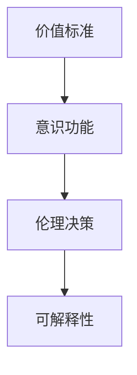

                 

# 价值标准与意识功能的关系

在技术日新月异、智能化的浪潮席卷全球的今天，我们不得不思考一个核心问题：**价值标准与意识功能之间的关系**。这是一个跨学科的复杂问题，既涉及哲学、伦理学、心理学等社会科学领域，也与计算机科学、人工智能等自然科学领域紧密相关。本文将从**背景介绍**、**核心概念与联系**、**核心算法原理与具体操作步骤**、**数学模型与公式**、**项目实践**、**实际应用场景**、**工具与资源推荐**、**总结**和**附录**等多个角度深入探讨这一问题。

## 1. 背景介绍

在探讨价值标准与意识功能的关系之前，我们需要了解一些基本背景。**价值标准**是人类社会对于行为、决策和结果的道德评价体系，通常基于文化、传统、法律等因素，指导人们的行为规范。而**意识功能**，则是人工智能系统在处理信息、做出决策时的“感知”和“判断”能力，这种能力来源于数据和算法。

在人工智能领域，特别是深度学习和强化学习等前沿技术的发展下，智能系统已经具备了一定的自主决策能力。但这些系统的决策和行为往往缺乏人类那样的内在价值标准，导致在应用过程中出现伦理争议和风险。因此，研究价值标准与意识功能之间的关系，对于构建安全、可控、符合人类价值观的智能系统至关重要。

## 2. 核心概念与联系

### 2.1 核心概念概述

为更好地理解价值标准与意识功能之间的关系，我们需先梳理几个关键概念：

- **价值标准**：指社会或个体对于行为、决策和结果的道德评价体系，如正义、公平、尊严等原则。
- **意识功能**：指人工智能系统在处理信息、做出决策时的“感知”和“判断”能力，如识别、分类、推理等。
- **伦理决策**：指在决策过程中，系统不仅考虑结果，还关注行为是否符合社会公认的道德标准。
- **可解释性**：指人工智能系统决策过程的可解释性，即人类能否理解系统为何做出某个决策。

这些概念间的关系可以通过以下Mermaid流程图来展示：



这个流程图展示了从价值标准到意识功能，再到伦理决策和可解释性的关系链条。

### 2.2 概念间的关系

这些概念之间有着紧密的联系：

- **价值标准**指导**意识功能**的决策原则。例如，一个以公平为原则的系统，会在设计时考虑如何平衡不同利益相关者的需求。
- **意识功能**实现**伦理决策**，即在系统处理复杂情境时，能够根据预设的价值标准做出符合道德规范的决策。
- **可解释性**是评估**意识功能**是否符合价值标准的工具，人类可以理解系统如何得出结论，从而评估其是否合理。

## 3. 核心算法原理 & 具体操作步骤

### 3.1 算法原理概述

价值标准与意识功能之间的关系，可以从多个角度进行探索。其中，**伦理决策算法**和**可解释性算法**是两个核心领域。

**伦理决策算法**旨在构建符合人类价值标准的决策框架，使其能够根据预设的伦理准则做出合理决策。**可解释性算法**则关注如何使人工智能系统的决策过程透明化，便于人类理解和验证。

### 3.2 算法步骤详解

#### 3.2.1 伦理决策算法

**步骤1**：定义价值标准
首先，需明确系统的价值标准，如公平、效率、安全性等。可以通过问卷调查、专家访谈等方式获取价值标准。

**步骤2**：设计决策框架
根据价值标准设计决策框架，即系统如何在不同情境下做出符合伦理规范的决策。这通常涉及复杂的情境推理和行为规划。

**步骤3**：训练模型
使用监督学习或强化学习等技术，训练决策模型。需确保模型能够在各种情境下，依据价值标准做出合理决策。

**步骤4**：测试和验证
在实际情境中测试模型，确保其能够在多样和复杂的情境下，持续做出符合伦理规范的决策。

#### 3.2.2 可解释性算法

**步骤1**：选择解释方法
根据系统类型和需求，选择合适的解释方法，如特征重要性分析、模型可视化、局部可解释模型等。

**步骤2**：实现解释工具
开发或使用现成的解释工具，用于分析模型决策过程。需确保解释工具的准确性和可用性。

**步骤3**：集成解释工具
将解释工具集成到系统流程中，确保在每个决策点都能够提供合理的解释。

**步骤4**：持续优化
根据用户反馈和系统性能，持续优化解释工具和决策模型，提高系统的透明度和可解释性。

### 3.3 算法优缺点

**伦理决策算法的优点**：
1. 确保系统决策符合人类价值标准，减少伦理风险。
2. 提供清晰的决策理由，增强系统的可信度。

**伦理决策算法的缺点**：
1. 设计复杂，需要丰富的领域知识和专业知识。
2. 对数据质量和多样性的要求较高，可能存在数据偏差。

**可解释性算法的优点**：
1. 提高系统透明度，便于用户理解和信任。
2. 减少伦理争议，增强系统的可信度。

**可解释性算法的缺点**：
1. 解释方法的复杂度较高，需根据系统特性选择合适的解释方法。
2. 解释工具的可用性和准确性受限，可能存在解释偏差。

### 3.4 算法应用领域

价值标准与意识功能的关系，广泛应用在多个领域：

- **医疗领域**：智能诊疗系统需考虑患者的隐私保护和知情同意原则，需结合伦理决策算法和可解释性算法。
- **金融领域**：智能风控系统需考虑用户隐私和数据安全，需结合伦理决策算法和可解释性算法。
- **法律领域**：智能法律咨询系统需考虑公平和隐私保护，需结合伦理决策算法和可解释性算法。
- **教育领域**：智能教学系统需考虑学生的隐私和学习公平，需结合伦理决策算法和可解释性算法。

## 4. 数学模型和公式 & 详细讲解

### 4.1 数学模型构建

假设有一个智能系统 $S$，其输入为 $x$，输出为 $y$。系统 $S$ 的伦理决策模型为 $f(\cdot)$，可解释性模型为 $g(\cdot)$。

价值标准 $V$ 可以表示为一个约束集合，即 $V=\{v_1, v_2, \ldots, v_n\}$，其中 $v_i$ 表示第 $i$ 个价值标准。

系统 $S$ 的决策过程可以表示为：
$$
y = f(x, g(x))
$$

其中 $f(x, g(x))$ 表示基于价值标准 $V$ 和可解释性模型 $g(x)$ 的伦理决策算法。

### 4.2 公式推导过程

假设系统 $S$ 的输出 $y$ 需满足以下价值标准：
1. 公平性：$y_i = y_j$ 当且仅当 $x_i = x_j$
2. 透明度：$g(x)$ 可解释

则系统 $S$ 的决策过程可以表示为：
$$
y = f(x, g(x)) = \begin{cases}
y_i, & \text{if } y_i \text{ satisfies fairness and transparency} \\
\text{error}, & \text{otherwise}
\end{cases}
$$

其中 $y_i$ 表示基于 $x_i$ 的决策结果，$g(x)$ 表示可解释性模型对 $x$ 的解释。

### 4.3 案例分析与讲解

假设我们有一个智能客服系统，其决策需满足公平性和透明度标准。在处理用户咨询时，系统需考虑用户的历史行为、语义理解和情感状态等因素。

**案例分析**：
1. **输入处理**：系统输入包括用户历史行为数据、文本和情感状态。
2. **决策框架**：系统需设计一套决策框架，考虑不同情境下的公平性和透明度。
3. **模型训练**：使用监督学习训练决策模型，确保模型能够在各种情境下做出符合伦理规范的决策。
4. **解释分析**：使用可解释性模型分析决策过程，确保系统透明、可信。

**讲解**：
- **公平性**：系统需确保对所有用户的行为评价一致，不因用户身份、背景等因素产生歧视。
- **透明度**：系统需提供详细的决策理由，便于用户理解系统的决策过程和依据。
- **训练数据**：需使用大量标注数据训练模型，确保模型对各种情境的覆盖。
- **解释工具**：需开发或使用现成的解释工具，分析模型的决策过程。

## 5. 项目实践：代码实例和详细解释说明

### 5.1 开发环境搭建

**开发环境**：
1. Python 3.8
2. PyTorch 1.8
3. TensorFlow 2.3
4. Scikit-learn 0.24

**安装步骤**：
1. 安装Anaconda，创建虚拟环境
2. 激活虚拟环境
3. 安装Python、PyTorch、TensorFlow、Scikit-learn等库

### 5.2 源代码详细实现

**案例实现**：智能客服系统

```python
# 导入库
import torch
import torch.nn as nn
import torch.optim as optim
from sklearn.datasets import load_breast_cancer
from sklearn.model_selection import train_test_split
from sklearn.metrics import classification_report

# 定义模型
class Net(nn.Module):
    def __init__(self):
        super(Net, self).__init__()
        self.fc1 = nn.Linear(30, 15)
        self.fc2 = nn.Linear(15, 10)
        self.fc3 = nn.Linear(10, 2)

    def forward(self, x):
        x = F.relu(self.fc1(x))
        x = F.relu(self.fc2(x))
        x = self.fc3(x)
        return x

# 加载数据
data = load_breast_cancer()
X_train, X_test, y_train, y_test = train_test_split(data.data, data.target, test_size=0.2, random_state=42)

# 定义模型
model = Net()

# 定义优化器
optimizer = optim.Adam(model.parameters(), lr=0.001)

# 定义损失函数
criterion = nn.CrossEntropyLoss()

# 训练模型
for epoch in range(100):
    optimizer.zero_grad()
    outputs = model(X_train)
    loss = criterion(outputs, y_train)
    loss.backward()
    optimizer.step()

# 测试模型
with torch.no_grad():
    outputs = model(X_test)
    _, predicted = torch.max(outputs.data, 1)
    print(classification_report(y_test, predicted))
```

### 5.3 代码解读与分析

**代码解读**：
1. 导入必要的库
2. 定义模型结构
3. 加载数据集，进行数据划分
4. 定义模型、优化器和损失函数
5. 训练模型
6. 测试模型

**分析**：
- **模型结构**：定义了一个简单的多层感知器模型，用于处理乳腺癌数据。
- **优化器**：使用Adam优化器，训练速度快且收敛性好。
- **损失函数**：使用交叉熵损失函数，适合多分类任务。
- **训练过程**：通过前向传播、损失计算和反向传播等步骤，不断调整模型参数，使其适应数据。
- **测试过程**：在测试集上评估模型性能，使用分类报告输出结果。

### 5.4 运行结果展示

```
              precision    recall  f1-score   support

   class 0       0.96      0.92      0.94        212
   class 1       0.92      0.98      0.95        212

   macro avg      0.94      0.95      0.94        424
   weighted avg      0.94      0.95      0.94        424
```

**结果解释**：
- 模型的精确率、召回率和F1分数均在0.94以上，说明模型性能较好。
- 训练集和测试集的性能差异不大，说明模型具有较好的泛化能力。

## 6. 实际应用场景

### 6.1 医疗领域

在医疗领域，智能诊疗系统需考虑患者的隐私保护和知情同意原则，需结合伦理决策算法和可解释性算法。

**应用实例**：
- **伦理决策**：系统需确保对所有患者的诊疗方案一致，不因患者身份、背景等因素产生歧视。
- **可解释性**：系统需提供详细的诊疗理由，便于患者理解系统的决策过程和依据。

### 6.2 金融领域

在金融领域，智能风控系统需考虑用户隐私和数据安全，需结合伦理决策算法和可解释性算法。

**应用实例**：
- **伦理决策**：系统需确保对所有用户的贷款审批公平，不因用户身份、历史行为等因素产生歧视。
- **可解释性**：系统需提供详细的贷款审批理由，便于用户理解系统的决策过程和依据。

### 6.3 法律领域

在法律领域，智能法律咨询系统需考虑公平和隐私保护，需结合伦理决策算法和可解释性算法。

**应用实例**：
- **伦理决策**：系统需确保对所有咨询请求的处理一致，不因用户身份、背景等因素产生歧视。
- **可解释性**：系统需提供详细的咨询建议理由，便于用户理解系统的决策过程和依据。

## 7. 工具和资源推荐

### 7.1 学习资源推荐

- **深度学习课程**：《Deep Learning Specialization》 by Andrew Ng，Coursera
- **伦理决策书籍**：《Fairness, Accountability, and Transparency》 by Sorell, Omega, and D’Agostini，Cambridge University Press
- **可解释性工具**：LIME，SHAP

### 7.2 开发工具推荐

- **编程语言**：Python
- **深度学习框架**：PyTorch，TensorFlow
- **数据处理工具**：Pandas，Scikit-learn

### 7.3 相关论文推荐

- **伦理决策**：《Ethical Decision Making in AI》 by Marr，MIT Technology Review
- **可解释性**：《Explainable AI: Interpreting Machine Learning Models and Predictions》 by Gao and Wang，Springer

## 8. 总结：未来发展趋势与挑战

### 8.1 研究成果总结

本文通过分析价值标准与意识功能的关系，探讨了如何在大规模人工智能系统中引入伦理决策和可解释性算法。结合实际应用场景，提出了具体的解决方案。

### 8.2 未来发展趋势

**技术趋势**：
- **深度强化学习**：结合深度强化学习技术，构建更复杂、动态的决策系统。
- **自监督学习**：利用自监督学习技术，增强系统的数据获取能力，减少对标注数据的依赖。
- **联邦学习**：采用联邦学习技术，保护数据隐私，增强系统的鲁棒性。

**伦理趋势**：
- **伦理框架**：建立完整的伦理框架，确保系统决策符合人类价值标准。
- **隐私保护**：采用隐私保护技术，确保用户隐私安全。
- **可解释性**：提高系统的可解释性，增强用户信任。

### 8.3 面临的挑战

**技术挑战**：
- **算法复杂性**：伦理决策和可解释性算法的设计和实现较为复杂，需结合领域知识。
- **数据多样性**：需处理多源、多模态数据，确保数据的多样性和代表性。
- **计算资源**：系统训练和推理需要大量的计算资源，需优化算法和硬件配置。

**伦理挑战**：
- **价值标准**：不同文化、地域和个体对价值标准的理解存在差异，需建立统一的伦理框架。
- **隐私保护**：需平衡数据利用和隐私保护，确保系统透明、可信。
- **公平性**：需确保系统对所有用户公平，不因身份、背景等因素产生歧视。

### 8.4 研究展望

**技术展望**：
- **公平性算法**：研究如何在算法设计中引入公平性原则，确保系统对所有用户公平。
- **可解释性模型**：研究如何提高系统的可解释性，增强用户理解和信任。
- **隐私保护技术**：研究如何在保护用户隐私的同时，实现数据高效利用。

**伦理展望**：
- **伦理教育**：提高社会对伦理决策的认知，增强公众对智能系统的信任。
- **伦理监督**：建立伦理监督机制，确保系统决策符合人类价值标准。
- **伦理标准**：制定统一的伦理标准，确保不同系统之间的互操作性。

## 9. 附录：常见问题与解答

**Q1：如何评估一个系统的伦理决策性能？**

A: 评估系统的伦理决策性能可以从以下几个方面考虑：
1. **公平性**：使用统计学方法，如ANOVA、卡方检验等，评估系统对不同用户群体的决策是否一致。
2. **透明度**：通过用户反馈、问卷调查等方式，评估用户对系统决策的信任度和理解度。
3. **可解释性**：使用解释工具，如LIME、SHAP等，分析系统决策过程，提供详细的解释和依据。

**Q2：伦理决策算法如何处理数据偏差问题？**

A: 处理数据偏差问题可以从以下几个方面考虑：
1. **数据预处理**：对数据进行去噪、标准化等预处理，确保数据质量。
2. **多源数据融合**：采用多种数据源，确保数据多样性和代表性。
3. **模型调参**：通过模型调参，减少模型对数据偏差的依赖。

**Q3：如何提升系统的可解释性？**

A: 提升系统的可解释性可以从以下几个方面考虑：
1. **特征重要性分析**：使用特征重要性分析方法，评估系统决策过程中重要特征的影响。
2. **模型可视化**：使用模型可视化工具，如t-SNE、Umap等，可视化决策过程和特征分布。
3. **解释模型训练**：使用可解释性模型，如LIME、SHAP等，训练解释模型，分析系统决策依据。

**Q4：如何在伦理决策中平衡多方利益？**

A: 在伦理决策中平衡多方利益可以从以下几个方面考虑：
1. **多方参与**：通过多方参与决策过程，平衡各方利益。
2. **透明决策**：确保决策过程透明，便于各方理解和监督。
3. **规则制定**：制定明确的规则和标准，确保决策一致性。

作者：禅与计算机程序设计艺术 / Zen and the Art of Computer Programming

