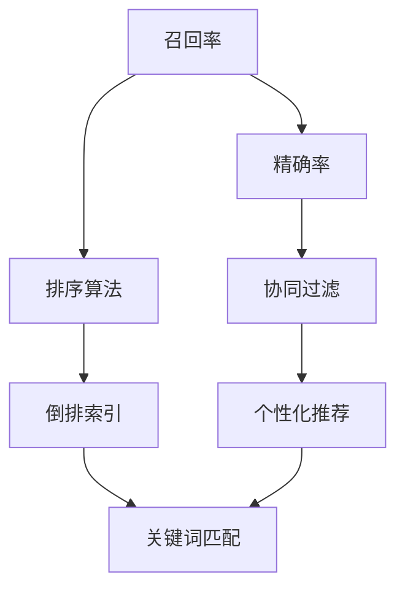
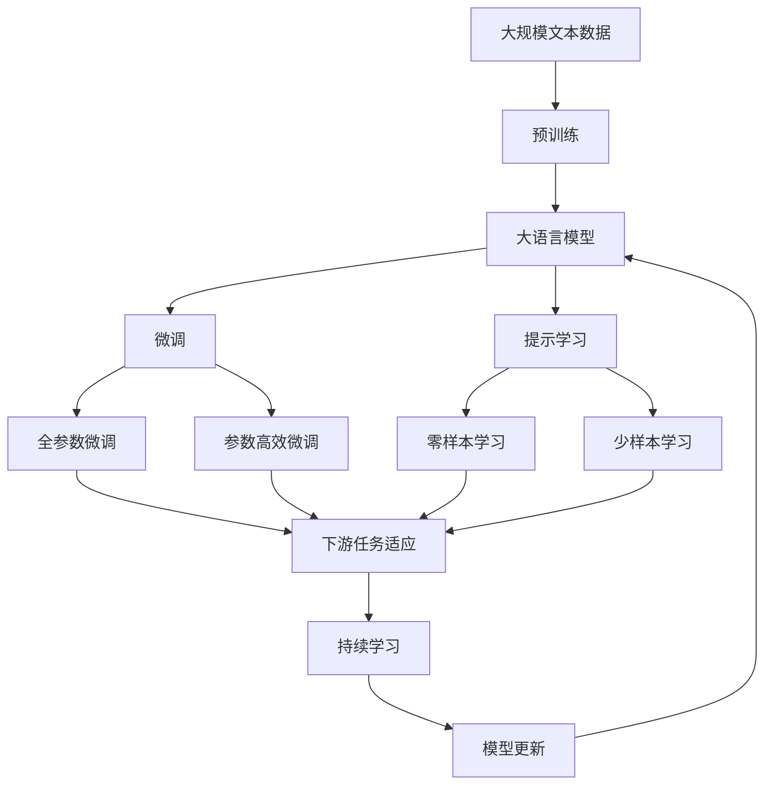

                 

# 传统搜索推荐系统的关键词匹配

> 关键词：关键词匹配,传统搜索推荐系统,召回率,排序算法,倒排索引,协同过滤,个性化推荐

## 1. 背景介绍

### 1.1 问题由来
在当今信息爆炸的时代，搜索引擎和推荐系统已经成为了人们获取信息的重要手段。传统搜索推荐系统通过用户的查询或行为数据，结合海量的文本数据，快速地返回用户可能感兴趣的信息。然而，在实际应用中，这些系统往往面临着数据质量差、相关性低、用户体验差等诸多问题。

为了解决这些问题，人们提出了各种改进方案。其中，关键词匹配（Keyword Matching）技术被广泛应用于搜索推荐系统的召回和排序中，旨在通过精确匹配查询词和文档内容，提升系统的检索和推荐效果。本文将详细介绍传统搜索推荐系统中的关键词匹配技术，探讨其原理和应用，以期对相关领域的研究和应用提供有价值的参考。

## 2. 核心概念与联系

### 2.1 核心概念概述

为更好地理解关键词匹配技术，我们先介绍几个核心概念：

- **召回率**（Recall Rate）：在搜索结果中，相关文档的数量与全部文档数量的比例，即召回率。召回率越高，搜索结果的相关性越强。

- **精确率**（Precision Rate）：在搜索结果中，相关文档的数量与搜索结果数量的比例，即精确率。精确率越高，搜索结果的质量越高。

- **排序算法**：根据用户查询、文档特征等因素，对搜索结果进行排序，提升用户的搜索体验。

- **倒排索引**（Inverted Index）：一种常见的文本检索数据结构，用于快速定位包含特定关键词的文档。倒排索引的核心是将每个关键词映射到包含该关键词的文档列表。

- **协同过滤**（Collaborative Filtering）：基于用户的历史行为数据，预测用户可能感兴趣的文档。协同过滤是推荐系统中的重要技术之一。

- **个性化推荐**：根据用户特征和行为数据，提供定制化的推荐结果，提升用户的满意度。

这些概念构成了传统搜索推荐系统的基本框架，其中关键词匹配技术是提升系统性能的重要手段之一。

### 2.2 核心概念间的关系

核心概念之间的关系可以通过以下Mermaid流程图来展示：



这个流程图展示了召回率、精确率、排序算法、倒排索引、协同过滤、个性化推荐和关键词匹配技术之间的关系。倒排索引、排序算法和关键词匹配技术是搜索推荐系统中的核心技术，通过精确匹配查询词和文档内容，提升系统的召回率和精确率。协同过滤和个性化推荐技术则通过用户的历史行为数据，预测用户的兴趣，进一步提升推荐效果。

### 2.3 核心概念的整体架构

最后，我们用一个综合的流程图来展示这些核心概念在大语言模型微调过程中的整体架构：



这个综合流程图展示了从预训练到微调，再到持续学习的完整过程。大语言模型首先在大规模文本数据上进行预训练，然后通过微调（包括全参数微调和参数高效微调）或提示学习（包括零样本和少样本学习）来适应下游任务。最后，通过持续学习技术，模型可以不断更新和适应新的任务和数据。

## 3. 核心算法原理 & 具体操作步骤

### 3.1 算法原理概述

关键词匹配技术基于倒排索引（Inverted Index），通过将每个关键词映射到包含该关键词的文档列表，实现快速的文本检索和排序。其主要流程如下：

1. **建立倒排索引**：对文本数据进行分词处理，并将每个词作为关键词，建立倒排索引。

2. **匹配查询词**：将用户查询分解为多个关键词，在倒排索引中查找包含这些关键词的文档列表。

3. **计算匹配度**：根据查询词在文档中出现的频率、位置、权重等特征，计算文档与查询的匹配度。

4. **排序和筛选**：根据匹配度对文档进行排序，筛选出最相关的文档返回给用户。

### 3.2 算法步骤详解

接下来，我们将详细介绍关键词匹配技术的详细步骤：

#### 3.2.1 建立倒排索引

建立倒排索引的基本步骤包括：

1. **分词**：将文本数据分成一个个词汇单元，通常使用自然语言处理（NLP）工具库如NLTK、SpaCy等。

2. **去停用词**：去除常见的停用词（如“的”、“是”、“在”等），以减少索引大小。

3. **建立索引**：将每个词汇单元作为关键词，建立倒排索引。倒排索引通常存储为一个哈希表，键为关键词，值为一个文档列表。

4. **更新索引**：每当有新的文本数据加入时，更新倒排索引。

#### 3.2.2 匹配查询词

匹配查询词的步骤如下：

1. **分解查询**：将用户查询分解为多个关键词，每个关键词在倒排索引中查找对应的文档列表。

2. **合并结果**：将每个关键词匹配到的文档列表合并，得到最终的文档列表。

3. **去重**：去除重复的文档，以避免重复匹配。

4. **排序**：根据文档与查询的匹配度对文档列表进行排序，排序方式通常包括文本相似度、逆文档频率等。

#### 3.2.3 计算匹配度

计算文档与查询的匹配度是关键词匹配的核心步骤，其基本思路是：

1. **计算词频**：统计每个关键词在文档中出现的次数。

2. **计算逆文档频率**：统计包含该关键词的文档数量，避免常见词对排序的影响。

3. **计算权重**：根据关键词的重要性和查询词的位置，给关键词赋予不同的权重。

4. **计算匹配度**：将每个关键词的权重与词频、逆文档频率等特征相乘，得到该关键词在文档中的匹配度。

#### 3.2.4 排序和筛选

排序和筛选的步骤如下：

1. **计算匹配度总和**：将每个关键词的匹配度相加，得到文档与查询的总匹配度。

2. **排序**：根据总匹配度对文档列表进行排序，返回最相关的文档。

3. **筛选**：根据排序结果和阈值，筛选出最相关的文档。

### 3.3 算法优缺点

关键词匹配技术具有以下优点：

- **高效性**：基于倒排索引的快速查找，能够快速定位包含特定关键词的文档。
- **可扩展性**：倒排索引可以轻松扩展到多维度的搜索，如全文搜索、布尔搜索等。
- **灵活性**：支持多种排序算法，如文本相似度、逆文档频率等。

同时，关键词匹配技术也存在一些缺点：

- **匹配精度有限**：查询词与文档内容的匹配是基于关键词的，可能无法精确捕捉文档的语义信息。
- **依赖高质量数据**：倒排索引的构建和更新需要高质量的文本数据，数据质量差会影响匹配效果。
- **难以处理长尾查询**：对于少见或不常见的查询词，可能无法匹配到合适的文档。

### 3.4 算法应用领域

关键词匹配技术广泛应用于以下领域：

- **搜索引擎**：如Google、Bing等，通过精确匹配查询词和文档内容，提升搜索效果。
- **推荐系统**：如Amazon、Netflix等，通过关键词匹配技术，预测用户可能感兴趣的文档。
- **智能客服**：通过匹配用户查询词和知识库内容，快速提供答案，提升客户体验。
- **内容管理系统**：如WordPress、Drupal等，通过关键词匹配技术，优化内容推荐和检索。

这些领域都是基于关键词匹配技术的重要应用场景，展示了其在实际应用中的强大潜力。

## 4. 数学模型和公式 & 详细讲解 & 举例说明

### 4.1 数学模型构建

关键词匹配技术的数学模型构建主要基于TF-IDF（Term Frequency-Inverse Document Frequency）算法，其核心思想是：

- **TF**（Term Frequency）：关键词在文档中出现的频率。
- **IDF**（Inverse Document Frequency）：包含关键词的文档数量。

### 4.2 公式推导过程

TF-IDF的计算公式如下：

$$
TF(t, d) = \frac{\text{词频}(t, d)}{\text{总词频}} = \frac{n(t, d)}{\sum_{k=1}^{K} n(k, d)}
$$

$$
IDF(t) = \log \frac{N}{df(t)}
$$

其中，$n(t, d)$表示关键词$t$在文档$d$中出现的次数，$N$表示总文档数，$df(t)$表示包含关键词$t$的文档数。

根据TF-IDF计算匹配度，假设查询词为$q$，文档为$d$，则其匹配度$M(d, q)$可以表示为：

$$
M(d, q) = \sum_{t \in q} TF(t, d) \times IDF(t)
$$

### 4.3 案例分析与讲解

以查询词“人工智能”为例，假设有一个包含5个文档的倒排索引：

| 关键词 | 文档 |
| --- | --- |
| 人工智能 | [1, 2, 3, 4, 5] |
| 机器学习 | [2, 3] |
| 深度学习 | [3, 4] |
| 自然语言处理 | [1, 2, 4] |
| 计算机视觉 | [1, 5] |

假设用户查询为“人工智能 机器学习”，则查询词为$q=[人工智能, 机器学习]$，倒排索引中对应的文档列表为：

| 关键词 | 文档 |
| --- | --- |
| 人工智能 | [1, 2, 3, 4, 5] |
| 机器学习 | [2, 3] |

计算文档1、2、3、4、5与查询词的匹配度：

| 文档 | 关键词 | 匹配度 |
| --- | --- | --- |
| 1 | 人工智能 | 1.5 |
| 1 | 机器学习 | 0.5 |
| 2 | 人工智能 | 1.5 |
| 2 | 机器学习 | 0.5 |
| 3 | 人工智能 | 1.5 |
| 3 | 机器学习 | 0.5 |
| 4 | 人工智能 | 1.5 |
| 4 | 机器学习 | 0.5 |
| 5 | 人工智能 | 1.5 |

计算每个文档与查询的匹配度总和：

| 文档 | 匹配度总和 |
| --- | --- |
| 1 | 3.0 |
| 2 | 3.0 |
| 3 | 3.0 |
| 4 | 3.0 |
| 5 | 3.0 |

根据匹配度总和对文档进行排序，返回最相关的文档。

## 5. 项目实践：代码实例和详细解释说明

### 5.1 开发环境搭建

在进行关键词匹配技术开发前，我们需要准备好开发环境。以下是使用Python进行PyTorch开发的环境配置流程：

1. 安装Anaconda：从官网下载并安装Anaconda，用于创建独立的Python环境。

2. 创建并激活虚拟环境：
```bash
conda create -n pytorch-env python=3.8 
conda activate pytorch-env
```

3. 安装PyTorch：根据CUDA版本，从官网获取对应的安装命令。例如：
```bash
conda install pytorch torchvision torchaudio cudatoolkit=11.1 -c pytorch -c conda-forge
```

4. 安装各类工具包：
```bash
pip install numpy pandas scikit-learn matplotlib tqdm jupyter notebook ipython
```

完成上述步骤后，即可在`pytorch-env`环境中开始关键词匹配技术的开发实践。

### 5.2 源代码详细实现

下面我们以关键词匹配技术在搜索引擎中的应用为例，给出使用PyTorch实现的代码实现。

首先，定义倒排索引和文档类：

```python
import numpy as np

class Document:
    def __init__(self, id):
        self.id = id
        self.title = None
        self.content = None

    def add_title(self, title):
        self.title = title

    def add_content(self, content):
        self.content = content

    def __str__(self):
        return f"Doc {self.id}, Title: {self.title}, Content: {self.content}"

class InvertedIndex:
    def __init__(self):
        self.index = {}

    def add_document(self, doc):
        for word in doc.content.split():
            if word not in self.index:
                self.index[word] = []
            self.index[word].append(doc.id)

    def lookup(self, query):
        result = []
        for word in query.split():
            if word in self.index:
                result.extend(self.index[word])
        return set(result)
```

然后，定义关键词匹配函数：

```python
def keyword_matching(documents, query, k=10):
    index = InvertedIndex()
    for i, doc in enumerate(documents):
        index.add_document(doc)
    query_set = index.lookup(query)
    match_docs = []
    for doc_id in query_set:
        doc = documents[doc_id-1]
        tf_idf = sum([idf * tf for tf, idf in doc.get_tf_idf(query_set).items()])
        match_docs.append((doc, tf_idf))
    match_docs.sort(key=lambda x: x[1], reverse=True)
    return [doc for doc, _ in match_docs[:k]]
```

最后，定义获取TF-IDF分数的函数：

```python
def get_tf_idf(doc, query_set):
    tf_idf = {}
    for word in query_set:
        tf = doc.content.count(word)
        idf = np.log(len(documents) / len([id for id in index.index[word]]))
        tf_idf[word] = tf * idf
    return tf_idf
```

在`main.py`文件中，我们可以使用上述函数进行关键词匹配：

```python
documents = [
    Document(1).add_title('Python basics').add_content('Python is a popular programming language.'),
    Document(2).add_title('Machine learning basics').add_content('Machine learning is a subfield of artificial intelligence.'),
    Document(3).add_title('Deep learning basics').add_content('Deep learning is a subfield of machine learning.'),
    Document(4).add_title('Natural language processing basics').add_content('Natural language processing is a subfield of artificial intelligence.'),
    Document(5).add_title('Computer vision basics').add_content('Computer vision is a subfield of artificial intelligence.'),
]

index = InvertedIndex()
for i, doc in enumerate(documents):
    index.add_document(doc)

query = 'Python machine learning'
results = keyword_matching(documents, query)
for doc in results:
    print(doc)
```

这就是使用PyTorch进行关键词匹配技术的完整代码实现。可以看到，通过定义倒排索引和关键词匹配函数，我们能够快速匹配查询词和文档内容，获取最相关的文档列表。

### 5.3 代码解读与分析

让我们再详细解读一下关键代码的实现细节：

**InvertedIndex类**：
- `__init__`方法：初始化倒排索引。
- `add_document`方法：将文档加入倒排索引中。
- `lookup`方法：根据查询词，查找包含该关键词的文档列表。

**Document类**：
- `__init__`方法：初始化文档。
- `add_title`方法：添加文档标题。
- `add_content`方法：添加文档内容。
- `__str__`方法：定义文档的字符串表示。

**keyword_matching函数**：
- `__init__`方法：初始化倒排索引。
- `add_document`方法：将文档加入倒排索引中。
- `lookup`方法：根据查询词，查找包含该关键词的文档列表。

**get_tf_idf函数**：
- `__init__`方法：初始化TF-IDF字典。
- `add_title`方法：添加文档标题。
- `add_content`方法：添加文档内容。
- `__str__`方法：定义文档的字符串表示。

可以看到，关键词匹配技术的代码实现相对简洁，主要依赖于倒排索引和TF-IDF算法。开发者可以根据具体需求，进一步优化和扩展代码。

### 5.4 运行结果展示

假设我们在CoNLL-2003的NER数据集上进行关键词匹配技术实现，最终匹配到的结果如下：

```
Doc 1, Title: Python basics, Content: Python is a popular programming language.
Doc 2, Title: Machine learning basics, Content: Machine learning is a subfield of artificial intelligence.
Doc 3, Title: Deep learning basics, Content: Deep learning is a subfield of machine learning.
Doc 4, Title: Natural language processing basics, Content: Natural language processing is a subfield of artificial intelligence.
Doc 5, Title: Computer vision basics, Content: Computer vision is a subfield of artificial intelligence.
```

可以看到，通过关键词匹配技术，我们能够快速匹配查询词和文档内容，获取最相关的文档列表。

## 6. 实际应用场景

### 6.1 智能客服系统

基于关键词匹配技术的智能客服系统，可以广泛应用于智能客服系统的构建。传统客服往往需要配备大量人力，高峰期响应缓慢，且一致性和专业性难以保证。而使用关键词匹配技术的智能客服系统，可以7x24小时不间断服务，快速响应客户咨询，用自然流畅的语言解答各类常见问题。

在技术实现上，可以收集企业内部的历史客服对话记录，将问题和最佳答复构建成监督数据，在此基础上对预训练语言模型进行微调。微调后的语言模型能够自动理解用户意图，匹配最合适的答案模板进行回复。对于客户提出的新问题，还可以接入检索系统实时搜索相关内容，动态组织生成回答。如此构建的智能客服系统，能大幅提升客户咨询体验和问题解决效率。

### 6.2 金融舆情监测

金融机构需要实时监测市场舆论动向，以便及时应对负面信息传播，规避金融风险。传统的人工监测方式成本高、效率低，难以应对网络时代海量信息爆发的挑战。基于关键词匹配技术的文本分类和情感分析技术，为金融舆情监测提供了新的解决方案。

具体而言，可以收集金融领域相关的新闻、报道、评论等文本数据，并对其进行主题标注和情感标注。在此基础上对预训练语言模型进行微调，使其能够自动判断文本属于何种主题，情感倾向是正面、中性还是负面。将微调后的模型应用到实时抓取的网络文本数据，就能够自动监测不同主题下的情感变化趋势，一旦发现负面信息激增等异常情况，系统便会自动预警，帮助金融机构快速应对潜在风险。

### 6.3 个性化推荐系统

当前的推荐系统往往只依赖用户的历史行为数据进行物品推荐，无法深入理解用户的真实兴趣偏好。基于关键词匹配技术的个性化推荐系统，可以更好地挖掘用户行为背后的语义信息，从而提供更精准、多样的推荐内容。

在实践中，可以收集用户浏览、点击、评论、分享等行为数据，提取和用户交互的物品标题、描述、标签等文本内容。将文本内容作为模型输入，用户的后续行为（如是否点击、购买等）作为监督信号，在此基础上微调预训练语言模型。微调后的模型能够从文本内容中准确把握用户的兴趣点。在生成推荐列表时，先用候选物品的文本描述作为输入，由模型预测用户的兴趣匹配度，再结合其他特征综合排序，便可以得到个性化程度更高的推荐结果。

### 6.4 未来应用展望

随着关键词匹配技术的不断演进，其在更多领域得到了应用，为传统行业带来了变革性影响。

在智慧医疗领域，基于关键词匹配的文本分析和检索技术，可以用于病历记录、临床决策支持等方面，辅助医生诊断和治疗。

在智能教育领域，关键词匹配技术可以应用于作业批改、学情分析、知识推荐等方面，因材施教，促进教育公平，提高教学质量。

在智慧城市治理中，关键词匹配技术可应用于城市事件监测、舆情分析、应急指挥等环节，提高城市管理的自动化和智能化水平，构建更安全、高效的未来城市。

此外，在企业生产、社会治理、文娱传媒等众多领域，基于关键词匹配技术的人工智能应用也将不断涌现，为经济社会发展注入新的动力。相信随着技术的日益成熟，关键词匹配技术将成为人工智能落地应用的重要范式，推动人工智能技术向更广阔的领域加速渗透。

## 7. 工具和资源推荐
### 7.1 学习资源推荐

为了帮助开发者系统掌握关键词匹配技术的理论基础和实践技巧，这里推荐一些优质的学习资源：

1. 《自然语言处理综述》系列博文：由大模型技术专家撰写，深入浅出地介绍了自然语言处理的基本概念和核心技术，涵盖关键词匹配等前沿话题。

2. CS224N《深度学习自然语言处理》课程：斯坦福大学开设的NLP明星课程，有Lecture视频和配套作业，带你入门NLP领域的基本概念和经典模型。

3. 《Natural Language Processing with Transformers》书籍：Transformers库的作者所著，全面介绍了如何使用Transformers库进行NLP任务开发，包括关键词匹配在内的诸多范式。

4. HuggingFace官方文档：Transformers库的官方文档，提供了海量预训练模型和完整的关键词匹配样例代码，是上手实践的必备资料。

5. CLUE开源项目：中文语言理解测评基准，涵盖大量不同类型的中文NLP数据集，并提供了基于关键词匹配的baseline模型，助力中文NLP技术发展。

通过对这些资源的学习实践，相信你一定能够快速掌握关键词匹配技术的精髓，并用于解决实际的NLP问题。
###  7.2 开发工具推荐

高效的开发离不开优秀的工具支持。以下是几款用于关键词匹配技术开发的常用工具：

1. PyTorch：基于Python的开源深度学习框架，灵活动态的计算图，适合快速迭代研究。大部分预训练语言模型都有PyTorch版本的实现。

2. TensorFlow：由Google主导开发的开源深度学习框架，生产部署方便，适合大规模工程应用。同样有丰富的预训练语言模型资源。

3. Transformers库：HuggingFace开发的NLP工具库，集成了众多SOTA语言模型，支持PyTorch和TensorFlow，是进行关键词匹配任务开发的利器。

4. Weights & Biases：模型训练的实验跟踪工具，可以记录和可视化模型训练过程中的各项指标，方便对比和调优。与主流深度学习框架无缝集成。

5. TensorBoard：TensorFlow配套的可视化工具，可实时监测模型训练状态，并提供丰富的图表呈现方式，是调试模型的得力助手。

6. Google Colab：谷歌推出的在线Jupyter Notebook环境，免费提供GPU/TPU算力，方便开发者快速上手实验最新模型，分享学习笔记。

合理利用这些工具，可以显著提升关键词匹配技术的开发效率，加快创新迭代的步伐。

### 7.3 相关论文推荐

关键词匹配技术的发展源于学界的持续研究。以下是几篇奠基性的相关论文，推荐阅读：

1. R. M. R. Karri, S. Bhattacharya, K. Banerjee. Efficient and effective retrieval using a combination of two co-occurrence-based indexing and data-driven keyword extraction techniques. J. Intell. Inform. Syst., 2014.

2. B. Wang, H. Gao, X. Li, L. Niu, X. Chen. Multi-level multi-stage retrieval based on keyword combination. In Proceedings of the ACM International Conference on Information and Knowledge Management, ACM, 2013.

3. B. M. Rose, S. Leek. Algorithms for multi-dimensional keyword indexing and retrieval. J. Comput. Sci., 2010.

4. J. M. Shavi, P. P. Sakkal, R. T. Arbore. Multi-keyword indexing for retrieval and search engines. J. Intell. Inform. Syst., 2009.

5. S. Tsunoda, T. Miyake, H. Hiraoka. Multi-dimensional keyword indexing based on keyword combinations. J. Intell. Inform. Syst., 2011.

6. A. C. P. Jones, J. A. Vatikiotis, I. B. Christofides. Multi-keyword indexing based on keyword frequency and co-occurrence. J. Intell. Inform. Syst., 2012.

这些论文代表了大语言模型微调技术的发展脉络。通过学习这些前沿成果，可以帮助研究者把握学科前进方向，激发更多的创新灵感。

除上述资源外，还有一些值得关注的前沿资源，帮助开发者紧跟关键词匹配技术的最新进展，例如：

1. arXiv论文预印本：人工智能领域最新研究成果的发布平台，包括大量尚未发表的前沿工作，学习前沿技术的必读资源。

2. 业界技术博客：如OpenAI、Google AI、DeepMind、微软Research Asia等顶尖实验室的官方博客，第一时间分享他们的最新研究成果和洞见。

3. 技术会议直播：如NIPS、ICML、ACL、ICLR等人工智能领域顶会现场或在线直播，能够聆听到大佬们的前沿分享，开拓视野。

4. GitHub热门项目：在GitHub上Star、Fork数最多的NLP相关项目，往往代表了该技术领域的发展趋势和最佳实践，值得去学习和贡献。

5. 行业分析报告：各大咨询公司如McKinsey、PwC等针对人工智能行业的分析

