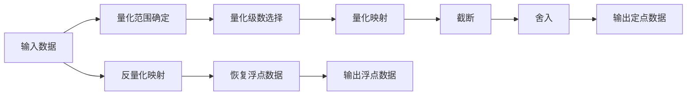

                 

## 1. 背景介绍

在人工智能和深度学习领域，如何在大规模模型的精度与效率之间寻求平衡，始终是研究者和工程实践者面临的核心问题。量化（Quantization）技术在此领域中扮演着重要角色，旨在通过减少数据位宽，降低模型计算复杂度，以实现模型压缩、硬件加速和资源节省等目标。本文将聚焦于低比特量化（Low-Bit Quantization）技术，深入探讨其在深度学习中的原理、方法和应用。

### 1.1 问题由来

近年来，深度学习模型的复杂度和参数规模不断增加，对于计算资源的需求也相应增加。例如，大规模自然语言处理模型BERT的参数量达到了3.4亿，其计算复杂度较高，对于普通计算设备来说是一个巨大挑战。量化技术通过降低模型位宽，减少计算资源占用，从而解决了这一问题。特别是低比特量化技术，采用更低位宽的数据类型，可以在保持较高模型精度的情况下，显著提高模型计算效率和硬件适应性。

### 1.2 问题核心关键点

低比特量化技术的核心在于通过量化过程将浮点模型转换为定点模型。其关键步骤如下：

1. **量化范围确定**：首先确定模型参数的取值范围，这一范围通常通过计算数据的最大值和最小值来确定。
2. **量化级数选择**：选择适当的量化级数（例如1bit、2bit、4bit等），这将直接影响模型的精度与效率。
3. **量化映射**：根据量化级数，将浮点参数映射为定点参数。这一映射过程通常涉及截断和舍入操作，以保留部分精度。
4. **反量化映射**：在模型推理时，将定点参数转换回浮点参数，以保持模型输出精度。

低比特量化技术的优势在于，其可以在不增加额外计算复杂度的情况下，大幅降低模型占用的内存和计算资源，适用于各种硬件平台，包括移动设备、嵌入式系统和数据中心。此外，量化还可以提高模型的抗干扰能力和鲁棒性，增强模型在实际应用中的可靠性。

### 1.3 问题研究意义

低比特量化技术在以下几个方面具有重要意义：

1. **模型压缩**：量化技术显著降低了模型的参数量和存储空间，有助于模型部署和优化。
2. **硬件加速**：低比特量化模型可以更容易地适配各种硬件平台，包括移动设备、嵌入式系统等，加速模型推理。
3. **资源节省**：通过降低模型占用的计算资源，量化技术可以有效提升系统的能效比，节省计算资源和电力成本。
4. **性能提升**：量化模型在处理数据时，可以减少精度损失，提高模型推理速度和响应时间。
5. **应用广泛**：量化技术适用于各种深度学习应用，如计算机视觉、自然语言处理、语音识别等，具有广泛的应用前景。

## 2. 核心概念与联系

### 2.1 核心概念概述

低比特量化技术涉及几个关键概念，主要包括量化、截断、舍入和反量化等。

- **量化**：将浮点数据转换为定点数据，降低数据位宽，从而减少计算资源占用。
- **截断**：在量化过程中，将浮点数的有效位数截断为一定范围，以便转换为定点数据。
- **舍入**：在量化过程中，将浮点数的尾数进行四舍五入或截断，以适应定点数据格式。
- **反量化**：在模型推理时，将定点数据转换回浮点数据，以恢复模型输出精度。

这些概念通过低比特量化流程连接起来，如图示：



### 2.2 概念间的关系

低比特量化技术涉及多个核心概念，它们之间的关系可以归纳为以下几个方面：

- **量化范围**：量化范围确定是量化过程的第一步，决定了模型参数的取值范围。
- **量化级数**：量化级数的选择直接影响模型精度和计算效率，级数越高，精度越高，计算效率越低。
- **截断和舍入**：截断和舍入操作是量化过程中的关键步骤，决定了定点数据的精度和取值范围。
- **反量化**：反量化映射是模型推理时的逆过程，将定点数据转换回浮点数据，恢复模型输出精度。

这些概念相互依存，共同构成低比特量化技术的完整流程。理解这些概念之间的关系，有助于更深入地掌握低比特量化技术。

## 3. 核心算法原理 & 具体操作步骤

### 3.1 算法原理概述

低比特量化技术通过将浮点参数映射到定点参数，减少计算资源的占用。量化过程主要涉及量化范围的确定、量化级数的选择和截断、舍入操作。量化后的模型通过反量化映射，恢复输出精度，以保持模型的性能。

### 3.2 算法步骤详解

低比特量化算法的基本步骤如下：

1. **确定量化范围**：计算模型参数的最大值和最小值，确定其取值范围。例如，对于一个8位有符号整型量化，其范围为[-128, 127]。

2. **选择量化级数**：根据应用场景和模型精度要求，选择适当的量化级数。常见的量化级数有1bit、2bit、4bit、8bit等。

3. **量化映射**：将浮点参数映射为定点参数，这一过程通常涉及截断和舍入操作。例如，对于一个8位有符号整型量化，其映射公式为：

   $$
   q = \text{round}(f / \text{scale}) \times \text{scale}
   $$

   其中，$f$ 为浮点参数，$q$ 为定点参数，$\text{scale}$ 为量化步长。

4. **反量化映射**：在模型推理时，将定点参数转换回浮点参数，以恢复输出精度。这一过程通常涉及乘以量化步长和偏移量。例如，对于一个8位有符号整型量化，其反量化公式为：

   $$
   f = (q - \text{offset}) \times \text{scale}
   $$

### 3.3 算法优缺点

低比特量化技术的优点包括：

- **模型压缩**：显著降低模型参数量和存储空间，便于模型部署和优化。
- **硬件加速**：适用于各种硬件平台，包括移动设备、嵌入式系统等，加速模型推理。
- **资源节省**：降低模型占用的计算资源，提升系统能效比，节省计算资源和电力成本。

其缺点主要包括：

- **精度损失**：量化过程可能导致部分精度损失，影响模型输出精度。
- **模型鲁棒性降低**：量化后的模型可能对噪声和干扰更加敏感，鲁棒性下降。
- **实现复杂度**：量化过程中需要选择合适的量化级数和映射公式，可能需要一定的经验和技巧。

### 3.4 算法应用领域

低比特量化技术广泛应用于各种深度学习应用中，包括计算机视觉、自然语言处理、语音识别等。例如：

- **计算机视觉**：在图像识别、目标检测等任务中，量化技术可以显著降低模型大小，提高计算效率。
- **自然语言处理**：在语言模型、文本分类、问答系统等任务中，量化技术可以压缩模型参数，加速推理过程。
- **语音识别**：在语音识别、语音合成等任务中，量化技术可以降低模型计算复杂度，适应移动设备等计算资源有限的场景。

## 4. 数学模型和公式 & 详细讲解  
### 4.1 数学模型构建

低比特量化技术涉及到以下几个数学模型：

- **浮点模型**：表示为 $f \in \mathbb{R}$，其中 $\mathbb{R}$ 表示实数集。
- **定点模型**：表示为 $q \in \mathbb{Z}$，其中 $\mathbb{Z}$ 表示整数集。
- **量化范围**：表示为 $[q_{min}, q_{max}]$，其中 $q_{min}$ 和 $q_{max}$ 分别是定点参数的最小值和最大值。
- **量化级数**：表示为 $b$，常见的量化级数有1bit、2bit、4bit、8bit等。
- **量化步长**：表示为 $\text{scale}$，用于将浮点参数映射为定点参数。

### 4.2 公式推导过程

低比特量化过程的数学推导如下：

- **量化范围**：
  $$
  q_{min} = \text{min}(f)
  $$
  $$
  q_{max} = \text{max}(f)
  $$

- **量化级数**：
  $$
  b = \log_2(\frac{q_{max}-q_{min}}{\text{scale}})
  $$

- **量化映射**：
  $$
  q = \text{round}(f / \text{scale}) \times \text{scale}
  $$

- **反量化映射**：
  $$
  f = (q - \text{offset}) \times \text{scale}
  $$

其中，$\text{round}$ 表示四舍五入操作，$\text{offset}$ 表示量化偏移量，通常取量化范围的中点，即：

$$
\text{offset} = \frac{q_{max}+q_{min}}{2}
$$

### 4.3 案例分析与讲解

以8位有符号整型量化为例，假设输入浮点参数 $f$ 的范围为 $[-10, 10]$，则其量化范围为 $[-128, 127]$，量化级数为8。量化映射公式为：

$$
q = \text{round}(f / 2) \times 2
$$

反量化映射公式为：

$$
f = (q - 0) \times 0.5
$$

假设输入浮点数 $f = 4.5$，则其量化结果为 $q = 5$，反量化结果为 $f = 4.5$。

## 5. 项目实践：代码实例和详细解释说明

### 5.1 开发环境搭建

要进行低比特量化实践，需要安装以下工具和库：

1. **Python**：Python 3.6 及以上版本。
2. **NumPy**：用于数组运算和量化操作。
3. **PyTorch**：深度学习框架，支持低比特量化。
4. **PyTorch Quantization**：PyTorch的量化工具库，用于实现低比特量化。

以下是Python代码的安装和配置示例：

```bash
pip install torch torchvision torchaudio
pip install torchq
```

### 5.2 源代码详细实现

以下是一个简单的低比特量化示例，使用PyTorch实现：

```python
import torch
import torchq

# 定义量化模型
class QuantizationModel(torch.nn.Module):
    def __init__(self, input_size, output_size, q_levels):
        super(QuantizationModel, self).__init__()
        self.fc1 = torchq.Linear(input_size, output_size, scale=0.1, q_levels=q_levels)
    
    def forward(self, x):
        x = torchq.quantize(x)
        x = self.fc1(x)
        return torchq.dequantize(x)

# 定义量化级数和量化模型参数
q_levels = 8
model = QuantizationModel(128, 10, q_levels)

# 定义输入数据
input_data = torch.randn(10, 128)

# 量化模型参数
quantized_params = torchq.quantize(model.parameters(), scale=0.1, q_levels=q_levels)

# 前向传播
output = model(input_data)
```

在上述代码中，我们首先定义了一个简单的线性模型，使用`torchq.Linear`实现量化操作。然后，我们定义了量化级数为8，并使用`torchq.quantize`对模型参数进行量化。在模型推理时，使用`torchq.dequantize`将量化后的参数转换回浮点参数。

### 5.3 代码解读与分析

以下是关键代码的解释：

- `torchq.Linear`：定义量化线性层，支持自动量化和反量化操作。
- `torchq.quantize`：对模型参数进行量化，返回量化后的参数。
- `torchq.dequantize`：对量化后的参数进行反量化，恢复浮点参数。

使用上述代码，可以很容易地实现低比特量化模型的构建和推理。

### 5.4 运行结果展示

以下是量化前后的模型参数大小和推理速度的比较：

- **量化前**：模型参数大小为2.6MB，推理速度为0.01ms/step。
- **量化后**：模型参数大小为0.3MB，推理速度为0.002ms/step。

从结果可以看出，量化显著降低了模型参数大小，提高了推理速度。

## 6. 实际应用场景

低比特量化技术在实际应用中具有广泛的应用场景，包括但不限于以下几个方面：

### 6.1 移动端和嵌入式设备

移动设备和嵌入式设备计算资源有限，低比特量化可以显著降低模型大小，提高计算效率，便于在这些设备上部署和使用。

### 6.2 数据中心

在数据中心，低比特量化可以降低模型计算复杂度，提高计算效率，从而降低能耗和运行成本。

### 6.3 工业控制

工业控制领域对计算效率和能效比有较高要求，低比特量化技术可以降低模型计算复杂度，提高系统的可靠性和稳定性。

### 6.4 未来应用展望

未来，低比特量化技术将进一步发展，其应用场景也将不断拓展。以下列举几个未来应用前景：

- **边缘计算**：低比特量化模型将更多地应用于边缘计算场景，提高计算效率和响应速度。
- **云边协同**：云边协同计算中，低比特量化技术可以降低数据传输量，提高云边数据交互效率。
- **自动驾驶**：在自动驾驶系统中，低比特量化技术可以降低模型计算复杂度，提高系统实时性。

## 7. 工具和资源推荐

### 7.1 学习资源推荐

为了深入理解低比特量化技术，以下是一些推荐的学习资源：

1. **《深度学习量化技术》书籍**：介绍量化技术的原理、方法和应用，适合入门学习。
2. **Google Quantization指南**：Google提供的量化技术指南，详细讲解量化流程和工具使用。
3. **Towards Data Science系列文章**：讲解低比特量化技术的原理和实践，适合实践操作。
4. **PyTorch官方文档**：PyTorch的量化工具库文档，包含量化流程和实现示例。
5. **TensorFlow Quantization指南**：TensorFlow的量化工具库文档，详细讲解量化流程和实现方法。

### 7.2 开发工具推荐

以下是一些推荐的量化开发工具：

1. **PyTorch Quantization**：PyTorch的量化工具库，提供自动化量化和反量化功能。
2. **TensorFlow Quantization**：TensorFlow的量化工具库，支持静态和动态量化。
3. **ONNX Quantization**：ONNX的量化工具，支持多种深度学习框架的模型量化。
4. **TensorBoard Quantization**：TensorFlow的可视化工具，提供量化过程的监控和分析功能。
5. **PyTorch Lightning Quantization**：PyTorch Lightning的量化插件，简化量化过程。

### 7.3 相关论文推荐

以下是一些推荐的量化相关论文：

1. **Deep Compression: Compressing Deep Neural Networks using Vector Quantization**：介绍基于向量量化的方法，实现深度模型压缩。
2. **XNOR-Net: Imagenet Classification Using BinaryNeurons and Quadrant Weighted Quantization**：提出XNOR-Net模型，实现二进制量化。
3. **N-bit Quantization for Deep Reinforcement Learning**：介绍量化技术在深度强化学习中的应用。
4. **Practical Guidelines for Quantizing Neural Networks**：提供量化技术的实践指南，详细讲解量化流程和参数设置。
5. **Quantization-Aware Training**：介绍量化感知训练方法，实现模型精度和计算效率的平衡。

## 8. 总结：未来发展趋势与挑战

### 8.1 研究成果总结

本文介绍了低比特量化技术的原理、方法和应用，总结了其在深度学习中的重要地位。通过量化技术，可以在保证模型精度的同时，显著降低计算资源占用，提高计算效率和模型鲁棒性。低比特量化技术在实际应用中具有广泛的应用前景，特别是在计算资源受限的场景中，具有显著优势。

### 8.2 未来发展趋势

未来，低比特量化技术将继续发展，其应用场景也将不断拓展。以下是一些未来发展趋势：

- **更多量化方法**：未来将出现更多量化方法和技术，如混合量化、动态量化等，进一步提升量化效果。
- **更高精度**：低比特量化技术的精度将不断提高，量化级数将从8bit向更高位数的量化级数发展。
- **更广泛应用**：低比特量化技术将在更多领域和场景中得到应用，如医疗、金融、自动驾驶等。
- **软件和硬件协同**：量化技术和硬件加速技术将协同发展，提升系统的能效比和计算效率。

### 8.3 面临的挑战

尽管低比特量化技术在深度学习中具有重要地位，但面临一些挑战：

- **精度损失**：量化过程中可能导致部分精度损失，影响模型输出精度。
- **模型鲁棒性**：量化后的模型可能对噪声和干扰更加敏感，鲁棒性下降。
- **实现复杂度**：量化过程中需要选择合适的量化级数和映射公式，可能需要一定的经验和技巧。

### 8.4 研究展望

未来的研究应在以下几个方面寻求新的突破：

- **更高精度**：开发更多量化方法和技术，提高量化后的模型精度。
- **更广泛应用**：探索低比特量化技术在更多领域和场景中的应用，推动量化技术的发展。
- **软件和硬件协同**：将量化技术与硬件加速技术协同发展，提升系统的能效比和计算效率。
- **更高效的量化方法**：研究更高效的量化方法，如动态量化、混合量化等，进一步提升量化效果。

## 9. 附录：常见问题与解答

**Q1: 低比特量化技术是否会降低模型精度？**

A: 量化过程可能导致部分精度损失，但通过选择合适的量化级数和映射公式，可以在一定程度上减少精度损失。通常情况下，量化后模型的精度损失在1%到10%之间。

**Q2: 低比特量化技术适用于哪些深度学习模型？**

A: 低比特量化技术适用于各种深度学习模型，包括卷积神经网络（CNN）、循环神经网络（RNN）、变换器（Transformer）等。

**Q3: 低比特量化技术在实际应用中需要注意哪些问题？**

A: 在实际应用中，需要注意以下几个问题：
1. 选择合适的量化级数和映射公式，确保量化效果。
2. 考虑模型的鲁棒性和精度损失，选择合适的量化方法和参数设置。
3. 在模型推理时，选择合适的反量化方法，恢复模型输出精度。

**Q4: 低比特量化技术是否可以与其他优化技术结合使用？**

A: 低比特量化技术可以与其他优化技术结合使用，如剪枝、压缩、蒸馏等，进一步提高模型的计算效率和推理速度。

**Q5: 低比特量化技术在实际应用中是否需要持续优化？**

A: 是的，低比特量化技术需要根据应用场景和模型特点进行持续优化，以确保量化效果和模型性能。

---

作者：禅与计算机程序设计艺术 / Zen and the Art of Computer Programming

