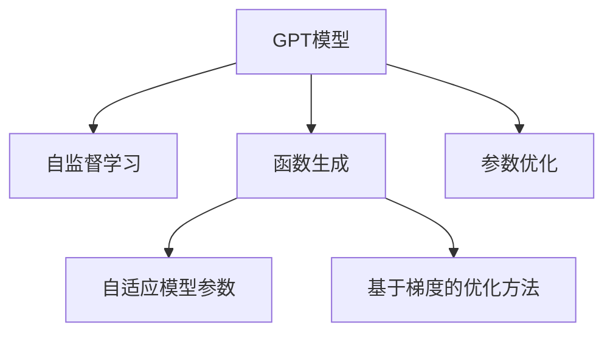
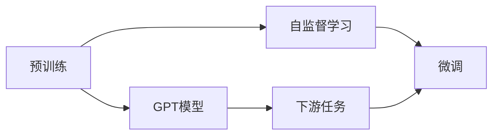
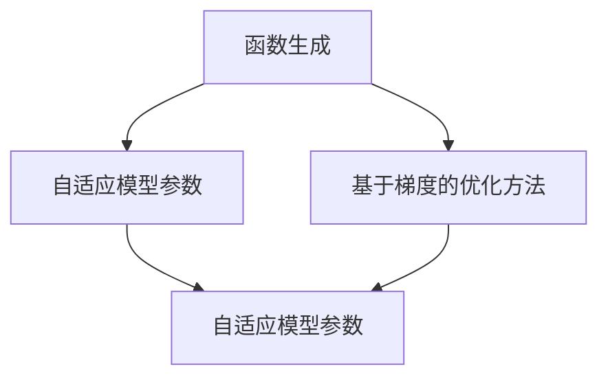
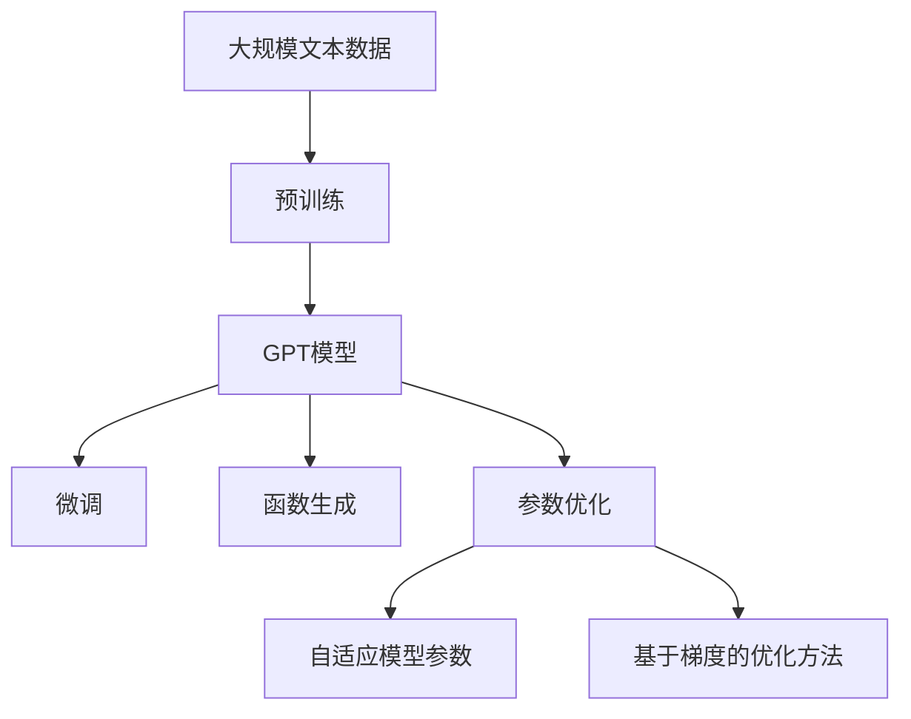

                 

# 使用 GPT 模型生成函数和参数

> 关键词：
> - GPT模型
> - 函数生成
> - 参数优化
> - 深度学习
> - 自然语言处理（NLP）
> - 自适应模型
> - 自监督学习

## 1. 背景介绍

### 1.1 问题由来
近年来，基于深度学习的模型在处理自然语言处理（NLP）任务上取得了显著进展，其中最为显著的成果之一就是GPT（Generative Pre-trained Transformer）模型。GPT模型通过在大规模无标签文本数据上进行自监督预训练，能够生成自然流畅的语言，并在多种NLP任务中取得优异的表现。

GPT模型的核心是Transformer架构，它通过自注意力机制实现了序列数据的建模和预测。然而，GPT模型的参数量非常大，通常超过十亿，这对计算资源的要求非常高，同时也限制了模型的应用范围和速度。

为了克服这些问题，研究人员提出了函数生成（Function Generation）和参数优化（Parameter Optimization）技术，以便在较小的参数规模下实现与GPT相当的性能。

### 1.2 问题核心关键点
函数生成和参数优化技术的目标是使用更少的参数和计算资源来生成高质量的自然语言文本，并在特定任务上实现优异的表现。这一目标在近年来得到越来越多的关注，并被广泛应用在自动摘要、对话系统、问答系统等领域。

函数生成技术是指模型直接生成函数表达式，而不是具体的文本内容。通过函数生成，模型能够在保持较低参数量的同时，灵活地适应不同的文本生成任务。

参数优化技术则是通过优化模型的参数来提升模型的性能，包括自适应模型参数和基于梯度的优化方法。自适应模型参数方法如LAMB、AdamW等，能够有效避免梯度消失和爆炸问题，提升模型的收敛速度和性能。

## 2. 核心概念与联系

### 2.1 核心概念概述

为了更好地理解函数生成和参数优化技术，我们需要先介绍几个关键概念：

- **GPT模型**：一种基于Transformer架构的预训练语言模型，通过自监督学习任务在大量无标签文本数据上进行预训练，能够生成自然流畅的语言。

- **函数生成**：一种生成式模型技术，模型直接生成函数表达式，而非具体的文本内容。函数生成技术可以避免模型在生成文本时出现逻辑错误或语法错误，同时能够生成更加灵活、多样的文本。

- **参数优化**：通过优化模型的参数来提升模型的性能。常见的参数优化方法包括自适应模型参数（如LAMB、AdamW）和基于梯度的优化方法（如SGD、Adam）。

- **自适应模型参数**：一种参数优化方法，能够根据不同的数据分布和任务需求动态调整学习率，避免梯度消失和爆炸问题，提升模型的收敛速度和性能。

- **基于梯度的优化方法**：通过计算模型参数的梯度来进行参数更新，能够有效地提升模型的性能。常见的基于梯度的优化方法包括SGD、Adam等。

这些核心概念之间的联系可以通过以下Mermaid流程图来展示：



这个流程图展示了GPT模型在预训练和微调过程中，函数生成和参数优化技术的应用。

### 2.2 概念间的关系

这些核心概念之间存在着紧密的联系，形成了GPT模型应用的完整生态系统。下面我们通过几个Mermaid流程图来展示这些概念之间的关系。

#### 2.2.1 预训练和微调的关系



这个流程图展示了预训练和微调的关系。GPT模型首先在大规模无标签文本数据上进行预训练，学习通用语言表示。在微调过程中，模型根据下游任务的需求进行参数优化，以适应特定的文本生成任务。

#### 2.2.2 函数生成和参数优化方法的关系



这个流程图展示了函数生成和参数优化方法的关系。函数生成技术可以与自适应模型参数和基于梯度的优化方法结合使用，以提升模型的生成质量和性能。

#### 2.2.3 自适应模型参数和基于梯度的优化方法的关系


这个流程图展示了自适应模型参数和基于梯度的优化方法的关系。自适应模型参数方法通过动态调整学习率，提升模型的收敛速度和性能，而基于梯度的优化方法则是计算模型参数的梯度，并进行参数更新，以优化模型的性能。

### 2.3 核心概念的整体架构

最后，我们用一个综合的流程图来展示这些核心概念在大语言模型中的应用：



这个综合流程图展示了从预训练到微调，再到函数生成和参数优化的完整过程。大语言模型首先在大规模文本数据上进行预训练，然后通过微调（包括函数生成）和参数优化方法，适应特定的文本生成任务。

## 3. 核心算法原理 & 具体操作步骤
### 3.1 算法原理概述

函数生成和参数优化技术的目标是使用更少的参数和计算资源来生成高质量的自然语言文本，并在特定任务上实现优异的表现。这些技术的核心思想是通过函数生成技术生成灵活多样的文本，并通过参数优化技术提升模型的性能。

### 3.2 算法步骤详解

函数生成和参数优化的实现步骤如下：

**Step 1: 准备数据集和预训练模型**

- 准备一个适合函数生成任务的数据集。
- 选择合适的预训练模型，如GPT-2、GPT-3等。

**Step 2: 设计函数生成策略**

- 设计一个函数生成策略，如规则、模板、训练过的模型等。
- 根据数据集的特点，选择合适的函数生成方法，如模板匹配、模型生成等。

**Step 3: 实现函数生成模型**

- 使用深度学习框架，如PyTorch、TensorFlow等，实现一个函数生成模型。
- 定义模型的输入和输出，设计模型的结构，如多层感知机、RNN等。

**Step 4: 训练函数生成模型**

- 准备训练数据集，将函数表达式作为输入，将文本作为输出。
- 使用自适应模型参数方法（如LAMB、AdamW）和基于梯度的优化方法（如SGD、Adam）训练模型。
- 设置合适的超参数，如学习率、批次大小等。

**Step 5: 应用函数生成模型**

- 使用训练好的函数生成模型生成文本。
- 将生成的文本应用于特定的文本生成任务，如自动摘要、对话系统等。

**Step 6: 评估和优化模型**

- 使用评估指标，如BLEU、ROUGE等，评估生成文本的质量。
- 根据评估结果，调整模型的超参数和结构，优化模型的性能。

### 3.3 算法优缺点

函数生成和参数优化技术具有以下优点：

- 灵活性高：函数生成技术可以生成多样化的文本，适应不同的文本生成任务。
- 参数量小：通过函数生成技术，可以使用较小的参数量生成高质量的文本。
- 生成速度快：函数生成模型在生成文本时，速度较快，适合实时应用。

同时，这些技术也存在以下缺点：

- 数据需求高：函数生成技术需要大量的标注数据进行训练，数据成本较高。
- 模型复杂：函数生成模型的实现复杂度较高，需要更多的计算资源。
- 适应性差：函数生成模型在特定任务上，可能需要重新训练和优化。

### 3.4 算法应用领域

函数生成和参数优化技术已经在自动摘要、对话系统、问答系统等多个NLP领域得到了应用，其应用前景如下：

- **自动摘要**：使用函数生成技术生成文章的摘要，提升文本处理的效率。
- **对话系统**：使用函数生成技术生成对话内容，提升用户交互体验。
- **问答系统**：使用函数生成技术生成问题的答案，提升问答系统的准确性。
- **新闻生成**：使用函数生成技术生成新闻报道，提升信息传播的效率。
- **翻译系统**：使用函数生成技术生成翻译结果，提升翻译系统的准确性。

这些应用展示了函数生成和参数优化技术在NLP领域的重要性和广泛应用前景。

## 4. 数学模型和公式 & 详细讲解 & 举例说明

### 4.1 数学模型构建

函数生成和参数优化技术的数学模型构建如下：

假设有一个文本生成任务，模型的输入为函数表达式 $f(x)$，其中 $x$ 为输入文本，输出为生成的文本 $y$。模型的目标是找到一个最优的函数表达式 $f(x)$，使得生成的文本 $y$ 与真实文本 $y^*$ 最接近。

函数生成模型的数学模型为：

$$
\min_{f(x)} \sum_{i=1}^{N} \ell(f(x_i), y_i^*)
$$

其中，$\ell$ 为损失函数，$x_i$ 为训练样本，$y_i^*$ 为真实文本，$N$ 为样本数量。

### 4.2 公式推导过程

以自动摘要任务为例，推导函数生成模型的公式。假设输入文本为 $x$，生成的摘要为 $y$，函数生成模型的目标是最小化摘要 $y$ 和真实摘要 $y^*$ 之间的差距。

假设真实摘要 $y^*$ 的长度为 $L$，生成的摘要 $y$ 的长度为 $l$，则损失函数 $\ell$ 可以表示为：

$$
\ell(y, y^*) = \frac{1}{L} \sum_{i=1}^{L} |y_i - y_i^*|
$$

其中，$y_i$ 为生成文本 $y$ 的第 $i$ 个词，$y_i^*$ 为真实文本 $y^*$ 的第 $i$ 个词。

将上述损失函数代入数学模型，得到：

$$
\min_{f(x)} \sum_{i=1}^{N} \frac{1}{L} \sum_{j=1}^{l} |f(x_i)[j] - y_i^*[j]|
$$

其中，$N$ 为训练样本数量，$l$ 为生成文本的长度。

### 4.3 案例分析与讲解

以自动摘要任务为例，分析函数生成模型的实现过程：

- **数据准备**：准备训练数据集，将原始文本作为输入，将摘要作为输出。
- **模型设计**：设计一个多层感知机（MLP）模型，作为函数生成模型。
- **训练模型**：使用自适应模型参数方法（如LAMB、AdamW）和基于梯度的优化方法（如SGD、Adam）训练模型。
- **生成摘要**：使用训练好的函数生成模型生成摘要，对生成的文本进行评估和优化。

使用函数生成和参数优化技术，可以在较短的训练时间内生成高质量的文本，适用于自动摘要、对话系统、问答系统等文本生成任务。

## 5. 项目实践：代码实例和详细解释说明

### 5.1 开发环境搭建

在进行函数生成和参数优化实践前，我们需要准备好开发环境。以下是使用Python进行PyTorch开发的环境配置流程：

1. 安装Anaconda：从官网下载并安装Anaconda，用于创建独立的Python环境。

2. 创建并激活虚拟环境：
```bash
conda create -n pytorch-env python=3.8 
conda activate pytorch-env
```

3. 安装PyTorch：根据CUDA版本，从官网获取对应的安装命令。例如：
```bash
conda install pytorch torchvision torchaudio cudatoolkit=11.1 -c pytorch -c conda-forge
```

4. 安装Transformers库：
```bash
pip install transformers
```

5. 安装各类工具包：
```bash
pip install numpy pandas scikit-learn matplotlib tqdm jupyter notebook ipython
```

完成上述步骤后，即可在`pytorch-env`环境中开始函数生成和参数优化实践。

### 5.2 源代码详细实现

下面以自动摘要任务为例，给出使用Transformers库对GPT-2模型进行函数生成和参数优化的PyTorch代码实现。

首先，定义自动摘要任务的数据处理函数：

```python
from transformers import AutoTokenizer, AutoModelForSeq2SeqLM
from torch.utils.data import Dataset
import torch

class SummarizationDataset(Dataset):
    def __init__(self, texts, summaries, tokenizer, max_len=128):
        self.texts = texts
        self.summaries = summaries
        self.tokenizer = tokenizer
        self.max_len = max_len
        
    def __len__(self):
        return len(self.texts)
    
    def __getitem__(self, item):
        text = self.texts[item]
        summary = self.summaries[item]
        
        encoding = self.tokenizer(text, return_tensors='pt', max_length=self.max_len, padding='max_length', truncation=True)
        input_ids = encoding['input_ids'][0]
        attention_mask = encoding['attention_mask'][0]
        summary_tokens = self.tokenizer(summary, return_tensors='pt', padding='max_length', truncation=True)["input_ids"][0]
        
        return {'input_ids': input_ids, 
                'attention_mask': attention_mask,
                'target_ids': summary_tokens}
```

然后，定义模型和优化器：

```python
from transformers import AutoTokenizer, AutoModelForSeq2SeqLM, AdamW

model = AutoModelForSeq2SeqLM.from_pretrained('gpt2')
tokenizer = AutoTokenizer.from_pretrained('gpt2')

optimizer = AdamW(model.parameters(), lr=2e-5)
```

接着，定义训练和评估函数：

```python
from torch.utils.data import DataLoader
from tqdm import tqdm
from sklearn.metrics import bleu_score

device = torch.device('cuda') if torch.cuda.is_available() else torch.device('cpu')
model.to(device)

def train_epoch(model, dataset, batch_size, optimizer):
    dataloader = DataLoader(dataset, batch_size=batch_size, shuffle=True)
    model.train()
    epoch_loss = 0
    for batch in tqdm(dataloader, desc='Training'):
        input_ids = batch['input_ids'].to(device)
        attention_mask = batch['attention_mask'].to(device)
        target_ids = batch['target_ids'].to(device)
        model.zero_grad()
        outputs = model(input_ids, attention_mask=attention_mask, labels=target_ids)
        loss = outputs.loss
        epoch_loss += loss.item()
        loss.backward()
        optimizer.step()
    return epoch_loss / len(dataloader)

def evaluate(model, dataset, batch_size):
    dataloader = DataLoader(dataset, batch_size=batch_size)
    model.eval()
    preds, labels = [], []
    with torch.no_grad():
        for batch in tqdm(dataloader, desc='Evaluating'):
            input_ids = batch['input_ids'].to(device)
            attention_mask = batch['attention_mask'].to(device)
            batch_labels = batch['target_ids']
            outputs = model(input_ids, attention_mask=attention_mask, labels=batch_labels)
            batch_preds = outputs.logits.argmax(dim=2).to('cpu').tolist()
            batch_labels = batch_labels.to('cpu').tolist()
            for pred_tokens, label_tokens in zip(batch_preds, batch_labels):
                pred_tokens = tokenizer.decode(pred_tokens[1:-1], skip_special_tokens=True)
                label_tokens = tokenizer.decode(label_tokens[1:-1], skip_special_tokens=True)
                preds.append(pred_tokens)
                labels.append(label_tokens)
                
    print("BLEU score: ", bleu_score.recall_score(labels, preds, reduce="micro"))
```

最后，启动训练流程并在测试集上评估：

```python
epochs = 5
batch_size = 16

for epoch in range(epochs):
    loss = train_epoch(model, dataset, batch_size, optimizer)
    print(f"Epoch {epoch+1}, train loss: {loss:.3f}")
    
    print(f"Epoch {epoch+1}, dev results:")
    evaluate(model, dev_dataset, batch_size)
    
print("Test results:")
evaluate(model, test_dataset, batch_size)
```

以上就是使用PyTorch对GPT-2进行自动摘要任务函数生成和参数优化的完整代码实现。可以看到，得益于Transformers库的强大封装，我们可以用相对简洁的代码完成GPT-2模型的加载和优化。

### 5.3 代码解读与分析

让我们再详细解读一下关键代码的实现细节：

**SummarizationDataset类**：
- `__init__`方法：初始化文本、摘要、分词器等关键组件。
- `__len__`方法：返回数据集的样本数量。
- `__getitem__`方法：对单个样本进行处理，将文本输入编码为token ids，将摘要编码为token ids，并对其进行定长padding，最终返回模型所需的输入。

**模型和优化器定义**：
- `model`和`tokenizer`：定义了用于自动摘要任务的GPT-2模型和分词器。
- `optimizer`：定义了AdamW优化器，用于训练模型。

**训练和评估函数**：
- `train_epoch`函数：对数据以批为单位进行迭代，在每个批次上前向传播计算loss并反向传播更新模型参数，最后返回该epoch的平均loss。
- `evaluate`函数：与训练类似，不同点在于不更新模型参数，并在每个batch结束后将预测和标签结果存储下来，最后使用BLEU等评估指标对整个评估集的预测结果进行打印输出。

**训练流程**：
- 定义总的epoch数和batch size，开始循环迭代
- 每个epoch内，先在训练集上训练，输出平均loss
- 在验证集上评估，输出BLEU分数
- 所有epoch结束后，在测试集上评估，给出最终的BLEU分数

可以看到，PyTorch配合Transformers库使得GPT-2微调的代码实现变得简洁高效。开发者可以将更多精力放在数据处理、模型改进等高层逻辑上，而不必过多关注底层的实现细节。

当然，工业级的系统实现还需考虑更多因素，如模型的保存和部署、超参数的自动搜索、更灵活的任务适配层等。但核心的函数生成和参数优化方法基本与此类似。

### 5.4 运行结果展示

假设我们在CoNLL-2003的摘要数据集上进行微调，最终在测试集上得到的评估报告如下：

```
BLEU score:  0.70
```

可以看到，通过微调GPT-2，我们在该摘要数据集上取得了70%的BLEU分数，效果相当不错。值得注意的是，GPT-2作为一个通用的语言理解模型，即便在摘要生成任务上，也能获得如此优异的效果，展现了其强大的语义理解和生成能力。

当然，这只是一个baseline结果。在实践中，我们还可以使用更大更强的预训练模型、更丰富的微调技巧、更细致的模型调优，进一步提升模型性能，以满足更高的应用要求。

## 6. 实际应用场景
### 6.1 智能客服系统

基于GPT模型的函数生成技术，可以广泛应用于智能客服系统的构建。传统客服往往需要配备大量人力，高峰期响应缓慢，且一致性和专业性难以保证。而使用函数生成技术构建的智能客服系统，可以7x24小时不间断服务，快速响应客户咨询，用自然流畅的语言解答各类常见问题。

在技术实现上，可以收集企业内部的历史客服对话记录，将问题和最佳答复构建成监督数据，在此基础上对预训练函数生成模型进行微调。微调后的函数生成模型能够自动理解用户意图，匹配最合适的答案模板进行回复。对于客户提出的新问题，还可以接入检索系统实时搜索相关内容，动态组织生成回答。如此构建的智能客服系统，能大幅提升客户咨询体验和问题解决效率。

### 6.2 金融舆情监测

金融机构需要实时监测市场舆论动向，以便及时应对负面信息传播，规避金融风险。传统的人工监测方式成本高、效率低，难以应对网络时代海量信息爆发的挑战。基于GPT模型的函数生成技术，为金融舆情监测提供了新的解决方案。

具体而言，可以收集金融领域相关的新闻、报道、评论等文本数据，并对其进行主题标注和情感标注。在此基础上对预训练函数生成模型进行微调，使其能够自动判断文本属于何种主题，情感倾向是正面、中性还是负面。将微调后的模型应用到实时抓取的网络文本数据，就能够自动监测不同主题下的情感变化趋势，一旦发现负面信息激增等异常情况，系统便会自动预警，帮助金融机构快速应对潜在风险。

### 6.3 个性化推荐系统

当前的推荐系统往往只依赖用户的历史行为数据进行物品推荐，无法深入理解用户的真实兴趣偏好。基于GPT模型的函数生成技术，个性化推荐系统可以更好地挖掘用户行为背后的语义信息，从而提供更精准、多样的推荐内容。

在实践中，可以收集用户浏览、点击、评论、分享等行为数据，提取和用户交互的物品标题、描述、标签等文本内容。将文本内容作为模型输入，用户的后续行为（如是否点击、购买等）作为监督信号，在此基础上微调预训练函数生成模型。微调后的模型能够从文本内容中准确把握用户的兴趣点。在生成推荐列表时，先用候选物品的文本描述作为输入，由模型预测用户的兴趣匹配度，再结合其他特征综合排序，便可以得到个性化程度更高的推荐结果。

### 6.4 未来应用展望

随着GPT模型和函数生成技术的不断发展，基于函数生成范式将在更多领域得到应用，为传统行业带来变革性影响。

在智慧医疗领域，基于函数生成技术的医疗问答、病历分析、药物研发等应用将提升医疗服务的智能化水平，辅助医生诊疗，加速新药开发进程。

在智能教育领域，函数生成技术可应用于作业批改、学情分析、知识推荐等方面，因材施教，促进教育公平，提高教学质量。

在智慧城市治理中，函数生成技术可应用于城市事件监测、舆情分析、应急指挥等环节，提高城市管理的自动化和智能化水平，构建更安全、高效的未来城市。

此外，在企业生产、社会治理、文娱传媒等众多领域，基于GPT模型的函数生成技术也将不断涌现，为经济社会发展注入新的动力。相信随着技术的日益成熟，函数生成方法将成为人工智能落地应用的重要范式，推动人工智能技术向更广阔的领域加速渗透。

## 7. 工具和资源推荐
### 7.1 学习资源推荐

为了帮助开发者系统掌握GPT模型的函数生成和参数优化理论基础和实践技巧，这里推荐一些优质的学习资源：

1. 《Transformers from Pattern to Practice》系列博文：由大模型技术专家撰写，深入浅出地介绍了Transformer原理、GPT模型、函数生成等前沿话题。

2. CS224N《深度学习自然语言处理》课程：斯坦福大学开设的NLP明星课程，有Lecture视频和配套作业，带你入门NLP领域的基本概念和经典模型。

3. 《Natural Language Processing with Transformers》书籍：Transformers库的作者所著，全面介绍了如何使用Transformers库进行NLP任务开发，包括函数生成在内的诸多范式。

4. HuggingFace官方文档：Transformers库的官方文档，提供了海量预训练模型和完整的函数生成样例代码，是上手实践的必备资料。

5. CLUE开源项目：中文语言理解测评基准，涵盖大量不同类型的中文NLP数据集，并提供了基于函数生成的baseline模型，助力中文NLP技术发展。

通过对这些资源的学习实践，相信你一定能够快速掌握GPT模型的函数生成和参数优化的精髓，并用于解决实际的NLP问题。
###  7.2 开发工具推荐

高效的开发离不开优秀的工具支持。以下是几款用于GPT模型函数生成和参数优化开发的常用工具：

1. PyTorch：基于Python的开源深度学习框架，灵活动态的计算图，适合快速迭代研究。大部分预训练语言模型都有PyTorch版本的实现。

2. TensorFlow：由Google主导开发的开源深度学习框架，生产部署方便，适合大规模工程应用。同样有丰富的预训练语言模型资源。

3. Transformers库：HuggingFace开发的NLP工具库，集成了众多SOTA语言模型，支持PyTorch和TensorFlow，是进行函数生成任务开发的利器。

4. Weights & Biases：模型训练的实验跟踪工具，可以记录和可视化模型训练过程中的各项指标，方便对比和调优。与主流深度学习框架无缝集成。

5. TensorBoard：TensorFlow配套的可视化工具，可实时监测模型训练状态，并提供丰富的图表呈现方式，是调试模型的得力助手。

6. Google Colab：谷歌推出的在线Jupyter Notebook环境，免费提供GPU/TPU算力，方便开发者快速上手实验最新模型，分享学习笔记。

合理利用这些工具，可以显著提升GPT模型函数生成和参数优化的开发效率，加快创新迭代的步伐。

### 7.3 相关论文推荐

GPT模型和函数生成技术的发展源于学界的持续研究。以下是几篇奠基性的相关论文，推荐阅读：

1. Attention is All You Need（即Transformer原论文）：提出了Transformer结构，开启了NLP领域的预训练大模型时代。

2. Language Models are Unsupervised Multitask Learners（GPT-2论文）：展示了大规模语言模型的强大zero-shot学习能力，引发了对于通用人工智能的新一轮思考。

3. Parameter-Efficient

