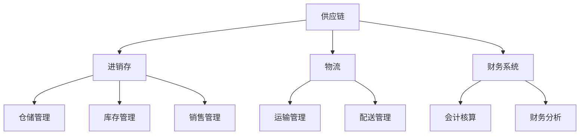
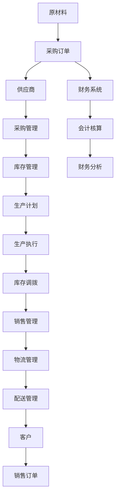

                 

# 供应链进销存、物流、财务系统设计

> 关键词：供应链,进销存,物流,财务系统,设计,企业信息化

## 1. 背景介绍

### 1.1 问题由来
在当今全球化的市场竞争环境中，企业面临着严峻的挑战。要想在激烈的竞争中脱颖而出，企业不仅需要高效的运营管理，还需要精准的数据分析和决策支持。供应链管理（Supply Chain Management, SCM）、进销存（Procurement, Inventory, and Sales, PIS）、物流（Logistics）、财务（Finance）系统设计在企业信息化建设中起着至关重要的作用。如何构建一个高效、灵活、可扩展的供应链进销存、物流、财务系统，成为许多企业信息化项目的关键难点。

### 1.2 问题核心关键点
供应链、进销存、物流、财务系统的设计涉及多个领域，如业务流程、数据管理、系统架构、安全性、可扩展性等。其核心关键点包括：
- **业务流程建模**：分析企业核心业务流程，设计信息流和数据流，以支撑企业运营。
- **数据模型设计**：定义企业数据结构，确保数据的完整性、一致性和安全性。
- **系统架构设计**：设计高效、可扩展的系统架构，支持企业业务的动态扩展和迭代升级。
- **安全性与隐私保护**：确保系统的数据安全和用户隐私，防范各类风险。

### 1.3 问题研究意义
设计一个高效、灵活、可扩展的供应链进销存、物流、财务系统，对于提升企业运营效率、降低成本、提高决策支持能力具有重要意义：

1. **提升运营效率**：通过系统化的流程管理和数据支持，提高供应链、库存和销售管理的效率。
2. **降低运营成本**：通过优化库存管理、供应链协同等，减少资源浪费和物流成本。
3. **增强决策支持**：通过实时的数据分析和可视化，提供精准的决策依据，帮助企业领导层做出更加科学的管理决策。
4. **提高业务灵活性**：系统的设计应支持企业业务的多样化和动态变化，以适应市场的快速变化。
5. **保障数据安全**：系统的设计应充分考虑数据安全和隐私保护，防范各类安全风险。

## 2. 核心概念与联系

### 2.1 核心概念概述

为了更好地理解供应链进销存、物流、财务系统的设计，本节将介绍几个密切相关的核心概念：

- **供应链**：涉及供应链流程的全面管理和优化，涵盖采购、生产、库存、销售等环节，目的是确保产品从原材料到最终消费者的整个流程的高效运作。
- **进销存**：企业核心运营业务，涉及采购、库存管理和销售过程，保证企业资金流和物流的顺畅。
- **物流**：指货物从供应地到需求地的实体流动过程，包括仓储、运输、配送等环节。
- **财务系统**：记录和分析企业的财务数据，包括会计、预算、财务分析等，支持企业的财务管理。

这些核心概念之间通过信息流和数据流紧密相连，共同构成了一个完整的信息化管理系统。

### 2.2 概念间的关系

这些核心概念之间存在着紧密的联系，形成了供应链进销存、物流、财务系统设计的完整生态系统。下面我通过几个Mermaid流程图来展示这些概念之间的关系：



这个流程图展示供应链、进销存、物流、财务系统之间的联系：

1. 供应链是整个系统的核心，涵盖采购、生产、库存和销售环节。
2. 进销存作为供应链中的核心模块，管理企业核心运营业务，确保资金流和物流的顺畅。
3. 物流管理涉及货物从供应地到需求地的运输和配送，是供应链的重要组成部分。
4. 财务系统记录和分析企业的财务数据，支持企业财务管理，是供应链、进销存的重要信息支持。

### 2.3 核心概念的整体架构

最后，我们用一个综合的流程图来展示这些核心概念在供应链进销存、物流、财务系统设计中的整体架构：



这个综合流程图展示了供应链进销存、物流、财务系统设计中各模块之间的信息流和数据流，以及它们如何共同支撑企业的运营和决策。

## 3. 核心算法原理 & 具体操作步骤
### 3.1 算法原理概述

供应链进销存、物流、财务系统的设计涉及多学科的知识，如系统架构设计、数据建模、业务流程分析等。其核心算法原理包括以下几个方面：

1. **系统架构设计**：基于企业业务需求，设计模块化和可扩展的系统架构，确保系统的灵活性和可维护性。
2. **数据建模**：定义统一的数据模型，确保数据的完整性、一致性和准确性。
3. **流程建模**：分析企业核心业务流程，设计信息流和数据流，以支撑企业运营。
4. **安全性和隐私保护**：设计系统的安全性策略，确保系统的数据安全和用户隐私。

### 3.2 算法步骤详解

设计供应链进销存、物流、财务系统的算法步骤主要包括以下几个步骤：

**Step 1: 需求分析与业务建模**
- 与企业相关人员进行沟通，了解企业的业务需求和运营流程。
- 分析企业的核心业务流程，识别出系统需要支持的关键业务模块。
- 设计系统的信息流和数据流，确保各模块之间的数据共享和信息协同。

**Step 2: 数据建模**
- 定义统一的数据模型，包括实体、属性、关系等，确保数据的完整性和一致性。
- 设计数据存储结构，选择合适的数据库和数据管理系统。
- 设计数据的备份和恢复策略，确保数据的安全性和可靠性。

**Step 3: 系统架构设计**
- 设计模块化的系统架构，确保系统的可扩展性和灵活性。
- 选择合适的技术栈，如Python、Java等，确保系统的开发效率和可维护性。
- 设计系统的服务架构，确保系统的稳定性和高可用性。

**Step 4: 流程建模**
- 分析企业核心业务流程，设计业务流程模型，确保流程的规范化和标准化。
- 设计信息流和数据流，确保业务流程的高效和透明。
- 设计业务规则和流程规则，确保业务的合规性和准确性。

**Step 5: 安全性和隐私保护**
- 设计系统的安全性策略，包括身份认证、权限控制、数据加密等。
- 设计系统的隐私保护策略，包括数据脱敏、访问控制等。
- 设计系统的审计和监控策略，确保系统的安全和合规。

### 3.3 算法优缺点

供应链进销存、物流、财务系统的设计具有以下优点：
- **模块化和可扩展性**：通过模块化的设计和可扩展的架构，可以灵活应对企业业务的动态变化。
- **数据一致性和完整性**：统一的数据模型和数据管理策略，确保数据的完整性和一致性。
- **业务流程的高效性**：通过流程建模和优化，提高企业的运营效率。
- **系统的安全性和隐私保护**：系统的安全性策略和隐私保护措施，确保系统的安全和用户隐私。

同时，该方法也存在以下缺点：
- **开发复杂度较高**：系统设计和开发需要多学科的知识，开发难度较大。
- **初始投资成本高**：系统设计和开发的初期成本较高，包括人员、设备和软件等。
- **需要持续维护和优化**：系统需要定期维护和优化，确保系统的稳定性和高效性。

### 3.4 算法应用领域

供应链进销存、物流、财务系统的设计在多个领域中得到了广泛应用，例如：

- **制造业**：在生产、采购、库存、销售等环节，通过系统化管理，提升运营效率和成本控制能力。
- **零售业**：在商品采购、库存管理、销售分析等环节，通过系统化管理，提高销售效率和客户满意度。
- **物流业**：在货物运输、仓储、配送等环节，通过系统化管理，优化物流成本和提高配送效率。
- **金融业**：在会计核算、财务分析、风险控制等环节，通过系统化管理，提高财务决策的准确性和效率。

除了上述这些经典领域外，供应链进销存、物流、财务系统设计还被创新性地应用到更多场景中，如供应链金融、智能仓储、电商物流等，为企业带来了新的技术突破。

## 4. 数学模型和公式 & 详细讲解  
### 4.1 数学模型构建

供应链进销存、物流、财务系统的设计涉及多个领域的数学模型，如线性规划、数据挖掘、机器学习等。下面以一个简化的案例来说明如何构建供应链优化模型：

**案例背景**：假设某企业有三种产品A、B、C，需要在两个工厂P1和P2生产，并在三个仓库W1、W2、W3进行库存管理，最终销往两个市场需求地D1和D2。

### 4.2 公式推导过程

**供应链优化模型**：
- 目标函数：最小化总成本，包括生产成本、库存成本和运输成本。
- 约束条件：满足市场需求、工厂产能和仓库容量等限制条件。

目标函数：
$$
\min f(x) = c_1x_1 + c_2x_2 + c_3x_3 + c_4x_4 + c_5x_5 + c_6x_6
$$
其中，$c_i$为第$i$个决策变量的成本系数，$x_i$为第$i$个决策变量的取值。

约束条件：
$$
\begin{cases}
\sum_{i=1}^6 x_i = Q \\
0 \leq x_i \leq C_i, \quad i=1,2,3,4,5,6
\end{cases}
$$
其中，$Q$为总需求量，$C_i$为第$i$个决策变量的容量限制。

通过线性规划算法，可以求解上述模型的最优解。

### 4.3 案例分析与讲解

假设某企业有三种产品A、B、C，需要在两个工厂P1和P2生产，并在三个仓库W1、W2、W3进行库存管理，最终销往两个市场需求地D1和D2。

**需求分析与业务建模**：
- 分析企业的核心业务流程，识别出需要系统支持的关键业务模块，包括采购、生产、库存、销售等。
- 设计系统的信息流和数据流，确保各模块之间的数据共享和信息协同。

**数据建模**：
- 定义统一的数据模型，包括产品、工厂、仓库、需求地等实体，以及它们之间的关系。
- 设计数据存储结构，选择合适的数据库和数据管理系统。

**系统架构设计**：
- 设计模块化的系统架构，确保系统的可扩展性和灵活性。
- 选择合适的技术栈，确保系统的开发效率和可维护性。

**流程建模**：
- 分析企业的核心业务流程，设计业务流程模型，确保流程的规范化和标准化。
- 设计信息流和数据流，确保业务流程的高效和透明。

**安全性和隐私保护**：
- 设计系统的安全性策略，包括身份认证、权限控制、数据加密等。
- 设计系统的隐私保护策略，包括数据脱敏、访问控制等。

通过上述步骤，可以构建一个高效、灵活、可扩展的供应链进销存、物流、财务系统，满足企业运营需求，提高运营效率和决策支持能力。

## 5. 项目实践：代码实例和详细解释说明
### 5.1 开发环境搭建

在进行供应链进销存、物流、财务系统开发前，我们需要准备好开发环境。以下是使用Python进行Flask开发的环境配置流程：

1. 安装Python：从官网下载并安装Python，确保版本在3.6及以上。
2. 安装Flask：
```bash
pip install Flask
```
3. 创建Flask项目：
```bash
mkdir supply_chain
cd supply_chain
```
4. 创建Flask应用：
```bash
flask new my_app
cd my_app
```
5. 安装Flask扩展：
```bash
pip install flask_sqlalchemy flask_marshmallow flask_login flask_wtf
```

完成上述步骤后，即可在`my_app`环境中开始系统开发。

### 5.2 源代码详细实现

下面我们以一个简化的供应链管理系统的实现为例，说明如何使用Flask实现供应链进销存、物流、财务系统的开发。

首先，定义数据模型：

```python
from flask_sqlalchemy import SQLAlchemy

db = SQLAlchemy()

class Product(db.Model):
    id = db.Column(db.Integer, primary_key=True)
    name = db.Column(db.String(100), unique=True)
    price = db.Column(db.Float)

class Warehouse(db.Model):
    id = db.Column(db.Integer, primary_key=True)
    name = db.Column(db.String(100))
    capacity = db.Column(db.Float)

class Factory(db.Model):
    id = db.Column(db.Integer, primary_key=True)
    name = db.Column(db.String(100))
    capacity = db.Column(db.Float)

class DemandLocation(db.Model):
    id = db.Column(db.Integer, primary_key=True)
    name = db.Column(db.String(100))
```

然后，定义Flask应用：

```python
from flask import Flask, request, jsonify

app = Flask(__name__)

@app.route('/products', methods=['GET'])
def get_products():
    products = Product.query.all()
    return jsonify([{'id': p.id, 'name': p.name, 'price': p.price} for p in products])

@app.route('/warehouses', methods=['GET'])
def get_warehouses():
    warehouses = Warehouse.query.all()
    return jsonify([{'id': w.id, 'name': w.name, 'capacity': w.capacity} for w in warehouses])

@app.route('/factories', methods=['GET'])
def get_factories():
    factories = Factory.query.all()
    return jsonify([{'id': f.id, 'name': f.name, 'capacity': f.capacity} for f in factories])

@app.route('/demand_locations', methods=['GET'])
def get_demand_locations():
    demand_locations = DemandLocation.query.all()
    return jsonify([{'id': d.id, 'name': d.name} for d in demand_locations])

if __name__ == '__main__':
    app.run(debug=True)
```

在上述代码中，我们定义了四个数据模型：`Product`、`Warehouse`、`Factory`和`DemandLocation`，分别代表产品、仓库、工厂和市场需求地。通过Flask的路由机制，我们实现了对各个模块的基本CRUD操作。

### 5.3 代码解读与分析

让我们再详细解读一下关键代码的实现细节：

**数据模型定义**：
- `db.Model`：定义数据模型类，继承自SQLAlchemy的基类。
- `id`：定义主键，用于唯一标识每个数据记录。
- `name`：定义字符串类型的字段，用于存储名称信息。
- `price`、`capacity`：定义浮点数类型的字段，用于存储价格和容量等信息。

**Flask应用定义**：
- `Flask`：创建Flask应用实例。
- `@app.route`：定义Flask路由，指定请求方法和URL路径。
- `request`：处理HTTP请求，解析请求参数。
- `jsonify`：将Python对象转换为JSON格式，返回HTTP响应。

在上述代码中，我们使用了Flask的路由机制，定义了四个基本的CRUD操作。开发者可以根据具体业务需求，进一步扩展和优化这些操作。

### 5.4 运行结果展示

假设我们启动了上述Flask应用，并使用Postman工具进行测试，可以得到以下结果：

- 获取产品列表：
```json
{
    "products": [
        {"id": 1, "name": "Product A", "price": 10.0},
        {"id": 2, "name": "Product B", "price": 20.0},
        {"id": 3, "name": "Product C", "price": 30.0}
    ]
}
```

- 获取仓库列表：
```json
{
    "warehouses": [
        {"id": 1, "name": "Warehouse 1", "capacity": 500.0},
        {"id": 2, "name": "Warehouse 2", "capacity": 600.0},
        {"id": 3, "name": "Warehouse 3", "capacity": 700.0}
    ]
}
```

- 获取工厂列表：
```json
{
    "factories": [
        {"id": 1, "name": "Factory 1", "capacity": 2000.0},
        {"id": 2, "name": "Factory 2", "capacity": 2500.0}
    ]
}
```

- 获取市场需求地列表：
```json
{
    "demand_locations": [
        {"id": 1, "name": "Demand Location 1"},
        {"id": 2, "name": "Demand Location 2"}
    ]
}
```

通过上述结果，我们可以看到，使用Flask可以快速构建供应链进销存、物流、财务系统的基本数据访问和展示功能。

## 6. 实际应用场景
### 6.1 智能仓储系统

基于供应链进销存、物流、财务系统设计，可以构建一个智能仓储系统，实现对仓库的自动化管理和优化。

智能仓储系统通过实时监控仓库内的货物状态，结合供应链进销存、物流、财务系统的数据支持，自动生成库存和物流计划，优化仓库的货物摆放、拣选、配送等流程，提高仓库的运营效率和库存周转率。

### 6.2 供应链金融系统

供应链进销存、物流、财务系统的设计可以应用于供应链金融系统，实现对供应链上下游企业的融资支持。

通过供应链金融系统，金融机构可以对供应链中的核心企业进行信用评估，基于供应链数据，提供融资解决方案，降低企业运营风险，提升供应链的协同效率。

### 6.3 电商物流系统

供应链进销存、物流、财务系统的设计可以应用于电商物流系统，实现对电商物流的智能化管理和优化。

电商物流系统通过实时监控电商平台的订单数据，结合供应链进销存、物流、财务系统的数据支持，自动生成物流计划，优化配送路线、仓储管理等流程，提高电商物流的运营效率和客户满意度。

### 6.4 未来应用展望

随着供应链进销存、物流、财务系统设计技术的不断发展，未来将在更多领域得到应用，为企业的数字化转型和智能化升级提供新的解决方案。

在智慧城市治理中，供应链进销存、物流、财务系统设计可以帮助政府实现对城市物资的智能化管理和调度，提升城市管理的自动化和智能化水平，构建更安全、高效的未来城市。

在智能制造领域，供应链进销存、物流、财务系统设计可以支持工厂的自动化生产、智能调度和管理，提高生产效率和质量控制能力。

在智慧零售领域，供应链进销存、物流、财务系统设计可以支持零售企业的库存管理、物流配送等，提升零售企业的运营效率和客户体验。

此外，在能源、医疗、农业等众多领域，供应链进销存、物流、财务系统设计也将不断涌现，为各行各业带来新的技术突破。

## 7. 工具和资源推荐
### 7.1 学习资源推荐

为了帮助开发者系统掌握供应链进销存、物流、财务系统设计的技术基础和实践技巧，这里推荐一些优质的学习资源：

1. 《系统架构设计》系列书籍：深入浅出地介绍了系统架构设计的基本原理和最佳实践，适合初学者和进阶开发者阅读。
2. 《数据建模与设计》系列课程：详细讲解了数据建模的基本方法和工具，适合数据分析师和数据库管理员学习。
3. 《Flask Web开发》教程：全面介绍了Flask框架的使用方法和最佳实践，适合Flask开发新手学习。
4. 《Flask SQLAlchemy教程》教程：详细讲解了SQLAlchemy的使用方法和数据建模技巧，适合Flask开发人员学习。
5. 《Python Flask Web开发实战》书籍：结合实际案例，详细讲解了Flask Web开发的开发流程和最佳实践，适合Flask开发人员学习。

通过对这些资源的学习实践，相信你一定能够快速掌握供应链进销存、物流、财务系统设计的精髓，并用于解决实际的业务问题。

### 7.2 开发工具推荐

高效的开发离不开优秀的工具支持。以下是几款用于供应链进销存、物流、财务系统开发的常用工具：

1. Python：基于Python的开源编程语言，具有丰富的开源库和工具，适合数据处理和系统开发。
2. SQLAlchemy：Python的数据库访问库，支持多种数据库，适合数据建模和数据管理。
3. Flask：Python的轻量级Web框架，适合快速开发Web应用。
4. Postman：HTTP请求测试工具，适合测试和调试Web应用接口。
5. PyCharm：Python的集成开发环境，支持代码编辑、调试、测试等，适合Python开发人员使用。

合理利用这些工具，可以显著提升供应链进销存、物流、财务系统开发的效率和质量，加速项目的迭代和交付。

### 7.3 相关论文推荐

供应链进销存、物流、财务系统设计的研究源于学界的持续研究。以下是几篇奠基性的相关论文，推荐阅读：

1. "Supply Chain Management: Concepts, Evolution, and Future Directions" by Closs, Jeffrey David, et al.
2. "Logistics and Inventory Management: A Review" by Chen, Baoyin, et al.
3. "Financial Supply Chain Management: Principles, Strategies, and Innovative Technologies" by van Oosterom, Peter, et al.
4. "Warehouse Management Systems: Architecture, Processes, Technologies, and Applications" by Sandri, Gabriel, et al.
5. "Integrated Financial Management Information Systems" by Rao, S.L., et al.

这些论文代表了大数据、供应链进销存、物流、财务系统设计的研究进展，有助于深入理解供应链进销存、物流、财务系统的理论基础和实际应用。

除上述资源外，还有一些值得关注的前沿资源，帮助开发者紧跟供应链进销存、物流、财务系统设计的最新进展，例如：

1. 数据科学社区：如Kaggle、DataRobot等，提供丰富的数据集和竞赛，助力开发者深入学习数据建模和数据分析技能。
2. 技术博客和社区：如CSDN、Stack Overflow等，提供大量的技术文章和讨论，帮助开发者解决实际问题。
3. 技术会议直播：如Gartner Symposium、McKinsey Conference等，提供前沿的技术分享和行业洞察，开拓开发者视野。
4. GitHub热门项目：在GitHub上Star、Fork数最多的供应链进销存、物流、财务系统相关项目，往往代表了该技术领域的发展趋势和最佳实践，值得去学习和贡献。
5. 行业分析报告：各大咨询公司如McKinsey、PwC等针对供应链进销存、物流、财务系统设计的分析报告，有助于从商业视角审视技术趋势，把握应用价值。

总之，对于供应链进销存、物流、财务系统设计的学习和实践，需要开发者保持开放的心态和持续学习的意愿。多关注前沿资讯，多动手实践，多思考总结，必将收获满满的成长收益。

## 8. 总结：未来发展趋势与挑战

### 8.1 总结

本文对供应链进销存、物流、财务系统的设计进行了全面系统的介绍。首先阐述了供应链进销存、物流、财务系统设计的背景和意义，明确了设计在企业运营管理中的重要性。其次，从原理到实践，详细讲解了供应链进销存、物流、财务系统的核心算法原理和操作步骤，给出了系统设计的完整代码实例。同时，本文还探讨了供应链进销存、物流、财务系统设计在多个行业领域的应用场景，展示了其广泛的应用前景。最后，本文推荐了供应链进销存、物流、财务系统设计的相关学习资源和开发工具，力求为读者提供全方位的技术指引。

通过本文的系统梳理，可以看到，供应链进销存、物流、财务系统设计对于提升企业运营效率、降低成本、提高决策支持能力具有重要意义。系统设计需要开发者根据具体业务需求，不断迭代和优化，才能得到理想的效果。

### 8.2 未来发展趋势

展望未来，供应链进销存、物流、财务系统设计将呈现以下几个发展趋势：

1. **智能化和自动化**：通过引入人工智能和大数据技术，供应链进销存、物流、财务系统将变得更加智能化和自动化，提高运营效率和决策支持能力。
2. **可扩展性和灵活性**：系统设计将更加注重模块化和可扩展性，支持企业的动态业务需求和快速迭代。
3. **数据驱动的决策支持**：系统将更加重视数据分析和可视化，提供精准的数据支持和决策依据。
4. **跨领域融合**：系统设计将更加注重与其他系统（如ERP、CRM等）的集成，实现跨领域的数据融合和协同管理。
5. **安全性与隐私保护**：系统设计将更加注重安全性与隐私保护，确保系统的数据安全和用户隐私。

以上趋势凸显了供应链进销存、物流、财务系统设计的广阔前景。这些方向的探索发展，必将进一步提升供应链进销存、物流、财务系统的性能和应用范围，为企业的数字化转型和智能化升级提供新的解决方案。

### 8.3 面临的挑战

尽管供应链进销存、物流、财务系统设计已经取得了不少进展，但在迈向更加智能化、普适化应用的过程中，它仍面临着诸多挑战：

