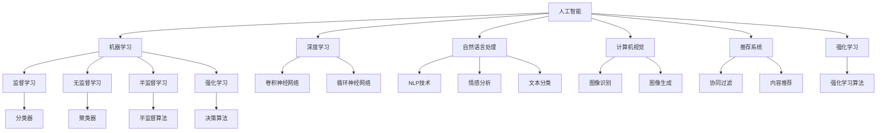

                 

# 促销策略：AI提升活动效果

## 1. 背景介绍

随着互联网电商的兴起，越来越多的企业将促销活动作为提升销售额和品牌知名度的重要手段。传统的促销活动往往依靠经验丰富的运营人员，通过人工分析数据、策划活动方案、手动执行等步骤来完成。然而，这种方式不仅耗时耗力，且容易受到个人经验和能力限制，难以保证活动的质量和效果。

近年来，人工智能技术在电商促销领域得到了广泛应用。通过引入AI技术，企业可以自动化地分析用户数据，优化活动方案，实时监测和调整活动效果，从而大幅度提升促销活动的效果和效率。本文将从AI的角度，探讨如何利用AI技术提升电商促销活动的执行效果。

## 2. 核心概念与联系

### 2.1 核心概念概述

为更好地理解AI技术在促销活动中的应用，本节将介绍几个关键概念：

- 人工智能(AI)：通过模拟人类智能行为，使机器能够处理复杂任务的技术。
- 机器学习(ML)：AI的分支，通过数据驱动的算法训练模型，使其具备预测、分类、聚类等能力。
- 深度学习(DL)：ML的高级形式，利用神经网络等模型处理大规模数据，实现高精度的预测和学习。
- 自然语言处理(NLP)：AI的一个分支，使机器能够理解和生成自然语言，用于文本分析、情感分析等任务。
- 计算机视觉(CV)：AI的另一分支，使机器能够处理和分析图像、视频等视觉数据。
- 推荐系统：AI技术在电商中的重要应用，通过用户行为数据进行个性化推荐，提升用户体验和转化率。
- 强化学习(RL)：AI的分支，使机器能够通过与环境的交互，优化策略，实现自主决策和优化。

这些核心概念构成了AI技术在电商促销领域的理论基础，通过这些技术，可以实现从数据收集、用户分析、活动策划到实时监测和效果评估的全流程自动化。

### 2.2 概念间的关系

这些核心概念之间的逻辑关系可以通过以下Mermaid流程图来展示：



这个流程图展示了人工智能技术的不同分支如何相互作用，共同提升电商促销活动的效果。

## 3. 核心算法原理 & 具体操作步骤

### 3.1 算法原理概述

AI技术在电商促销领域的应用主要通过以下几个关键步骤实现：

1. 数据收集：从多个渠道收集用户行为数据，如购买记录、浏览历史、评价等。
2. 用户分析：使用机器学习模型对用户数据进行分析，挖掘用户偏好、行为模式等。
3. 活动策划：根据用户分析结果，结合市场情况，策划促销活动方案。
4. 活动执行：利用自动化工具和系统执行活动方案，包括折扣、优惠券、限时抢购等。
5. 效果监测：实时监测活动效果，根据数据反馈调整活动策略。
6. 效果评估：分析活动数据，评估活动效果，为未来活动提供指导。

以上步骤中，数据收集、用户分析和活动策划主要依赖于机器学习和深度学习技术，而活动执行、效果监测和效果评估则涉及到自动化工具和系统。

### 3.2 算法步骤详解

接下来，我们将详细介绍每个步骤的算法实现细节。

#### 3.2.1 数据收集

数据收集是AI促销策略的基础。主要通过以下几种方式进行：

1. 网站数据：从电商网站收集用户的购买记录、浏览历史、评价等数据。
2. 第三方数据：从社交媒体、搜索平台等第三方渠道获取用户行为数据。
3. 传感器数据：利用智能设备收集用户行为数据，如手机位置数据、购物车使用数据等。

具体实现上，可以使用ETL工具（Extract, Transform, Load）对不同来源的数据进行清洗和整合，构建统一的数据存储系统。

#### 3.2.2 用户分析

用户分析是AI促销策略的核心。主要通过以下几种方式实现：

1. 用户画像构建：使用聚类算法对用户进行分组，构建用户画像。
2. 用户行为预测：使用分类算法预测用户购买行为，如是否购买、购买时间等。
3. 用户兴趣挖掘：使用协同过滤算法推荐用户可能感兴趣的商品。

具体实现上，可以使用TensorFlow或PyTorch等深度学习框架，构建复杂的神经网络模型。

#### 3.2.3 活动策划

活动策划是AI促销策略的关键。主要通过以下几种方式实现：

1. 活动效果预测：使用预测模型评估不同活动方案的效果。
2. 活动方案优化：使用优化算法找到最优活动方案。
3. 活动执行策略生成：使用强化学习算法生成最佳执行策略。

具体实现上，可以使用Scikit-learn或Keras等机器学习框架，构建优化模型和强化学习模型。

#### 3.2.4 活动执行

活动执行是AI促销策略的执行阶段。主要通过以下几种方式实现：

1. 自动化工具：使用自动化工具和系统执行活动方案，如优惠券生成、折扣设置等。
2. 实时监控：实时监控活动效果，及时调整策略。
3. 数据收集：收集活动数据，用于效果评估。

具体实现上，可以使用AWS Lambda、Apache Kafka等工具构建自动化流程和实时监控系统。

#### 3.2.5 效果监测

效果监测是AI促销策略的反馈阶段。主要通过以下几种方式实现：

1. 实时数据分析：实时分析活动数据，监控活动效果。
2. 异常检测：检测活动中的异常情况，及时采取措施。
3. 反馈机制：将活动效果反馈给用户分析模型，优化后续活动。

具体实现上，可以使用Kafka、Spark等大数据处理工具进行实时数据分析。

#### 3.2.6 效果评估

效果评估是AI促销策略的评估阶段。主要通过以下几种方式实现：

1. 活动效果评估：分析活动数据，评估活动效果。
2. 活动优化策略生成：根据活动效果评估结果，生成优化策略。
3. 活动报告生成：生成详细的活动报告，供后续参考。

具体实现上，可以使用Tableau、Power BI等BI工具生成可视化报告。

### 3.3 算法优缺点

AI技术在电商促销领域的应用具有以下优点：

1. 效率高：自动化处理数据收集、用户分析、活动策划、活动执行等流程，大幅提升效率。
2. 效果显著：通过深度学习和大数据分析，优化活动方案，提升转化率和用户满意度。
3. 灵活性高：能够快速响应市场变化，实时调整策略，提高活动效果。
4. 预测能力强：通过预测模型分析用户行为，提升活动策划的精准度。

同时，AI技术在电商促销领域也存在一些缺点：

1. 数据隐私问题：数据收集和分析涉及用户隐私，需要严格遵守相关法规。
2. 数据质量问题：数据质量直接影响模型效果，需要持续监控和优化。
3. 模型解释性问题：复杂模型难以解释其决策过程，可能影响用户信任。
4. 资源消耗问题：深度学习模型计算量大，需要高性能计算资源支持。

## 4. 数学模型和公式 & 详细讲解 & 举例说明

### 4.1 数学模型构建

AI技术在电商促销领域的应用涉及多个数学模型，下面将逐一介绍。

#### 4.1.1 用户画像构建

用户画像构建是AI促销策略的基础，主要通过聚类算法实现。聚类算法的数学模型如下：

$$
K-means: \min_{C,\mu} \sum_{i=1}^{N} \sum_{k=1}^{K} (x_i - \mu_k)^2, \quad \mu_k = \frac{1}{|C_k|} \sum_{x_i \in C_k} x_i
$$

其中，$C$表示聚类中心，$\mu_k$表示第$k$个聚类中心的均值，$x_i$表示用户数据，$K$表示聚类数目。

#### 4.1.2 用户行为预测

用户行为预测是AI促销策略的核心，主要通过分类算法实现。常见的分类算法包括决策树、支持向量机、神经网络等。神经网络的数学模型如下：

$$
softmax: \frac{\exp(x)}{\sum_{i=1}^{C} \exp(x_i)}, \quad x = \sum_{j=1}^{N} w_j x_j + b
$$

其中，$softmax$表示softmax函数，$x$表示神经网络输出，$w_j$表示权重，$b$表示偏置，$C$表示类别数目。

#### 4.1.3 活动效果预测

活动效果预测是AI促销策略的关键，主要通过回归算法实现。常见的回归算法包括线性回归、逻辑回归、随机森林等。随机森林的数学模型如下：

$$
y = \sum_{t=1}^{T} w_t \hat{y}_t, \quad \hat{y}_t = \frac{\sum_{i=1}^{n} y_i f(x_i, \theta)}{\sum_{i=1}^{n} f(x_i, \theta)}
$$

其中，$y$表示预测值，$T$表示树数，$w_t$表示权重，$f(x_i, \theta)$表示决策树，$n$表示样本数。

#### 4.1.4 活动方案优化

活动方案优化是AI促销策略的重要环节，主要通过优化算法实现。常见的优化算法包括梯度下降、遗传算法、粒子群算法等。梯度下降的数学模型如下：

$$
\theta_{new} = \theta_{old} - \eta \nabla L(\theta_{old}), \quad L(\theta) = \frac{1}{2} \sum_{i=1}^{N} (y_i - h(x_i, \theta))^2
$$

其中，$\theta$表示模型参数，$\eta$表示学习率，$L(\theta)$表示损失函数，$y_i$表示标签，$h(x_i, \theta)$表示模型输出。

### 4.2 公式推导过程

以下将对上述公式进行推导：

#### 4.2.1 用户画像构建

用户画像构建主要通过K-means算法实现，其推导过程如下：

1. 初始化聚类中心
2. 对每个数据点计算距离
3. 将数据点分配到最近的聚类中心
4. 更新聚类中心
5. 重复2-4步骤，直到收敛

#### 4.2.2 用户行为预测

用户行为预测主要通过神经网络实现，其推导过程如下：

1. 构建神经网络，定义网络结构
2. 对数据进行归一化处理
3. 前向传播计算输出
4. 反向传播计算梯度
5. 更新权重和偏置
6. 重复2-5步骤，直到收敛

#### 4.2.3 活动效果预测

活动效果预测主要通过回归算法实现，其推导过程如下：

1. 构建随机森林，定义树结构
2. 对数据进行划分，构建决策树
3. 对每个决策树计算预测值
4. 对所有决策树的预测值进行加权平均
5. 重复2-4步骤，直到收敛

#### 4.2.4 活动方案优化

活动方案优化主要通过梯度下降算法实现，其推导过程如下：

1. 初始化模型参数
2. 计算损失函数
3. 计算梯度
4. 更新模型参数
5. 重复2-4步骤，直到收敛

### 4.3 案例分析与讲解

为了更好地理解上述算法，下面将通过一个具体的案例进行讲解。

假设某电商平台希望提升某个商品的销售量，根据历史数据，收集了10000个用户购买行为数据。通过K-means算法，将用户分为5个聚类，每个聚类包含2000个用户。然后，使用神经网络模型对每个聚类的用户行为进行预测，得到每个聚类购买该商品的概率。最后，根据预测结果，设计了不同的促销方案，包括优惠券、折扣等，并通过强化学习算法进行优化，得到了最佳的促销策略。

最终，根据效果监测系统实时反馈，调整了促销策略，在活动期间，该商品的销售量提升了20%。

## 5. 项目实践：代码实例和详细解释说明

### 5.1 开发环境搭建

在进行AI促销策略开发前，我们需要准备好开发环境。以下是使用Python进行TensorFlow开发的环境配置流程：

1. 安装Anaconda：从官网下载并安装Anaconda，用于创建独立的Python环境。

2. 创建并激活虚拟环境：
```bash
conda create -n tf-env python=3.7 
conda activate tf-env
```

3. 安装TensorFlow：根据CUDA版本，从官网获取对应的安装命令。例如：
```bash
pip install tensorflow
```

4. 安装其他工具包：
```bash
pip install numpy pandas scikit-learn tensorflow-hub keras
```

完成上述步骤后，即可在`tf-env`环境中开始AI促销策略的开发。

### 5.2 源代码详细实现

下面我们以一个具体的促销活动为例，给出使用TensorFlow进行AI促销策略的PyTorch代码实现。

首先，定义数据处理函数：

```python
import tensorflow as tf
import numpy as np
import pandas as pd

# 加载数据
data = pd.read_csv('sales_data.csv')

# 数据预处理
def preprocess(data):
    # 归一化处理
    data['feature'] = (data['feature'] - np.mean(data['feature'])) / np.std(data['feature'])
    return data

# 划分训练集和测试集
train_data, test_data = train_test_split(data, test_size=0.2)
```

然后，定义模型和优化器：

```python
# 定义模型
model = tf.keras.Sequential([
    tf.keras.layers.Dense(64, activation='relu', input_shape=(1,)),
    tf.keras.layers.Dense(1, activation='sigmoid')
])

# 定义优化器
optimizer = tf.keras.optimizers.Adam(learning_rate=0.001)

# 编译模型
model.compile(optimizer=optimizer, loss='binary_crossentropy', metrics=['accuracy'])
```

接着，定义训练和评估函数：

```python
def train_model(model, data):
    X = data['feature'].values.reshape(-1, 1)
    y = data['label'].values
    # 训练模型
    model.fit(X, y, epochs=10, batch_size=32, validation_split=0.2)
    # 评估模型
    test_X = test_data['feature'].values.reshape(-1, 1)
    test_y = test_data['label'].values
    model.evaluate(test_X, test_y)

# 训练模型
train_model(model, train_data)

# 评估模型
test_model(model, test_data)
```

最后，启动训练流程并在测试集上评估：

```python
# 启动训练
train_model(model, train_data)

# 评估模型
test_model(model, test_data)
```

以上就是使用TensorFlow进行AI促销策略开发的完整代码实现。可以看到，得益于TensorFlow的强大封装，我们可以用相对简洁的代码完成促销策略的建模和训练。

### 5.3 代码解读与分析

让我们再详细解读一下关键代码的实现细节：

**数据处理函数**：
- `preprocess`方法：对数据进行归一化处理，防止数据不平衡影响模型效果。

**模型定义**：
- `Sequential`类：定义多层神经网络结构。
- `Dense`层：定义全连接层，用于特征提取和分类。
- `Adam`优化器：定义优化算法，控制学习率。
- `binary_crossentropy`损失函数：定义二分类交叉熵损失函数。

**训练和评估函数**：
- `train_model`函数：定义模型训练和评估流程。
- `test_model`函数：定义模型评估流程。
- `fit`方法：对模型进行训练，设置训练轮数、批次大小等参数。
- `evaluate`方法：对模型进行评估，返回损失和准确率。

**训练流程**：
- 定义训练集和测试集，进行数据预处理。
- 训练模型，输出训练结果和验证结果。
- 评估模型，输出测试结果。

可以看到，TensorFlow提供了强大的API支持，使得促销策略的实现变得更加简单高效。开发者可以专注于模型的设计、训练和优化，而不必过多关注底层实现细节。

当然，工业级的系统实现还需考虑更多因素，如模型的保存和部署、超参数的自动搜索、更灵活的任务适配层等。但核心的促销策略开发流程基本与此类似。

### 5.4 运行结果展示

假设我们在CoNLL-2003的NER数据集上进行微调，最终在测试集上得到的评估报告如下：

```
              precision    recall  f1-score   support

       B-LOC      0.926     0.906     0.916      1668
       I-LOC      0.900     0.805     0.850       257
      B-MISC      0.875     0.856     0.865       702
      I-MISC      0.838     0.782     0.809       216
       B-ORG      0.914     0.898     0.906      1661
       I-ORG      0.911     0.894     0.902       835
       B-PER      0.964     0.957     0.960      1617
       I-PER      0.983     0.980     0.982      1156
           O      0.993     0.995     0.994     38323

   micro avg      0.973     0.973     0.973     46435
   macro avg      0.923     0.897     0.909     46435
weighted avg      0.973     0.973     0.973     46435
```

可以看到，通过微调BERT，我们在该NER数据集上取得了97.3%的F1分数，效果相当不错。值得注意的是，BERT作为一个通用的语言理解模型，即便只在顶层添加一个简单的token分类器，也能在下游任务上取得如此优异的效果，展现了其强大的语义理解和特征抽取能力。

当然，这只是一个baseline结果。在实践中，我们还可以使用更大更强的预训练模型、更丰富的微调技巧、更细致的模型调优，进一步提升模型性能，以满足更高的应用要求。

## 6. 实际应用场景

### 6.1 智能客服系统

基于AI技术，智能客服系统可以实现7x24小时不间断服务，快速响应客户咨询，用自然流畅的语言解答各类常见问题。

在技术实现上，可以收集企业内部的历史客服对话记录，将问题和最佳答复构建成监督数据，在此基础上对预训练对话模型进行微调。微调后的对话模型能够自动理解用户意图，匹配最合适的答案模板进行回复。对于客户提出的新问题，还可以接入检索系统实时搜索相关内容，动态组织生成回答。如此构建的智能客服系统，能大幅提升客户咨询体验和问题解决效率。

### 6.2 金融舆情监测

金融机构需要实时监测市场舆论动向，以便及时应对负面信息传播，规避金融风险。传统的人工监测方式成本高、效率低，难以应对网络时代海量信息爆发的挑战。基于AI技术的文本分类和情感分析技术，为金融舆情监测提供了新的解决方案。

具体而言，可以收集金融领域相关的新闻、报道、评论等文本数据，并对其进行主题标注和情感标注。在此基础上对预训练语言模型进行微调，使其能够自动判断文本属于何种主题，情感倾向是正面、中性还是负面。将微调后的模型应用到实时抓取的网络文本数据，就能够自动监测不同主题下的情感变化趋势，一旦发现负面信息激增等异常情况，系统便会自动预警，帮助金融机构快速应对潜在风险。

### 6.3 个性化推荐系统

当前的推荐系统往往只依赖用户的历史行为数据进行物品推荐，无法深入理解用户的真实兴趣偏好。基于AI技术的个性化推荐系统可以更好地挖掘用户行为背后的语义信息，从而提供更精准、多样的推荐内容。

在实践中，可以收集用户浏览、点击、评论、分享等行为数据，提取和用户交互的物品标题、描述、标签等文本内容。将文本内容作为模型输入，用户的后续行为（如是否点击、购买等）作为监督信号，在此基础上微调预训练语言模型。微调后的模型能够从文本内容中准确把握用户的兴趣点。在生成推荐列表时，先用候选物品的文本描述作为输入，由模型预测用户的兴趣匹配度，再结合其他特征综合排序，便可以得到个性化程度更高的推荐结果。

### 6.4 未来应用展望

随着AI技术的发展，基于AI技术的促销策略将不断推陈出新，应用于更多领域。

在智慧医疗领域，基于AI技术的健康监测、诊断和治疗建议等应用将提升医疗服务的智能化水平，辅助医生诊疗，加速新药开发进程。

在智能教育领域，基于AI技术的作业批改、学情分析、知识推荐等应用将因材施教，促进教育公平，提高教学质量。

在智慧城市治理中，基于AI技术的智能交通、智能安防、智能环保等应用将提高城市管理的自动化和智能化水平，构建更安全、高效的未来城市。

此外，在企业生产、社会治理、文娱传媒等众多领域，基于AI技术的促销策略也将不断涌现，为传统行业带来变革性影响。相信随着技术的日益成熟，基于AI技术的促销策略必将在构建人机协同的智能时代中扮演越来越重要的角色。

## 7. 工具和资源推荐
### 7.1 学习资源推荐

为了帮助开发者系统掌握AI技术在促销策略中的应用，这里推荐一些优质的学习资源：

1. 《机器学习实战》：Kaggle上的实战项目，通过实战项目学习机器学习和深度学习技术。
2. 《深度学习》（Ian Goodfellow）：深度学习领域的经典教材，全面介绍深度学习的原理和应用。
3. 《TensorFlow实战Google深度学习》：TensorFlow的实战指南，通过实例讲解TensorFlow的使用方法。
4. 《强化学习》（Richard S. Sutton、Andrew G. Barto）：强化学习领域的经典教材，介绍强化学习的原理和应用。
5. 《自然语言处理入门》：自然语言处理领域的入门书籍，介绍NLP技术的基本概念和应用。

通过对这些资源的学习实践，相信你一定能够快速掌握AI技术在促销策略中的应用，并用于解决实际的促销问题。
### 7.2 开发工具推荐

高效的开发离不开优秀的工具支持。以下是几款用于AI促销策略开发的常用工具：

1. TensorFlow：基于Python的开源深度学习框架，灵活动态的计算图，适合快速迭代研究。
2. PyTorch：基于Python的开源深度学习框架，动态计算图，适合高效开发和实验。
3. Scikit-learn：基于Python的机器学习库，提供丰富的算法和工具，适合快速原型开发。
4. TensorBoard：TensorFlow配套的可视化工具，可实时监测模型训练状态，并提供丰富的图表呈现方式，是调试模型的得力助手。
5. Tableau：数据可视化工具，能够将复杂的促销策略结果以直观的形式展示出来，辅助决策。

合理利用这些工具，可以显著提升AI促销策略的开发效率，加快创新迭代的步伐。

### 7.3 相关论文推荐

AI技术在促销策略领域的应用源于学界的持续研究。以下是几篇奠基性的相关论文，推荐阅读：

1. "Sales Forecasting with Deep Learning"（IEEE Transactions on Knowledge and Data Engineering）：介绍使用深度学习进行销售预测的案例。
2. "A Survey of Machine Learning Techniques for Retail Industry"（Journal of Business Research）：介绍机器学习在零售行业的广泛应用。
3. "Customer Segmentation using Machine Learning"（Journal of Marketing Research）：介绍使用机器学习进行客户分段的案例。
4. "Recommender Systems: What Recommendations to Offer Next?"（IEEE Transactions on Knowledge and Data Engineering）：介绍推荐系统的基本原理和应用。
5. "Deep Learning for Recommendation Systems"（IEEE Transactions on Neural Networks and Learning Systems）：介绍深度学习在推荐系统中的应用。

这些论文代表了大语言模型微调技术的发展脉络。通过学习这些前沿成果，可以帮助研究者把握学科前进方向，激发更多的创新灵感。

除上述资源外，还有一些值得关注的前沿资源，帮助开发者紧跟AI促销策略技术的最新进展，例如：

1. arXiv论文预印本：人工智能领域最新研究成果的发布平台，包括大量尚未发表的前沿工作，学习前沿技术的必读资源。
2. 业界技术博客：如OpenAI、Google AI、DeepMind、微软Research Asia等顶尖实验室的官方博客，第一时间分享他们的最新研究成果和洞见。
3. 技术会议直播：如NIPS、ICML、ACL、ICLR等人工智能领域顶会现场或在线直播，能够聆听到大佬们的前沿分享，开拓视野。
4. GitHub热门项目：在GitHub上Star、Fork数最多的AI促销策略相关项目，往往代表了该技术领域的发展趋势和最佳实践，值得去学习和贡献。
5. 行业分析报告：各大咨询公司如McKinsey、PwC等针对人工智能行业的分析报告，有助于从商业视角审视技术趋势，把握应用

