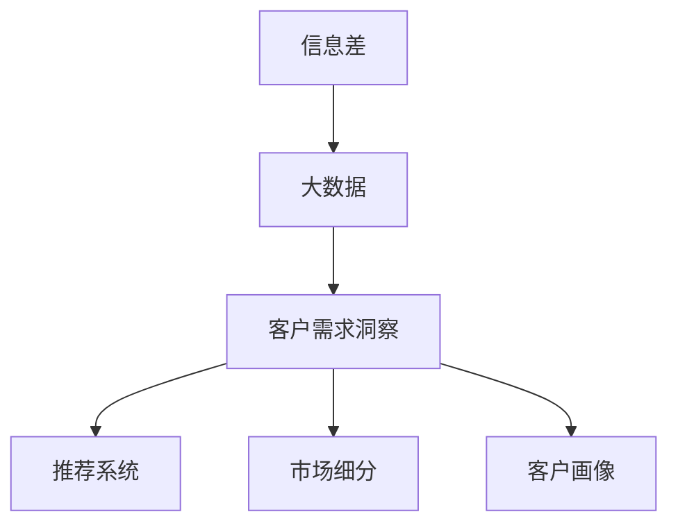
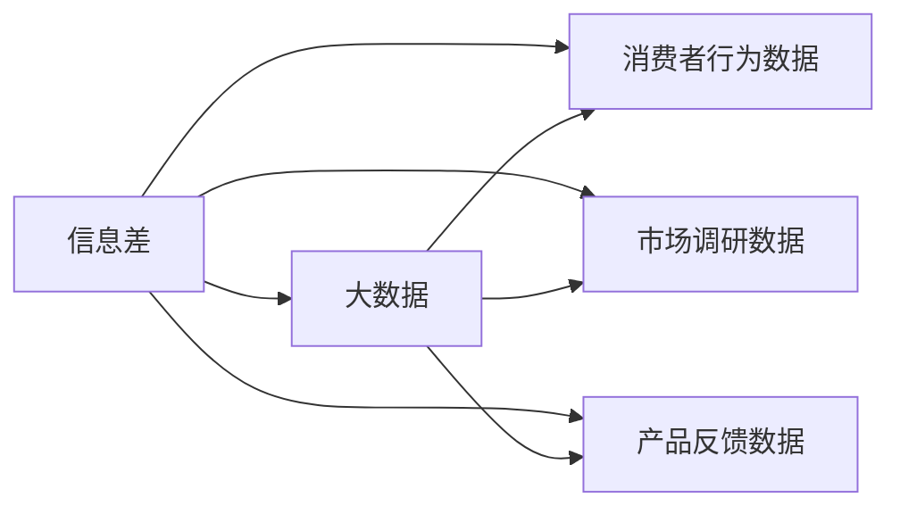
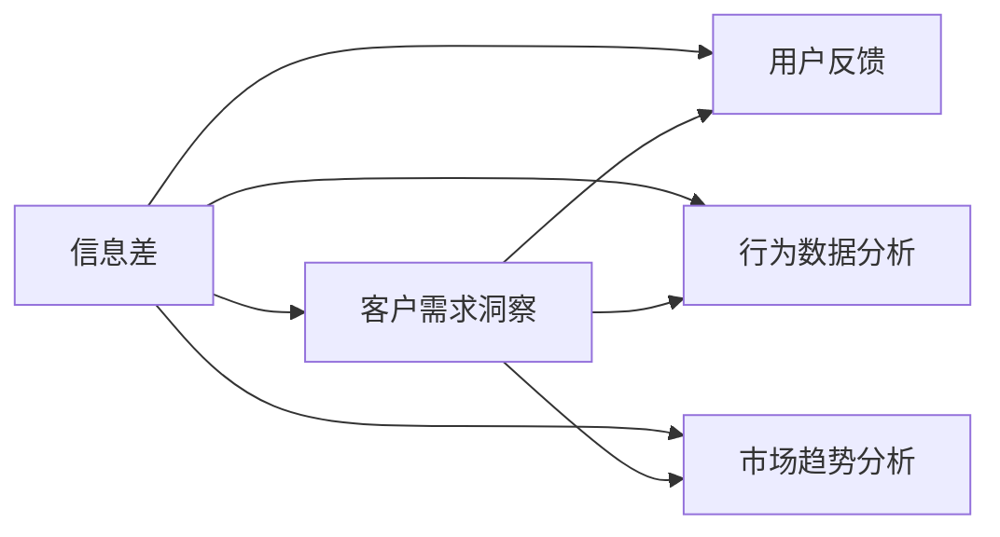
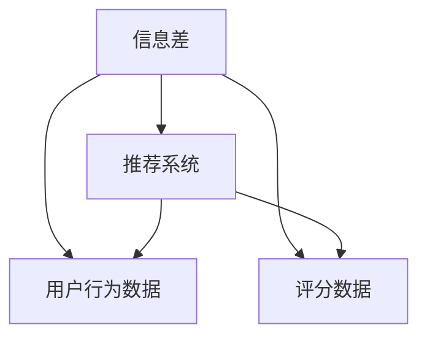
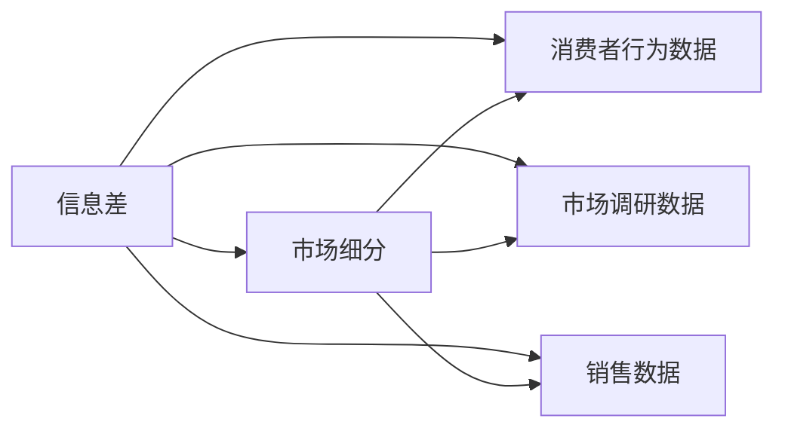
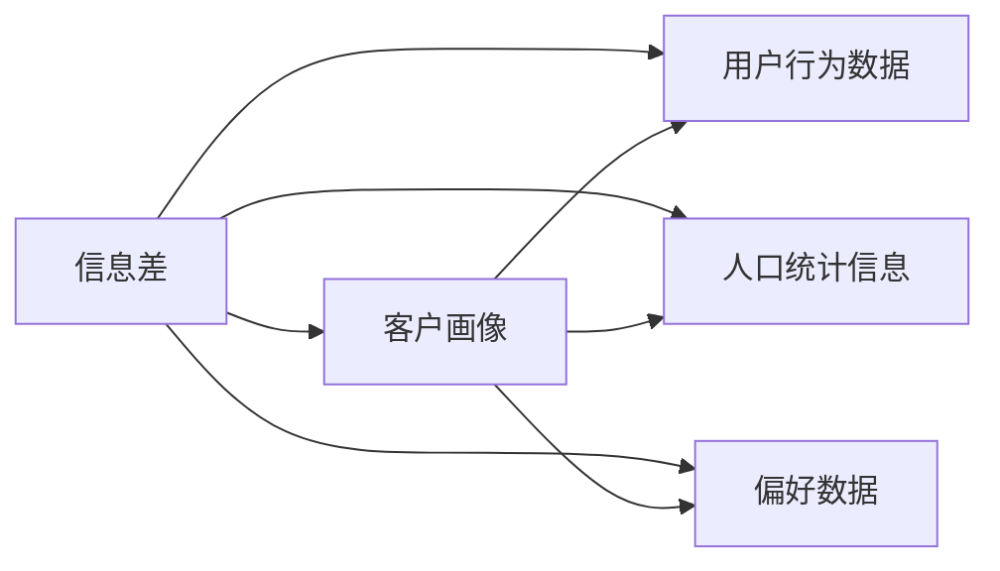

                 

# 信息差的商业客户需求洞察：大数据如何发现客户需求

> 关键词：信息差, 商业客户需求洞察, 大数据, 需求预测, 市场细分, 客户画像, 推荐系统

## 1. 背景介绍

### 1.1 问题由来
在现代商业竞争环境中，企业面临日益激烈的市场挑战。如何精准地洞察客户需求，进而抓住市场先机，成为决定企业成败的关键。传统的市场调研方法（如问卷调查、访谈等）成本高、周期长，难以实时捕捉到客户行为的变化。信息差（Information Gap）作为一种新兴的市场分析手段，借助大数据技术，通过挖掘消费者行为数据，可以更高效、更精准地把握客户需求，为企业决策提供科学依据。

### 1.2 问题核心关键点
信息差是指消费者期望的产品或服务与实际提供之间存在的不匹配，即信息不对称。这种信息不对称可能导致消费者的期望无法满足，进而影响购买决策和忠诚度。通过大数据技术，企业可以更好地识别信息差，优化产品和服务，提升客户满意度，实现业务增长。

信息差分析的核心在于：
- 识别消费者的真实需求与现有产品的差距。
- 理解消费者行为模式和偏好。
- 实时调整产品和服务，以满足市场变化。

### 1.3 问题研究意义
研究信息差分析，对于企业精准把握客户需求、提升产品和服务的质量，以及优化市场策略，具有重要意义：

1. **提高客户满意度**：及时识别并解决信息差，可以显著提升客户满意度，增强品牌忠诚度。
2. **优化产品和服务**：通过数据驱动的决策，企业可以更快地推出符合市场期望的产品和服务。
3. **降低市场风险**：了解市场真实需求，可以避免投入错误的产品开发和营销资源，降低市场风险。
4. **提升业务效率**：数据驱动的市场分析可以加速决策过程，提升企业运营效率。
5. **探索新市场机会**：大数据分析可以发现市场的新需求和潜在的增长点，帮助企业抓住新的市场机遇。

## 2. 核心概念与联系

### 2.1 核心概念概述

为了更好地理解信息差分析的原理和应用，本节将介绍几个关键概念：

- **信息差（Information Gap）**：指消费者期望的产品或服务与实际提供之间的差距。
- **大数据（Big Data）**：指海量的、多样化的、高速率的数据集合，通过先进的数据处理技术进行分析，从而发现新知识、创造新价值。
- **客户需求洞察（Customer Demand Insight）**：通过数据分析，理解客户的需求和偏好，为企业决策提供依据。
- **推荐系统（Recommendation System）**：利用用户行为数据，推荐个性化的产品或服务。
- **市场细分（Market Segmentation）**：将市场划分为具有相似需求特征的子市场，便于精准营销。
- **客户画像（Customer Profile）**：基于客户数据构建的详细描述，包括行为、兴趣、人口统计信息等。

这些核心概念通过以下Mermaid流程图来展示：



这个流程图展示了信息差分析与大数据、客户需求洞察、推荐系统、市场细分、客户画像之间的联系：信息差通过大数据技术被挖掘，进而通过客户需求洞察指导推荐系统和市场细分策略，最终形成详细的客户画像，指导具体的产品和市场决策。

### 2.2 概念间的关系

这些核心概念之间存在紧密的联系，形成了信息差分析的完整框架。下面通过几个Mermaid流程图来展示这些概念之间的关系。

#### 2.2.1 信息差与大数据的关系



这个流程图展示了信息差通过大数据技术，从多个数据源（消费者行为、市场调研、产品反馈等）中挖掘，用于识别和分析信息差。

#### 2.2.2 信息差与客户需求洞察的关系



这个流程图展示了信息差分析通过客户反馈、行为分析和市场趋势分析，洞察消费者的真实需求，为企业决策提供依据。

#### 2.2.3 信息差与推荐系统的关系



这个流程图展示了信息差分析通过用户行为和评分数据，指导推荐系统的优化，提升推荐效果。

#### 2.2.4 信息差与市场细分的关系



这个流程图展示了信息差分析通过消费者行为、市场调研和销售数据，帮助企业进行市场细分，优化市场策略。

#### 2.2.5 信息差与客户画像的关系



这个流程图展示了信息差分析通过用户行为、人口统计和偏好数据，构建详细的客户画像，指导具体的产品和市场策略。

### 2.3 核心概念的整体架构

最后，我们用一个综合的流程图来展示这些核心概念在大数据背景下的整体架构：


这个综合流程图展示了从大数据到信息差分析，再到客户需求洞察、推荐系统、市场细分和客户画像的全过程。通过这一连串的数据驱动分析，企业可以更精准地把握客户需求，优化产品和服务，提升市场竞争力。

## 3. 核心算法原理 & 具体操作步骤
### 3.1 算法原理概述

信息差分析的算法原理可以概括为：

1. **数据采集**：收集消费者的行为数据、市场调研数据、产品反馈数据等多源数据。
2. **数据清洗与预处理**：对原始数据进行清洗、去重、标准化等预处理，确保数据质量。
3. **信息差挖掘**：通过统计分析和机器学习模型，识别出消费者的期望与实际提供之间的差距。
4. **需求洞察**：分析消费者行为数据，理解消费者的需求和偏好，生成需求洞察报告。
5. **市场细分与画像构建**：基于需求洞察报告，进行市场细分和客户画像构建，指导市场策略和产品开发。

### 3.2 算法步骤详解

以下是对信息差分析各个步骤的详细解释：

**Step 1: 数据采集**

数据采集是信息差分析的基础。企业需要从多个渠道收集消费者的行为数据，包括：

- 线上行为数据：通过网站、App、社交媒体等渠道获取用户的点击、浏览、购买、评价等行为数据。
- 线下行为数据：通过问卷调查、访谈、销售记录等方式收集消费者的行为和偏好信息。
- 市场调研数据：通过第三方调研机构获取市场趋势和消费者需求数据。

**Step 2: 数据清洗与预处理**

数据清洗与预处理是保证数据分析质量的关键步骤。常用的数据清洗方法包括：

- 去重：去除重复的记录，确保数据唯一性。
- 异常值处理：识别和处理异常数据点，避免对分析结果的干扰。
- 数据标准化：对不同来源的数据进行格式和单位标准化，便于后续分析。

**Step 3: 信息差挖掘**

信息差挖掘是信息差分析的核心步骤。常见的信息差挖掘方法包括：

- 聚类分析：通过聚类算法（如K-means、层次聚类等），识别出消费者群体的不同需求特征。
- 分类分析：通过分类算法（如决策树、随机森林等），识别出消费者行为与产品之间的匹配程度。
- 关联规则挖掘：通过关联规则算法（如Apriori、FP-growth等），发现消费者行为与产品之间的关系。
- 文本挖掘：通过文本分析工具（如NLTK、spaCy等），提取和分析消费者的评论、反馈等文本数据，理解其需求和偏好。

**Step 4: 需求洞察**

需求洞察是通过数据分析，生成对消费者需求的详细报告。常见的需求洞察报告包括：

- 需求分布：分析消费者需求的分布特征，识别出最显著的需求痛点。
- 需求趋势：通过时间序列分析，识别出需求的变化趋势和周期性特征。
- 需求关联：分析不同产品或服务之间的关联性，发现潜在的市场需求。

**Step 5: 市场细分与画像构建**

市场细分与客户画像构建是信息差分析的最终目的。常用的市场细分和画像构建方法包括：

- 细分算法：通过细分算法（如K-means、DBSCAN等），将市场划分为具有相似需求特征的子市场。
- 画像构建：基于消费者行为数据、偏好数据、人口统计信息等，构建详细的客户画像，指导产品开发和市场策略。

### 3.3 算法优缺点

信息差分析具有以下优点：

1. **高效性**：通过大数据技术，可以快速识别消费者的需求和信息差，减少人工调研的时间和成本。
2. **准确性**：通过多源数据的综合分析，可以获得更全面、更准确的需求洞察。
3. **动态性**：实时监控市场变化，及时调整市场策略，保持竞争优势。

同时，信息差分析也存在一些局限性：

1. **数据质量要求高**：需要收集大量的高质量数据，数据缺失、异常等问题可能影响分析结果的准确性。
2. **技术门槛高**：需要具备一定的数据处理和机器学习技术，普通企业难以独立完成。
3. **隐私问题**：在收集和分析消费者数据时，需要注意隐私保护，避免数据泄露和滥用。

### 3.4 算法应用领域

信息差分析已经在多个行业得到应用，包括但不限于：

- **零售行业**：通过分析消费者行为数据，优化产品组合、促销策略，提升销售额。
- **金融行业**：通过分析客户交易数据，识别风险点和投资机会，优化产品设计。
- **医疗行业**：通过分析患者健康数据，识别疾病风险，优化诊疗方案。
- **旅游行业**：通过分析游客行为数据，优化旅游线路和推荐服务，提升客户满意度。
- **教育行业**：通过分析学生学习数据，识别学习需求，优化教学内容和方式。

## 4. 数学模型和公式 & 详细讲解  
### 4.1 数学模型构建

信息差分析的数学模型可以构建为以下形式：

假设消费者的期望为 $E$，实际提供为 $A$，信息差为 $I$。信息差 $I$ 可以表示为 $I = E - A$。

通过大数据技术，可以构建以下数学模型：

$$
\min_{\theta} \sum_{i=1}^n (E_i - A_i)^2
$$

其中 $\theta$ 为模型参数，$E_i$ 为第 $i$ 个消费者的期望，$A_i$ 为第 $i$ 个消费者的实际提供。

### 4.2 公式推导过程

信息差分析的公式推导主要涉及以下步骤：

1. **数据采集**：收集消费者的行为数据 $X_i$ 和市场调研数据 $Y_i$，构建数据集 $\mathcal{D}$。
2. **数据清洗与预处理**：对数据进行清洗和预处理，去除异常值和噪声，标准化数据。
3. **特征提取**：使用特征提取算法（如PCA、LDA等），从原始数据中提取有用的特征 $\mathcal{F}$。
4. **模型训练**：使用机器学习算法（如回归、分类等），训练模型 $\hat{A} = f(X_i, \mathcal{F}, \theta)$，预测消费者的实际提供。
5. **信息差计算**：计算模型预测与实际提供之间的差异 $I_i = E_i - \hat{A}_i$，生成信息差报告。

### 4.3 案例分析与讲解

假设我们在电商平台上进行信息差分析，目标是从消费者的浏览、购买行为中识别出产品的不足和消费者的真实需求。

1. **数据采集**：从电商平台上收集消费者的浏览记录、购买记录、评价记录等数据。
2. **数据清洗与预处理**：对数据进行去重、异常值处理、标准化等预处理，确保数据质量。
3. **特征提取**：使用PCA算法对数据进行降维，提取有用的特征。
4. **模型训练**：使用回归算法（如线性回归、随机森林等），训练模型预测消费者的实际购买行为。
5. **信息差计算**：计算模型预测与实际购买行为之间的差异，识别出信息差，生成需求洞察报告。

通过上述步骤，我们可以发现消费者对某些产品的需求与实际提供之间存在差距，进而优化产品设计，提升客户满意度。

## 5. 项目实践：代码实例和详细解释说明
### 5.1 开发环境搭建

在进行信息差分析项目实践前，我们需要准备好开发环境。以下是使用Python进行Pandas和Scikit-learn开发的环境配置流程：

1. 安装Anaconda：从官网下载并安装Anaconda，用于创建独立的Python环境。

2. 创建并激活虚拟环境：
```bash
conda create -n pydata-env python=3.8 
conda activate pydata-env
```

3. 安装Pandas和Scikit-learn：
```bash
conda install pandas scikit-learn
```

4. 安装其他常用工具包：
```bash
pip install numpy matplotlib seaborn matplotlib
```

完成上述步骤后，即可在`pydata-env`环境中开始信息差分析实践。

### 5.2 源代码详细实现

下面以电商平台的信息差分析为例，给出使用Pandas和Scikit-learn进行信息差分析的Python代码实现。

首先，定义数据处理函数：

```python
import pandas as pd
from sklearn.preprocessing import StandardScaler
from sklearn.decomposition import PCA
from sklearn.linear_model import LinearRegression

def preprocess_data(data):
    # 去重
    data = data.drop_duplicates()
    # 异常值处理
    data = data.dropna()
    # 标准化
    scaler = StandardScaler()
    data['features'] = scaler.fit_transform(data[['feature1', 'feature2', 'feature3']])
    return data

def extract_features(data):
    # 特征提取
    pca = PCA(n_components=2)
    features = pca.fit_transform(data[['feature1', 'feature2', 'feature3']])
    return features

def train_model(features, labels):
    # 模型训练
    model = LinearRegression()
    model.fit(features, labels)
    return model

def analyze_info_gap(model, data):
    # 信息差计算
    predictions = model.predict(data[['feature1', 'feature2', 'feature3']])
    info_gap = data['expected'] - predictions
    return info_gap
```

然后，加载和处理数据：

```python
# 加载数据
data = pd.read_csv('consumer_data.csv')
# 数据预处理
data = preprocess_data(data)
# 特征提取
features = extract_features(data)
# 训练模型
model = train_model(features, data['actual'])
# 计算信息差
info_gap = analyze_info_gap(model, data)
```

最后，可视化信息差结果：

```python
import matplotlib.pyplot as plt

plt.hist(info_gap, bins=30)
plt.xlabel('信息差')
plt.ylabel('频次')
plt.title('消费者信息差分布')
plt.show()
```

### 5.3 代码解读与分析

让我们再详细解读一下关键代码的实现细节：

**preprocess_data函数**：
- `drop_duplicates`方法：去除重复记录。
- `dropna`方法：去除缺失值。
- `StandardScaler`类：标准化数据。

**extract_features函数**：
- `PCA`类：使用主成分分析法（PCA）对数据进行降维。
- `fit_transform`方法：提取主成分特征。

**train_model函数**：
- `LinearRegression`类：使用线性回归模型进行训练。
- `fit`方法：模型训练。

**analyze_info_gap函数**：
- `predict`方法：模型预测。
- `info_gap`计算：计算预测值与真实值之间的差异。

**可视化结果**：
- `matplotlib`库：用于绘制直方图，展示信息差分布。

通过上述代码实现，我们可以快速进行信息差分析，并直观地展示分析结果。当然，实际的商业项目中，还需要考虑更多因素，如数据源的选择、特征工程的技巧、模型的评估指标等，才能保证信息差分析的效果。

## 6. 实际应用场景

### 6.1 电商平台

在电商平台上，信息差分析可以应用于多个方面，包括：

- **产品优化**：通过分析消费者对产品的评分和评价，识别出产品的不足和消费者的真实需求，优化产品设计和功能。
- **市场细分**：基于消费者行为数据，识别出不同的消费者群体，进行市场细分，制定精准的市场营销策略。
- **推荐系统**：通过分析消费者的浏览和购买行为，优化推荐算法，提升个性化推荐效果。

### 6.2 金融行业

在金融行业中，信息差分析可以应用于：

- **产品设计**：通过分析客户交易数据，识别出客户的真实需求和潜在风险，优化金融产品设计和功能。
- **风险管理**：通过分析客户的交易行为和偏好，识别出高风险客户群体，进行风险管理。
- **客户细分**：基于客户交易数据，识别出不同的客户群体，制定差异化的营销策略。

### 6.3 医疗行业

在医疗行业中，信息差分析可以应用于：

- **诊疗方案优化**：通过分析患者的健康数据，识别出疾病风险和需求，优化诊疗方案。
- **药物研发**：通过分析患者的用药数据，识别出药物的疗效和副作用，优化药物研发方向。
- **健康管理**：基于患者健康数据，提供个性化的健康管理建议。

### 6.4 旅游行业

在旅游行业中，信息差分析可以应用于：

- **旅游线路优化**：通过分析游客的行程记录，识别出旅游线路的不足和游客的真实需求，优化旅游线路设计。
- **景区推荐**：基于游客的兴趣和行为数据，推荐适合的旅游景区和活动。
- **满意度提升**：通过分析游客的评价和反馈，识别出游客的不满和需求，提升旅游服务质量。

## 7. 工具和资源推荐

### 7.1 学习资源推荐

为了帮助开发者系统掌握信息差分析的理论基础和实践技巧，这里推荐一些优质的学习资源：

1. 《Python数据科学手册》：一本关于数据科学和数据分析的经典书籍，介绍了Pandas、Scikit-learn等库的基本用法和实践技巧。

2. Kaggle学习资源：Kaggle是一个数据科学竞赛平台，提供了大量的数据集和竞赛项目，可以锻炼数据分析和机器学习的实战能力。

3. Coursera《机器学习》课程：由斯坦福大学开设的机器学习课程，系统讲解了机器学习的基本概念和算法，适合初学者入门。

4. arXiv论文预印本：人工智能领域最新研究成果的发布平台，包括大量尚未发表的前沿工作，学习前沿技术的必读资源。

5. GitHub热门项目：在GitHub上Star、Fork数最多的数据科学项目，往往代表了该技术领域的发展趋势和最佳实践，值得去学习和贡献。

通过对这些资源的学习实践，相信你一定能够快速掌握信息差分析的精髓，并用于解决实际的商业问题。

### 7.2 开发工具推荐

高效的开发离不开优秀的工具支持。以下是几款用于信息差分析开发的常用工具：

1. Jupyter Notebook：一个交互式的Python开发环境，可以边写代码边运行，方便调试和展示结果。

2. Pandas：一个强大的数据处理库，提供了丰富的数据清洗和预处理工具。

3. Scikit-learn：一个常用的机器学习库，提供了多种机器学习算法和评估工具。

4. TensorFlow和PyTorch：深度学习框架，可以用于处理大规模数据集和复杂模型。

5. Weights & Biases：一个模型实验跟踪工具，可以记录和可视化模型训练过程中的各项指标，方便对比和调优。

6. Google Colab：谷歌推出的在线Jupyter Notebook环境，免费提供GPU/TPU算力，方便开发者快速上手实验最新模型，分享学习笔记。

合理利用这些工具，可以显著提升信息差分析的开发效率，加快创新迭代的步伐。

### 7.3 相关论文推荐

信息差分析作为新兴的研究方向，近年来也吸引了许多学者的关注，以下几篇论文代表了这个领域的最新研究成果：

1. "Information Gaps: Revisiting the Concept and Practices of Information Management" - Jeffrey W. sexsmith and Sandra Gaffney
2. "Understanding Information Gaps and Bridging Them with Data Visualization" - Benjamin Sivy
3. "Data Management: Bridging the Information Gap" - Matthew G. Okero and Rolf W. Schatz
4. "Bridging the Information Gap with Data Governance" - Elizabeth Bock and Thomas M. Siegrist
5. "Crossing the Information Gap with Big Data Analytics" - Caryn L. D'Amico and R. Barnes Myers

这些论文代表了信息差分析的前沿思想和技术，对于进一步深入理解信息差分析具有重要参考价值。

除上述资源外，还有一些值得关注的前沿资源，帮助开发者紧跟信息差分析技术的最新进展，例如：

1. arXiv论文预印本：人工智能领域最新研究成果的发布平台，包括大量尚未发表的前沿工作，学习前沿技术的必读资源。

2. 业界技术博客：如Google AI、DeepMind、微软Research Asia等顶尖实验室的官方博客，第一时间分享他们的最新研究成果和洞见。

3. 技术会议直播：如KDD、ICML、NIPS等人工智能领域顶会现场或在线直播，能够聆听到大佬们的前沿分享，开拓视野。

4. GitHub热门项目：在GitHub上Star、Fork数最多的数据科学项目，往往代表了该技术领域的发展趋势和最佳实践，值得去学习和贡献。

5. 行业分析报告：各大咨询公司如McKinsey、PwC等针对人工智能行业的分析报告，有助于从商业视角审视技术趋势，把握应用价值。

总之，对于信息差分析的学习和实践，需要开发者保持开放的心态和持续学习的意愿。多关注前沿资讯，多动手实践，多思考总结，必将收获满满的成长收益。

## 8. 总结：未来发展趋势与挑战

### 8.1 总结

本文对信息差分析的理论基础和实践应用进行了全面系统的介绍。通过数据分析，企业可以更好地识别消费者需求与实际提供之间的差距，从而优化产品和服务，提升客户满意度。本文展示了信息差分析在电商、金融、医疗、旅游等多个行业的应用案例，揭示了其巨大的商业价值。

通过本文的系统梳理，可以看到，信息差分析作为数据驱动的市场洞察手段，正在被越来越多的企业所接受和应用。信息差分析通过大数据技术，从多个数据源中挖掘消费者行为数据，识别出消费者期望与实际提供之间的差距，为企业决策提供科学依据。

### 8.2 未来发展趋势

展望未来，信息差分析技术将呈现以下几个发展趋势：

1. **多源数据融合**：未来将进一步融合线上线下多渠道的数据，形成更全面、更准确的信息差洞察。
2. **实时分析**：通过实时数据流处理技术，实现对市场变化的即时分析，提供更动态的信息差报告。
3. **跨行业应用**：信息差分析技术将扩展到更多行业，如教育、交通、能源等，为不同行业的市场需求洞察提供支持。
4. **智能化决策**：结合人工智能技术，如深度学习、自然语言处理等，进一步提升信息差分析的智能化水平。
5. **用户交互**：通过增强用户交互，如用户反馈、在线访谈等，实时获取消费者的需求反馈，优化信息差分析模型。

以上趋势凸显了信息差分析技术的广阔前景。这些方向的探索发展，必将进一步提升信息差分析的效果，为不同行业的市场需求洞察提供更全面、更及时的支持。

### 8.3 面临的挑战

尽管信息差分析技术已经取得了一定进展，但在迈向更加智能化、普适化应用的过程中，仍面临以下挑战：

1. **数据隐私**：在收集和分析消费者数据时，需要注意隐私保护，避免数据泄露和滥用。
2. **数据质量**：需要收集大量的高质量数据，数据缺失、异常等问题可能影响分析结果的准确性。
3. **技术门槛**：需要具备一定的数据处理和机器学习技术，普通企业难以独立完成。
4. **模型复杂度**：信息差分析涉及多个数据源和算法，模型复杂度较高，需要较强的技术支撑。
5. **市场变化**：消费者需求和市场环境不断变化，信息差分析模型需要定期更新，以适应新情况。

### 8.4 研究展望

面对信息差分析所面临的挑战，未来的研究需要在以下几个方面寻求新的突破：

1. **隐私保护技术**：开发更先进的隐私保护

