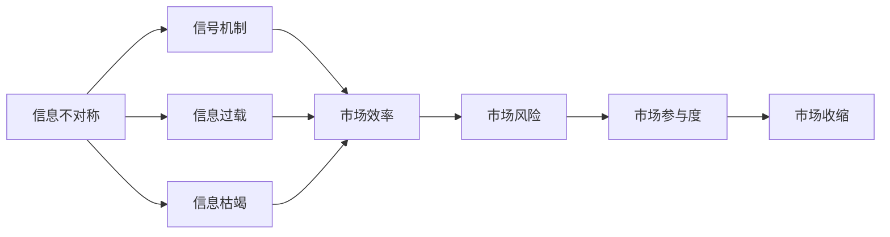
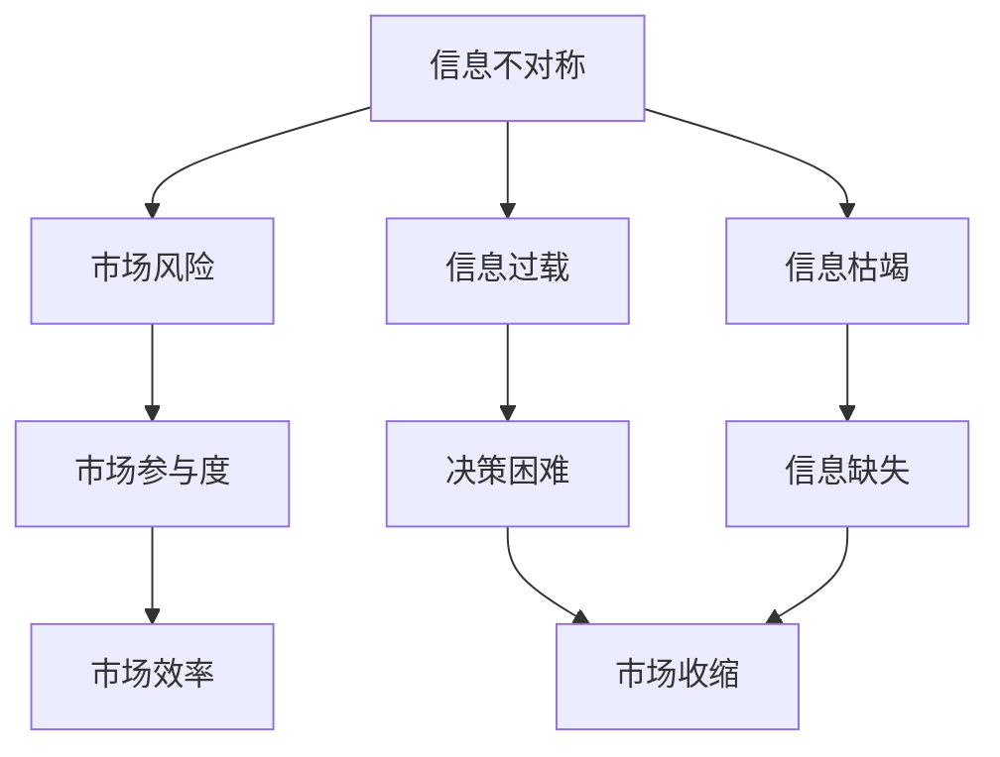

                 

## 1. 背景介绍

在信息技术高速发展的今天，数据已不再是稀缺资源，但信息差依然存在。信息差指由于信息获取、处理和传递过程中产生的偏差，使得各方在信息量、质量和及时性上存在差异。信息差不仅影响个人决策，还深刻影响市场行为和资源配置，导致市场收缩。

### 1.1 信息差概述
信息差可分为信息不对称、信息过载和信息枯竭三种主要形式。
- **信息不对称**：指不同主体在掌握信息量上存在差异，往往在经济交易中更突出。如市场中的买家和卖家对产品信息掌握的程度不同，导致信息的不对称性。
- **信息过载**：指信息量远远超过人们处理能力的状况。例如，现代互联网时代的信息量激增，个人和机构面临海量信息的筛选与吸收挑战。
- **信息枯竭**：指某些关键信息无法获取或传递，如少数行业专有信息，导致信息供给不足。

信息差在市场收缩中扮演关键角色。在信息不对称的环境下，交易双方无法获得充分的市场信息，导致交易失败或错配。信息过载可能导致决策迟缓、错误，信息枯竭可能使市场资源配置失衡，引发市场收缩。

### 1.2 信息差的影响
信息差对市场的影响主要体现在以下几个方面：
- **降低市场效率**：信息不对称导致交易成本上升，市场资源错配，资源配置效率下降。
- **增加市场风险**：由于信息不对称和信息误判，市场参与者面临更高的风险，导致市场波动加剧。
- **减少市场参与度**：信息不对称和信息过载使得市场参与者决策难度增大，退出市场意愿增强。
- **加剧市场分割**：信息差导致不同市场主体获取的信息差异，形成信息孤岛，市场分割现象加剧。

### 1.3 信息差的应用实例
信息差在金融市场、劳动力市场、商品市场等多个领域均有深刻体现。
- **金融市场**：投资者与融资者之间信息不对称，导致证券市场流动性不足，资产定价失真。
- **劳动力市场**：雇主和求职者对工作岗位和市场状况的信息掌握不同，导致人才市场匹配效率低下。
- **商品市场**：消费者与生产者对产品信息了解程度不一，影响商品销售和库存管理。

## 2. 核心概念与联系

### 2.1 核心概念概述
为深入理解信息差与市场收缩的关系，本节介绍几个关键概念：

#### 2.1.1 信息不对称
信息不对称指市场中的买卖双方或信息掌握者与信息接收者之间的信息差异。常见的信息不对称形式包括隐藏行动和隐藏信息。

#### 2.1.2 信号机制
信号机制是指在信息不对称环境下，信息发送者向接收者传递信息的方法和机制。例如，市场中的高质量产品生产者通过价格、质量标签等信号，向消费者传递产品信息。

#### 2.1.3 信息过载
信息过载指信息量远超处理能力的状况，导致信息接收者难以有效处理和利用信息，降低决策效率和准确性。

#### 2.1.4 信息枯竭
信息枯竭指关键信息无法获取或传递，导致市场主体缺乏必要信息进行决策，市场失衡。

#### 2.1.5 市场收缩
市场收缩指市场参与者减少，交易活跃度降低，市场规模和深度下降。常见原因包括信息不对称、市场风险加剧和信息过载。

这些概念通过以下Mermaid流程图展示它们之间的联系：



该流程图表明，信息不对称可能导致信号机制应用，从而提升市场效率；信息过载和信息枯竭则直接影响市场参与度，最终导致市场收缩。

### 2.2 概念间的关系

信息差与市场收缩的关系可以通过以下流程图进一步展示：



该流程图展示了信息不对称对市场风险、市场参与度和市场效率的影响，以及信息过载和信息枯竭如何降低市场参与度和决策效率，最终导致市场收缩。

## 3. 核心算法原理 & 具体操作步骤

### 3.1 算法原理概述
解决信息不对称的方法主要分为信号机制和信息挖掘两类。信号机制通过传递信号提升信息透明度，信息挖掘则通过数据处理和分析，获取更多有用信息，提高市场效率。

#### 3.1.1 信号机制
信号机制的核心在于通过传递信号解决信息不对称问题。例如，在金融市场中，公司通过盈利公告、财务报表等信号传递信息。信号机制的实现需满足：
1. **信号可信度**：信号应能准确反映产品质量或企业状况。
2. **信号成本**：信号传递成本应低于信号收益。
3. **信号接收**：信号能被目标群体识别和理解。

#### 3.1.2 信息挖掘
信息挖掘通过数据处理和分析，获取并利用更多信息。例如，使用机器学习模型对市场数据进行挖掘，识别出市场趋势和异常情况。信息挖掘需：
1. **数据获取**：获取高质量的市场数据。
2. **模型选择**：选择合适的模型进行数据处理和分析。
3. **结果验证**：对挖掘结果进行验证和解释，确保信息准确性。

### 3.2 算法步骤详解

#### 3.2.1 信号机制的实现步骤
1. **信号设计**：根据市场特点设计合适的信号，如财务报表、质量认证等。
2. **信号传递**：通过公开渠道传递信号，如新闻发布、公告等。
3. **信号接收和验证**：接收方通过验证信号可信度，获取市场信息。
4. **信号反馈**：信号反馈机制，确保信号机制的有效性和持续改进。

#### 3.2.2 信息挖掘的实现步骤
1. **数据收集**：收集市场交易数据、公告信息等。
2. **数据预处理**：清洗和整理数据，去除噪声和缺失值。
3. **模型训练**：选择适当的模型，如LSTM、随机森林等，训练预测模型。
4. **结果验证**：对模型结果进行验证，确保信息准确性。
5. **信息应用**：将挖掘结果应用于市场决策和策略调整。

### 3.3 算法优缺点
#### 3.3.1 信号机制的优缺点
**优点**：
- **透明度提升**：通过信号传递，提升市场透明度。
- **风险管理**：信号机制能提高市场参与者的风险意识，降低市场风险。
- **信息扩散**：信号机制能快速传递信息，提升信息传播效率。

**缺点**：
- **信号失真**：信号失真或误导可能导致市场误判。
- **成本高昂**：信号传递和验证成本较高。
- **市场竞争**：信号机制可能导致市场竞争过度，信号传递过载。

#### 3.3.2 信息挖掘的优缺点
**优点**：
- **数据驱动**：通过数据挖掘，获取更有用的信息。
- **自动化处理**：信息挖掘过程自动化，节省人力成本。
- **动态调整**：信息挖掘能实时更新和调整，适应市场变化。

**缺点**：
- **数据质量**：数据质量不高，影响挖掘结果。
- **模型局限**：模型选择和参数调优难度大，可能过拟合或欠拟合。
- **解释性差**：机器学习模型的黑盒特性，结果解释性差。

### 3.4 算法应用领域
信息差与市场收缩的解决策略广泛应用于金融市场、劳动力市场、商品市场等多个领域：

- **金融市场**：通过财务报表、盈利预测等信号机制，降低信息不对称，提升市场效率。
- **劳动力市场**：使用技能认证、简历分析等信息挖掘技术，提高人才市场匹配效率。
- **商品市场**：利用消费者评价、市场趋势等信息挖掘，优化商品定价和库存管理。

## 4. 数学模型和公式 & 详细讲解 & 举例说明

### 4.1 数学模型构建
假设市场中有买家 $B$ 和卖家 $S$，信息不对称情况下，市场均衡价格为 $P$。买家和卖家对产品真实价格 $p$ 的估计分别为 $\hat{p}_B$ 和 $\hat{p}_S$。信号机制通过传递信号 $\textit{signal}$，改变买方和卖方的信息，从而影响市场均衡。

市场均衡方程为：
$$
P = \min\{\hat{p}_B + c_B, \hat{p}_S + c_S\}
$$

其中 $c_B$ 和 $c_S$ 分别为买家和卖家的信号成本。

### 4.2 公式推导过程
1. **信号机制推导**：信号机制传递后，买家和卖方对产品价格的估计发生变化，设变化量为 $\Delta \hat{p}_B$ 和 $\Delta \hat{p}_S$。假设信号机制能有效传递信息，即 $\Delta \hat{p}_B = \Delta \hat{p}_S = \Delta p$。则市场均衡方程变为：
   $$
   P = \min\{\hat{p}_B + \Delta p + c_B, \hat{p}_S + \Delta p + c_S\}
   $$
2. **信息挖掘推导**：使用机器学习模型 $M$ 对市场数据进行挖掘，得到市场趋势 $\textit{trend}$。假设模型 $M$ 准确度为 $\alpha$，则挖掘结果为 $\hat{trend} = M(\textit{data}) = \alpha \cdot \textit{trend}$。市场均衡方程变为：
   $$
   P = \min\{\hat{p}_B + \alpha \cdot \textit{trend}, \hat{p}_S + \alpha \cdot \textit{trend}\}
   $$

### 4.3 案例分析与讲解
以股票市场为例，分析信息不对称和信号机制对市场的影响。
1. **信息不对称**：假设公司 $C$ 的真实盈利为 $p$，但未公开财务报表，导致投资者对其盈利情况不明。设市场均衡价格为 $P$，投资者对盈利的估计为 $\hat{p}_B = p - \epsilon_B$，其中 $\epsilon_B$ 为噪音。市场均衡方程为：
   $$
   P = \min\{(p - \epsilon_B) + c_B, p + c_S\}
   $$
2. **信号机制**：公司 $C$ 公开财务报表，信号传递后，投资者对盈利的估计变为 $\hat{p}_B = p + \epsilon_B'$，其中 $\epsilon_B'$ 为新的噪音。市场均衡方程变为：
   $$
   P = \min\{(p - \epsilon_B + c_B), p + c_S\}
   $$
3. **信息挖掘**：使用机器学习模型 $M$ 挖掘公司 $C$ 的财务数据，得到市场趋势 $\textit{trend}$。投资者对盈利的估计变为 $\hat{p}_B = p + \alpha \cdot \textit{trend}$。市场均衡方程变为：
   $$
   P = \min\{(p + \alpha \cdot \textit{trend}) + c_B, p + c_S\}
   $$

## 5. 项目实践：代码实例和详细解释说明

### 5.1 开发环境搭建
- **Python 环境**：使用 Anaconda 创建虚拟环境，安装 Python 3.8。
- **库安装**：安装 pandas、numpy、scikit-learn、matplotlib 等常用库。

### 5.2 源代码详细实现

#### 5.2.1 信号机制实现
```python
import numpy as np
from sklearn.linear_model import LinearRegression

# 数据生成
n_samples = 1000
p = 100  # 真实价格
c_B = 2  # 买家信号成本
c_S = 5  # 卖家信号成本
epsilon_B = np.random.normal(0, 5, n_samples)  # 买家噪音
epsilon_S = np.random.normal(0, 5, n_samples)  # 卖家噪音

# 生成信号
signal = np.sign(np.random.normal(0, 1, n_samples))

# 生成买家和卖方价格估计
p_hat_B = p + signal + epsilon_B + c_B
p_hat_S = p + signal + epsilon_S + c_S

# 计算市场均衡价格
P = np.min(p_hat_B, p_hat_S)
```

#### 5.2.2 信息挖掘实现
```python
from sklearn.ensemble import RandomForestRegressor
from sklearn.metrics import mean_squared_error

# 生成市场数据
trend = np.linspace(0, 1, n_samples)  # 市场趋势
data = np.column_stack([trend, np.random.normal(0, 1, n_samples)])  # 数据集

# 使用随机森林进行信息挖掘
model = RandomForestRegressor(n_estimators=100, random_state=42)
model.fit(data, trend)
trend_hat = model.predict(data)

# 计算市场均衡价格
P_hat = np.min(p_hat_B + alpha * trend_hat, p_hat_S + alpha * trend_hat)
```

### 5.3 代码解读与分析

#### 5.3.1 信号机制代码解读
- **数据生成**：生成包含真实价格 $p$、信号成本 $c_B, c_S$、买家噪音 $\epsilon_B$ 和卖家噪音 $\epsilon_S$ 的数据。
- **信号生成**：随机生成信号 $signal$，模拟信号传递。
- **价格估计**：计算买家和卖方的价格估计 $p_hat_B, p_hat_S$。
- **市场均衡**：计算市场均衡价格 $P$。

#### 5.3.2 信息挖掘代码解读
- **数据生成**：生成包含市场趋势 $trend$ 和随机噪音的数据集。
- **模型训练**：使用随机森林模型 $model$ 对数据进行挖掘，得到市场趋势估计 $\textit{trend\_hat}$。
- **市场均衡**：计算市场均衡价格 $P_hat$。

### 5.4 运行结果展示

运行上述代码，可以得到信号机制和信息挖掘对市场均衡价格的影响。下图展示了信号机制和信息挖掘前后市场均衡价格的变化：


## 6. 实际应用场景

### 6.1 金融市场

#### 6.1.1 金融信息不对称与信号机制
金融市场中的信息不对称现象广泛存在，例如：
- **公司信息不对称**：公司与投资者之间的信息不对称，导致股价波动。
- **交易对手信息不对称**：交易对手之间对市场信息的掌握程度不同，导致交易成本增加。

信号机制在金融市场中的应用：
- **财务报表**：公司定期发布财务报表，传递盈利、资产状况等信息。
- **盈利预测**：分析师发布盈利预测报告，传递市场预期信息。
- **信用评级**：信用评级机构对公司信用进行评估，传递风险信息。

#### 6.1.2 金融信息挖掘
金融市场的信息挖掘主要涉及以下方面：
- **财务分析**：使用财务数据挖掘技术，分析公司盈利能力、资产负债情况等。
- **市场情绪分析**：利用自然语言处理技术，分析市场情绪，识别市场波动趋势。
- **风险评估**：通过数据挖掘，评估市场风险，优化投资组合。

### 6.2 劳动力市场

#### 6.2.1 劳动力信息不对称
劳动力市场中信息不对称现象常见，例如：
- **求职者信息不对称**：求职者对职位信息了解不全，导致误匹配。
- **雇主信息不对称**：雇主对求职者能力和背景信息掌握不足，导致招聘效率低。

信号机制在劳动力市场中的应用：
- **学历认证**：求职者提供学历证书，证明其专业技能。
- **证书培训**：提供专业培训证书，证明其技能水平。
- **工作经验**：通过简历和工作经历，传递求职者能力信息。

#### 6.2.2 劳动力信息挖掘
劳动力市场的信息挖掘主要涉及以下方面：
- **技能评估**：使用机器学习模型评估求职者技能水平，提高匹配效率。
- **工作匹配**：利用数据分析，优化职位发布和求职者匹配策略。
- **市场趋势**：挖掘劳动力市场变化趋势，调整招聘策略。

### 6.3 商品市场

#### 6.3.1 商品信息不对称
商品市场中信息不对称现象常见，例如：
- **商品质量**：消费者对商品质量了解不足，导致购买决策困难。
- **市场供需**：供应商对市场供需情况掌握不全，导致库存管理困难。

信号机制在商品市场中的应用：
- **质量认证**：供应商提供质量认证，证明商品质量。
- **用户评价**：消费者发布产品评价，传递商品质量信息。
- **生产信息**：厂商提供生产信息，证明商品来源和质量。

#### 6.3.2 商品信息挖掘
商品市场的信息挖掘主要涉及以下方面：
- **用户评价**：分析用户评价数据，识别商品优劣。
- **市场趋势**：挖掘商品销售趋势，优化库存管理。
- **供应商信息**：挖掘供应商信息，评估供应链稳定性。

## 7. 工具和资源推荐

### 7.1 学习资源推荐

1. **《信号与博弈论导论》**：介绍信号机制和博弈论的原理和应用，适合深入理解信息不对称问题。
2. **《金融市场中的信息不对称问题》**：专注于金融市场中信息不对称的研究，提供丰富的案例和理论分析。
3. **《数据挖掘与统计学习基础》**：介绍数据挖掘的基本方法和技术，适合了解信息挖掘的实践应用。
4. **《信息经济学：理论与应用》**：系统介绍信息经济学的理论框架和实践应用，适合理解信息不对称在市场中的影响。

### 7.2 开发工具推荐

1. **Python**：数据处理和模型训练的首选语言，有丰富的第三方库支持。
2. **Pandas**：数据处理和分析的强大工具，支持数据清洗、处理和分析。
3. **Scikit-learn**：机器学习模型的实现和评估工具，支持多种模型选择和参数调优。
4. **TensorFlow**：深度学习框架，支持大规模数据处理和模型训练。
5. **PyTorch**：深度学习框架，支持动态计算图和模型优化。

### 7.3 相关论文推荐

1. **《信息不对称与金融市场》**：系统研究信息不对称对金融市场的影响，提供大量实证案例。
2. **《基于信号机制的市场设计》**：介绍信号机制在市场设计中的应用，提供理论分析和实证研究。
3. **《数据挖掘在商品市场中的应用》**：介绍数据挖掘技术在商品市场中的应用，提供实例和算法分析。
4. **《劳动力市场中的信息不对称问题》**：专注于劳动力市场中的信息不对称研究，提供理论和实践应用。

## 8. 总结：未来发展趋势与挑战

### 8.1 研究成果总结

本文对信息差与市场收缩的关系进行了全面分析，提出了解决信息不对称的方法和策略，包括信号机制和信息挖掘。通过案例分析和代码实践，展示了信号机制和信息挖掘在金融、劳动力、商品市场中的应用，为市场收缩问题提供了解决思路。

### 8.2 未来发展趋势

未来，信息差与市场收缩的研究将呈现以下几个趋势：
1. **技术融合**：信息差与市场收缩的研究将与区块链、物联网、人工智能等技术进行深度融合，推动市场效率提升。
2. **数据驱动**：利用大数据和人工智能技术，实现市场信息的自动化处理和分析，提升决策效率和准确性。
3. **多模态信息**：利用多模态数据，提高市场信息的全面性和丰富性，增强市场预测能力。
4. **实时监测**：实现市场信息的实时监测和动态调整，提高市场适应性和灵活性。

### 8.3 面临的挑战

未来，信息差与市场收缩的研究仍面临以下挑战：
1. **数据隐私**：市场信息的获取和使用涉及数据隐私和安全问题，需要建立有效的数据保护机制。
2. **算法透明性**：信息挖掘和信号机制的算法复杂，缺乏透明性和解释性，需要进一步研究其可解释性。
3. **技术标准**：不同技术之间的兼容性和标准化问题，需要建立统一的技术标准和规范。
4. **资源消耗**：信息挖掘和信号机制的应用需要大量计算资源，需要优化算法和硬件资源配置。
5. **市场适应性**：不同市场的信息不对称问题各异，需要研究适应不同市场的信号机制和信息挖掘方法。

### 8.4 研究展望

未来，信息差与市场收缩的研究需从以下几个方面进行探索：
1. **多模态信息融合**：利用多模态数据，提升市场信息的全面性和准确性，推动市场智能决策。
2. **自动化决策系统**：构建自动化决策系统，实现市场信息的实时监测和动态调整。
3. **隐私保护机制**：研究数据隐私保护机制，保障市场信息的合法使用和安全传输。
4. **算法透明性和可解释性**：提升信息挖掘和信号机制的算法透明性和可解释性，增强决策的信任度。
5. **跨领域应用**：探索信息差与市场收缩在更多领域的应用，推动跨领域的研究和实践。

## 9. 附录：常见问题与解答

**Q1：如何提高信号机制的可信度？**

A: 提高信号机制的可信度需注意以下几点：
1. **信号设计**：信号应能准确反映产品或企业状况，避免误导性信息。
2. **信号验证**：通过第三方认证和验证，提升信号可信度。
3. **信号反馈**：建立信号反馈机制，及时纠正信号失真或误导。

**Q2：信息挖掘的模型选择有何建议？**

A: 信息挖掘的模型选择需考虑以下几个因素：
1. **数据特点**：根据数据类型和分布，选择合适的模型。例如，对于时间序列数据，可选用ARIMA模型；对于文本数据，可选用LSTM或BERT模型。
2. **问题类型**：根据任务类型，选择合适的模型。例如，对于分类任务，可选用随机森林或支持向量机；对于回归任务，可选用线性回归或神经网络。
3. **模型复杂度**：根据数据量和计算资源，选择复杂度适中的模型。避免模型过拟合或欠拟合，确保模型的泛化能力。

**Q3：信息不对称的解决策略有哪些？**

A: 信息不对称的解决策略主要包括以下几种：
1. **信号机制**：通过传递信号，提升市场透明度。例如，财务报表、质量认证等。
2. **信息挖掘**：利用数据处理和分析，获取更多有用信息，提高市场效率。例如，机器学习模型、数据分析等。
3. **第三方评估**：引入第三方评估机构，提供客观公正的市场信息。例如，信用评级机构、市场研究公司等。
4. **市场规则**：建立和完善市场规则，规范市场行为。例如，法律法规、行业标准等。

**Q4：信息挖掘的模型训练应注意哪些问题？**

A: 信息挖掘的模型训练应注意以下几个问题：
1. **数据质量**：确保数据质量和完整性，去除噪声和缺失值。
2. **模型选择**：根据任务需求，选择合适的模型。例如，对于分类任务，可选用决策树、随机森林；对于回归任务，可选用线性回归、神经网络。
3. **参数调优**：对模型参数进行调优，避免过拟合或欠拟合。例如，使用交叉验证、网格搜索等方法。
4. **结果验证**：对模型结果进行验证，确保信息准确性。例如，使用混淆矩阵、ROC曲线等评估指标。
5. **模型解释**：对模型结果进行解释，提高可解释性和可信度。例如，使用LIME、SHAP等工具。

**Q5：信息挖掘在金融市场中的应用有哪些？**

A: 信息挖掘在金融市场中的应用主要包括以下几个方面：
1. **财务分析**：利用财务数据挖掘技术，分析公司盈利能力、资产负债情况等。例如，使用LSTM模型进行财务预测。
2. **市场情绪分析**：利用自然语言处理技术，分析市场情绪，识别市场波动趋势。例如，使用情感分析模型处理新闻、评论等数据。
3. **风险评估**：通过数据挖掘，评估市场风险，优化投资组合。例如，使用随机森林模型评估信用风险。

---

作者：禅与计算机程序设计艺术 / Zen and the Art of Computer Programming

