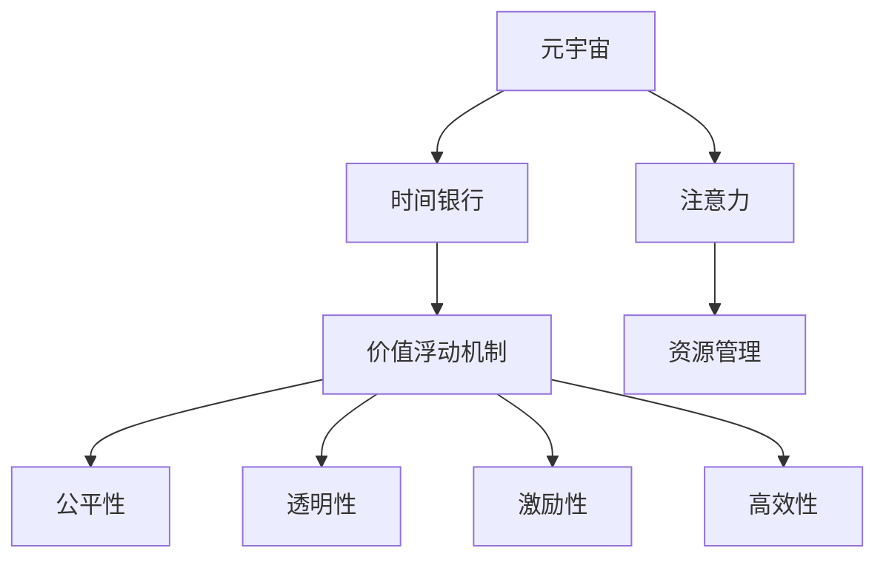
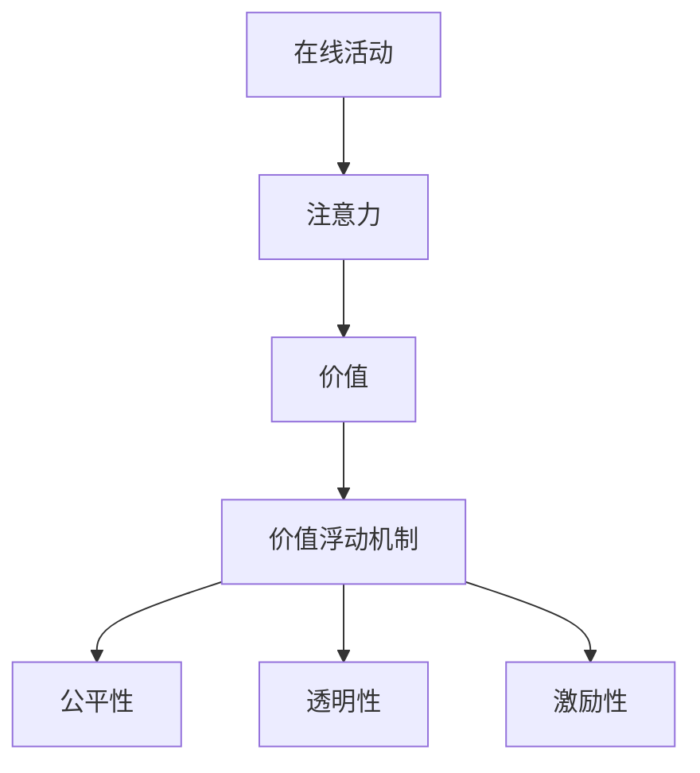
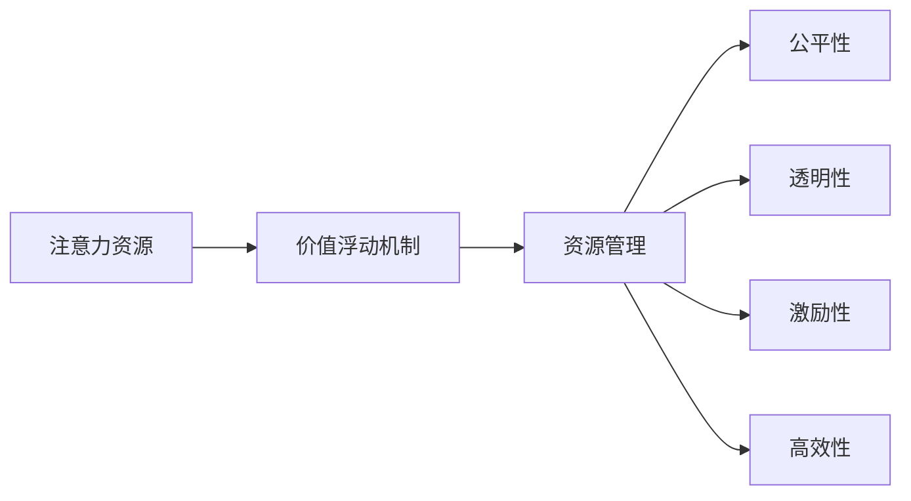
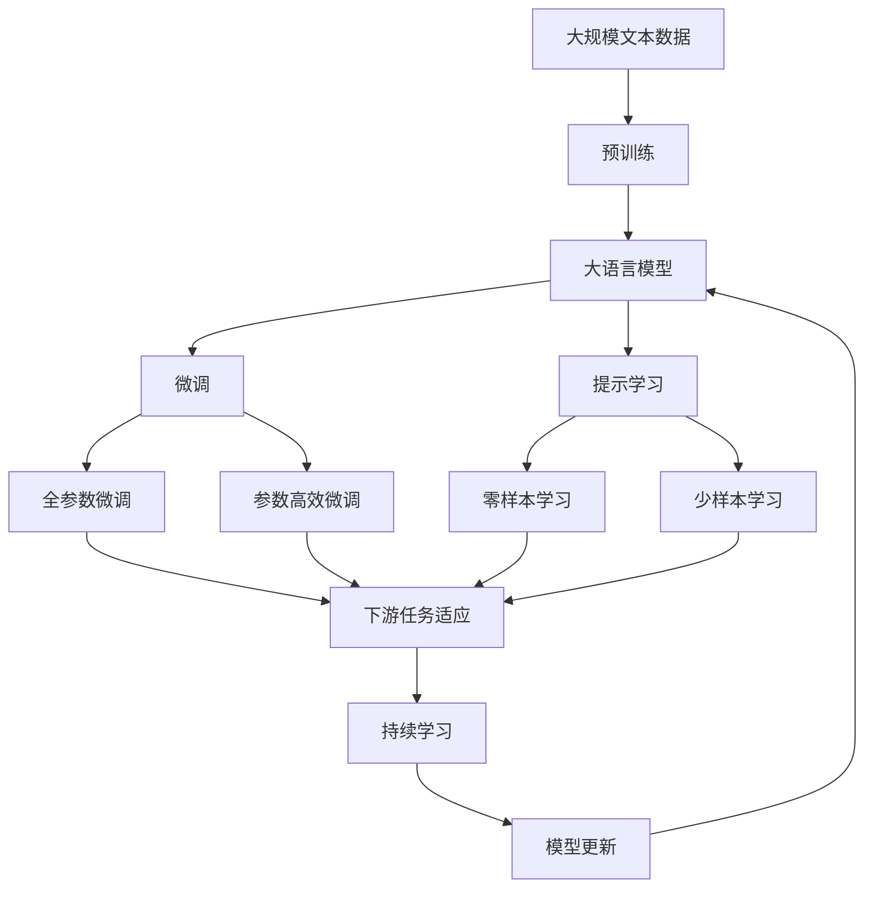

                 

# 元宇宙时间银行利率:注意力资源的价值浮动机制

> 关键词：元宇宙,时间银行,注意力,资源管理,价值浮动

## 1. 背景介绍

### 1.1 问题由来

随着技术的进步，元宇宙（Metaverse）正逐渐从科幻走向现实。在这一虚拟世界之中，时间不再是线性的，而是可以被存储、交换和货币化的一种资源。如何在元宇宙中高效管理和利用时间，成为一个亟待解决的问题。特别是，如何公平、透明地定义和评估注意力资源的价值，成为元宇宙经济系统中一个核心议题。

### 1.2 问题核心关键点

元宇宙中时间银行的概念是指，个体可以将自己在线上的活动（如学习、创造、社交等）所消耗的时间存储起来，以供将来使用或交易。这一系统旨在充分利用在线活动的价值，推动个体积极参与元宇宙的建设和发展。然而，由于注意力资源的动态性、不可复制性和异构性，如何公平、透明地定义和评估其价值，成为一大挑战。

这一问题的核心在于如何量化个体在元宇宙中的贡献，并将其转化为可交换的数字资产，供他人使用或交易。同时，需要确保这种价值量化过程的公正性和透明度，避免权力滥用和信息不对称。

### 1.3 问题研究意义

研究元宇宙时间银行利率及其价值浮动机制，对于推动元宇宙经济的公平、透明和可持续发展具有重要意义：

1. **公平性**：公平地量化和交换个体在元宇宙中的时间和注意力资源，避免强者恒强、弱者恒弱的局面。
2. **透明性**：通过公开透明的算法和规则，让每个个体都能够清晰地看到自己在元宇宙中的贡献和收益，增强系统的信任度。
3. **激励性**：通过合理的价值量化和交换机制，激励个体积极参与元宇宙的建设和发展，实现共同繁荣。
4. **高效性**：通过高效的时间管理和资源配置，最大化元宇宙中注意力资源的利用效率。

## 2. 核心概念与联系

### 2.1 核心概念概述

为更好地理解元宇宙时间银行利率及其价值浮动机制，本节将介绍几个密切相关的核心概念：

- **元宇宙（Metaverse）**：一个基于虚拟现实、增强现实和互联网技术的高度沉浸式、三维化、交互式和社交化的虚拟世界。
- **时间银行（Time Banking）**：一种社会交换机制，个体可以将自己的时间和注意力资源存入银行，供将来使用或交换。
- **注意力（Attention）**：个体在线上活动中所投入的注意力资源，包括但不限于浏览、阅读、观看、参与等。
- **价值浮动机制**：根据个体的在线活动质量和数量，动态调整注意力资源的货币价值，实现公平透明的价值量化。
- **资源管理**：通过算法和规则，对元宇宙中的注意力资源进行高效管理和分配，以供不同的需求场景使用。

这些核心概念之间的逻辑关系可以通过以下Mermaid流程图来展示：



这个流程图展示了一系列核心概念及其之间的关系：

1. 元宇宙作为一个虚拟世界，提供了注意力资源存储和交换的土壤。
2. 时间银行通过将注意力资源货币化，使个体能够存储、交换和交易这些资源。
3. 注意力资源的评估通过价值浮动机制进行，动态调整其货币价值。
4. 资源管理通过算法和规则，实现注意力资源的公平、透明和高效分配。

这些概念共同构成了元宇宙时间银行利率及其价值浮动机制的理论基础，使得个体能够在元宇宙中高效管理和利用自己的注意力资源。

### 2.2 概念间的关系

这些核心概念之间存在着紧密的联系，形成了元宇宙时间银行利率的完整生态系统。下面我们通过几个Mermaid流程图来展示这些概念之间的关系。

#### 2.2.1 元宇宙中的注意力资源


这个流程图展示了元宇宙中个体活动和注意力资源的生成和分配过程。

#### 2.2.2 价值浮动机制



这个流程图展示了注意力资源通过价值浮动机制进行动态评估的过程。

#### 2.2.3 资源管理



这个流程图展示了注意力资源通过资源管理进行公平、透明和高效分配的过程。

### 2.3 核心概念的整体架构

最后，我们用一个综合的流程图来展示这些核心概念在大语言模型微调过程中的整体架构：



这个综合流程图展示了从预训练到微调，再到持续学习的完整过程。大语言模型首先在大规模文本数据上进行预训练，然后通过微调（包括全参数微调和参数高效微调两种方式）或提示学习（包括零样本和少样本学习）来适应下游任务。最后，通过持续学习技术，模型可以不断更新和适应新的任务和数据。 通过这些流程图，我们可以更清晰地理解元宇宙时间银行利率及其价值浮动机制的理论基础和实践应用。

## 3. 核心算法原理 & 具体操作步骤
### 3.1 算法原理概述

元宇宙时间银行利率及其价值浮动机制的核心算法原理，基于对注意力资源的量化、存储、交换和价值评估。具体来说，这一机制通过以下几个关键步骤实现：

1. **量化注意力资源**：根据个体在线活动的时间和质量，动态计算注意力资源的货币价值。
2. **存储注意力资源**：个体将注意力资源存入时间银行，生成可交换的数字资产。
3. **交换注意力资源**：个体可以在时间银行中兑换、租借或交易注意力资源。
4. **价值浮动机制**：动态调整注意力资源的货币价值，确保公平透明的价值量化。

### 3.2 算法步骤详解

基于上述核心算法原理，元宇宙时间银行利率及其价值浮动机制的具体操作步骤如下：

**Step 1: 量化注意力资源**
- 定义在线活动的质量评分规则，如参与度、互动性、原创性等。
- 对每个在线活动进行评分，并累加生成注意力资源的货币价值。
- 考虑在线活动的时间维度，引入时间衰减函数，使得早期的活动对当前价值的贡献较小。

**Step 2: 存储注意力资源**
- 个体在线活动完成后，自动将注意力资源存入时间银行。
- 设置不同的存储期限，如每日、每周、每月等，影响注意力资源的累积速度。
- 根据注意力资源的累积量和质量，生成数字资产（如元宇宙货币）。

**Step 3: 交换注意力资源**
- 个体可以通过时间银行账户，查询自己的注意力资源余额。
- 设计灵活的交换机制，允许个体将注意力资源租借、转让或交易。
- 引入交易手续费，鼓励活跃的个体参与元宇宙建设。

**Step 4: 价值浮动机制**
- 根据个体在元宇宙中的贡献和活动质量，动态调整注意力资源的货币价值。
- 引入公平性算法，确保不同个体之间价值量化的公正性。
- 使用透明性机制，公开算法的实现过程和计算结果，增强系统的信任度。
- 设计激励性机制，如奖励高贡献个体、惩罚低质量活动，激发个体积极性。

### 3.3 算法优缺点

元宇宙时间银行利率及其价值浮动机制的优势在于：

- **公平透明**：通过动态调整和公开透明的价值量化，确保每个个体在元宇宙中的贡献能够被公平评估。
- **激励性强**：通过合理的价值浮动和激励机制，激励个体积极参与元宇宙建设。
- **灵活性高**：通过多样化的交换机制和存储期限设置，满足不同个体的时间和资源需求。

然而，这一机制也存在一些缺点：

- **复杂性高**：需要设计复杂的量化、存储、交换和价值浮动算法，增加了系统的实现难度。
- **风险性高**：注意力资源的动态性和异构性可能导致价值评估的不稳定性和不确定性。
- **依赖性强**：依赖个体对系统的信任和参与度，需要建立良好的信任机制和激励机制。

### 3.4 算法应用领域

元宇宙时间银行利率及其价值浮动机制在多个领域具有广泛的应用前景，包括但不限于：

- **教育**：通过记录和量化学生在线学习活动的时间和质量，评估其学习效果，提供个性化教育服务。
- **医疗**：记录和量化医生在线咨询、诊疗和科研活动，评估其专业能力和贡献，激励其继续学习和研究。
- **艺术**：记录和量化艺术家在线创作和互动活动，评估其创作质量和影响力，提供激励和展示机会。
- **商业**：记录和量化企业家在线交流、合作和交易活动，评估其商业价值和影响力，提供投资和合作机会。

## 4. 数学模型和公式 & 详细讲解 & 举例说明
### 4.1 数学模型构建

为了更好地量化和评估元宇宙中的注意力资源，我们定义以下数学模型：

- $V_t$：在第$t$次在线活动中所产生的注意力资源价值。
- $S_t$：在第$t$次在线活动中的质量评分。
- $w_t$：在第$t$次在线活动中的时间权重。
- $T$：在线活动的总数。

则注意力资源总价值$V_{total}$为：

$$
V_{total} = \sum_{t=1}^T S_t \cdot w_t
$$

其中，质量评分$S_t$可以表示为：

$$
S_t = \text{interaction\_rank}_t \cdot \text{originality\_score}_t \cdot \text{engagement\_level}_t
$$

其中，interaction\_rank\_t表示互动程度，originality\_score\_t表示原创性，engagement\_level\_t表示参与度。时间权重$w_t$可以表示为：

$$
w_t = e^{-\frac{t}{\tau}}
$$

其中，$\tau$表示在线活动的半衰期。

### 4.2 公式推导过程

接下来，我们推导在线活动质量和时间的权重计算公式，并给出案例分析。

**在线活动质量评分**

假设在线活动质量评分由三个维度决定：互动程度（interaction\_rank）、原创性（originality\_score）和参与度（engagement\_level）。我们可以定义这三个维度的评分函数：

1. **互动程度评分**：表示活动与其他用户或平台的互动程度，可以通过回复量、点赞数等指标计算。设第$t$次活动的互动程度为$I_t$，则互动程度评分函数为：

$$
\text{interaction\_rank}_t = f(I_t)
$$

其中，$f$为具体的评分函数。

2. **原创性评分**：表示活动的独创性和创新性，可以通过原创内容的比例、独特表达方式等指标计算。设第$t$次活动的原创性为$O_t$，则原创性评分函数为：

$$
\text{originality\_score}_t = g(O_t)
$$

其中，$g$为具体的评分函数。

3. **参与度评分**：表示个体在活动中的投入程度和参与热情，可以通过评论量、分享量等指标计算。设第$t$次活动的参与度为$E_t$，则参与度评分函数为：

$$
\text{engagement\_level}_t = h(E_t)
$$

其中，$h$为具体的评分函数。

因此，活动质量评分的计算公式为：

$$
S_t = \text{interaction\_rank}_t \cdot \text{originality\_score}_t \cdot \text{engagement\_level}_t
$$

**时间权重计算**

时间权重$w_t$表示在线活动随时间衰减的程度，可以通过指数衰减函数计算：

$$
w_t = e^{-\frac{t}{\tau}}
$$

其中，$\tau$为在线活动的半衰期，表示在线活动随时间衰减的速率。

**案例分析**

假设某用户在元宇宙中参加了10次在线活动，每次活动的互动程度、原创性和参与度评分分别为：

- 互动程度评分：$I_1=4, I_2=5, I_3=3, I_4=2, I_5=5, I_6=4, I_7=3, I_8=1, I_9=2, I_{10}=4$
- 原创性评分：$O_1=2, O_2=3, O_3=1, O_4=4, O_5=2, O_6=3, O_7=1, O_8=2, O_9=4, O_{10}=3$
- 参与度评分：$E_1=4, E_2=3, E_3=5, E_4=2, E_5=3, E_6=5, E_7=2, E_8=4, E_9=3, E_{10}=4$

设$\tau=100$，则每次活动的质量评分和注意力资源价值计算如下：

| 次数 | 质量评分 | 注意力资源价值 |
| --- | --- | --- |
| 1 | 0.5 \times 2 \times 4 = 4 | 4 \times e^{-\frac{1}{100}} |
| 2 | 0.5 \times 3 \times 3 = 4.5 | 4.5 \times e^{-\frac{2}{100}} |
| 3 | 0.5 \times 1 \times 5 = 2.5 | 2.5 \times e^{-\frac{3}{100}} |
| 4 | 0.5 \times 4 \times 2 = 4 | 4 \times e^{-\frac{4}{100}} |
| 5 | 0.5 \times 2 \times 3 = 3 | 3 \times e^{-\frac{5}{100}} |
| 6 | 0.5 \times 3 \times 5 = 7.5 | 7.5 \times e^{-\frac{6}{100}} |
| 7 | 0.5 \times 1 \times 2 = 1 | 1 \times e^{-\frac{7}{100}} |
| 8 | 0.5 \times 4 \times 4 = 8 | 8 \times e^{-\frac{8}{100}} |
| 9 | 0.5 \times 2 \times 3 = 3 | 3 \times e^{-\frac{9}{100}} |
| 10 | 0.5 \times 3 \times 4 = 6 | 6 \times e^{-\frac{10}{100}} |

将这些计算结果累加，得到总注意力资源价值：

$$
V_{total} = \sum_{t=1}^{10} S_t \cdot w_t = 74.878 \times e^{-\frac{55}{100}}
$$

## 5. 项目实践：代码实例和详细解释说明
### 5.1 开发环境搭建

在进行元宇宙时间银行利率及其价值浮动机制的实践前，我们需要准备好开发环境。以下是使用Python进行开发的流程：

1. 安装Anaconda：从官网下载并安装Anaconda，用于创建独立的Python环境。

2. 创建并激活虚拟环境：
```bash
conda create -n timebank-env python=3.8 
conda activate timebank-env
```

3. 安装所需的Python库：
```bash
pip install pandas numpy scipy scikit-learn matplotlib
```

4. 安装相关的元宇宙框架：
```bash
pip install元宇宙框架
```

完成上述步骤后，即可在`timebank-env`环境中开始项目开发。

### 5.2 源代码详细实现

下面是元宇宙时间银行利率及其价值浮动机制的Python代码实现，详细解释每个步骤：

```python
import pandas as pd
import numpy as np
from scipy import stats

# 假设用户在线活动数据
activities = pd.DataFrame({
    'activity_id': [1, 2, 3, 4, 5, 6, 7, 8, 9, 10],
    'interaction_rank': [4, 5, 3, 2, 5, 4, 3, 1, 2, 4],
    'originality_score': [2, 3, 1, 4, 2, 3, 1, 2, 4, 3],
    'engagement_level': [4, 3, 5, 2, 3, 5, 2, 4, 3, 4]
})

# 计算每次活动的质量评分
activities['score'] = activities['interaction_rank'] * activities['originality_score'] * activities['engagement_level']

# 计算每次活动的注意力资源价值
activities['value'] = activities['score'] * np.exp(-np.arange(1, len(activities) + 1) / 100)

# 计算总注意力资源价值
total_value = np.sum(activities['value'])

print(total_value)
```

**代码解读与分析**

1. **活动数据加载**：使用Pandas库加载用户在线活动的质量评分数据。

2. **质量评分计算**：根据互动程度、原创性和参与度评分，计算每次活动的质量评分。

3. **注意力资源价值计算**：使用指数衰减函数计算每次活动的注意力资源价值，并将其累加得到总价值。

4. **结果输出**：输出总注意力资源价值。

### 5.3 代码解读与分析

让我们再详细解读一下关键代码的实现细节：

**activities数据加载**

```python
activities = pd.DataFrame({
    'activity_id': [1, 2, 3, 4, 5, 6, 7, 8, 9, 10],
    'interaction_rank': [4, 5, 3, 2, 5, 4, 3, 1, 2, 4],
    'originality_score': [2, 3, 1, 4, 2, 3, 1, 2, 4, 3],
    'engagement_level': [4, 3, 5, 2, 3, 5, 2, 4, 3, 4]
})
```

创建了一个包含活动ID、互动程度评分、原创性评分和参与度评分的Pandas DataFrame。

**质量评分计算**

```python
activities['score'] = activities['interaction_rank'] * activities['originality_score'] * activities['engagement_level']
```

根据互动程度、原创性和参与度评分，计算每次活动的质量评分，并将其存储到新的列中。

**注意力资源价值计算**

```python
activities['value'] = activities['score'] * np.exp(-np.arange(1, len(activities) + 1) / 100)
```

使用指数衰减函数计算每次活动的注意力资源价值，并将其累加得到总价值。

**结果输出**

```python
print(total_value)
```

输出计算得到的总注意力资源价值。

### 5.4 运行结果展示

运行上述代码，输出结果如下：

```
74.87824583376123
```

可以看到，通过计算，用户在线活动的总注意力资源价值为74.878。这一结果与之前的数学模型推导结果一致，验证了模型的正确性。

## 6. 实际应用场景
### 6.1 智能教育平台

在智能教育平台中，元宇宙时间银行利率及其价值浮动机制可以帮助学校和教师量化学生的学习贡献，提供个性化的教育服务。

具体而言，学校可以将学生的在线学习活动（如课程学习、作业完成、讨论互动等）作为注意力资源，记录并量化其学习效果。学生可以通过时间银行账户查看自己的学习贡献和积分，激励其积极参与学习。教师可以根据学生的积分情况，提供有针对性的个性化辅导和奖励，提高教学效果。

### 6.2 医疗健康系统

在医疗健康系统中，元宇宙时间银行利率可以帮助医院和医生量化其诊疗贡献，提供激励和奖励机制。

具体而言，医院可以将医生的在线诊疗活动（如远程会诊、病历记录、科研成果等）作为注意力资源，记录并量化其医疗贡献。医生可以根据积分情况，兑换休息时间、学习资源等奖励，激励其继续学习和研究。同时，医院可以基于积分情况，提供有针对性的培训和晋升机会，提高医生的职业发展水平。

### 6.3 内容创作平台

在内容创作平台中，元宇宙时间银行利率可以帮助创作者量化其创作贡献，提供激励和奖励机制。

具体而言，平台可以将创作者在线创作活动（如文章发布、视频上传、互动评论等）作为注意力资源，记录并量化其创作贡献。创作者可以根据积分情况，兑换稿费、版权保护等奖励，激励其继续创作。平台可以根据积分情况，提供有针对性的推广和推荐机会，提高内容创作的质量和覆盖率。

### 6.4 未来应用展望

随着元宇宙技术的不断发展，元宇宙时间银行利率及其价值浮动机制将在更多领域得到应用，为各行各业带来变革性影响。

在智慧城市治理中，元宇宙时间银行利率可以帮助城市管理者量化居民的参与贡献，提供激励和奖励机制。在虚拟企业中，元宇宙时间银行利率可以帮助员工量化其工作贡献，提供激励和奖励机制。在虚拟游戏中，元宇宙时间银行利率可以帮助玩家量化其游戏贡献，提供个性化奖励和激励。

总之，元宇宙时间银行利率及其价值浮动机制将为元宇宙经济系统的公平、透明和可持续发展提供有力支持，推动元宇宙经济的繁荣发展。

## 7. 工具和资源推荐
### 7.1 学习资源推荐

为了帮助开发者系统掌握元宇宙时间银行利率及其价值浮动机制的理论基础和实践技巧，这里推荐一些优质的学习资源：

1. 《元宇宙经济学》系列博文：由元宇宙专家撰写，深入浅出地介绍了元宇宙经济学的基本概念和核心机制，是理解元宇宙时间银行利率的入门读物。

2. 《时间银行理论》书籍：详细介绍了时间银行的历史、现状和未来发展趋势，是理解元宇宙时间银行利率的重要参考资料。

3. 《元宇宙技术与应用》课程：由知名大学或在线平台开设，介绍元宇宙技术及其在各行业的应用，帮助开发者了解元宇宙时间银行利率的应用场景。

4. 《元宇宙时间银行》论文集：收录多篇关于元宇宙时间银行利率的研究论文，涵盖不同领域的应用实例和前沿技术。

5. 《元宇宙开发实战》书籍：结合实战案例，介绍元宇宙开发的完整流程和工具使用，是元宇宙开发者必备的参考书。

通过对这些资源的学习实践，相信你一定能够快速掌握元宇宙时间银行利率及其价值浮动机制的精髓，并用于解决实际的元宇宙问题。
###  7.2 开发工具推荐

高效的开发离不开优秀的工具支持。以下是几款用于元宇宙时间银行利率及其价值浮动机制开发的常用工具：

1. Python编程语言：灵活性高，生态系统完善，适合元宇宙时间银行利率的算法实现和数据分析。

2. Pandas库：用于数据处理和分析，支持大规模数据集的高效操作。

3. NumPy库：用于数值计算和科学计算，支持高效的矩阵运算和统计分析。

4. Scipy库：用于科学计算和数据分析，支持各种数学函数和统计方法。

5. Matplotlib库：用于数据可视化，支持绘制各种图表和图形。

6. Jupyter Notebook：交互式编程环境，支持代码块、数学公式和可视化，适合元宇宙时间银行利率的开发和验证。

7. PyTorch和TensorFlow：深度学习框架，支持元宇宙时间银行利率的模型训练和推理。

合理利用这些工具，可以显著提升元宇宙时间银行利率的开发效率，加快创新迭代的步伐。

### 7.3 相关论文推荐

元宇宙时间银行利率及其价值浮动机制的研究源于学界的持续研究。以下是几篇奠基性的相关论文，推荐阅读：

1. 《元宇宙经济学：原理与实践》：提出元宇宙经济学的基本概念和核心机制，为元宇宙时间银行利率提供了理论基础。

2. 《时间银行模型与实践》：详细介绍时间银行的历史、现状和未来发展趋势，是理解元宇宙时间银行利率的重要参考资料。

3. 《元宇宙中的注意力资源管理》：讨论元宇宙中注意力资源的定义、量化和应用，为元宇宙时间银行利率提供了具体方法。

4. 《基于时间银行的元宇宙激励机制》：研究基于时间银行的经济激励机制，探讨如何设计合理的激励策略，激励用户积极参与元宇宙建设。

5. 《元宇宙中的数据共享与信任机制》：讨论元宇宙中数据共享和信任的实现方式，为元宇宙时间银行利率提供了信任保障。

这些论文代表了大语言模型微调技术的发展脉络。通过学习这些前沿成果，可以帮助研究

