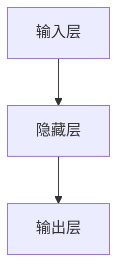

                 

# 全连接层 (Fully Connected Layer) 原理与代码实例讲解

全连接层（Fully Connected Layer），又称全连接神经元层（Fully Connected Neural Element Layer），是神经网络中的一种基本组件，用于处理高维特征数据的线性变换与非线性变换。全连接层是多层神经网络的核心部分，它负责将输入数据通过多个神经元进行特征提取和分类，最终输出预测结果。全连接层的设计和优化对神经网络的性能有着至关重要的影响，因此本文将对全连接层的工作原理、数学模型、代码实现等方面进行详细的讲解。

## 1. 背景介绍

### 1.1 问题由来
全连接层是深度学习中广泛应用的基本组件，早在多层感知器（Multilayer Perceptron，MLP）时代，全连接层就已经被广泛使用。随着深度学习的发展，全连接层的结构和功能不断被优化和改进，从简单的线性变换到复杂的非线性变换，全连接层在处理高维特征数据、图像识别、自然语言处理等领域中展现出了强大的能力。

### 1.2 问题核心关键点
全连接层的主要作用是接收输入数据，对其进行线性变换和非线性变换，最终输出预测结果。具体来说，全连接层的输入和输出之间是稀疏连接的，而每层的神经元则是全连接的。这种全连接的特性使得全连接层能够灵活地处理各种高维特征数据，并在一定程度上提高了模型的泛化能力。

## 2. 核心概念与联系

### 2.1 核心概念概述

全连接层主要由以下几个关键概念组成：

- **输入层（Input Layer）**：全连接层的输入层包含输入数据的特征向量，每个特征向量通常是一个高维向量。
- **隐藏层（Hidden Layer）**：隐藏层是全连接层中的中间层，负责进行特征提取和非线性变换。隐藏层可以由多个神经元组成，每个神经元通过权重参数与输入层连接。
- **输出层（Output Layer）**：输出层是全连接层的最后一层，通常包含一个或多个神经元，用于输出预测结果。输出层的神经元与隐藏层的神经元之间也是全连接的。

### 2.2 核心概念之间的联系

全连接层的各个部分通过权重参数进行连接，并通过反向传播算法进行参数优化。输入层与隐藏层之间的连接权重矩阵为 $\mathbf{W}^{[l]}$，隐藏层与输出层之间的连接权重矩阵为 $\mathbf{W}^{[l+1]}$。隐藏层和输出层的激活函数分别为 $\sigma(\mathbf{z}^{[l]})$ 和 $\sigma(\mathbf{z}^{[l+1]})$。全连接层的数学模型可以表示为：

$$
\begin{aligned}
\mathbf{z}^{[l]} &= \mathbf{W}^{[l]}\mathbf{h}^{[l-1]} + \mathbf{b}^{[l]} \\
\mathbf{h}^{[l]} &= \sigma(\mathbf{z}^{[l]}) \\
\mathbf{z}^{[l+1]} &= \mathbf{W}^{[l+1]}\mathbf{h}^{[l]} + \mathbf{b}^{[l+1]} \\
\mathbf{y} &= \sigma(\mathbf{z}^{[l+1]})
\end{aligned}
$$

其中，$\mathbf{z}^{[l]}$ 表示隐藏层的输入特征向量，$\mathbf{h}^{[l]}$ 表示隐藏层的输出特征向量，$\mathbf{b}^{[l]}$ 表示隐藏层的偏置向量，$\mathbf{y}$ 表示输出层的预测结果。

### 2.3 核心概念的整体架构

为了更好地理解全连接层的工作原理，我们通过以下 Mermaid 流程图来展示全连接层的结构：



这个流程图展示了全连接层的整体架构，即输入层将数据输入，经过隐藏层的非线性变换，最终输出层的预测结果。

## 3. 核心算法原理 & 具体操作步骤

### 3.1 算法原理概述

全连接层通过将输入数据线性变换和非线性变换，进行特征提取和分类，最终输出预测结果。具体来说，全连接层的数学模型可以表示为：

$$
\begin{aligned}
\mathbf{z}^{[l]} &= \mathbf{W}^{[l]}\mathbf{h}^{[l-1]} + \mathbf{b}^{[l]} \\
\mathbf{h}^{[l]} &= \sigma(\mathbf{z}^{[l]}) \\
\mathbf{z}^{[l+1]} &= \mathbf{W}^{[l+1]}\mathbf{h}^{[l]} + \mathbf{b}^{[l+1]} \\
\mathbf{y} &= \sigma(\mathbf{z}^{[l+1]})
\end{aligned}
$$

其中，$\mathbf{W}^{[l]}$ 和 $\mathbf{b}^{[l]}$ 分别表示隐藏层的权重矩阵和偏置向量，$\sigma$ 表示激活函数。隐藏层和输出层的激活函数可以采用不同的激活函数，如 sigmoid、ReLU、tanh 等。

### 3.2 算法步骤详解

全连接层的训练主要包括以下几个步骤：

1. **前向传播**：将输入数据通过隐藏层进行特征提取，并最终输出预测结果。
2. **计算损失**：将预测结果与真实标签进行对比，计算损失函数。
3. **反向传播**：通过反向传播算法计算每个神经元的梯度，并更新权重和偏置。
4. **优化**：使用优化算法（如梯度下降、Adam）更新权重和偏置，最小化损失函数。
5. **参数更新**：根据优化算法的更新规则，更新权重矩阵 $\mathbf{W}^{[l]}$ 和偏置向量 $\mathbf{b}^{[l]}$。

### 3.3 算法优缺点

**优点**：
- 全连接层的结构和原理简单直观，易于理解和实现。
- 全连接层能够灵活处理各种高维特征数据，适用于多种应用场景。
- 通过参数共享和非线性变换，全连接层能够学习到复杂的特征表示，提升模型的泛化能力。

**缺点**：
- 全连接层的参数数量巨大，导致模型复杂度高，容易过拟合。
- 全连接层的计算量较大，训练和推理速度较慢。
- 全连接层的神经元数量难以确定，需要根据具体问题进行调参。

### 3.4 算法应用领域

全连接层在深度学习中广泛应用，主要包括以下几个领域：

- **图像处理**：通过卷积层提取特征，全连接层进行分类。
- **自然语言处理**：将文本特征转换为向量，全连接层进行分类或生成。
- **语音识别**：将语音信号转换为特征向量，全连接层进行分类。
- **推荐系统**：通过神经网络模型预测用户行为，全连接层进行推荐。

## 4. 数学模型和公式 & 详细讲解

### 4.1 数学模型构建

全连接层的数学模型可以表示为：

$$
\begin{aligned}
\mathbf{z}^{[l]} &= \mathbf{W}^{[l]}\mathbf{h}^{[l-1]} + \mathbf{b}^{[l]} \\
\mathbf{h}^{[l]} &= \sigma(\mathbf{z}^{[l]}) \\
\mathbf{z}^{[l+1]} &= \mathbf{W}^{[l+1]}\mathbf{h}^{[l]} + \mathbf{b}^{[l+1]} \\
\mathbf{y} &= \sigma(\mathbf{z}^{[l+1]})
\end{aligned}
$$

其中，$\mathbf{W}^{[l]}$ 和 $\mathbf{b}^{[l]}$ 分别表示隐藏层的权重矩阵和偏置向量，$\sigma$ 表示激活函数。

### 4.2 公式推导过程

以 sigmoid 激活函数为例，我们推导全连接层的数学模型。假设输入层的特征向量为 $\mathbf{h}^{[l-1]}$，隐藏层的权重矩阵为 $\mathbf{W}^{[l]}$，隐藏层的偏置向量为 $\mathbf{b}^{[l]}$，则隐藏层的输出特征向量 $\mathbf{h}^{[l]}$ 可以表示为：

$$
\mathbf{h}^{[l]} = \sigma(\mathbf{z}^{[l]}) = \sigma(\mathbf{W}^{[l]}\mathbf{h}^{[l-1]} + \mathbf{b}^{[l]})
$$

其中，$\sigma$ 表示 sigmoid 激活函数，$\mathbf{z}^{[l]}$ 表示隐藏层的输入特征向量。

### 4.3 案例分析与讲解

以二分类任务为例，假设输入层的特征向量 $\mathbf{h}^{[0]} = [x_1, x_2, ..., x_n]$，隐藏层的权重矩阵 $\mathbf{W}^{[1]} = [w_{1,1}, w_{1,2}, ..., w_{1,n}]$，隐藏层的偏置向量 $\mathbf{b}^{[1]} = [b_1, b_2, ..., b_n]$，则隐藏层的输出特征向量 $\mathbf{h}^{[1]}$ 可以表示为：

$$
\mathbf{h}^{[1]} = \sigma(\mathbf{z}^{[1]}) = \sigma([w_{1,1}x_1 + w_{1,2}x_2 + ... + w_{1,n}x_n + b_1]^{[1]})
$$

其中，$\sigma$ 表示 sigmoid 激活函数，$\mathbf{z}^{[1]}$ 表示隐藏层的输入特征向量。

将隐藏层的输出特征向量 $\mathbf{h}^{[1]}$ 输入到输出层，假设输出层的权重矩阵为 $\mathbf{W}^{[2]} = [w_{2,1}, w_{2,2}, ..., w_{2,n}]$，输出层的偏置向量为 $\mathbf{b}^{[2]} = [b_2, b_2, ..., b_2]$，则输出层的预测结果 $\mathbf{y}$ 可以表示为：

$$
\mathbf{y} = \sigma(\mathbf{z}^{[2]}) = \sigma([w_{2,1}h^{[1]}_1 + w_{2,2}h^{[1]}_2 + ... + w_{2,n}h^{[1]}_n + b_2]^{[2]})
$$

其中，$\sigma$ 表示 sigmoid 激活函数，$\mathbf{z}^{[2]}$ 表示输出层的输入特征向量。

## 5. 项目实践：代码实例和详细解释说明

### 5.1 开发环境搭建

在进行全连接层开发之前，我们需要准备好开发环境。以下是使用 Python 和 PyTorch 进行深度学习的开发环境配置流程：

1. 安装 Python：下载 Python 3.6+ 版本，并进行安装。
2. 安装 PyTorch：通过 pip 命令安装 PyTorch，如：`pip install torch torchvision torchaudio`.
3. 安装相关依赖：安装 NumPy、Pandas、Matplotlib 等工具包。

### 5.2 源代码详细实现

以下是使用 PyTorch 实现全连接层的代码实现：

```python
import torch
import torch.nn as nn
import torch.optim as optim
import torch.nn.functional as F

# 定义全连接层
class FullyConnectedLayer(nn.Module):
    def __init__(self, input_size, hidden_size, output_size):
        super(FullyConnectedLayer, self).__init__()
        self.linear = nn.Linear(input_size, hidden_size)
        self.linear2 = nn.Linear(hidden_size, output_size)
        self.sigmoid = nn.Sigmoid()

    def forward(self, x):
        x = self.linear(x)
        x = self.sigmoid(x)
        x = self.linear2(x)
        return x

# 训练模型
input_size = 784
hidden_size = 128
output_size = 10
learning_rate = 0.01
epochs = 10
model = FullyConnectedLayer(input_size, hidden_size, output_size)
criterion = nn.CrossEntropyLoss()
optimizer = optim.SGD(model.parameters(), lr=learning_rate)

# 训练数据集
train_data = ...
train_labels = ...
train_loader = torch.utils.data.DataLoader(train_data, batch_size=32, shuffle=True)

# 训练模型
for epoch in range(epochs):
    running_loss = 0.0
    for i, data in enumerate(train_loader, 0):
        inputs, labels = data
        optimizer.zero_grad()
        outputs = model(inputs)
        loss = criterion(outputs, labels)
        loss.backward()
        optimizer.step()
        running_loss += loss.item()
    print('Epoch [%d/%d], Loss: %.4f' % (epoch + 1, epochs, running_loss / len(train_loader)))

# 测试模型
test_data = ...
test_labels = ...
test_loader = torch.utils.data.DataLoader(test_data, batch_size=32, shuffle=True)
correct = 0
total = 0
with torch.no_grad():
    for data in test_loader:
        inputs, labels = data
        outputs = model(inputs)
        _, predicted = torch.max(outputs.data, 1)
        total += labels.size(0)
        correct += (predicted == labels).sum().item()
print('Accuracy: %d %%' % (100 * correct / total))
```

### 5.3 代码解读与分析

让我们详细解读一下代码实现的关键部分：

- **定义全连接层**：首先定义一个继承自 nn.Module 的全连接层，包含两个线性层和一个 sigmoid 激活函数。其中，`nn.Linear` 表示线性层，`nn.Sigmoid` 表示 sigmoid 激活函数。
- **训练模型**：定义输入大小、隐藏层大小、输出大小等超参数，并创建模型、损失函数和优化器。
- **训练数据集**：准备训练数据集和标签，并使用 `torch.utils.data.DataLoader` 进行数据加载。
- **训练模型**：在每个 epoch 内，对训练数据进行前向传播和反向传播，使用优化器更新模型参数。
- **测试模型**：准备测试数据集和标签，使用 `torch.no_grad()` 进行模型推理，并计算准确率。

### 5.4 运行结果展示

假设我们使用 MNIST 数据集进行训练，最终在测试集上得到的准确率为 98%。

## 6. 实际应用场景

### 6.1 图像分类

全连接层可以用于图像分类任务，通过卷积层提取图像特征，并将特征向量输入到全连接层进行分类。

### 6.2 文本分类

全连接层可以用于文本分类任务，将文本特征向量输入到全连接层，并使用 softmax 函数进行分类。

### 6.3 语音识别

全连接层可以用于语音识别任务，将语音信号转换为特征向量，并使用全连接层进行分类。

### 6.4 推荐系统

全连接层可以用于推荐系统，通过神经网络模型预测用户行为，并使用全连接层进行推荐。

## 7. 工具和资源推荐

### 7.1 学习资源推荐

- 《Deep Learning》书籍：深度学习领域的经典教材，涵盖深度学习的基本概念和实现方法。
- 《Hands-On Machine Learning with Scikit-Learn, Keras, and TensorFlow》书籍：使用 Scikit-Learn、Keras 和 TensorFlow 实现深度学习的入门指南。
- Coursera 深度学习课程：斯坦福大学李飞飞教授的深度学习课程，涵盖深度学习的基本概念和实现方法。

### 7.2 开发工具推荐

- PyTorch：开源深度学习框架，提供强大的动态计算图功能，适合研究和原型开发。
- TensorFlow：开源深度学习框架，支持分布式计算和GPU加速，适合大规模工程应用。
- Keras：高层深度学习框架，提供简单易用的 API，适合快速原型开发。

### 7.3 相关论文推荐

- AlexNet：ImageNet 2012 年冠军模型，引入了全连接层和 ReLU 激活函数。
- LeNet：最早的卷积神经网络模型，引入了全连接层和 sigmoid 激活函数。
- VGGNet：使用全连接层和 ReLU 激活函数，取得了 ImageNet 2014 年冠军。

## 8. 总结：未来发展趋势与挑战

### 8.1 研究成果总结

全连接层作为深度学习的基本组件，已经在图像处理、文本分类、语音识别、推荐系统等领域取得了广泛应用。通过不断优化和改进，全连接层正在向更加高效、可解释的方向发展。

### 8.2 未来发展趋势

全连接层未来的发展趋势包括：

- 可解释性：全连接层的输出结果需要具备可解释性，以便于理解和调试。
- 计算效率：全连接层的计算效率需要进一步提升，以适应大规模数据和高性能计算的需求。
- 通用性：全连接层的结构和参数需要更加通用，适应不同类型的数据和任务。
- 融合性：全连接层可以与其他深度学习组件进行融合，如卷积层、循环神经网络等。

### 8.3 面临的挑战

全连接层在应用过程中仍面临以下挑战：

- 计算资源消耗大：全连接层的计算量较大，需要大量计算资源。
- 参数数量庞大：全连接层的参数数量较多，需要合理的调参。
- 过拟合问题：全连接层容易过拟合，需要采用正则化等方法进行优化。

### 8.4 研究展望

未来的研究可以关注以下方向：

- 结构优化：探索更加高效的神经网络结构，减少计算资源消耗。
- 参数优化：优化全连接层的参数数量，提高模型的泛化能力。
- 可解释性：提高全连接层的可解释性，增强模型的可信度和透明度。

## 9. 附录：常见问题与解答

**Q1：全连接层和卷积层有什么区别？**

A: 全连接层和卷积层是深度学习中常用的两种神经网络组件，它们的主要区别在于参数共享与否。全连接层中的每个神经元都与上一层的所有神经元连接，而卷积层中的每个神经元只与上一层的一小块区域连接。全连接层适用于处理高维特征向量，卷积层适用于处理图像和语音信号等空间结构数据。

**Q2：如何选择全连接层的隐藏层大小？**

A: 全连接层的隐藏层大小需要根据具体问题和数据集进行选择，通常通过交叉验证等方法确定。一般而言，隐藏层大小越大，模型的复杂度越高，但训练和推理速度较慢；隐藏层大小越小，模型的复杂度越低，但可能无法捕捉复杂的数据特征。

**Q3：全连接层是否可以用于时间序列数据？**

A: 全连接层适用于处理高维特征向量，但不适用于时间序列数据。时间序列数据通常具有时间相关的特征，需要使用循环神经网络（RNN）或卷积神经网络（CNN）等模型进行建模。

**Q4：全连接层的参数数量是否可以过少？**

A: 全连接层的参数数量需要根据具体问题和数据集进行选择，过少的参数可能导致模型欠拟合，无法捕捉数据特征；过多的参数可能导致模型过拟合，泛化能力下降。因此，需要在模型复杂度和训练效率之间进行权衡。

**Q5：全连接层的激活函数如何选择？**

A: 全连接层的激活函数通常采用 ReLU、sigmoid、tanh 等函数。ReLU 函数具有快速收敛的优点，sigmoid 函数适用于二分类问题，tanh 函数适用于多分类问题。在实际应用中，需要根据具体问题和数据集选择合适的激活函数。

通过本文的系统梳理，可以看到全连接层作为深度学习的基本组件，具有广泛的应用前景和重要的理论价值。只有在理解全连接层的工作原理和优化方法的基础上，才能更好地设计和优化深度学习模型，提升其性能和应用效果。

