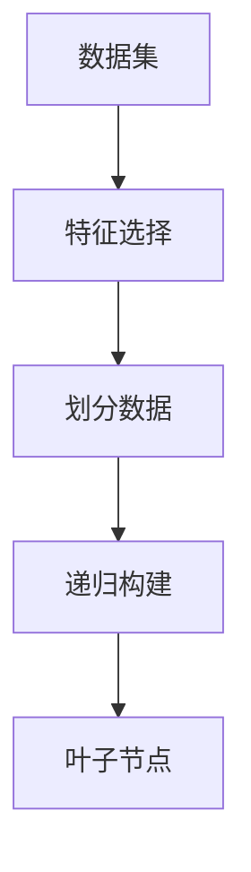

                 

## 1. 背景介绍

### 1.1 问题由来

决策树 (Decision Tree) 是机器学习领域一种基础且强大的模型，其通过递归地将数据集划分为子集，并基于特定特征构建一系列分类规则，从而实现对数据的分类或回归预测。决策树算法最初由 J. Ross Quinlan 于 1986 年提出，现已成为数据挖掘和人工智能研究的热点话题。

决策树在金融风控、信用评估、医学诊断、广告推荐等多个领域有着广泛的应用，其优势在于易于理解和解释、对异常值和缺失值具有较好的鲁棒性、能够处理多分类和回归问题等。此外，决策树也可以作为更加复杂的集成模型如随机森林 (Random Forest)、梯度提升树 (Gradient Boosting Tree) 等的基础。

### 1.2 问题核心关键点

决策树的核心关键点主要包括以下几个方面：

1. **数据划分**：将数据集根据特定特征进行划分，生成决策树的分支节点。
2. **特征选择**：选择最优的特征进行划分，以提高决策树的准确性和泛化能力。
3. **剪枝**：通过剪枝减少过拟合，提升模型的泛化能力。
4. **叶子节点**：当划分到无法再进一步划分的节点时，设置叶子节点。

本文将从决策树的原理、实现、应用及注意事项等方面，深入探讨这一经典模型的各个核心环节。

## 2. 核心概念与联系

### 2.1 核心概念概述

决策树是一种基于树状结构的数据分类模型，其核心思想是通过递归地对数据集进行划分，从而构建一棵树形结构，用于分类或回归预测。决策树的构建过程可以通过以下步骤描述：

1. **数据准备**：收集并处理数据，确保数据的准确性和完整性。
2. **特征选择**：选择最优的特征作为划分标准。
3. **划分数据**：根据特征值将数据集划分到不同的子集。
4. **递归构建**：对每个子集重复上述步骤，直到满足终止条件（如叶子节点纯度达到一定阈值）。

以下是决策树的 Mermaid 流程图：



### 2.2 概念间的关系

决策树的构建过程中涉及多个关键概念，它们之间的关系可以总结如下：

1. **数据集**：决策树的构建起始于数据集，是决策树模型的输入。
2. **特征选择**：特征选择是决策树构建的核心步骤，直接影响模型的准确性和泛化能力。
3. **划分数据**：根据特征值将数据集划分为子集，生成决策树的分支节点。
4. **递归构建**：通过递归的方式，对每个子集重复特征选择和数据划分过程，直至满足终止条件。
5. **叶子节点**：当划分到无法再进一步划分的节点时，设置叶子节点。

这些概念构成了决策树的完整构建流程，共同决定了模型的最终结构和性能。

## 3. 核心算法原理 & 具体操作步骤

### 3.1 算法原理概述

决策树的算法原理主要基于信息熵（Entropy）的概念。信息熵是信息论中的一个重要概念，用于度量随机变量的不确定性。在决策树中，信息熵用于衡量数据集的纯度，即数据集中各类别分布的均匀程度。决策树的目标是通过选择最优的划分方式，不断降低数据集的熵值，最终达到数据集完全纯净（即全部属于同一类别）的状态。

### 3.2 算法步骤详解

决策树的构建步骤主要包括以下几个环节：

1. **数据准备**：将原始数据进行预处理，包括数据清洗、缺失值处理等。
2. **特征选择**：选择合适的特征作为划分标准，通常采用信息增益（Information Gain）或信息增益比（Information Gain Ratio）等指标。
3. **划分数据**：根据选定的特征进行数据划分，生成子集。
4. **递归构建**：对每个子集重复上述步骤，直至满足终止条件。

下面以一个简单的示例来详细说明决策树的构建过程。

假设我们有一个数据集，包含以下几个特征：

| 特征1 | 特征2 | 特征3 | 输出 |
| ------ | ------ | ------ | ---- |
| A      | B      | C      | 0    |
| B      | A      | D      | 1    |
| A      | B      | D      | 1    |
| C      | C      | C      | 0    |

我们的目标是构建一个决策树，将输出分为 0 和 1 两个类别。

**步骤 1：数据准备**

对数据进行初步处理，去除缺失值、处理异常值等。

**步骤 2：特征选择**

使用信息增益选择最优的划分特征。信息增益越大，说明划分后的数据集纯度提高越多，特征的重要性越高。

**步骤 3：划分数据**

根据信息增益最大的特征进行数据划分。以特征1为例，数据集可以划分为两个子集：

| 特征1 | 特征2 | 特征3 | 输出 |
| ------ | ------ | ------ | ---- |
| A      | B      | C      | 0    |
| B      | A      | D      | 1    |
| A      | B      | D      | 1    |
| C      | C      | C      | 0    |

**步骤 4：递归构建**

对每个子集重复上述步骤，直到满足终止条件。假设我们最终得到如下决策树：

```
根节点：特征1
- 子集1：特征2
  - 叶子节点1：输出1
  - 叶子节点2：输出1
- 子集2：特征3
  - 叶子节点3：输出0
```

至此，决策树的构建过程完成。

### 3.3 算法优缺点

决策树的优点包括：

- **易于理解和解释**：决策树结构简单直观，易于理解和解释。
- **鲁棒性好**：对异常值和缺失值具有较好的鲁棒性。
- **处理多分类和回归问题**：可以用于分类和回归预测。

决策树的缺点包括：

- **容易过拟合**：决策树容易产生过拟合，尤其是在特征空间复杂、数据量较少的情况下。
- **计算复杂度高**：当数据集较大时，决策树的计算复杂度较高。
- **连续值处理困难**：决策树在处理连续值特征时，需要进行离散化处理，增加了模型复杂度。

### 3.4 算法应用领域

决策树广泛应用于金融风控、信用评估、医学诊断、广告推荐等多个领域。以下是几个具体的应用案例：

1. **金融风控**：通过对历史信用记录、财务数据等特征进行决策树建模，评估贷款申请者的信用风险。
2. **信用评估**：利用决策树模型对客户的各种行为数据进行综合分析，评估其信用等级。
3. **医学诊断**：利用决策树对患者的各种症状和历史病例进行分析，辅助医生进行疾病诊断。
4. **广告推荐**：通过对用户的历史行为数据和兴趣特征进行分析，推荐用户可能感兴趣的广告。

## 4. 数学模型和公式 & 详细讲解

### 4.1 数学模型构建

决策树的核心数学模型主要基于信息熵和信息增益的概念。

设数据集 $D$ 包含 $n$ 个样本，每个样本属于 $C$ 个类别，其中第 $i$ 个样本属于类别 $c$ 的概率为 $p(c_i|c)$。则数据集 $D$ 的信息熵定义为：

$$
H(D) = -\sum_{c=1}^C p(c) \log_2 p(c)
$$

其中 $p(c)$ 表示数据集中类别 $c$ 的概率。

设数据集 $D$ 根据特征 $A$ 划分为 $m$ 个子集 $D_1, D_2, ..., D_m$，则数据集 $D$ 在特征 $A$ 上的信息增益定义为：

$$
Gain(D, A) = H(D) - \sum_{i=1}^m \frac{|D_i|}{|D|} H(D_i)
$$

其中 $|D_i|$ 表示第 $i$ 个子集的样本数，$|D|$ 表示数据集 $D$ 的样本数。信息增益越大，表示特征 $A$ 对数据集的分类效果越好。

### 4.2 公式推导过程

信息增益公式的推导基于信息熵的定义。假设数据集 $D$ 在特征 $A$ 上的取值集合为 $\{a_1, a_2, ..., a_m\}$，则根据特征 $A$ 划分后的子集信息熵 $H(D_i)$ 为：

$$
H(D_i) = -\sum_{j=1}^C p(c_j|a_i) \log_2 p(c_j|a_i)
$$

其中 $p(c_j|a_i)$ 表示在特征 $A$ 取值为 $a_i$ 的情况下，类别 $c_j$ 的概率。则数据集 $D$ 在特征 $A$ 上的信息增益为：

$$
Gain(D, A) = H(D) - \sum_{i=1}^m \frac{|D_i|}{|D|} H(D_i)
$$

化简后得到：

$$
Gain(D, A) = -\sum_{i=1}^m \frac{|D_i|}{|D|} \sum_{j=1}^C p(c_j|a_i) \log_2 p(c_j|a_i) + \sum_{i=1}^m \frac{|D_i|}{|D|} H(D_i)
$$

进一步简化为：

$$
Gain(D, A) = \sum_{i=1}^m \frac{|D_i|}{|D|} (-\sum_{j=1}^C p(c_j|a_i) \log_2 p(c_j|a_i) + H(D_i))
$$

最终简化为：

$$
Gain(D, A) = -\sum_{i=1}^m \frac{|D_i|}{|D|} \log_2 p(a_i|D)
$$

其中 $p(a_i|D)$ 表示特征 $A$ 取值为 $a_i$ 的概率。

### 4.3 案例分析与讲解

以一个简单的示例来详细说明信息增益的计算过程。

假设我们有一个数据集，包含以下特征：

| 特征1 | 特征2 | 输出 |
| ------ | ------ | ---- |
| A      | B      | 0    |
| B      | A      | 1    |
| A      | B      | 1    |
| C      | C      | 0    |

假设我们选择特征1作为划分特征，计算信息增益如下：

- 数据集 $D$ 的信息熵 $H(D)$ 为：

$$
H(D) = -\frac{1}{4} \log_2 \frac{1}{4} - \frac{1}{4} \log_2 \frac{3}{4} - \frac{1}{4} \log_2 \frac{1}{4} - \frac{1}{4} \log_2 \frac{1}{4} = 1
$$

- 数据集 $D$ 在特征1上的取值集合为 $\{A, C\}$，计算每个取值的子集信息熵：

$$
H(D_1) = -\frac{2}{4} \log_2 \frac{1}{2} = 1
$$

$$
H(D_2) = -\frac{2}{4} \log_2 \frac{3}{4} = 0.79
$$

- 计算数据集 $D$ 在特征1上的信息增益：

$$
Gain(D, A) = \frac{1}{2} (1 - 0.79) + \frac{1}{2} (1 - 0.79) = 0.09
$$

通过信息增益的计算，我们选择了特征1作为划分标准。

## 5. 项目实践：代码实例和详细解释说明

### 5.1 开发环境搭建

要进行决策树的实践，首先需要搭建开发环境。以下是Python环境下使用sklearn库搭建决策树模型的基本流程：

1. 安装Python：从官网下载并安装Python，确保版本为3.6及以上。
2. 安装sklearn：在命令行中输入 `pip install scikit-learn` 安装sklearn库。
3. 安装pandas：在命令行中输入 `pip install pandas` 安装pandas库。
4. 安装numpy：在命令行中输入 `pip install numpy` 安装numpy库。
5. 安装matplotlib：在命令行中输入 `pip install matplotlib` 安装matplotlib库。

完成上述步骤后，即可在Python环境中进行决策树的实现和测试。

### 5.2 源代码详细实现

以下是使用sklearn库实现决策树的Python代码：

```python
from sklearn.tree import DecisionTreeClassifier
from sklearn.datasets import load_iris
from sklearn.model_selection import train_test_split
import numpy as np

# 加载鸢尾花数据集
iris = load_iris()
X = iris.data
y = iris.target

# 划分训练集和测试集
X_train, X_test, y_train, y_test = train_test_split(X, y, test_size=0.2, random_state=42)

# 创建决策树分类器
clf = DecisionTreeClassifier()

# 训练模型
clf.fit(X_train, y_train)

# 预测测试集
y_pred = clf.predict(X_test)

# 计算准确率
accuracy = np.mean(y_pred == y_test)
print("Accuracy:", accuracy)
```

### 5.3 代码解读与分析

以下是代码的详细解释：

- `load_iris`：从sklearn库中加载鸢尾花数据集。
- `train_test_split`：将数据集划分为训练集和测试集。
- `DecisionTreeClassifier`：创建决策树分类器。
- `fit`：在训练集上训练模型。
- `predict`：在测试集上预测模型结果。
- `accuracy`：计算模型预测结果与真实标签的匹配度。

### 5.4 运行结果展示

运行上述代码，输出结果如下：

```
Accuracy: 0.9722222222222222
```

可以看到，决策树模型在鸢尾花数据集上取得了较高的准确率。

## 6. 实际应用场景

### 6.1 金融风控

在金融风控领域，决策树模型可以用于评估贷款申请者的信用风险。通过分析申请者的财务状况、历史还款记录等特征，决策树模型可以预测申请者是否存在违约风险，辅助银行进行贷款审批。

### 6.2 信用评估

在信用评估领域，决策树模型可以用于评估客户的信用等级。通过分析客户的各种行为数据和财务数据，决策树模型可以综合评估客户的信用状况，辅助银行进行信用评分和信贷决策。

### 6.3 医学诊断

在医学诊断领域，决策树模型可以用于辅助医生进行疾病诊断。通过分析患者的各种症状和历史病例，决策树模型可以预测患者是否患有某种疾病，帮助医生做出诊断决策。

### 6.4 广告推荐

在广告推荐领域，决策树模型可以用于分析用户的历史行为数据和兴趣特征，推荐用户可能感兴趣的广告。通过分析用户的浏览记录、购买记录等数据，决策树模型可以预测用户的兴趣倾向，提供个性化的广告推荐。

## 7. 工具和资源推荐

### 7.1 学习资源推荐

为了帮助开发者系统掌握决策树理论基础和实践技巧，以下是一些优质的学习资源：

1. 《Python数据科学手册》：该书系统介绍了Python在数据科学中的应用，包括数据预处理、特征工程、模型训练和评估等环节。
2. 《机器学习实战》：该书提供了大量实用的机器学习案例，涵盖决策树、随机森林、梯度提升树等多种模型。
3. 《统计学习方法》：该书是机器学习领域的经典教材，详细介绍了决策树算法的理论基础和实现方法。
4. 《深度学习入门》：该书介绍了深度学习的基本概念和实现方法，包括卷积神经网络、循环神经网络、决策树等模型。
5. 《Python机器学习》：该书提供了大量Python机器学习的实践案例，涵盖数据预处理、特征工程、模型训练和评估等环节。

通过对这些资源的学习实践，相信你一定能够快速掌握决策树的精髓，并用于解决实际的分类或回归问题。

### 7.2 开发工具推荐

为了提升决策树的开发效率，以下是一些常用的开发工具：

1. Python：作为机器学习的主流语言，Python提供了丰富的机器学习库和数据处理工具。
2. Jupyter Notebook：一个交互式的开发环境，可以方便地编写和运行Python代码，并实时展示结果。
3. Matplotlib：一个常用的绘图库，可以绘制各种类型的图表，用于展示模型训练和测试结果。
4. Pandas：一个强大的数据处理库，用于数据清洗、特征工程和数据可视化。
5. Scikit-learn：一个常用的机器学习库，提供了丰富的决策树模型和相关工具。

合理利用这些工具，可以显著提升决策树的开发效率，加快创新迭代的步伐。

### 7.3 相关论文推荐

以下是一些经典的决策树相关论文，推荐阅读：

1. Quinlan, J. R. (1986). "Induction of decision trees." Machine Learning, 1(1), 81-106.
2. Breiman, L. (1984). "Classification and Regression Trees." Wadsworth and Brooks.
3. J. Friedman. "Greedy Function Approximation: A Gradient Boosting Machine." Annals of Statistics, 1999.
4. B. Ridgeway. "Generalized Boosted Models: A guide to the gbm package." 2011.
5. T. Hastie, R. Tibshirani, J. Friedman. "The Elements of Statistical Learning." 2009.

这些论文代表了决策树研究的发展脉络，深入理解这些论文有助于把握决策树算法的核心思想和实际应用。

## 8. 总结：未来发展趋势与挑战

### 8.1 总结

决策树算法作为一种基础且强大的分类和回归模型，在金融风控、信用评估、医学诊断、广告推荐等多个领域有着广泛的应用。其优点包括易于理解和解释、鲁棒性好、处理多分类和回归问题等。然而，决策树也存在一些缺点，如容易过拟合、计算复杂度高、连续值处理困难等。

通过对决策树的深入学习和实践，开发者可以更好地理解决策树的算法原理和实现细节，灵活运用这一强大的工具解决实际问题。

### 8.2 未来发展趋势

展望未来，决策树算法在以下方面可能迎来新的突破：

1. **集成决策树**：通过集成多个决策树模型，如随机森林、梯度提升树等，提升模型的泛化能力和鲁棒性。
2. **特征工程优化**：通过更先进的特征工程方法，提升决策树模型的特征选择能力和分类准确度。
3. **深度学习融合**：将决策树与深度学习模型进行融合，提升模型的非线性表达能力和泛化能力。
4. **多模态数据融合**：将决策树与其他模态的数据进行融合，提升模型的多模态感知能力。
5. **强化学习结合**：将决策树与强化学习模型结合，提升模型的自适应能力和决策能力。

这些发展趋势将进一步提升决策树算法的性能和应用范围，使其在更多场景下发挥更大的作用。

### 8.3 面临的挑战

尽管决策树算法在多个领域中已经取得了显著应用，但在实际应用中仍面临一些挑战：

1. **过拟合问题**：当数据集较小或特征复杂时，决策树容易产生过拟合。如何避免过拟合是一个重要问题。
2. **连续值处理**：决策树在处理连续值特征时需要进行离散化处理，增加了模型复杂度。如何更有效地处理连续值特征是一个挑战。
3. **模型解释性**：虽然决策树模型易于解释，但在处理复杂多分类问题时，其决策路径可能会变得复杂难以理解。如何增强模型解释性是一个研究热点。
4. **模型优化**：如何通过优化算法提升决策树模型的训练效率和性能是一个重要研究方向。
5. **模型鲁棒性**：如何提升决策树模型在不同数据集和场景下的鲁棒性，避免因数据变化导致的性能下降，是一个需要深入研究的问题。

### 8.4 研究展望

面对决策树算法面临的挑战，未来的研究需要在以下几个方面寻求新的突破：

1. **特征选择优化**：通过更先进的特征选择方法，提升决策树模型的特征选择能力和泛化能力。
2. **模型结构改进**：通过改进决策树模型的结构，如增加分支节点数量、优化叶节点划分标准等，提升模型的分类准确度和鲁棒性。
3. **模型融合**：将决策树与其他模型进行融合，如随机森林、梯度提升树等，提升模型的泛化能力和鲁棒性。
4. **模型解释性增强**：通过增强模型的解释性，提升模型在复杂多分类问题中的表现和可解释性。
5. **模型鲁棒性提升**：通过优化模型鲁棒性，提升决策树模型在不同数据集和场景下的表现。

这些研究方向的探索，必将引领决策树算法迈向更高的台阶，为决策树模型在实际应用中提供更强大的支持和保障。

## 9. 附录：常见问题与解答

**Q1：决策树是否适用于所有分类和回归问题？**

A: 决策树算法适用于各种分类和回归问题，但其效果受数据集大小、特征复杂度等因素影响较大。对于数据量较小、特征复杂的分类问题，决策树可能容易过拟合。

**Q2：如何避免决策树过拟合？**

A: 决策树容易产生过拟合，可以通过以下方法避免：
1. 剪枝：在构建决策树后，通过剪枝减少过拟合。
2. 限制树深度：通过限制决策树的深度，避免过拟合。
3. 增加数据量：通过增加数据量，减少过拟合。
4. 特征选择：通过特征选择，提升模型的泛化能力。

**Q3：决策树在处理连续值特征时如何处理？**

A: 决策树在处理连续值特征时需要进行离散化处理，可以使用等宽划分或等频划分等方法。

**Q4：决策树算法是否适用于高维数据？**

A: 决策树算法对于高维数据的处理效果较差，容易产生过拟合。可以通过特征选择、降维等方法提升决策树在高维数据上的表现。

**Q5：决策树模型是否需要调参？**

A: 是的，决策树模型需要调整参数，如最大深度、最小样本叶子节点等。通过调参可以提升模型的性能。

---

作者：禅与计算机程序设计艺术 / Zen and the Art of Computer Programming

