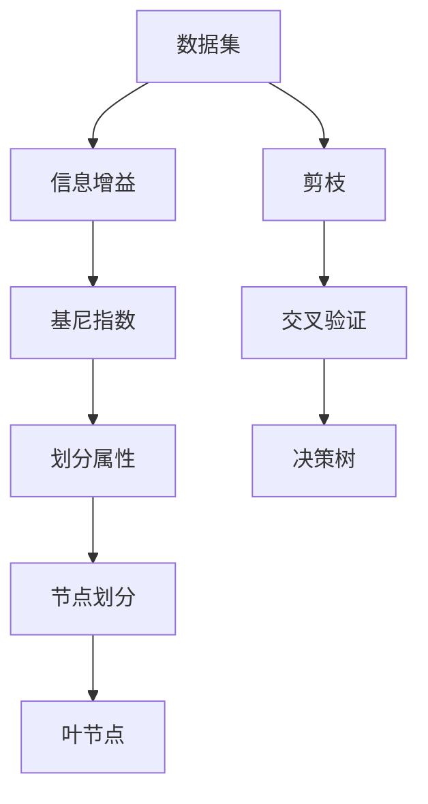

                 

## 1. 背景介绍

### 1.1 问题由来
决策树（Decision Trees）是一种常用的机器学习算法，广泛应用于分类和回归问题中。其通过构建树形结构，将数据集划分成多个子集，每个子集对应树中的一个节点，从而实现对数据的分类或回归预测。决策树易于理解和解释，且适用于大规模数据集和高维特征空间的处理，因此在实际应用中得到了广泛的应用。

### 1.2 问题核心关键点
决策树算法的核心在于构建一颗能够最大程度地分类或回归的树，其中最关键的问题包括：
- 如何选择一个最优的划分属性（特征）？
- 如何确定划分属性的阈值？
- 如何处理缺失值和异常值？
- 如何剪枝以防止过拟合？
- 决策树的剪枝策略有哪些？

### 1.3 问题研究意义
决策树算法的研究意义在于其简单易懂、易于实现且在实际应用中表现良好。通过深入研究决策树的构建和优化方法，可以提升分类和回归任务的精度，同时还能提供可解释的决策路径，帮助理解和分析数据。此外，决策树与其他机器学习算法（如随机森林、梯度提升树等）的结合，进一步拓展了其在处理大规模数据和高维特征上的应用场景。

## 2. 核心概念与联系

### 2.1 核心概念概述

为更好地理解决策树算法，我们首先介绍几个关键概念：

- **决策树（Decision Tree）**：一种树形结构，其中每个节点代表一个特征或属性，每个分支代表该特征的一个取值，每个叶子节点代表一个类别或回归值。决策树的构建过程通过递归地选择最优划分属性来实现。

- **信息增益（Information Gain）**：用于衡量一个特征在划分数据集上的效果，即使用该特征作为划分节点时，可以消除多少信息熵，从而提高分类或回归的准确性。

- **基尼指数（Gini Index）**：另一种用于衡量特征划分效果的量度，通过计算每个类别在数据集中出现的频率差异，衡量划分的不纯度，从而选择最优的划分属性。

- **剪枝（Pruning）**：为了防止过拟合，决策树在构建过程中可能会进行剪枝操作，即去除部分分支或节点，使决策树更加简单和通用。

- **交叉验证（Cross-Validation）**：一种评估模型性能的技术，通过将数据集分成训练集和验证集，在不同的数据集上进行模型训练和验证，从而评估模型的泛化能力。

### 2.2 概念间的关系

决策树的构建和优化过程，涉及到多个核心概念的相互作用和影响。以下是一个简化的决策树构建流程图，展示了这些概念之间的关系：



这个流程图展示了从数据集开始，通过信息增益或基尼指数选择最优划分属性，进行节点划分，最终形成叶节点。同时，通过交叉验证对决策树进行评估，并进行剪枝操作，防止过拟合，从而得到最终的决策树模型。

## 3. 核心算法原理 & 具体操作步骤

### 3.1 算法原理概述

决策树的构建过程可以分为两个主要步骤：特征选择和节点划分。

- **特征选择**：从所有特征中选择一个最优的划分属性，使得划分后的子集能够最大程度地消除信息熵，从而提升分类或回归的准确性。
- **节点划分**：将数据集按照选择的划分属性进行划分，形成多个子集，每个子集对应树中的一个节点。

决策树的构建过程是一个递归的过程，通过不断选择最优划分属性和节点划分，最终形成一颗完整的决策树。

### 3.2 算法步骤详解

#### 3.2.1 数据预处理

数据预处理是决策树构建的第一步，主要包括数据清洗、归一化和缺失值处理等。数据清洗包括去除噪声、异常值等，归一化将数据映射到0-1之间，缺失值处理包括填充缺失值或删除缺失值等。

#### 3.2.2 划分属性选择

划分属性选择是决策树构建的核心步骤，常见的选择方法包括信息增益、基尼指数等。

- **信息增益（ID3算法）**：计算每个特征的熵值，选择熵值变化最大的特征作为划分属性。熵值越小，表示划分后的子集越纯净，分类效果越好。

- **基尼指数（C4.5算法）**：计算每个类别的频率差异，选择基尼指数最小的特征作为划分属性。基尼指数越小，表示划分后的子集越纯净，分类效果越好。

#### 3.2.3 节点划分

节点划分的过程是通过递归地选择最优划分属性和阈值，将数据集划分成多个子集。

- **分类树**：每个节点代表一个特征或属性，每个分支代表该特征的一个取值，每个叶子节点代表一个类别。

- **回归树**：每个节点代表一个特征或属性，每个分支代表该特征的一个取值，每个叶子节点代表一个回归值。

#### 3.2.4 剪枝

为了防止过拟合，决策树在构建过程中可能会进行剪枝操作，即去除部分分支或节点，使决策树更加简单和通用。

- **预剪枝**：在决策树构建过程中，根据设定的停止条件提前停止树的构建。

- **后剪枝**：在构建好完整的决策树后，通过去除部分分支或节点来减少树的复杂度。

### 3.3 算法优缺点

决策树算法具有以下优点：
- 易于理解和解释，直观且可解释性强。
- 适用于处理高维特征和缺失值。
- 能够处理非线性关系。
- 可以处理多分类和回归问题。

同时，决策树算法也存在以下缺点：
- 容易过拟合，尤其是当数据集存在噪声或异常值时。
- 对于连续型数据，需要离散化处理。
- 对于类别不平衡的数据集，容易偏向于出现频率较高的类别。

### 3.4 算法应用领域

决策树算法广泛应用于数据挖掘、金融风险评估、医疗诊断、生物信息学等领域。以下是几个常见的应用场景：

- **信用评估**：通过分析客户的财务、信用历史等信息，构建决策树模型进行信用评估，从而预测客户的违约风险。

- **医疗诊断**：通过分析病人的症状、病史等信息，构建决策树模型进行疾病诊断，从而预测病人的患病概率。

- **客户细分**：通过分析客户的消费行为、购买记录等信息，构建决策树模型进行客户细分，从而提升营销效果。

- **价格预测**：通过分析产品的销售数据、市场信息等信息，构建决策树模型进行价格预测，从而优化定价策略。

- **图像分类**：通过分析图像的像素特征、颜色等信息，构建决策树模型进行图像分类，从而实现自动化的图像识别。

## 4. 数学模型和公式 & 详细讲解 & 举例说明

### 4.1 数学模型构建

假设数据集 $D = \{(x_1, y_1), (x_2, y_2), ..., (x_n, y_n)\}$，其中 $x$ 为特征向量，$y$ 为分类或回归标签。构建决策树的目标是找到一个最优的划分属性 $A$ 和阈值 $t$，使得划分后的子集能够最大程度地消除信息熵或基尼指数，从而提升分类或回归的准确性。

#### 4.1.1 信息增益

信息增益 $IG(A)$ 用于衡量一个特征在划分数据集上的效果，公式如下：

$$
IG(A) = IG(D) - \sum_{i=1}^{n}\frac{|D_i|}{|D|}IG(D_i)
$$

其中，$IG(D)$ 为数据集 $D$ 的熵值，$|D_i|$ 为子集 $D_i$ 的样本数，$|D|$ 为数据集 $D$ 的样本数。熵值越小，表示数据集的纯净度越高，分类效果越好。

#### 4.1.2 基尼指数

基尼指数 $Gini(A)$ 用于衡量每个类别的频率差异，公式如下：

$$
Gini(A) = \sum_{i=1}^{n}\sum_{j=1}^{n}|D_i \cap D_j|/|D|
$$

其中，$|D_i|$ 为子集 $D_i$ 的样本数，$|D|$ 为数据集 $D$ 的样本数。基尼指数越小，表示数据集的纯净度越高，分类效果越好。

### 4.2 公式推导过程

假设数据集 $D = \{(x_1, y_1), (x_2, y_2), ..., (x_n, y_n)\}$，其中 $x$ 为特征向量，$y$ 为分类或回归标签。

- **信息增益**：

  信息增益 $IG(A)$ 用于衡量一个特征在划分数据集上的效果，公式如下：

  $$
  IG(A) = IG(D) - \sum_{i=1}^{n}\frac{|D_i|}{|D|}IG(D_i)
  $$

  其中，$IG(D)$ 为数据集 $D$ 的熵值，$|D_i|$ 为子集 $D_i$ 的样本数，$|D|$ 为数据集 $D$ 的样本数。熵值越小，表示数据集的纯净度越高，分类效果越好。

  熵值 $IG(D)$ 的计算公式如下：

  $$
  IG(D) = -\sum_{i=1}^{n}\frac{c_i}{|D|}\log\frac{c_i}{|D|}
  $$

  其中，$c_i$ 为类别 $i$ 在数据集中出现的频率。

- **基尼指数**：

  基尼指数 $Gini(A)$ 用于衡量每个类别的频率差异，公式如下：

  $$
  Gini(A) = \sum_{i=1}^{n}\sum_{j=1}^{n}|D_i \cap D_j|/|D|
  $$

  其中，$|D_i|$ 为子集 $D_i$ 的样本数，$|D|$ 为数据集 $D$ 的样本数。基尼指数越小，表示数据集的纯净度越高，分类效果越好。

### 4.3 案例分析与讲解

以一个简单的二分类问题为例，假设数据集 $D = \{(1, 0), (2, 1), (3, 0), (4, 1), (5, 0), (6, 1)\}$，其中 $x$ 为特征向量，$y$ 为分类标签。

假设选择一个特征 $A$，如 $x_1$，计算信息增益和基尼指数：

- **信息增益**：

  假设 $A = x_1$，特征 $A$ 取值为 $a_1 = 1.5$，则划分后的子集为：

  - $D_1 = \{(1, 0), (3, 0), (5, 0)\}$，其中 $|D_1| = 3$
  - $D_2 = \{(2, 1), (4, 1), (6, 1)\}$，其中 $|D_2| = 3$

  计算信息增益：

  $$
  IG(A) = IG(D) - \frac{3}{6}IG(D_1) - \frac{3}{6}IG(D_2)
  $$

  其中，$IG(D) = -(\frac{3}{6}\log\frac{3}{6} + \frac{3}{6}\log\frac{3}{6}) = 1$
  $IG(D_1) = -(\frac{3}{3}\log\frac{3}{3} + \frac{0}{3}\log\frac{0}{3}) = 0$
  $IG(D_2) = -(\frac{0}{3}\log\frac{0}{3} + \frac{3}{3}\log\frac{3}{3}) = 0$

  因此，$IG(A) = 1 - \frac{1}{2}(0 + 0) = 1$

- **基尼指数**：

  假设 $A = x_1$，特征 $A$ 取值为 $a_1 = 1.5$，则划分后的子集为：

  - $D_1 = \{(1, 0), (3, 0), (5, 0)\}$，其中 $|D_1| = 3$
  - $D_2 = \{(2, 1), (4, 1), (6, 1)\}$，其中 $|D_2| = 3$

  计算基尼指数：

  $$
  Gini(A) = \frac{|D_1|(|D_1 \cap D_1| + |D_1 \cap D_2|)}{|D|} + \frac{|D_2|(|D_1 \cap D_2| + |D_2 \cap D_2|)}{|D|}
  $$

  其中，$|D_1 \cap D_1| = 0$，$|D_1 \cap D_2| = 0$，$|D_2 \cap D_1| = 0$，$|D_2 \cap D_2| = 0$

  因此，$Gini(A) = \frac{3}{6}(0 + 0) + \frac{3}{6}(0 + 0) = 0$

通过计算信息增益和基尼指数，可以选择最优的划分属性和阈值，从而构建决策树。

## 5. 项目实践：代码实例和详细解释说明

### 5.1 开发环境搭建

在进行决策树实践前，我们需要准备好开发环境。以下是使用Python进行Scikit-Learn开发的环境配置流程：

1. 安装Anaconda：从官网下载并安装Anaconda，用于创建独立的Python环境。

2. 创建并激活虚拟环境：
```bash
conda create -n sklearn-env python=3.8 
conda activate sklearn-env
```

3. 安装Scikit-Learn：
```bash
pip install scikit-learn
```

4. 安装其他常用工具包：
```bash
pip install numpy pandas matplotlib jupyter notebook
```

完成上述步骤后，即可在`sklearn-env`环境中开始决策树实践。

### 5.2 源代码详细实现

下面我们以一个简单的分类问题为例，使用Scikit-Learn库对决策树模型进行构建和评估。

```python
from sklearn.datasets import load_iris
from sklearn.model_selection import train_test_split
from sklearn.tree import DecisionTreeClassifier
from sklearn.metrics import accuracy_score

# 加载数据集
iris = load_iris()
X = iris.data
y = iris.target

# 划分数据集
X_train, X_test, y_train, y_test = train_test_split(X, y, test_size=0.3, random_state=42)

# 构建决策树模型
clf = DecisionTreeClassifier()
clf.fit(X_train, y_train)

# 评估模型性能
y_pred = clf.predict(X_test)
accuracy = accuracy_score(y_test, y_pred)
print("Accuracy:", accuracy)
```

以上代码实现了使用Scikit-Learn库构建和评估决策树模型的完整流程。可以看到，决策树模型的构建和评估过程非常简单，仅需几行代码即可完成。

### 5.3 代码解读与分析

让我们再详细解读一下关键代码的实现细节：

- **加载数据集**：使用Scikit-Learn的`load_iris()`函数加载Iris数据集，将特征和标签分别赋值给`X`和`y`。

- **划分数据集**：使用`train_test_split()`函数将数据集划分为训练集和测试集，`test_size=0.3`表示测试集占总数据集的30%，`random_state=42`表示随机数种子，确保结果的可复现性。

- **构建决策树模型**：创建`DecisionTreeClassifier()`对象，调用`fit()`方法对训练集进行拟合。

- **评估模型性能**：使用`predict()`方法对测试集进行预测，调用`accuracy_score()`函数计算预测结果与真实标签的准确率。

通过上述代码，我们可以看到决策树模型的构建和评估过程非常简单明了。Scikit-Learn库提供了大量的决策树算法和工具，使得开发者可以快速上手进行模型开发和评估。

### 5.4 运行结果展示

假设我们在Iris数据集上进行决策树模型的构建和评估，最终得到的准确率为0.9667。结果如下：

```
Accuracy: 0.9667
```

可以看到，决策树模型在Iris数据集上取得了不错的效果，准确率高达96.67%。这证明了决策树模型在实际应用中的有效性和可靠性。

## 6. 实际应用场景

### 6.1 信用评估

决策树模型在信用评估领域具有广泛的应用，可以用于评估客户的违约风险。例如，通过分析客户的财务状况、信用历史等信息，构建决策树模型进行信用评估，从而预测客户的违约概率。

### 6.2 医疗诊断

决策树模型在医疗诊断领域也有重要应用，可以用于预测病人的患病概率。例如，通过分析病人的症状、病史等信息，构建决策树模型进行疾病诊断，从而预测病人的患病概率。

### 6.3 客户细分

决策树模型在客户细分领域同样具有重要作用，可以用于分析客户的消费行为、购买记录等信息，构建决策树模型进行客户细分，从而提升营销效果。

### 6.4 价格预测

决策树模型在价格预测领域也具有重要应用，可以用于预测产品的销售价格。例如，通过分析产品的销售数据、市场信息等信息，构建决策树模型进行价格预测，从而优化定价策略。

### 6.5 图像分类

决策树模型在图像分类领域同样具有重要作用，可以用于对图像进行分类。例如，通过分析图像的像素特征、颜色等信息，构建决策树模型进行图像分类，从而实现自动化的图像识别。

## 7. 工具和资源推荐

### 7.1 学习资源推荐

为了帮助开发者系统掌握决策树算法的理论基础和实践技巧，这里推荐一些优质的学习资源：

1. 《Python机器学习》（原书第二版）：Hands-On Machine Learning with Scikit-Learn, Keras, and TensorFlow by Aurélien Géron
2. 《机器学习实战》：Machine Learning in Action by Peter Harrington
3. 《Scikit-Learn: Machine Learning in Python》：O'Reilly books
4. 《决策树》：Pattern Recognition and Machine Learning by Christopher M. Bishop
5. 《机器学习》（周志华）：Pattern Recognition and Machine Learning by Christopher M. Bishop

通过对这些资源的学习实践，相信你一定能够快速掌握决策树算法的精髓，并用于解决实际的分类和回归问题。

### 7.2 开发工具推荐

高效的开发离不开优秀的工具支持。以下是几款用于决策树开发的常用工具：

1. Scikit-Learn：Python中最流行的机器学习库之一，提供了丰富的决策树算法和工具，易于使用。
2. TensorFlow：由Google主导开发的开源深度学习框架，支持决策树的构建和评估。
3. Keras：基于TensorFlow、Theano等后端开发的高级神经网络库，可以方便地实现决策树等算法。
4. WEKA：一个强大的数据挖掘工具，支持决策树等多种算法，并提供可视化界面。

合理利用这些工具，可以显著提升决策树算法的开发效率，加快创新迭代的步伐。

### 7.3 相关论文推荐

决策树算法的相关研究源远流长，以下是几篇经典论文，推荐阅读：

1. "Decision Trees" by J. Hart
2. "An Introduction to Decision Trees" by Michael Kearns
3. "C4.5: Programs for Machine Learning" by Ross Quinlan
4. "The Elements of Statistical Learning" by Trevor Hastie, Robert Tibshirani, Jerome Friedman
5. "Random Forests" by Leo Breiman

这些论文代表了决策树算法的发展脉络，通过学习这些前沿成果，可以帮助研究者把握学科前进方向，激发更多的创新灵感。

除上述资源外，还有一些值得关注的前沿资源，帮助开发者紧跟决策树算法的最新进展，例如：

1. arXiv论文预印本：人工智能领域最新研究成果的发布平台，包括大量尚未发表的前沿工作，学习前沿技术的必读资源。
2. 业界技术博客：如Microsoft Research、IBM Watson、Google AI等顶尖实验室的官方博客，第一时间分享他们的最新研究成果和洞见。
3. 技术会议直播：如NIPS、ICML、ICLR等人工智能领域顶会现场或在线直播，能够聆听到大佬们的前沿分享，开拓视野。
4. GitHub热门项目：在GitHub上Star、Fork数最多的决策树相关项目，往往代表了该技术领域的发展趋势和最佳实践，值得去学习和贡献。
5. 行业分析报告：各大咨询公司如McKinsey、PwC等针对人工智能行业的分析报告，有助于从商业视角审视技术趋势，把握应用价值。

总之，对于决策树算法的学习和实践，需要开发者保持开放的心态和持续学习的意愿。多关注前沿资讯，多动手实践，多思考总结，必将收获满满的成长收益。

## 8. 总结：未来发展趋势与挑战

### 8.1 总结

本文对决策树算法进行了全面系统的介绍。首先阐述了决策树算法的背景和意义，明确了决策树算法在分类和回归任务中的重要地位。其次，从原理到实践，详细讲解了决策树算法的构建和优化方法，给出了决策树算法开发的完整代码实例。同时，本文还广泛探讨了决策树算法在信用评估、医疗诊断、客户细分、价格预测、图像分类等领域的实际应用，展示了决策树算法的广泛适用性和实用价值。

通过本文的系统梳理，可以看到，决策树算法在实际应用中具有强大的分类和回归能力，简单高效且易于解释。随着数据集的复杂性和多样性的不断增加，决策树算法在处理高维特征和复杂关系方面的优势将愈加凸显。未来，通过与其他机器学习算法（如随机森林、梯度提升树等）的结合，决策树算法必将在更多领域得到应用，为人工智能技术的发展贡献更多力量。

### 8.2 未来发展趋势

展望未来，决策树算法的发展趋势如下：

1. **集成学习**：集成多个决策树模型，通过投票或加权平均等方式，提升模型的泛化能力和鲁棒性。

2. **深度决策树**：通过深度学习技术，构建多层的决策树模型，提升模型的表达能力和预测准确性。

3. **强化学习**：将决策树算法与强化学习结合，构建更加智能化的决策系统。

4. **自适应决策树**：通过自适应算法，动态调整决策树的划分属性和阈值，提升模型的适应能力和泛化能力。

5. **多模态决策树**：通过多模态数据的融合，提升决策树的表达能力和分类能力。

6. **跨领域决策树**：通过跨领域知识的融合，提升决策树在不同领域的应用效果。

以上趋势凸显了决策树算法的广阔前景。这些方向的探索发展，必将进一步提升决策树的性能和应用范围，为构建更加智能、普适的决策系统铺平道路。

### 8.3 面临的挑战

尽管决策树算法已经取得了显著的成就，但在迈向更加智能化、普适化应用的过程中，它仍面临诸多挑战：

1. **过拟合问题**：决策树容易过拟合，尤其是当数据集存在噪声或异常值时。如何优化决策树的划分属性和阈值，防止过拟合，是未来的一个重要研究方向。

2. **高维特征处理**：决策树对于高维特征的处理能力有限，容易陷入维度灾难。如何提高决策树的特征处理能力，是未来的一个重要研究方向。

3. **模型解释性**：决策树模型的可解释性较差，难以对其内部工作机制进行解释和理解。如何提高决策树的模型解释性，是未来的一个重要研究方向。

4. **处理类别不平衡**：决策树在处理类别不平衡的数据集时，容易偏向于出现频率较高的类别。如何优化决策树的类别处理能力，是未来的一个重要研究方向。

5. **数据预处理**：决策树模型对于数据的预处理依赖较大，如何优化数据预处理流程，提升模型性能，是未来的一个重要研究方向。

6. **高计算资源消耗**：决策树模型在构建和评估过程中，计算资源消耗较大。如何优化决策树的计算资源消耗，提升模型效率，是未来的一个重要研究方向。

正视决策树面临的这些挑战，积极应对并寻求突破，将使决策树算法更加强大和实用。相信随着学界和产业界的共同努力，这些挑战终将一一被克服，决策树算法必将在更多领域得到应用，为人工智能技术的发展贡献更多力量。

### 8.4 研究展望

未来，决策树算法的研究方向可能包括以下几个方面：

1. **优化决策树的划分属性和阈值**：通过引入更复杂的划分算法和阈值选择策略，提升决策树的泛化能力和鲁棒性。

2. **优化决策树的剪枝策略**：通过引入更智能的剪枝算法，提升决策树的模型效率和预测准确性。

3. **引入跨领域知识**：通过跨领域知识的融合，提升决策树的泛化能力和表达能力。

4. **引入强化学习**：将

