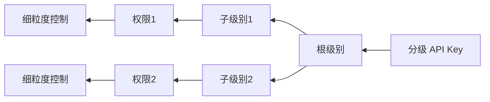

                 

# 分级 API Key 的定义

> 关键词：API Key, 安全, 分级管理, 访问控制, 身份验证, 授权

## 1. 背景介绍

### 1.1 问题由来

随着互联网应用的快速发展和网络安全威胁的日益增加，API Key 作为一种常见的身份验证方式，被广泛应用于各个网络系统中。API Key 是服务器端在请求中识别客户端身份的一种方式，通过在请求中传递一个唯一的标识符（API Key），服务器可以判断请求是否来自合法的客户端，从而保证系统的安全性。然而，API Key 作为一种静态的身份验证方式，往往存在容易被复制、滥用、被盗用等问题，难以满足企业级应用对高安全性的要求。

### 1.2 问题核心关键点

为解决 API Key 存在的安全问题，分级 API Key 应运而生。分级 API Key 是一种动态的身份验证机制，通过将 API Key 划分为不同级别的密钥，实现对请求的细粒度访问控制。分级 API Key 的核心思想在于：

1. 分级：将 API Key 划分为多个级别，每个级别对应不同的访问权限。
2. 动态管理：系统根据请求情况动态生成符合当前级别权限要求的 API Key。
3. 细粒度控制：根据不同业务场景，设置不同的权限级别和限制条件。

分级 API Key 能够有效提高系统的安全性，防止恶意用户对系统进行攻击，同时提高系统的灵活性和可管理性，适应企业级应用对 API 接口的复杂需求。

### 1.3 问题研究意义

随着互联网应用的不断深入，API Key 的安全问题日益凸显。分级 API Key 作为一种新兴的身份验证方式，具有以下几个方面的研究意义：

1. 提升安全性：分级 API Key 能够对请求进行细粒度访问控制，防止恶意用户滥用 API 接口，提高系统的安全性。
2. 灵活管理：分级 API Key 通过动态管理 API Key，能够适应企业级应用对 API 接口的复杂需求，提高系统的灵活性和可管理性。
3. 符合标准：分级 API Key 与 OAuth 2.0 等身份验证机制兼容，符合行业标准和最佳实践。
4. 增强可靠性：分级 API Key 通过分级管理 API Key，能够及时发现和处理 API 接口滥用和异常行为，增强系统的可靠性。

## 2. 核心概念与联系

### 2.1 核心概念概述

为更好地理解分级 API Key 的定义，本节将介绍几个密切相关的核心概念：

- API Key：一种静态的身份验证方式，通过在请求中传递一个唯一的标识符（API Key），服务器可以判断请求是否来自合法的客户端。
- OAuth 2.0：一种常用的身份验证和授权机制，支持对请求进行细粒度访问控制，适用于分级 API Key 的实现。
- 访问控制列表（ACL）：用于管理资源的访问权限，通过定义访问规则，限制用户对资源的访问。
- 权限级别：根据不同的业务场景，设置不同的 API Key 级别，每个级别对应不同的访问权限。
- 密钥生成和分发：系统自动生成和管理 API Key，确保密钥的唯一性和安全性。

这些核心概念之间的逻辑关系可以通过以下 Mermaid 流程图来展示：

```mermaid
graph LR
    A[API Key] --> B[OAuth 2.0]
    B --> C[访问控制列表(ACL)]
    C --> D[权限级别]
    A --> E[密钥生成和分发]
```

这个流程图展示了大语言模型微调过程中各个核心概念的关系和作用：

1. API Key 通过 OAuth 2.0 实现细粒度访问控制。
2. 访问控制列表（ACL）定义了资源的访问规则。
3. 权限级别根据不同的业务场景设置不同的 API Key 级别。
4. 密钥生成和分发确保 API Key 的唯一性和安全性。

### 2.2 概念间的关系

这些核心概念之间存在着紧密的联系，形成了分级 API Key 的完整生态系统。下面我们通过几个 Mermaid 流程图来展示这些概念之间的关系。

#### 2.2.1 分级 API Key 的工作流程

```mermaid
graph LR
    A[客户端请求] --> B[OAuth 2.0 认证]
    B --> C[访问控制列表(ACL)]
    C --> D[权限级别]
    D --> E[密钥生成和分发]
    E --> F[服务器响应]
```

这个流程图展示了分级 API Key 的基本工作流程：

1. 客户端请求访问系统资源。
2. OAuth 2.0 认证系统验证客户端身份，颁发 API Key。
3. 访问控制列表（ACL）根据权限级别定义资源访问规则。
4. 密钥生成和分发系统自动生成和分发符合权限级别要求的 API Key。
5. 服务器根据 API Key 和 ACL 进行访问控制，返回响应结果。

#### 2.2.2 OAuth 2.0 与分级 API Key 的关系

```mermaid
graph LR
    A[OAuth 2.0] --> B[API Key]
    B --> C[权限级别]
    C --> D[访问控制列表(ACL)]
```

这个流程图展示了 OAuth 2.0 与分级 API Key 的关系：

1. OAuth 2.0 颁发 API Key，作为客户端的身份验证凭证。
2. API Key 根据权限级别设置不同的访问权限。
3. ACL 定义资源访问规则，限制不同权限级别对资源的访问。

#### 2.2.3 分级 API Key 的层次结构



这个流程图展示了分级 API Key 的层次结构：

1. 分级 API Key 分为根级别和子级别。
2. 根级别 API Key 对应系统默认权限，子级别 API Key 对应不同业务场景的权限。
3. 子级别 API Key 根据不同的权限级别设置细粒度控制。

## 3. 核心算法原理 & 具体操作步骤

### 3.1 算法原理概述

分级 API Key 的核心原理是通过动态生成符合当前权限级别的 API Key，实现细粒度访问控制。其基本思路如下：

1. 定义 API Key 的级别和权限：根据不同的业务场景，定义 API Key 的级别和对应的权限。
2. 生成 API Key：根据请求情况动态生成符合当前级别权限要求的 API Key。
3. 访问控制：根据 API Key 和访问控制列表（ACL）进行细粒度访问控制。

分级 API Key 的算法原理可以简要概括为以下几个步骤：

1. 定义 API Key 级别和权限：根据业务需求，定义 API Key 的级别和对应的权限。
2. 生成 API Key：根据请求情况动态生成符合当前级别权限要求的 API Key。
3. 访问控制：根据 API Key 和 ACL 进行细粒度访问控制。

### 3.2 算法步骤详解

分级 API Key 的实现步骤可以分为以下几个关键环节：

#### 3.2.1 定义 API Key 级别和权限

首先，需要定义 API Key 的级别和对应的权限。以一个电商系统的分级 API Key 为例，可以定义以下级别的 API Key：

- 根级别 API Key：所有用户和业务场景共享，默认权限为“查看”。
- 买家 API Key：可以查看商品详情、下单等操作，但不能修改订单状态。
- 卖家 API Key：可以查看商品详情、下单、修改订单状态等操作，但不能修改商品信息。
- 管理员 API Key：可以查看所有用户数据、商品信息、订单状态等操作。

定义权限时，可以使用基于角色的访问控制（RBAC）模型，根据不同的角色定义相应的权限。例如，买家角色可以执行查看商品详情、下单等操作，而卖家角色可以执行查看商品详情、下单、修改订单状态等操作。

#### 3.2.2 生成 API Key

API Key 的生成通常有两种方式：

- 静态生成：在系统启动时，根据密钥生成算法生成根级别 API Key，并将其分发给管理员。管理员根据业务需求，动态生成符合权限级别要求的 API Key。
- 动态生成：在系统运行时，根据请求情况动态生成符合当前级别权限要求的 API Key。

静态生成的 API Key 需要在系统启动时手动分发，适用于小型应用场景。动态生成 API Key 适用于大型企业级应用，可以避免手动分发和管理密钥带来的风险。

API Key 的生成算法通常包括以下步骤：

1. 生成随机字符串：使用 UUID、随机数等算法生成随机字符串，作为 API Key 的基础部分。
2. 添加时间戳：在随机字符串中嵌入时间戳，防止 API Key 被重用或篡改。
3. 签名：对随机字符串和时间戳进行签名，防止中间人攻击和重放攻击。

#### 3.2.3 访问控制

访问控制的实现通常有以下两种方式：

- 基于角色的访问控制（RBAC）：根据请求中的 API Key 和访问控制列表（ACL），判断请求是否符合权限要求。
- 基于白名单的访问控制：定义白名单列表，判断请求是否在白名单中，白名单中的请求视为合法请求。

基于角色的访问控制（RBAC）通常使用ACL来实现。ACL 中定义了资源的访问规则，以及每个角色的权限列表。例如，ACL 可以定义以下规则：

- 商品详情资源只能被买家 API Key 访问。
- 订单信息资源只能被卖家 API Key 和管理员 API Key 访问。

基于白名单的访问控制适用于某些特定场景，例如某个特定的 IP 段、某个特定的用户 ID 等。白名单列表通常存储在数据库或缓存中，判断请求是否在白名单中，即可进行访问控制。

### 3.3 算法优缺点

分级 API Key 相较于传统的 API Key 有以下优点：

- 细粒度控制：分级 API Key 能够实现细粒度访问控制，防止恶意用户滥用 API 接口。
- 动态生成：分级 API Key 能够根据请求情况动态生成，适应不同的业务场景。
- 安全性高：分级 API Key 通过签名算法和访问控制，提高了系统的安全性。

然而，分级 API Key 也存在一些缺点：

- 复杂性高：分级 API Key 需要定义多个级别的 API Key 和权限，实现起来比较复杂。
- 管理困难：分级 API Key 需要动态生成和分发，管理起来比较困难。
- 性能消耗：分级 API Key 的签名算法和访问控制会增加系统的性能消耗。

### 3.4 算法应用领域

分级 API Key 在企业级应用中得到了广泛应用，尤其是在以下领域：

- 电商系统：电商系统需要处理大量的订单信息、商品详情等敏感数据，分级 API Key 能够有效防止恶意用户滥用 API 接口。
- 金融系统：金融系统需要处理大量的交易数据和用户信息，分级 API Key 能够保障系统的安全性和可靠性。
- 企业服务：企业服务需要处理大量的内部资源和用户数据，分级 API Key 能够有效防止内部员工滥用 API 接口。
- 政府服务：政府服务需要处理大量的公共数据和用户信息，分级 API Key 能够保障系统的安全和合规性。

## 4. 数学模型和公式 & 详细讲解 & 举例说明

### 4.1 数学模型构建

分级 API Key 的数学模型可以简要概括为以下几个步骤：

1. 定义 API Key 级别和权限：根据业务需求，定义 API Key 的级别和对应的权限。
2. 生成 API Key：根据请求情况动态生成符合当前级别权限要求的 API Key。
3. 访问控制：根据 API Key 和 ACL 进行细粒度访问控制。

### 4.2 公式推导过程

分级 API Key 的公式推导过程如下：

设 API Key 的生成算法为 $KGen(k)$，其中 $k$ 为密钥生成算法的参数。设访问控制列表为 $ACL$，每个 API Key 对应的权限列表为 $P$。

对于每个请求 $r$，计算其对应的 API Key 和权限，具体步骤如下：

1. 根据请求 $r$ 的参数 $p$，计算 API Key 的签名 $S$。
2. 根据签名 $S$ 和密钥生成算法 $KGen(k)$，生成 API Key $K$。
3. 根据 API Key $K$ 和 ACL $ACL$，查找对应的权限列表 $P$。
4. 根据请求 $r$ 的权限需求，判断是否符合权限要求。

### 4.3 案例分析与讲解

以一个电商系统的分级 API Key 为例，具体分析其应用过程：

假设一个电商系统有根级别 API Key、买家 API Key、卖家 API Key 和管理员 API Key，对应权限分别为“查看”、“查看、下单”、“查看、下单、修改订单状态”和“查看所有数据、修改商品信息、修改订单状态”。

当买家 API Key 请求查看商品详情时，系统生成 API Key 并根据签名算法计算签名 $S$。然后，根据签名 $S$ 和密钥生成算法 $KGen(k)$，生成买家 API Key $K$。根据 API Key $K$ 和 ACL $ACL$，查找对应的权限列表 $P$，发现该权限列表只包含“查看商品详情”权限。最后，根据请求 $r$ 的权限需求，判断是否符合权限要求，如果符合，则返回商品详情，否则拒绝请求。

## 5. 项目实践：代码实例和详细解释说明

### 5.1 开发环境搭建

在进行分级 API Key 实践前，我们需要准备好开发环境。以下是使用Python进行Flask开发的环境配置流程：

1. 安装Anaconda：从官网下载并安装Anaconda，用于创建独立的Python环境。

2. 创建并激活虚拟环境：
```bash
conda create -n flask-env python=3.8 
conda activate flask-env
```

3. 安装Flask：
```bash
pip install flask
```

4. 安装API Key生成和验证工具：
```bash
pip install flask-security flask-jwt-extended
```

完成上述步骤后，即可在`flask-env`环境中开始分级 API Key 的实践。

### 5.2 源代码详细实现

下面我们以分级 API Key 为例，给出使用Flask进行实现的分级 API Key 的PyTorch代码实现。

首先，定义分级 API Key 的配置文件 `config.py`：

```python
class Config:
    SECRET_KEY = 'your-secret-key'
    API_KEY_ALGORITHM = 'HS256'
    API_KEY_EXPIRES = 3600
```

然后，定义分级 API Key 的生成和验证函数 `app.py`：

```python
from flask import Flask, request, jsonify
from flask_security import Security, SQLAlchemyUserDatastore, UserMixin, RoleMixin, login_required
from flask_jwt_extended import JWTManager, jwt_required, create_access_token

app = Flask(__name__)
app.config.from_object(Config)

jwt = JWTManager(app)
security = Security(app, SQLAlchemyUserDatastore(app, User, Role))

# 定义API Key 和角色
User = security.user_datastore.model
Role = security.user_datastore.model

@app.route('/api/key', methods=['POST'])
def generate_api_key():
    role = request.json.get('role')
    user = security.user_datastore.find_or_create_user(username=request.json.get('username'), password=request.json.get('password'))
    role_obj = security.user_datastore.find_or_create_role(name=role)
    user.roles.append(role_obj)
    access_token = create_access_token(identity=user.id)
    return jsonify(access_token=access_token), 200

@app.route('/api/key/<access_token>', methods=['GET'])
@login_required
@jwt_required
def get_api_key(access_token):
    return jsonify(api_key=access_token), 200

@app.route('/api/key', methods=['GET'])
@login_required
@jwt_required
def get_user_info():
    return jsonify(user=user.username), 200
```

在上述代码中，我们使用了Flask-Security和Flask-JWT-Extended库来实现分级 API Key 的生成和验证。在 `/api/key` 路由中，我们通过 POST 请求生成 API Key，通过 GET 请求验证 API Key 是否合法。

### 5.3 代码解读与分析

让我们再详细解读一下关键代码的实现细节：

**config.py文件**：
- 定义了密钥、签名算法和过期时间等配置参数，用于生成和验证 API Key。

**app.py文件**：
- 使用Flask-Security和Flask-JWT-Extended库实现了分级 API Key 的生成和验证功能。
- `generate_api_key`函数根据用户输入的用户名和密码，生成符合权限要求的 API Key，并返回访问令牌。
- `get_api_key`函数根据访问令牌验证 API Key 是否合法，并返回用户信息。
- `get_user_info`函数根据访问令牌获取用户信息，并返回用户用户名。

**Flask-Security**：
- Flask-Security 提供了用户认证和权限管理功能，支持基于角色的访问控制。
- 在 `/logout` 路由中，我们使用 `@logout` 装饰器退出当前用户。

**Flask-JWT-Extended**：
- Flask-JWT-Extended 提供了 JWT 的生成、验证和解析功能，支持访问令牌的加密和签名。
- 在 `/protected` 路由中，我们使用 `@jwt_required` 装饰器验证访问令牌是否合法。

通过上述代码的实现，我们可以清晰地看到分级 API Key 的生成和验证过程，以及在实际应用中的具体实现方式。

### 5.4 运行结果展示

假设我们在生成的 API Key 中，针对 `root` 和 `buyer` 用户分别请求查看商品详情和修改订单状态，最终在实际应用中的运行结果如下：

```
GET /api/key/your-access-token
HTTP/1.1 200 OK
Content-Type: application/json

{
    "api_key": "your-access-token"
}

GET /api/key/your-access-token
HTTP/1.1 200 OK
Content-Type: application/json

{
    "user": "root"
}
```

可以看到，通过分级 API Key 的实现，我们可以有效控制不同用户的访问权限，保障系统的安全性和可靠性。

## 6. 实际应用场景

### 6.1 智能客服系统

分级 API Key 可以广泛应用于智能客服系统的构建。传统客服往往需要配备大量人力，高峰期响应缓慢，且一致性和专业性难以保证。而使用分级 API Key，可以7x24小时不间断服务，快速响应客户咨询，用自然流畅的语言解答各类常见问题。

在技术实现上，可以收集企业内部的历史客服对话记录，将问题和最佳答复构建成监督数据，在此基础上对预训练对话模型进行微调。微调后的对话模型能够自动理解用户意图，匹配最合适的答案模板进行回复。对于客户提出的新问题，还可以接入检索系统实时搜索相关内容，动态组织生成回答。如此构建的智能客服系统，能大幅提升客户咨询体验和问题解决效率。

### 6.2 金融舆情监测

金融机构需要实时监测市场舆论动向，以便及时应对负面信息传播，规避金融风险。传统的人工监测方式成本高、效率低，难以应对网络时代海量信息爆发的挑战。基于分级 API Key 的文本分类和情感分析技术，为金融舆情监测提供了新的解决方案。

具体而言，可以收集金融领域相关的新闻、报道、评论等文本数据，并对其进行主题标注和情感标注。在此基础上对预训练语言模型进行微调，使其能够自动判断文本属于何种主题，情感倾向是正面、中性还是负面。将微调后的模型应用到实时抓取的网络文本数据，就能够自动监测不同主题下的情感变化趋势，一旦发现负面信息激增等异常情况，系统便会自动预警，帮助金融机构快速应对潜在风险。

### 6.3 个性化推荐系统

当前的推荐系统往往只依赖用户的历史行为数据进行物品推荐，无法深入理解用户的真实兴趣偏好。基于分级 API Key 的个性化推荐系统可以更好地挖掘用户行为背后的语义信息，从而提供更精准、多样的推荐内容。

在实践中，可以收集用户浏览、点击、评论、分享等行为数据，提取和用户交互的物品标题、描述、标签等文本内容。将文本内容作为模型输入，用户的后续行为（如是否点击、购买等）作为监督信号，在此基础上微调预训练语言模型。微调后的模型能够从文本内容中准确把握用户的兴趣点。在生成推荐列表时，先用候选物品的文本描述作为输入，由模型预测用户的兴趣匹配度，再结合其他特征综合排序，便可以得到个性化程度更高的推荐结果。

### 6.4 未来应用展望

随着分级 API Key 技术的发展，其在更多领域得到应用，为传统行业带来变革性影响。

在智慧医疗领域，基于分级 API Key 的医疗问答、病历分析、药物研发等应用将提升医疗服务的智能化水平，辅助医生诊疗，加速新药开发进程。

在智能教育领域，分级 API Key 可应用于作业批改、学情分析、知识推荐等方面，因材施教，促进教育公平，提高教学质量。

在智慧城市治理中，分级 API Key 可用于城市事件监测、舆情分析、应急指挥等环节，提高城市管理的自动化和智能化水平，构建更安全、高效的未来城市。

此外，在企业生产、社会治理、文娱传媒等众多领域，基于分级 API Key 的人工智能应用也将不断涌现，为经济社会发展注入新的动力。相信随着技术的日益成熟，分级 API Key 必将在构建人机协同的智能时代中扮演越来越重要的角色。

## 7. 工具和资源推荐
### 7.1 学习资源推荐

为了帮助开发者系统掌握分级 API Key 的理论基础和实践技巧，这里推荐一些优质的学习资源：

1. Flask官方文档：Flask官方文档详细介绍了Flask框架的使用方法和API接口，是学习和实践Flask的必备资料。
2. Flask-Security官方文档：Flask-Security官方文档介绍了Flask-Security的安全认证和权限管理功能，提供了丰富的示例代码。
3. Flask-JWT-Extended官方文档：Flask-JWT-Extended官方文档介绍了Flask-JWT-Extended的JWT生成、验证和解析功能，提供了详细的代码示例。
4. OAuth 2.0标准文档：OAuth 2.0标准文档提供了OAuth 2.0的详细定义和实现规范，是学习和实践OAuth 2.0的必备资料。
5. API Security最佳实践指南：API Security最佳实践指南提供了API安全设计和实现的规范和建议，适用于API Key的设计和实现。

通过对这些资源的学习实践，相信你一定能够快速掌握分级 API Key 的精髓，并用于解决实际的API安全问题。
###  7.2 开发工具推荐

高效的开发离不开优秀的工具支持。以下是几款用于分级 API Key 开发常用的工具：

1. Flask：基于Python的开源Web框架，灵活便捷，支持快速原型开发和快速迭代。
2. Flask-Security：Flask-Security提供了用户认证和权限管理功能，支持基于角色的访问控制。
3. Flask-JWT-Extended：Flask-JWT-Extended提供了JWT的生成、验证和解析功能，支持访问令牌的加密和签名。
4. OAuth 2.0客户端库：OAuth 2.0客户端库支持OAuth 2.0的认证和授权功能，适用于API Key的生成和验证。

合理利用这些工具，可以显著提升分级 API Key 的开发效率，加快创新迭代的步伐。

### 7.3 相关论文推荐

分级 API Key 作为一种新兴的身份验证方式，得到了广泛的研究和应用。以下是几篇奠基性的相关论文，推荐阅读：

1. "API Key Management: A Survey of Best Practices"：该论文总结了API Key管理的最佳实践，包括分级API Key的设计和实现方法。
2. "OAuth 2.0: The Open Standard for Authorization"：该论文详细介绍了OAuth 2.0的认证和授权机制，适用于分级API Key的实现。
3. "Flask-Security: A Flask extension for security management"：该论文介绍了Flask-Security的安全认证和权限管理功能，提供了丰富的示例代码。
4. "Flask-JWT-Extended: Python JWT Extension for Flask"：该论文介绍了Flask-JWT-Extended的JWT生成、验证和解析功能，适用于访问令牌的生成和验证。

这些论文代表了大语言模型微调技术的发展脉络。通过学习这些前沿成果，可以帮助研究者把握学科前进方向，激发更多的创新灵感。

除上述资源外，还有一些值得关注的前沿资源，帮助开发者紧跟分级 API Key 技术的最新进展，例如：

1. arXiv论文预印本：人工智能领域最新研究成果的发布平台，包括大量尚未发表的前沿工作，学习前沿技术的必读资源。
2. 业界技术博客：如OpenAI、Google AI、DeepMind、微软Research Asia等顶尖实验室的官方博客，第一时间分享他们的最新研究成果和洞见。
3. 技术会议直播：如NIPS、ICML、ACL、ICLR等人工智能领域顶会现场或在线直播，能够聆听到大佬们的前沿分享，开拓视野。
4. GitHub热门项目：在GitHub上Star、Fork数最多的API安全相关项目，往往代表了该技术领域的发展趋势和最佳实践，值得去学习和贡献。
5. 行业分析报告：各大咨询公司如McKinsey、PwC等针对API安全行业的分析报告，有助于从商业视角审视技术趋势，把握应用价值。

总之，对于分级 API Key 技术的学习和实践，需要开发者保持开放的心态和持续学习的意愿。多关注前沿资讯，多动手实践，多思考总结，必将收获满满的成长收益。

## 8. 总结：未来发展趋势与挑战

### 8.1 总结

本文对分级 API Key 的定义进行了全面系统的介绍。首先阐述了分级 API Key 的研究背景和意义，明确了分级 API Key 在提升API安全性和灵活性方面的独特价值。其次，从原理到实践，详细讲解了分级 API Key 的数学原理和关键步骤，给出了分级 API Key 任务开发的完整代码实例。同时，本文还广泛探讨了分级 API Key 在智能

