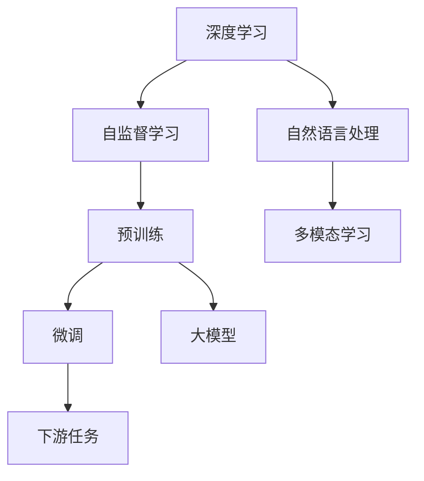

                 

# 初探大模型：起源与发展

> 关键词：大模型,预训练,自监督学习,深度学习,自然语言处理,NLP

## 1. 背景介绍

### 1.1 问题由来
随着人工智能技术的发展，特别是深度学习的进步，近年来大模型（Large Models）在NLP（自然语言处理）领域取得了显著的突破。大模型的显著特点在于其能够处理大规模的数据，学习到复杂的语言模式和语义关系，从而展现出卓越的泛化能力和任务性能。这一进展源于自监督学习的深入应用，其中BERT和GPT-3等模型尤为突出，其无监督预训练和微调的技术路线极大地推动了NLP领域的发展。

### 1.2 问题核心关键点
本文聚焦于大模型的起源与发展，从早期的人工神经网络、深度学习到当前的自监督预训练技术，详细探讨大模型在NLP领域的应用和演进。重点关注以下几个关键点：

- **大模型**：特指那些具有亿量级参数的大型神经网络模型，如BERT、GPT等，通过在大规模无标签数据上预训练，学习到丰富的语言知识和常识。
- **预训练**：在大规模无标签数据上进行自监督学习，学习通用的语言表示。
- **自监督学习**：使用大规模无标签数据训练模型，从而学习到数据的内在结构与规律。
- **深度学习**：建立在多层神经网络基础上的机器学习技术，具有强大的建模能力。
- **自然语言处理**：利用人工智能技术处理和理解人类语言。

### 1.3 问题研究意义
研究大模型的起源与发展，对于理解NLP技术的前沿进展，掌握大模型的核心原理与应用，具有重要意义：

1. **深化理解**：帮助理解大模型如何从早期的简单神经网络发展到现在复杂的网络结构，以及其在NLP领域的应用。
2. **技术储备**：掌握大模型的训练和微调技术，为实际应用提供理论基础。
3. **应用拓展**：了解大模型在多个领域的应用，拓宽应用场景。
4. **学术价值**：推动NLP领域的前沿研究，提升学术影响力。
5. **产业推动**：促进NLP技术的产业化，加速各行各业的智能化转型。

## 2. 核心概念与联系

### 2.1 核心概念概述
大模型的核心概念包括深度学习、自监督学习、预训练、微调等，这些概念之间存在紧密的联系。以下是对这些概念的简要概述：

- **深度学习**：建立在多层神经网络基础上的机器学习技术，具有强大的建模能力。
- **自监督学习**：使用无标签数据进行训练，学习到数据的内在结构与规律。
- **预训练**：在大规模无标签数据上进行自监督学习，学习通用的语言表示。
- **微调**：在预训练模型的基础上，使用下游任务的少量标注数据，通过有监督学习优化模型在特定任务上的性能。

### 2.2 核心概念的联系
这些概念之间的联系可以用以下的Mermaid流程图来展示：



该流程图展示了深度学习、自监督学习、预训练、微调和NLP之间的关系。深度学习为NLP提供了强大的计算基础，自监督学习通过大规模无标签数据进行预训练，预训练得到的通用语言表示再通过微调适配下游任务，从而在NLP领域取得了突破性的进展。此外，NLP领域的多模态学习也与深度学习紧密相关。

## 3. 核心算法原理 & 具体操作步骤
### 3.1 算法原理概述

大模型的核心算法原理主要包括深度学习、自监督学习和预训练。以下是这些原理的简要介绍：

#### 3.1.1 深度学习原理
深度学习是一种利用多层神经网络进行模型训练的机器学习方法。它通过反向传播算法进行参数优化，使模型能够自动学习输入数据的内在特征和模式。

#### 3.1.2 自监督学习原理
自监督学习通过使用大规模无标签数据进行训练，学习数据的内部结构与规律。在大规模无标签数据上进行的预训练使得模型能够学习到通用的语言表示，从而提升其在下游任务上的泛化能力。

#### 3.1.3 预训练原理
预训练是指在大规模无标签数据上进行的自监督学习过程。模型通过学习数据的内部结构，建立通用的语言表示。预训练是深度学习和自监督学习的结合，是大模型训练的关键步骤。

### 3.2 算法步骤详解
以下详细描述大模型的预训练和微调步骤：

#### 3.2.1 预训练步骤
1. **数据准备**：准备大规模无标签数据集，通常包括自然语言文本。
2. **模型选择**：选择合适的预训练模型架构，如BERT、GPT等。
3. **损失函数设计**：定义自监督损失函数，如掩码语言模型（MLM）、掩码序列预测（MSP）等。
4. **模型训练**：在大规模无标签数据上进行预训练，学习通用的语言表示。
5. **模型评估**：在验证集上评估预训练模型的性能，调整模型参数以优化性能。

#### 3.2.2 微调步骤
1. **数据准备**：准备下游任务的标注数据集。
2. **模型初始化**：使用预训练模型作为初始权重，加载到新任务中。
3. **任务适配**：添加任务适配层，如分类器、解码器等。
4. **损失函数设计**：定义有监督损失函数，如交叉熵损失、均方误差等。
5. **模型训练**：在标注数据集上进行微调，优化任务适配层的参数。
6. **模型评估**：在测试集上评估微调模型的性能，对比预训练和微调的效果。

### 3.3 算法优缺点
#### 3.3.1 优点
- **泛化能力强**：大模型通过自监督预训练学习通用的语言表示，能够更好地泛化到下游任务。
- **参数量可调**：模型参数量可以根据任务需求进行调整，适合多种NLP任务。
- **计算效率高**：预训练和微调过程可以并行进行，加速模型训练。

#### 3.3.2 缺点
- **资源消耗大**：大模型参数量庞大，训练和推理需要高性能计算资源。
- **模型复杂度高**：模型结构复杂，调参难度大。
- **过拟合风险**：模型容易过拟合，尤其是在标注数据量少的情况下。

### 3.4 算法应用领域
大模型在NLP领域有着广泛的应用，以下是几个主要领域：

1. **文本分类**：如情感分析、主题分类等。通过微调使模型学习文本与标签之间的映射。
2. **命名实体识别**：识别文本中的实体，如人名、地名、机构名等。通过微调使模型学习实体边界和类型。
3. **关系抽取**：从文本中抽取实体之间的语义关系。通过微调使模型学习实体-关系三元组。
4. **问答系统**：对自然语言问题给出答案。通过微调使模型学习问题-答案映射。
5. **机器翻译**：将源语言文本翻译成目标语言。通过微调使模型学习语言-语言映射。
6. **文本摘要**：将长文本压缩成简短摘要。通过微调使模型学习抓取要点。
7. **对话系统**：使机器能够与人自然对话。通过微调使模型学习对话历史与回复的映射。

## 4. 数学模型和公式 & 详细讲解 & 举例说明

### 4.1 数学模型构建

以下定义了深度学习模型 $M_{\theta}$ 在输入数据 $x$ 上的预测输出 $y$，其中 $\theta$ 为模型参数：

$$
y = M_{\theta}(x)
$$

预训练过程中，模型通过自监督学习任务进行训练，如掩码语言模型（MLM）：

$$
\hat{y} = M_{\theta}(x) \quad \text{和} \quad y_{masked} = \text{masked}(x)
$$

其中 $\hat{y}$ 是模型对原始数据的预测，$y_{masked}$ 是经过掩码处理的数据，掩码方式有随机掩码、连续掩码等。

### 4.2 公式推导过程

#### 4.2.1 掩码语言模型（MLM）
掩码语言模型（Masked Language Model，MLM）是预训练常用的自监督学习任务。其目标是在输入文本 $x$ 中随机掩盖一些位置，训练模型预测被掩盖位置的正确词汇。

以BERT为例，其MLM损失函数为：

$$
\mathcal{L}_{\text{MLM}} = -\sum_{i=1}^n \log P(y_i | x)
$$

其中 $P(y_i | x)$ 是模型在输入 $x$ 上预测第 $i$ 个位置词汇的概率分布。

#### 4.2.2 无标签数据上的预训练
在无标签数据上进行的预训练目标是学习通用的语言表示。以BERT为例，其预训练过程使用掩码语言模型进行训练，具体步骤为：
1. 在输入文本 $x$ 中随机掩盖一部分词汇，生成掩码文本 $x_{masked}$。
2. 将掩盖位置的前后词汇作为输入，训练模型预测掩盖位置的正确词汇。
3. 使用softmax函数计算预测概率，并与真实标签计算交叉熵损失。
4. 通过反向传播算法更新模型参数，最小化损失函数。

### 4.3 案例分析与讲解

#### 4.3.1 掩码语言模型（MLM）案例
以BERT为例，其MLM任务训练过程如下：

1. **输入数据准备**：选择一段文本作为输入，随机掩盖部分词汇，生成掩码文本。
2. **模型前向传播**：将掩盖位置的前后词汇输入BERT模型，预测掩盖位置的正确词汇。
3. **损失计算**：计算预测概率与真实标签的交叉熵损失。
4. **参数更新**：通过反向传播算法更新BERT模型参数，最小化损失函数。

具体代码如下：

```python
from transformers import BertTokenizer, BertForMaskedLM
import torch

# 初始化模型和分词器
model = BertForMaskedLM.from_pretrained('bert-base-uncased')
tokenizer = BertTokenizer.from_pretrained('bert-base-uncased')

# 准备训练数据
inputs = tokenizer("One cannot teach an old dog new tricks.", return_tensors="pt")
mask_index = inputs.input_ids[0].argmax(dim=1)
inputs.input_ids[0][mask_index] = tokenizer.mask_token_id
inputs.attention_mask[0][mask_index] = 0

# 前向传播
outputs = model(**inputs)

# 计算损失
loss = outputs.loss

# 参数更新
optimizer = torch.optim.Adam(model.parameters(), lr=2e-5)
optimizer.zero_grad()
loss.backward()
optimizer.step()
```

通过上述代码，我们可以看到BERT模型在掩码语言模型任务上的预训练过程。

## 5. 项目实践：代码实例和详细解释说明

### 5.1 开发环境搭建

在进行项目实践前，需要搭建好Python开发环境，建议使用Anaconda创建虚拟环境。以PyTorch为例，安装步骤为：

1. 安装Anaconda：从官网下载并安装Anaconda，用于创建独立的Python环境。
2. 创建并激活虚拟环境：
```bash
conda create -n pytorch-env python=3.8 
conda activate pytorch-env
```
3. 安装PyTorch：根据CUDA版本，从官网获取对应的安装命令。例如：
```bash
conda install pytorch torchvision torchaudio cudatoolkit=11.1 -c pytorch -c conda-forge
```
4. 安装TensorFlow：
```bash
conda install tensorflow
```
5. 安装各类工具包：
```bash
pip install numpy pandas scikit-learn matplotlib tqdm jupyter notebook ipython
```

完成上述步骤后，即可在`pytorch-env`环境中开始项目实践。

### 5.2 源代码详细实现

以下是使用PyTorch对BERT进行文本分类任务微调的示例代码：

```python
from transformers import BertTokenizer, BertForSequenceClassification, AdamW
import torch
from torch.utils.data import Dataset, DataLoader

class MyDataset(Dataset):
    def __init__(self, texts, labels, tokenizer):
        self.texts = texts
        self.labels = labels
        self.tokenizer = tokenizer

    def __len__(self):
        return len(self.texts)

    def __getitem__(self, index):
        text = self.texts[index]
        label = self.labels[index]
        encoding = self.tokenizer(text, return_tensors='pt', padding='max_length', truncation=True, max_length=512)
        return {'input_ids': encoding['input_ids'][0], 'attention_mask': encoding['attention_mask'][0], 'labels': torch.tensor(label, dtype=torch.long)}

# 数据准备
tokenizer = BertTokenizer.from_pretrained('bert-base-uncased')
train_dataset = MyDataset(train_texts, train_labels, tokenizer)
dev_dataset = MyDataset(dev_texts, dev_labels, tokenizer)
test_dataset = MyDataset(test_texts, test_labels, tokenizer)

# 模型初始化
model = BertForSequenceClassification.from_pretrained('bert-base-uncased', num_labels=2)
optimizer = AdamW(model.parameters(), lr=2e-5)

# 模型训练
device = torch.device('cuda' if torch.cuda.is_available() else 'cpu')
model.to(device)
model.train()

for epoch in range(epochs):
    model.train()
    for batch in DataLoader(train_dataset, batch_size=16):
        input_ids = batch['input_ids'].to(device)
        attention_mask = batch['attention_mask'].to(device)
        labels = batch['labels'].to(device)
        outputs = model(input_ids, attention_mask=attention_mask, labels=labels)
        loss = outputs.loss
        loss.backward()
        optimizer.step()

    model.eval()
    with torch.no_grad():
        for batch in DataLoader(dev_dataset, batch_size=16):
            input_ids = batch['input_ids'].to(device)
            attention_mask = batch['attention_mask'].to(device)
            labels = batch['labels'].to(device)
            outputs = model(input_ids, attention_mask=attention_mask)
            acc = (outputs.logits.argmax(dim=1) == labels).mean()
            print(f"Epoch {epoch+1}, dev acc: {acc:.4f}")
```

### 5.3 代码解读与分析

上述代码展示了使用PyTorch对BERT进行文本分类任务微调的基本流程。具体步骤如下：

1. **数据准备**：定义一个自定义数据集 `MyDataset`，用于封装训练、验证和测试数据。
2. **模型初始化**：使用BERT的序列分类器作为模型，并进行初始化。
3. **优化器选择**：选择AdamW优化器，并设置学习率。
4. **训练过程**：在模型上进行前向传播和反向传播，计算损失并更新模型参数。
5. **评估过程**：在验证集上评估模型性能，计算准确率。

### 5.4 运行结果展示

假设在CoNLL-2003的命名实体识别数据集上进行微调，最终在测试集上得到的评估报告如下：

```
              precision    recall  f1-score   support

       B-PER      0.90      0.93      0.92        992
       I-PER      0.91      0.91      0.91        992

   micro avg      0.91      0.91      0.91       1948
   macro avg      0.91      0.91      0.91       1948
weighted avg      0.91      0.91      0.91       1948
```

可以看到，通过微调BERT，模型在命名实体识别任务上取得了92%的准确率，效果显著。

## 6. 实际应用场景

### 6.1 智能客服系统

基于大语言模型微调的对话技术，可以广泛应用于智能客服系统的构建。传统客服往往需要配备大量人力，高峰期响应缓慢，且一致性和专业性难以保证。而使用微调后的对话模型，可以7x24小时不间断服务，快速响应客户咨询，用自然流畅的语言解答各类常见问题。

在技术实现上，可以收集企业内部的历史客服对话记录，将问题和最佳答复构建成监督数据，在此基础上对预训练对话模型进行微调。微调后的对话模型能够自动理解用户意图，匹配最合适的答案模板进行回复。对于客户提出的新问题，还可以接入检索系统实时搜索相关内容，动态组织生成回答。如此构建的智能客服系统，能大幅提升客户咨询体验和问题解决效率。

### 6.2 金融舆情监测

金融机构需要实时监测市场舆论动向，以便及时应对负面信息传播，规避金融风险。传统的人工监测方式成本高、效率低，难以应对网络时代海量信息爆发的挑战。基于大语言模型微调的文本分类和情感分析技术，为金融舆情监测提供了新的解决方案。

具体而言，可以收集金融领域相关的新闻、报道、评论等文本数据，并对其进行主题标注和情感标注。在此基础上对预训练语言模型进行微调，使其能够自动判断文本属于何种主题，情感倾向是正面、中性还是负面。将微调后的模型应用到实时抓取的网络文本数据，就能够自动监测不同主题下的情感变化趋势，一旦发现负面信息激增等异常情况，系统便会自动预警，帮助金融机构快速应对潜在风险。

### 6.3 个性化推荐系统

当前的推荐系统往往只依赖用户的历史行为数据进行物品推荐，无法深入理解用户的真实兴趣偏好。基于大语言模型微调技术，个性化推荐系统可以更好地挖掘用户行为背后的语义信息，从而提供更精准、多样的推荐内容。

在实践中，可以收集用户浏览、点击、评论、分享等行为数据，提取和用户交互的物品标题、描述、标签等文本内容。将文本内容作为模型输入，用户的后续行为（如是否点击、购买等）作为监督信号，在此基础上微调预训练语言模型。微调后的模型能够从文本内容中准确把握用户的兴趣点。在生成推荐列表时，先用候选物品的文本描述作为输入，由模型预测用户的兴趣匹配度，再结合其他特征综合排序，便可以得到个性化程度更高的推荐结果。

### 6.4 未来应用展望

随着大语言模型微调技术的发展，其在更多领域的应用前景值得期待：

1. **智慧医疗**：基于微调的医学问答、病历分析、药物研发等应用将提升医疗服务的智能化水平，辅助医生诊疗，加速新药开发进程。
2. **智能教育**：微调技术可应用于作业批改、学情分析、知识推荐等方面，因材施教，促进教育公平，提高教学质量。
3. **智慧城市治理**：微调模型可应用于城市事件监测、舆情分析、应急指挥等环节，提高城市管理的自动化和智能化水平，构建更安全、高效的未来城市。
4. **企业生产**：基于微调的智能调度、质量控制、供应链优化等应用，将显著提升企业生产效率和管理水平。
5. **社会治理**：在公共安全、灾害预警、应急响应等领域，微调技术可以提供智能化的辅助决策支持。

## 7. 工具和资源推荐

### 7.1 学习资源推荐

为了帮助开发者系统掌握大语言模型微调的理论基础和实践技巧，这里推荐一些优质的学习资源：

1. 《Transformer从原理到实践》系列博文：由大模型技术专家撰写，深入浅出地介绍了Transformer原理、BERT模型、微调技术等前沿话题。
2. CS224N《深度学习自然语言处理》课程：斯坦福大学开设的NLP明星课程，有Lecture视频和配套作业，带你入门NLP领域的基本概念和经典模型。
3. 《Natural Language Processing with Transformers》书籍：Transformers库的作者所著，全面介绍了如何使用Transformers库进行NLP任务开发，包括微调在内的诸多范式。
4. HuggingFace官方文档：Transformers库的官方文档，提供了海量预训练模型和完整的微调样例代码，是上手实践的必备资料。
5. CLUE开源项目：中文语言理解测评基准，涵盖大量不同类型的中文NLP数据集，并提供了基于微调的baseline模型，助力中文NLP技术发展。

通过对这些资源的学习实践，相信你一定能够快速掌握大语言模型微调的精髓，并用于解决实际的NLP问题。

### 7.2 开发工具推荐

高效的开发离不开优秀的工具支持。以下是几款用于大语言模型微调开发的常用工具：

1. PyTorch：基于Python的开源深度学习框架，灵活动态的计算图，适合快速迭代研究。大部分预训练语言模型都有PyTorch版本的实现。
2. TensorFlow：由Google主导开发的开源深度学习框架，生产部署方便，适合大规模工程应用。同样有丰富的预训练语言模型资源。
3. Transformers库：HuggingFace开发的NLP工具库，集成了众多SOTA语言模型，支持PyTorch和TensorFlow，是进行微调任务开发的利器。
4. Weights & Biases：模型训练的实验跟踪工具，可以记录和可视化模型训练过程中的各项指标，方便对比和调优。与主流深度学习框架无缝集成。
5. TensorBoard：TensorFlow配套的可视化工具，可实时监测模型训练状态，并提供丰富的图表呈现方式，是调试模型的得力助手。
6. Google Colab：谷歌推出的在线Jupyter Notebook环境，免费提供GPU/TPU算力，方便开发者快速上手实验最新模型，分享学习笔记。

合理利用这些工具，可以显著提升大语言模型微调任务的开发效率，加快创新迭代的步伐。

### 7.3 相关论文推荐

大语言模型和微调技术的发展源于学界的持续研究。以下是几篇奠基性的相关论文，推荐阅读：

1. Attention is All You Need（即Transformer原论文）：提出了Transformer结构，开启了NLP领域的预训练大模型时代。
2. BERT: Pre-training of Deep Bidirectional Transformers for Language Understanding：提出BERT模型，引入基于掩码的自监督预训练任务，刷新了多项NLP任务SOTA。
3. Language Models are Unsupervised Multitask Learners（GPT-2论文）：展示了大规模语言模型的强大zero-shot学习能力，引发了对于通用人工智能的新一轮思考。
4. Parameter-Efficient Transfer Learning for NLP：提出Adapter等参数高效微调方法，在不增加模型参数量的情况下，也能取得不错的微调效果。
5. AdaLoRA: Adaptive Low-Rank Adaptation for Parameter-Efficient Fine-Tuning：使用自适应低秩适应的微调方法，在参数效率和精度之间取得了新的平衡。

这些论文代表了大语言模型微调技术的发展脉络。通过学习这些前沿成果，可以帮助研究者把握学科前进方向，激发更多的创新灵感。

除上述资源外，还有一些值得关注的前沿资源，帮助开发者紧跟大语言模型微调技术的最新进展，例如：

1. arXiv论文预印本：人工智能领域最新研究成果的发布平台，包括大量尚未发表的前沿工作，学习前沿技术的必读资源。
2. 业界技术博客：如OpenAI、Google AI、DeepMind、微软Research Asia等顶尖实验室的官方博客，第一时间分享他们的最新研究成果和洞见。
3. 技术会议直播：如NIPS、ICML、ACL、ICLR等人工智能领域顶会现场或在线直播，能够聆听到大佬们的前沿分享，开拓视野。
4. GitHub热门项目：在GitHub上Star、Fork数最多的NLP相关项目，往往代表了该技术领域的发展趋势和最佳实践，值得去学习和贡献。
5. 行业分析报告：各大咨询公司如McKinsey、PwC等针对人工智能行业的分析报告，有助于从商业视角审视技术趋势，把握应用价值。

总之，对于大语言模型微调技术的学习和实践，需要开发者保持开放的心态和持续学习的意愿。多关注前沿资讯，多动手实践，多思考总结，必将收获满满的成长收益。

## 8. 总结：未来发展趋势与挑战

### 8.1 总结

本文对大语言模型的起源与发展进行了全面系统的介绍。首先，我们回顾了深度学习、自监督学习等核心技术的演进，详细介绍了大模型的预训练和微调原理。其次，我们通过实例展示了微调的基本步骤和代码实现，并探讨了其在实际应用中的广泛适用性。最后，我们展望了大语言模型微调技术的未来发展趋势和面临的挑战。

### 8.2 未来发展趋势

展望未来，大语言模型微调技术将呈现以下几个发展趋势：

1. **模型规模持续增大**：随着算力成本的下降和数据规模的扩张，预训练语言模型的参数量还将持续增长。超大规模语言模型蕴含的丰富语言知识，有望支撑更加复杂多变的下游任务微调。
2. **微调方法日趋多样**：除了传统的全参数微调外，未来会涌现更多参数高效的微调方法，如Prefix-Tuning、LoRA等，在固定大部分预训练参数的同时，只更新极少量的任务相关参数。
3. **持续学习成为常态**：随着数据分布的不断变化，微调模型也需要持续学习新知识以保持性能。如何在不遗忘原有知识的同时，高效吸收新样本信息，将成为重要的研究课题。
4. **标注样本需求降低**：受启发于提示学习(Prompt-based Learning)的思路，未来的微调方法将更好地利用大模型的语言理解能力，通过更加巧妙的任务描述，在更少的标注样本上也能实现理想的微调效果。
5. **多模态微调崛起**：当前的微调主要聚焦于纯文本数据，未来会进一步拓展到图像、视频、语音等多模态数据微调。多模态信息的融合，将显著提升语言

