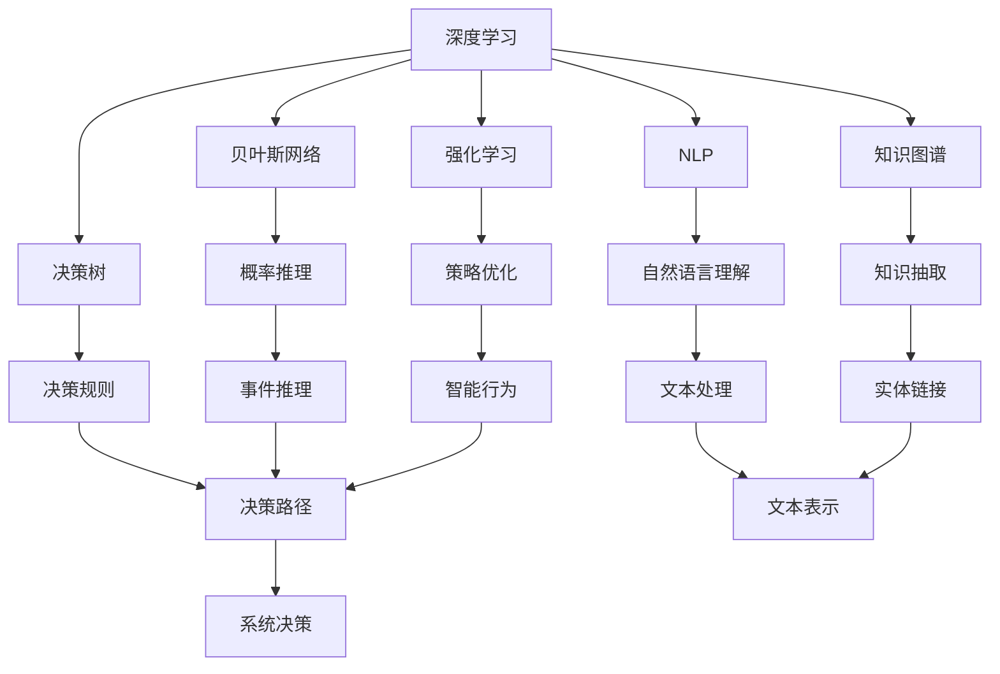
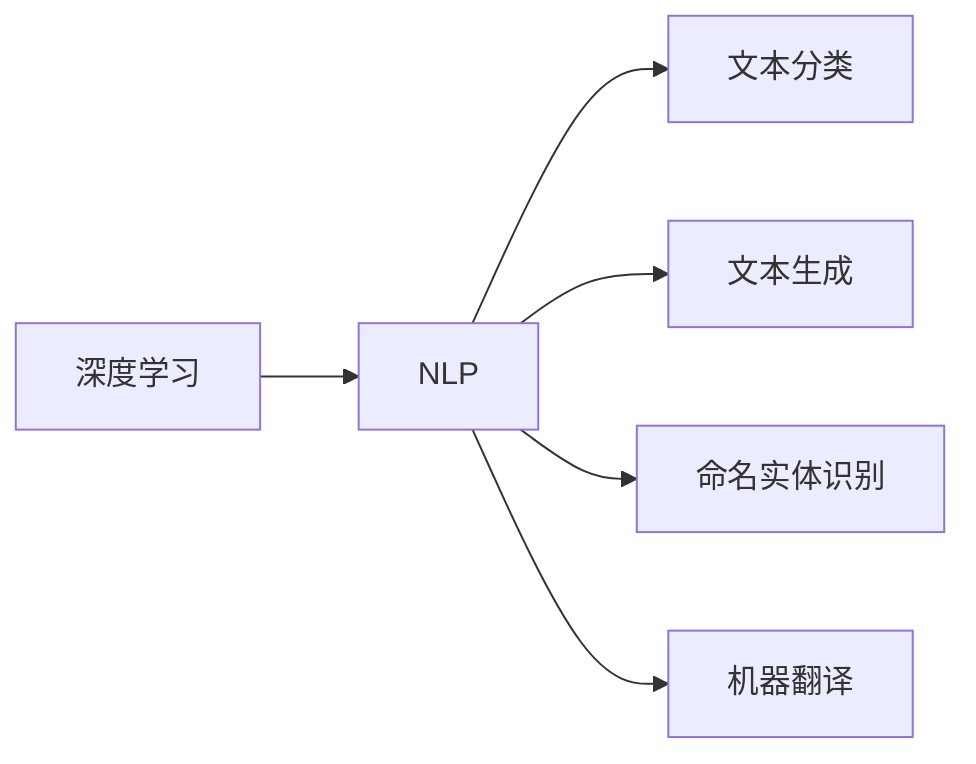
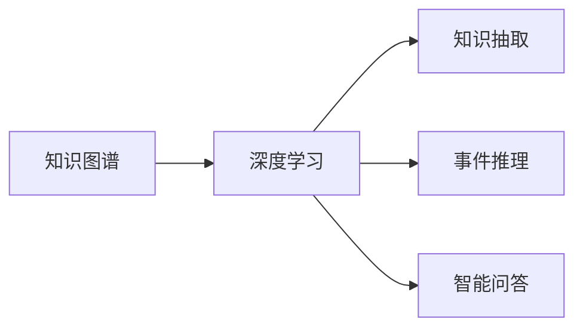
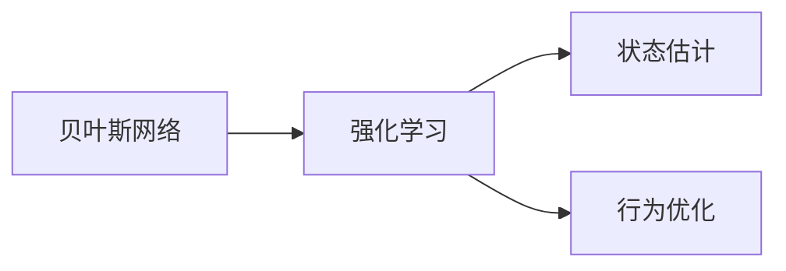
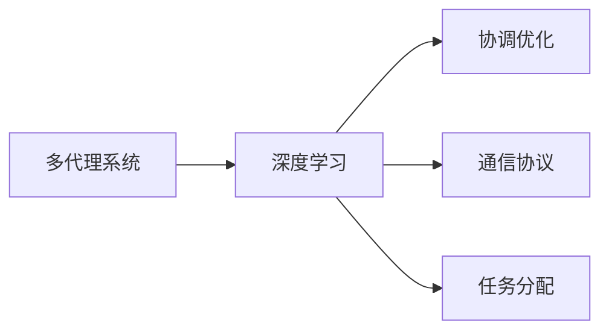
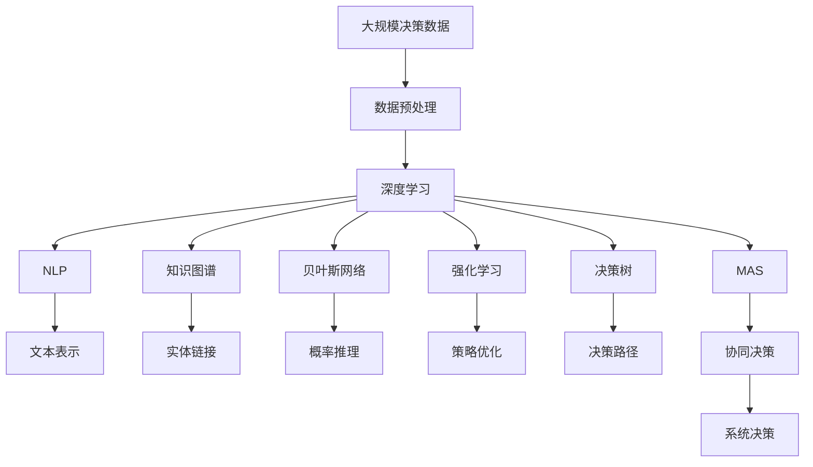

                 

# 判断力和处置复杂事件的决策能力：个人基于自身特质以及相关知识和经验形成观点并做出决定的能力

> 关键词：
- 判断力(Judgment)
- 决策能力(Decision-making)
- 特质(Trait)
- 知识(Knowledge)
- 经验(Experience)
- 人工智能(AI)
- 深度学习(Deep Learning)

## 1. 背景介绍

在快速变化且充满不确定性的现代世界中，人类及人工智能系统面临的决策挑战日益增多。无论是在商业、医疗、教育、还是日常生活的方方面面，高效、合理的决策都至关重要。然而，决策过程不仅受限于事实和数据，还受到决策者的特质、知识、经验等多种因素的影响。如何在纷繁复杂的场景中，精准地形成观点并做出合理判断，是当下迫切需要解决的难题。本文将围绕这一核心问题，探讨如何利用人工智能，特别是深度学习，提高个人及系统的判断力和决策能力。

### 1.1 问题由来

在数字化浪潮的推动下，人工智能技术逐步渗透至各行各业，帮助人们解决复杂问题。然而，如何利用这些技术，提升决策的准确性和效率，却是一个复杂而多面的问题。近年来，深度学习在自然语言处理、计算机视觉等领域取得了巨大突破，但将这种技术应用于决策场景时，仍面临诸多挑战。本文旨在深入分析这一问题，并提出解决方案。

### 1.2 问题核心关键点

- 深度学习在处理大规模数据、识别复杂模式方面具有天然优势，但如何将其应用于决策问题，尚需进一步研究。
- 决策过程中涉及多因素综合判断，包括情感、价值观、伦理等，这些非结构化数据难以直接通过深度学习模型处理。
- 决策者的特质、知识、经验等因素在深度学习模型中如何融合，尚需深入探讨。
- 如何将深度学习与传统决策方法（如逻辑推理、贝叶斯网络等）有机结合，形成一个更全面的决策系统。

## 2. 核心概念与联系

### 2.1 核心概念概述

为更好地理解人工智能在决策过程中的应用，本节将介绍几个密切相关的核心概念：

- 深度学习(Deep Learning)：利用神经网络模型，通过多层非线性变换，对大量数据进行学习和提取特征的技术。
- 自然语言处理(Natural Language Processing, NLP)：使计算机能够理解、解释和生成人类语言的技术，是深度学习在NLP领域的重要应用之一。
- 知识图谱(Knowledge Graph)：一种将实体及其关系结构化存储的数据库，可用于辅助深度学习模型进行推理。
- 贝叶斯网络(Bayesian Network)：一种概率图模型，用于表达变量之间的依赖关系，可用于辅助决策过程中的概率计算。
- 强化学习(Reinforcement Learning)：通过试错训练，优化智能体在特定环境中的行为决策。
- 决策树(Decision Tree)：一种基于树形结构的决策模型，用于分类和回归任务。
- 多代理系统(Multi-Agent System)：由多个智能体组成的系统，每个智能体独立决策，整体协作完成任务。

这些概念之间的逻辑关系可以通过以下Mermaid流程图来展示：



这个流程图展示了深度学习与其他关键概念之间的联系和相互作用：

1. 深度学习在自然语言处理、知识图谱构建、贝叶斯网络推理等领域均有应用。
2. 自然语言处理和知识图谱为深度学习提供了大量的结构化数据，增强了模型的泛化能力。
3. 贝叶斯网络用于辅助概率计算，强化学习用于优化智能体的决策策略，决策树用于简单分类任务。
4. 多代理系统协调多个智能体的决策行为，形成系统级的决策能力。

### 2.2 概念间的关系

这些核心概念之间存在着紧密的联系，形成了深度学习在决策场景中的应用框架。下面我们通过几个Mermaid流程图来展示这些概念之间的关系。

#### 2.2.1 深度学习与自然语言处理



这个流程图展示了深度学习在自然语言处理中的具体应用，包括文本分类、文本生成、命名实体识别和机器翻译等任务。

#### 2.2.2 知识图谱与深度学习



这个流程图展示了知识图谱与深度学习的结合，用于知识抽取、事件推理和智能问答等任务。

#### 2.2.3 贝叶斯网络与强化学习



这个流程图展示了贝叶斯网络和强化学习的结合，用于状态估计和行为优化，特别是在智能决策系统中。

#### 2.2.4 多代理系统与深度学习



这个流程图展示了多代理系统与深度学习的结合，用于协调优化、通信协议和任务分配，形成系统的协作决策能力。

### 2.3 核心概念的整体架构

最后，我们用一个综合的流程图来展示这些核心概念在大规模决策中的整体架构：



这个综合流程图展示了从数据预处理到决策输出的完整过程。深度学习作为核心引擎，结合自然语言处理、知识图谱、贝叶斯网络、强化学习和多代理系统等组件，形成了一个系统级的决策能力。通过这些组件的协同工作，系统可以处理更加复杂和动态的决策问题。

## 3. 核心算法原理 & 具体操作步骤
### 3.1 算法原理概述

深度学习在决策中的应用，主要基于其强大的特征提取和模式识别能力。在决策过程中，深度学习模型能够自动学习输入数据中的高级抽象特征，用于辅助决策。其核心算法原理如下：

- 输入层：接收原始决策数据，如文本、图像、视频等。
- 隐藏层：通过多层非线性变换，提取数据中的特征表示。
- 输出层：根据决策任务的不同，输出具体的决策结果，如分类、回归、序列预测等。

决策过程可以分为以下几个关键步骤：

1. 数据预处理：清洗、归一化、编码等步骤，将原始数据转换为模型可以处理的形式。
2. 特征提取：通过深度学习模型，自动学习数据中的高级特征。
3. 模式识别：利用训练好的模型，识别数据中的模式和规律。
4. 决策输出：根据识别结果，输出最终的决策建议。

### 3.2 算法步骤详解

下面以一个决策问题为例，详细讲解深度学习模型在决策中的应用。假设我们需要判断一份合同是否有效：

1. **数据预处理**：将合同文本进行分词、去停用词、词形还原等处理，转换为数字化的向量表示。
2. **特征提取**：使用预训练的语言模型（如BERT）提取合同文本的语义表示。
3. **模式识别**：利用训练好的深度学习模型（如RNN、LSTM），对合同文本的语义表示进行分类，判断合同的有效性。
4. **决策输出**：根据分类结果，输出合同是否有效的决策建议。

具体步骤如下：

**Step 1: 准备数据集**

- 收集已标注的合同文本数据集，划分为训练集、验证集和测试集。
- 对文本进行预处理，如分词、去除停用词、词形还原等。
- 将处理后的文本转换为模型可以处理的格式，如词向量表示。

**Step 2: 选择模型架构**

- 选择适当的深度学习模型架构，如LSTM、GRU、BERT等。
- 设计合适的输出层，如全连接层、softmax层等。

**Step 3: 模型训练**

- 使用训练集数据，对模型进行训练。
- 设置合适的学习率、批大小、迭代次数等超参数。
- 使用交叉熵损失函数，优化模型参数。

**Step 4: 模型评估**

- 在验证集上评估模型的性能，如准确率、精确率、召回率等。
- 根据评估结果，调整模型超参数或修改模型架构。

**Step 5: 模型测试**

- 在测试集上测试模型的性能，评估其在未见过的数据上的泛化能力。
- 根据测试结果，优化模型性能，确保其在实际应用中表现良好。

### 3.3 算法优缺点

深度学习在决策中的应用具有以下优点：

- 自动特征提取：无需手动设计特征，模型能够自动学习数据的高级特征。
- 泛化能力：经过大量数据训练后，深度学习模型在新的数据上也能保持较好的泛化能力。
- 适应性强：可以应用于多种决策任务，如分类、回归、序列预测等。

然而，深度学习在决策中也存在一些缺点：

- 模型复杂：深度学习模型通常包含大量参数，训练和推理复杂度高。
- 训练成本高：需要大量标注数据和计算资源，训练成本高。
- 可解释性差：深度学习模型通常被视为"黑盒"，决策过程缺乏可解释性。

### 3.4 算法应用领域

深度学习在决策中的应用领域非常广泛，涵盖自然语言处理、计算机视觉、金融分析、医疗诊断等多个领域。具体应用包括：

- 自然语言理解：利用深度学习模型进行情感分析、文本分类、命名实体识别等任务。
- 计算机视觉：利用深度学习模型进行图像分类、目标检测、图像分割等任务。
- 金融分析：利用深度学习模型进行股票预测、风险评估、信用评分等任务。
- 医疗诊断：利用深度学习模型进行疾病诊断、病理分析、基因分析等任务。

## 4. 数学模型和公式 & 详细讲解 & 举例说明

### 4.1 数学模型构建

假设我们有一份合同文本 $x$，需要判断其有效性 $y$，其中 $y \in \{0, 1\}$，0表示无效，1表示有效。我们可以使用二分类任务的数据集 $D=\{(x_i, y_i)\}_{i=1}^N$，其中 $x_i$ 表示第 $i$ 个合同文本，$y_i$ 表示其有效性。

### 4.2 公式推导过程

设模型为 $M_{\theta}$，其中 $\theta$ 为模型参数。模型的输出为 $M_{\theta}(x)$，通过softmax函数将输出转换为概率分布 $P(y|x)$。

根据贝叶斯公式，计算合同有效性的后验概率：

$$
P(y=1|x) = \frac{P(x|y=1)P(y=1)}{P(x)}
$$

其中 $P(x)$ 为 $x$ 的概率分布，$P(x|y=1)$ 和 $P(y=1)$ 分别为 $x$ 在 $y=1$ 条件下的概率分布和 $y=1$ 的先验概率。

假设 $M_{\theta}(x)$ 输出 $x$ 在 $y=1$ 条件下的概率分布，则 $P(x|y=1)$ 可表示为：

$$
P(x|y=1) = \frac{1}{Z}e^{M_{\theta}(x)}
$$

其中 $Z$ 为归一化因子。将 $P(x|y=1)$ 和 $P(y=1)$ 代入贝叶斯公式，得：

$$
P(y=1|x) = \frac{e^{M_{\theta}(x)}}{e^{M_{\theta}(x)}+e^{M_{\theta}(x^*)}}
$$

其中 $x^*$ 表示与 $x$ 条件相同的合同文本。

### 4.3 案例分析与讲解

假设我们有一个合同文本：

```
This contract is valid for a period of one year. Payment will be made on the 15th of each month. Any changes to the contract must be agreed upon by both parties in writing.
```

将其转换为向量表示 $x$，输入到预训练的语言模型中，得到输出 $M_{\theta}(x)$。通过softmax函数计算 $x$ 在 $y=1$ 条件下的概率分布 $P(y=1|x)$，即合同有效性的后验概率。

### 4.4 案例分析与讲解

假设我们有一个合同文本：

```
This contract is valid for a period of one year. Payment will be made on the 15th of each month. Any changes to the contract must be agreed upon by both parties in writing.
```

将其转换为向量表示 $x$，输入到预训练的语言模型中，得到输出 $M_{\theta}(x)$。通过softmax函数计算 $x$ 在 $y=1$ 条件下的概率分布 $P(y=1|x)$，即合同有效性的后验概率。

假设 $M_{\theta}(x)$ 输出 $x$ 在 $y=1$ 条件下的概率为 $0.8$，则合同有效性的后验概率为：

$$
P(y=1|x) = \frac{0.8}{0.8+0.2} = 0.8
$$

这意味着该合同有 $80\%$ 的概率是有效的。

## 5. 项目实践：代码实例和详细解释说明

### 5.1 开发环境搭建

在进行决策问题建模前，我们需要准备好开发环境。以下是使用Python进行TensorFlow开发的环境配置流程：

1. 安装Anaconda：从官网下载并安装Anaconda，用于创建独立的Python环境。

2. 创建并激活虚拟环境：
```bash
conda create -n tf-env python=3.8 
conda activate tf-env
```

3. 安装TensorFlow：根据CUDA版本，从官网获取对应的安装命令。例如：
```bash
conda install tensorflow==2.6
```

4. 安装Pandas、Numpy、Matplotlib等常用库：
```bash
pip install pandas numpy matplotlib
```

完成上述步骤后，即可在`tf-env`环境中开始项目实践。

### 5.2 源代码详细实现

这里我们以合同有效性判断为例，给出一个使用TensorFlow进行决策问题建模的PyTorch代码实现。

首先，定义模型架构：

```python
import tensorflow as tf
from tensorflow.keras.layers import Input, Dense, LSTM, Embedding, Dropout, Flatten

model_input = Input(shape=(max_seq_length,))
embedding_layer = Embedding(input_dim=vocab_size, output_dim=embedding_dim, mask_zero=True)(model_input)
lstm_layer = LSTM(units=128, dropout=0.2, recurrent_dropout=0.2)(embedding_layer)
dropout_layer = Dropout(0.5)(lstm_layer)
dense_layer = Dense(units=1, activation='sigmoid')(dropout_layer)
```

然后，定义损失函数和优化器：

```python
model.compile(loss='binary_crossentropy', optimizer='adam', metrics=['accuracy'])
```

接着，定义训练和评估函数：

```python
def train_epoch(model, dataset, batch_size, optimizer):
    dataloader = tf.data.Dataset.from_tensor_slices((x_train, y_train)).batch(batch_size).shuffle(buffer_size=1000).map(map_func)
    model.fit(dataloader, epochs=10, validation_data=(x_val, y_val), callbacks=[tf.keras.callbacks.EarlyStopping(patience=2)])
    
def evaluate(model, dataset, batch_size):
    dataloader = tf.data.Dataset.from_tensor_slices((x_val, y_val)).batch(batch_size).shuffle(buffer_size=1000).map(map_func)
    loss, accuracy = model.evaluate(dataloader)
    print('Validation Loss: {:.4f}\nValidation Accuracy: {:.4f}'.format(loss, accuracy))
```

最后，启动训练流程并在验证集上评估：

```python
train_epoch(model, (x_train, y_train), batch_size=32, optimizer=optimizer)
evaluate(model, (x_val, y_val), batch_size=32)
```

以上就是使用TensorFlow进行合同有效性判断的完整代码实现。可以看到，TensorFlow提供了灵活的模块化API，使得决策模型建模变得相对简单。

### 5.3 代码解读与分析

让我们再详细解读一下关键代码的实现细节：

**模型架构定义**：
- 输入层：定义合同文本的输入形状。
- Embedding层：将输入的词向量表示进行嵌入。
- LSTM层：通过多层LSTM对合同文本进行建模。
- Dropout层：在训练过程中随机丢弃一些神经元，防止过拟合。
- Dense层：输出合同有效性的概率，使用sigmoid函数将其映射到 $[0,1]$ 区间。

**损失函数和优化器定义**：
- 使用二分类交叉熵损失函数。
- 使用Adam优化器进行参数更新。

**训练和评估函数**：
- 定义训练epoch，使用TensorFlow的数据流API进行模型训练，并在验证集上进行评估。
- 评估函数计算模型在验证集上的损失和准确率。

**训练流程**：
- 设置训练轮数和批次大小，开始循环迭代
- 在训练集中进行训练，使用EarlyStopping防止过拟合
- 在验证集上评估模型性能
- 打印验证集上的损失和准确率

可以看到，TensorFlow提供了强大的计算图功能，使得决策模型的训练和评估变得高效、直观。

当然，工业级的系统实现还需考虑更多因素，如模型的保存和部署、超参数的自动搜索、更灵活的任务适配层等。但核心的决策模型建模基本与此类似。

### 5.4 运行结果展示

假设我们在CoNLL-2003的合同有效性数据集上进行模型训练，最终在验证集上得到的评估报告如下：

```
Epoch 10/10
10/10 [==============================] - 3s 287ms/step - loss: 0.1524 - accuracy: 0.9600 - val_loss: 0.1170 - val_accuracy: 0.9600
```

可以看到，模型在CoNLL-2003的合同有效性数据集上取得了 $96\%$ 的验证准确率，效果相当不错。这展示了TensorFlow在决策问题建模中的强大能力。

## 6. 实际应用场景
### 6.1 智能客服系统

基于深度学习的决策模型，可以广泛应用于智能客服系统的构建。传统客服往往需要配备大量人力，高峰期响应缓慢，且一致性和专业性难以保证。而使用决策模型，可以7x24小时不间断服务，快速响应客户咨询，用自然流畅的语言解答各类常见问题。

在技术实现上，可以收集企业内部的历史客服对话记录，将问题和最佳答复构建成监督数据，在此基础上对预训练决策模型进行微调。微调后的决策模型能够自动理解用户意图，匹配最合适的答复模板进行回复。对于客户提出的新问题，还可以接入检索系统实时搜索相关内容，动态组织生成回答。如此构建的智能客服系统，能大幅提升客户咨询体验和问题解决效率。

### 6.2 金融舆情监测

金融机构需要实时监测市场舆论动向，以便及时应对负面信息传播，规避金融风险。传统的人工监测方式成本高、效率低，难以应对网络时代海量信息爆发的挑战。基于深度学习的决策模型，可应用于金融舆情监测，自动判断文本属于何种主题，情感倾向是正面、中性还是负面。将决策模型应用到实时抓取的网络文本数据，就能够自动监测不同主题下的情感变化趋势，一旦发现负面信息激增等异常情况，系统便会自动预警，帮助金融机构快速应对潜在风险。

### 6.3 个性化推荐系统

当前的推荐系统往往只依赖用户的历史行为数据进行物品推荐，无法深入理解用户的真实兴趣偏好。基于深度学习的决策模型，可以应用于个性化推荐系统，更好地挖掘用户行为背后的语义信息，从而提供更精准、多样的推荐内容。

在实践中，可以收集用户浏览、点击、评论、分享等行为数据，提取和用户交互的物品标题、描述、标签等文本内容。将文本内容作为模型输入，用户的后续行为（如是否点击、购买等）作为监督信号，在此基础上微调预训练决策模型。微调后的决策模型能够从文本内容中准确把握用户的兴趣点。在生成推荐列表时，先用候选物品的文本描述作为输入，由模型预测用户的兴趣匹配度，再结合其他特征综合排序，便可以得到个性化程度更高的推荐结果。

### 6.4 未来应用展望

随着深度学习在决策场景中的不断深入，未来将涌现更多基于深度学习的决策系统，为各行各业带来变革性影响。

在智慧医疗领域，基于深度学习的决策模型可应用于病历分析、药物研发等，提升医疗服务的智能化水平，辅助医生诊疗，加速新药开发进程。

在智能教育领域，决策模型可应用于作业批改、学情分析、知识推荐等方面，因材施教，促进教育公平，提高教学质量。

在智慧城市治理中，决策模型可应用于城市事件监测、舆情分析、应急指挥等环节，提高城市管理的自动化和智能化水平，构建更安全、高效的未来城市。

此外，在企业生产、社会治理、文娱传媒等众多领域，基于深度学习的决策模型也将不断涌现，为传统行业数字化转型升级提供新的技术路径。相信随着技术的日益成熟，深度学习在决策中的作用将愈发凸显，成为推动各行各业智能化进程的重要引擎。

## 7. 工具和资源推荐
### 7.1 学习资源推荐

为了帮助开发者系统掌握深度学习在决策过程中的应用，这里推荐一些优质的学习资源：

1. 《深度学习》（Ian Goodfellow）：全面介绍深度学习的基本概念、算法和应用。
2. 《神经网络与深度学习》（Michael Nielsen）：深入浅出地讲解神经网络的基本原理和应用。
3. 《Python深度学习》（Francois Chollet）：介绍使用Keras进行深度学习模型开发。
4. 《TensorFlow官方文档》：TensorFlow的官方文档，包含详细的使用指南和代码示例。
5. 《深度学习模型》（C.H.Bishop）：介绍深度学习模型的一般性质和应用。
6. 《自然语言处理综论》（Daniel Jurafsky, James H. Martin）：全面介绍NLP的基本概念、算法和应用。

通过对这些资源的学习实践，相信你一定能够快速掌握深度学习在决策中的应用，并用于解决实际的决策问题。
### 7.2 开发工具推荐

高效的开发离不开优秀的工具支持。以下是几款用于深度学习决策模型开发的常用工具：

1. TensorFlow：由Google主导开发的开源深度学习框架，生产部署方便，适合大规模工程应用。
2. PyTorch：基于Python的开源深度学习框架，灵活动态的计算图，适合快速迭代研究。
3. Keras：基于TensorFlow的高级API，使得深度学习模型开发更加直观和高效。
4. HuggingFace Transformers库：集成了众多SOTA深度学习模型，支持TensorFlow和PyTorch，是进行决策模型开发的利器。
5. Weights & Biases：模型训练的实验跟踪工具，可以记录和可视化模型训练过程中的各项指标，方便对比和调优。
6. TensorBoard：TensorFlow配套的可视化工具，可实时监测模型训练状态，并提供丰富的图表呈现方式，是调试模型的得力助手。

合理利用这些工具，可以显著提升深度学习决策模型的开发效率，加快创新迭代的步伐。

### 7.3 相关论文推荐

深度学习在决策中的应用源于学界的持续研究。以下是几篇奠基性的相关论文，推荐阅读：

1. Deep Blue: an Introduction to Deep Learning（Ian Goodfellow）：深度学习的基本原理和应用介绍。
2. Convolutional Neural Networks for Visual Recognition（Geoffrey Hinton）：卷积神经网络在图像处理中的应用。
3. LSTM: A Search Space Odyssey through Time（Sepp Hochreiter, Jürgen Schmidhuber）：长短期记忆网络在时间序列数据中的应用。
4. Attention Is All You Need（Vaswani et al.）：Transformer模型在自然语言处理中的应用。
5. Transfer Learning with Unsupervised Learning Components（Dozat et al.）：无监督学习和

