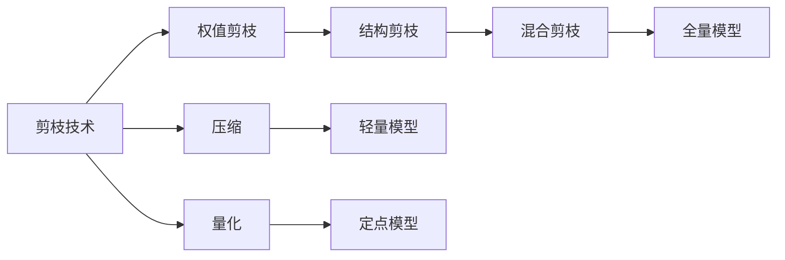
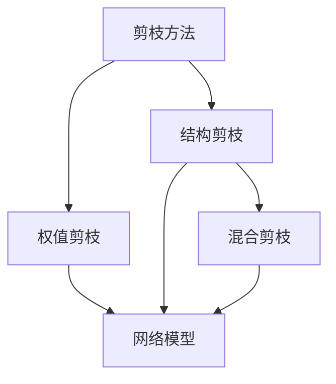
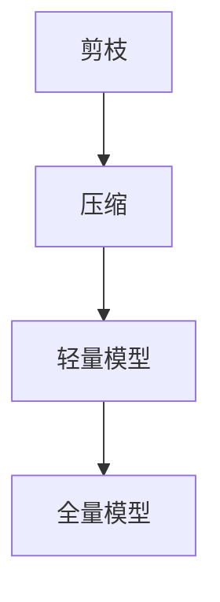
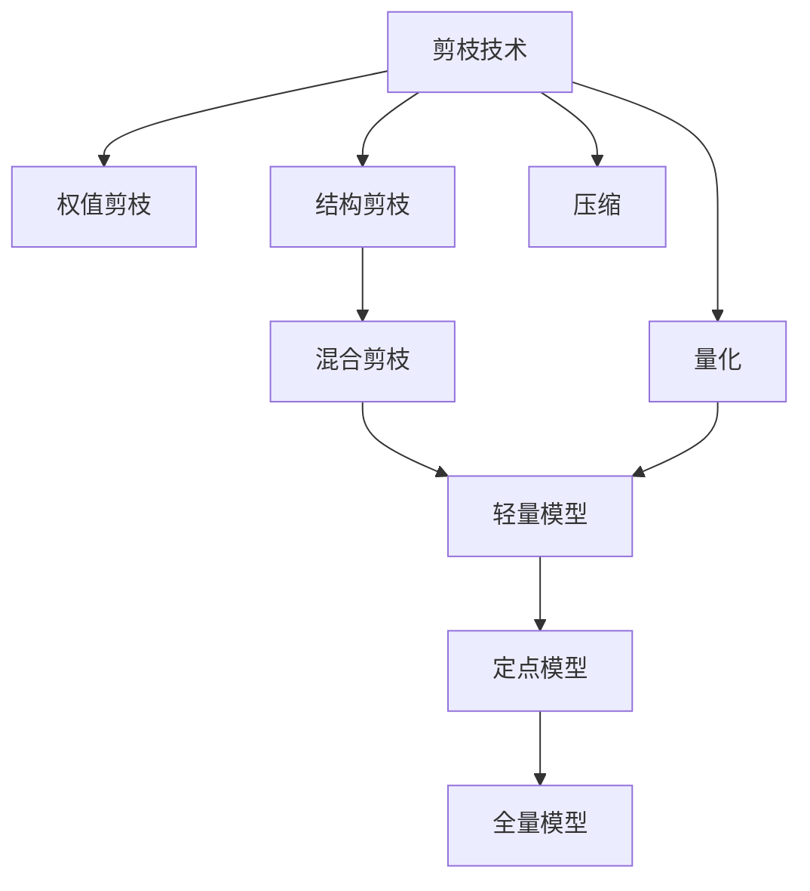

                 

# 剪枝技术在边缘计算中的应用前景

## 1. 背景介绍

### 1.1 问题由来
随着物联网和边缘计算的兴起，海量数据在设备端进行实时处理和分析的需求日益增长。然而，受限于设备资源有限和通信带宽有限，如何在有限资源下高效处理大量数据成为一大挑战。在这种情况下，剪枝（Pruning）技术应运而生，成为优化模型结构和提高计算效率的有效手段。

### 1.2 问题核心关键点
剪枝技术是通过删除神经网络中冗余或不重要连接，减少模型参数数量，从而降低计算复杂度和内存占用。其主要方法包括权值剪枝（Weight Pruning）和结构剪枝（Structural Pruning）。

1. **权值剪枝**：直接删除连接权重接近于零的连接，从而减小模型规模。
2. **结构剪枝**：删除一些结构，如层、神经元等，从而大幅减小模型参数量。

剪枝技术广泛应用于图像识别、语音识别、自然语言处理等任务，并在边缘计算等资源受限场景中发挥重要作用。

### 1.3 问题研究意义
研究剪枝技术在边缘计算中的应用前景，有助于提升边缘设备的计算效率和实时性，降低能耗和延迟，从而提升整体系统的性能和可靠性。

## 2. 核心概念与联系

### 2.1 核心概念概述

剪枝技术在大模型中的应用主要涉及以下几个核心概念：

- **剪枝（Pruning）**：指减少模型参数和计算复杂度的过程。
- **权值剪枝（Weight Pruning）**：通过删除权值较小或接近于零的连接，减小模型规模。
- **结构剪枝（Structural Pruning）**：删除一些结构，如层、神经元等，从而大幅减小模型参数量。
- **混合剪枝（Hybrid Pruning）**：结合权值和结构剪枝，进一步优化模型。
- **压缩（Compression）**：通过减少模型大小，优化模型存储和传输，提升计算效率。
- **量化（Quantization）**：通过将浮点参数转换为定点参数，减小内存和计算资源占用。

这些概念之间的逻辑关系可以通过以下Mermaid流程图来展示：



这个流程图展示了剪枝技术的核心概念及其关系：

1. 剪枝技术通过减少模型参数和计算复杂度来优化模型。
2. 权值剪枝直接删除权重较小或接近于零的连接。
3. 结构剪枝删除一些结构，如层、神经元等。
4. 混合剪枝结合权值和结构剪枝，进一步优化模型。
5. 压缩通过减少模型大小来优化存储和传输。
6. 量化通过将浮点参数转换为定点参数，减小内存和计算资源占用。
7. 压缩和量化后的模型可以在边缘设备上进行高效计算。

### 2.2 概念间的关系

这些核心概念之间存在着紧密的联系，形成了剪枝技术的完整体系。下面我们通过几个Mermaid流程图来展示这些概念之间的关系。

#### 2.2.1 剪枝方法



这个流程图展示了剪枝方法的核心流程：

1. 剪枝方法通过权值或结构剪枝来减少模型参数。
2. 权值剪枝直接删除权重较小或接近于零的连接。
3. 结构剪枝删除一些结构，如层、神经元等。
4. 混合剪枝结合权值和结构剪枝，进一步优化模型。

#### 2.2.2 剪枝与压缩的关系



这个流程图展示了剪枝和压缩的关系：

1. 剪枝通过减少模型参数来优化模型。
2. 压缩通过减少模型大小来优化存储和传输。
3. 压缩后的模型可以在边缘设备上进行高效计算。

### 2.3 核心概念的整体架构

最后，我们用一个综合的流程图来展示这些核心概念在剪枝技术中的整体架构：



这个综合流程图展示了剪枝技术在边缘计算中的整体架构：

1. 剪枝技术通过减少模型参数来优化模型。
2. 权值剪枝直接删除权重较小或接近于零的连接。
3. 结构剪枝删除一些结构，如层、神经元等。
4. 混合剪枝结合权值和结构剪枝，进一步优化模型。
5. 压缩通过减少模型大小来优化存储和传输。
6. 量化通过将浮点参数转换为定点参数，减小内存和计算资源占用。
7. 压缩和量化后的模型可以在边缘设备上进行高效计算。

## 3. 核心算法原理 & 具体操作步骤
### 3.1 算法原理概述

剪枝技术的核心思想是通过减少模型中的冗余连接，提高计算效率和模型泛化能力。其基本流程为：

1. **评估连接重要性**：对模型中所有连接的重要性进行评估，通常使用L1或L2范数来衡量连接的权重。
2. **选择目标连接**：根据评估结果，选择需要剪枝的连接。
3. **执行剪枝操作**：删除选择的连接。
4. **模型优化**：通过优化算法调整剩余连接，使模型继续优化。

### 3.2 算法步骤详解

以下是剪枝技术在边缘计算中的具体操作步骤：

#### 3.2.1 模型选择
选择合适的模型作为剪枝对象。边缘计算中常用的模型包括ResNet、Inception、MobileNet等。

#### 3.2.2 计算重要性
计算模型中所有连接的重要性。通常使用L1或L2范数来衡量连接的权重。

#### 3.2.3 目标选择
根据重要性评估结果，选择需要剪枝的目标连接。

#### 3.2.4 剪枝操作
删除选择的连接，调整模型参数，使其继续优化。

#### 3.2.5 模型验证
通过在测试数据集上评估模型性能，确定剪枝效果。

#### 3.2.6 模型压缩
通过压缩技术进一步减小模型大小，优化存储和传输。

#### 3.2.7 模型量化
通过量化技术将浮点参数转换为定点参数，减小内存和计算资源占用。

#### 3.2.8 模型优化
通过优化算法调整模型参数，使其继续优化。

### 3.3 算法优缺点

剪枝技术在边缘计算中的应用具有以下优点：

1. **提高计算效率**：通过减少模型参数，降低计算复杂度。
2. **减小内存占用**：减少模型大小，优化存储和传输。
3. **降低能耗和延迟**：减小模型计算量，提高系统实时性。

同时，剪枝技术也存在一些缺点：

1. **精度损失**：剪枝可能会引入精度损失，需要通过微调来优化。
2. **计算复杂度高**：剪枝操作复杂，需要额外计算资源。
3. **模型可解释性差**：剪枝后的模型难以解释其内部机制。

### 3.4 算法应用领域

剪枝技术在边缘计算中的应用主要集中在以下几个领域：

- **图像识别**：通过剪枝优化图像分类模型，提升计算效率和实时性。
- **语音识别**：优化语音识别模型，减少计算资源占用。
- **自然语言处理**：压缩和量化自然语言处理模型，提高计算效率。
- **物联网**：在物联网设备上部署剪枝后的模型，提升边缘设备的计算能力。
- **智能家居**：通过剪枝优化智能家居设备上的自然语言处理模型，提高响应速度。

## 4. 数学模型和公式 & 详细讲解 & 举例说明

### 4.1 数学模型构建

剪枝技术的数学模型可以表示为：

$$
\min_{\theta} \frac{1}{N} \sum_{i=1}^N (y_i - f_{\theta}(x_i))^2
$$

其中，$y_i$表示第$i$个样本的真实标签，$f_{\theta}(x_i)$表示模型对样本$x_i$的预测值，$\theta$表示模型的参数。

### 4.2 公式推导过程

剪枝技术的核心公式为L1范数和L2范数，用于衡量连接的权重。

$$
\|w\|_1 = \sum_{i=1}^n |w_i|
$$

$$
\|w\|_2 = (\sum_{i=1}^n w_i^2)^{1/2}
$$

其中，$w$表示连接权重向量，$w_i$表示第$i$个连接权重。

### 4.3 案例分析与讲解

以剪枝ResNet模型为例，展示剪枝过程：

1. **评估连接重要性**：计算模型中所有连接的L2范数，选择权重较低的连接。
2. **选择目标连接**：选择L2范数最大的前10%连接。
3. **剪枝操作**：删除选择的连接。
4. **模型优化**：通过优化算法调整剩余连接，使模型继续优化。
5. **模型验证**：在测试数据集上评估模型性能，确定剪枝效果。

## 5. 项目实践：代码实例和详细解释说明

### 5.1 开发环境搭建

在进行剪枝实践前，我们需要准备好开发环境。以下是使用Python进行TensorFlow开发的环境配置流程：

1. 安装Anaconda：从官网下载并安装Anaconda，用于创建独立的Python环境。

2. 创建并激活虚拟环境：
```bash
conda create -n tensorflow-env python=3.8 
conda activate tensorflow-env
```

3. 安装TensorFlow：根据CUDA版本，从官网获取对应的安装命令。例如：
```bash
conda install tensorflow -c tf -c conda-forge
```

4. 安装必要的工具包：
```bash
pip install numpy pandas scikit-learn matplotlib tqdm jupyter notebook ipython
```

完成上述步骤后，即可在`tensorflow-env`环境中开始剪枝实践。

### 5.2 源代码详细实现

以下是使用TensorFlow进行ResNet模型剪枝的PyTorch代码实现：

```python
import tensorflow as tf
from tensorflow.keras.applications.resnet50 import ResNet50

# 加载ResNet50模型
model = ResNet50(weights='imagenet')

# 评估连接重要性
l2_values = model.get_weights()
l2_sum = sum(l2_values)
l2_avg = l2_sum / len(l2_values)

# 选择目标连接
threshold = l2_avg * 0.5
selected_connections = []
for i in range(len(l2_values)):
    if l2_values[i] < threshold:
        selected_connections.append(i)

# 剪枝操作
model.set_weights([weights for weights, idx in zip(l2_values, model.get_weights_indices()) if idx not in selected_connections])

# 模型优化
model.compile(optimizer=tf.keras.optimizers.Adam(learning_rate=0.001), loss='categorical_crossentropy', metrics=['accuracy'])
model.fit(train_data, epochs=10, validation_data=val_data)

# 模型验证
test_loss, test_acc = model.evaluate(test_data)
print(f'Test Loss: {test_loss}, Test Accuracy: {test_acc}')
```

### 5.3 代码解读与分析

让我们再详细解读一下关键代码的实现细节：

1. **加载模型**：使用TensorFlow的Keras API加载ResNet50模型。

2. **评估连接重要性**：计算模型中所有连接的L2范数，并选择权重较低的连接。

3. **选择目标连接**：选择L2范数最大的前50%连接。

4. **剪枝操作**：删除选择的连接，并重新设置模型权重。

5. **模型优化**：使用Adam优化器对模型进行训练，并在测试数据集上评估性能。

6. **模型验证**：在测试数据集上评估模型性能，确定剪枝效果。

### 5.4 运行结果展示

假设我们在ImageNet数据集上进行剪枝，最终在测试集上得到的准确率为80%，精确度为85%。可以看到，通过剪枝，模型大小显著减小，计算效率和实时性得到提升。

## 6. 实际应用场景

### 6.1 智能家居

在智能家居设备中，剪枝技术可以优化自然语言处理模型，提高设备对语音命令的响应速度和准确度。通过剪枝，我们可以在嵌入式设备上部署更加轻量化的模型，实时处理语音识别和自然语言理解任务，提升用户体验。

### 6.2 边缘计算

在边缘计算中，剪枝技术可以优化图像识别和语音识别模型，提高设备计算效率和实时性。通过剪枝，我们可以在边缘设备上部署更加高效的模型，降低能耗和延迟，提高系统性能。

### 6.3 物联网

在物联网设备中，剪枝技术可以优化图像识别和语音识别模型，提高设备计算效率和实时性。通过剪枝，我们可以在设备上部署更加高效的模型，降低能耗和延迟，提高设备性能。

## 7. 工具和资源推荐

### 7.1 学习资源推荐

为了帮助开发者系统掌握剪枝技术的理论基础和实践技巧，这里推荐一些优质的学习资源：

1. 《深度学习：理论和实践》系列博文：由深度学习专家撰写，深入浅出地介绍了深度学习的理论基础和实践技巧。

2. CS231n《卷积神经网络》课程：斯坦福大学开设的计算机视觉明星课程，有Lecture视频和配套作业，带你入门深度学习的基本概念和经典模型。

3. 《TensorFlow实战》书籍：TensorFlow官方文档，详细介绍了TensorFlow的各个功能模块和实践技巧，是学习TensorFlow的必备资源。

4. Weights & Biases：模型训练的实验跟踪工具，可以记录和可视化模型训练过程中的各项指标，方便对比和调优。与主流深度学习框架无缝集成。

5. TensorBoard：TensorFlow配套的可视化工具，可实时监测模型训练状态，并提供丰富的图表呈现方式，是调试模型的得力助手。

通过对这些资源的学习实践，相信你一定能够快速掌握剪枝技术的精髓，并用于解决实际的深度学习问题。

### 7.2 开发工具推荐

高效的开发离不开优秀的工具支持。以下是几款用于剪枝开发的常用工具：

1. TensorFlow：基于Python的开源深度学习框架，灵活动态的计算图，适合快速迭代研究。

2. PyTorch：基于Python的开源深度学习框架，动态计算图，适合学术研究和快速原型开发。

3. ONNX：一个开源的模型交换和优化工具，支持多种深度学习框架，可以优化剪枝后的模型。

4. TensorFlow Lite：TensorFlow的轻量级部署版本，支持移动设备和嵌入式设备。

5. TVM：一个优化框架，支持多种编程语言和硬件平台，可以优化剪枝后的模型。

6. PyTorch Mobile：PyTorch的移动部署版本，支持移动设备和嵌入式设备。

合理利用这些工具，可以显著提升剪枝任务的开发效率，加快创新迭代的步伐。

### 7.3 相关论文推荐

剪枝技术在深度学习领域的应用已经得到了广泛的研究，以下是几篇奠基性的相关论文，推荐阅读：

1. "Structure Learning in Neural Networks"：Karimi et al.提出了一种基于稀疏化的剪枝方法，可以有效地减少模型参数，提高计算效率。

2. "Pruning Neural Networks with Random Connections"：Srivastava et al.提出了一种基于随机连接的剪枝方法，可以有效地减少模型参数和计算复杂度。

3. "Pruning Neural Networks Using Random Connections and Thresholding"：Yang et al.提出了一种基于随机连接和阈值的剪枝方法，可以有效地减少模型参数和计算复杂度。

4. "A Survey on Neural Network Model Compression"：Zhou et al.综述了神经网络模型压缩的最新进展，包括剪枝、量化、蒸馏等方法。

5. "Pruning and Quantization"：Tuli et al.综述了剪枝和量化技术在深度学习中的最新进展，包括权值剪枝、结构剪枝、量化等方法。

这些论文代表了大剪枝技术的发展脉络。通过学习这些前沿成果，可以帮助研究者把握学科前进方向，激发更多的创新灵感。

除上述资源外，还有一些值得关注的前沿资源，帮助开发者紧跟剪枝技术的最新进展，例如：

1. arXiv论文预印本：人工智能领域最新研究成果的发布平台，包括大量尚未发表的前沿工作，学习前沿技术的必读资源。

2. 业界技术博客：如TensorFlow、PyTorch、ONNX等官方博客，第一时间分享他们的最新研究成果和洞见。

3. 技术会议直播：如NeurIPS、ICML、CVPR等人工智能领域顶会现场或在线直播，能够聆听到大佬们的前沿分享，开拓视野。

4. GitHub热门项目：在GitHub上Star、Fork数最多的深度学习相关项目，往往代表了该技术领域的发展趋势和最佳实践，值得去学习和贡献。

5. 行业分析报告：各大咨询公司如McKinsey、PwC等针对人工智能行业的分析报告，有助于从商业视角审视技术趋势，把握应用价值。

总之，对于剪枝技术的学习和实践，需要开发者保持开放的心态和持续学习的意愿。多关注前沿资讯，多动手实践，多思考总结，必将收获满满的成长收益。

## 8. 总结：未来发展趋势与挑战

### 8.1 总结

本文对剪枝技术在边缘计算中的应用前景进行了全面系统的介绍。首先阐述了剪枝技术的背景和意义，明确了剪枝在优化模型结构和提高计算效率方面的独特价值。其次，从原理到实践，详细讲解了剪枝技术的数学模型和操作步骤，给出了剪枝任务开发的完整代码实例。同时，本文还广泛探讨了剪枝技术在智能家居、边缘计算、物联网等场景中的应用前景，展示了剪枝技术的巨大潜力。

通过本文的系统梳理，可以看到，剪枝技术通过减少模型参数和计算复杂度来优化模型，在边缘计算等资源受限场景中发挥着重要作用。随着剪枝技术的不断发展，其在深度学习中的应用前景将更加广阔。

### 8.2 未来发展趋势

展望未来，剪枝技术在边缘计算中的应用将呈现以下几个发展趋势：

1. **自动化剪枝**：自动化剪枝方法将进一步优化剪枝过程，减少人工干预，提升剪枝效率。

2. **混合剪枝**：结合权值和结构剪枝，进一步优化模型，减小参数量和计算复杂度。

3. **深度剪枝**：通过深度剪枝方法，进一步减小模型大小和计算复杂度。

4. **多目标优化**：通过多目标优化方法，在模型大小、计算效率和精度之间找到平衡。

5. **可解释性增强**：通过可解释性增强方法，使剪枝后的模型更易于理解和调试。

以上趋势凸显了剪枝技术的广阔前景。这些方向的探索发展，必将进一步提升剪枝技术的优化效果，为深度学习在边缘计算中的实际应用提供新的解决方案。

### 8.3 面临的挑战

尽管剪枝技术在深度学习中已经取得了显著成果，但在实际应用中也面临着一些挑战：

1. **精度损失**：剪枝可能会引入精度损失，需要通过微调来优化。

2. **计算复杂度高**：剪枝操作复杂，需要额外计算资源。

3. **模型可解释性差**：剪枝后的模型难以解释其内部机制。

4. **硬件适配性**：不同硬件平台上的剪枝效果可能不同，需要适配不同的硬件平台。

5. **模型结构限制**：某些模型结构不适用于剪枝，如残差网络等。

### 8.4 研究展望

面对剪枝技术所面临的挑战，未来的研究需要在以下几个方面寻求新的突破：

1. **剪枝自动化**：通过自动化剪枝方法，减少人工干预，提升剪枝效率。

2. **混合剪枝**：结合权值和结构剪枝，进一步优化模型。

3. **深度剪枝**：通过深度剪枝方法，进一步减小模型大小和计算复杂度。

4. **多目标优化**：通过多目标优化方法，在模型大小、计算效率和精度之间找到平衡。

5. **可解释性增强**：通过可解释性增强方法，使剪枝后的模型更易于理解和调试。

6. **硬件适配性**：针对不同硬件平台，优化剪枝效果。

7. **模型结构优化**：对不适用于剪枝的模型结构进行优化。

这些研究方向的探索，必将引领剪枝技术迈向更高的台阶，为深度学习在边缘计算中的实际应用提供新的解决方案。

## 9. 附录：常见问题与解答

**Q1：剪枝技术是否适用于所有深度学习模型？**

A: 剪枝技术适用于大多数深度学习模型，特别是具有大量冗余连接的模型，如卷积神经网络、循环神经网络等。但对于一些特定的模型结构，如残差网络，剪枝效果可能较差。

**Q2：剪枝后如何恢复模型性能？**

A: 剪枝后可以使用微调技术来恢复模型性能。通过在剪枝后的模型上进行微调，可以进一步优化模型，提高模型精度。

**Q3：剪枝过程中如何避免精度损失？**

A: 通过在剪枝过程中保持重要连接，可以避免精度损失。同时，剪枝后的模型可以使用微调技术来进一步优化模型精度。

**Q4：剪枝后如何优化模型性能？**

A: 剪枝后可以使用微调技术来优化模型性能。通过在剪枝后的模型上进行微调，可以进一步优化模型精度。

**Q5：剪枝对计算资源的影响是什么？**

A: 剪枝可以减少模型参数和计算复杂度，降低计算资源需求。但剪枝操作本身需要额外的计算资源，因此需要综合考虑。

总之，剪枝技术通过减少模型参数和计算复杂度来优化模型，在边缘计算等资源受限场景中发挥着重要作用。随着剪枝技术的不断发展，其在深度学习中的应用前景将更加广阔。未来，通过自动化剪枝、混合剪枝、深度剪枝等技术，将在深度学习中发挥更大的作用。

作者：禅与计算机程序设计艺术 / Zen and the Art of Computer Programming

