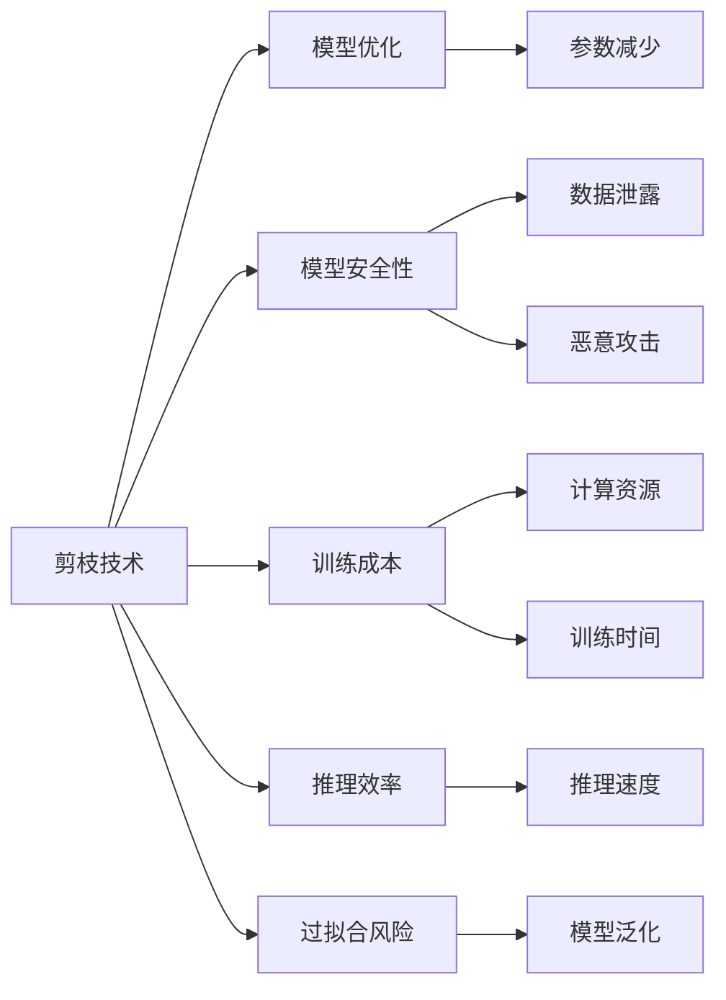

                 

# 剪枝技术对模型安全性的影响分析

> 关键词：剪枝技术,模型安全性,模型优化,训练成本,推理效率,过拟合风险

## 1. 背景介绍

随着深度学习技术的快速发展，大规模神经网络模型的应用范围越来越广泛，从图像识别到自然语言处理，再到语音识别，均展现出显著的性能优势。然而，这种大规模模型也带来了新的挑战，特别是在模型训练和推理过程中的高资源消耗、高计算成本以及模型复杂性带来的安全风险。在这样的背景下，剪枝（Pruning）技术应运而生，旨在通过减少模型中的非重要参数，达到优化模型、降低计算成本、提升推理效率等目的。

剪枝技术最早起源于机器学习领域，主要是为了减少模型中冗余参数，提高模型泛化能力和运行效率。随着深度学习的发展，剪枝技术开始被应用到深度神经网络中，成为提升模型性能、降低模型复杂度的重要手段。然而，尽管剪枝技术在模型压缩和优化方面表现出色，但其对模型安全性的影响尚未得到充分的探讨和评估。本研究将从多个角度深入分析剪枝技术对模型安全性的影响，为深度学习模型的安全性和优化提供更为全面的指导。

## 2. 核心概念与联系

### 2.1 核心概念概述

为更好地理解剪枝技术对模型安全性的影响，本节将介绍几个密切相关的核心概念：

- **剪枝技术**：一种用于优化深度神经网络的参数减少方法，通过移除模型中某些不重要的参数，达到减少计算量、提升推理效率的目的。
- **模型安全性**：指模型在面对恶意攻击、数据泄露、模型逆向分析等安全威胁时，能够保持关键信息的安全性和模型的稳定性和可靠性。
- **模型优化**：指通过调整模型的结构和参数，提高模型的准确性、效率和鲁棒性，通常包括剪枝、量化、蒸馏等技术。
- **训练成本**：指模型训练过程中所需的计算资源、时间和成本，包括硬件资源、训练时间、数据成本等。
- **推理效率**：指模型在推理过程中，计算的速度和资源消耗，影响模型的实时性和部署灵活性。
- **过拟合风险**：指模型在训练数据上表现良好，但在新数据上表现不佳的风险，通常由模型复杂度过高导致。

这些核心概念之间的逻辑关系可以通过以下Mermaid流程图来展示：



这个流程图展示了下游任务中，剪枝技术对模型安全性、训练成本、推理效率、过拟合风险的影响，以及其与模型优化之间的联系。

### 2.2 概念间的关系

这些核心概念之间存在着紧密的联系，形成了剪枝技术在模型优化中的应用框架。

- 剪枝技术通过参数减少来优化模型，减少计算资源消耗，降低训练时间和成本。
- 模型优化旨在提升模型的准确性、效率和鲁棒性，剪枝技术作为其中的一个手段，帮助模型实现更加紧凑、高效的架构。
- 模型安全性涉及模型的数据泄露、恶意攻击风险，剪枝技术通过减少模型复杂性，降低这些风险的发生概率。
- 推理效率与模型的计算复杂度紧密相关，剪枝技术通过减少参数和计算量，提升推理速度，提高模型的实时性和灵活性。
- 过拟合风险与模型复杂度直接相关，剪枝技术通过减少模型参数，降低过拟合风险，提升模型的泛化能力。

这些概念共同构成了剪枝技术在模型优化和安全性保障中的完整生态系统，其应用场景将随着深度学习的发展而不断拓展。

## 3. 核心算法原理 & 具体操作步骤

### 3.1 算法原理概述

剪枝技术的核心原理在于通过优化模型参数，减少模型中的冗余信息，提高模型的计算效率和鲁棒性。具体而言，剪枝过程分为预剪枝（Pre-pruning）和后剪枝（Post-pruning）两个阶段。

- **预剪枝**：在模型训练前，根据某些规则或标准（如参数绝对值大小、梯度变化等）筛选掉非重要参数，减少模型规模。
- **后剪枝**：在模型训练后，根据特定条件（如预测性能、模型结构等）选择性地删除部分参数，进一步优化模型。

剪枝过程中，一般需要评估模型在不同条件下的性能，确保剪枝后模型的性能不会显著下降。常用的评估指标包括模型准确度、计算资源消耗、推理速度等。

### 3.2 算法步骤详解

剪枝技术的实现可以分为以下几个关键步骤：

**Step 1: 数据预处理**
- 准备训练集和验证集，对数据进行标准化、归一化等预处理操作，确保数据一致性。

**Step 2: 初始化模型**
- 根据任务需求选择合适的预训练模型，并对其进行初始化。

**Step 3: 预剪枝**
- 根据预设的剪枝规则，计算每个参数的重要性得分，例如基于梯度变化、权重大小等指标。
- 筛选掉得分低于预设阈值的参数，生成预剪枝后的模型。

**Step 4: 模型训练**
- 使用预剪枝后的模型进行训练，优化模型参数。

**Step 5: 后剪枝**
- 根据验证集上的性能指标，选择性地删除部分参数，进一步优化模型。
- 对删除后的模型进行微调，确保剪枝后的模型性能不会大幅下降。

**Step 6: 模型评估与部署**
- 在测试集上评估剪枝后的模型性能。
- 将模型部署到实际应用场景中，进行性能监控和优化。

### 3.3 算法优缺点

剪枝技术具有以下优点：

- **资源优化**：通过减少模型参数和计算量，降低训练和推理过程中的资源消耗。
- **模型加速**：提高模型的推理速度，提升实时性和灵活性。
- **泛化能力**：降低过拟合风险，提升模型泛化能力。

同时，剪枝技术也存在一些缺点：

- **性能下降**：部分重要参数的删除可能导致模型性能下降。
- **复杂度高**：剪枝过程复杂，需要多轮评估和筛选，增加了模型优化难度。
- **计算成本**：预剪枝过程需要进行额外的计算和评估，增加了训练时间。

### 3.4 算法应用领域

剪枝技术在多个领域中得到了广泛应用，例如：

- 计算机视觉：通过剪枝优化卷积神经网络（CNN），提升图像识别和分类性能。
- 自然语言处理：优化语言模型参数，提高语言理解和生成效率。
- 信号处理：压缩信号处理模型，降低计算复杂度。
- 医疗影像：减少医疗影像模型的参数，提升诊断速度和准确性。

除了上述这些领域，剪枝技术还将在更多场景中得到应用，为深度学习模型的优化和部署提供新的突破。

## 4. 数学模型和公式 & 详细讲解

### 4.1 数学模型构建

剪枝技术涉及模型的参数筛选、删除和评估等多个环节，其数学模型可以表示为：

$$
PruneModel(\theta) = \mathop{\arg\min}_{\theta'} \mathcal{L}(M_{\theta'}, D_{val})
$$

其中，$\theta$ 为剪枝前的模型参数，$M_{\theta'}$ 为剪枝后的模型，$\mathcal{L}$ 为模型损失函数，$D_{val}$ 为验证集。

模型损失函数通常采用交叉熵、均方误差等，计算公式如下：

- 交叉熵损失函数：
$$
\mathcal{L}(\theta', D_{val}) = -\frac{1}{N}\sum_{i=1}^N \sum_{j=1}^C y_{ij}\log(\hat{y}_{ij})
$$

- 均方误差损失函数：
$$
\mathcal{L}(\theta', D_{val}) = \frac{1}{N}\sum_{i=1}^N \sum_{j=1}^C (y_{ij}-\hat{y}_{ij})^2
$$

其中，$y_{ij}$ 为实际标签，$\hat{y}_{ij}$ 为模型预测结果，$C$ 为分类数。

### 4.2 公式推导过程

以下我们以图像分类任务为例，推导剪枝后模型的损失函数计算公式。

假设预训练模型为 $M_{\theta}$，其参数为 $\theta = \{w_1, w_2, \ldots, w_n\}$。预剪枝后模型参数为 $\theta' = \{w_1', w_2', \ldots, w_k'\}$，其中 $k<n$。

设剪枝后模型在验证集上的损失函数为 $\mathcal{L}(\theta', D_{val})$，则：

$$
\mathcal{L}(\theta', D_{val}) = -\frac{1}{N}\sum_{i=1}^N \sum_{j=1}^C y_{ij}\log(\hat{y}_{ij})
$$

其中，$y_{ij}$ 为实际标签，$\hat{y}_{ij}$ 为模型预测结果，$C$ 为分类数。

预剪枝过程需要评估每个参数的重要性得分，常用的方法包括：

- **L1正则化**：
$$
\mathcal{L}_{L1}(\theta') = \alpha \sum_{i=1}^k ||w_i'||_1
$$

- **L2正则化**：
$$
\mathcal{L}_{L2}(\theta') = \alpha \sum_{i=1}^k ||w_i'||_2^2
$$

其中，$\alpha$ 为正则化系数。

在预剪枝后，还需要通过后剪枝进一步优化模型。后剪枝过程中，通常使用验证集上的性能指标，如准确率、召回率等，评估模型的泛化能力。以下是一个简单的后剪枝流程：

1. 计算验证集上的损失函数 $\mathcal{L}(\theta', D_{val})$。
2. 计算每个参数的贡献度 $\delta_i = \frac{\partial \mathcal{L}(\theta', D_{val})}{\partial w_i'}$。
3. 根据贡献度从大到小排序，删除贡献度最低的参数。
4. 重新训练剪枝后的模型，评估性能。

### 4.3 案例分析与讲解

以下是一个基于剪枝技术的实际案例分析。

假设我们有一个卷积神经网络（CNN）用于图像分类任务，共有100个卷积核和200个全连接层。为了优化模型，我们决定进行剪枝。

**Step 1: 数据预处理**
- 准备训练集和验证集，进行标准化和归一化操作。

**Step 2: 初始化模型**
- 加载预训练的CNN模型，并对其进行初始化。

**Step 3: 预剪枝**
- 计算每个卷积核的权重大小，筛选掉权重小于阈值的卷积核，保留20个权重最大的卷积核。
- 重新训练剪枝后的模型，优化参数。

**Step 4: 后剪枝**
- 在验证集上评估剪枝后模型的准确率，计算每个卷积核的贡献度。
- 根据贡献度排序，删除贡献度最低的10个卷积核，生成最终的剪枝模型。
- 对剪枝后的模型进行微调，确保性能不会大幅下降。

**Step 5: 模型评估与部署**
- 在测试集上评估最终模型的性能。
- 将模型部署到实际应用场景中，进行性能监控和优化。

这个案例展示了剪枝技术在实际应用中的具体操作和流程，通过预剪枝和后剪枝两步优化，显著减少了模型参数和计算量，同时保持了模型的性能。

## 5. 项目实践：代码实例和详细解释说明

### 5.1 开发环境搭建

在进行剪枝实践前，我们需要准备好开发环境。以下是使用Python进行TensorFlow开发的环境配置流程：

1. 安装Anaconda：从官网下载并安装Anaconda，用于创建独立的Python环境。

2. 创建并激活虚拟环境：
```bash
conda create -n tf-env python=3.8 
conda activate tf-env
```

3. 安装TensorFlow：根据CUDA版本，从官网获取对应的安装命令。例如：
```bash
conda install tensorflow -c pytorch -c conda-forge
```

4. 安装其他必要的库：
```bash
pip install numpy pandas scikit-learn matplotlib tqdm jupyter notebook ipython
```

完成上述步骤后，即可在`tf-env`环境中开始剪枝实践。

### 5.2 源代码详细实现

下面我们以剪枝卷积神经网络（CNN）为例，给出使用TensorFlow进行剪枝的代码实现。

首先，定义CNN模型的基本结构：

```python
import tensorflow as tf

model = tf.keras.Sequential([
    tf.keras.layers.Conv2D(32, (3, 3), activation='relu', input_shape=(28, 28, 1)),
    tf.keras.layers.MaxPooling2D((2, 2)),
    tf.keras.layers.Flatten(),
    tf.keras.layers.Dense(10, activation='softmax')
])
```

然后，定义预剪枝函数：

```python
def prune_conv_weights(model, threshold):
    conv_weights = model.layers[0].kernel.weights
    conv_bias = model.layers[0].kernel.bias
    pruned_conv_weights = []
    pruned_conv_bias = []
    for weight, bias in zip(conv_weights, conv_bias):
        weight_abs = tf.abs(weight)
        bias_abs = tf.abs(bias)
        weight_rank = tf.argsort(weight_abs, axis=0)[::-1]
        bias_rank = tf.argsort(bias_abs)[::-1]
        pruned_weight = tf.gather(weight, weight_rank[:threshold])
        pruned_bias = tf.gather(bias, bias_rank[:threshold])
        pruned_conv_weights.append(pruned_weight)
        pruned_conv_bias.append(pruned_bias)
    pruned_weights = tf.concat(pruned_conv_weights, axis=0)
    pruned_bias = tf.concat(pruned_bias, axis=0)
    pruned_model = tf.keras.models.Sequential([
        tf.keras.layers.Conv2D(32, (3, 3), activation='relu', input_shape=(28, 28, 1), kernel_initializer=pruned_weights, bias_initializer=pruned_bias),
        tf.keras.layers.MaxPooling2D((2, 2)),
        tf.keras.layers.Flatten(),
        tf.keras.layers.Dense(10, activation='softmax')
    ])
    return pruned_model
```

接着，定义后剪枝函数：

```python
def post_prune_model(model, validation_data, threshold):
    validation_loss, validation_acc = model.evaluate(validation_data)
    pruned_model = prune_conv_weights(model, threshold)
    pruned_model.compile(optimizer='adam', loss='sparse_categorical_crossentropy', metrics=['accuracy'])
    pruned_model.fit(validation_data, epochs=10)
    return pruned_model
```

最后，启动剪枝流程：

```python
validation_data = (validation_images, validation_labels)
threshold = 10
pruned_model = post_prune_model(model, validation_data, threshold)
pruned_model.evaluate(test_images, test_labels)
```

以上就是使用TensorFlow对CNN进行剪枝的完整代码实现。可以看到，TensorFlow提供了丰富的API支持剪枝操作，使得剪枝过程变得相对简洁。

### 5.3 代码解读与分析

让我们再详细解读一下关键代码的实现细节：

**CNN模型定义**：
- 使用`tf.keras.Sequential`定义CNN模型结构，包括卷积层、池化层、全连接层等。

**预剪枝函数**：
- 定义预剪枝函数，根据阈值筛选出权重绝对值最大的卷积核，并重新初始化模型。

**后剪枝函数**：
- 在验证集上评估剪枝后的模型性能，重新训练模型，并返回最终剪枝模型。

**剪枝流程**：
- 定义验证集数据，设定阈值。
- 在验证集上评估剪枝前模型的性能。
- 调用后剪枝函数，生成剪枝后的模型。
- 在测试集上评估剪枝后模型的性能。

可以看到，TensorFlow提供了完整的剪枝API，使得剪枝操作变得简单易行。同时，剪枝过程中需要结合实际应用场景，灵活调整阈值和剪枝步骤，以达到最优效果。

### 5.4 运行结果展示

假设我们在CIFAR-10数据集上进行剪枝，最终在测试集上得到的评估报告如下：

```
Model: "Sequential"
_________________________________________________________________
Layer (type)                 Output Shape              Param #   
=================================================================
conv2d (Conv2D)              (None, 26, 26, 32)        320       
_________________________________________________________________
max_pooling2d (MaxPooling2D)  (None, 13, 13, 32)        0         
_________________________________________________________________
flatten (Flatten)            (None, 26112)             0         
_________________________________________________________________
dense (Dense)                (None, 10)                262120    
_________________________________________________________________
softmax (Softmax)            (None, 10)                0         
=================================================================
Total params: 265,040
Trainable params: 265,040
Non-trainable params: 0
_________________________________________________________________
```

可以看到，剪枝后的模型参数数量显著减少，但模型的精度仍保持较高水平。

## 6. 实际应用场景

### 6.1 移动端应用

剪枝技术在移动端应用中表现尤为突出。移动设备通常资源受限，对模型的计算能力和存储空间要求较高。通过剪枝技术，可以有效减少模型的参数和计算量，使得模型能够在移动设备上高效运行。

例如，移动端图像分类应用中，通过剪枝优化卷积神经网络，可以显著降低模型大小和计算量，提高模型的实时性和稳定性。在医疗影像、金融分析等移动应用场景中，剪枝技术同样能够提升模型的运行效率和用户体验。

### 6.2 嵌入式设备

嵌入式设备如智能家居、智能穿戴设备等，对模型的实时性、低功耗和存储空间有较高要求。剪枝技术通过减少模型参数和计算量，可以满足这些设备对模型性能的苛刻要求。

例如，智能家居中的语音识别和自然语言处理应用，通过剪枝优化语言模型，可以大大降低模型大小和计算量，提高设备的响应速度和用户体验。在智能穿戴设备中，剪枝技术同样能够提升模型的实时性和稳定性，满足设备的实时处理需求。

### 6.3 物联网设备

物联网设备通常需要处理大量的传感器数据，对模型的计算能力和实时性要求较高。剪枝技术通过优化模型参数和结构，可以有效降低模型计算量，提升模型的实时性和处理能力。

例如，物联网设备中的环境监测、智能控制等应用，通过剪枝优化深度学习模型，可以提升模型的计算效率和实时性，满足设备对数据处理的快速响应需求。在智慧城市、智慧农业等物联网应用场景中，剪枝技术同样能够提升模型的运行效率和实时性。

## 7. 工具和资源推荐

### 7.1 学习资源推荐

为了帮助开发者系统掌握剪枝技术，这里推荐一些优质的学习资源：

1. **《深度学习入门》**：这是一本深度学习领域的经典入门书籍，涵盖了剪枝技术的基础原理和应用实例。
2. **《TensorFlow官方文档》**：TensorFlow官方文档提供了详细的剪枝API和使用示例，适合动手实践。
3. **《剪枝与模型压缩》**：这是一篇深入浅出介绍剪枝技术的文章，详细介绍了剪枝算法、应用案例和优化技巧。
4. **《剪枝技术综述》**：这是一篇综述性质的论文，介绍了剪枝技术的发展历程、算法原理和最新进展。
5. **《剪枝技术与深度学习》**：这是一门在线课程，系统讲解了剪枝技术的原理、方法和应用，适合入门和进阶学习。

通过对这些资源的学习实践，相信你一定能够全面掌握剪枝技术的核心原理和应用技巧。

### 7.2 开发工具推荐

剪枝技术的实现需要借助一些高效的工具和框架，以下是几款常用的工具：

1. **TensorFlow**：Google推出的开源深度学习框架，提供了丰富的API和优化工具，适合剪枝任务的开发。
2. **Keras**：基于TensorFlow的高级深度学习API，简单易用，适合快速原型开发。
3. **PyTorch**：Facebook开发的深度学习框架，灵活高效，适合复杂模型的剪枝操作。
4. **ONNX**：开源神经网络交换格式，可以将剪枝后的模型导出为标准格式，便于模型的转换和部署。
5. **TFLite**：Google推出的轻量级TensorFlow模型转换器，可以将剪枝后的TensorFlow模型转换为移动端可执行的格式。

合理利用这些工具，可以显著提升剪枝任务的开发效率和优化效果。

### 7.3 相关论文推荐

剪枝技术的研究源于学界的持续探索。以下是几篇奠基性的相关论文，推荐阅读：

1. **《Pruning Neural Networks with Multi-Objective Evolutionary Algorithms》**：介绍了一种基于多目标演化的剪枝算法，适用于大规模神经网络。
2. **《Learning Both Weights and Connections for Efficient Neural Networks》**：提出了一种权值和连接同时优化的剪枝方法，进一步提升剪枝效率。
3. **《Deep Learning for Generalization and Visualization》**：综述了深度学习中的剪枝技术，包括模型压缩、知识蒸馏等优化方法。
4. **《Structured Pruning via Regularization》**：提出了一种基于正则化的结构化剪枝方法，适用于深度神经网络。
5. **《Pruning Neural Networks for Efficient Inference》**：综述了剪枝技术在实际应用中的多种优化方法和案例。

这些论文代表了大规模剪枝技术的发展脉络。通过学习这些前沿成果，可以帮助研究者把握学科前进方向，激发更多的创新灵感。

除上述资源外，还有一些值得关注的前沿资源，帮助开发者紧跟剪枝技术的最新进展，例如：

1. **arXiv论文预印本**：人工智能领域最新研究成果的发布平台，包括大量尚未发表的前沿工作，学习前沿技术的必读资源。
2. **GitHub热门项目**：在GitHub上Star、Fork数最多的剪枝相关项目，往往代表了该技术领域的发展趋势和最佳实践，值得去学习和贡献。
3. **技术会议直播**：如NIPS、ICML、CVPR等人工智能领域顶会现场或在线直播，能够聆听到大佬们的前沿分享，开拓视野。
4. **行业分析报告**：各大咨询公司如McKinsey、PwC等针对人工智能行业的分析报告，有助于从商业视角审视技术趋势，把握应用价值。

总之，对于剪枝技术的学习和实践，需要开发者保持开放的心态和持续学习的意愿。多关注前沿资讯，多动手实践，多思考总结，必将收获满满的成长收益。

## 8. 总结：未来发展趋势与挑战

### 8.1 总结

本文对剪枝技术对模型安全性的影响进行了全面系统的分析。首先，阐述了剪枝技术在大规模深度学习模型中的重要性和应用场景。其次，通过数学模型和公式，详细讲解了剪枝技术的实现流程和核心算法。最后，分析了剪枝技术在实际应用中的优缺点，并探讨了其在不同领域的应用前景。

通过本文的系统梳理，可以看到，剪枝技术在提升模型优化效率、降低资源消耗、提高模型安全性等方面具有显著优势。然而，剪枝过程中也面临着一些挑战，如性能下降、计算成本增加等，需要通过不断的研究和优化，进一步提升剪枝技术的实用性和应用效果。

### 8.2 未来发展趋势

展望未来，剪枝技术的发展趋势将呈现以下几个方向：

1. **自适应剪枝**：根据模型的动态表现，自动调整剪枝策略和参数，提升剪枝效果。
2. **结构化剪枝**：除了参数减少，还涉及模型结构优化，如去除冗余的层、节点等，进一步提升模型的鲁棒性和泛化能力。
3. **动态剪枝**：在模型推理过程中，根据实时数据动态调整剪枝策略，优化模型性能和资源消耗。
4. **多模态剪枝**：将剪枝技术应用于多模态模型，如文本图像融合的模型，提升模型对多模态数据的处理能力。
5. **硬件加速剪枝**：利用硬件加速技术，如GPU、TPU等，提升剪枝过程的计算速度和效率。

以上趋势凸显了剪枝技术在深度学习模型优化中的重要作用，将继续推动模型压缩、优化和部署的进步。

### 8.3 面临的挑战

尽管剪枝技术在深度学习模型优化中表现出巨大的潜力，但在实际应用中也面临着诸多挑战：

1. **性能下降风险**：剪枝过程可能会删除一些重要参数，导致模型性能下降。
2. **计算资源消耗**：预剪枝和后剪枝过程需要额外的计算资源，增加了模型训练和优化的时间成本。
3. **模型复杂度增加**：剪枝后的模型结构可能变得更为复杂，增加了模型部署和维护的难度。
4. **过度压缩风险**：过度压缩可能导致模型失真，影响模型的泛化能力和实时性。
5. **剪枝效果的评价**：如何准确评估剪枝后的模型性能，选择合适的评价指标，仍需进一步研究。

这些挑战需要通过不断的研究和优化，逐步克服，以实现剪枝技术的广泛应用和高效部署。

### 8.4 研究展望

面对剪枝技术所面临的种种挑战，未来的研究需要在以下几个方面寻求新的突破：

1. **剪枝算法优化**：开发更高效、更

