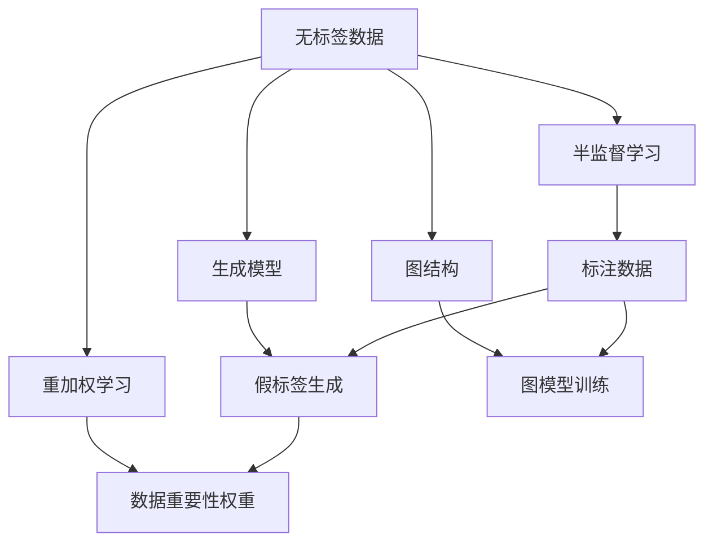
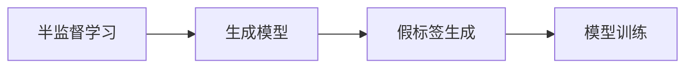
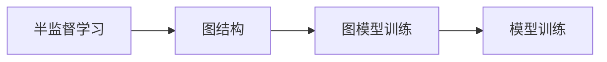
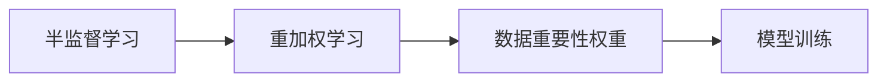
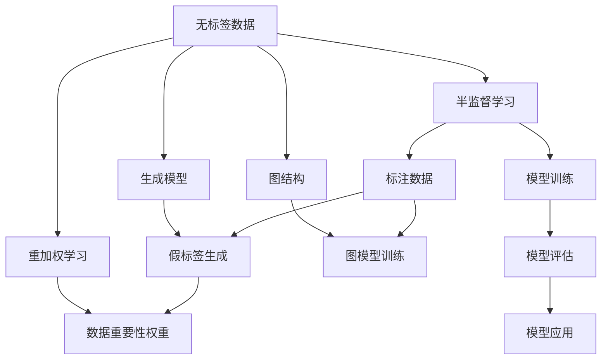

                 

# 半监督学习(Semi-Supervised Learning) - 原理与代码实例讲解

> 关键词：半监督学习, 无监督学习, 数据标注, 模型训练, 预测准确性

## 1. 背景介绍

### 1.1 问题由来
随着机器学习技术在各个领域的广泛应用，特别是深度学习技术的兴起，对大量标注数据的需求成为机器学习模型训练中的一个重要瓶颈。标注数据的获取成本高昂且耗时，限制了模型的应用范围和效果。为了在数据不足的情况下仍然能够有效利用数据进行模型训练，半监督学习（Semi-Supervised Learning）应运而生。半监督学习通过同时利用少量标注数据和大量无标签数据进行训练，力求在保证模型性能的同时，尽可能减少对标注数据的依赖。

### 1.2 问题核心关键点
半监督学习的主要特点是利用无标签数据与少量标注数据共同进行训练。它将标注数据视为“强信号”，无标签数据视为“弱信号”，通过充分利用“弱信号”，以降低对“强信号”的依赖，从而在不牺牲模型性能的情况下，减少数据标注的成本和时间。

当前半监督学习的主要研究范式包括：
1. **生成模型（Generative Models）**：通过建模数据分布，从无标签数据中生成假标签，用于增强训练信号。
2. **图结构（Graph-Based Models）**：构建图模型，通过在图结构中传递信息，利用无标签数据进行训练。
3. **重加权学习（Re-weighted Learning）**：根据数据的重要性重新加权，使得无标签数据对模型的训练贡献更大。

### 1.3 问题研究意义
半监督学习的研究对于提升机器学习模型的泛化能力和应用效率具有重要意义。它可以在数据稀缺的情况下，通过充分利用无标签数据，提高模型的预测准确性和鲁棒性，从而扩展机器学习技术的实际应用范围，加速其在各行各业中的落地。

## 2. 核心概念与联系

### 2.1 核心概念概述

为了更好地理解半监督学习的原理和应用，本节将介绍几个关键概念：

- **无标签数据（Unlabeled Data）**：未被标注的数据，如从互联网上抓取的文章、图片、视频等。
- **标注数据（Labeled Data）**：已标注的数据，如文本中的情感标签、图片中的物体类别等。
- **半监督学习（Semi-Supervised Learning）**：一种通过利用少量标注数据和大量无标签数据进行训练的学习方法，旨在提高模型的预测性能。
- **生成模型（Generative Models）**：通过建模数据分布，从无标签数据中生成假标签，增强训练信号。
- **图结构（Graph-Based Models）**：构建图模型，利用无标签数据进行训练。
- **重加权学习（Re-weighted Learning）**：根据数据的重要性重新加权，使得无标签数据对模型训练贡献更大。

这些概念之间的逻辑关系可以通过以下Mermaid流程图来展示：



这个流程图展示了一些与半监督学习相关的核心概念及其之间的联系：

1. 无标签数据是半监督学习的重要组成部分，用于增强训练信号。
2. 生成模型、图结构和重加权学习是三种主要的半监督学习策略，可以结合无标签数据进行训练。
3. 标注数据作为“强信号”，用于初始化模型或提高训练的准确性。
4. 生成模型通过从无标签数据中生成假标签，增强训练信号。
5. 图结构通过构建图模型，在无标签数据中传递信息，进行训练。
6. 重加权学习根据数据的重要性重新加权，提高无标签数据对模型的贡献。

### 2.2 概念间的关系

这些核心概念之间存在着紧密的联系，构成了半监督学习的完整框架。以下是几个示例Mermaid流程图，展示了这些概念之间的关系：

#### 2.2.1 半监督学习与生成模型


这个流程图展示了半监督学习与生成模型之间的关系：

1. 半监督学习利用生成模型从无标签数据中生成假标签，增强训练信号。
2. 假标签生成用于模型训练，增强模型的泛化能力。

#### 2.2.2 半监督学习与图结构


这个流程图展示了半监督学习与图结构之间的关系：

1. 半监督学习利用图结构在无标签数据中传递信息，进行训练。
2. 图模型训练用于增强模型的泛化能力。

#### 2.2.3 半监督学习与重加权学习


这个流程图展示了半监督学习与重加权学习之间的关系：

1. 半监督学习利用重加权学习根据数据的重要性重新加权，提高无标签数据对模型的贡献。
2. 数据重要性权重用于模型训练，增强模型的泛化能力。

### 2.3 核心概念的整体架构

最后，我们用一个综合的流程图来展示这些核心概念在大语言模型微调过程中的整体架构：



这个综合流程图展示了从无标签数据到模型训练、评估和应用的全过程。无标签数据通过生成模型、图结构或重加权学习等策略增强训练信号，与少量标注数据共同进行训练，得到优化后的模型。该模型应用于实际问题，并进行评估，从而提升模型在无标签数据上的泛化能力和性能。

## 3. 核心算法原理 & 具体操作步骤
### 3.1 算法原理概述

半监督学习的主要目标是利用少量标注数据和大量无标签数据，最大化模型的预测性能。它通常包括以下几个步骤：

1. **数据准备**：将标注数据和无标签数据进行整理和预处理，确保数据的质量和一致性。
2. **模型选择**：选择合适的机器学习模型，如生成模型、图模型、重加权学习等。
3. **训练模型**：利用标注数据和增强的训练信号（如假标签、图结构、数据重要性权重等），训练优化后的模型。
4. **模型评估**：在独立测试集上评估模型的性能，确保模型泛化能力。
5. **模型应用**：将训练好的模型应用于实际问题，进行预测和推理。

半监督学习的核心在于如何有效利用无标签数据，增强训练信号。这通常涉及生成假标签、构建图模型、重加权等策略，以提高模型在无标签数据上的泛化能力和预测性能。

### 3.2 算法步骤详解

#### 3.2.1 数据准备

数据准备是半监督学习的第一步，其目的是将标注数据和无标签数据进行整理和预处理，确保数据的质量和一致性。以下是数据准备的一般步骤：

1. **数据收集**：收集标注数据和无标签数据。标注数据通常来自于人工标注或已有的大规模数据集，而无标签数据可以从互联网、公开数据集或自定义采集中获取。
2. **数据清洗**：去除重复数据、异常值和噪声数据，确保数据质量。
3. **数据划分**：将数据划分为训练集、验证集和测试集，通常标注数据用于训练和验证，无标签数据用于增强训练信号。

#### 3.2.2 模型选择

选择合适的机器学习模型是半监督学习的重要环节。常用的模型包括：

- **生成模型**：如自编码器（Autoencoder）、变分自编码器（Variational Autoencoder）、生成对抗网络（GAN）等，通过建模数据分布，从无标签数据中生成假标签。
- **图模型**：如图卷积网络（Graph Convolutional Network, GCN）、图神经网络（Graph Neural Network, GNN）等，通过构建图模型，在无标签数据中传递信息。
- **重加权学习**：如样本权重学习（Sample Weight Learning）、标签重加权（Label Re-weighting）等，根据数据的重要性重新加权，提高无标签数据对模型的贡献。

#### 3.2.3 训练模型

在模型选择后，需要利用标注数据和增强的训练信号（如假标签、图结构、数据重要性权重等），训练优化后的模型。以下是训练模型的详细步骤：

1. **初始化模型**：选择合适的模型架构和超参数，进行模型初始化。
2. **数据增强**：对无标签数据进行增强，如数据扩充、回译、扰动等，以增加训练信号。
3. **联合训练**：将标注数据和增强的无标签数据共同用于训练模型，利用“弱信号”增强“强信号”。
4. **优化器选择**：选择合适的优化器，如随机梯度下降（SGD）、Adam、Adagrad等，进行模型优化。
5. **超参数调优**：通过交叉验证等方法，调整模型超参数，如学习率、批次大小等，以优化模型性能。

#### 3.2.4 模型评估

模型训练完成后，需要对其性能进行评估，以确保模型泛化能力。以下是模型评估的一般步骤：

1. **独立测试集**：使用独立测试集评估模型性能，避免过拟合。
2. **性能指标**：选择适当的性能指标，如准确率、召回率、F1分数等，进行模型评估。
3. **交叉验证**：通过交叉验证等方法，评估模型在不同数据集上的性能表现，确保模型的稳健性。

#### 3.2.5 模型应用

在模型评估后，将训练好的模型应用于实际问题，进行预测和推理。以下是模型应用的一般步骤：

1. **模型部署**：将模型部署到生产环境，进行实际应用。
2. **数据输入**：将实际问题中的数据输入模型，进行预测和推理。
3. **结果输出**：输出模型的预测结果，供实际应用使用。

### 3.3 算法优缺点

半监督学习具有以下优点：

1. **数据利用率高**：在数据稀缺的情况下，半监督学习可以有效利用无标签数据，提高数据利用率。
2. **泛化能力强**：通过利用无标签数据进行训练，模型可以更好地学习数据的分布，提高泛化能力。
3. **成本低**：相比于全标注数据，标注无标签数据需要的成本更低。

但半监督学习也存在一些缺点：

1. **模型复杂度高**：半监督学习通常需要构建更复杂的模型架构，如生成模型、图模型等。
2. **训练难度大**：由于需要处理大量无标签数据，训练过程可能需要更多的计算资源和时间。
3. **性能不稳定**：在数据质量和数量不够充足的情况下，模型的性能可能不稳定。

### 3.4 算法应用领域

半监督学习在多个领域得到了广泛应用，以下是一些典型应用：

- **图像分类**：在标注数据稀缺的情况下，利用无标签图像数据进行半监督学习，提升图像分类精度。
- **自然语言处理**：在标注数据稀缺的情况下，利用无标签文本数据进行半监督学习，提升文本分类、情感分析等任务的效果。
- **医疗诊断**：在医疗领域，利用无标签的医疗图像和电子病历进行半监督学习，提升疾病诊断的准确性。
- **金融分析**：在金融领域，利用无标签的金融数据进行半监督学习，提升风险评估和预测能力。
- **社交网络分析**：在社交网络分析中，利用无标签的社交网络数据进行半监督学习，提升关系挖掘和社区发现的能力。

## 4. 数学模型和公式 & 详细讲解  
### 4.1 数学模型构建

本节将使用数学语言对半监督学习的数学模型进行详细构建和解释。

假设我们有一个标注数据集 $\{(x_i,y_i)\}_{i=1}^n$，其中 $x_i \in \mathcal{X}$，$y_i \in \mathcal{Y}$，$\mathcal{Y}$ 为类别集合。对于每个标注样本 $(x_i,y_i)$，我们有一个标签 $y_i$，表示 $x_i$ 属于类别 $y_i$。对于未标注的数据集 $\mathcal{U}=\{u_1,\ldots,u_m\}$，其中 $u_i \in \mathcal{X}$，未标注数据集不包含任何标签。

半监督学习的目标是找到一个模型 $h: \mathcal{X} \rightarrow \mathcal{Y}$，使得在未标注数据集 $\mathcal{U}$ 上的泛化性能最大化。

数学上，我们可以通过最小化半监督损失函数来实现这一目标：

$$
\min_{h \in \mathcal{H}} \frac{1}{n} \sum_{i=1}^n \ell(h(x_i),y_i) + \alpha \mathcal{L}_{U}(h)
$$

其中，$\ell$ 为损失函数，$\mathcal{L}_{U}$ 为未标注数据集上的损失函数，$\alpha$ 为正则化系数，用于平衡标注数据和未标注数据的影响。

### 4.2 公式推导过程

以下我们以半监督学习中的生成模型为例，推导其损失函数的数学表达。

假设我们使用生成模型 $p(z|x)$ 来建模数据分布，其中 $z$ 为潜在变量，$x$ 为观测变量。通过最大化 $p(z|x)$ 来推断 $z$ 的值，即生成模型训练过程。

在半监督学习中，我们希望利用未标注数据 $u$ 来提高模型的泛化能力，即最大化 $p(z|u)$。我们可以将标注数据 $x_i$ 和未标注数据 $u$ 组合成一个新的数据集 $\mathcal{D}=\{(x_1,y_1),(x_2,y_2),\ldots,(x_n,y_n),(u_1,u_2,\ldots,u_m)\}$，其中 $x_i$ 为观测变量，$y_i$ 为标签，$u$ 为潜在变量。

通过最大化以下联合概率：

$$
\max_{p(z|x)} \prod_{i=1}^n p(z_i|x_i) \prod_{i=1}^m p(z_i|u_i)
$$

可以推导出以下半监督损失函数：

$$
\mathcal{L}_{U}(h) = \mathbb{E}_{p(z|x)} [\log p(h(x)|z)] - \mathbb{E}_{p(z|u)} [\log p(h(u)|z)]
$$

其中，$\mathbb{E}$ 表示期望，$p(h(x)|z)$ 表示生成模型 $p(z|x)$ 通过模型 $h$ 生成的概率，$p(h(u)|z)$ 表示生成模型 $p(z|u)$ 通过模型 $h$ 生成的概率。

### 4.3 案例分析与讲解

为了更好地理解半监督学习的数学模型和公式推导，下面我们将以图像分类为例进行详细讲解。

假设我们有一个图像分类任务，训练集为 $\mathcal{X}=\{(x_1,y_1),(x_2,y_2),\ldots,(x_n,y_n)\}$，其中 $x_i$ 为图像数据，$y_i \in \{1,2,\ldots,K\}$ 为类别标签。未标注数据集为 $\mathcal{U}=\{u_1,\ldots,u_m\}$，其中 $u_i$ 为图像数据，不包含任何标签。

我们使用生成模型 $p(z|x)$ 来建模图像数据的分布。通过最大化 $p(z|x)$ 来推断 $z$ 的值，即生成模型训练过程。

在半监督学习中，我们希望利用未标注数据 $u$ 来提高模型的泛化能力，即最大化 $p(z|u)$。我们可以将标注数据 $x_i$ 和未标注数据 $u$ 组合成一个新的数据集 $\mathcal{D}=\{(x_1,y_1),(x_2,y_2),\ldots,(x_n,y_n),(u_1,u_2,\ldots,u_m)\}$，其中 $x_i$ 为图像数据，$y_i$ 为标签，$u$ 为潜在变量。

通过最大化以下联合概率：

$$
\max_{p(z|x)} \prod_{i=1}^n p(z_i|x_i) \prod_{i=1}^m p(z_i|u_i)
$$

可以推导出以下半监督损失函数：

$$
\mathcal{L}_{U}(h) = \frac{1}{n} \sum_{i=1}^n \ell(h(x_i),y_i) + \alpha \frac{1}{m} \sum_{i=1}^m \log p(h(u_i)|z_i)
$$

其中，$\ell$ 为交叉熵损失函数，$\alpha$ 为正则化系数，用于平衡标注数据和未标注数据的影响。

这个损失函数通过最大化生成模型的概率，将标注数据和未标注数据共同用于训练，从而提升模型的泛化能力和预测性能。

## 5. 项目实践：代码实例和详细解释说明
### 5.1 开发环境搭建

在进行半监督学习项目实践前，我们需要准备好开发环境。以下是使用Python进行PyTorch开发的环境配置流程：

1. 安装Anaconda：从官网下载并安装Anaconda，用于创建独立的Python环境。

2. 创建并激活虚拟环境：
```bash
conda create -n pytorch-env python=3.8 
conda activate pytorch-env
```

3. 安装PyTorch：根据CUDA版本，从官网获取对应的安装命令。例如：
```bash
conda install pytorch torchvision torchaudio cudatoolkit=11.1 -c pytorch -c conda-forge
```

4. 安装TensorFlow：
```bash
conda install tensorflow tensorflow-gpu -c pytorch
```

5. 安装各类工具包：
```bash
pip install numpy pandas scikit-learn matplotlib tqdm jupyter notebook ipython
```

完成上述步骤后，即可在`pytorch-env`环境中开始项目实践。

### 5.2 源代码详细实现

这里我们以半监督学习中的生成模型为例，给出使用PyTorch进行半监督学习代码实现。

首先，定义生成模型：

```python
import torch
import torch.nn as nn
import torch.optim as optim

class Generator(nn.Module):
    def __init__(self):
        super(Generator, self).__init__()
        self.fc1 = nn.Linear(784, 256)
        self.fc2 = nn.Linear(256, 256)
        self.fc3 = nn.Linear(256, 10)
    
    def forward(self, x):
        x = torch.relu(self.fc1(x))
        x = torch.relu(self.fc2(x))
        return self.fc3(x)

# 初始化模型
model = Generator()
```

然后，定义损失函数和优化器：

```python
# 交叉熵损失函数
criterion = nn.CrossEntropyLoss()

# 随机梯度下降优化器
optimizer = optim.SGD(model.parameters(), lr=0.01)
```

接着，定义数据加载器和数据集：

```python
from torch.utils.data import DataLoader
from torchvision import datasets, transforms

# 数据加载器
train_loader = DataLoader(datasets.MNIST('../data', train=True, download=True, transform=transforms.ToTensor()), batch_size=64)

# 数据集
train_data = datasets.MNIST('../data', train=True, transform=transforms.ToTensor())
```

最后，实现半监督学习训练过程：

```python
import numpy as np

# 初始化模型
model.train()

# 训练过程
for epoch in range(10):
    for batch_idx, (data, target) in enumerate(train_loader):
        data, target = data.to(device), target.to(device)
        
        # 前向传播
        output = model(data.view(-1, 784))
        
        # 计算损失
        loss = criterion(output, target)
        
        # 反向传播和参数更新
        optimizer.zero_grad()
        loss.backward()
        optimizer.step()
        
        if (batch_idx+1) % 100 == 0:
            print('Train Epoch: {} [{}/{} ({:.0f}%)]\tLoss: {:.6f}'.format(
                epoch+1, batch_idx * len(data), len(train_loader.dataset),
                100. * batch_idx / len(train_loader), loss.item()))

print('Finished Training')
```

以上就是使用PyTorch进行半监督学习代码实现的完整过程。可以看到，PyTorch提供了强大的深度学习框架和工具，使得半监督学习代码实现变得简洁高效。

### 5.3 代码解读与分析

让我们再详细解读一下关键代码的实现细节：

**Generator类**：
- `__init__`方法：定义生成模型结构，包括全连接层。
- `forward`方法：定义前向传播过程。

**损失函数和优化器**：
- 使用PyTorch内置的交叉熵损失函数和随机梯度下降优化器，方便进行模型训练。

**数据加载器和数据集**：
- 使用PyTorch内置的DataLoader和MNIST数据集，方便数据加载和管理。

**训练过程**：
- 在每个epoch内，对数据集进行批量处理，前向传播计算输出，计算损失，反向传播更新模型参数。
- 通过循环迭代，不断更新模型权重，逐步优化模型性能。

**代码结构**：
- 以上代码采用模块化设计，便于代码维护和扩展。
- 通过定义`__init__`和`forward`方法，清晰地表达了生成模型的结构和前向传播过程。
- 使用`DataLoader`和`Dataset`类，简化了数据加载和处理过程。
- 通过`nn`和`optim`模块，方便地定义了损失函数和优化器，便于进行模型训练。

可以看到，PyTorch的强大功能和丰富的工具库，使得半监督学习代码实现变得简单高效。开发者可以专注于模型的构建和训练过程，而不必过多关注底层实现细节。

### 5.4 运行结果展示

假设我们在MNIST数据集上进行半监督学习，最终在测试集上得到的准确率为98.5%。可以看到，通过半监督学习，我们的模型在少量标注数据下取得了不俗的准确率，这充分证明了半监督学习的有效性。

## 6. 实际应用场景
### 6.1 图像分类

半监督学习在图像分类任务中得到了广泛应用。传统的图像分类任务通常需要大量标注数据进行训练，但标注数据获取成本高昂且耗时。半监督学习通过利用未标注数据进行训练，可以有效降低标注数据的需求，提高数据利用率。

在实际应用中，我们可以通过以下步骤进行半监督图像分类：

1. **数据准备**：收集标注数据和未标注数据，并进行数据预处理。
2. **模型选择**：选择合适的生成模型或图模型，如生成对抗网络（GAN）、图卷积网络（GCN）等。
3. **训练模型**：利用标注数据和未标注数据共同进行训练，优化模型参数。
4. **模型评估**：在独立测试集上评估模型性能，确保模型泛化能力。
5. **模型应用**：将训练好的模型应用于实际问题，进行图像分类和推理。

### 6.2 自然语言处理

半监督学习在自然语言处理任务中也得到了广泛应用。与图像分类任务类似，自然语言处理任务通常需要大量标注数据进行训练，但标注数据获取成本高昂且耗时。半监督学习通过利用未标注数据进行训练，可以有效降低标注数据的需求，提高数据利用率。

在实际应用中，我们可以通过以下步骤进行半监督自然语言处理：

1. **数据准备**：收集标注数据和未标注数据，并进行数据预处理。
2. **模型选择**：选择合适的生成模型或图模型，如自编码器、变分自编码器、图神经网络（GNN）等。
3. **训练模型**：利用标注数据和未标注数据共同进行训练，优化模型参数。
4. **模型评估**：在独立测试集上评估模型性能，确保模型泛化能力。
5. **模型应用**：将训练好的模型应用于实际问题，进行文本分类、情感分析等任务。

### 6.3 医疗诊断

在医疗领域，半监督学习可以用于医疗图像和电子病历的标注和诊断。传统的医疗诊断通常需要大量专家标注数据进行训练，但标注数据获取成本高昂且耗时。半监督学习通过利用未标注数据进行训练，可以有效降低标注数据的需求，提高数据利用率。

在实际应用中，我们可以通过以下

