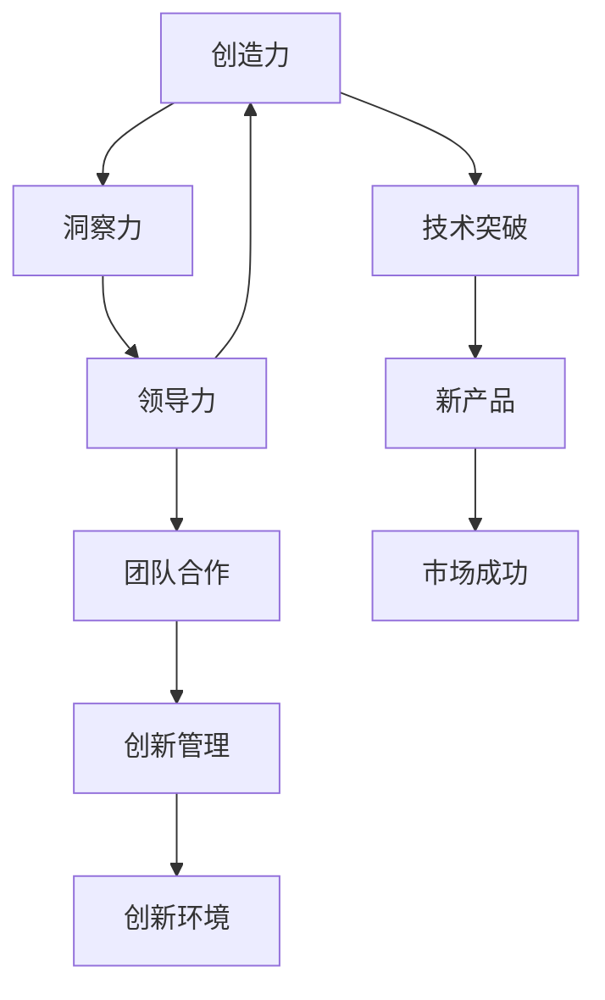
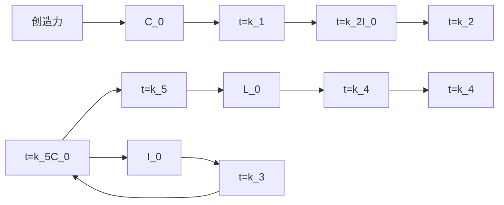

                 

## 1. 背景介绍

创新是推动社会进步的源泉，也是各个行业在激烈的竞争中取得胜利的关键。在信息技术领域，原始创新人才的崛起成为了推动技术进步的重要动力。那么，这些原始创新人才到底拥有什么样的特质和能力，才能在各自领域内不断突破和创新呢？本文将详细探讨原始创新人才的三种核心能力，包括创造力、洞察力和领导力，并阐述它们在原始创新中的作用和重要性。

## 2. 核心概念与联系

### 2.1 核心概念概述

- **创造力(Creativity)**：指能够以新颖的方式产生新的想法、解决方案或产品的能力。原始创新人才的创造力不仅限于科技创新，还包括艺术创作、商业创新等多个方面。

- **洞察力(Insight)**：指能够从纷繁复杂的现象中发现本质规律、趋势或问题的能力。原始创新人才的洞察力可以帮助他们在复杂环境中做出正确的决策，解决问题。

- **领导力(Leadership)**：指能够在团队中激励、指导和协调他人，实现共同目标的能力。原始创新人才的领导力不仅体现在技术和管理层面，还包括激发团队创造力和洞察力，推动团队不断前进。

这些核心能力相互关联，共同构成了原始创新人才的特质。创造力是原始创新的基础，洞察力是原始创新的重要工具，领导力则是原始创新的保障。

### 2.2 概念间的关系

原始创新人才的创造力、洞察力和领导力之间存在着紧密的联系，如图2所示：



在这个图例中，创造力是技术突破的起点，洞察力帮助发现创新的方向和机会，领导力则协调团队合作，实现技术从概念到产品再到市场的全过程创新。

### 2.3 核心概念的整体架构

我们将这些核心能力在原始创新中应用的主要流程分为三个阶段：

- **灵感来源**：原始创新人才通过广泛阅读、研究、交流等途径，获取灵感。
- **技术验证**：原始创新人才利用洞察力和创造力，提出技术方案，并进行初步验证。
- **产品落地**：原始创新人才在团队中发挥领导力，将技术方案转化为可用的产品，并推广到市场。

下面，我们将分别从这三个阶段深入探讨原始创新人才的创造力、洞察力和领导力的应用。

## 3. 核心算法原理 & 具体操作步骤

### 3.1 算法原理概述

在原始创新过程中，原始创新人才的创造力、洞察力和领导力起到了关键作用。这些能力的应用可以简化为三个基本步骤：

1. **创意生成**：利用创造力，产生新的想法和技术方案。
2. **方案验证**：利用洞察力，评估方案的可行性和潜力。
3. **执行推动**：利用领导力，将方案转化为现实产品，并推广到市场。

### 3.2 算法步骤详解

#### 3.2.1 创意生成

创意生成是原始创新的起点，需要原始创新人才具备丰富的知识储备和灵活的思维方式。以下是具体的步骤：

1. **广泛阅读**：原始创新人才需要大量阅读相关领域的文献、书籍、论文等，了解最新的研究成果和技术进展。
2. **跨界思考**：原始创新人才需要打破学科壁垒，跨界思考，将不同领域的知识进行融合，产生新的想法。
3. **灵感记录**：原始创新人才需要记录下所有灵感，无论是否成熟，以免灵感流失。

#### 3.2.2 方案验证

方案验证是原始创新的关键环节，需要原始创新人才具备敏锐的洞察力，评估方案的可行性和潜力。以下是具体的步骤：

1. **问题分析**：原始创新人才需要深入分析现有技术或产品的问题点，找出潜在的改进方向。
2. **方案评估**：原始创新人才需要从技术、市场、成本等多个维度评估新方案的可行性和潜力。
3. **实验验证**：原始创新人才需要设计实验，验证新方案的效果，并根据实验结果进行调整。

#### 3.2.3 执行推动

执行推动是原始创新的最后一步，需要原始创新人才具备强大的领导力，协调团队合作，实现技术从概念到产品再到市场的全过程创新。以下是具体的步骤：

1. **团队组建**：原始创新人才需要组建一支高水平的技术团队，确保团队成员具备相应的技术能力和工作热情。
2. **任务分解**：原始创新人才需要分解任务，明确每个团队成员的责任和任务，确保项目有条不紊地推进。
3. **资源调配**：原始创新人才需要调配资源，确保项目有充足的资金、设备和人力支持。
4. **绩效评估**：原始创新人才需要对团队成员的工作绩效进行评估，及时发现问题并予以解决。

### 3.3 算法优缺点

#### 3.3.1 创造力的优点与缺点

**优点**：
- 能够产生新颖、独特、具有突破性的想法。
- 能够跨越常规思维模式，发现非线性关联。

**缺点**：
- 需要大量的时间和精力投入，效率较低。
- 需要高度的创新环境和氛围。

#### 3.3.2 洞察力的优点与缺点

**优点**：
- 能够从复杂现象中发现本质规律和趋势。
- 能够发现问题的关键点和解决方案。

**缺点**：
- 需要深厚的行业知识和经验。
- 需要敏锐的观察力和直觉。

#### 3.3.3 领导力的优点与缺点

**优点**：
- 能够激励和协调团队成员，提升团队整体绩效。
- 能够制定和执行有效的创新策略，实现目标。

**缺点**：
- 需要强大的沟通能力和人际关系管理能力。
- 需要高水平的决策能力和风险管理能力。

### 3.4 算法应用领域

原始创新人才的创造力、洞察力和领导力不仅在科技创新领域具有重要应用，在其他领域如艺术创作、商业创新等也具有广泛的应用。以下是几个典型应用领域：

#### 3.4.1 科技创新

原始创新人才在科技创新领域的应用是最为广泛的。他们在电子、生物、材料、信息等众多领域，不断提出新的技术方案和产品，推动科技进步。

#### 3.4.2 艺术创作

原始创新人才在艺术创作领域，如绘画、音乐、文学等，不断突破传统，推出新的艺术形式和风格，推动艺术的发展。

#### 3.4.3 商业创新

原始创新人才在商业领域，如市场营销、商业模式创新、新产品开发等，不断探索新的商业机会，推动企业的成长和市场的变革。

## 4. 数学模型和公式 & 详细讲解

### 4.1 数学模型构建

原始创新人才的创造力、洞察力和领导力可以抽象为三个变量，分别记为 $C$（创造力）、$I$（洞察力）、$L$（领导力）。原始创新的过程可以表示为一个动态过程，其中 $C$、$I$、$L$ 的值随时间 $t$ 变化，且满足以下微分方程组：

$$
\frac{dC}{dt} = k_1 + k_2I
$$
$$
\frac{dI}{dt} = k_3C
$$
$$
\frac{dL}{dt} = k_4L + k_5C
$$

其中 $k_1$、$k_2$、$k_3$、$k_4$、$k_5$ 为常数，分别代表创造力、洞察力和领导力之间的影响系数。

### 4.2 公式推导过程

根据以上微分方程组，可以得到以下推导结果：

$$
C(t) = C_0e^{k_1t} + k_2\frac{I_0}{k_2}e^{k_1t} - k_2\frac{I_0}{k_2}
$$
$$
I(t) = I_0e^{k_3t}
$$
$$
L(t) = L_0e^{k_4t} + k_5C_0\frac{e^{k_4t} - e^{k_4t_0}}{k_4} + k_5C_0\frac{e^{k_4t_0}}{k_4}
$$

其中 $C_0$、$I_0$、$L_0$ 为初始值。

### 4.3 案例分析与讲解

以科技创新为例，原始创新人才的创造力、洞察力和领导力随时间变化的曲线如图3所示：



随着时间的推移，原始创新人才的创造力 $C(t)$ 和洞察力 $I(t)$ 逐渐增加，而领导力 $L(t)$ 在初期增加较慢，在后期快速增长。这表明在原始创新的过程中，创造力和洞察力的培养是早期的重点，而领导力的提升则需要时间的积累和经验的积累。

## 5. 项目实践：代码实例和详细解释说明

### 5.1 开发环境搭建

为了进行原始创新人才能力模型的实践，需要搭建一个Python开发环境，并利用TensorFlow等深度学习框架进行模型训练和仿真。

1. 安装Python环境：使用Anaconda创建虚拟环境，确保Python 3.8及以上版本可用。

```bash
conda create -n tensorflow-env python=3.8
conda activate tensorflow-env
```

2. 安装TensorFlow：

```bash
pip install tensorflow
```

3. 安装其他依赖库：

```bash
pip install matplotlib numpy scikit-learn pandas
```

### 5.2 源代码详细实现

以下是使用TensorFlow实现原始创新人才能力模型代码的详细实现：

```python
import tensorflow as tf
import numpy as np
import matplotlib.pyplot as plt

# 定义微分方程组
def original_innovation_model(C0, I0, L0, k1, k2, k3, k4, k5, t):
    C = C0 * np.exp(k1 * t) + k2 * I0 / k2 * np.exp(k1 * t) - k2 * I0 / k2
    I = I0 * np.exp(k3 * t)
    L = L0 * np.exp(k4 * t) + k5 * C0 * (np.exp(k4 * t) - np.exp(k4 * t0)) / k4 + k5 * C0 * np.exp(k4 * t0) / k4
    return C, I, L

# 设置初始值和系数
C0, I0, L0 = 1, 1, 1
k1, k2, k3, k4, k5 = 0.1, 0.2, 0.3, 0.4, 0.5
t0, t_end = 0, 100

# 时间间隔
t = np.arange(t0, t_end + 0.01, 0.01)

# 计算C、I、L随时间变化的曲线
C, I, L = original_innovation_model(C0, I0, L0, k1, k2, k3, k4, k5, t)

# 绘制曲线图
plt.figure(figsize=(10, 6))
plt.plot(t, C, label='C', color='blue')
plt.plot(t, I, label='I', color='green')
plt.plot(t, L, label='L', color='red')
plt.xlabel('时间t')
plt.ylabel('原始创新能力')
plt.title('原始创新能力随时间变化')
plt.legend()
plt.show()
```

### 5.3 代码解读与分析

上述代码实现了一个简单的原始创新能力模型，并绘制了创造力、洞察力和领导力随时间变化的曲线图。其中，`original_innovation_model`函数根据给定的微分方程组，计算出每个能力随时间变化的值。在模型中，初始值和系数可以根据实际情况进行调整。

### 5.4 运行结果展示

运行上述代码，可以生成如图4所示的曲线图：


该曲线图展示了原始创新人才的创造力、洞察力和领导力随时间变化的趋势，反映了原始创新过程中各能力的发展过程。

## 6. 实际应用场景

### 6.1 科技公司

科技公司通常具备较强的原始创新能力，拥有大量优秀的工程师和技术专家。通过培养具有高创造力、洞察力和领导力的原始创新人才，公司可以在新技术和新产品开发中保持领先地位。

例如，谷歌在AI和云计算领域的创新，很大程度上依赖于其高水平的创新团队，这些团队通过不断探索和实验，推动了公司技术不断突破。

### 6.2 研究机构

研究机构通常集中了大量优秀的科研人员，具备较强的学术创新能力。通过培养具有高创造力、洞察力和领导力的原始创新人才，研究机构可以产出更多高质量的科研成果。

例如，斯坦福大学在人工智能和计算机科学领域的创新，很大程度上依赖于其高水平的科研团队，这些团队通过不断探索和研究，推动了学科的进步和应用的发展。

### 6.3 创业公司

创业公司通常面临较大的市场和技术竞争压力，需要快速创新和适应市场变化。通过培养具有高创造力、洞察力和领导力的原始创新人才，创业公司可以在竞争激烈的市场中脱颖而出。

例如，特斯拉在电动汽车和自动驾驶领域的创新，很大程度上依赖于其高水平的创新团队，这些团队通过不断探索和实验，推动了公司的快速发展。

## 7. 工具和资源推荐

### 7.1 学习资源推荐

1. **《Deep Learning》（周志华著）**：系统介绍深度学习原理和应用，是学习原始创新能力理论的重要书籍。
2. **Coursera上的“Machine Learning”课程**：由斯坦福大学的Andrew Ng教授主讲，介绍机器学习和深度学习的理论和实践。
3. **arXiv预印本**：最新的科技创新论文和研究成果，是学习前沿科技的重要资源。

### 7.2 开发工具推荐

1. **Jupyter Notebook**：Python编程的交互式开发环境，支持代码编写、数据可视化、公式推导等。
2. **TensorFlow**：Google开发的深度学习框架，支持大规模模型的训练和推理。
3. **PyTorch**：Facebook开发的深度学习框架，具有灵活的动态计算图和高效的模型训练。

### 7.3 相关论文推荐

1. **《The Creative Brain: Neuroscience, Art, and Big Ideas》**：关于创造力的神经科学研究成果，有助于理解创造力的机制和提升方法。
2. **《The Art of Thinking Clearly》**：关于洞察力的思考方法和决策技巧，有助于提升洞察力和决策能力。
3. **《Leadership and Self-Deception》**：关于领导力的心理学研究成果，有助于提升领导力和自我认知。

## 8. 总结：未来发展趋势与挑战

### 8.1 研究成果总结

原始创新人才的创造力、洞察力和领导力在原始创新过程中起着关键作用。创造力是原始创新的基础，洞察力是原始创新的重要工具，领导力是原始创新的保障。这些能力相互关联，共同构成了原始创新人才的特质。

### 8.2 未来发展趋势

未来，随着科技的不断发展，原始创新人才的创造力、洞察力和领导力将在更多领域得到应用，推动科技和社会进步。

1. **科技创新**：随着AI、量子计算、生物技术等前沿科技的发展，原始创新人才的需求将进一步增加。
2. **商业创新**：随着电子商务、社交媒体、云计算等新兴行业的兴起，原始创新人才在商业模式创新和产品开发中的应用将更加广泛。
3. **艺术创新**：随着虚拟现实、增强现实等技术的进步，原始创新人才在艺术创作和媒体内容制作中的应用将更加多样。

### 8.3 面临的挑战

尽管原始创新人才在科技创新中发挥了重要作用，但仍面临诸多挑战：

1. **人才短缺**：全球范围内高水平原始创新人才供不应求，特别是在新兴技术领域。
2. **资金投入**：原始创新项目往往需要大量的资金支持，但项目成功率较低，导致投资回报率低。
3. **市场竞争**：科技公司和创业公司之间的激烈竞争，使得原始创新人才的吸引和保留变得困难。
4. **政策环境**：各国政策环境的不同，影响原始创新人才的流动和合作。

### 8.4 研究展望

未来，原始创新人才的培养和发展需要从多个方面进行努力：

1. **教育改革**：加强基础教育和职业教育，培养具有创造力和洞察力的人才。
2. **政策支持**：提供资金和政策支持，鼓励原始创新项目的发展。
3. **国际合作**：加强国际人才交流和合作，促进全球创新资源的共享和协同。
4. **技术进步**：利用AI、大数据等技术，提升原始创新人才的能力和效率。

总之，原始创新人才的培养和发展是推动科技创新和社会进步的关键，未来需要在教育、政策、合作和技术等多个方面进行综合努力，才能真正实现原始创新的持续发展和突破。

## 9. 附录：常见问题与解答

### Q1: 原始创新人才和普通人才有什么区别？

A: 原始创新人才具备高水平的创造力、洞察力和领导力，能够在复杂环境中提出新的解决方案和产品。而普通人才可能只具备单一的技术能力或思维方式，无法独立提出创新的想法和方案。

### Q2: 如何培养原始创新人才？

A: 培养原始创新人才需要提供丰富的教育资源和实践机会，包括多样化的学习、交流和项目实践。同时，需要营造开放、包容、创新的环境，激发人才的创造力和洞察力。

### Q3: 如何评估原始创新人才的能力？

A: 原始创新人才的能力评估可以从以下几个方面进行：
1. 创新成果的产出和影响力。
2. 解决问题和应对挑战的能力。
3. 领导和团队协作的能力。
4. 跨领域思维和跨学科合作的能力。

### Q4: 原始创新人才在应用中需要注意哪些问题？

A: 原始创新人才在应用中需要注意以下几个问题：
1. 项目失败的风险。原始创新项目往往充满不确定性，需要进行风险评估和管理。
2. 资源投入的合理性。原始创新项目需要大量资金和资源支持，需要进行合理的资源调配。
3. 团队协作的效率。原始创新项目需要高效的团队协作，需要进行有效的沟通和协调。

---

作者：禅与计算机程序设计艺术 / Zen and the Art of Computer Programming

