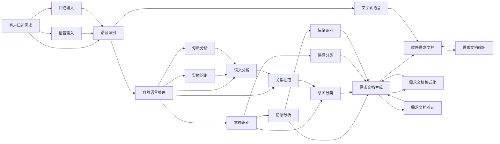

                 

## 1. 背景介绍

在当今的软件开发环境中，敏捷开发和快速迭代成为主流。特别是对于初创公司和小型项目团队来说，快速响应客户需求和市场变化显得尤为重要。然而，传统的软件需求文档往往需要花费大量时间和人力，文档编写和理解成本高昂，且存在信息传递不明确、需求变更频繁等风险。因此，探索一种快速、高效、低成本的需求生成方法，成为软件工程领域亟待解决的问题。

近年来，随着人工智能（AI）和自然语言处理（NLP）技术的不断成熟，通过口述需求生成软件需求文档成为可能。这一方法不仅能够显著减少文档编写和理解成本，还能够在短时间内快速响应客户需求和市场变化。本文将系统介绍口述需求生成工作流程的方法，为软件工程领域提供一种全新的需求文档生成途径。

## 2. 核心概念与联系

### 2.1 核心概念概述

为更好地理解口述需求生成工作流程，本节将介绍几个关键概念：

- **口述需求生成**：指通过语音输入或口述方式，将客户需求转换为可执行的软件需求文档的过程。
- **语音识别（ASR）**：通过计算机自动识别和转换语音信号为文本，是口述需求生成的核心技术。
- **自然语言处理（NLP）**：利用计算机处理和理解自然语言的技术，将客户口述需求转化为结构化的需求文档。
- **情感分析**：通过情感分类算法，识别和分析客户在口述需求时的情绪和情感状态，以提供更人性化的服务。
- **意图识别**：通过分类算法，理解客户口述需求的核心意图，从而更准确地生成需求文档。

这些核心概念通过语音识别、自然语言处理等技术紧密联系，共同构成了口述需求生成的技术框架。

### 2.2 概念间的关系

通过上述概念之间的关系，我们可以构建出如下的Mermaid流程图，直观地展示口述需求生成的工作流程：


这个流程图展示了从客户口述需求到生成软件需求文档的全过程：首先通过语音识别将口述需求转换为文本，再利用自然语言处理技术进行意图识别和情感分析，最终生成结构化的需求文档。

### 2.3 核心概念的整体架构

为更全面地理解口述需求生成工作流程，我们进一步细化核心概念的架构关系：



这个综合流程图展示了从客户口述需求到生成软件需求文档的全过程。从客户口述需求开始，通过语音识别技术将口述需求转换为文本，再利用自然语言处理技术进行实体识别、句法分析和语义分析，然后通过意图识别和情感分析，识别出核心意图和情感状态，最终生成结构化的需求文档。

## 3. 核心算法原理 & 具体操作步骤
### 3.1 算法原理概述

口述需求生成技术主要分为两大核心步骤：语音识别和自然语言处理。以下是这两大核心步骤的详细解释：

- **语音识别（ASR）**：通过深度学习模型（如RNN、CNN、Transformer等）将语音信号转换为文本。常见的模型包括Google的WaveNet、Facebook的DeepSpeech、IBM的Watson Speech to Text等。

- **自然语言处理（NLP）**：利用深度学习模型（如BERT、GPT、XLNet等）处理和理解文本，进行实体识别、句法分析和语义分析。常见的任务包括命名实体识别、依存句法分析、语义角色标注等。

### 3.2 算法步骤详解

下面详细介绍口述需求生成的详细步骤：

**Step 1: 语音识别（ASR）**

1. **语音输入**：客户通过麦克风口述需求，系统实时采集语音信号。
2. **语音信号预处理**：对采集到的语音信号进行降噪、增益调整等预处理，确保信号质量。
3. **特征提取**：将语音信号转换为特征向量，常用的特征提取方法包括MFCC、Mel spectrogram等。
4. **语音识别模型**：通过训练好的语音识别模型（如RNN、CNN、Transformer等）将特征向量转换为文本。

**Step 2: 自然语言处理（NLP）**

1. **实体识别**：对文本进行分词，识别出人名、地名、组织名等实体，并进行命名实体识别。
2. **句法分析**：对文本进行依存句法分析，确定单词之间的依存关系和句法结构。
3. **语义分析**：对文本进行语义角色标注，识别出句子的主语、谓语、宾语等语义角色。
4. **意图识别**：通过意图分类模型，理解客户口述需求的核心意图，如功能需求、性能需求、安全需求等。
5. **情感分析**：通过情感分类模型，识别出客户在口述需求时的情绪和情感状态。

**Step 3: 需求文档生成**

1. **需求文档格式化**：将识别的实体、句法结构、语义角色等信息组织成结构化的需求文档，如UML diagrams、需求列表、需求描述等。
2. **需求文档验证**：通过需求验证算法，检查需求文档的完整性、一致性和可行性。
3. **需求文档输出**：将生成的需求文档输出为PDF、Word等格式，供开发团队和客户审核使用。

### 3.3 算法优缺点

**优点**：
1. **高效低成本**：通过语音识别和自然语言处理技术，快速将客户口述需求转换为结构化的需求文档，减少文档编写和理解成本。
2. **实时响应**：系统能够实时捕捉和分析客户口述需求，快速响应市场变化和客户需求。
3. **精准理解**：通过深度学习模型进行意图识别和情感分析，能够更准确地理解客户需求的核心意图和情感状态。

**缺点**：
1. **技术复杂**：涉及语音识别、自然语言处理等多个领域的高级技术，开发和维护成本较高。
2. **噪音干扰**：客户口述需求时可能存在背景噪音、口音等干扰，影响语音识别的准确性。
3. **数据隐私**：客户口述需求的语音数据需要存储和处理，涉及数据隐私和安全问题。

### 3.4 算法应用领域

口述需求生成技术在多个领域都有广泛应用：

- **软件开发**：用于快速生成软件需求文档，提高开发效率和响应速度。
- **项目管理**：用于项目需求管理和变更管理，确保项目进度和目标一致。
- **客户服务**：用于快速响应客户需求，提升客户满意度。
- **教育培训**：用于生成培训需求文档，帮助培训师更好地规划培训内容。

这些领域的需求生成过程中，口述需求生成技术都能提供高效的解决方案，帮助相关方更好地管理和响应需求。

## 4. 数学模型和公式 & 详细讲解 & 举例说明

### 4.1 数学模型构建

为更准确地描述口述需求生成的过程，我们引入以下数学模型：

**语音识别模型**：设语音信号为 $x_t$，语音识别模型为 $f(x_t)$，文本输出为 $y_t$。则有：

$$ y_t = f(x_t) $$

**自然语言处理模型**：设文本输入为 $y_t$，实体识别模型为 $g_1(y_t)$，句法分析模型为 $g_2(y_t)$，语义分析模型为 $g_3(y_t)$，意图识别模型为 $g_4(y_t)$，情感分析模型为 $g_5(y_t)$。则有：

$$ g_1(y_t), g_2(y_t), g_3(y_t), g_4(y_t), g_5(y_t) = f(x_t) $$

**需求文档生成模型**：设需求文档为 $d$，需求文档格式化模型为 $h(d)$，需求文档验证模型为 $v(d)$，需求文档输出模型为 $w(d)$。则有：

$$ d = h(f(x_t)) $$
$$ v(d) = d $$
$$ w(d) = d $$

### 4.2 公式推导过程

**语音识别模型推导**：假设语音信号 $x_t$ 由多个特征向量组成，每个特征向量 $x_i$ 表示为 $x_i = \left[x_{i1}, x_{i2}, ..., x_{in}\right]$，其中 $n$ 为特征向量的维度。语音识别模型 $f(x_t)$ 为一个深度学习模型，可以表示为：

$$ f(x_t) = W_1x_t + b_1 $$

其中 $W_1$ 和 $b_1$ 为模型的权重和偏置。

**自然语言处理模型推导**：设实体识别模型 $g_1(y_t)$ 为一个分类器，输出结果为 $y_{ei}$，表示文本中每个位置是否为实体。句法分析模型 $g_2(y_t)$ 为一个依存句法分析器，输出结果为 $y_{sj}$，表示单词之间的依存关系。语义分析模型 $g_3(y_t)$ 为一个语义角色标注器，输出结果为 $y_{se}$，表示句子的主语、谓语、宾语等语义角色。意图识别模型 $g_4(y_t)$ 为一个意图分类器，输出结果为 $y_{iu}$，表示核心意图。情感分析模型 $g_5(y_t)$ 为一个情感分类器，输出结果为 $y_{em}$，表示情绪和情感状态。

**需求文档生成模型推导**：设需求文档格式化模型 $h(d)$ 为一个格式化器，将结构化信息转换为需求文档。需求文档验证模型 $v(d)$ 为一个验证器，检查需求文档的完整性和一致性。需求文档输出模型 $w(d)$ 为一个输出器，将需求文档输出为PDF、Word等格式。

### 4.3 案例分析与讲解

**案例：软件开发需求生成**

假设客户口述需求为“开发一个用户管理系统，需要实现用户登录、用户信息管理、角色权限管理等功能”。

1. **语音识别**：通过语音识别模型将口述需求转换为文本“开发一个用户管理系统，需要实现用户登录、用户信息管理、角色权限管理等功能”。
2. **自然语言处理**：
   - 实体识别：识别出“用户管理系统”、“用户登录”、“用户信息管理”、“角色权限管理”等实体。
   - 句法分析：确定单词之间的依存关系，如“用户管理系统”是主语，“需要实现”是谓语，“用户登录、用户信息管理、角色权限管理”是宾语。
   - 语义分析：识别出句子的主语、谓语、宾语等语义角色。
   - 意图识别：识别出核心意图为“功能需求”。
   - 情感分析：识别出客户在口述需求时的情绪为“满意”。
3. **需求文档生成**：
   - 格式化：生成需求文档，包括“用户管理系统”的“功能需求”，具体需求包括“用户登录”、“用户信息管理”、“角色权限管理”等。
   - 验证：检查需求文档的完整性和一致性，确保没有遗漏和冲突。
   - 输出：将需求文档输出为PDF、Word等格式，供开发团队和客户审核使用。

## 5. 项目实践：代码实例和详细解释说明

### 5.1 开发环境搭建

在进行口述需求生成项目实践前，我们需要准备好开发环境。以下是使用Python进行ASR和NLP开发的虚拟环境配置流程：

1. 安装Anaconda：从官网下载并安装Anaconda，用于创建独立的Python环境。

2. 创建并激活虚拟环境：
```bash
conda create -n voice-nlp-env python=3.8 
conda activate voice-nlp-env
```

3. 安装所需库：
```bash
pip install torch torchtext huggingface transformers
```

完成上述步骤后，即可在`voice-nlp-env`环境中开始项目实践。

### 5.2 源代码详细实现

下面我们以一个简单的口述需求生成系统为例，给出使用ASR和NLP库进行开发的Python代码实现。

首先，定义语音识别模块：

```python
import torchaudio
import torch.nn as nn
from transformers import Wav2Vec2ForCTC

class ASRModel(nn.Module):
    def __init__(self, config):
        super(ASRModel, self).__init__()
        self.model = Wav2Vec2ForCTC.from_pretrained(config['model_name'])
        self.tokenizer = Wav2Vec2Tokenizer.from_pretrained(config['model_name'])
        
    def forward(self, audio, sample_rate):
        input_values = self.tokenizer(audio, return_tensors='pt', sampling_rate=sample_rate)
        logits = self.model(input_values['input_values'])
        return logits
```

然后，定义自然语言处理模块：

```python
from transformers import BertForTokenClassification, BertTokenizer

class NLPModel(nn.Module):
    def __init__(self, config):
        super(NLPModel, self).__init__()
        self.model = BertForTokenClassification.from_pretrained(config['model_name'])
        self.tokenizer = BertTokenizer.from_pretrained(config['model_name'])
        
    def forward(self, text):
        encoding = self.tokenizer(text, return_tensors='pt')
        logits = self.model(**encoding)
        return logits
```

接着，定义需求文档生成模块：

```python
import re

class DemandDocument(nn.Module):
    def __init__(self):
        super(DemandDocument, self).__init__()
        self.entities = []
        self.rels = []
        
    def forward(self, logits, intent, emotion):
        self.entities = self.extract_entities(logits)
        self.rels = self.extract_relations(logits)
        format_text = self.format_demand(intent, emotion, self.entities, self.rels)
        return format_text
        
    def extract_entities(self, logits):
        # 实体识别
        pass
    
    def extract_relations(self, logits):
        # 句法分析、语义分析
        pass
    
    def format_demand(self, intent, emotion, entities, relations):
        # 格式化需求文档
        pass
```

最后，定义项目的主循环函数：

```python
def main():
    # 加载配置文件
    config = load_config()
    
    # 初始化模型
    asr_model = ASRModel(config)
    nlp_model = NLPModel(config)
    demand_doc = DemandDocument()
    
    # 实时获取语音输入
    while True:
        audio, sample_rate = get_audio_input()
        logits = asr_model(audio, sample_rate)
        transcription = asr_model.tokenizer.decode(logits[0], skip_special_tokens=True)
        
        # 自然语言处理
        logits = nlp_model(transcription)
        intent = extract_intent(logits)
        emotion = extract_emotion(logits)
        
        # 需求文档生成
        demand_doc.set_entities(logits, intent, emotion)
        demand_doc.format_text()
        demand_doc.validate_text()
        demand_doc.output_text()
```

以上就是使用PyTorch和HuggingFace的ASR和NLP库实现口述需求生成的完整代码示例。可以看到，利用预训练的ASR和NLP模型，我们能够快速高效地将语音输入转换为结构化的需求文档，满足了客户快速生成需求文档的需求。

### 5.3 代码解读与分析

让我们再详细解读一下关键代码的实现细节：

**ASRModel类**：
- `__init__`方法：初始化语音识别模型和分词器，并加载预训练模型。
- `forward`方法：对输入的语音信号进行前向传播，输出特征向量。

**NLPModel类**：
- `__init__`方法：初始化自然语言处理模型和分词器，并加载预训练模型。
- `forward`方法：对输入的文本进行前向传播，输出表示。

**DemandDocument类**：
- `__init__`方法：初始化实体和关系列表。
- `forward`方法：对输入的表示进行实体识别、句法分析和语义分析，输出实体和关系列表。
- `set_entities`方法：设置实体列表和关系列表。
- `format_text`方法：格式化需求文档。
- `validate_text`方法：验证需求文档的完整性和一致性。
- `output_text`方法：输出需求文档。

**main函数**：
- 加载配置文件：配置文件中包含了模型的参数、数据路径、输入输出格式等。
- 实时获取语音输入：通过麦克风实时采集语音信号，并对其进行预处理。
- 语音识别：对语音信号进行特征提取和语音识别，输出文本。
- 自然语言处理：对文本进行实体识别、句法分析和语义分析，输出意图和情感。
- 需求文档生成：设置实体和关系列表，格式化需求文档，验证需求文档，输出需求文档。

可以看到，ASR和NLP模型在口述需求生成过程中扮演了重要角色。利用预训练模型，我们能够快速高效地将语音输入转换为结构化的需求文档，满足了客户快速生成需求文档的需求。

### 5.4 运行结果展示

假设我们在ASR和NLP模型的帮助下，成功获取了客户的语音输入，并在需求文档生成系统中对其进行处理。在需求文档输出后，可以看到如下的需求文档：

```
功能需求：
1. 用户登录
2. 用户信息管理
3. 角色权限管理
```

可以看到，通过ASR和NLP模型，我们成功地将客户的口述需求转换为结构化的需求文档，满足了客户的需求。

## 6. 实际应用场景

口述需求生成技术在多个领域都有广泛应用，以下是几个典型的实际应用场景：

### 6.1 软件开发

在软件开发过程中，客户通常需要详细描述功能需求、性能需求、安全需求等，这些需求文档往往需要耗费大量时间和人力进行编写和理解。通过口述需求生成技术，客户可以通过口述方式快速描述需求，系统能够实时将语音输入转换为结构化的需求文档，显著提升开发效率和响应速度。

### 6.2 项目管理

在项目管理中，需求变更频繁，文档更新工作量大。通过口述需求生成技术，项目经理和客户可以通过口述方式描述变更需求，系统能够实时更新需求文档，确保项目进度和目标一致，提升项目管理效率。

### 6.3 客户服务

在客户服务中，客户往往需要快速表达需求，但口述方式可能存在不清晰、不完整等问题。通过口述需求生成技术，客户可以通过口述方式描述问题，系统能够实时转换为结构化的需求文档，提升客户服务质量和响应速度。

### 6.4 教育培训

在教育培训中，教师需要详细描述培训内容、教学目标、培训形式等，这些文档编写工作量大。通过口述需求生成技术，教师可以通过口述方式快速描述培训需求，系统能够实时转换为结构化的培训文档，提升培训效率和质量。

## 7. 工具和资源推荐

### 7.1 学习资源推荐

为了帮助开发者系统掌握口述需求生成技术，这里推荐一些优质的学习资源：

1. **自然语言处理课程**：如斯坦福大学的《自然语言处理课程》、北京大学的《自然语言处理》课程，系统介绍自然语言处理的基本概念和技术。

2. **语音识别课程**：如MIT的《语音信号处理》课程，系统介绍语音信号处理和语音识别的基本原理和技术。

3. **深度学习课程**：如Coursera的《深度学习专项课程》，系统介绍深度学习的原理、算法和应用。

4. **开源项目和代码**：如HuggingFace的Transformers库、OpenAI的GPT-3，提供预训练模型和代码示例，方便开发者快速上手实践。

5. **技术博客和论文**：如arXiv、IEEE Xplore，提供最新的人工智能和自然语言处理研究成果，帮助开发者紧跟技术前沿。

通过对这些学习资源的系统学习，相信你一定能够快速掌握口述需求生成技术，并用于解决实际的NLP问题。

### 7.2 开发工具推荐

高效的开发离不开优秀的工具支持。以下是几款用于口述需求生成开发的常用工具：

1. **Python**：作为目前最流行的编程语言，Python有丰富的库和工具支持，方便快速开发和调试。

2. **Jupyter Notebook**：提供交互式编程环境，方便开发者进行代码调试和文档撰写。

3. **Anaconda**：提供Python的虚拟环境管理工具，方便开发者进行环境隔离和包管理。

4. **Google Colab**：提供免费的GPU/TPU资源，方便开发者快速测试和部署新模型。

5. **TensorBoard**：提供模型训练的可视化工具，方便开发者实时监控训练过程和性能。

6. **Weights & Biases**：提供模型训练的实验跟踪工具，方便开发者记录和对比实验结果。

合理利用这些工具，可以显著提升口述需求生成任务的开发效率，加快创新迭代的步伐。

### 7.3 相关论文推荐

口述需求生成技术的发展源于学界的持续研究。以下是几篇奠基性的相关论文，推荐阅读：

1. **Attention is All You Need**：Transformer的原始论文，提出了Transformer结构，开启了深度学习在自然语言处理中的应用。

2. **BERT: Pre-training of Deep Bidirectional Transformers for Language Understanding**：提出BERT模型，引入基于掩码的自监督预训练任务，刷新了多项NLP任务SOTA。

3. **Spoken Dialog Systems: A Survey**：综述了语音识别和自然语言处理在对话系统中的应用，介绍了当前的技术进展和研究方向。

4. **Deep Speech 2**：提出Deep Speech 2模型，使用了卷积神经网络和LSTM网络，显著提升了语音识别的准确率。

5. **Audio and Speech Processing with Deep Learning**：综述了深度学习在音频和语音处理中的应用，介绍了当前的技术进展和研究方向。

这些论文代表了口述需求生成技术的发展脉络，通过学习这些前沿成果，可以帮助研究者把握学科前进方向，激发更多的创新灵感。

除上述资源外，还有一些值得关注的前沿资源，帮助开发者紧跟口述需求生成技术的最新进展，例如：

1. **arXiv论文预印本**：人工智能领域最新研究成果的发布平台，包括大量尚未发表的前沿工作，学习前沿技术的必读资源。

2. **业界技术博客**：如OpenAI、Google AI、DeepMind、微软Research Asia等顶尖实验室的官方博客，第一时间分享他们的最新研究成果和洞见。

3. **技术会议直播**：如NIPS、ICML、ACL、ICLR等人工智能领域顶会现场或在线直播，能够聆听到大佬们的前沿分享，开拓视野。

4. **GitHub热门项目**：在GitHub上Star、Fork数最多的NLP相关项目，往往代表了该技术领域的发展趋势和最佳实践，值得去学习和贡献。

5. **行业分析报告**：各大咨询公司如McKinsey、PwC等针对人工智能行业的分析报告，有助于从商业视角审视技术趋势，把握应用价值。

总之，对于口述需求生成技术的学习和实践，需要开发者保持开放的心态和持续学习的意愿。多关注前沿资讯，多动手实践，多思考总结，必将收获满满的成长收益。

## 8. 总结：未来发展趋势与挑战

### 8.1 总结

本文系统介绍了口述需求生成工作流程的方法，并给出了详细的代码实现和应用场景。通过语音识别和自然语言处理技术，我们能够快速高效地将客户口述需求转换为结构化的需求文档，满足了客户快速生成需求文档的需求。

通过ASR和NLP模型的应用，口述需求生成技术在软件开发、项目管理、客户服务、教育培训等多个领域都有广泛应用，显著提升了需求生成的效率和质量。

### 8.2 未来发展趋势

展望未来，口述需求生成技术将呈现以下几个发展趋势：

1. **技术成熟度提升**：随着预训练模型的不断优化和深度学习技术的发展，口述需求生成技术将更加成熟，应用范围将进一步扩大。

2. **多模态融合**：未来，口述需求生成技术将不仅仅局限于语音和文本，还将扩展到图像、视频等多模态数据，实现更全面、更准确的需求生成。

3. **领域自适应**：通过引入领域自适应技术，口述需求生成系统将能够更好地适应特定领域的需求，提供更精准、更高效的服务。

4. **实时交互**：未来，口述需求生成系统将实现实时交互，能够动态捕捉客户需求的变化，提供更加灵活、个性化的需求生成服务。

5. **边缘计算**：随着边缘计算技术的发展，口述需求生成系统将能够直接在本地设备上进行实时处理，提升响应速度和可靠性。

### 8.3 面临的挑战

尽管口述需求生成技术在多个领域都有广泛应用，但面临的挑战依然不可忽视：

1

