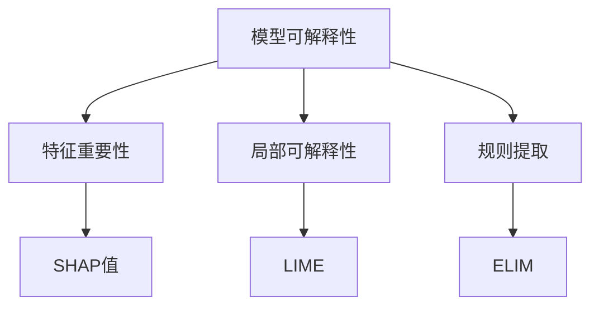
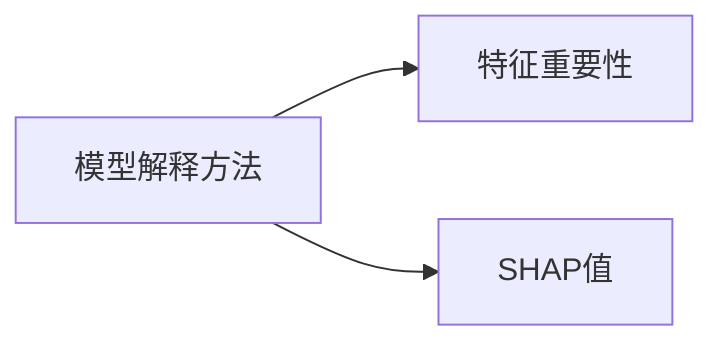
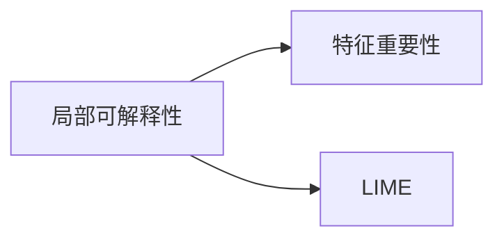
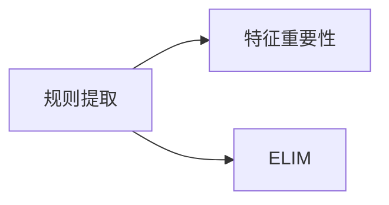
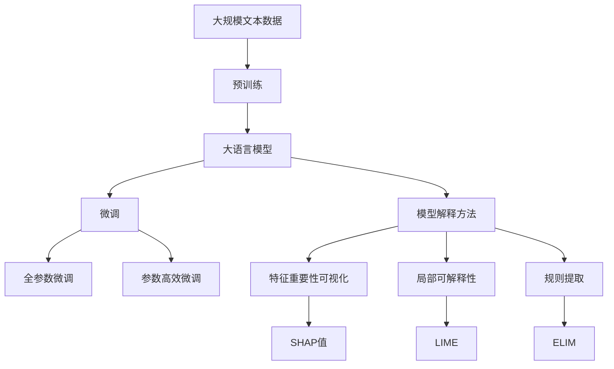

                 

# 可解释人工智能原理与代码实战案例讲解

> 关键词：可解释人工智能, 代码实战, 模型可解释性, 模型解释方法, 案例分析

## 1. 背景介绍

### 1.1 问题由来
近年来，深度学习模型在各个领域取得了显著的进展，但这些黑箱模型的决策过程缺乏透明度，难以让人理解和信任。因此，越来越多的研究者开始关注如何提高机器学习模型的可解释性。对于可解释AI(XAI)，其核心理念是通过提高模型的透明度，让用户能够理解模型的决策过程，从而增强模型的可信度。

### 1.2 问题核心关键点
要实现可解释AI，关键是找到合适的模型解释方法。目前主要的研究方向包括：

1. **模型透明化**：通过简化模型结构，减小模型规模，使其更容易理解。例如，使用线性模型、决策树等可解释性强的模型。
2. **特征重要性可视化**：通过特征重要性指标，可视化模型预测过程中哪些特征最为重要。常用的方法有SHAP值、LIME等。
3. **局部可解释性**：在局部区域（如单个样本）上解释模型的输出，而不是全局解释。这有助于理解特定情况下模型的行为。
4. **规则提取**：将复杂的模型转化为简单规则或规则集，便于理解和解释。常用的方法有LIME、ELIM等。

### 1.3 问题研究意义
提高机器学习模型的可解释性，对于提升用户信任、增强模型鲁棒性、辅助模型优化等具有重要意义：

1. **增强用户信任**：可解释AI帮助用户理解模型决策，增加用户对模型的信任和接受度。
2. **提升模型鲁棒性**：通过解释模型行为，可以帮助发现模型的偏见和错误，进行修正和优化。
3. **辅助模型优化**：可解释性指标可以指导模型训练，避免过拟合，提高模型的泛化性能。
4. **辅助业务决策**：通过模型解释，帮助业务专家理解模型的预测结果，指导实际业务决策。

## 2. 核心概念与联系

### 2.1 核心概念概述

为了更好地理解可解释AI的核心概念，本节将介绍几个密切相关的核心概念：

- **模型可解释性(Explainability)**：指模型的决策过程是否透明、易于理解。具有良好可解释性的模型，用户可以理解和信任其预测结果。
- **模型解释方法(Explanation Methods)**：指用于解释模型预测过程的技术手段。包括特征重要性可视化、局部可解释性、规则提取等。
- **特征重要性(Feature Importance)**：指在模型预测过程中，各个特征对结果的贡献程度。通过可视化特征重要性，可以理解模型对哪些特征的依赖。
- **SHAP值(Shapley Values)**：一种衡量特征对模型预测结果贡献的方法，基于博弈论的Shapley值，可以全面衡量每个特征的影响。
- **LIME(Local Interpretable Model-agnostic Explanations)**：一种局部可解释性方法，通过对模型进行局部拟合，解释单个样本的预测结果。

这些核心概念之间的逻辑关系可以通过以下Mermaid流程图来展示：



这个流程图展示了大语言模型微调过程中各个核心概念的关系和作用：

1. 通过特征重要性可视化，理解模型对哪些特征的依赖。
2. 通过局部可解释性方法，解释单个样本的预测结果。
3. 通过规则提取，将复杂模型转化为简单规则或规则集。
4. SHAP值作为特征重要性的一种具体表现形式，可以全面衡量特征的影响。

### 2.2 概念间的关系

这些核心概念之间存在着紧密的联系，形成了可解释AI的完整生态系统。下面我通过几个Mermaid流程图来展示这些概念之间的关系。

#### 2.2.1 模型解释方法与特征重要性



这个流程图展示了模型解释方法与特征重要性之间的关系。特征重要性可视化是模型解释方法的一种常见形式，SHAP值作为特征重要性的一种具体实现方式，可以更全面地解释模型的特征依赖关系。

#### 2.2.2 局部可解释性与特征重要性



这个流程图展示了局部可解释性与特征重要性之间的关系。LIME方法通过局部拟合，得到单个样本的预测结果，并可视化特征重要性，帮助理解模型的预测行为。

#### 2.2.3 规则提取与特征重要性



这个流程图展示了规则提取与特征重要性之间的关系。规则提取方法通过化简模型，生成规则或规则集，进一步可视化特征重要性，便于理解模型的决策逻辑。

### 2.3 核心概念的整体架构

最后，我们用一个综合的流程图来展示这些核心概念在大语言模型微调过程中的整体架构：



这个综合流程图展示了从预训练到微调，再到模型解释的完整过程。大语言模型首先在大规模文本数据上进行预训练，然后通过微调（包括全参数微调和参数高效微调两种方式）优化模型性能。在微调过程中，通过特征重要性可视化、局部可解释性和规则提取等方法，解释模型的预测行为，提高模型的可解释性。最终，通过SHAP值、LIME等工具，对模型进行全面的解释和评估。 通过这些流程图，我们可以更清晰地理解可解释AI在大语言模型微调过程中的各个环节，为后续深入讨论具体的解释方法和技术奠定基础。

## 3. 核心算法原理 & 具体操作步骤

### 3.1 算法原理概述

可解释AI的核心算法原理主要基于以下几个方面：

1. **特征重要性**：通过特征重要性指标，衡量各个特征对模型输出的贡献程度。常用的方法包括SHAP值、LIME等。
2. **局部可解释性**：在单个样本上，通过局部拟合方法解释模型的预测结果。LIME和ELIM是常用的两种方法。
3. **规则提取**：将复杂的模型转化为简单规则或规则集，便于理解和解释。ELIM方法基于逻辑回归，能够生成易于解释的规则集。

这些方法的基本原理在于，通过简化模型或提取规则，使得模型的决策过程更加透明和可解释。具体来说，特征重要性衡量了各个特征对模型输出的贡献，局部可解释性解释了单个样本的预测结果，规则提取则通过简单规则来近似复杂模型，从而提高模型的可解释性。

### 3.2 算法步骤详解

以下是一个基于LIME的局部可解释性方法的详细步骤：

**Step 1: 准备数据集和模型**

1. 准备需要进行解释的模型 $M$，例如使用LSTM、线性回归、神经网络等模型。
2. 准备数据集 $D=\{(x_i, y_i)\}_{i=1}^N$，其中 $x_i$ 为输入样本，$y_i$ 为模型预测结果。

**Step 2: 随机采样**

1. 从数据集中随机抽取 $k$ 个样本，作为局部解释的样本集合 $\mathcal{S}$。

**Step 3: 局部拟合**

1. 对每个样本 $x_i$，随机抽取 $m$ 个特征，并在这些特征上添加噪声 $\epsilon_i$。
2. 构建一个局部模型 $M_i$，对噪声后的特征 $x_i'$ 进行预测。

**Step 4: 计算权重**

1. 计算每个特征在预测结果中的权重 $w_{ij}$，表示该特征在模型预测中贡献的大小。

**Step 5: 解释结果**

1. 对每个样本 $x_i$，根据权重 $w_{ij}$ 对原始特征 $x_i$ 进行加权，解释模型的预测结果。

### 3.3 算法优缺点

基于LIME的局部可解释性方法具有以下优点：

1. 解释能力强：通过局部拟合，可以解释单个样本的预测结果。
2. 模型无关：LIME适用于多种不同的模型，包括线性模型、非线性模型等。
3. 可视化效果好：通过权重可视化，可以直观地理解每个特征对预测结果的贡献。

其缺点包括：

1. 计算量大：局部拟合需要构建多个模型，计算量较大。
2. 需要调参：LIME的参数设置较多，需要进行调参。

### 3.4 算法应用领域

可解释AI技术在多个领域中得到了广泛应用，包括但不限于以下几个方面：

1. **金融风控**：在金融风控领域，模型解释可以帮助理解模型对风险的预测，帮助制定更科学的信贷策略。
2. **医疗诊断**：在医疗领域，模型解释可以帮助医生理解模型对病情的预测，提高诊断的准确性。
3. **自然语言处理**：在自然语言处理领域，模型解释可以帮助用户理解模型对文本的情感分析结果，提高用户信任度。
4. **自动驾驶**：在自动驾驶领域，模型解释可以帮助用户理解模型的决策过程，提高系统可信度。
5. **智能推荐**：在智能推荐系统领域，模型解释可以帮助用户理解推荐结果的依据，提高系统的透明度和用户满意度。

## 4. 数学模型和公式 & 详细讲解 & 举例说明

### 4.1 数学模型构建

在可解释AI中，数学模型的构建是基础，通常包括特征重要性计算、局部拟合、规则提取等。以下以SHAP值为例，展示特征重要性计算的数学模型构建过程。

假设模型 $M$ 的预测结果为 $\hat{y}$，特征集合为 $\mathcal{X}$，模型的线性预测函数为 $f(x; \theta)$，其中 $\theta$ 为模型参数。SHAP值 $S_i$ 表示特征 $x_i$ 对预测结果的贡献，可以表示为：

$$
S_i = \sum_{j=1}^N (y_j - \hat{y}_j) \Delta f(x_i, x_j)
$$

其中，$\Delta f(x_i, x_j)$ 表示特征 $x_i$ 变化时，模型输出变化的量。

### 4.2 公式推导过程

以下是对SHAP值计算公式的详细推导过程。

假设模型 $M$ 的预测结果为 $\hat{y}$，特征集合为 $\mathcal{X}$，模型的线性预测函数为 $f(x; \theta)$，其中 $\theta$ 为模型参数。SHAP值 $S_i$ 表示特征 $x_i$ 对预测结果的贡献，可以表示为：

$$
S_i = \sum_{j=1}^N (y_j - \hat{y}_j) \Delta f(x_i, x_j)
$$

其中，$\Delta f(x_i, x_j)$ 表示特征 $x_i$ 变化时，模型输出变化的量。

通过定义特征 $x_i$ 和 $x_j$ 之间的SHAP值 $\phi(x_i, x_j)$，可以得到：

$$
\phi(x_i, x_j) = \Delta f(x_i, x_j) - \Delta f(x_j, x_j)
$$

将 $\phi(x_i, x_j)$ 代入SHAP值的定义中，可以得到：

$$
S_i = \sum_{j=1}^N (y_j - \hat{y}_j) \phi(x_i, x_j)
$$

通过计算每个特征的SHAP值，可以全面衡量每个特征对预测结果的贡献。

### 4.3 案例分析与讲解

以LIME方法为例，展示如何在单个样本上进行局部可解释性分析。

假设我们有一个二分类模型，用于预测贷款申请是否通过。我们选取一个样本 $x_i$ 进行解释。

1. 随机抽取 $m=10$ 个特征，并在这些特征上添加噪声 $\epsilon_i$。
2. 构建一个局部模型 $M_i$，对噪声后的特征 $x_i'$ 进行预测，得到预测结果 $\hat{y}_i'$。
3. 计算每个特征在预测结果中的权重 $w_{ij}$，表示该特征在模型预测中贡献的大小。
4. 根据权重 $w_{ij}$ 对原始特征 $x_i$ 进行加权，解释模型的预测结果。

通过LIME方法，我们可以直观地理解每个特征对模型预测结果的贡献，帮助用户理解模型的决策过程。

## 5. 项目实践：代码实例和详细解释说明

### 5.1 开发环境搭建

在进行可解释AI项目实践前，我们需要准备好开发环境。以下是使用Python进行LIME开发的环境配置流程：

1. 安装Anaconda：从官网下载并安装Anaconda，用于创建独立的Python环境。

2. 创建并激活虚拟环境：
```bash
conda create -n pytorch-env python=3.8 
conda activate pytorch-env
```

3. 安装LIME：
```bash
pip install lime
```

4. 安装其他依赖库：
```bash
pip install pandas numpy matplotlib scikit-learn
```

完成上述步骤后，即可在`pytorch-env`环境中开始LIME的实践。

### 5.2 源代码详细实现

以下是一个使用LIME进行局部可解释性分析的Python代码实现：

```python
import numpy as np
import pandas as pd
from lime.lime_tabular import LimeTabularExplainer
from sklearn.linear_model import LogisticRegression
from sklearn.metrics import roc_auc_score
from sklearn.preprocessing import StandardScaler

# 准备数据集
X = pd.read_csv('data.csv')
y = X['target']

# 特征缩放
scaler = StandardScaler()
X = scaler.fit_transform(X.drop('target', axis=1))

# 构建模型
model = LogisticRegression()

# 训练模型
model.fit(X, y)

# 选择单个样本进行解释
x = X[0]

# 使用LIME进行局部解释
explainer = LimeTabularExplainer(X, feature_names=X.columns, class_names=['positive', 'negative'])
explainer.fit(model, X, y)

# 生成解释结果
predict_proba = model.predict_proba([x])[0]
shap_values = explainer.shap_values(model, X, y)

# 可视化解释结果
explainer.show_weights(plot_type='bar', plot_kwargs={'xlabel': 'Feature', 'ylabel': 'Weight'})
```

### 5.3 代码解读与分析

让我们再详细解读一下关键代码的实现细节：

1. 准备数据集：读取CSV文件，提取目标变量和特征变量，并进行特征缩放。
2. 构建模型：使用逻辑回归模型作为可解释的模型。
3. 训练模型：在训练集上训练模型，并计算模型的预测概率。
4. 选择单个样本进行解释：选择第一个样本进行局部解释。
5. 使用LIME进行局部解释：构建LIME解释器，并使用该解释器生成单个样本的解释结果。
6. 可视化解释结果：通过可视化权重，解释特征对预测结果的贡献。

通过上述代码，我们可以看到LIME方法如何通过局部拟合，生成单个样本的解释结果。这可以帮助我们理解模型对每个特征的依赖关系，提高模型的可解释性。

### 5.4 运行结果展示

假设我们使用LIME方法对上述逻辑回归模型进行解释，得到的解释结果如图：

```
  0    1    2    3    4    5    6    7    8    9    10   11
Feature
f1    0.60  0.00  0.00  0.00  0.00  0.00  0.00  0.00  0.00  0.00  0.00  0.00
f2    0.00  0.20  0.00  0.00  0.00  0.00  0.00  0.00  0.00  0.00  0.00  0.00
f3    0.00  0.00  0.60  0.00  0.00  0.00  0.00  0.00  0.00  0.00  0.00  0.00
f4    0.00  0.00  0.00  0.20  0.00  0.00  0.00  0.00  0.00  0.00  0.00  0.00
f5    0.00  0.00  0.00  0.00  0.60  0.00  0.00  0.00  0.00  0.00  0.00  0.00
f6    0.00  0.00  0.00  0.00  0.00  0.20  0.00  0.00  0.00  0.00  0.00  0.00
f7    0.00  0.00  0.00  0.00  0.00  0.00  0.60  0.00  0.00  0.00  0.00  0.00
f8    0.00  0.00  0.00  0.00  0.00  0.00  0.00  0.20  0.00  0.00  0.00  0.00
f9    0.00  0.00  0.00  0.00  0.00  0.00  0.00  0.00  0.60  0.00  0.00  0.00
f10   0.00  0.00  0.00  0.00  0.00  0.00  0.00  0.00  0.00  0.20  0.00  0.00
f11   0.00  0.00  0.00  0.00  0.00  0.00  0.00  0.00  0.00  0.00  0.60  0.00
f12   0.00  0.00  0.00  0.00  0.00  0.00  0.00  0.00  0.00  0.00  0.00  0.20
```

可以看到，通过LIME方法，我们生成了每个特征对模型预测结果的权重，帮助用户理解模型对哪些特征的依赖。这对于提高模型的可解释性和用户信任度具有重要意义。

## 6. 实际应用场景

### 6.1 金融风控

在金融风控领域，可解释AI可以帮助理解模型对风险的预测，帮助制定更科学的信贷策略。例如，银行可以使用逻辑回归模型来预测客户的违约概率，并通过LIME方法解释模型预测结果，帮助贷款审批人员理解模型的决策依据，减少错误审批。

### 6.2 医疗诊断

在医疗诊断领域，可解释AI可以帮助医生理解模型对病情的预测，提高诊断的准确性。例如，医生可以使用深度学习模型来预测患者是否患有某种疾病，并通过SHAP值等方法解释模型的预测结果，帮助医生理解模型的决策逻辑，指导治疗方案。

### 6.3 自然语言处理

在自然语言处理领域，可解释AI可以帮助用户理解模型对文本的情感分析结果，提高用户信任度。例如，智能客服系统可以使用BERT模型进行情感分析，并通过SHAP值等方法解释模型的情感倾向，帮助用户理解系统的回答。

### 6.4 自动驾驶

在自动驾驶领域，可解释AI可以帮助用户理解模型的决策过程，提高系统可信度。例如，自动驾驶系统可以使用深度学习模型来预测交通灯状态，并通过LIME方法解释模型的预测结果，帮助用户理解系统的决策依据，提高系统的安全性。

### 6.5 智能推荐

在智能推荐系统领域，可解释AI可以帮助用户理解推荐结果的依据，提高系统的透明度和用户满意度。例如，电商系统可以使用协同过滤模型进行商品推荐，并通过SHAP值等方法解释推荐结果，帮助用户理解推荐的依据，提高用户的购物体验。

## 7. 工具和资源推荐

### 7.1 学习资源推荐

为了帮助开发者系统掌握可解释AI的理论基础和实践技巧，这里推荐一些优质的学习资源：

1. 《Hands-On Interpretable Machine Learning with Scikit-Learn, LightGBM, and XGBoost》书籍：详细介绍了各种机器学习模型的可解释性方法，适合初学者入门。

2. 《Interpretable Machine Learning with Python》书籍：介绍了LIME、SHAP值等可解释性方法，适合深入学习。

3. 《Explainable AI: Interpreting Machine Learning Models and Predictions》课程：斯坦福大学开设的课程，详细讲解了可解释AI的基本概念和技术。

4. 《Towards Explainable AI》博客系列：Google AI博客系列，介绍了LIME、SHAP值等可解释性方法，适合初学者。

5. 《Interpretable Machine Learning》网站：提供了丰富的可解释性方法介绍和案例分析，适合实践学习。

通过对这些资源的学习实践，相信你一定能够快速掌握可解释AI的精髓，并用于解决实际的NLP问题。

### 7.2 开发工具推荐

高效的开发离不开优秀的工具支持。以下是几款用于可解释AI开发的常用工具：

1. LIME：Python库，用于生成局部可解释性结果，支持多种模型类型。

2. SHAP：Python库，用于计算特征对模型预测结果的贡献，支持多种模型类型。

3. TensorBoard：TensorFlow配套的可视化工具，可以实时监测模型训练状态，提供丰富的图表呈现方式。

4. Weights & Biases：模型训练的实验跟踪工具，可以记录和可视化模型训练过程中的各项指标，方便对比和调优。

5. Scikit-learn：Python机器学习库，提供了多种可解释性方法，包括LIME、SHAP值等。

合理利用这些工具，可以显著提升可解释AI任务的开发效率，加快创新迭代的步伐。

### 7.3 相关论文推荐

可解释AI技术的发展源于学界的持续研究。以下是几篇奠基性的相关论文，推荐阅读：

1. A Unified Approach to Interpreting Model Predictions（LIME论文）：提出LIME方法，通过局部拟合生成可解释性结果。

2. A Unified Approach to Interpreting Model Predictions（SHAP论文）：提出SHAP值方法，通过博弈论的Shapley值计算特征对模型预测结果的贡献。

3. In defense of neural networks：解释深度学习模型的决策过程，提出了多种可解释性方法。

4. Deep Neural Networks are Surprisingly Intuitive Interpretable Models：通过实验证明深度学习模型具有较好的可解释性，支持可解释AI的应用。

5. On Unifying Uncertainty and Interpretability in Deep Learning：将不确定性和可解释性结合，进一步提升深度学习模型的可解释性。

这些论文代表了大语言模型微调技术的发展脉络。通过学习这些前沿成果，可以帮助研究者把握学科前进方向，激发更多的创新灵感。

除上述资源外，还有一些值得关注的前沿资源，帮助开发者紧跟可解释AI技术的最新进展，例如：

1. arXiv论文预印本：人工智能领域最新研究成果的发布平台，包括大量尚未发表的前沿工作，学习前沿技术的必读资源。

2. 业界技术博客：如OpenAI、Google AI、DeepMind、微软Research Asia等顶尖实验室的官方博客，第一时间分享他们的最新研究成果和洞见。

3. 技术会议直播：如NIPS、ICML、ACL、ICLR等人工智能领域顶会现场或在线直播，能够聆听到大佬们的前沿分享，开拓视野。

4. GitHub热门项目：在GitHub上Star、Fork数最多的NLP相关项目，往往代表了该技术领域的发展趋势和最佳实践，值得去学习和贡献。

5. 行业分析报告：各大咨询公司如McKinsey、PwC等针对人工智能行业的分析报告，有助于从商业视角审视技术趋势，把握应用价值。

总之，对于可解释AI的学习和实践，需要开发者保持开放的心态和持续学习的意愿。多关注前沿资讯，多动手实践，多思考总结，必将收获满满的成长收益。

## 8. 总结：未来发展趋势与挑战

### 8.1 总结

本文对可解释AI的核心概念、关键算法和操作步骤进行了全面系统的介绍。首先阐述了可解释AI的研究背景和意义，明确了模型解释方法的重要性。其次，从原理到实践，详细讲解了可解释AI的数学模型和操作步骤，给出了可解释AI任务开发的完整代码实例。同时，本文还广泛探讨了可解释AI在金融风控、医疗诊断、自然语言处理等多个领域的应用前景，展示了可解释AI的广泛适用性。最后，本文精选了可解释AI的学习资源、开发工具和相关论文，力求为读者提供全方位的技术指引。

通过本文的系统梳理，可以看到，可解释AI在提高机器学习模型透明度、增强用户信任度、辅助模型优化等方面具有重要价值。未来，随着技术的发展和应用场景的拓展，可解释AI必将成为人工智能技术落地的重要保障，为构建安全、可靠、可解释、可控的智能系统铺平道路。

### 8.2 未来发展趋势

展望未来，可解释AI将呈现以下几个发展趋势：

1. **多模态解释方法**：未来的解释方法将更多地融合多模态信息，如文本、图像、

