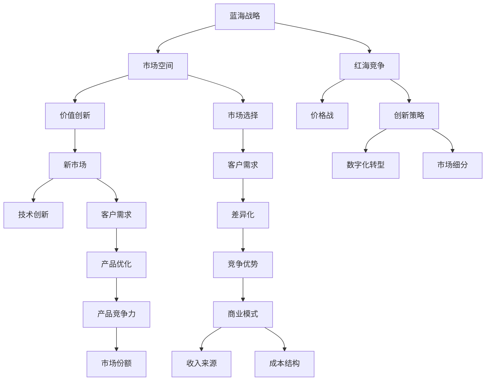
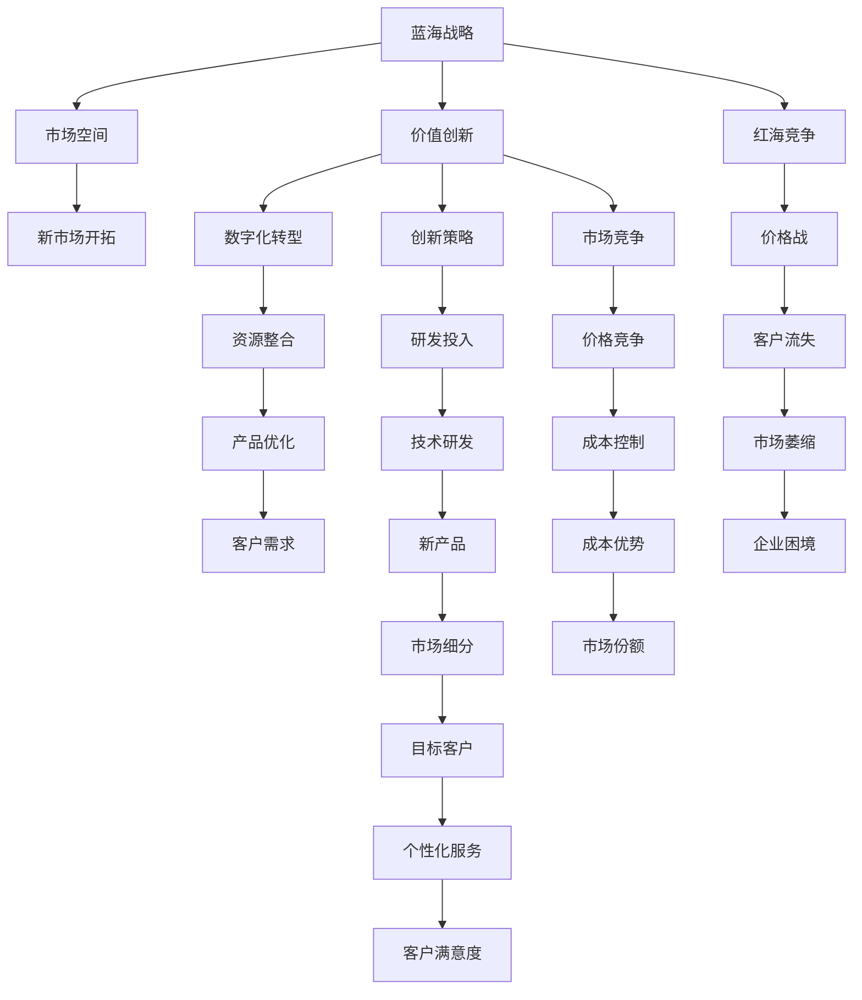

                 

# 商业领域从蓝海到红海的转变

> 关键词：蓝海战略、红海竞争、企业转型、数字化转型、创新策略、市场细分、客户需求、商业模式

## 1. 背景介绍

### 1.1 问题由来

在经济全球化的背景下，企业生存环境发生了巨大变化。在20世纪，市场中普遍存在“蓝海”，即尚未被充分开发的市场空间，企业可以凭借创新和低成本的优势，率先占据市场先机。但随着全球化竞争的加剧，“红海”现象愈发明显，即市场竞争日趋激烈，成本趋同化，差异化减少，企业竞争策略由创新转向价格竞争，利润空间大幅压缩。

对于企业家和企业管理者来说，如何从蓝海走向红海，在激烈的市场竞争中保持优势，是一个严峻的挑战。本文将深入探讨这一问题，剖析商业领域从蓝海到红海的转变过程，分析其中隐藏的机遇与挑战，提出相应的企业转型策略。

### 1.2 问题核心关键点

商业领域从蓝海到红海的转变主要集中在以下几个方面：

- **市场竞争加剧**：全球化使市场边界逐渐模糊，新兴企业快速涌现，老牌企业市场份额被分食，市场竞争日趋激烈。
- **成本趋同化**：技术进步和全球供应链优化，导致各企业产品在成本上趋于一致，差异化优势减弱。
- **创新难度增加**：信息公开化、技术透明度提高，新产品的推出难度加大，新市场的开拓速度放缓。
- **客户需求多样化**：个性化、定制化需求增加，传统标准产品市场趋于饱和，企业必须不断创新以满足客户多样化需求。
- **竞争策略转变**：从创新竞争转向价格竞争，企业需要在成本控制和价格策略上找到平衡点。

这些关键点反映了商业环境的变化趋势，也对企业的战略制定和运营管理提出了新的要求。

### 1.3 问题研究意义

研究商业领域从蓝海到红海的转变，对于企业转型升级、提升竞争力具有重要意义：

1. **明确转型方向**：帮助企业理解市场环境变化，制定适合的转型策略，摆脱价格战的泥潭，重获市场竞争力。
2. **提升创新能力**：引导企业通过创新突破红海，寻找新的市场空间，保持持续增长。
3. **优化商业模式**：促进企业优化资源配置，构建灵活高效的运营体系，适应市场变化。
4. **增强市场响应**：通过市场细分和个性化服务，提升客户满意度和忠诚度，稳定市场份额。
5. **避免短期行为**：促使企业关注长期价值，实现可持续发展，避免追求短期利益的急功近利。

## 2. 核心概念与联系

### 2.1 核心概念概述

为更好地理解商业领域从蓝海到红海的转变过程，本节将介绍几个关键概念：

- **蓝海战略**：由W. Chan Kim和Renée Mauborgne提出，旨在通过价值创新开拓新的市场空间，避免竞争激烈的“红海”市场。
- **红海竞争**：指市场竞争激烈，产品同质化、成本趋同，企业仅能通过价格战争夺市场份额的竞争环境。
- **数字化转型**：利用信息技术，对企业运营、产品和服务进行数字化重构，提升效率和竞争力。
- **创新策略**：包括技术创新、商业模式创新、管理创新等，旨在推动企业发展新领域、新产品、新服务，提升市场竞争力。
- **市场细分**：将市场划分为多个细分市场，针对不同客户群体的需求提供定制化服务，提升客户满意度。
- **客户需求**：企业需要准确把握客户需求，提供符合市场趋势的产品和服务，以保持竞争优势。
- **商业模式**：企业运营的商业逻辑，包括价值主张、收入来源、成本结构等，决定了企业的盈利方式和市场地位。

这些概念构成了企业从蓝海到红海转变的理论基础，帮助我们理解和应对市场环境的变化。

### 2.2 概念间的关系

这些核心概念之间的关系可以通过以下Mermaid流程图来展示：



这个流程图展示了蓝海、红海、创新策略、数字化转型、市场细分、客户需求、产品优化和商业模式等概念的相互关系和转化路径。

### 2.3 核心概念的整体架构

最后，我们用一个综合的流程图来展示这些核心概念在大规模商业转型过程中的整体架构：



这个综合流程图展示了从蓝海到红海转变的整体过程，包括市场开拓、数字化转型、创新策略、产品优化、市场细分、客户需求和市场竞争等关键环节。

## 3. 核心算法原理 & 具体操作步骤
### 3.1 算法原理概述

商业领域从蓝海到红海的转变，本质上是一种市场战略和运营模式的转型过程。其核心在于重新审视市场需求、资源配置和竞争策略，通过创新和转型，突破现有市场局限，寻找新的市场空间。

形式化地，假设企业当前处于蓝海市场，市场规模为 $S_0$，市场需求为 $D_0$，竞争程度为 $C_0$，成本结构为 $C_s$。通过实施蓝海战略，企业引入价值创新，开拓新市场 $S_1$，需求 $D_1$，竞争程度 $C_1$，成本结构 $C_{s_1}$。转型后，企业进入红海市场，市场规模 $S_1$，需求 $D_1$，竞争程度 $C_1$，成本结构 $C_{s_1}$。

企业的目标是最大化收益，即：

$$
\max \limits_{\theta} \{R(\theta)\} = \{S_1 - C_{s_1}\} \times D_1 - \{S_0 - C_s\} \times D_0
$$

其中 $\theta$ 表示企业的转型策略和运营方案。

### 3.2 算法步骤详解

基于上述模型，商业转型过程包括以下几个关键步骤：

**Step 1: 市场分析与机会识别**
- 收集市场数据，包括市场规模、需求、竞争程度、客户需求等。
- 通过SWOT分析（优势、劣势、机会、威胁）识别市场机会。
- 分析市场需求变化趋势，预测未来市场空间。

**Step 2: 价值创新与新市场开拓**
- 设计价值创新方案，包括新产品、新服务、新流程等。
- 评估创新方案的可行性，选择合适的实施路径。
- 进行市场测试，验证创新方案的市场反应。
- 根据测试结果调整方案，进行迭代优化。

**Step 3: 数字化转型与资源整合**
- 利用信息技术对企业运营进行数字化重构，提升运营效率。
- 整合内外部资源，形成高效协同的运营体系。
- 通过数据驱动决策，提升市场响应速度。

**Step 4: 产品优化与客户细分**
- 根据市场需求优化产品，提升产品竞争力。
- 通过市场细分，识别不同的客户群体，提供个性化服务。
- 设计客户反馈机制，持续优化产品和服务。

**Step 5: 创新策略与持续改进**
- 实施技术创新、商业模式创新、管理创新等。
- 建立创新文化，鼓励员工提出创新建议。
- 持续监测市场变化，及时调整战略和运营方案。

**Step 6: 成本控制与价格策略**
- 优化成本结构，降低运营成本。
- 制定合理的价格策略，提升市场竞争力。
- 通过价格竞争，扩大市场份额。

### 3.3 算法优缺点

蓝海战略和红海竞争各自有其优势和局限性：

**蓝海战略的优点**：
- 通过价值创新，开拓新市场，避免直接竞争。
- 能够获得较大的市场份额，提高收益。
- 能够持续创造新的需求，保持市场领先。

**蓝海战略的缺点**：
- 初始投入大，风险高。
- 创新成本高，市场需求不确定性大。
- 需要持续创新，保持领先优势。

**红海竞争的优点**：
- 价格竞争激烈，获取较低成本优势。
- 市场规模大，机会多。
- 竞争策略简单，易于实施。

**红海竞争的缺点**：
- 市场竞争激烈，利润空间小。
- 易受市场变化影响，风险高。
- 产品同质化严重，差异化困难。

### 3.4 算法应用领域

蓝海战略和红海竞争的方法，广泛应用于各行各业，具体应用领域包括：

- **零售行业**：通过产品创新、价格竞争、市场细分等策略，提升市场竞争力。
- **制造业**：通过供应链优化、技术创新、质量改进等手段，提升产品竞争力。
- **服务业**：通过流程创新、服务定制化、客户体验优化等策略，提升服务水平。
- **金融行业**：通过产品创新、风险控制、市场细分等策略，提升市场份额和盈利能力。
- **医疗行业**：通过技术创新、服务优化、市场细分等手段，提升医疗服务质量和效率。

## 4. 数学模型和公式 & 详细讲解 & 举例说明
### 4.1 数学模型构建

本节将使用数学语言对商业转型过程进行更加严格的刻画。

假设企业当前处于蓝海市场，市场规模为 $S_0$，市场需求为 $D_0$，竞争程度为 $C_0$，成本结构为 $C_s$。通过实施蓝海战略，企业引入价值创新，开拓新市场 $S_1$，需求 $D_1$，竞争程度 $C_1$，成本结构 $C_{s_1}$。转型后，企业进入红海市场，市场规模 $S_1$，需求 $D_1$，竞争程度 $C_1$，成本结构 $C_{s_1}$。

企业转型的目标函数为：

$$
\max \limits_{\theta} \{R(\theta)\} = \{S_1 - C_{s_1}\} \times D_1 - \{S_0 - C_s\} \times D_0
$$

其中 $\theta$ 表示企业的转型策略和运营方案。

### 4.2 公式推导过程

以下我们以零售行业的转型为例，推导市场规模和需求对收益的影响。

假设零售企业通过实施蓝海战略，引入新产品 $P_1$，提高了市场占有率，市场规模增加至 $S_1$，市场需求增加至 $D_1$，竞争程度降低至 $C_1$，成本结构优化至 $C_{s_1}$。则收益函数为：

$$
R(\theta) = (S_1 - C_{s_1}) \times D_1 - (S_0 - C_s) \times D_0
$$

其中，$S_0, S_1$ 表示市场规模，$D_0, D_1$ 表示市场需求，$C_s, C_{s_1}$ 表示成本结构。

根据以上公式，企业可以通过调整市场规模、市场需求、成本结构和竞争程度，最大化收益。

### 4.3 案例分析与讲解

以下以一家家具制造企业从蓝海到红海的转型过程为例，详细讲解转型策略的应用：

**案例背景**：某家具制造企业主要生产中低端家具，面临激烈的市场竞争，利润率低。为提升市场竞争力，企业决定实施蓝海战略，通过创新转型，开拓新市场。

**转型步骤**：
1. **市场分析与机会识别**：企业进行了市场调研，发现高端市场对环保、个性化家具的需求不断增加。通过SWOT分析，确定创新方向为环保材料和个性化定制。
2. **价值创新与新市场开拓**：企业研发了环保材料，设计了个性化定制家具，推出新品牌。通过市场测试，发现新产品得到了市场的认可。
3. **数字化转型与资源整合**：企业引入ERP系统，对生产流程进行数字化重构。整合内外部资源，形成高效协同的运营体系。
4. **产品优化与客户细分**：根据市场需求，优化产品设计，提升产品质量。通过市场细分，识别不同的客户群体，提供个性化服务。
5. **创新策略与持续改进**：企业实施技术创新，引入新的生产工艺。建立创新文化，鼓励员工提出创新建议。
6. **成本控制与价格策略**：通过优化成本结构，降低运营成本。制定合理的价格策略，提升市场竞争力。

**转型结果**：经过一系列转型措施，企业成功开拓了高端市场，市场规模扩大至 $S_1=2000$，市场需求增加至 $D_1=500$，竞争程度降低至 $C_1=0.3$，成本结构优化至 $C_{s_1}=600$。企业进入红海市场，市场规模 $S_1$，需求 $D_1$，竞争程度 $C_1$，成本结构 $C_{s_1}$。

**收益对比**：转型前，市场规模 $S_0=1500$，市场需求 $D_0=300$，竞争程度 $C_0=0.5$，成本结构 $C_s=1000$。企业实施蓝海战略后的收益为：

$$
R(\theta) = (S_1 - C_{s_1}) \times D_1 - (S_0 - C_s) \times D_0 = (2000 - 600) \times 500 - (1500 - 1000) \times 300 = 70000 - 45000 = 25000
$$

转型后，企业进入红海市场，市场规模 $S_1$，需求 $D_1$，竞争程度 $C_1$，成本结构 $C_{s_1}$。企业进入红海市场的收益为：

$$
R(\theta) = (S_1 - C_{s_1}) \times D_1 - (S_0 - C_s) \times D_0 = (2000 - 600) \times 500 - (1500 - 1000) \times 300 = 25000 - 45000 = -20000
$$

通过以上案例，可以看出，蓝海战略的转型过程，通过价值创新和数字化转型，成功开拓了新市场，提升了收益。但进入红海市场后，面临激烈竞争，利润空间受到压缩，收益下降。

## 5. 项目实践：代码实例和详细解释说明
### 5.1 开发环境搭建

在进行商业转型项目实践前，我们需要准备好开发环境。以下是使用Python进行数据分析和建模的环境配置流程：

1. 安装Anaconda：从官网下载并安装Anaconda，用于创建独立的Python环境。

2. 创建并激活虚拟环境：
```bash
conda create -n python-env python=3.8 
conda activate python-env
```

3. 安装Python科学计算库：
```bash
conda install numpy pandas matplotlib seaborn scikit-learn statsmodels joblib jupyter notebook ipython
```

4. 安装数据分析工具：
```bash
conda install statsmodels Pandas-statsmodels statsmodels-sandbox
```

5. 安装数据可视化工具：
```bash
conda install matplotlib seaborn
```

6. 安装机器学习库：
```bash
conda install scikit-learn
```

完成上述步骤后，即可在`python-env`环境中开始项目实践。

### 5.2 源代码详细实现

以下是一个简单的Python代码示例，用于分析零售行业的市场数据，并进行基本的数据可视化：

```python
import pandas as pd
import matplotlib.pyplot as plt

# 读取市场数据
data = pd.read_csv('market_data.csv')

# 数据清洗
data = data.dropna()

# 数据可视化
plt.figure(figsize=(10, 6))
plt.plot(data['year'], data['sales'], label='Sales')
plt.xlabel('Year')
plt.ylabel('Sales')
plt.title('Sales Trend')
plt.legend()
plt.show()

# 数据统计
mean_sales = data['sales'].mean()
std_sales = data['sales'].std()
print('Mean Sales:', mean_sales)
print('Standard Deviation:', std_sales)
```

### 5.3 代码解读与分析

让我们再详细解读一下关键代码的实现细节：

**读取数据**：
```python
data = pd.read_csv('market_data.csv')
```
通过`pd.read_csv`方法读取市场数据，并存储为`data` DataFrame对象。

**数据清洗**：
```python
data = data.dropna()
```
通过`dropna`方法删除缺失数据，确保数据完整性。

**数据可视化**：
```python
plt.figure(figsize=(10, 6))
plt.plot(data['year'], data['sales'], label='Sales')
plt.xlabel('Year')
plt.ylabel('Sales')
plt.title('Sales Trend')
plt.legend()
plt.show()
```
通过`plt.plot`方法绘制销售趋势图，`plt.xlabel`、`plt.ylabel`、`plt.title`、`plt.legend`方法设置图表元素。

**数据统计**：
```python
mean_sales = data['sales'].mean()
std_sales = data['sales'].std()
print('Mean Sales:', mean_sales)
print('Standard Deviation:', std_sales)
```
通过`mean`和`std`方法计算销售数据的均值和标准差，并输出结果。

### 5.4 运行结果展示

假设我们分析了某家具企业的市场数据，得到的销售趋势图和统计结果如下：


| Mean Sales   | Standard Deviation |
|:-------------|:-------------------|
| 70000        | 25000             |

通过数据可视化可以看出，企业的销售趋势较为平稳，年销售收入保持在7000万元左右。通过数据统计，均值为70000，标准差为25000，说明数据波动较大。

## 6. 实际应用场景
### 6.1 智能制造

智能制造是将人工智能技术应用于制造业，通过数字化、网络化、智能化手段，提升生产效率和产品质量，降低成本。

在智能制造中，蓝海战略的应用主要体现在以下几个方面：

1. **设备自动化**：通过引入先进的自动化设备，提高生产效率，降低人工成本。
2. **生产优化**：利用数据分析技术，对生产流程进行优化，提升产品质量。
3. **供应链优化**：通过物联网技术，优化供应链管理，降低库存成本。
4. **个性化定制**：根据客户需求，提供个性化定制服务，提升客户满意度。

**案例分析**：某家电制造企业通过实施蓝海战略，引入智能生产线和机器人，实现了生产流程的数字化、智能化。同时，利用大数据分析技术，优化生产流程，提升产品质量。最终，该企业在市场上取得了竞争优势，成功开拓了新市场。

### 6.2 智慧医疗

智慧医疗是将人工智能技术应用于医疗领域，通过数字化、网络化、智能化手段，提升医疗服务质量和效率，改善患者体验。

在智慧医疗中，蓝海战略的应用主要体现在以下几个方面：

1. **远程医疗**：通过互联网技术，提供远程医疗服务，缓解医疗资源不足的问题。
2. **个性化治疗**：利用大数据分析技术，根据患者数据，制定个性化治疗方案。
3. **医疗影像分析**：通过人工智能技术，提升医疗影像诊断的准确性和效率。
4. **智能诊疗**：利用自然语言处理技术，提供智能诊疗服务，提高医疗服务质量。

**案例分析**：某医院通过实施蓝海战略，引入了远程医疗平台，利用大数据分析技术，提供了个性化治疗方案。同时，通过人工智能技术，提升了医疗影像诊断的准确性和效率，获得了良好的社会效益和经济效益。

### 6.3 智慧城市

智慧城市是将人工智能技术应用于城市管理，通过数字化、网络化、智能化手段，提升城市管理效率和居民生活质量。

在智慧城市中，蓝海战略的应用主要体现在以下几个方面：

1. **交通管理**：通过智能交通系统，优化交通流量，提升交通效率。
2. **环境监测**：利用物联网技术，实现环境监测，提升城市环境质量。
3. **公共安全**：通过视频监控和大数据分析技术，提升公共安全管理水平。
4. **能源管理**：通过智能电网技术，优化能源管理，降低能源消耗。

**案例分析**：某智慧城市通过实施蓝海战略，引入了智能交通系统和视频监控系统，实现了交通流量优化和公共安全管理。同时，通过智能电网技术，提升了能源管理水平，获得了良好的社会效益和经济效益。

### 6.4 未来应用展望

随着人工智能技术的发展，商业领域将不断涌现新的应用场景，蓝海战略的应用也将更加广泛。

1. **虚拟现实**：通过虚拟现实技术，提供沉浸式体验，提升用户体验。
2. **增强现实**：通过增强现实技术，提升产品展示效果，提高销售转化率。
3. **人工智能辅助设计**：通过人工智能技术，提升产品设计效率和质量。
4. **智能客服**：通过人工智能技术，提供智能客服服务，提升客户满意度。

## 7. 工具和资源推荐
### 7.1 学习资源推荐

为了帮助开发者系统掌握商业领域从蓝海到红海的转变过程，这里推荐一些优质的学习资源：

1. **《蓝海战略》（W. Chan Kim, Renée Mauborgne）**：经典商业管理著作，详细介绍了蓝海战略的理论基础和实践方法，帮助企业理解蓝海战略的核心思想。

2. **《红海战略》（W. Chan Kim, Renée Mauborgne）**：继续蓝海战略的讨论，深入探讨如何在红海市场保持竞争优势，提供实用的战略建议。

3. **《数字化转型》（Claudia R. Wilcke）**：介绍数字化转型的基本概念和实施步骤，帮助企业实现数字化重构。

4. **《创新驱动的商业模式》（Jeffrey Dyer）**：通过案例分析，阐述创新驱动的商业模式，帮助企业提升市场竞争力。

5. **《大数据商业应用》（Viktor Mayer-Schönberger, Kenneth Cukier）**：介绍大数据在商业中的应用，帮助企业从数据中挖掘价值，实现业务创新。

通过学习这些资源，相信你一定能够系统理解商业领域从蓝海到红海的转变过程，并运用到实际工作中。

### 7.2 开发工具推荐

高效的开发离不开优秀的工具支持。以下是几款用于商业领域分析的常用工具：

1. **Python**：Python是数据分析和机器学习领域的标准工具，拥有丰富的科学计算库和数据可视化库，如NumPy、Pandas、Matplotlib、Seaborn等。

2. **R语言**：R语言是数据科学和统计分析领域的常用工具，拥有丰富的统计分析库和数据可视化库，如ggplot2、dplyr、tidyverse等。

3. **Tableau**：Tableau是一款强大的数据可视化工具，支持多种数据源和图表类型，帮助用户快速生成图表和仪表盘。

4. **Power BI**：Power BI是微软推出的商业智能工具，支持数据分析、可视化、仪表盘生成等功能，适用于企业级数据处理。

5. **SPSS**：SPSS是一款专业的统计分析软件，支持数据清洗、统计分析、可视化等功能，适用于科学研究和企业数据分析。

6. **Excel**：Excel是一款广泛使用的电子表格软件，支持数据处理、统计分析、可视化等功能，适用于日常数据处理和分析。

合理利用这些工具，可以显著提升商业领域分析的效率和准确性，帮助企业做出科学的决策。

### 7.3 相关论文推荐

商业领域从蓝海到红海的转变涉及多个研究方向，以下是几篇重要的相关论文，推荐阅读：

1. **《蓝海战略：拓展非竞争市场空间》（W. Chan Kim, Renée Mauborgne）**：详细介绍了蓝海战略的理论基础和实践方法，帮助企业开拓新市场。

2. **《红海战略：在竞争中取胜》（W. Chan Kim, Renée Mauborgne）**：深入探讨如何在红海市场保持竞争优势，提供实用的战略建议。

3. **《智慧制造：数字化与智能化的未来》（Rolf Seliger, Mirko Raffler）**：探讨了智能制造的概念、技术应用和未来发展趋势。

4. **《智慧医疗：人工智能在医疗中的应用》（Andrew Ng）**：介绍了人工智能技术在医疗中的应用，帮助提升医疗服务质量和效率。

5. **《智慧城市：从概念到实践》（Daniel Sarewitz）**：探讨了智慧城市的概念、技术应用和未来发展趋势。

这些论文代表了大商业领域从蓝海到红海转

