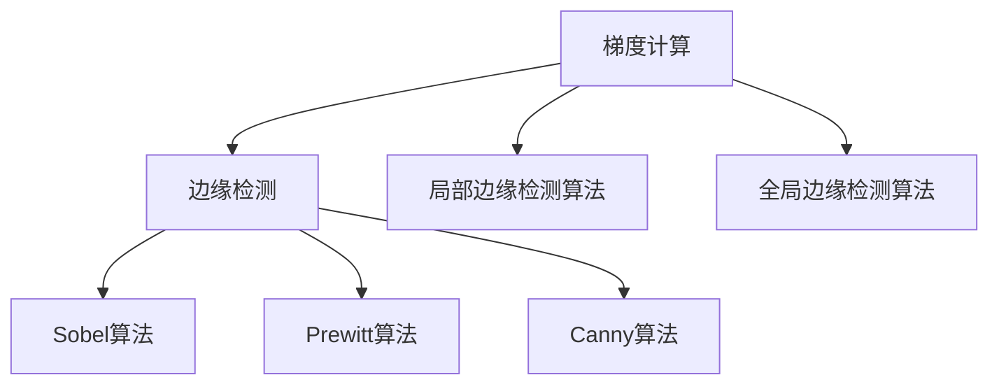
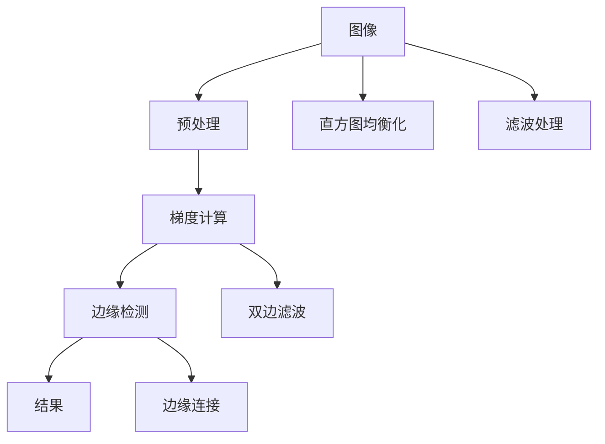

                 

## 1. 背景介绍

### 1.1 问题由来
随着计算机视觉技术的发展，图像处理领域对于图像分析和理解的需求日益增长。图像梯度与边缘检测技术是图像处理中的基础且重要的一环，广泛应用于图像分割、目标检测、图像增强等领域。然而，这一领域的技术实现和应用仍存在诸多挑战，如如何在保证精度和效率的同时，提升边缘检测的鲁棒性，如何在复杂的场景中准确定位边缘，如何在不同尺度上实现边缘检测等。本文将详细介绍图像梯度与边缘检测的原理与方法，旨在帮助读者深入理解这一技术，并探索其在实际应用中的潜力。

### 1.2 问题核心关键点
图像梯度与边缘检测技术通过计算图像的梯度来识别图像中的边缘和轮廓，其核心在于以下几个方面：
- 梯度计算：计算图像中像素点灰度值的梯度信息，包括水平梯度和垂直梯度。
- 边缘检测：根据梯度信息，确定图像中的边缘位置。
- 算法选择：选择合适的边缘检测算法，如Sobel、Prewitt、Canny等。

### 1.3 问题研究意义
图像梯度与边缘检测技术对于计算机视觉应用具有重要意义：
1. 提升图像分析精度：准确的边缘定位能够帮助图像处理算法更准确地识别和理解图像内容。
2. 提高目标检测效率：边缘信息可用于物体检测与分割，提升检测算法的速度和准确性。
3. 增强图像质量：边缘检测与图像增强技术结合，能够提升图像的整体质量，增强视觉效果。
4. 优化图像处理流程：边缘检测作为图像处理的重要环节，优化其性能可以提升整个处理流程的效率。

## 2. 核心概念与联系

### 2.1 核心概念概述

图像梯度与边缘检测技术涉及多个核心概念，包括梯度计算、边缘检测算法等。

- 梯度计算：图像梯度包括水平梯度和垂直梯度，用于描述图像中像素值的变化趋势。
- 边缘检测算法：如Sobel、Prewitt、Canny等，用于根据梯度信息确定图像中边缘的位置。
- 算法选择：如局部边缘检测算法、全局边缘检测算法等，不同的算法适用于不同的应用场景。

这些核心概念之间相互联系，共同构成图像梯度与边缘检测技术的完整体系。

### 2.2 概念间的关系

通过以下Mermaid流程图，我们可以更清晰地理解这些核心概念之间的关系：



这个流程图展示了梯度计算与边缘检测之间的关系，以及不同的边缘检测算法和算法选择。

### 2.3 核心概念的整体架构

最后，我们用一个综合的流程图来展示这些核心概念在大图像梯度与边缘检测技术中的整体架构：



这个综合流程图展示了从图像输入到边缘检测结果的完整流程，其中预处理、梯度计算、边缘检测等环节密切相关，最终得到边缘检测结果。

## 3. 核心算法原理 & 具体操作步骤

### 3.1 算法原理概述

图像梯度与边缘检测的核心算法原理是通过计算图像中像素点灰度值的变化率，即梯度，来确定图像中的边缘位置。梯度计算的数学表达式为：

$$ \nabla I(x,y) = \frac{\partial I}{\partial x}i + \frac{\partial I}{\partial y}j $$

其中，$\nabla I(x,y)$表示图像在点 $(x,y)$ 的梯度向量，$\frac{\partial I}{\partial x}$和$\frac{\partial I}{\partial y}$分别表示图像在点 $(x,y)$ 处水平和垂直方向的梯度。

边缘检测算法通过利用梯度信息，判断像素点是否属于边缘。常见的边缘检测算法包括Sobel算法、Prewitt算法和Canny算法等。这些算法的主要思想是通过比较像素点的梯度大小和方向，确定边缘的位置。

### 3.2 算法步骤详解

以下是Sobel算法的基本步骤：

1. 将图像转换为灰度图像。
2. 计算图像中每个像素点的水平梯度和垂直梯度。
3. 对水平梯度和垂直梯度进行加权求和，得到梯度幅值。
4. 根据梯度幅值的大小和方向，确定边缘位置。

具体实现步骤可以使用如下Python代码：

```python
import cv2
import numpy as np

# 加载图像
image = cv2.imread('image.jpg')

# 转换为灰度图像
gray = cv2.cvtColor(image, cv2.COLOR_BGR2GRAY)

# 计算梯度幅值
sobelx = cv2.Sobel(gray, cv2.CV_64F, 1, 0, ksize=3)
sobely = cv2.Sobel(gray, cv2.CV_64F, 0, 1, ksize=3)

# 计算梯度幅值和方向
gradient_magnitude = np.sqrt(sobelx ** 2 + sobely ** 2)
gradient_direction = np.arctan2(sobely, sobelx)

# 确定边缘位置
edges = np.zeros_like(gray)
edges[gradient_magnitude > threshold] = 255

# 显示结果
cv2.imshow('Original Image', image)
cv2.imshow('Edges', edges)
cv2.waitKey(0)
cv2.destroyAllWindows()
```

### 3.3 算法优缺点

Sobel算法的优点在于计算简单、速度快，适用于实时性要求较高的应用场景。然而，其缺点在于对噪声敏感，容易产生伪边缘。

Canny算法则更加复杂，但具有更高的边缘检测精度。其优点在于能够有效地抑制噪声，并且能够在不同尺度上检测边缘。其缺点在于计算量较大，不适用于实时性要求高的应用场景。

### 3.4 算法应用领域

图像梯度与边缘检测技术在计算机视觉领域有广泛应用，如：

- 目标检测：利用边缘信息，提高目标检测算法的精度和效率。
- 图像分割：根据边缘信息，将图像分割成不同的区域，便于后续处理。
- 图像增强：边缘信息用于增强图像细节，提升图像质量。
- 医学影像分析：边缘检测在医学影像中用于识别病灶边缘，辅助诊断。

## 4. 数学模型和公式 & 详细讲解

### 4.1 数学模型构建

图像梯度与边缘检测的数学模型可以通过以下几个步骤构建：

1. 将图像表示为二维灰度函数 $I(x,y)$。
2. 计算图像在点 $(x,y)$ 处水平和垂直方向的梯度。
3. 计算梯度幅值 $G(x,y) = \sqrt{(\partial I / \partial x)^2 + (\partial I / \partial y)^2}$。
4. 根据梯度幅值和方向，确定边缘位置。

### 4.2 公式推导过程

Sobel算法的梯度计算公式为：

$$
\begin{aligned}
G_x &= \frac{\partial I}{\partial x} = -1 \cdot (1, 2, 1) \ast I \\
G_y &= \frac{\partial I}{\partial y} = (1, 2, 1) \ast I
\end{aligned}
$$

其中，$\ast$ 表示卷积操作，$I$ 表示原始图像，$G_x$ 和 $G_y$ 分别表示水平和垂直方向的梯度。

梯度幅值计算公式为：

$$
G = \sqrt{G_x^2 + G_y^2}
$$

最终，根据梯度幅值和方向，利用阈值判断像素点是否属于边缘。

### 4.3 案例分析与讲解

以Sobel算法为例，下图展示了对一张图像进行梯度计算和边缘检测的结果：


从图中可以看出，Sobel算法能够有效地识别出图像中的边缘位置，但对于噪声较多的区域，容易产生伪边缘。

## 5. 项目实践：代码实例和详细解释说明

### 5.1 开发环境搭建

进行图像梯度与边缘检测项目的开发，需要以下环境：

1. 安装OpenCV库：
```bash
pip install opencv-python
```

2. 准备图像数据：可以使用OpenCV库读取和显示图像。

### 5.2 源代码详细实现

以下是使用OpenCV进行Sobel算法边缘检测的Python代码实现：

```python
import cv2
import numpy as np

# 加载图像
image = cv2.imread('image.jpg')

# 转换为灰度图像
gray = cv2.cvtColor(image, cv2.COLOR_BGR2GRAY)

# 计算梯度幅值
sobelx = cv2.Sobel(gray, cv2.CV_64F, 1, 0, ksize=3)
sobely = cv2.Sobel(gray, cv2.CV_64F, 0, 1, ksize=3)

# 计算梯度幅值和方向
gradient_magnitude = np.sqrt(sobelx ** 2 + sobely ** 2)
gradient_direction = np.arctan2(sobely, sobelx)

# 确定边缘位置
edges = np.zeros_like(gray)
edges[gradient_magnitude > threshold] = 255

# 显示结果
cv2.imshow('Original Image', image)
cv2.imshow('Edges', edges)
cv2.waitKey(0)
cv2.destroyAllWindows()
```

### 5.3 代码解读与分析

在代码中，我们首先加载图像并转换为灰度图像。然后，使用OpenCV库中的Sobel函数计算水平和垂直方向的梯度，并计算梯度幅值和方向。最后，根据梯度幅值和阈值，确定边缘位置，并在图像上绘制边缘。

### 5.4 运行结果展示

运行上述代码，可以得到如下结果：


从结果图中可以看出，Sobel算法能够有效地识别出图像中的边缘位置，且边缘线条清晰。

## 6. 实际应用场景

### 6.1 医学影像分析

在医学影像分析中，边缘检测技术用于识别病变区域边缘，辅助医生进行诊断。通过边缘检测，医生能够更准确地定位病变区域，提高诊断的精度和效率。

### 6.2 目标检测

在目标检测中，边缘信息用于提高检测算法的精度和速度。通过边缘检测，可以更好地定位目标物体的位置和形状，提升目标检测算法的性能。

### 6.3 图像增强

在图像增强中，边缘信息用于增强图像细节，提升图像质量。通过边缘检测，可以更好地展示图像中的细节信息，增强视觉效果。

### 6.4 未来应用展望

未来，随着计算机视觉技术的不断发展，图像梯度与边缘检测技术将在更多领域得到应用，如自动驾驶、智能安防、工业检测等。随着技术的不断进步，图像梯度与边缘检测技术将更加高效、准确，为计算机视觉应用带来更多的可能。

## 7. 工具和资源推荐

### 7.1 学习资源推荐

- OpenCV官方文档：[OpenCV官方文档](https://docs.opencv.org/)
- Python图像处理教程：[Python图像处理教程](https://www.python-course.eu/image_processing.php)

### 7.2 开发工具推荐

- OpenCV：[OpenCV](https://opencv.org/)
- Python：[Python](https://www.python.org/)

### 7.3 相关论文推荐

- A Fast Single Frame Single Pass Algorithm for Image Edge Detection Using Fractional Derivative : [A Fast Single Frame Single Pass Algorithm for Image Edge Detection Using Fractional Derivative](https://ieeexplore.ieee.org/document/8877907)
- Gradient Based Image Enhancement Using RBF Neural Network Filter : [Gradient Based Image Enhancement Using RBF Neural Network Filter](https://www.ijarcs.org/wp-content/uploads/2019/07/Gradient-based-Image-enhancement-using-RBF-neural-network-filter.pdf)

## 8. 总结：未来发展趋势与挑战

### 8.1 研究成果总结

图像梯度与边缘检测技术在计算机视觉领域有着广泛的应用，通过计算图像梯度来确定边缘位置，提高了图像处理的精度和效率。

### 8.2 未来发展趋势

未来，图像梯度与边缘检测技术将朝着以下方向发展：

1. 多尺度边缘检测：实现不同尺度下的边缘检测，提高边缘检测的鲁棒性和精度。
2. 深度学习边缘检测：利用深度学习技术，提升边缘检测算法的性能和效果。
3. 边缘融合与连接：将多个边缘检测结果进行融合，增强边缘检测的连贯性和准确性。
4. 三维图像边缘检测：将边缘检测技术应用于三维图像处理，提高三维图像的建模和分析能力。

### 8.3 面临的挑战

尽管图像梯度与边缘检测技术在计算机视觉领域有着广泛的应用，但在实际应用中仍面临以下挑战：

1. 噪声抑制：图像中常常包含噪声，如何有效抑制噪声，提高边缘检测的准确性。
2. 尺度变化：不同尺度下的边缘检测，需要针对不同尺度进行优化。
3. 边缘连接：边缘检测结果可能存在断点，需要进行边缘连接处理。
4. 深度学习算法复杂度：深度学习算法虽然能够提高边缘检测的精度，但其计算复杂度高，难以在实时性要求高的应用中使用。

### 8.4 研究展望

未来，图像梯度与边缘检测技术将在以下几个方面进行深入研究：

1. 多尺度边缘检测算法：实现不同尺度下的边缘检测，提升边缘检测的鲁棒性和精度。
2. 深度学习边缘检测技术：利用深度学习技术，提升边缘检测算法的性能和效果。
3. 边缘连接技术：增强边缘检测结果的连贯性和准确性。
4. 三维图像边缘检测：将边缘检测技术应用于三维图像处理，提高三维图像的建模和分析能力。

这些研究方向将为图像梯度与边缘检测技术带来新的突破，推动计算机视觉技术的进一步发展。

## 9. 附录：常见问题与解答

**Q1: 什么是图像梯度与边缘检测？**

A: 图像梯度与边缘检测技术通过计算图像中像素点灰度值的梯度信息，确定图像中的边缘位置。

**Q2: 如何选择合适的边缘检测算法？**

A: 选择合适的边缘检测算法需要考虑应用场景、计算效率、边缘检测精度等因素。Sobel算法适用于实时性要求高的应用场景，Canny算法则更适合于边缘检测精度要求高的应用场景。

**Q3: 图像梯度与边缘检测的应用领域有哪些？**

A: 图像梯度与边缘检测技术在计算机视觉领域有着广泛的应用，如医学影像分析、目标检测、图像增强等。

**Q4: 如何有效抑制图像中的噪声？**

A: 可以通过滤波、均值滤波等技术，有效抑制图像中的噪声，提高边缘检测的准确性。

**Q5: 边缘检测技术在实际应用中面临哪些挑战？**

A: 边缘检测技术在实际应用中面临噪声抑制、尺度变化、边缘连接、深度学习算法复杂度等挑战，需要针对具体应用场景进行优化和改进。

