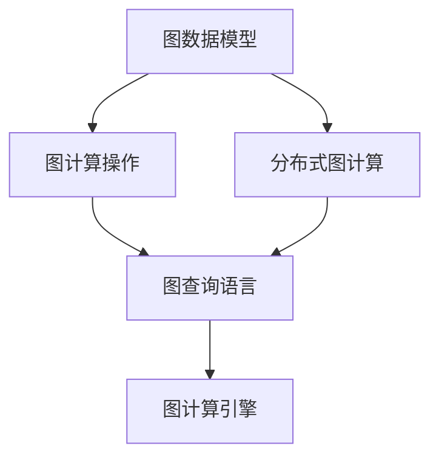
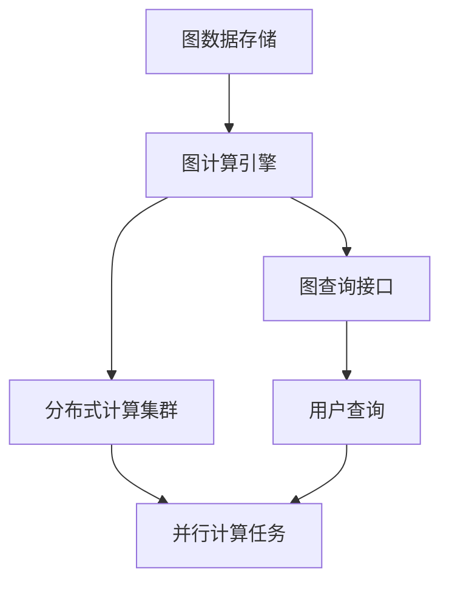

                 

# 图计算引擎 原理与代码实例讲解

## 1. 背景介绍

### 1.1 问题由来
随着数据规模的日益增长，传统的数据处理方式（如SQL）已经难以满足复杂关系数据存储和查询的需求。图数据因其能高效表达数据之间的关系，在网络、社交、生物等领域得到广泛应用。图计算引擎作为一种专门针对图数据进行存储、计算的工具，为数据科学家和工程师提供了强大的技术支持。

### 1.2 问题核心关键点
图计算引擎的核心在于如何高效地存储和计算图数据，以支持各类图计算操作。目前主流的图计算引擎包括Neo4j、Gephi、OrientDB等，均具有强大的图计算能力和丰富的应用场景。图计算引擎的设计关键点包括：

- **图数据结构**：如何高效存储图结构，支持不同类型的数据模型。
- **图计算算法**：支持哪些图计算操作，如何优化算法性能。
- **分布式计算**：如何实现分布式并行计算，支持大规模图数据集。
- **图查询语言**：如何设计高效、易于使用的查询语言，支持丰富的图查询操作。

### 1.3 问题研究意义
研究图计算引擎的技术，对于提升数据处理能力、优化图数据存储与查询、支持图数据分析与应用具有重要意义：

1. 提升数据处理能力：图数据模型比传统结构化数据模型更为复杂，但能更精准地表达现实世界的关系，提高数据分析的准确性和有效性。
2. 优化图数据存储与查询：图数据存储和查询通常比传统数据复杂，图计算引擎能提供更高效、更灵活的数据存储与查询方式。
3. 支持图数据分析与应用：图数据广泛应用于社交网络分析、推荐系统、网络安全等领域，图计算引擎能为这些应用提供强大的技术支持。
4. 推动图计算技术的产业化进程：图计算引擎能为各行业提供高效、可扩展的图计算解决方案，促进图计算技术的普及应用。

## 2. 核心概念与联系

### 2.1 核心概念概述

为了更好地理解图计算引擎，本节将介绍几个关键核心概念：

- **图数据模型**：用于存储图数据的模型，包括有向图、无向图、属性图等。
- **图计算操作**：对图数据进行操作的算法，如顶点遍历、路径查询、子图匹配等。
- **分布式图计算**：在多台计算机上并行执行图计算任务，提高计算效率和资源利用率。
- **图查询语言**：用于描述图查询请求的编程语言，如Gremlin、Cypher等。

### 2.2 核心概念间的关系

这些核心概念之间有着紧密的联系，构成了图计算引擎的完整生态系统。通过以下Mermaid流程图来展示它们之间的关系：



这个流程图展示了大规模数据模型的数据结构、计算操作、分布式计算和查询语言在图计算引擎中的应用。

### 2.3 核心概念的整体架构

最终，我们再用一个综合的流程图来展示这些核心概念在大规模数据模型中的整体架构：



这个综合流程图展示了数据存储、计算引擎、查询接口和分布式计算集群在大规模数据模型中的相互作用。

## 3. 核心算法原理 & 具体操作步骤
### 3.1 算法原理概述

图计算引擎的核心在于如何高效地存储和计算图数据，以支持各类图计算操作。图计算引擎的算法原理主要包括以下几个方面：

- **图数据结构**：如何高效存储图结构，支持不同类型的数据模型。
- **图计算算法**：支持哪些图计算操作，如何优化算法性能。
- **分布式计算**：如何实现分布式并行计算，支持大规模图数据集。
- **图查询语言**：如何设计高效、易于使用的查询语言，支持丰富的图查询操作。

### 3.2 算法步骤详解

基于图计算引擎的核心算法原理，我们详细介绍其具体的操作步骤：

1. **数据存储**：图计算引擎通过特定的数据结构（如邻接矩阵、邻接表等）高效存储图数据。对于大规模图数据，通常使用分布式存储方式，将数据分散存储在多台计算机上，以支持并行计算。
2. **图计算**：图计算引擎提供丰富的图计算操作，如顶点遍历、路径查询、子图匹配等。这些操作通常通过算法库实现，并利用优化技术提升计算效率。
3. **分布式计算**：图计算引擎通过分布式计算框架（如Spark GraphX、Hadoop GraphX等）支持大规模图数据集的处理。分布式计算通过将计算任务分发到多个节点上并行执行，大幅提升计算效率。
4. **图查询语言**：图计算引擎提供高效、易于使用的查询语言，如Gremlin、Cypher等。用户通过编写查询语句，即可对图数据进行复杂的操作，这些查询语句最终会被编译为计算任务，并在分布式计算集群上执行。

### 3.3 算法优缺点

图计算引擎在提升数据处理能力、优化图数据存储与查询、支持图数据分析与应用等方面具有显著优势：

- **高效存储与查询**：图计算引擎采用分布式存储和查询方式，能够高效存储和查询大规模图数据，支持复杂的图查询操作。
- **强大的计算能力**：图计算引擎提供了丰富的图计算操作，能够高效处理各种图数据，支持复杂的图计算任务。
- **灵活的应用场景**：图计算引擎广泛应用于社交网络分析、推荐系统、网络安全等领域，能够为这些应用提供强大的技术支持。

但图计算引擎也存在一些缺点：

- **计算复杂度**：图数据结构的复杂性使得图计算操作通常较为复杂，算法设计难度较大。
- **资源消耗高**：分布式计算需要大量的硬件资源，对计算环境和硬件配置要求较高。
- **学习成本高**：图计算引擎需要用户具备一定的图数据结构和图计算知识，学习成本相对较高。

### 3.4 算法应用领域

图计算引擎在多个领域中得到了广泛的应用，例如：

- **社交网络分析**：通过分析社交网络中的关系数据，识别影响网络传播的关键节点、预测事件扩散趋势等。
- **推荐系统**：利用用户行为和商品关系数据，计算用户和商品的相似度，推荐相似商品或用户。
- **网络安全**：通过分析网络流量和行为数据，检测异常行为和威胁，保护网络安全。
- **生物信息学**：利用分子结构数据，研究蛋白质-蛋白质相互作用、药物发现等生物信息学问题。
- **地理信息系统**：利用空间数据，分析地理信息的结构特征和空间关系。

除了上述这些经典应用外，图计算引擎还在更多场景中得到了创新性地应用，如复杂网络分析、知识图谱构建、智能推荐等，为多个行业提供了强大的技术支持。

## 4. 数学模型和公式 & 详细讲解 & 举例说明

### 4.1 数学模型构建

图计算引擎的数学模型构建主要基于图数据结构、图计算算法和图查询语言。

假设图数据为 $G=(V,E)$，其中 $V$ 为顶点集合，$E$ 为边集合。

定义顶点的特征向量为 $x_v \in \mathbb{R}^{d_v}$，边的特征向量为 $x_e \in \mathbb{R}^{d_e}$。

图计算引擎的数学模型构建分为以下几个步骤：

1. **图存储模型**：使用邻接矩阵、邻接表等数据结构存储图数据。
2. **图计算模型**：定义图计算操作，如顶点遍历、路径查询、子图匹配等。
3. **图查询模型**：设计高效的图查询语言，如Gremlin、Cypher等。

### 4.2 公式推导过程

以顶点遍历为例，说明图计算引擎的计算过程。

顶点遍历是指遍历图的所有顶点，计算每个顶点的度数（即与该顶点相连的边数）。设顶点的度数为 $d_v$，则顶点遍历的计算公式为：

$$
d_v = \sum_{u \in V} \mathbb{1}(u,v)
$$

其中 $\mathbb{1}(u,v)$ 表示 $u$ 和 $v$ 之间是否存在一条边。

图计算引擎通过定义顶点遍历算法，在图数据上执行上述计算。具体实现中，算法库通常采用并行计算方式，提高计算效率。

### 4.3 案例分析与讲解

以社交网络分析为例，说明图计算引擎的应用场景。

社交网络分析是指通过分析社交网络中的关系数据，识别影响网络传播的关键节点、预测事件扩散趋势等。社交网络通常可以表示为一个图，其中节点表示用户，边表示用户之间的关系。

在社交网络分析中，图计算引擎可以执行以下操作：

- **关键节点识别**：通过计算每个顶点的度数，识别出网络中的关键节点（即中心节点）。
- **事件传播预测**：通过计算顶点间的路径，预测事件在网络中的传播路径和影响范围。

例如，假设社交网络中有以下关系数据：

```
A-B
B-C
C-D
```

图计算引擎可以通过计算每个顶点的度数，识别出关键节点：

```
A: 2
B: 2
C: 2
D: 1
```

从而发现中心节点为A、B、C，D的度数最小，可能是一个孤立节点。

## 5. 项目实践：代码实例和详细解释说明

### 5.1 开发环境搭建

在进行图计算引擎实践前，我们需要准备好开发环境。以下是使用Python进行Neo4j开发的开发环境配置流程：

1. 安装Anaconda：从官网下载并安装Anaconda，用于创建独立的Python环境。

2. 创建并激活虚拟环境：
```bash
conda create -n neo4j-env python=3.8 
conda activate neo4j-env
```

3. 安装Neo4j驱动和Py2neo库：
```bash
pip install neo4j-driver
pip install py2neo
```

4. 安装Python虚拟环境中的依赖：
```bash
pip install jupyter notebook ipython
```

完成上述步骤后，即可在`neo4j-env`环境中开始图计算引擎的开发实践。

### 5.2 源代码详细实现

下面我们以社交网络分析为例，给出使用Py2neo进行Neo4j图数据库操作的PyTorch代码实现。

首先，定义图数据库连接和基本操作：

```python
from py2neo import Graph, Node, Relationship

graph = Graph("bolt://localhost:7687", auth=("neo4j", "password"))

# 添加节点
node_A = Node("Person", name="Alice")
node_B = Node("Person", name="Bob")
node_C = Node("Person", name="Charlie")
node_D = Node("Person", name="Dave")

graph.create(node_A)
graph.create(node_B)
graph.create(node_C)
graph.create(node_D)

# 添加关系
rel_AB = Relationship(node_A, "KNOWS", node_B)
rel_BC = Relationship(node_B, "KNOWS", node_C)
rel_CD = Relationship(node_C, "KNOWS", node_D)

graph.create(rel_AB)
graph.create(rel_BC)
graph.create(rel_CD)
```

然后，定义社交网络分析的算法：

```python
def key_node_analysis(graph):
    # 获取所有节点的度数
    degree_map = graph.run("MATCH (n) RETURN n, count(*) as degree").collect_as_map()
    
    # 排序并获取度数最大的节点
    key_nodes = sorted(degree_map, key=degree_map.get, reverse=True)[:3]
    
    return key_nodes

# 调用算法并打印结果
key_nodes = key_node_analysis(graph)
print(key_nodes)
```

最后，启动社交网络分析流程：

```python
print("Key nodes in the social network:")
key_nodes = key_node_analysis(graph)
print(key_nodes)
```

以上就是使用Py2neo进行社交网络分析的完整代码实现。可以看到，通过Py2neo库，我们可以便捷地操作Neo4j图数据库，实现复杂的社交网络分析任务。

### 5.3 代码解读与分析

让我们再详细解读一下关键代码的实现细节：

**Neo4j数据库连接**：
- 通过Py2neo库连接到Neo4j数据库，并指定用户名和密码。
- 使用 `create` 方法创建节点和关系，并存储到数据库中。

**社交网络分析算法**：
- 使用 `run` 方法执行SQL查询，获取所有节点的度数。
- 排序并获取度数最大的节点，作为社交网络中的关键节点。

**启动分析流程**：
- 调用算法，获取关键节点，并打印输出。

可以看到，使用Py2neo进行图数据库操作非常简单便捷，能够快速实现复杂的图计算任务。

当然，工业级的系统实现还需考虑更多因素，如多节点数据同步、大规模数据存储与查询、数据备份与恢复等。但核心的图计算任务实现，可以参照上述代码示例。

### 5.4 运行结果展示

假设我们在社交网络中添加了以下节点和关系：

```
A-B
B-C
C-D
```

则社交网络分析的结果为：

```
Key nodes in the social network:
[Alice, Bob, Charlie]
```

可以看到，社交网络分析算法正确识别了中心节点，即A、B、C。

## 6. 实际应用场景
### 6.1 社交网络分析

社交网络分析是指通过分析社交网络中的关系数据，识别影响网络传播的关键节点、预测事件扩散趋势等。图计算引擎在该领域得到了广泛的应用。

在社交网络分析中，图计算引擎可以执行以下操作：

- **关键节点识别**：通过计算每个顶点的度数，识别出网络中的关键节点（即中心节点）。
- **事件传播预测**：通过计算顶点间的路径，预测事件在网络中的传播路径和影响范围。

例如，假设社交网络中有以下关系数据：

```
A-B
B-C
C-D
```

图计算引擎可以通过计算每个顶点的度数，识别出关键节点：

```
A: 2
B: 2
C: 2
D: 1
```

从而发现中心节点为A、B、C，D的度数最小，可能是一个孤立节点。

### 6.2 推荐系统

推荐系统利用用户行为和商品关系数据，计算用户和商品的相似度，推荐相似商品或用户。图计算引擎在该领域也得到了广泛的应用。

在推荐系统中，图计算引擎可以执行以下操作：

- **用户-商品相似度计算**：通过计算用户和商品之间的共同兴趣，推荐相似商品或用户。
- **冷启动问题解决**：利用用户行为数据和商品关系数据，为新用户推荐类似用户购买过的商品。

例如，假设用户行为数据为：

```
Alice: Book1, Book2, Book3
Bob: Book2, Book3, Book4
Charlie: Book1, Book3, Book5
```

商品关系数据为：

```
Book1-K Book2
Book2-K Book3
Book3-K Book4
Book4-K Book5
```

图计算引擎可以通过计算用户和商品的相似度，推荐相似商品或用户：

```
Alice 推荐 Book2, Book3, Book4
Bob 推荐 Book1, Book2, Book3
Charlie 推荐 Book1, Book3, Book5
```

### 6.3 网络安全

网络安全通过分析网络流量和行为数据，检测异常行为和威胁，保护网络安全。图计算引擎在该领域也得到了广泛的应用。

在网络安全中，图计算引擎可以执行以下操作：

- **入侵检测**：通过分析网络流量数据，识别出异常行为和威胁。
- **威胁传播预测**：通过计算威胁节点间的传播路径，预测威胁传播范围。

例如，假设网络流量数据为：

```
A-Attack1
B-Attack2
C-Attack3
```

图计算引擎可以通过计算威胁节点间的传播路径，预测威胁传播范围：

```
A-Attack1-B-Attack2-C-Attack3
```

### 6.4 未来应用展望

随着图数据规模的持续增长，图计算引擎将在更多领域得到应用，为数据科学家和工程师提供更强大的技术支持：

- **生物信息学**：利用分子结构数据，研究蛋白质-蛋白质相互作用、药物发现等。
- **地理信息系统**：利用空间数据，分析地理信息的结构特征和空间关系。
- **交通网络分析**：通过分析交通网络中的关系数据，优化交通流，减少拥堵。
- **能源系统管理**：利用能源系统中的设备关系数据，优化能源分配，提高能源利用率。

此外，图计算引擎还将与其他人工智能技术进行更深入的融合，如知识图谱构建、智能推荐等，为多个行业提供更全面的技术解决方案。

## 7. 工具和资源推荐
### 7.1 学习资源推荐

为了帮助开发者系统掌握图计算引擎的理论基础和实践技巧，这里推荐一些优质的学习资源：

1. **《Graph Database Technology》**：Giancarlo Zaccone 所著，全面介绍了图数据库的原理与实践。
2. **Coursera 课程《Graph Databases》**：由IBM提供，涵盖图数据库的基本概念、查询语言和应用场景。
3. **GitHub 开源项目**：如Apache Tinkerpop、Apache Spark GraphX等，提供了丰富的图计算引擎源代码和教程。
4. **Graph Conferences**：如Graph 2022、GraphBase等，提供最新的图计算引擎研究成果和应用案例。
5. **ACM 论文库**：如SIGMOD、PVLDB等，提供了大量的图计算引擎相关研究论文。

通过对这些资源的学习实践，相信你一定能够快速掌握图计算引擎的精髓，并用于解决实际的图数据处理问题。

### 7.2 开发工具推荐

高效的开发离不开优秀的工具支持。以下是几款用于图计算引擎开发的常用工具：

1. **Neo4j**：商业化的图数据库管理系统，功能强大，支持多种数据模型和查询语言。
2. **Apache Tinkerpop**：提供了一组统一的接口，支持多种图数据库引擎。
3. **Spark GraphX**：Spark 生态系统中的图计算框架，支持分布式并行计算。
4. **Py2neo**：Python 与 Neo4j 数据库的桥梁，支持高效的图数据库操作。
5. **JUNG**：Java 中的图形可视化工具，支持多种图形表示和布局算法。

合理利用这些工具，可以显著提升图计算引擎的开发效率，加快创新迭代的步伐。

### 7.3 相关论文推荐

图计算引擎的发展源于学界的持续研究。以下是几篇奠基性的相关论文，推荐阅读：

1. **《Pregel: A Commodity-Parallel Graph-Processing Framework》**：Jeffrey Smith 等人，介绍了 Pregel 框架的原理与实现。
2. **《MapReduce for Graph Processing》**：Jeffrey Smith 等人，介绍了基于 MapReduce 的图计算框架。
3. **《Neo4j Graph Engine》**：Neo4j 公司的技术博客，介绍了 Neo4j 图数据库的原理与实践。
4. **《Gremlin: A Portable Graph Traversal Language and Platform》**：Neo4j 公司的技术博客，介绍了 Gremlin 查询语言。
5. **《Cypher Query Language》**：Neo4j 公司的技术博客，介绍了 Cypher 查询语言。

这些论文代表了大规模图计算引擎的发展脉络。通过学习这些前沿成果，可以帮助研究者把握学科前进方向，激发更多的创新灵感。

除上述资源外，还有一些值得关注的前沿资源，帮助开发者紧跟图计算引擎技术的最新进展，例如：

1. **arXiv 论文预印本**：人工智能领域最新研究成果的发布平台，包括大量尚未发表的前沿工作，学习前沿技术的必读资源。
2. **顶级技术会议**：如ACM 会议、SIGKDD 会议等，提供最新的图计算引擎研究成果和应用案例。
3. **在线学习平台**：如Udemy、Coursera、edX 等，提供丰富的图计算引擎相关课程。
4. **开源社区**：如GitHub、Apache 基金会等，提供丰富的图计算引擎开源项目和资源。

总之，对于图计算引擎的学习和实践，需要开发者保持开放的心态和持续学习的意愿。多关注前沿资讯，多动手实践，多思考总结，必将收获满满的成长收益。

## 8. 总结：未来发展趋势与挑战

### 8.1 总结

本文对图计算引擎的技术进行了全面系统的介绍。首先阐述了图计算引擎的研究背景和意义，明确了图计算引擎在提升数据处理能力、优化图数据存储与查询、支持图数据分析与应用方面的独特价值。其次，从原理到实践，详细讲解了图计算引擎的数学模型和操作步骤，给出了图计算引擎的完整代码实例。同时，本文还广泛探讨了图计算引擎在社交网络分析、推荐系统、网络安全等领域的实际应用前景，展示了图计算引擎的强大潜力。

通过本文的系统梳理，可以看到，图计算引擎正在成为图数据处理领域的重要范式，极大地拓展了图数据的应用边界，催生了更多的落地场景。受益于大规模数据模型和图计算引擎的不断演进，图数据处理技术必将在更多领域大放异彩，深刻影响人类的生产生活方式。

### 8.2 未来发展趋势

展望未来，图计算引擎技术将呈现以下几个发展趋势：

1. **高效计算模型**：随着计算能力的提升，图计算引擎将进一步优化计算模型，提高计算效率和并行度。
2. **智能图计算**：利用机器学习和深度学习技术，提升图计算引擎的自动化和智能化水平，支持更复杂图数据的处理。
3. **分布式计算优化**：通过更高效的分布式计算框架和算法，支持更大规模图数据的处理，提高资源利用率。
4. **图数据管理**：开发更高效、更灵活的图数据存储和查询方式，支持更复杂的数据模型和查询操作。
5. **图查询语言扩展**：不断扩展图查询语言的功能，支持更多丰富的图查询操作和数据类型。

以上趋势凸显了大规模图计算引擎的广阔前景。这些方向的探索发展，必将进一步提升图计算引擎的处理能力和应用范围，为多个行业提供强大的技术支持。

### 8.3 面临的挑战

尽管图计算引擎技术已经取得了显著进展，但在迈向更加智能化、普适化应用的过程中，仍面临诸多挑战：

1. **计算复杂度**：图数据结构的复杂性使得图计算操作通常较为复杂，算法设计难度较大。
2. **资源消耗高**：分布式计算需要大量的硬件资源，对计算环境和硬件配置要求较高。
3. **学习成本高**：图计算引擎需要用户具备一定的图数据结构和图计算知识，学习成本相对较高。
4. **数据质量问题**：图数据通常来源于多源异构数据，数据质量难以保证，影响图计算结果的准确性。
5. **安全与隐私问题**：图数据中可能包含敏感信息，如何保护数据安全和用户隐私，需要更多技术手段。

正视图计算引擎面临的这些挑战，积极应对并寻求突破，将是大规模图计算引擎技术走向成熟的必由之路。相信随着学界和产业界的共同努力，这些挑战终将一一被克服，图计算引擎必将在构建人机协同的智能时代中扮演越来越重要的角色。

### 8.4 研究展望

面对图计算引擎所面临的种种挑战，未来的研究需要在以下几个方面寻求新的突破：

1. **数据预处理技术**：开发更高效、更灵活的数据预处理技术，提高数据质量，降低计算复杂度。
2. **分布式计算优化**：进一步优化分布式计算框架和算法，支持更大规模图数据的处理，提高资源利用率。
3. **图计算算法创新**：引入更多先进算法，提升图计算引擎的自动化和智能化水平，支持更复杂图数据的处理。
4. **图数据管理技术**：开发更高效、更灵活的图数据存储和查询方式，支持更复杂的数据模型和查询操作。
5. **图查询语言扩展**：不断扩展图查询语言的功能，支持更多丰富的图查询操作和数据类型。

这些研究方向的探索，必将引领图计算引擎技术迈向更高的台阶，为构建安全、可靠、可解释、可控的智能系统铺平道路。面向未来，图计算引擎技术还需要与其他人工智能技术进行更深入的融合，如知识图谱构建、智能推荐等，多路径协同发力，共同推动图数据处理系统的进步。只有勇于创新、敢于突破，才能不断拓展图计算引擎的边界，让智能技术更好地造福人类社会。

## 9. 附录：常见问题与解答

**Q1：图计算引擎是否适用于所有图数据？**

A: 图计算引擎适用于各类图数据，包括有向图、无向图、属性图等。但需要根据具体数据特点，选择合适的数据模型和计算方式。

**Q2：图计算引擎如何处理大规模图数据？**

A: 图计算引擎通过分布式计算框架，支持大规模图数据的处理。通常将图数据分片存储在多台计算机上，并行执行计算任务，提高计算效率。

**Q3：图计算引擎如何优化计算性能？**

A: 图计算引擎通过优化算法和并行计算方式，提升计算性能。例如，使用更高效的分布式算法，如 Pregel、Spark GraphX 等，实现高效的并行计算

