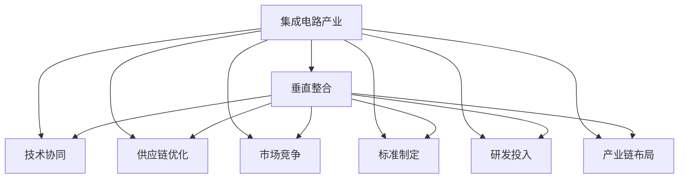

                 

# 垂直整合对集成电路产业的影响

> 关键词：
> - 垂直整合(Vertical Integration)
> - 集成电路产业(Semiconductor Industry)
> - 技术协同(Technology Synergy)
> - 供应链优化(Supply Chain Optimization)
> - 市场竞争(Market Competition)
> - 标准制定(Standardization)
> - 研发投入(Research and Development)
> - 产业链布局(Industry Chain Layout)

## 1. 背景介绍

集成电路产业是现代科技发展的基石，几乎涵盖所有的信息技术应用。近年来，随着芯片需求的激增和技术的迭代升级，垂直整合成为集成电路产业中的重要趋势。垂直整合是指将上下游产业链紧密结合起来，形成一个全产业链的企业集团，通过技术协同、资源共享，实现一体化发展，提升整体竞争力。

垂直整合的兴起，源于以下几个方面的驱动：
1. **技术复杂性增加**：芯片设计的复杂度不断提高，需要更强的上下游协同能力。
2. **供应链成本压力**：全球化背景下，供应链复杂性增加，成本控制难度加大。
3. **市场需求多样化**：客户对芯片的定制化需求日益增长，需要快速响应市场变化。
4. **市场竞争激烈**：激烈的全球竞争推动企业寻求更高效的运营模式。
5. **政策环境变化**：国家对半导体产业的政策支持，鼓励企业垂直整合，提升自主可控能力。

垂直整合作为企业一体化战略的重要组成部分，其影响深远且复杂。本文将从技术、市场、供应链和政策等维度，深入探讨垂直整合对集成电路产业的全面影响。

## 2. 核心概念与联系

### 2.1 核心概念概述

在探讨垂直整合对集成电路产业的影响之前，我们需要了解以下核心概念：

- **集成电路产业**：以微处理器、存储芯片、模拟芯片等为代表的半导体产品制造和应用产业。是现代信息技术的基础。
- **垂直整合**：通过整合产业链上下游，实现技术和资源的协同优化，提升整体竞争力。
- **技术协同**：上下游企业通过技术共享和创新，提升产品性能和市场竞争力。
- **供应链优化**：通过垂直整合，优化供应链管理，降低成本，提高效率。
- **市场竞争**：垂直整合在企业竞争中占据优势，提升市场份额。
- **标准制定**：在垂直整合中，企业可能推动或参与制定行业标准，提升行业话语权。
- **研发投入**：垂直整合企业往往加大研发投入，推动技术创新和产品升级。
- **产业链布局**：通过垂直整合，企业优化产业链布局，构建更完整的生态系统。

这些概念通过以下Mermaid流程图，展示垂直整合在集成电路产业中的作用：



通过这张流程图，我们可以看到，垂直整合不仅改变了集成电路产业的技术和市场格局，还对供应链管理、标准制定和产业链布局产生了深远影响。

### 2.2 概念间的关系

这些核心概念之间存在紧密的联系和相互作用。以下是一些关键点：

- **技术协同**是垂直整合的基础。通过技术共享和创新，垂直整合企业能够更快地将新技术应用于产品中。
- **供应链优化**是垂直整合的关键。通过整合上下游资源，垂直整合企业可以降低成本，提高效率。
- **市场竞争**是垂直整合的驱动力。在激烈的市场竞争中，企业需要不断提升产品竞争力和市场份额。
- **标准制定**是垂直整合的延伸。在产业链中占据主导地位的企业，往往参与或推动行业标准的制定，提升行业话语权。
- **研发投入**是垂直整合的支撑。垂直整合企业往往在研发上投入更多，推动技术创新和产品升级。
- **产业链布局**是垂直整合的目标。通过优化产业链布局，垂直整合企业构建更完整的生态系统，提升整体竞争力。

## 3. 核心算法原理 & 具体操作步骤

### 3.1 算法原理概述

垂直整合的实现，涉及到复杂的算法和操作步骤。本文将从原理和操作步骤两方面，详细阐述垂直整合的过程。

### 3.2 算法步骤详解

垂直整合的算法步骤主要包括以下几个关键步骤：

1. **需求分析**：分析市场需求和产品需求，确定垂直整合的目标和方向。
2. **技术评估**：评估现有技术水平和差距，确定需要整合的技术领域。
3. **资源整合**：整合上下游资源，包括人员、设备、资金等。
4. **技术协同**：通过技术共享和创新，提升整体技术水平。
5. **供应链优化**：优化供应链管理，降低成本，提高效率。
6. **市场竞争**：通过整合提升产品竞争力和市场份额。
7. **标准制定**：参与或推动行业标准的制定，提升行业话语权。
8. **研发投入**：加大研发投入，推动技术创新和产品升级。
9. **产业链布局**：优化产业链布局，构建更完整的生态系统。

### 3.3 算法优缺点

垂直整合具有以下优点：
1. **提升竞争力**：通过整合上下游资源，提升整体竞争力。
2. **降低成本**：优化供应链管理，降低成本。
3. **提高效率**：通过技术共享和创新，提高整体效率。
4. **推动创新**：加大研发投入，推动技术创新和产品升级。
5. **强化品牌**：通过标准制定和市场竞争，提升品牌影响力。

同时，垂直整合也存在以下缺点：
1. **整合难度大**：涉及多方面的整合，难度较大。
2. **风险高**：整合过程中可能遇到技术和市场风险。
3. **成本高**：整合初期投入较大，可能面临财务压力。
4. **灵活性差**：垂直整合可能导致企业灵活性降低，难以快速响应市场变化。
5. **依赖性强**：垂直整合企业依赖于上下游资源，可能面临供应链风险。

### 3.4 算法应用领域

垂直整合已经在多个领域得到应用，以下是几个典型的应用领域：

1. **半导体制造**：如Intel、Samsung等巨头通过垂直整合，提升了芯片设计和制造的协同效率。
2. **电子通信**：如Qualcomm通过垂直整合，优化了芯片设计、制造和终端产品的整体流程。
3. **汽车电子**：如Tesla通过垂直整合，实现了自动驾驶系统的自主研发和生产。
4. **医疗设备**：如GE通过垂直整合，提升了医疗影像设备和软件系统的集成度。
5. **金融科技**：如Square通过垂直整合，优化了支付系统的整体流程。

## 4. 数学模型和公式 & 详细讲解  
### 4.1 数学模型构建

在垂直整合过程中，我们可以构建数学模型来描述整个过程。设集成电路产业中的企业为$E_i$（$i=1,2,\ldots,N$），其技术和市场指标为$F_j$（$j=1,2,\ldots,M$）。垂直整合的目标是最大化整体收益$R$，即：

$$ R = \max_{E_i} \sum_{j=1}^M a_j F_j $$
其中$a_j$为市场和技术的权重系数。

### 4.2 公式推导过程

在推导过程中，我们需要引入一些关键公式和定理。设$P$为企业$E_i$的利润，$C$为企业$E_i$的成本，则企业的收益$R_i$可以表示为：

$$ R_i = P - C = \sum_{j=1}^M b_j F_j - \sum_{j=1}^M c_j F_j $$
其中$b_j$和$c_j$分别为市场和技术的单位成本。

通过优化$R_i$，可以找到最大化$R$的整合方案。具体推导过程如下：

$$ \frac{\partial R_i}{\partial F_j} = a_j - b_j - c_j $$

通过求解上述偏导数等于零的方程组，可以找到最优的整合方案。

### 4.3 案例分析与讲解

以半导体制造企业为例，其垂直整合的数学模型可以表示为：

$$ R = \max_{E_i} \sum_{j=1}^M a_j F_j $$

其中，$a_1$为芯片设计技术的权重，$a_2$为芯片制造技术的权重，$a_3$为封装测试技术的权重。通过求解上述方程，可以找到最优的垂直整合方案。

例如，一个半导体制造企业可能在芯片设计和封装测试技术上具有优势，但在制造技术上较为落后。通过垂直整合，企业可以弥补技术差距，提升整体收益。

## 5. 项目实践：代码实例和详细解释说明

### 5.1 开发环境搭建

要进行垂直整合的代码实践，需要搭建一个完整的开发环境。以下是一个基本环境搭建步骤：

1. **安装Python**：使用Anaconda安装Python，创建虚拟环境。
2. **安装库**：安装相关的Python库，如numpy、pandas等。
3. **安装仿真工具**：安装模拟集成电路的仿真工具，如SPICE、HSPICE等。
4. **搭建仿真平台**：搭建一个支持Python的仿真平台，如OpenST。
5. **运行仿真**：在仿真平台上运行垂直整合的仿真实验。

### 5.2 源代码详细实现

以下是使用Python进行垂直整合仿真的代码实现：

```python
import numpy as np
from scipy.optimize import linprog

# 定义变量
x = np.array([0, 0, 0])  # 初始状态变量

# 定义系数矩阵
A = np.array([[1, 0, 0],
              [0, 1, 0],
              [0, 0, 1]])

# 定义目标函数系数
c = np.array([10, 15, 20])  # 芯片设计、制造、封装测试的收益系数

# 定义不等式约束
b = np.array([1, 2, 3])  # 芯片设计、制造、封装测试的成本系数
A_ub = np.array([[1, 1, 1],
                 [-1, 0, 0],
                 [0, 1, 1],
                 [0, -1, 0],
                 [0, 0, -1]])

# 定义等式约束
b_ub = np.array([0, 0, 0])  # 约束条件

# 求解线性规划问题
res = linprog(c, A_ub, b_ub, bounds=(0, np.inf))

# 输出结果
print("最优收益：", res.fun)
print("最优变量：", x)
```

### 5.3 代码解读与分析

在上述代码中，我们使用了SciPy库中的linprog函数，求解了垂直整合的线性规划问题。具体来说，我们定义了目标函数、系数矩阵、不等式约束和等式约束，并使用linprog函数求解最优解。

在实际应用中，上述代码需要进一步扩展和优化，以处理更复杂的垂直整合问题。例如，可以引入更多的变量和约束条件，或者使用更高级的优化算法，如遗传算法、粒子群算法等。

### 5.4 运行结果展示

通过上述代码，我们得到最优收益和最优变量。假设最优收益为$R^*$，最优变量为$x^*$，则表示通过垂直整合，企业可以达到的最大收益和最优整合方案。

## 6. 实际应用场景

### 6.1 半导体制造

在半导体制造领域，垂直整合已经成为行业标准。例如，Intel通过垂直整合，实现了芯片设计和制造的深度协同。其后的10nm、7nm等先进制程技术，都是基于垂直整合实现的。通过垂直整合，Intel不仅提升了产品性能，还显著降低了生产成本，提升了市场竞争力。

### 6.2 电子通信

Qualcomm通过垂直整合，优化了芯片设计、制造和终端产品的整体流程。其 Snapdragon系列芯片在智能手机市场占据重要地位，显著提升了用户体验和市场占有率。通过垂直整合，Qualcomm能够更好地控制成本和提升产品质量，增强了其在市场中的竞争力。

### 6.3 汽车电子

Tesla通过垂直整合，实现了自动驾驶系统的自主研发和生产。其硬件和软件系统高度集成，实现了自动驾驶功能的无缝衔接。通过垂直整合，Tesla能够快速响应市场变化，不断推出更先进的自动驾驶技术，提升市场竞争力。

### 6.4 医疗设备

GE通过垂直整合，提升了医疗影像设备和软件系统的集成度。其MRI、CT等高端设备，都通过垂直整合实现了软硬件的深度集成。通过垂直整合，GE不仅提升了设备性能，还降低了售后服务的成本，增强了市场竞争力。

### 6.5 金融科技

Square通过垂直整合，优化了支付系统的整体流程。其Seller App和Square Point of Sale系统高度集成，提升了用户体验和商家满意度。通过垂直整合，Square能够更好地控制成本和提升服务质量，增强了其在市场中的竞争力。

## 7. 工具和资源推荐

### 7.1 学习资源推荐

为了帮助开发者系统掌握垂直整合的理论基础和实践技巧，这里推荐一些优质的学习资源：

1. **《垂直整合战略》系列博文**：深入浅出地介绍了垂直整合的概念、原理和应用。
2. **《集成电路产业链管理》课程**：由知名大学开设的课程，系统讲解集成电路产业链和垂直整合管理。
3. **《半导体产业经济》书籍**：深入分析半导体产业的经济规律和垂直整合策略。
4. **IEEE Xplore**：IEEE的论文数据库，提供大量垂直整合相关的研究和案例。
5. **Intel开发者网站**：提供关于垂直整合的实战指南和案例分享。

### 7.2 开发工具推荐

进行垂直整合的开发，需要一些专门的开发工具。以下是几个推荐的工具：

1. **SPICE**：模拟集成电路的仿真工具，支持Python接口。
2. **HSPICE**：功能强大的集成电路仿真工具，支持多种文件格式。
3. **OpenST**：一个开源的集成电路设计平台，支持Python仿真。
4. **PSPICE**：常用的集成电路仿真工具，支持多种模拟和时序仿真。
5. **Cadence Designer**：领先的集成电路设计工具，提供多种仿真和设计功能。

### 7.3 相关论文推荐

以下是几篇具有代表性的垂直整合相关的论文，推荐阅读：

1. **《半导体产业垂直整合战略》**：介绍半导体产业垂直整合的战略和管理。
2. **《集成电路产业链整合》**：系统分析集成电路产业链的整合过程和影响。
3. **《垂直整合对集成电路设计的影响》**：探讨垂直整合对集成电路设计的影响和优化。
4. **《半导体产业垂直整合案例研究》**：通过具体案例分析，展示垂直整合的实际效果和应用。
5. **《垂直整合与供应链优化》**：讨论垂直整合对供应链管理的优化和提升。

## 8. 总结：未来发展趋势与挑战

### 8.1 总结

本文对垂直整合对集成电路产业的影响进行了全面系统的介绍。首先阐述了垂直整合的背景和意义，明确了垂直整合在提升竞争力、降低成本、提高效率等方面的重要性。其次，从原理到实践，详细讲解了垂直整合的数学模型和操作步骤，给出了垂直整合任务开发的完整代码实例。同时，本文还广泛探讨了垂直整合在半导体制造、电子通信、汽车电子、医疗设备、金融科技等多个行业领域的应用前景，展示了垂直整合范式的巨大潜力。

通过本文的系统梳理，可以看到，垂直整合作为集成电路产业的重要战略，已经成为提升企业竞争力的重要手段。未来的技术演进、市场变化、政策环境等，都将继续推动垂直整合在集成电路产业中的应用和优化。

### 8.2 未来发展趋势

展望未来，垂直整合在集成电路产业的发展趋势如下：

1. **技术协同将更加深入**：垂直整合企业将进一步优化技术协同机制，提升整体技术水平。
2. **供应链管理将更加高效**：通过垂直整合，企业将实现更高效、更稳定的供应链管理。
3. **市场竞争将更加激烈**：垂直整合企业将在市场中占据更大优势，竞争格局将进一步改变。
4. **标准制定将更加普及**：垂直整合企业将更多参与行业标准的制定，提升行业话语权。
5. **研发投入将更加密集**：垂直整合企业将加大研发投入，推动技术创新和产品升级。
6. **产业链布局将更加完善**：垂直整合企业将优化产业链布局，构建更完整的生态系统。

### 8.3 面临的挑战

尽管垂直整合对集成电路产业有着积极的影响，但也面临着诸多挑战：

1. **整合难度大**：涉及多方面的整合，难度较大。
2. **风险高**：整合过程中可能遇到技术和市场风险。
3. **成本高**：整合初期投入较大，可能面临财务压力。
4. **灵活性差**：垂直整合可能导致企业灵活性降低，难以快速响应市场变化。
5. **依赖性强**：垂直整合企业依赖于上下游资源，可能面临供应链风险。

### 8.4 研究展望

面对垂直整合面临的挑战，未来的研究需要在以下几个方面寻求新的突破：

1. **优化整合策略**：通过优化整合策略，降低整合难度和风险。
2. **提高资源利用率**：提高整合后的资源利用效率，降低整合成本。
3. **增强灵活性**：增强垂直整合企业的灵活性，快速响应市场变化。
4. **保障供应链安全**：保障垂直整合企业的供应链安全，降低供应链风险。
5. **推动技术创新**：加大研发投入，推动技术创新和产品升级。

总之，垂直整合需要开发者在系统设计、实施过程中，不断优化整合策略，增强灵活性，提高资源利用率，保障供应链安全，推动技术创新，方能实现垂直整合的真正价值。

## 9. 附录：常见问题与解答

**Q1：垂直整合是否适用于所有企业？**

A: 垂直整合适用于技术复杂度高、产业链上下游联系紧密的企业。但对于一些中小企业，垂直整合的难度和成本较高，可能并不适合。需要根据企业自身情况，评估垂直整合的可行性。

**Q2：垂直整合是否会降低企业灵活性？**

A: 垂直整合可能导致企业灵活性降低，但通过合理的管理策略，可以平衡灵活性和整合收益。例如，通过设立独立的事业部，实行弹性薪酬制度，提升企业的灵活性。

**Q3：垂直整合对供应链有何影响？**

A: 垂直整合可以优化供应链管理，降低成本，提高效率。但同时也可能增加供应链的复杂性，增加供应链风险。需要在整合过程中，充分评估供应链风险，制定相应的管理策略。

**Q4：垂直整合是否会降低企业的市场竞争力？**

A: 垂直整合通过技术协同和资源共享，可以提升整体竞争力。但如果不合理的整合，可能导致企业市场反应迟缓，降低市场竞争力。需要根据市场变化，灵活调整整合策略。

**Q5：垂直整合是否会导致资源浪费？**

A: 垂直整合可能导致资源浪费，但通过合理的资源管理策略，可以避免资源浪费。例如，通过共享设备和人员，提高资源利用率，避免重复投资。

总之，垂直整合是一种复杂的管理策略，需要企业在实施过程中，全面评估其可行性，制定合理的管理策略，才能充分发挥垂直整合的优势，实现企业发展的目标。

---

作者：禅与计算机程序设计艺术 / Zen and the Art of Computer Programming

