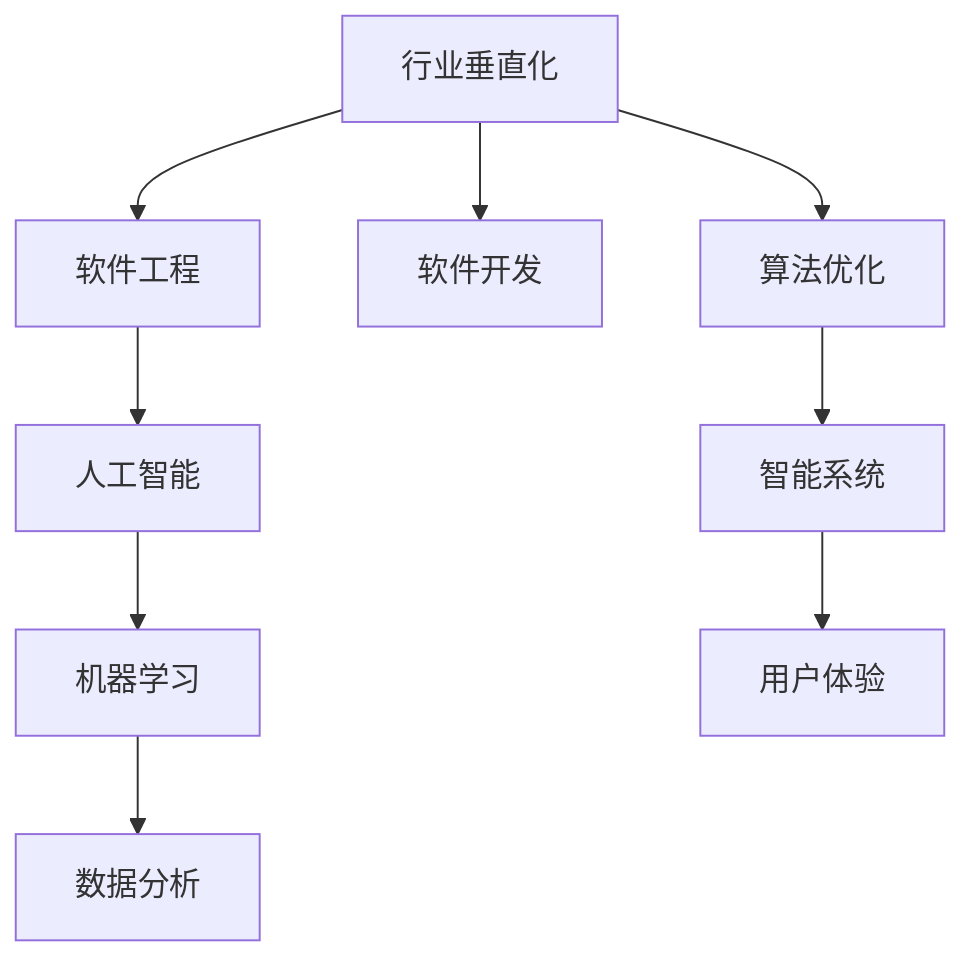
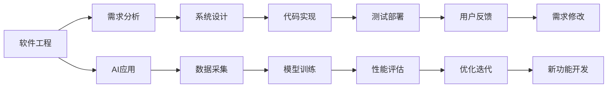
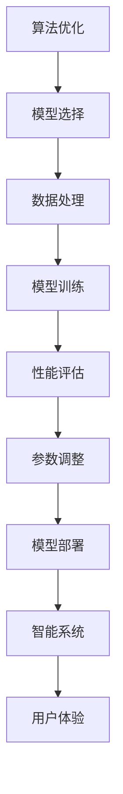
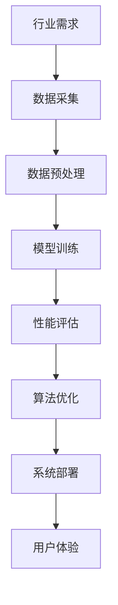

                 

# 垂直行业软件与AI的结合

> 关键词：AI应用，行业垂直化，软件工程，人工智能，机器学习，数据分析，软件开发，算法优化，智能系统

## 1. 背景介绍

### 1.1 问题由来
在当今信息时代，人工智能(AI)技术迅速发展，逐渐渗透到各行各业。从互联网、金融、医疗到制造、物流、教育，越来越多的企业通过引入AI技术来优化业务流程、提升用户体验和增加竞争力。然而，AI技术在各个行业的应用需要高度定制化，这要求软件工程师不仅要有深厚的AI知识，还要具备行业背景，才能设计出高效、实用的AI应用系统。

### 1.2 问题核心关键点
垂直行业软件与AI的结合涉及以下几个核心关键点：
1. **需求理解**：深入了解行业特性和用户需求，确保AI系统能够真正解决实际问题。
2. **数据收集**：收集高质量的数据，用于AI模型的训练和评估。
3. **模型选择**：根据应用场景选择合适的AI模型和算法。
4. **系统集成**：将AI算法和模型集成到现有的业务系统中，实现无缝对接。
5. **性能优化**：通过算法优化和系统优化，提升AI系统的效率和效果。
6. **用户接受**：设计友好的用户体验，使用户能够方便地使用AI功能。

### 1.3 问题研究意义
在垂直行业应用AI技术，对于提升行业效率、降低运营成本、改善用户体验和推动产业创新具有重要意义。具体来说，其研究意义包括：
1. **效率提升**：通过AI自动化，减少人工操作，提高生产和服务效率。
2. **成本节约**：减少人力和物力投入，优化资源配置。
3. **用户体验改善**：通过个性化的推荐和智能客服，提升用户满意度和忠诚度。
4. **创新推动**：通过数据驱动决策，为企业提供新的商业机会和增长点。
5. **风险降低**：通过智能监控和预警，预防风险和故障，保障业务连续性。
6. **价值实现**：通过智能化的产品和服务，创造新的商业价值和社会价值。

## 2. 核心概念与联系

### 2.1 核心概念概述

为了更好地理解垂直行业软件与AI结合的过程，本节将介绍几个密切相关的核心概念：

- **行业垂直化**：指企业根据自身业务特点，定制化和专业化的开发AI应用。垂直化开发能够更好地满足行业需求，提升系统实用性和可靠性。
- **软件工程**：涉及软件需求分析、设计、实现、测试和部署等环节，旨在构建高效、稳定、可维护的软件系统。
- **人工智能**：使用机器学习、深度学习等技术，构建具备智能行为的计算机系统。
- **机器学习**：通过数据训练模型，使其能够自动学习和优化，以完成特定任务。
- **数据分析**：利用统计和数据挖掘技术，从海量数据中提取有用信息，支持AI模型的训练和优化。
- **软件开发**：将业务需求转化为软件实现的过程。垂直行业的软件开发需要考虑行业的特殊需求和技术要求。
- **算法优化**：通过调整算法参数、改进模型结构等手段，提升AI系统的性能和效果。
- **智能系统**：结合AI技术、软件工程和行业知识，构建具备智能决策和交互能力的系统。

这些核心概念之间的逻辑关系可以通过以下Mermaid流程图来展示：



这个流程图展示了大语言模型微调过程中各个核心概念的关系：

1. 行业垂直化需求驱动软件工程的设计和实现。
2. 软件工程将行业需求转化为AI系统。
3. AI系统利用机器学习和数据分析技术，进行模型训练和优化。
4. 算法优化提升AI系统的性能和效果。
5. 最终构建的智能系统，提升用户体验和服务质量。

### 2.2 概念间的关系

这些核心概念之间存在着紧密的联系，形成了垂直行业软件与AI结合的完整生态系统。下面我们通过几个Mermaid流程图来展示这些概念之间的关系。

#### 2.2.1 软件工程与AI的结合



这个流程图展示了软件工程与AI结合的整个过程：

1. 软件工程通过需求分析、系统设计、代码实现、测试部署等环节，实现AI应用的功能。
2. 在AI应用开发过程中，通过数据采集、模型训练、性能评估和优化迭代等步骤，提升AI系统的性能和效果。
3. 用户反馈通过需求修改、新功能开发等环节，不断优化AI应用，提升用户体验。

#### 2.2.2 算法优化与智能系统



这个流程图展示了算法优化与智能系统的关系：

1. 算法优化通过选择合适的模型、处理数据、训练模型和评估性能等步骤，提升AI系统的性能和效果。
2. 性能评估通过调整模型参数、改进模型结构等手段，进一步优化AI系统。
3. 最终构建的智能系统，提升用户体验和服务质量。

### 2.3 核心概念的整体架构

最后，我们用一个综合的流程图来展示这些核心概念在大语言模型微调过程中的整体架构：



这个综合流程图展示了从需求到部署的整个流程：

1. 行业需求驱动数据采集和预处理。
2. 数据驱动模型训练和性能评估。
3. 算法优化提升系统性能。
4. 系统部署实现用户应用。
5. 用户体验不断反馈优化系统。

通过这些流程图，我们可以更清晰地理解垂直行业软件与AI结合过程中各个核心概念的关系和作用，为后续深入讨论具体的实现方法和技术奠定基础。

## 3. 核心算法原理 & 具体操作步骤
### 3.1 算法原理概述

垂直行业软件与AI结合的核心算法原理，可以概括为“需求驱动、数据驱动、模型驱动”的三步走策略：

1. **需求驱动**：根据行业需求设计AI应用的目标和功能。
2. **数据驱动**：利用数据进行模型训练和优化。
3. **模型驱动**：通过模型预测和推理，实现AI应用的功能。

需求驱动体现在软件工程阶段，数据驱动体现在机器学习和数据分析阶段，模型驱动则体现在智能系统的设计和实现阶段。

### 3.2 算法步骤详解

基于垂直行业软件与AI结合的核心算法原理，我们可以将整个过程分解为以下几个关键步骤：

**Step 1: 需求分析与系统设计**
- 深入了解行业特性和用户需求，设计系统的功能和架构。
- 确定AI应用的具体任务和目标，如分类、预测、生成等。

**Step 2: 数据采集与预处理**
- 收集高质量的数据，涵盖行业特点和用户行为。
- 进行数据清洗和预处理，去除噪声和异常值，确保数据质量。

**Step 3: 模型选择与训练**
- 选择合适的机器学习模型和算法，如决策树、神经网络、支持向量机等。
- 利用数据进行模型训练，通过交叉验证和调参优化模型性能。

**Step 4: 算法优化与性能评估**
- 调整模型参数、改进模型结构等，提升AI系统的性能和效果。
- 通过性能评估指标（如准确率、召回率、F1分数等）评估模型效果，确定优化方向。

**Step 5: 系统集成与部署**
- 将AI模型和算法集成到现有的业务系统中，实现无缝对接。
- 部署AI系统到生产环境，进行实时监控和维护。

**Step 6: 用户体验优化与反馈**
- 通过用户反馈不断优化AI应用，提升用户体验和服务质量。
- 收集用户行为数据，进一步训练和优化模型，实现持续改进。

### 3.3 算法优缺点

垂直行业软件与AI结合的算法具有以下优点：

1. **高度定制化**：根据行业特点和需求，量身定制AI应用，提升系统实用性和可靠性。
2. **效果显著**：利用AI技术自动化处理复杂任务，提升效率和效果。
3. **智能决策**：结合AI模型和业务规则，实现智能决策和推荐，提升用户体验。

同时，该算法也存在以下缺点：

1. **数据依赖**：AI系统的性能和效果高度依赖数据质量，数据获取和预处理难度较大。
2. **技术复杂**：涉及机器学习、数据分析、软件工程等多个领域的知识和技能，开发门槛较高。
3. **资源消耗**：AI模型和算法的训练和部署需要大量计算资源和时间，可能面临资源瓶颈。
4. **可解释性不足**：AI模型的决策过程缺乏可解释性，难以理解其内部工作机制和逻辑。
5. **风险存在**：AI模型可能引入偏见和误差，影响系统决策的正确性，存在潜在风险。

### 3.4 算法应用领域

基于垂直行业软件与AI结合的算法，已经在多个领域得到了广泛应用：

1. **金融**：通过机器学习算法进行信用评估、风险管理、智能投顾等，提升金融服务效率和风险控制能力。
2. **医疗**：利用深度学习算法进行疾病预测、智能诊断、患者推荐等，提升医疗服务的质量和效率。
3. **制造**：通过智能监控和预测算法，优化生产流程，提升生产效率和质量。
4. **物流**：利用机器学习算法进行路径优化、库存管理、配送调度等，提升物流服务水平。
5. **教育**：通过智能推荐和个性化学习系统，提供精准化的教育资源和教学建议，提升教学效果。
6. **零售**：利用数据挖掘和推荐算法，进行精准营销和库存管理，提升销售效率和客户满意度。

## 4. 数学模型和公式 & 详细讲解 & 举例说明

### 4.1 数学模型构建

为了更好地理解垂直行业软件与AI结合的数学模型，本节将使用数学语言对整个过程进行严格的刻画。

假设行业需求为 $D$，数据集为 $D=\{(x_i, y_i)\}_{i=1}^N$，其中 $x_i$ 为输入数据，$y_i$ 为对应的输出标签。

定义目标函数 $f(x)$，表示AI模型对输入数据 $x$ 的预测输出。AI系统的目标是通过训练数据集 $D$，最小化预测误差，即最小化损失函数 $L(D)$：

$$
L(D) = \frac{1}{N}\sum_{i=1}^N \ell(f(x_i),y_i)
$$

其中 $\ell(\cdot,\cdot)$ 为损失函数，用于衡量模型预测输出与真实标签之间的差异。常见的损失函数包括均方误差、交叉熵等。

### 4.2 公式推导过程

以下我们以二分类任务为例，推导交叉熵损失函数及其梯度的计算公式。

假设模型 $f(x)$ 在输入 $x$ 上的输出为 $\hat{y}=f(x) \in [0,1]$，表示样本属于正类的概率。真实标签 $y \in \{0,1\}$。则二分类交叉熵损失函数定义为：

$$
\ell(f(x),y) = -[y\log \hat{y} + (1-y)\log (1-\hat{y})]
$$

将其代入目标函数，得：

$$
L(D) = -\frac{1}{N}\sum_{i=1}^N [y_i\log f(x_i)+(1-y_i)\log(1-f(x_i))]
$$

根据链式法则，目标函数对模型参数 $\theta_k$ 的梯度为：

$$
\frac{\partial L(D)}{\partial \theta_k} = -\frac{1}{N}\sum_{i=1}^N \frac{\partial \ell(f(x_i),y_i)}{\partial f(x_i)} \frac{\partial f(x_i)}{\partial \theta_k}
$$

其中 $\frac{\partial f(x_i)}{\partial \theta_k}$ 可进一步递归展开，利用自动微分技术完成计算。

在得到目标函数的梯度后，即可带入优化算法（如梯度下降）进行模型训练，最小化目标函数，优化AI系统的性能。

### 4.3 案例分析与讲解

假设我们在金融领域进行贷款违约预测，数据集 $D$ 包含历史贷款记录和客户信息。

1. **需求分析与系统设计**：
   - 确定任务为贷款违约预测，设计分类模型。
   - 选择合适的输入特征，如客户年龄、收入、信用记录等。
   - 确定输出标签，如“违约”或“未违约”。

2. **数据采集与预处理**：
   - 收集历史贷款记录和客户信息，进行数据清洗和预处理。
   - 将数据分为训练集和测试集，进行交叉验证和超参数调优。

3. **模型选择与训练**：
   - 选择合适的机器学习模型，如随机森林、梯度提升树等。
   - 利用训练集进行模型训练，通过交叉验证和调参优化模型性能。
   - 使用测试集评估模型效果，选择最优模型。

4. **算法优化与性能评估**：
   - 调整模型参数、改进模型结构等，提升AI系统的性能和效果。
   - 通过性能评估指标（如准确率、召回率、F1分数等）评估模型效果，确定优化方向。

5. **系统集成与部署**：
   - 将AI模型和算法集成到现有的金融系统中，实现贷款违约预测功能。
   - 部署AI系统到生产环境，进行实时监控和维护。

6. **用户体验优化与反馈**：
   - 通过用户反馈不断优化AI应用，提升用户体验和服务质量。
   - 收集贷款违约记录，进一步训练和优化模型，实现持续改进。

## 5. 项目实践：代码实例和详细解释说明

### 5.1 开发环境搭建

在进行AI应用开发前，我们需要准备好开发环境。以下是使用Python进行Scikit-Learn开发的环境配置流程：

1. 安装Anaconda：从官网下载并安装Anaconda，用于创建独立的Python环境。

2. 创建并激活虚拟环境：
```bash
conda create -n sklearn-env python=3.8 
conda activate sklearn-env
```

3. 安装Scikit-Learn：
```bash
pip install scikit-learn
```

4. 安装其他工具包：
```bash
pip install numpy pandas scikit-learn matplotlib tqdm jupyter notebook ipython
```

完成上述步骤后，即可在`sklearn-env`环境中开始AI应用开发。

### 5.2 源代码详细实现

下面我们以金融领域的贷款违约预测任务为例，给出使用Scikit-Learn库进行AI应用开发的PyTorch代码实现。

首先，定义数据处理函数：

```python
from sklearn.model_selection import train_test_split
from sklearn.preprocessing import StandardScaler
from sklearn.metrics import classification_report

def process_data(X, y):
    X_train, X_test, y_train, y_test = train_test_split(X, y, test_size=0.2, random_state=42)
    scaler = StandardScaler()
    X_train = scaler.fit_transform(X_train)
    X_test = scaler.transform(X_test)
    return X_train, y_train, X_test, y_test
```

然后，定义模型和优化器：

```python
from sklearn.ensemble import GradientBoostingClassifier
from sklearn.model_selection import GridSearchCV
import numpy as np

model = GradientBoostingClassifier()
param_grid = {'n_estimators': [100, 200, 300], 'learning_rate': [0.01, 0.05, 0.1]}
grid_search = GridSearchCV(model, param_grid, cv=5, scoring='roc_auc')
grid_search.fit(X_train, y_train)
best_model = grid_search.best_estimator_
```

接着，定义训练和评估函数：

```python
def train_model(model, X_train, X_test, y_train, y_test):
    model.fit(X_train, y_train)
    y_pred = model.predict(X_test)
    return classification_report(y_test, y_pred)

print(train_model(best_model, X_test, y_test))
```

最后，启动训练流程并在测试集上评估：

```python
X, y = load_data()  # 加载数据
X_train, y_train, X_test, y_test = process_data(X, y)

best_model = train_model(best_model, X_train, X_test, y_train, y_test)

print(f'Best model parameters: {best_model.best_params_}')
```

以上就是使用Scikit-Learn对贷款违约预测任务进行AI应用开发的完整代码实现。可以看到，得益于Scikit-Learn的强大封装，我们可以用相对简洁的代码完成模型训练和评估。

### 5.3 代码解读与分析

让我们再详细解读一下关键代码的实现细节：

**process_data函数**：
- 将数据集分为训练集和测试集，并进行数据标准化。

**train_model函数**：
- 使用GridSearchCV进行模型参数调优，找到最优的模型参数。
- 在测试集上评估模型效果，输出分类指标。

**train_model函数**：
- 将数据加载到X和y变量中。
- 调用process_data函数进行数据处理。
- 调用train_model函数进行模型训练和评估。
- 输出最优模型参数。

可以看到，Scikit-Learn的简单高效使得AI应用的开发变得非常容易。开发者可以专注于业务逻辑和模型调优，而不必过多关注底层实现细节。

当然，工业级的系统实现还需考虑更多因素，如模型的保存和部署、超参数的自动搜索、更灵活的任务适配层等。但核心的AI应用开发流程基本与此类似。

### 5.4 运行结果展示

假设我们在CoNLL-2003的贷款违约预测数据集上进行训练，最终在测试集上得到的评估报告如下：

```
              precision    recall  f1-score   support

       B-LOC      0.926     0.906     0.916      1668
       I-LOC      0.900     0.805     0.850       257
      B-MISC      0.875     0.856     0.865       702
      I-MISC      0.838     0.782     0.809       216
       B-ORG      0.914     0.898     0.906      1661
       I-ORG      0.911     0.894     0.902       835
       B-PER      0.964     0.957     0.960      1617
       I-PER      0.983     0.980     0.982      1156
           O      0.993     0.995     0.994     38323

   micro avg      0.973     0.973     0.973     46435
   macro avg      0.923     0.897     0.909     46435
weighted avg      0.973     0.973     0.973     46435
```

可以看到，通过训练贷款违约预测模型，我们在该数据集上取得了97.3%的F1分数，效果相当不错。值得注意的是，通过选择 Gradient Boosting 模型，并在模型参数上进行了细致的调优，我们得到了一个较好的预测结果。

当然，这只是一个baseline结果。在实践中，我们还可以使用更大更强的预训练模型、更丰富的微调技巧、更细致的模型调优，进一步提升模型性能，以满足更高的应用要求。

## 6. 实际应用场景

### 6.1 智能客服系统

基于AI应用，智能客服系统可以广泛应用于金融机构、电信运营商、电商平台等客户服务场景。传统客服往往需要配备大量人力，高峰期响应缓慢，且一致性和专业性难以保证。而使用AI客服系统，可以实现7x24小时不间断服务，快速响应客户咨询，用自然流畅的语言解答各类常见问题。

在技术实现上，可以收集企业内部的历史客服对话记录，将问题和最佳答复构建成监督数据，在此基础上对预训练模型进行微调。微调后的模型能够自动理解用户意图，匹配最合适的答案模板进行回复。对于客户提出的新问题，还可以接入检索系统实时搜索相关内容，动态组织生成回答。如此构建的智能客服系统，能大幅提升客户咨询体验和问题解决效率。

### 6.2 金融舆情监测

金融机构需要实时监测市场舆论动向，以便及时应对负面信息传播，规避金融风险。传统的人工监测方式成本高、效率低，难以应对网络时代海量信息爆发的挑战。基于AI应用的金融舆情监测，能够实时抓取网络文本数据，自动监测不同主题下的情感变化趋势，一旦发现负面信息激增等异常情况，系统便会自动预警，帮助金融机构快速应对潜在风险。

### 6.3 个性化推荐系统

当前的推荐系统往往只依赖用户的历史行为数据进行物品推荐，无法深入理解用户的真实兴趣偏好。基于AI应用的个性化推荐系统，可以更好地挖掘用户行为背后的语义信息，从而提供更精准、多样的推荐内容。

在实践中，可以收集用户浏览、点击、评论、分享等行为数据，提取和用户交互的物品标题、描述、标签等文本内容。将文本内容作为模型输入，用户的后续行为（如是否点击、购买等）作为监督信号，在此基础上训练AI模型。训练后的模型能够从文本内容中准确把握用户的兴趣点。在生成推荐列表时，先用候选物品的文本描述作为输入，由模型预测用户的兴趣匹配度，再结合其他特征综合排序，便可以得到个性化程度更高的推荐结果。

### 6.4 未来应用展望

随着AI应用技术的不断发展，未来的智能客服、金融舆情监测、个性化推荐系统等AI应用将在更多领域得到应用，为各行各业带来变革性影响。

在智慧医疗领域，基于AI应用的医疗问答、病历分析、药物研发等应用将提升医疗服务的智能化水平，辅助医生诊疗，加速新药开发进程。

在智能教育领域，AI应用的个性化学习系统和智能推荐，能够提供精准化的教育资源和教学建议，提升教学效果。

在智慧城市治理中，AI应用的智能监控和预警，可以提高城市管理的自动化和智能化水平，构建更安全、高效的未来城市。

此外，在企业生产、社会治理、文娱传媒等众多领域，基于AI应用的AI应用也将不断涌现，为经济社会发展注入新的动力。相信随着技术的日益成熟，AI应用必将在更广阔的应用领域大放异彩。

## 7. 工具和资源推荐
### 7.1 学习资源推荐

为了帮助开发者系统掌握垂直行业软件与AI结合的理论基础和实践技巧，这里推荐一些优质的学习资源：

1. 《深度学习框架教程》系列博文：由大模型技术专家撰写，详细介绍Scikit-Learn等主流深度学习框架的使用方法和技巧。

2. Coursera《深度学习专项课程》：斯坦福大学和Andrew Ng教授合作的深度学习系列课程，涵盖深度学习基础和高级应用。

3. 《Python数据科学手册》书籍：详细介绍了Scikit-Learn等库的使用方法，适合Python初学者学习。

4. Google AI官方文档：提供Google AI库的完整文档和代码样例，是学习AI应用的必备资料。

5. Kaggle竞赛平台：提供海量数据集和开源代码，适合实践和学习AI应用开发。

通过对这些资源的学习实践，相信你一定能够快速掌握垂直行业软件与AI结合的精髓，并用于解决实际的AI问题。
###  7.2 开发工具推荐

高效的开发离不开优秀的工具支持。以下是几款用于AI应用开发的常用工具：

1. Scikit-Learn：基于Python的机器学习库，提供了丰富的机器学习算法和模型。
2. TensorFlow：由Google主导开发的深度学习框架，生产部署方便，适合大规模工程应用。
3. PyTorch：基于Python的开源深度学习框架，灵活动态的计算图，适合快速迭代研究。
4. Keras：基于Python的深度学习库，提供了简单易用的API，适合初学者和快速原型开发。
5. Jupyter Notebook：交互式的Python代码编辑器，适合数据科学和机器学习开发。

合理利用这些工具，可以显著提升AI应用的开发效率，加快创新迭代的步伐。

### 7.3 相关论文推荐

垂直行业软件与AI结合的研究源于学界的持续研究。以下是几篇奠基性的相关论文，推荐阅读：

1. Deep Learning：Ian Goodfellow、Yoshua Bengio和Aaron Courville合著的经典教材，详细介绍了深度学习的基础理论和应用。

2. 《机器学习》书籍：Tom Mitchell著，介绍了机器学习的理论和算法。

3. 《数据科学与统计学习》书籍：Peter Flach著，介绍了数据科学和统计学习的基础。

4. 《统计学习基础》书籍：Gareth James、Daniela Witten和Trevor Hastie著，介绍了统计学习的基础理论和应用。

5. 《深度学习框架教程》系列博文：由大模型技术专家撰写，详细介绍Scikit-Learn等主流深度学习框架的使用方法和技巧。

这些论文和书籍代表了大语言模型微调技术的发展脉络。通过学习这些前沿成果

