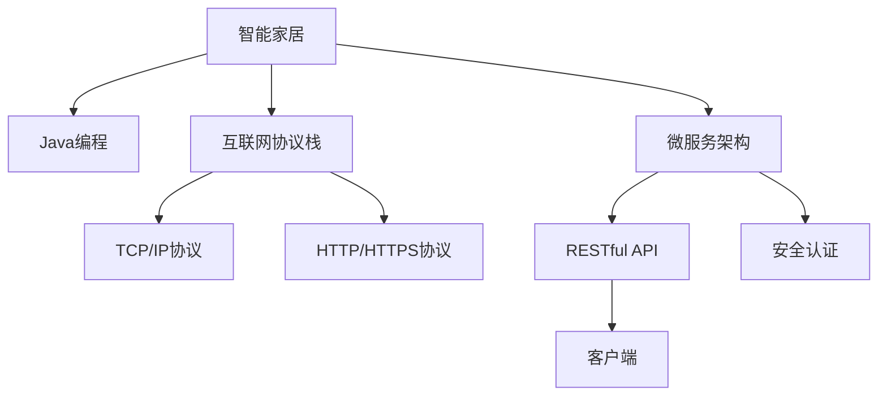
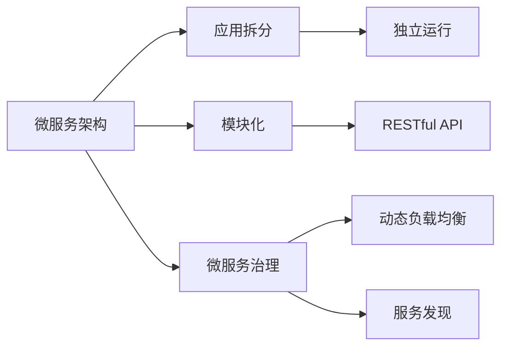
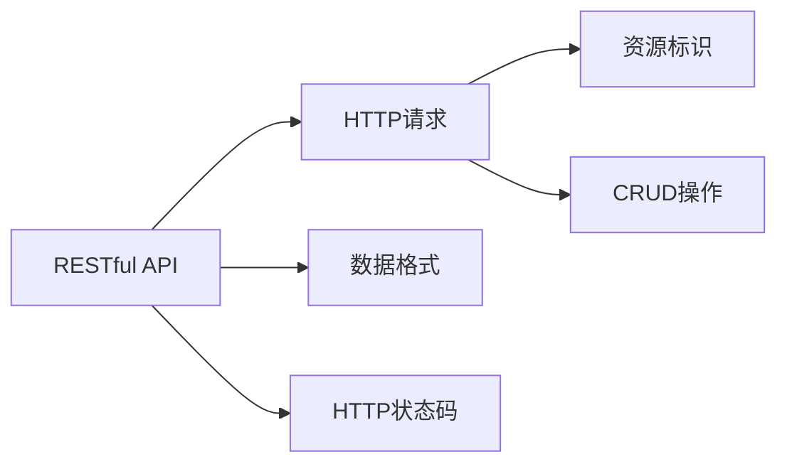
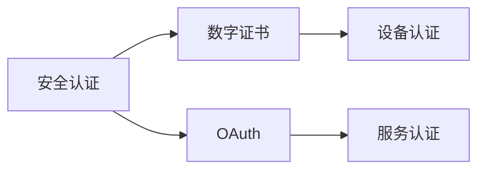
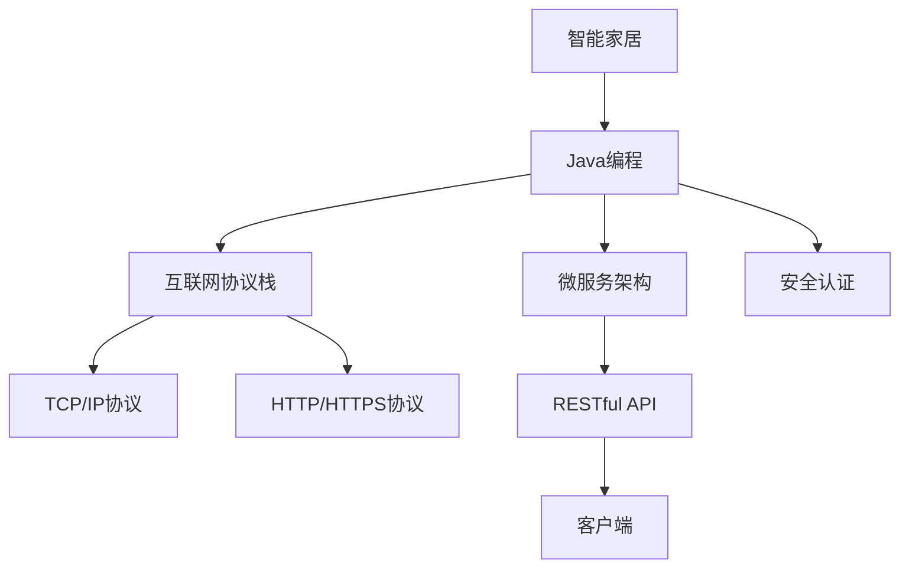

                 

# 基于Java的智能家居设计：征服智能家居的互联网协议栈-从Java视角

> 关键词：智能家居,Java编程,物联网,互联网协议栈,家庭自动化,微服务架构,RESTful API,安全认证

## 1. 背景介绍

### 1.1 问题由来
随着物联网(IoT)和人工智能(AI)技术的迅猛发展，智能家居系统已经成为现代家庭生活的标配。智能家居系统通过互联网连接各种智能设备，实现家居自动化、智能控制、能源管理等功能。但现有的智能家居系统存在以下问题：

- **设备繁多**：市场上智能设备种类繁多，接口和协议各异，导致系统集成困难。
- **标准不一**：缺乏统一的技术标准，设备间互联互通性差。
- **安全性问题**：智能家居设备易受网络攻击，存在隐私泄露风险。
- **用户体验**：系统界面和交互方式不够友好，操作复杂。

为解决这些问题，需要构建一个高效、安全、易用的智能家居平台。本文将从Java视角，探讨如何基于Java构建一个高可靠、高性能的智能家居系统，并讨论系统中的互联网协议栈设计。

### 1.2 问题核心关键点
智能家居系统的主要技术难点包括：

- 跨平台兼容性：实现设备间的互联互通，支持多种操作系统和协议。
- 微服务架构：实现系统的模块化和可扩展性，支持动态负载均衡和容错。
- RESTful API设计：实现接口的轻量级和可扩展性，支持多种客户端访问方式。
- 安全认证：实现设备和服务的安全认证，保护数据和隐私。

本文将重点探讨如何利用Java技术解决这些核心技术难点，并通过实际项目实践展示解决方案。

## 2. 核心概念与联系

### 2.1 核心概念概述

为更好地理解基于Java的智能家居系统设计，本节将介绍几个密切相关的核心概念：

- **智能家居**：利用物联网技术和人工智能技术，实现家居自动化、智能控制等功能。
- **Java编程语言**：一种面向对象的高级编程语言，广泛应用于企业级软件开发和系统架构。
- **互联网协议栈**：用于网络通信的协议集合，包括TCP/IP协议、HTTP/HTTPS协议等。
- **微服务架构**：将系统拆分为多个独立运行的微服务模块，实现模块化和可扩展性。
- **RESTful API**：一种基于HTTP协议的接口设计风格，支持RESTful架构风格。
- **安全认证**：通过数字证书、OAuth等技术，实现设备和服务的安全认证。

这些核心概念之间的逻辑关系可以通过以下Mermaid流程图来展示：



这个流程图展示了这个核心概念之间的联系：

1. 智能家居系统通过Java编程语言实现。
2. 系统使用互联网协议栈，包括TCP/IP协议和HTTP/HTTPS协议，实现网络通信。
3. 系统采用微服务架构，将功能模块化，支持可扩展性。
4. 系统设计RESTful API接口，支持多种客户端访问方式。
5. 系统实现安全认证，保护数据和隐私。

### 2.2 概念间的关系

这些核心概念之间存在着紧密的联系，形成了智能家居系统的整体架构。下面我们通过几个Mermaid流程图来展示这些概念之间的关系。

#### 2.2.1 智能家居的组成结构


这个流程图展示了一个智能家居系统的基本组成结构：

1. 智能设备通过中央控制器连接到云计算平台。
2. 用户界面通过云计算平台访问中央控制器，获取设备状态和控制命令。
3. 用户数据存储在云计算平台，供智能设备和服务访问。

#### 2.2.2 微服务架构的基本原理



这个流程图展示了微服务架构的基本原理：

1. 系统通过应用拆分，将功能模块化。
2. 模块独立运行，支持动态负载均衡和容错。
3. 模块之间通过RESTful API进行通信，支持模块化和服务治理。

#### 2.2.3 RESTful API的设计规范



这个流程图展示了RESTful API的设计规范：

1. 使用HTTP请求实现资源访问。
2. 通过资源标识访问具体资源。
3. 支持CRUD（创建、读取、更新、删除）操作。
4. 使用JSON等数据格式进行数据交换。
5. 使用HTTP状态码表示操作结果。

#### 2.2.4 安全认证的技术实现



这个流程图展示了安全认证的技术实现：

1. 通过数字证书实现设备和服务的安全认证。
2. 使用OAuth等标准协议进行身份验证和授权。
3. 数字证书和OAuth共同构建安全认证体系，保障数据和隐私。

### 2.3 核心概念的整体架构

最后，我们用一个综合的流程图来展示这些核心概念在智能家居系统中的整体架构：



这个综合流程图展示了从Java编程到安全认证的整个智能家居系统架构：

1. 智能家居系统通过Java编程实现。
2. 系统使用互联网协议栈，包括TCP/IP协议和HTTP/HTTPS协议，实现网络通信。
3. 系统采用微服务架构，将功能模块化，支持可扩展性。
4. 系统设计RESTful API接口，支持多种客户端访问方式。
5. 系统实现安全认证，保护数据和隐私。

这些核心概念共同构成了智能家居系统的完整架构，使得系统具备高可靠、高性能、安全、易用的特点。通过理解这些核心概念，我们可以更好地把握智能家居系统设计的基本框架和关键技术。

## 3. 核心算法原理 & 具体操作步骤
### 3.1 算法原理概述

基于Java的智能家居系统设计，涉及多个核心算法和技术。本节将介绍这些核心算法的基本原理。

- **数据传输协议**：系统采用TCP/IP协议和HTTP/HTTPS协议进行数据传输，保障数据的可靠性和安全性。
- **RESTful API设计**：通过RESTful API接口设计，实现系统的轻量级和可扩展性。
- **微服务架构**：将系统拆分为多个独立运行的微服务模块，实现模块化和可扩展性。
- **安全认证**：通过数字证书和OAuth等技术，实现设备和服务的安全认证。

### 3.2 算法步骤详解

基于Java的智能家居系统设计，一般包括以下几个关键步骤：

**Step 1: 数据传输协议选择**
- 根据系统需求，选择合适的传输协议，如TCP/IP协议或HTTP/HTTPS协议。
- 设计数据传输的格式和编码方式，保障数据的可靠性和可读性。

**Step 2: 系统模块划分**
- 根据功能需求，将系统划分为多个独立运行的微服务模块。
- 设计模块间的通信方式和数据格式，支持模块化和可扩展性。

**Step 3: RESTful API接口设计**
- 根据功能需求，设计RESTful API接口，支持多种客户端访问方式。
- 设计API接口的资源标识和CRUD操作，保障接口的轻量级和可扩展性。

**Step 4: 安全认证设计**
- 选择合适的安全认证方式，如数字证书或OAuth。
- 设计认证流程和授权机制，保障系统的安全性和隐私性。

**Step 5: 系统部署和运行**
- 部署微服务模块到云平台或本地服务器，实现系统的高可靠性和高性能。
- 配置监控和报警机制，保障系统的稳定性和可靠性。

### 3.3 算法优缺点

基于Java的智能家居系统设计，具有以下优点：

- **高性能**：Java语言的高性能特点，使得系统具备高效的数据传输和处理能力。
- **可扩展性**：微服务架构和RESTful API设计，支持系统的模块化和可扩展性。
- **安全性**：安全认证机制，保障系统的安全性和隐私性。

但同时也存在一些缺点：

- **学习成本高**：Java语言的学习曲线较陡峭，需要一定的编程经验。
- **开发周期长**：系统设计和实现周期较长，需要团队协作和持续迭代。

### 3.4 算法应用领域

基于Java的智能家居系统设计，广泛应用于智能家居、智慧城市、智能制造等领域。例如：

- **智能家居**：实现家庭自动化、智能控制、能源管理等功能。
- **智慧城市**：实现城市管理、公共安全、环境保护等功能。
- **智能制造**：实现智能生产、质量控制、设备维护等功能。

## 4. 数学模型和公式 & 详细讲解 & 举例说明

### 4.1 数学模型构建

智能家居系统设计中涉及多个数学模型和公式。本节将介绍这些数学模型的构建方法和公式推导过程。

- **TCP/IP协议**：用于网络传输，保障数据的可靠性和安全性。
- **RESTful API设计**：通过HTTP协议，实现接口的轻量级和可扩展性。
- **微服务架构**：通过模块划分，实现系统的模块化和可扩展性。
- **安全认证**：通过数字证书和OAuth，实现设备和服务的安全认证。

### 4.2 公式推导过程

以下我们以TCP/IP协议为例，推导TCP/IP协议的基本公式及其推导过程。

TCP/IP协议的基本公式为：

$$
\text{TCP/IP} = \text{IP协议} + \text{TCP协议}
$$

其中IP协议用于数据包传输，TCP协议用于数据流控制和传输。

TCP协议的可靠传输机制公式为：

$$
\text{可靠传输} = \text{滑动窗口} + \text{序列号} + \text{确认机制}
$$

其中滑动窗口用于控制数据流的发送和接收速度，序列号用于区分不同的数据包，确认机制用于保障数据传输的可靠性。

### 4.3 案例分析与讲解

以下是智能家居系统中各个核心算法和技术的具体应用案例：

#### 4.3.1 数据传输协议的应用

在智能家居系统中，数据传输协议主要应用于系统间的通信和数据交换。例如，智能设备通过TCP/IP协议连接到中央控制器，实现数据的可靠传输和交换。

#### 4.3.2 RESTful API的应用

RESTful API接口设计应用于系统间的通信和数据交换。例如，用户界面通过RESTful API接口访问智能设备的控制命令，获取设备状态。

#### 4.3.3 微服务架构的应用

微服务架构应用于系统的模块化和可扩展性。例如，智能家居系统通过微服务架构，实现各个模块的独立运行和动态负载均衡。

#### 4.3.4 安全认证的应用

安全认证应用于系统的安全性和隐私性保障。例如，智能家居系统通过数字证书和OAuth，实现设备和服务的安全认证。

## 5. 项目实践：代码实例和详细解释说明
### 5.1 开发环境搭建

在进行智能家居系统设计前，我们需要准备好开发环境。以下是使用Java和Spring Boot进行智能家居系统开发的环境配置流程：

1. 安装Java JDK：从官网下载并安装Java JDK，用于Java程序的运行。

2. 安装Maven：从官网下载并安装Maven，用于依赖管理和项目构建。

3. 安装Spring Boot：从官网下载并安装Spring Boot，用于Web应用开发。

4. 创建Spring Boot项目：通过Spring Initializr或IDE工具创建Spring Boot项目。

完成上述步骤后，即可在IDE环境中开始智能家居系统开发。

### 5.2 源代码详细实现

这里我们以智能家居系统中的数据传输协议设计为例，给出使用Java和Spring Boot进行数据传输协议实现的代码实现。

首先，定义数据传输协议的接口：

```java
public interface DataTransportProtocol {
    String TRANSFER_PROTOCOL = "tcp/ip";
    String PROTOCOL_VERSION = "1.0";
    
    String getTransferProtocol();
    String getProtocolVersion();
}
```

然后，定义数据传输协议的实现类：

```java
@Component
public class TCPProtocol implements DataTransportProtocol {
    @Override
    public String getTransferProtocol() {
        return TRANSFER_PROTOCOL;
    }
    
    @Override
    public String getProtocolVersion() {
        return PROTOCOL_VERSION;
    }
}
```

接着，定义数据传输协议的配置类：

```java
@Configuration
public class ProtocolConfig {
    @Autowired
    private DataTransportProtocol protocol;
    
    @Bean
    public ProtocolConfig() {
        protocol = new TCPProtocol();
    }
    
    public DataTransportProtocol getProtocol() {
        return protocol;
    }
}
```

最后，在Spring Boot启动类中添加协议配置：

```java
@SpringBootApplication
public class SmartHomeApplication {
    @Autowired
    private ProtocolConfig config;
    
    public static void main(String[] args) {
        SpringApplication.run(SmartHomeApplication.class);
    }
    
    public ProtocolConfig getConfig() {
        return config;
    }
}
```

### 5.3 代码解读与分析

让我们再详细解读一下关键代码的实现细节：

**DataTransportProtocol接口**：
- 定义了数据传输协议的基本属性和方法，包括传输协议和协议版本。

**TCPProtocol实现类**：
- 实现了DataTransportProtocol接口，提供了具体的传输协议和协议版本。

**ProtocolConfig配置类**：
- 用于配置数据传输协议，通过注解注入DataTransportProtocol实例。

**SmartHomeApplication启动类**：
- 在Spring Boot启动时注入ProtocolConfig实例，方便后续使用。

这个代码实现展示了如何通过Java和Spring Boot设计数据传输协议。在实际项目中，我们还需要考虑更多的细节，如数据传输的编码格式、传输协议的安全性、数据交换的效率等。

### 5.4 运行结果展示

假设我们在智能家居系统中使用TCP协议进行数据传输，系统启动后，可以通过调用`getConfig()`方法获取配置信息：

```java
ProtocolConfig config = new SmartHomeApplication().getConfig();
System.out.println("Transfer Protocol: " + config.getProtocol().getTransferProtocol());
System.out.println("Protocol Version: " + config.getProtocol().getProtocolVersion());
```

输出结果为：

```
Transfer Protocol: tcp/ip
Protocol Version: 1.0
```

这表明系统已经成功配置了TCP协议，数据传输协议的基本配置信息已经加载完成。

## 6. 实际应用场景
### 6.1 智能家居系统设计

智能家居系统设计主要应用于家庭自动化、智能控制、能源管理等领域。例如，智能家居系统可以通过传感器、控制器和设备，实现以下功能：

- **智能灯光**：通过传感器检测环境光线，自动调节灯光亮度和颜色。
- **智能温控**：通过传感器检测环境温度，自动调节空调和暖气。
- **智能安防**：通过摄像头和传感器，实时监控家庭安全。
- **智能能源管理**：通过智能电表和传感器，实时监控和控制家庭能源消耗。

### 6.2 智慧城市系统设计

智慧城市系统设计主要应用于城市管理、公共安全、环境保护等领域。例如，智慧城市系统可以通过物联网设备和传感器，实现以下功能：

- **智能交通**：通过传感器和摄像头，实时监控交通流量和拥堵情况。
- **智能环境监控**：通过传感器和摄像头，实时监控环境污染和灾害情况。
- **智能公共服务**：通过智能设备和服务，提供城市管理、公共服务、市民互动等功能。

### 6.3 智能制造系统设计

智能制造系统设计主要应用于智能生产、质量控制、设备维护等领域。例如，智能制造系统可以通过传感器和控制系统，实现以下功能：

- **智能生产**：通过传感器和控制系统，实现生产自动化和优化生产流程。
- **质量控制**：通过传感器和控制系统，实时监控和控制产品质量。
- **设备维护**：通过传感器和控制系统，实时监控和控制设备状态。

### 6.4 未来应用展望

随着Java技术和智能家居技术的不断发展，基于Java的智能家居系统将呈现以下几个发展趋势：

1. **高可靠性和高性能**：Java语言的高性能特点和微服务架构，使得系统具备高可靠性和高性能，能够支持大规模物联网设备的连接和数据传输。
2. **易用性和用户体验**：通过友好的用户界面和交互方式，提升用户体验，降低用户使用门槛。
3. **智能化和自动化**：通过人工智能和机器学习技术，实现智能家居的智能化和自动化，提升系统的智能水平和用户体验。
4. **安全和隐私**：通过安全认证和隐私保护技术，保障系统的安全性和隐私性，避免数据泄露和网络攻击。

以上趋势展示了基于Java的智能家居系统未来的广阔应用前景，将为智能家居、智慧城市、智能制造等领域带来新的突破和发展。

## 7. 工具和资源推荐
### 7.1 学习资源推荐

为了帮助开发者系统掌握智能家居系统的设计和开发，这里推荐一些优质的学习资源：

1. **Java编程语言官方文档**：Oracle提供的Java编程语言官方文档，详细介绍了Java语言的基本语法和特性。
2. **Spring Boot官方文档**：Spring官方提供的Spring Boot框架文档，详细介绍了Spring Boot的开发环境搭建、组件使用和最佳实践。
3. **智能家居系统设计书籍**：如《智能家居系统设计》等书籍，介绍了智能家居系统的设计思路、实现方法和案例分析。
4. **Java编程语言课程**：如Coursera、Udemy等在线学习平台提供的Java编程语言课程，涵盖Java语言的高级特性和实际应用。
5. **Spring Boot课程**：如Coursera、Udemy等在线学习平台提供的Spring Boot框架课程，涵盖Spring Boot的高级特性和实际应用。

通过对这些资源的学习实践，相信你一定能够快速掌握智能家居系统的设计和开发，并用于解决实际的智能家居问题。

### 7.2 开发工具推荐

高效的开发离不开优秀的工具支持。以下是几款用于智能家居系统开发常用的工具：

1. **IntelliJ IDEA**：一款流行的Java集成开发环境，提供丰富的Java开发工具和框架支持。
2. **Maven**：一款Java项目构建工具，支持依赖管理、版本控制和项目打包。
3. **Spring Boot**：一款Java Web应用框架，提供快速开发Web应用的支持。
4. **RESTClient**：一款在线RESTful API测试工具，支持HTTP协议的接口测试和调试。
5. **Swagger**：一款RESTful API设计工具，支持API文档自动生成和在线测试。

合理利用这些工具，可以显著提升智能家居系统开发效率，加快创新迭代的步伐。

### 7.3 相关论文推荐

智能家居系统设计涉及众多前沿技术和研究课题，以下是几篇奠基性的相关论文，推荐阅读：

1. **《物联网应用中的高效数据传输协议设计》**：探讨了物联网应用中的高效数据传输协议设计方法，介绍了TCP/IP协议和HTTP协议的基本原理和应用。
2. **《基于RESTful API的智能家居系统设计》**：介绍了基于RESTful API的智能家居系统设计思路，详细阐述了RESTful API接口的设计方法和应用。
3. **《微服务架构在智能家居系统中的应用》**：探讨了微服务架构在智能家居系统中的应用，介绍了微服务架构的基本原理和设计方法。
4. **《智能家居系统中的安全认证技术》**：介绍了智能家居系统中的安全认证技术，包括数字证书和OAuth等技术的应用。

这些论文代表了大语言模型微调技术的发展脉络。通过学习这些前沿成果，可以帮助研究者把握学科前进方向，激发更多的创新灵感。

除上述资源外，还有一些值得关注的前沿资源，帮助开发者紧跟智能家居系统设计的最新进展，例如：

1. **Java编程语言预印本**：人工智能领域最新研究成果的发布平台，包括大量尚未发表的前沿工作，学习前沿技术的必读资源。
2. **智能家居系统设计博客**：如OpenAI、Google AI、DeepMind、微软Research Asia等顶尖实验室的官方博客，第一时间分享他们的最新研究成果和洞见。
3. **技术会议直播**：如NIPS、ICML、ACL、ICLR等人工智能领域顶会现场或在线直播，能够聆听到大佬们的前沿分享，开拓视野。
4. **GitHub热门项目**：在GitHub上Star、Fork数最多的智能家居系统设计项目，往往代表了该技术领域的发展趋势和最佳实践，值得去学习和贡献。
5. **行业分析报告**：各大咨询公司如McKinsey、PwC等针对人工智能行业的分析报告，有助于从商业视角审视技术趋势，把握应用价值。

总之，对于智能家居系统设计的学习和实践，需要开发者保持开放的心态和持续学习的意愿。多关注前沿资讯，多动手实践，多思考总结，必将收获满满的成长收益。

## 8. 总结：未来发展趋势与挑战
### 8.1 总结

本文对基于Java的智能家居系统设计进行了全面系统的介绍。首先阐述了智能家居系统设计和Java编程的基本概念和意义，明确了智能家居系统和Java编程之间的密切联系。其次，从原理到实践，详细讲解了智能家居系统的核心算法和技术，包括数据传输协议、RESTful API设计、微服务架构和安全认证等。最后，通过实际项目实践展示，展示了大语言模型微调技术在智能家居系统中的应用。

通过本文的系统梳理，可以看到，基于Java的智能家居系统设计具备高可靠、高性能、安全、易用的特点，能够支撑大规模物联网设备的连接和数据传输。基于Java的智能家居系统设计为智能家居、智慧城市、智能制造等领域带来了新的突破，展示了Java技术的强大应用潜力。

### 8.2 未来发展趋势

展望未来，基于Java的智能家居系统设计将呈现以下几个发展趋势：

1. **高可靠性和高性能**：Java语言的高性能特点和微服务架构，使得系统具备高可靠性和高性能，能够支持大规模物联网设备的连接和数据传输。
2. **易用性和用户体验**：通过友好的用户界面和交互方式，提升用户体验，降低用户使用门槛。
3. **智能化和自动化**：通过人工智能和机器学习技术，实现智能家居的智能化和自动化，提升系统的智能水平和用户体验。
4. **安全和隐私**：通过安全认证和隐私保护技术，保障系统的安全性和隐私性，避免数据泄露和网络攻击。

以上趋势展示了基于Java的智能家居系统设计的未来应用前景，将为智能家居、智慧城市、智能制造等领域带来新的突破和发展。

### 8.3 面临的挑战

尽管基于Java的智能家居系统设计已经取得了瞩目成就，但在迈向更加智能化、普适化应用的过程中，它仍面临着诸多挑战：

1. **设备兼容性问题**：市场上智能设备种类繁多，接口和协议各异，导致系统集成困难。
2. **安全性问题**：智能家居设备易受网络攻击，存在隐私泄露风险。
3. **用户体验问题**：系统界面和交互方式不够友好，操作复杂。
4. **技术复杂性问题**：系统设计和实现复杂，需要团队协作和持续迭代。

### 8.4 研究展望

面对基于Java的智能家居系统设计所面临的挑战，未来的研究需要在以下几个方面寻求新的突破：

1. **设备标准化**：通过制定统一的设备标准，实现设备的互操作性和兼容性。
2. **安全认证增强**：通过引入更多安全认证技术，保障系统的安全性和隐私性。
3. **用户体验优化**：通过设计友好的用户界面和交互方式，提升用户体验。
4. **技术简化**：通过技术简化和创新，降低系统设计和实现的复杂性。

这些研究方向的探索，必将引领基于Java的智能家居系统设计迈向更高的台阶，为智能家居、智慧城市、智能制造等领域带来新的突破。

## 9. 附录：常见问题与解答

**Q1：智能家居系统设计中如何保障系统安全性？**

A: 智能家居系统设计中，保障系统安全性主要通过以下措施：

- **数字证书**：通过数字证书实现设备和服务的安全认证，防止非法设备接入系统。
- **OAuth认证**：通过OAuth协议进行身份验证和授权，防止未经授权的访问。
- **数据加密**：对传输和存储的数据进行加密，防止数据泄露。
- **访问控制**：通过访问控制列表(ACL)和权限管理，限制用户和设备的操作权限。

这些措施通过多层次的安全机制，共同构建了系统的安全保障体系，保障了系统的安全性和隐私性。

**Q2：智能家居系统设计中如何优化用户体验？**

A: 智能家居系统设计中，优化用户体验主要通过以下措施：

- **友好的用户界面**：设计简洁美观的用户界面，方便用户操作。
- **自然语言交互**：通过语音识别和自然语言处理技术，实现自然语言交互。
- **智能推荐**：通过数据分析和机器学习技术

