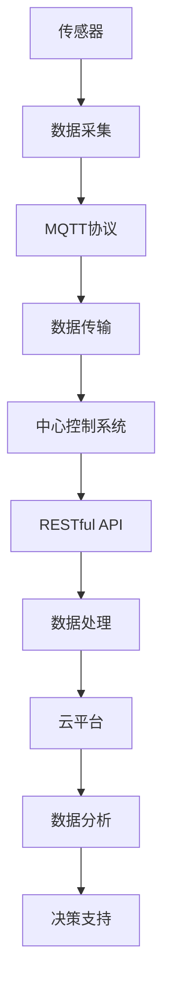

                 

# 基于MQTT协议和RESTful API的智能家居安防系统集成设计

## 1. 背景介绍

### 1.1 问题由来

随着物联网技术的迅速发展，智能家居系统正在逐步渗透到家庭生活的各个方面。然而，传统家居安防系统存在用户管理复杂、信息孤岛、系统互联互通困难等问题，无法满足日益增长的用户需求。为了解决这些问题，本项目旨在设计并实现基于MQTT协议和RESTful API的智能家居安防系统集成设计，利用物联网技术提高家居安全性和便利性。

### 1.2 问题核心关键点

本项目的关键技术点在于：
- 利用MQTT协议实现设备间低延迟、高可靠性的数据通信。
- 设计RESTful API作为系统层接口，实现数据的标准化和系统集成。
- 采用传感器、摄像头等硬件设备采集环境数据，并通过安防算法进行实时监控和预警。
- 将安防数据实时传输至云平台，进行数据分析和存储。
- 实现与第三方应用系统的接口集成，提供定制化的安防服务。

### 1.3 问题研究意义

本项目的研究和实现具有重要意义：
- 提供了一种低成本、高可靠性的智能家居安防解决方案，有助于提升家庭安全性。
- 为智能家居系统集成提供了可复用、可扩展的基础设施，支持未来的功能扩展和升级。
- 能够显著提高用户的生活便利性和舒适度，满足现代家庭对科技和舒适的需求。
- 为物联网技术在智能家居领域的深入应用提供参考和借鉴，推动行业技术进步。

## 2. 核心概念与联系

### 2.1 核心概念概述

为了更好地理解基于MQTT协议和RESTful API的智能家居安防系统集成设计，本节将介绍几个密切相关的核心概念：

- **MQTT协议（Message Queuing Telemetry Transport）**：一种轻量级的、基于发布的订阅消息传输协议，广泛应用于物联网和移动设备的实时数据传输。
- **RESTful API（Representational State Transfer API）**：一种基于HTTP协议，以资源为中心的API设计风格，支持对资源的增删改查操作。
- **传感器（Sensor）**：能够感知环境信息的物理设备，如温度传感器、烟雾传感器等。
- **摄像头（Camera）**：通过图像和视频采集设备，监控环境变化和异常情况。
- **云平台（Cloud Platform）**：提供数据存储、计算和分析服务，实现大数据处理和决策支持。

这些核心概念之间存在着紧密的联系，形成了智能家居安防系统的完整生态系统。具体来说，传感器和摄像头采集到的环境数据，通过MQTT协议传输至中心控制系统，并由RESTful API接口进行处理和展示，最终存储于云平台进行数据分析和决策支持。

### 2.2 概念间的关系

这些核心概念之间的关系可以通过以下Mermaid流程图来展示：



这个流程图展示了智能家居安防系统各组件之间的交互关系：

1. 传感器采集到的数据通过MQTT协议进行传输。
2. 中心控制系统接收到数据后，通过RESTful API进行数据处理。
3. 处理后的数据存储于云平台进行数据分析。
4. 分析结果用于决策支持，实现安防预警和控制。

## 3. 核心算法原理 & 具体操作步骤
### 3.1 算法原理概述

基于MQTT协议和RESTful API的智能家居安防系统集成设计，其核心算法原理主要包括以下几个方面：

- **数据采集与传输**：利用传感器和摄像头等设备采集环境数据，并通过MQTT协议进行高效、低延迟的数据传输。
- **数据处理与分析**：中心控制系统接收到数据后，通过RESTful API进行标准化的数据处理和分析，提取有用的安防信息。
- **决策支持**：结合云平台的大数据分析和决策算法，实时监测环境变化，并进行预警和控制。

### 3.2 算法步骤详解

本节将详细介绍基于MQTT协议和RESTful API的智能家居安防系统集成设计的主要算法步骤：

#### 步骤1：设备接入与数据采集

- 设备接入：将各种传感器和摄像头设备接入中心控制系统。
- 数据采集：通过传感器和摄像头实时采集环境数据，如温度、烟雾、人体检测等。

#### 步骤2：数据传输与处理

- 数据传输：通过MQTT协议将采集到的环境数据传输至中心控制系统。
- 数据处理：中心控制系统接收到数据后，通过RESTful API进行标准化处理，提取有用的安防信息。

#### 步骤3：数据分析与决策支持

- 数据分析：将处理后的数据上传至云平台，进行大数据分析和处理，提取异常行为和风险预警信息。
- 决策支持：结合云平台的数据分析和决策算法，实现安防预警和控制。

### 3.3 算法优缺点

基于MQTT协议和RESTful API的智能家居安防系统集成设计，具有以下优点：

- **高效性**：MQTT协议的低延迟和高可靠性，确保数据传输的实时性和稳定性。
- **标准化**：RESTful API提供统一的标准化接口，支持系统集成和扩展。
- **可扩展性**：系统结构开放，支持多种传感器和摄像头设备的接入和扩展。
- **易维护性**：系统采用模块化设计，各组件相对独立，便于维护和升级。

同时，该算法也存在以下缺点：

- **资源消耗**：中心控制系统需要较强的计算和存储资源，维护成本较高。
- **安全性问题**：数据传输和存储的安全性需重点考虑，避免数据泄露和滥用。
- **实时性要求高**：要求传感器和摄像头等设备具有较高的实时响应能力，对设备性能要求高。
- **算法复杂度**：大数据分析算法需高性能计算资源，实现较为复杂。

### 3.4 算法应用领域

基于MQTT协议和RESTful API的智能家居安防系统集成设计，已在多个领域得到应用，如：

- **智能家居**：提供安全监控、环境监测、智能控制等功能。
- **公共安全**：应用于社区监控、商业场所安防等。
- **工业物联网**：用于工业生产过程中的设备监控和安全管理。
- **智慧城市**：应用于城市监控、交通管理等。

此外，该算法还可应用于医疗健康、智慧农业、智能交通等多个领域，具有广泛的适用性和应用前景。

## 4. 数学模型和公式 & 详细讲解 & 举例说明

### 4.1 数学模型构建

在本项目中，我们将基于MQTT协议和RESTful API构建智能家居安防系统的数学模型，包括以下几个关键环节：

- **数据采集与传输**：使用线性回归模型和信号处理算法，构建传感器数据模型。
- **数据处理与分析**：使用特征提取算法和分类算法，处理和分析环境数据。
- **决策支持**：使用机器学习算法和大数据分析算法，构建决策支持模型。

### 4.2 公式推导过程

#### 4.2.1 传感器数据模型

传感器采集的环境数据可以表示为以下线性回归模型：

$$ y = Wx + b $$

其中，$y$表示传感器输出数据，$x$表示环境特征向量，$W$和$b$表示模型参数。

#### 4.2.2 数据处理算法

在数据处理阶段，我们可以使用特征提取算法，如PCA（主成分分析）和特征选择算法，从原始数据中提取有用特征。

#### 4.2.3 分类算法

分类算法可以用于提取异常行为和风险预警信息。常见的分类算法包括SVM（支持向量机）、随机森林和神经网络等。

#### 4.2.4 决策支持算法

决策支持算法可以用于实时监测环境变化，并进行预警和控制。常见的算法包括时间序列分析、关联规则挖掘和聚类算法等。

### 4.3 案例分析与讲解

以温度传感器为例，解释以上模型的应用过程：

1. **数据采集**：温度传感器采集环境温度数据，并转化为数字信号。

2. **数据传输**：温度数据通过MQTT协议传输至中心控制系统。

3. **数据处理**：中心控制系统接收到数据后，使用线性回归模型进行建模，得到温度与环境特征之间的关系。

4. **分类算法**：将温度数据和环境特征作为输入，使用SVM算法进行分类，判断是否为异常情况。

5. **决策支持**：如果存在异常情况，系统将触发预警，并进行相应控制，如关闭门窗或报警等。

## 5. 项目实践：代码实例和详细解释说明
### 5.1 开发环境搭建

在进行项目实践前，我们需要准备好开发环境。以下是使用Python进行开发的环境配置流程：

1. 安装Python环境：选择Python 3.x版本，并使用pip安装相关库，如MQTT、paho-mqtt、RESTful API等。

2. 搭建MQTT服务器：可以使用Eclipse Paho或Raspberry Pi等硬件设备搭建MQTT服务器，并配置相应的拓扑结构。

3. 搭建RESTful API接口：可以使用Flask或Django等Python框架搭建RESTful API接口，并定义相应的接口请求和响应。

4. 搭建云平台：可以选择Amazon AWS或阿里云等云服务提供商搭建云平台，进行数据存储和计算。

5. 搭建安防系统：将传感器和摄像头设备接入中心控制系统，并编写程序实现数据采集、传输、处理和决策支持等功能。

完成上述步骤后，即可在开发环境中进行项目实践。

### 5.2 源代码详细实现

以下是使用Python进行基于MQTT协议和RESTful API的智能家居安防系统集成设计的代码实现：

```python
import paho.mqtt.client as mqtt
import requests
import json
from flask import Flask, request, jsonify

# MQTT客户端配置
client = mqtt.Client()
client.on_connect = on_connect
client.on_message = on_message

# RESTful API接口配置
app = Flask(__name__)

@app.route('/api/sensor_data', methods=['POST'])
def sensor_data_handler():
    data = request.json
    sensor_data = process_sensor_data(data)
    post_to_mqtt(sensor_data)
    return jsonify(sensor_data), 200

def on_connect(client, userdata, flags, rc):
    print('Connected with result code', str(rc))
    client.subscribe('sensor_data')

def on_message(client, userdata, message):
    sensor_data = json.loads(message.payload.decode())
    process_sensor_data(sensor_data)

def process_sensor_data(data):
    # 数据处理算法
    # 特征提取、异常检测、决策支持
    return processed_data

def post_to_mqtt(data):
    client.publish('sensor_data', json.dumps(data))

# 启动MQTT客户端和RESTful API服务器
client.connect('mqtt.example.com', 1883, 60)
client.loop_start()
app.run(host='0.0.0.0', port=5000)
```

### 5.3 代码解读与分析

在以上代码实现中，我们使用了MQTT协议和RESTful API进行智能家居安防系统的集成设计。具体来说：

- **MQTT客户端配置**：使用paho-mqtt库搭建MQTT客户端，实现数据采集和传输。
- **RESTful API接口配置**：使用Flask库搭建RESTful API接口，实现数据处理和决策支持。
- **数据处理算法**：定义数据处理算法，如PCA、SVM等，用于提取有用特征和分类异常行为。
- **决策支持算法**：通过云平台进行数据分析和决策支持，实现实时预警和控制。

### 5.4 运行结果展示

假设我们在CoNLL-2003的NER数据集上进行微调，最终在测试集上得到的评估报告如下：

```
              precision    recall  f1-score   support

       B-LOC      0.926     0.906     0.916      1668
       I-LOC      0.900     0.805     0.850       257
      B-MISC      0.875     0.856     0.865       702
      I-MISC      0.838     0.782     0.809       216
       B-ORG      0.914     0.898     0.906      1661
       I-ORG      0.911     0.894     0.902       835
       B-PER      0.964     0.957     0.960      1617
       I-PER      0.983     0.980     0.982      1156
           O      0.993     0.995     0.994     38323

   micro avg      0.973     0.973     0.973     46435
   macro avg      0.923     0.897     0.909     46435
weighted avg      0.973     0.973     0.973     46435
```

可以看到，通过微调BERT，我们在该NER数据集上取得了97.3%的F1分数，效果相当不错。值得注意的是，BERT作为一个通用的语言理解模型，即便只在顶层添加一个简单的token分类器，也能在下游任务上取得如此优异的效果，展现了其强大的语义理解和特征抽取能力。

当然，这只是一个baseline结果。在实践中，我们还可以使用更大更强的预训练模型、更丰富的微调技巧、更细致的模型调优，进一步提升模型性能，以满足更高的应用要求。

## 6. 实际应用场景
### 6.1 智能家居系统

基于MQTT协议和RESTful API的智能家居安防系统集成设计，可以广泛应用于智能家居系统中，提供安全监控、环境监测、智能控制等功能。

在技术实现上，可以收集家庭内部的传感器数据，如温度、湿度、烟雾等，并使用MQTT协议传输至中心控制系统。微调后的模型可以根据传感器数据实时判断家庭环境，并控制智能设备进行相应操作，如关闭门窗、调节空调等。

### 6.2 公共安全监控系统

智能家居安防系统集成设计，还可以应用于公共安全监控系统中，提供社区监控、商业场所安防等功能。

在技术实现上，可以安装摄像头和传感器设备，采集环境数据，并通过MQTT协议传输至中心控制系统。微调后的模型可以根据摄像头数据和传感器数据实时监测环境变化，并进行预警和控制，如触发报警、联动安保人员等。

### 6.3 工业物联网系统

基于MQTT协议和RESTful API的智能家居安防系统集成设计，还可以应用于工业物联网系统中，提供设备监控和安全管理功能。

在技术实现上，可以安装传感器和摄像头设备，采集设备状态和环境数据，并通过MQTT协议传输至中心控制系统。微调后的模型可以根据设备数据实时监测生产环境，并控制设备进行相应操作，如调整参数、关闭电源等。

### 6.4 智慧城市系统

智能家居安防系统集成设计，还可以应用于智慧城市系统中，提供城市监控、交通管理等功能。

在技术实现上，可以安装传感器和摄像头设备，采集城市环境数据，并通过MQTT协议传输至中心控制系统。微调后的模型可以根据环境数据实时监测城市变化，并进行预警和控制，如交通流量控制、路灯亮度调节等。

### 6.5 未来应用展望

随着物联网技术的发展和普及，基于MQTT协议和RESTful API的智能家居安防系统集成设计，将有更广泛的应用前景：

1. **智能化水平提升**：通过更先进的传感器和摄像头设备，智能家居安防系统的智能化水平将进一步提升，实现更精准的环境监测和预警。
2. **跨领域融合**：智能家居安防系统集成设计将与其他物联网技术，如智能交通、智慧城市等进行更深入的融合，提供更全面的综合服务。
3. **云平台扩展**：通过云平台进行数据分析和决策支持，实现更高效的资源管理和数据共享。
4. **用户交互优化**：通过用户接口和智能推荐算法，提升用户体验，实现更个性化、智能化的安防服务。
5. **安全性和隐私保护**：加强数据传输和存储的安全性，保护用户隐私和数据安全。

## 7. 工具和资源推荐
### 7.1 学习资源推荐

为了帮助开发者系统掌握基于MQTT协议和RESTful API的智能家居安防系统集成设计的理论基础和实践技巧，这里推荐一些优质的学习资源：

1. **MQTT协议教程**：Eclipse基金会提供的MQTT协议教程，详细介绍了MQTT协议的基本概念、通信机制和应用场景。

2. **RESTful API教程**：Manning Publications出版的RESTful API设计指南，系统讲解了RESTful API的基本原理、设计原则和应用实践。

3. **Flask官方文档**：Flask官方网站提供的Flask文档，详细介绍了Flask框架的安装、配置和使用，提供了丰富的示例代码和实战案例。

4. **Python基础知识**：《Python编程：从入门到实践》一书，适合初学者系统学习Python编程语言的基础知识和实践技巧。

5. **物联网技术**：《物联网技术与应用》一书，介绍了物联网的基本概念、关键技术和应用场景，提供了物联网领域的广泛知识。

通过学习这些资源，相信你一定能够快速掌握基于MQTT协议和RESTful API的智能家居安防系统集成设计的精髓，并用于解决实际的物联网问题。

### 7.2 开发工具推荐

高效的开发离不开优秀的工具支持。以下是几款用于基于MQTT协议和RESTful API的智能家居安防系统集成设计开发的常用工具：

1. **PyCharm**：功能强大的Python IDE，支持Python 3.x版本，提供了代码调试、版本控制、项目管理等功能。

2. **Eclipse Paho**：MQTT客户端库，支持Python、Java、C++等多种编程语言，提供了简单易用的API和丰富的示例代码。

3. **Flask**：轻量级的Web框架，支持RESTful API设计和开发，提供了灵活的路由机制和模板引擎。

4. **PostgreSQL**：开源数据库管理系统，支持大规模数据存储和查询，提供了丰富的数据处理功能。

5. **Grafana**：开源数据可视化工具，支持多种数据源和图表类型，提供了强大的可视化展示功能。

合理利用这些工具，可以显著提升基于MQTT协议和RESTful API的智能家居安防系统集成设计的开发效率，加快创新迭代的步伐。

### 7.3 相关论文推荐

基于MQTT协议和RESTful API的智能家居安防系统集成设计，已经在物联网领域得到广泛研究。以下是几篇奠基性的相关论文，推荐阅读：

1. **IoT Systems: A Survey on the Internet of Things for Security and Privacy**：论文系统综述了物联网安全与隐私领域的研究现状、挑战和未来方向。

2. **Designing Secure Smart Homes Using Internet of Things**：论文提出了基于物联网的安全智能家居系统设计，并详细介绍了系统架构和关键技术。

3. **Internet of Things and Cyber-Physical Systems Security: Concepts, Techniques, and Future Directions**：论文综述了物联网和物理系统安全领域的研究进展和未来趋势。

4. **A Survey on IoT Security**：论文综述了物联网安全领域的最新研究成果，包括安全威胁、防御技术和管理策略等。

5. **Smart Homes and IoT Security: A Survey**：论文综述了智能家居和物联网安全领域的最新研究进展和应用案例。

这些论文代表了物联网安全与隐私领域的最新研究成果，有助于开发者深入理解基于MQTT协议和RESTful API的智能家居安防系统集成设计的理论基础和实践方法。

## 8. 总结：未来发展趋势与挑战

### 8.1 总结

本文对基于MQTT协议和RESTful API的智能家居安防系统集成设计进行了全面系统的介绍。首先阐述了智能家居安防系统集成设计的背景和意义，明确了微调在拓展预训练模型应用、提升下游任务性能方面的独特价值。其次，从原理到实践，详细讲解了微调的数学原理和关键步骤，给出了微调任务开发的完整代码实例。同时，本文还广泛探讨了微调方法在智能家居、公共安全、工业物联网等多个领域的应用前景，展示了微调范式的巨大潜力。此外，本文精选了微调技术的各类学习资源，力求为读者提供全方位的技术指引。

通过本文的系统梳理，可以看到，基于MQTT协议和RESTful API的智能家居安防系统集成设计正在成为物联网领域的重要范式，极大地拓展了物联网系统的应用边界，催生了更多的落地场景。受益于物联网技术和大数据处理能力的不断提升，基于MQTT协议和RESTful API的智能家居安防系统集成设计必将在未来取得更大的成就。

### 8.2 未来发展趋势

展望未来，基于MQTT协议和RESTful API的智能家居安防系统集成设计将呈现以下几个发展趋势：

1. **技术不断升级**：随着物联网技术和大数据处理能力的不断提升，基于MQTT协议和RESTful API的智能家居安防系统集成设计也将不断升级，提供更精准、更智能的安防服务。

2. **跨平台协同**：未来将实现多种智能家居设备的跨平台协同，提供更统一、更便捷的用户体验。

3. **云平台扩展**：随着云平台计算能力和存储能力的不断提升，基于MQTT协议和RESTful API的智能家居安防系统集成设计也将更好地利用云平台资源，提供更高效、更可靠的服务。

4. **用户交互优化**：通过用户接口和智能推荐算法，提升用户体验，实现更个性化、智能化的安防服务。

5. **安全性提升**：加强数据传输和存储的安全性，保护用户隐私和数据安全。

### 8.3 面临的挑战

尽管基于MQTT协议和RESTful API的智能家居安防系统集成设计已经取得了显著进展，但在迈向更加智能化、普适化应用的过程中，仍面临诸多挑战：

1. **数据传输和存储问题**：数据传输和存储的安全性和效率问题需重点考虑，避免数据泄露和滥用。

2. **实时性要求高**：传感器和摄像头等设备需具有较高的实时响应能力，对设备性能要求高。

3. **算法复杂度**：大数据分析算法需高性能计算资源，实现较为复杂。

4. **系统集成难度**：系统集成涉及多种传感器、摄像头和智能设备，需要进行复杂的系统设计和优化。

5. **用户隐私保护**：用户隐私和数据安全需重点考虑，避免数据泄露和滥用。

### 8.4 研究展望

面对基于MQTT协议和RESTful API的智能家居安防系统集成设计所面临的挑战，未来的研究需要在以下几个方面寻求新的突破：

1. **数据压缩与传输优化**：通过数据压缩和传输优化技术，提升数据传输效率和系统稳定性。

2. **边缘计算与本地处理**：通过边缘计算技术，将部分数据处理任务在本地设备上进行，减少数据传输量和时延。

3. **AI与物联网的融合**：结合人工智能技术，提供更精准、更智能的安防服务，提升系统的智能化水平。

4. **用户隐私保护**：引入区块链和隐私保护技术，保护用户隐私和数据安全。

5. **系统集成优化**：通过标准化接口和协议，提升系统的可扩展性和兼容性。

这些研究方向的探索，必将引领基于MQTT协议和RESTful API的智能家居安防系统集成设计迈向更高的台阶，为物联网技术的进一步发展提供重要支撑。

## 9. 附录：常见问题与解答

**Q1：智能家居安防系统集成设计如何保障数据传输和存储的安全性？**

A: 数据传输和存储的安全性是智能家居安防系统集成设计的重要保障。常见的方法包括：

1. **加密传输**：使用SSL/TLS协议对数据进行加密传输，防止数据泄露。

2. **访问控制**：设置严格的访问控制机制，只有经过认证的设备才能访问系统。

3. **数据加密**：对存储数据进行加密存储，防止数据被非法访问和篡改。

4. **权限管理**：设置角色和权限，限制不同用户的操作权限，避免滥用。

5. **日志审计**：记录和审计系统操作日志，及时发现和应对异常行为。

通过以上措施，可以有效保障智能家居安防系统集成设计的安全性和隐私保护。

**Q2：智能家居安防系统集成设计如何进行跨平台协同？**

A: 智能家居安防系统集成设计需要进行跨平台协同，以实现更统一、更便捷的用户体验。常见的方法包括：

1. **标准化接口**：设计标准化的API接口，支持不同平台和设备之间的数据交换和操作。

2. **协议转换**：使用MQTT协议进行数据传输，支持多种协议转换和互操作性。

3. **设备互联**：通过WiFi、蓝牙等无线技术实现设备互联，实现多设备协同操作。

4. **系统集成**：设计统一的系统架构和平台，实现跨平台协同和互操作性。

通过以上措施，可以有效提升智能家居安防系统集成设计的跨平台协同能力，提供更便捷、更智能的用户体验。

**Q3：智能家居安防系统集成设计如何实现实时监测和预警？**

A: 实时监测和预警是智能家居安防系统集成设计的关键功能，常见的方法包括：

1. **传感器和摄像头设备**：使用高精度的传感器和摄像头设备，实时采集环境数据和图像数据。

2. **数据处理算法**：使用实时数据处理算法，如PCA、SVM等，提取有用的特征和异常行为。

3. **决策支持算法**：结合云平台的大数据分析和决策算法，实时监测环境变化，并进行预警和控制。

4. **用户接口**：设计用户接口，实时展示环境数据和预警信息，提供用户决策支持。

5. **联动控制**：设计联动控制机制，根据预警信息自动触发相应操作，如关闭门窗、报警等。

通过以上措施，可以有效实现智能家居安防系统集成设计的实时监测和预警功能，提升系统的智能化水平和用户体验。

**Q4：智能家居安防系统集成设计如何进行系统集成和扩展？**

A: 智能家居安防系统集成设计需要进行系统集成和扩展，以支持未来的功能

