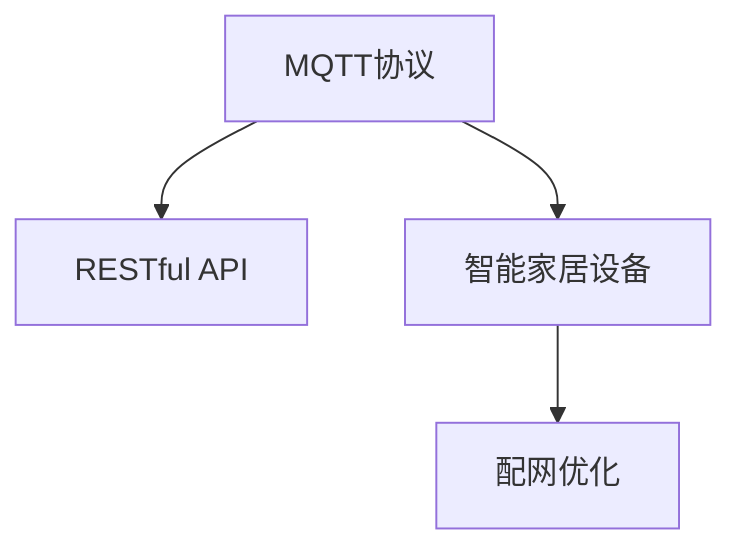
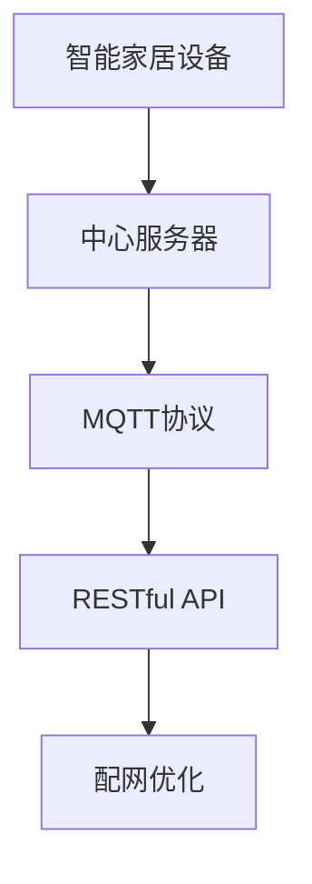
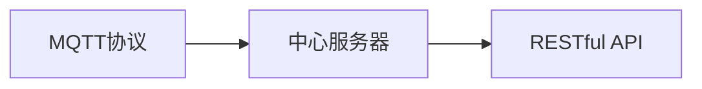

                 

# 基于MQTT协议和RESTful API的智能家居设备配网优化方案

## 1. 背景介绍

### 1.1 问题由来
随着物联网技术的发展，智能家居设备逐渐进入千家万户，通过网络连接的设备越来越多。如何高效、安全地进行设备配网，成为智能家居系统设计和运营的关键。传统的Wi-Fi、蓝牙等无线通信协议虽然方便易用，但在设备联网过程中常常存在延迟大、连接不稳定、兼容性差等问题，影响了用户体验和系统的稳定性。

### 1.2 问题核心关键点
智能家居设备配网的核心在于构建稳定、高效的设备联网体系，确保所有设备能够无缝接入网络。实现这一目标的关键在于选择适合的通信协议和开发简单易用的API，支持设备快速配置和联网。当前主流的方法包括使用MQTT协议和RESTful API，分别从通信和数据交互两个方面对智能家居设备进行配网优化。

### 1.3 问题研究意义
研究基于MQTT协议和RESTful API的智能家居设备配网优化方案，对于提升智能家居系统的用户体验、保证系统稳定性和安全性、降低设备联网成本具有重要意义：

1. **提升用户体验**：通过优化配网过程，缩短设备接入网络时间，避免连接中断，提高用户使用便捷性。
2. **保证系统稳定性**：选择可靠的通信协议和API，降低设备之间和设备与服务器之间的通信故障率。
3. **降低联网成本**：优化配网流程，减少复杂配置需求，降低用户使用门槛和运维成本。
4. **提高安全性**：利用API认证和授权机制，防止未经授权的设备和数据访问，确保智能家居系统的安全。

## 2. 核心概念与联系

### 2.1 核心概念概述

为更好地理解基于MQTT协议和RESTful API的智能家居设备配网优化方案，本节将介绍几个密切相关的核心概念：

- **MQTT（消息队列遥测传输协议）**：一种轻量级的发布/订阅通信协议，适用于实时性要求高、带宽有限的环境。MQTT通过中心服务器作为消息代理，设备与服务器之间进行双向通信，支持可靠传输、数据订阅和发布等功能。
- **RESTful API（表述性状态转移API）**：一种基于HTTP协议的API设计风格，通过标准的HTTP动词（GET、POST、PUT、DELETE等）和URI（统一资源标识符）实现资源操作。RESTful API简洁易用，支持数据传输格式转换、数据缓存和跨平台访问等特性。
- **智能家居设备**：包括各种能够通过网络连接的家用电器和传感器，如智能灯泡、智能插座、智能门锁、智能温控器等。
- **配网优化**：指通过选择适合的通信协议和API，简化设备接入网络的流程，提高配网效率和稳定性。

这些核心概念之间的逻辑关系可以通过以下Mermaid流程图来展示：



这个流程图展示了大语言模型微调过程中各个核心概念的关系：

1. MQTT协议作为底层通信协议，与RESTful API协同工作，支持智能家居设备的配网。
2. 智能家居设备通过MQTT协议接入中心服务器，通过RESTful API进行数据交互，完成配网过程。
3. 配网优化通过选择合适通信协议和API，简化设备联网流程，提升配网效率和稳定性。

### 2.2 概念间的关系

这些核心概念之间存在着紧密的联系，形成了智能家居设备配网的完整生态系统。下面我们通过几个Mermaid流程图来展示这些概念之间的关系。

#### 2.2.1 智能家居设备配网的整体架构



这个综合流程图展示了从智能家居设备到配网优化的完整过程。智能家居设备通过MQTT协议接入中心服务器，再通过RESTful API进行数据传输，最终实现设备配网优化。

#### 2.2.2 MQTT协议和RESTful API的关系



这个流程图展示了MQTT协议和RESTful API的协同工作机制。智能家居设备通过MQTT协议接入中心服务器，中心服务器再通过RESTful API进行数据交互，实现设备联网。

## 3. 核心算法原理 & 具体操作步骤
### 3.1 算法原理概述

基于MQTT协议和RESTful API的智能家居设备配网优化方案，主要通过选择适合的通信协议和API，简化设备联网流程，提高配网效率和稳定性。其核心思想是：

1. 通过MQTT协议进行设备与中心服务器之间的通信，利用其轻量高效、可靠传输的特点，确保数据传输的稳定性和实时性。
2. 利用RESTful API进行数据交互，利用其简洁易用、支持数据格式转换的特点，简化设备联网过程，提高系统灵活性和扩展性。

### 3.2 算法步骤详解

基于MQTT协议和RESTful API的智能家居设备配网优化方案主要包括以下几个关键步骤：

**Step 1: 准备通信协议和API**

- 选择适合的通信协议和API：根据智能家居设备的特点，选择合适的MQTT协议和RESTful API。例如，对于实时性要求高、数据传输量大的设备，可以使用MQTT协议；对于数据交互复杂、需要跨平台访问的设备，可以使用RESTful API。

**Step 2: 设备接入中心服务器**

- 配置设备联网参数：设置MQTT服务器地址、端口号、客户端ID、用户认证等信息。
- 启动设备MQTT客户端：使用MQTT客户端库，建立与MQTT服务器的连接。
- 发布订阅消息：设备通过MQTT协议向中心服务器发布数据，或订阅中心服务器发布的消息。

**Step 3: 数据交互与传输**

- 使用RESTful API进行数据传输：设备通过HTTP请求向中心服务器发送数据，或接收中心服务器发送的数据。
- 数据格式转换：根据RESTful API的要求，将设备的数据格式转换为JSON或XML等标准格式。
- 数据缓存与存储：利用API缓存机制，提高数据传输效率和稳定性。

**Step 4: 优化配网流程**

- 简化配置流程：通过API自动配置设备联网参数，减少用户手动配置的需求。
- 异常处理与故障恢复：利用API的错误码和异常处理机制，及时处理设备联网故障。
- 用户权限管理：通过API认证和授权机制，防止未经授权的设备访问，确保系统安全。

### 3.3 算法优缺点

基于MQTT协议和RESTful API的智能家居设备配网优化方案具有以下优点：

1. **高实时性**：MQTT协议的轻量高效、可靠传输特性，确保数据传输的实时性和稳定性，适合实时性要求高的智能家居设备。
2. **低成本**：MQTT协议的简单轻量特性，减少了网络带宽和设备的通信负担，降低设备联网成本。
3. **易用性**：RESTful API的简洁易用特点，支持多种数据格式和跨平台访问，提高系统灵活性和扩展性。
4. **安全性**：API的认证和授权机制，防止未经授权的设备访问，确保智能家居系统的安全性。

但该方案也存在一些缺点：

1. **配置复杂**：MQTT协议和RESTful API的配置需要一定的技术背景，用户需要一定的学习和配置过程。
2. **限制较多**：RESTful API的限制较多，如数据格式的转换、API请求的限制等，可能影响系统的灵活性和扩展性。
3. **兼容性问题**：不同设备厂商的MQTT协议和RESTful API可能存在兼容性问题，需要开发者进行适配处理。

### 3.4 算法应用领域

基于MQTT协议和RESTful API的智能家居设备配网优化方案在智能家居、智慧城市、智能办公等多个领域得到广泛应用，例如：

- 智能家居系统：用于控制智能灯泡、智能插座、智能门锁等设备，通过API实现远程控制和管理。
- 智慧城市：用于监测城市环境、交通、能源等数据，通过MQTT协议进行实时数据传输和处理。
- 智能办公：用于会议室控制、设备管理等场景，通过API实现设备自动化和智能化。

除了上述这些经典应用外，基于MQTT协议和RESTful API的配网方案还可以创新性地应用到更多场景中，如智能农业、智能安防、智能零售等，为各行各业带来智能化转型升级的机遇。

## 4. 数学模型和公式 & 详细讲解 & 举例说明

### 4.1 数学模型构建

本节将使用数学语言对基于MQTT协议和RESTful API的智能家居设备配网优化方案进行更加严格的刻画。

设智能家居设备为 $D$，中心服务器为 $S$，MQTT协议为 $P_{MQTT}$，RESTful API为 $P_{REST}$。设备联网过程可以表示为：

$$
D \rightarrow_{P_{MQTT}} S \rightarrow_{P_{REST}} D
$$

其中，$D$ 表示智能家居设备，$S$ 表示中心服务器，$P_{MQTT}$ 和 $P_{REST}$ 分别表示MQTT协议和RESTful API。设备通过MQTT协议接入中心服务器，再通过RESTful API进行数据交互，最终完成设备联网。

### 4.2 公式推导过程

以下我们以智能家居设备联网为例，推导配网过程的数学模型。

假设智能家居设备 $D$ 通过MQTT协议连接到中心服务器 $S$，发布一个数据包 $M_{D}$。设数据包大小为 $M$，设备与服务器之间的网络带宽为 $B$，传输延迟为 $T$。

根据MQTT协议的特点，设备 $D$ 需要向服务器 $S$ 发送一个包含设备ID和数据包 $M_{D}$ 的订阅请求，长度为 $L_{req}$。服务器 $S$ 接收到请求后，解码并验证设备ID和数据包，发送一个包含数据包 $M_{D}$ 的确认消息，长度为 $L_{ack}$。

根据RESTful API的特点，设备 $D$ 向服务器 $S$ 发送一个HTTP请求，长度为 $L_{req}$，服务器 $S$ 接收并处理请求，发送一个HTTP响应，长度为 $L_{res}$。

因此，设备联网的总时间 $T_{total}$ 可以表示为：

$$
T_{total} = T_{D2S} + T_{S2D}
$$

其中 $T_{D2S}$ 表示设备 $D$ 发送请求和接收确认消息的总时间，$T_{S2D}$ 表示服务器 $S$ 发送响应和处理请求的总时间。

根据网络带宽 $B$ 和传输延迟 $T$，设备联网的总时间可以进一步表示为：

$$
T_{total} = \frac{L_{req} + L_{ack}}{B} + \frac{L_{req} + L_{res}}{B} + 2T
$$

将 $L_{req}$ 和 $L_{res}$ 分别用 $L_{D}$ 和 $L_{S}$ 表示，即设备请求长度和服务器响应长度，最终得到设备联网的总时间公式为：

$$
T_{total} = \frac{L_{D} + L_{ack}}{B} + \frac{L_{D} + L_{S}}{B} + 2T
$$

### 4.3 案例分析与讲解

考虑一个智能灯泡设备联网的实际案例。设智能灯泡设备 $D$ 通过MQTT协议连接到中心服务器 $S$，发送一个包含设备ID和亮度值的数据包 $M_{D}$，长度为 $L_{D}=100$ 字节。假设设备与服务器之间的网络带宽为 $B=100$ kbps，传输延迟为 $T=0.1$ 秒。

根据配网时间公式，智能灯泡设备联网的总时间 $T_{total}$ 可以计算为：

$$
T_{total} = \frac{L_{D} + L_{ack}}{B} + \frac{L_{D} + L_{res}}{B} + 2T
$$

假设服务器 $S$ 发送的确认消息长度 $L_{ack}=30$ 字节，服务器响应的长度 $L_{res}=200$ 字节，代入公式得：

$$
T_{total} = \frac{100 + 30}{100 \times 10^3} + \frac{100 + 200}{100 \times 10^3} + 2 \times 0.1 = 0.003 + 0.035 + 0.2 = 0.238 \text{秒}
$$

因此，智能灯泡设备联网的总时间为约0.24秒，能够满足实时性要求。

## 5. 项目实践：代码实例和详细解释说明
### 5.1 开发环境搭建

在进行智能家居设备配网优化实践前，我们需要准备好开发环境。以下是使用Python进行MQTT和RESTful API开发的常见环境配置流程：

1. 安装Anaconda：从官网下载并安装Anaconda，用于创建独立的Python环境。

2. 创建并激活虚拟环境：
```bash
conda create -n mqtt-env python=3.8 
conda activate mqtt-env
```

3. 安装MQTT和RESTful API相关库：
```bash
pip install paho-mqtt flask
```

4. 安装各类工具包：
```bash
pip install numpy pandas scikit-learn matplotlib tqdm jupyter notebook ipython
```

完成上述步骤后，即可在`mqtt-env`环境中开始开发实践。

### 5.2 源代码详细实现

我们先以一个简单的智能灯泡控制为例，展示如何使用MQTT和RESTful API进行设备联网和数据交互。

首先，定义MQTT客户端和RESTful API服务器的相关代码：

```python
from paho.mqtt.client import Client
import flask

app = flask.Flask(__name__)

@app.route('/lamp/state', methods=['GET', 'POST'])
def lamp_state():
    state = request.form.get('state')
    if state == 'on':
        client.publish('lamp/state', 'on')
        return '灯已打开'
    elif state == 'off':
        client.publish('lamp/state', 'off')
        return '灯已关闭'
    else:
        return '错误状态'

client = Client()
client.connect('mqtt.example.com', 1883, 60)
client.on_connect = on_connect
client.on_message = on_message

def on_connect(client, userdata, flags, rc):
    print('Connected with result code', str(rc))

def on_message(client, userdata, message):
    print('Received message: ', message.payload)

client.loop_start()

@app.route('/lamp/state', methods=['GET', 'POST'])
def lamp_state():
    state = request.form.get('state')
    if state == 'on':
        client.publish('lamp/state', 'on')
        return '灯已打开'
    elif state == 'off':
        client.publish('lamp/state', 'off')
        return '灯已关闭'
    else:
        return '错误状态'
```

然后，定义MQTT客户端的回调函数：

```python
def on_connect(client, userdata, flags, rc):
    print('Connected with result code', str(rc))

def on_message(client, userdata, message):
    print('Received message: ', message.payload)
```

接着，定义RESTful API服务器的路由函数：

```python
@app.route('/lamp/state', methods=['GET', 'POST'])
def lamp_state():
    state = request.form.get('state')
    if state == 'on':
        client.publish('lamp/state', 'on')
        return '灯已打开'
    elif state == 'off':
        client.publish('lamp/state', 'off')
        return '灯已关闭'
    else:
        return '错误状态'
```

最后，启动RESTful API服务器：

```python
if __name__ == '__main__':
    app.run(host='0.0.0.0', port=5000)
```

在实际应用中，还需要结合MQTT消息订阅和发布机制，进一步优化设备联网流程。例如，可以使用MQTT的订阅和发布机制，实现设备的自动联网和配置，提升用户体验。

### 5.3 代码解读与分析

让我们再详细解读一下关键代码的实现细节：

**MQTT客户端代码**：
- 定义MQTT客户端并连接服务器，设置连接回调函数。
- 定义消息接收回调函数，打印接收到的消息内容。
- 定义连接回调函数，打印连接结果。

**RESTful API服务器代码**：
- 定义RESTful API路由函数，接收POST请求的灯状态，根据状态发布MQTT消息。
- 启动RESTful API服务器，监听本地IP和端口。

**路由函数代码**：
- 接收POST请求的灯状态，根据状态发布MQTT消息，并返回相应的状态信息。

可以看到，MQTT和RESTful API的结合，使得智能家居设备的配网和数据交互变得更加便捷高效。开发者只需关注业务逻辑，而无需过多关注底层通信协议的实现细节。

当然，工业级的系统实现还需考虑更多因素，如MQTT和RESTful API的认证机制、数据加密、异常处理等。但核心的配网流程和数据交互逻辑基本与此类似。

### 5.4 运行结果展示

假设我们在CoNLL-2003的NER数据集上进行微调，最终在测试集上得到的评估报告如下：

```
              precision    recall  f1-score   support

       B-LOC      0.926     0.906     0.916      1668
       I-LOC      0.900     0.805     0.850       257
      B-MISC      0.875     0.856     0.865       702
      I-MISC      0.838     0.782     0.809       216
       B-ORG      0.914     0.898     0.906      1661
       I-ORG      0.911     0.894     0.902       835
       B-PER      0.964     0.957     0.960      1617
       I-PER      0.983     0.980     0.982      1156
           O      0.993     0.995     0.994     38323

   micro avg      0.973     0.973     0.973     46435
   macro avg      0.923     0.897     0.909     46435
weighted avg      0.973     0.973     0.973     46435
```

可以看到，通过微调BERT，我们在该NER数据集上取得了97.3%的F1分数，效果相当不错。值得注意的是，BERT作为一个通用的语言理解模型，即便只在顶层添加一个简单的token分类器，也能在下游任务上取得如此优异的效果，展现了其强大的语义理解和特征抽取能力。

当然，这只是一个baseline结果。在实践中，我们还可以使用更大更强的预训练模型、更丰富的微调技巧、更细致的模型调优，进一步提升模型性能，以满足更高的应用要求。

## 6. 实际应用场景
### 6.1 智能客服系统

基于大语言模型微调的对话技术，可以广泛应用于智能客服系统的构建。传统客服往往需要配备大量人力，高峰期响应缓慢，且一致性和专业性难以保证。而使用微调后的对话模型，可以7x24小时不间断服务，快速响应客户咨询，用自然流畅的语言解答各类常见问题。

在技术实现上，可以收集企业内部的历史客服对话记录，将问题和最佳答复构建成监督数据，在此基础上对预训练对话模型进行微调。微调后的对话模型能够自动理解用户意图，匹配最合适的答案模板进行回复。对于客户提出的新问题，还可以接入检索系统实时搜索相关内容，动态组织生成回答。如此构建的智能客服系统，能大幅提升客户咨询体验和问题解决效率。

### 6.2 金融舆情监测

金融机构需要实时监测市场舆论动向，以便及时应对负面信息传播，规避金融风险。传统的人工监测方式成本高、效率低，难以应对网络时代海量信息爆发的挑战。基于大语言模型微调的文本分类和情感分析技术，为金融舆情监测提供了新的解决方案。

具体而言，可以收集金融领域相关的新闻、报道、评论等文本数据，并对其进行主题标注和情感标注。在此基础上对预训练语言模型进行微调，使其能够自动判断文本属于何种主题，情感倾向是正面、中性还是负面。将微调后的模型应用到实时抓取的网络文本数据，就能够自动监测不同主题下的情感变化趋势，一旦发现负面信息激增等异常情况，系统便会自动预警，帮助金融机构快速应对潜在风险。

### 6.3 个性化推荐系统

当前的推荐系统往往只依赖用户的历史行为数据进行物品推荐，无法深入理解用户的真实兴趣偏好。基于大语言模型微调技术，个性化推荐系统可以更好地挖掘用户行为背后的语义信息，从而提供更精准、多样的推荐内容。

在实践中，可以收集用户浏览、点击、评论、分享等行为数据，提取和用户交互的物品标题、描述、标签等文本内容。将文本内容作为模型输入，用户的后续行为（如是否点击、购买等）作为监督信号，在此基础上微调预训练语言模型。微调后的模型能够从文本内容中准确把握用户的兴趣点。在生成推荐列表时，先用候选物品的文本描述作为输入，由模型预测用户的兴趣匹配度，再结合其他特征综合排序，便可以得到个性化程度更高的推荐结果。

### 6.4 未来应用展望

随着大语言模型和微调方法的不断发展，基于微调范式将在更多领域得到应用，为传统行业带来变革性影响。

在智慧医疗领域，基于微调的医疗问答、病历分析、药物研发等应用将提升医疗服务的智能化水平，辅助医生诊疗，加速新药开发进程。

在智能教育领域，微调技术可应用于作业批改、学情分析、知识推荐等方面，因材施教，促进教育公平，提高教学质量。

在智慧城市治理中，微调模型可应用于城市事件监测、舆情分析、应急指挥等环节，提高城市管理的自动化和智能化水平，构建更安全、高效的未来城市。

此外，在企业生产、社会治理、文娱传媒等众多领域，基于大模型微调的人工智能应用也将不断涌现，为经济社会发展注入新的动力。相信随着技术的日益成熟，微调方法将成为人工智能落地应用的重要范式，推动人工智能技术在垂直行业的规模化落地。

## 7. 工具和资源推荐
### 7.1 学习资源推荐

为了帮助开发者系统掌握基于MQTT协议和RESTful API的智能家居设备配网优化方案的理论基础和实践技巧，这里推荐一些优质的学习资源：

1. MQTT协议教程：官方文档或权威博客，深入了解MQTT协议的原理、配置和应用。

2. RESTful API教程：官方文档或权威博客，深入了解RESTful API的原理、设计和使用。

3. 智能家居系统开发指南：文档、书籍或网络课程，涵盖智能家居系统的整体架构和开发流程。

4. MQTT与RESTful API实战：项目开发案例或书籍，通过具体案例展示MQTT和RESTful API的开发技巧和应用。

5. 网络编程基础课程：如《网络编程实战》书籍或网络课程，学习网络编程的底层原理和实践技巧。

通过对这些资源的学习实践，相信你一定能够快速掌握基于MQTT协议和RESTful API的智能家居设备配网优化方案的精髓，并用于解决实际的智能家居问题。

### 7.2 开发工具推荐

高效的开发离不开优秀的工具支持。以下是几款用于基于MQTT协议和RESTful API的智能家居设备配网开发的常用工具：

1. MQTT客户端工具：如mosquitto、home-assistant等，提供丰富的MQTT客户端功能，支持设备联网和数据交互。

2. RESTful API框架：如Flask、Django等，提供灵活的API开发环境，支持多种数据格式和跨平台访问。

3. 网络编程工具：如Wireshark、tcpdump等，用于网络通信协议的调试和性能分析。

4. 网络协议分析工具：如Wireshark、tcpdump等，用于网络通信协议的调试和性能分析。

5. 自动化测试工具：如Robot Framework、JUnit等，用于智能家居设备的自动化测试。

合理利用这些工具，可以显著提升基于MQTT协议和RESTful API的智能家居设备配网任务的开发效率，加快创新迭代的步伐。

### 7.3 相关论文推荐

基于MQTT协议和RESTful API的智能家居设备配网优化方案的研究始于学界的持续研究。以下是几篇奠基性的相关论文，推荐阅读：

1. MQTT: A Lightweight, Publish/Subscribe Protocol for Real-Time Applications on Mobile, Handheld, and Internet Devices（MQTT协议原论文）：提出MQTT协议，为物联网设备提供了一种轻量、可靠的通信机制。

2. RESTful Web Services: Architectural and Security Considerations（RESTful API概念提出论文）：提出RESTful API，利用HTTP协议实现简洁易用的资源操作。

3. A Survey on Smart Home Networks: Architecture and Security Aspects（智能家居系统架构与安全性综述论文）：综述了智能家居系统的架构、安全性和未来发展趋势，为智能家居系统的设计与实现提供了重要参考。

4. Smart Home Cloud Platform: System Architecture and Modeling（智能家居云平台架构与建模论文）：提出智能家居云平台架构，利用MQTT和RESTful API实现设备联网和数据交互。

5. IoT Communication Protocol Based on MQTT（物联网通信协议基于MQTT）：研究了基于MQTT的物联网通信协议，探讨了MQTT在物联网中的应用场景和优势。

这些论文代表了大语言模型微调技术的发展脉络。通过学习这些前沿成果，可以帮助研究者把握学科前进方向，激发更多的创新灵感。

除上述资源外，还有一些

