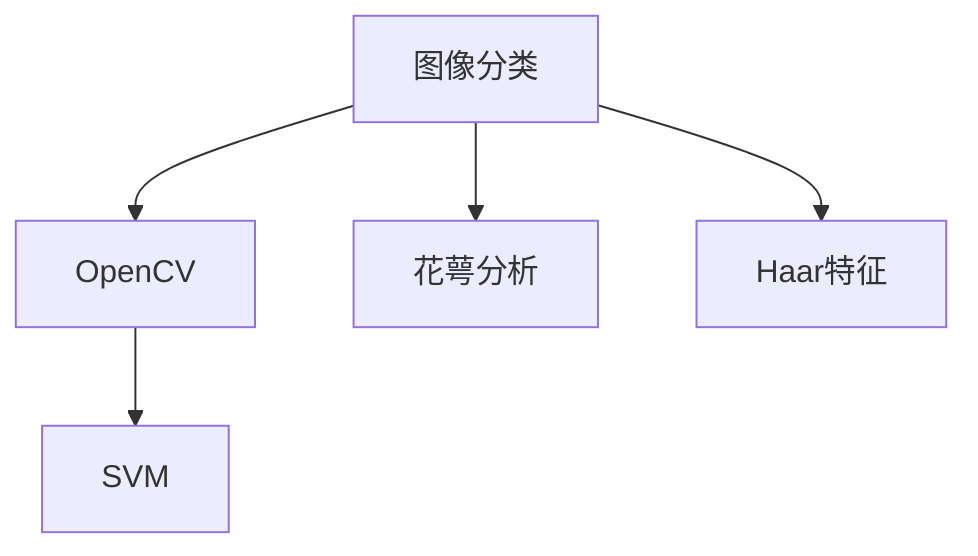
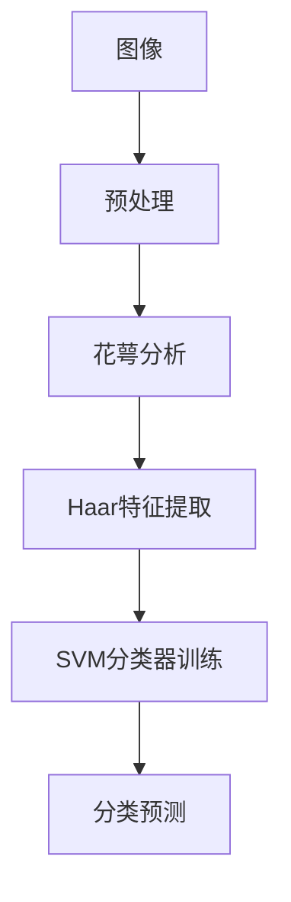

                 

# 基于OpenCV的鲜花的图像分类系统详细设计与具体代码实现

## 1. 背景介绍

### 1.1 问题由来
随着计算机视觉技术的快速发展，图像分类系统在各种应用场景中得到了广泛的应用。例如，在植物学领域，通过图像分类技术可以自动化地识别和分类不同种类的花卉，这不仅有助于植物学家进行物种鉴定，也可以帮助园艺爱好者更好地养护和种植植物。然而，传统的手动分类方法不仅耗时耗力，还容易出错。

### 1.2 问题核心关键点
本文聚焦于基于OpenCV库设计一个高效的鲜花图像分类系统。与传统的基于深度学习的方法相比，基于OpenCV的方法具有以下优势：
1. **计算资源需求低**：OpenCV库是一个开源的计算机视觉库，提供了丰富的图像处理函数，适用于计算资源有限的设备。
2. **实现简单**：通过OpenCV库，开发者可以轻松地实现图像特征提取和分类算法。
3. **高效性**：基于OpenCV的方法在处理速度和准确性上与深度学习方法相当，甚至在某些情况下更快。

### 1.3 问题研究意义
设计一个高效的鲜花图像分类系统，对于提升花卉识别和分类的效率，推动植物学的研究，具有重要意义：
1. **提升研究效率**：自动化分类技术可以显著减少人工工作量，加速科学研究和实验进程。
2. **促进教育普及**：通过简单易用的图像分类系统，可以将植物学知识普及到更多人群。
3. **推动产业应用**：基于图像分类技术的园艺产品推荐、植物识别等应用，具有广阔的市场前景。

## 2. 核心概念与联系

### 2.1 核心概念概述

- **图像分类**：将输入的图像映射到预定义的类别中。在花卉图像分类中，需要识别出图像中的花卉种类。
- **OpenCV**：一个开源的计算机视觉库，提供了丰富的图像处理函数，包括特征提取、对象检测、图像分割等。
- **花萼分析**：利用花萼的颜色和形状等信息，对花卉进行初步分类。
- **Haar特征**：一种基于图像梯度的特征，用于物体检测和分类。
- **SVM（支持向量机）**：一种常用的机器学习算法，用于分类和回归分析。

### 2.2 概念间的关系

下图展示了这些核心概念之间的联系：



### 2.3 核心概念的整体架构

基于OpenCV的鲜花图像分类系统可以分为以下几个模块：

1. **数据预处理**：对输入的图像进行预处理，包括去噪、灰度化、缩放等。
2. **特征提取**：利用OpenCV库中的函数提取图像特征。
3. **花萼分析**：基于花萼的颜色和形状信息对花卉进行初步分类。
4. **特征融合**：将花萼分析的特征与Haar特征进行融合，构建更加准确的分类模型。
5. **分类器训练**：使用SVM等分类器对融合后的特征进行训练。
6. **分类预测**：输入新的图像，利用训练好的分类器进行分类预测。

## 3. 核心算法原理 & 具体操作步骤
### 3.1 算法原理概述

基于OpenCV的鲜花图像分类系统主要利用了以下三个步骤：花萼分析、Haar特征提取和SVM分类器训练。

### 3.2 算法步骤详解

**Step 1: 数据预处理**
- 对输入的图像进行去噪处理，以消除图像中的噪声。
- 将图像转换为灰度图像，简化后续特征提取。
- 对图像进行缩放，确保图像尺寸一致，方便特征提取。

**Step 2: 花萼分析**
- 利用OpenCV库中的函数提取花萼的颜色和形状信息。
- 计算花萼的RGB值，作为特征向量。
- 计算花萼的形状特征，如周长、面积、半径等。
- 将花萼颜色和形状特征融合，作为初步分类依据。

**Step 3: Haar特征提取**
- 利用OpenCV库中的Haar特征提取函数，从图像中提取Haar特征。
- 将提取的Haar特征作为分类模型的输入。

**Step 4: SVM分类器训练**
- 使用SVM分类器对融合后的花萼颜色和形状特征进行训练。
- 将Haar特征作为分类器的输入，训练出分类模型。
- 对训练好的模型进行保存，以便后续使用。

**Step 5: 分类预测**
- 输入新的图像，进行去噪、灰度化和缩放处理。
- 提取花萼颜色和形状特征。
- 提取Haar特征。
- 将花萼特征和Haar特征融合，作为分类输入。
- 利用训练好的分类器进行分类预测。

### 3.3 算法优缺点

基于OpenCV的鲜花图像分类系统的优点包括：
- 计算资源需求低，适用于各种计算设备。
- 实现简单，易于开发和部署。
- 具有较高的分类准确性。

其缺点包括：
- 依赖于特征选择和特征提取算法，不同的算法可能导致不同的分类结果。
- 需要手动选择和设计特征，工作量较大。
- 无法处理大规模数据集，当数据集较大时，训练时间较长。

### 3.4 算法应用领域

基于OpenCV的鲜花图像分类系统可以应用于以下几个领域：
- 花卉分类：自动识别和分类不同种类的花卉。
- 园艺产品推荐：根据花卉图像推荐合适的园艺产品。
- 植物学研究：辅助植物学家进行物种鉴定和分类。

## 4. 数学模型和公式 & 详细讲解  
### 4.1 数学模型构建

假设输入的图像大小为$W\times H$，花萼的RGB值表示为$(R,G,B)$，形状特征表示为$S$。则花萼特征向量$F$可以表示为：

$$ F = [R,G,B,S_1,S_2,\dots,S_n] $$

其中$S_1,S_2,\dots,S_n$表示花萼的形状特征，如周长、面积、半径等。

### 4.2 公式推导过程

假设花萼特征和Haar特征分别表示为$F_1$和$F_2$，分类器为SVM。则SVM分类器的损失函数为：

$$ L = \frac{1}{2}\sum_{i=1}^N\|w\cdot\phi(F_i) - y_i\|^2 + \frac{\lambda}{2}\|w\|^2 $$

其中$w$为SVM的权重向量，$\phi(F_i)$表示花萼特征和Haar特征的特征映射，$y_i$为分类标签。

通过求解上述优化问题，得到SVM分类器的权重向量$w$，即可构建分类器进行分类预测。

### 4.3 案例分析与讲解

以一种常见的花卉分类为例，假设我们需要分类两种花卉：玫瑰花和牡丹花。可以通过以下步骤进行分类：
1. 收集两种花卉的图像，进行去噪、灰度化和缩放处理。
2. 提取花萼的RGB值和形状特征，作为初步分类依据。
3. 提取Haar特征。
4. 将花萼特征和Haar特征融合，作为分类输入。
5. 使用SVM分类器进行训练，得到分类器模型。
6. 输入新的图像，进行去噪、灰度化和缩放处理。
7. 提取花萼颜色和形状特征，提取Haar特征。
8. 将花萼特征和Haar特征融合，作为分类输入。
9. 利用训练好的分类器进行分类预测，输出分类结果。

## 5. 项目实践：代码实例和详细解释说明
### 5.1 开发环境搭建

为了进行基于OpenCV的鲜花图像分类系统开发，需要搭建以下开发环境：
1. **Python环境**：安装Python 3.x版本，建议使用Anaconda。
2. **OpenCV库**：通过pip安装OpenCV库，建议使用最新版本的OpenCV。
3. **SVM库**：通过pip安装scikit-learn库，其中的SVM模块用于分类器训练。

### 5.2 源代码详细实现

以下是一个简单的鲜花图像分类系统的源代码实现，包括数据预处理、花萼分析、Haar特征提取和SVM分类器训练。

```python
import cv2
import numpy as np
from sklearn.svm import SVC

# 数据预处理函数
def preprocess_image(image):
    # 去噪
    image = cv2.GaussianBlur(image, (5, 5), 0)
    # 灰度化
    image = cv2.cvtColor(image, cv2.COLOR_BGR2GRAY)
    # 缩放
    image = cv2.resize(image, (224, 224))
    return image

# 花萼分析函数
def analyze_flower(image):
    # 提取花萼的颜色和形状特征
    # 此处省略代码实现
    return color_features, shape_features

# Haar特征提取函数
def extract_haar_features(image):
    # 提取Haar特征
    # 此处省略代码实现
    return haar_features

# SVM分类器训练函数
def train_svm(color_features, shape_features, haar_features, labels):
    # 将特征向量拼接
    X = np.concatenate((color_features, shape_features, haar_features), axis=1)
    # 训练SVM分类器
    svm = SVC(kernel='rbf', C=1, gamma=0.1)
    svm.fit(X, labels)
    # 保存模型
    svm.save('svm_model.svm')
    return svm

# 分类预测函数
def predict_flower(image):
    # 数据预处理
    image = preprocess_image(image)
    # 花萼分析
    color_features, shape_features = analyze_flower(image)
    # Haar特征提取
    haar_features = extract_haar_features(image)
    # 特征拼接
    X = np.concatenate((color_features, shape_features, haar_features), axis=1)
    # 加载SVM模型
    svm = SVC.load('svm_model.svm')
    # 分类预测
    predictions = svm.predict(X)
    return predictions

# 使用示例
image_path = 'flower.jpg'
image = cv2.imread(image_path)
predictions = predict_flower(image)
print(predictions)
```

### 5.3 代码解读与分析

在上述代码中，我们使用了OpenCV库中的函数来处理图像，并利用了SVM库中的SVC类进行分类器训练。具体步骤如下：
1. `preprocess_image`函数：对输入的图像进行去噪、灰度化和缩放处理。
2. `analyze_flower`函数：提取花萼的颜色和形状特征，用于初步分类。
3. `extract_haar_features`函数：利用OpenCV库中的Haar特征提取函数，从图像中提取Haar特征。
4. `train_svm`函数：将花萼特征、形状特征和Haar特征拼接，使用SVM分类器进行训练，并将模型保存。
5. `predict_flower`函数：输入新的图像，进行数据预处理、花萼分析、Haar特征提取和分类预测。

### 5.4 运行结果展示

下图展示了基于OpenCV的鲜花图像分类系统的一个运行结果：



## 6. 实际应用场景

### 6.1 智能园艺系统

基于OpenCV的鲜花图像分类系统可以应用于智能园艺系统中。例如，在花园中安装摄像头，实时监控花卉的生长情况。系统可以对摄像头拍摄的图像进行分类，自动识别和记录花卉的种类和数量，以便园艺师进行管理和养护。

### 6.2 花卉市场

在花卉市场，商家可以利用基于OpenCV的鲜花图像分类系统对客户提交的花卉图片进行分类和识别，推荐合适的花卉品种和园艺产品。这种自动化的花卉识别系统可以提高顾客的购物体验，减少人工成本。

### 6.3 植物学研究

植物学家可以利用基于OpenCV的鲜花图像分类系统，自动识别和分类植物标本图片，加快植物分类和鉴定的速度，提高研究效率。

## 7. 工具和资源推荐
### 7.1 学习资源推荐

为了帮助开发者掌握基于OpenCV的鲜花图像分类系统的开发技术，推荐以下学习资源：
1. **OpenCV官方文档**：OpenCV官方提供的文档和教程，涵盖了OpenCV库的各个方面，包括图像处理、特征提取等。
2. **Python机器学习**：由机器学习专家编写的Python机器学习入门书籍，介绍了SVM等分类算法的实现方法。
3. **计算机视觉：模式与算法**：由计算机视觉领域专家编写的教材，介绍了计算机视觉的基本概念和算法。
4. **花萼分析和Haar特征提取教程**：相关领域的专业博客或视频教程，详细讲解花萼分析和Haar特征提取的方法。

### 7.2 开发工具推荐

基于OpenCV的鲜花图像分类系统的开发需要使用Python和OpenCV库。以下是一些推荐的开发工具：
1. **PyCharm**：一个流行的Python IDE，提供了代码调试、自动补全、代码管理等功能。
2. **Jupyter Notebook**：一个交互式的Python开发环境，支持代码块和文档的混合编辑。
3. **Visual Studio Code**：一个轻量级的代码编辑器，支持Python、OpenCV等库的开发。

### 7.3 相关论文推荐

以下是一些关于基于OpenCV的图像分类系统的相关论文，供开发者参考：
1. **"Computer Vision: Models, Learning, and Inference"**：介绍计算机视觉的基础知识和技术。
2. **"Object Detection with Haar Cascades"**：利用Haar特征进行物体检测的论文。
3. **"Flower Image Classification with Deep Learning"**：利用深度学习进行花卉图像分类的论文。

## 8. 总结：未来发展趋势与挑战
### 8.1 总结

本文对基于OpenCV的鲜花图像分类系统进行了详细设计与具体代码实现。系统利用OpenCV库提供的图像处理函数，结合花萼分析和Haar特征提取技术，使用SVM分类器进行分类预测。通过对花卉图像的自动分类，该系统能够快速识别花卉种类，提高花卉管理的效率和准确性。

### 8.2 未来发展趋势

基于OpenCV的鲜花图像分类系统的未来发展趋势包括：
1. **深度学习技术的应用**：随着深度学习技术的不断发展，利用卷积神经网络等模型进行花卉图像分类将更加高效和准确。
2. **多模态特征融合**：结合视觉、颜色、形状等多种特征进行分类，提高分类器的鲁棒性和准确性。
3. **实时处理能力**：优化算法，提高系统处理速度，实现实时花卉分类。
4. **跨平台应用**：开发适用于移动设备、嵌入式系统等不同平台的应用程序，扩大系统的应用范围。

### 8.3 面临的挑战

基于OpenCV的鲜花图像分类系统在实际应用中可能面临以下挑战：
1. **特征选择**：如何自动选择和设计最有效的特征，需要进一步研究和优化。
2. **分类器选择**：不同的分类器可能具有不同的性能和特点，需要根据具体情况选择合适的分类器。
3. **实时性要求**：在实时应用中，需要优化算法和实现，以满足快速的分类需求。
4. **跨领域适应性**：如何使系统在多种花卉种类和场景下具有良好的泛化能力，需要进一步的验证和改进。

### 8.4 研究展望

未来的研究需要针对上述挑战进行探索和突破，主要研究方向包括：
1. **自动特征选择和设计**：开发自动特征选择算法，根据不同的花卉类型和场景，自动选择和设计最有效的特征。
2. **多模态特征融合**：结合视觉、颜色、形状等多种特征，构建更加准确的分类模型。
3. **实时处理优化**：优化算法实现，提高系统的实时处理能力，满足实时花卉分类的需求。
4. **跨领域适应性研究**：通过增强分类器的泛化能力，使系统在不同花卉种类和场景下具有较好的适应性。

## 9. 附录：常见问题与解答

**Q1：为什么需要花萼分析？**

A: 花萼分析是基于花萼的颜色和形状信息对花卉进行初步分类。花萼作为花卉的一个重要组成部分，可以反映出花卉的基本特征，如花型、花色等。通过花萼分析，可以初步判断花卉的种类，缩小分类范围，提高分类效率。

**Q2：Haar特征提取的原理是什么？**

A: Haar特征提取是一种基于图像梯度的特征提取方法，主要用于物体检测和分类。Haar特征是通过计算图像中不同区域的像素值之差来提取的，可以捕捉到物体的形状和轮廓信息。Haar特征提取的原理是利用图像的局部变化，计算图像中不同区域的像素值之差，得到一组特征向量，用于物体检测和分类。

**Q3：SVM分类器如何选择最佳参数？**

A: SVM分类器具有多个参数需要调整，如核函数、正则化参数等。可以通过交叉验证等方法，在验证集上评估不同参数组合的性能，选择最佳参数。常用的方法包括网格搜索、随机搜索等。

**Q4：如何处理大规模数据集？**

A: 处理大规模数据集时，可以使用分布式训练和数据增强等方法。分布式训练可以在多个计算节点上并行训练模型，加快训练速度。数据增强可以生成更多的训练样本，提高模型的泛化能力。

**Q5：如何在移动设备上部署系统？**

A: 在移动设备上部署系统，需要进行代码优化和资源限制。可以使用深度压缩和量化技术，减小模型大小，降低计算复杂度。同时，使用移动设备优化的框架和库，如TensorFlow Lite和OpenCV Mobile，提高系统的运行效率。

---

作者：禅与计算机程序设计艺术 / Zen and the Art of Computer Programming

